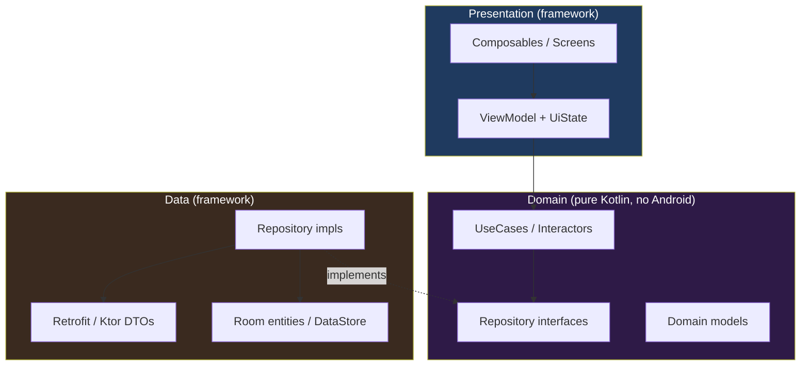

# Clean Architecture on Android

Clean Architecture is not three folders named `presentation`, `domain`, `data`. It is **one rule** — dependencies point inward, toward stable business rules — plus the discipline to keep framework details at the edges. Everything worth defending in an interview comes from that rule. Everything that gets it a bad reputation comes from applying it as a template without charging for the cost.

## The layered model



The arrows are the whole point. **Presentation and Data both depend on Domain; Domain depends on nothing.** The `RepoImpl -. implements .-> RepoIf` arrow is the dependency inversion that makes this work: the interface lives in `domain`, the implementation lives in `data`, so the compile-time dependency points *inward* even though the call at runtime flows *outward*.

## The dependency rule

!!! warning "The one rule to defend"
    Source code dependencies point **only** inward. An inner layer must not know the name of any type defined in an outer layer. Domain must not import `android.*`, Retrofit, Room, or a Composable. If you cannot compile your `domain` module with zero Android dependencies, you do not have a domain layer — you have a package named `domain`.

The payoff is concrete: swap Retrofit for Ktor and no ViewModel changes. Rewrite the UI in Compose and no business rule changes. Test the entire domain on the JVM with no Robolectric, no emulator, no `Dispatchers.Main`.

## What belongs in each layer

| Layer | Owns | Never contains | Depends on |
|---|---|---|---|
| **Presentation** | ViewModels, `UiState`, Composables, navigation, formatting for display | Business rules, network/DB calls | Domain |
| **Domain** | UseCases, repository *interfaces*, domain models, pure business logic | `android.*`, DTOs, Room, `Context`, framework threading | Nothing |
| **Data** | Repository *implementations*, DTOs, Room entities, DataStore, mappers, caching policy | UI concepts, `UiState`, navigation | Domain |

The tell for a misplaced responsibility: if formatting a date for the user lives in the repository, or a discount-eligibility rule lives in a Composable, the boundary has leaked.

## UseCases / Interactors: when they earn their keep

This is the single most common senior debate. A UseCase is a single-responsibility class — `GetCartTotalUseCase`, `ObserveUnreadCountUseCase` — that wraps one piece of business logic.

!!! tip "When UseCases earn their keep"
    - **Non-trivial logic** that would otherwise bloat the ViewModel — combining multiple repositories, applying rules, orchestrating a transaction.
    - **Reuse** across two or more ViewModels (the same "add to cart" rule from the list screen and the detail screen).
    - **A hard team convention** where every ViewModel talks to domain only through UseCases, so nobody has to think about where logic goes.

!!! warning "When UseCases are pure ceremony"
    A UseCase whose entire body is `repository.getUser(id)` is a pass-through. It adds a file, an injection, a test, and a layer of indirection to buy **nothing**. If 80% of your UseCases just forward one call, delete them and let the ViewModel call the repository directly. A senior charges for indirection; a junior adds it to match a diagram.

The defensible middle position: *allow* ViewModels to call repositories directly, and *introduce* a UseCase the moment logic exceeds one call or needs reuse. Consistency-purists will push back — that is the follow-up, and "I optimize for the reader deleting a file, not for symmetry" is a fine answer.

## Repository pattern

The repository is the seam between domain and the messy outside world. Its job is to present a clean, domain-shaped API and hide *where the data comes from* — network, cache, disk, or a merge of all three (single source of truth belongs here).

```kotlin
// domain/ — the interface, pure Kotlin
interface UserRepository {
    fun observeUser(id: UserId): Flow<User>
    suspend fun refreshUser(id: UserId): Result<Unit>
}

// data/ — the implementation, framework-aware
class DefaultUserRepository(
    private val api: UserApi,          // Retrofit
    private val dao: UserDao,           // Room
    private val mapper: UserMapper,
) : UserRepository {

    // Room is the single source of truth; UI observes the DB, never the network directly.
    override fun observeUser(id: UserId): Flow<User> =
        dao.observe(id.value).map(mapper::entityToDomain)

    override suspend fun refreshUser(id: UserId): Result<Unit> = runCatching {
        val dto = api.getUser(id.value)          // network
        dao.upsert(mapper.dtoToEntity(dto))      // write-through to SSOT
    }
}
```

!!! example "Why observe the DB, not the network"
    Returning `Flow<User>` from Room and writing network results *through* the DB gives you offline support, one consistent copy of the truth, and automatic UI updates on refresh — for free. Returning the network response directly makes the network the source of truth and guarantees the UI and cache will drift apart.

## Mapping between layer models

Each layer owns its own model, and you map at the boundaries: **DTO** (wire shape, nullable, versioned by the backend) → **Entity** (storage shape, indices, `@PrimaryKey`) → **Domain** (business shape, non-null, value types like `UserId`) → **UI** (display shape, pre-formatted strings, `@Immutable`).

| Model | Layer | Optimized for |
|---|---|---|
| DTO | Data | Matching the JSON contract; tolerant of backend nulls |
| Entity | Data | Storage, migrations, query performance |
| Domain | Domain | Business invariants, type safety, no framework types |
| UI model | Presentation | Rendering — formatted text, resource ids, flags |

!!! note "Is the mapping worth it?"
    Interviewers will ask "isn't that a lot of boilerplate?" Yes — and it buys **decoupling from a backend you do not control**. When the API renames a field or splits an endpoint, the blast radius stops at the DTO and its mapper. Skip the mapping and a backend rename ripples into your Composables. On a small app with a backend you own, collapsing DTO and domain into one model is a legitimate call — say so.

## Android-specific pitfalls

!!! warning "Context leaking into domain"
    The instant a UseCase or domain model takes a `Context`, `Resources`, or a `@StringRes Int`, the domain layer is no longer pure and no longer JVM-testable. Resolve strings and resources in the presentation layer. Domain returns a *typed* result (`InsufficientFunds`, a `Money` value); the ViewModel maps it to a user-facing string. This keeps localization and framework concerns at the edge where they belong.

!!! warning "God ViewModels"
    A `MainViewModel` with 40 fields, 15 injected dependencies, and every screen's state is the most common real-world architecture failure. It is unmergeable (everyone touches it), untestable (too many collaborators), and unreasonable. The fix is **scoping**: one ViewModel per screen/feature, logic pushed into UseCases, shared state hoisted to a scoped repository — not a bigger ViewModel.

Consuming a UseCase from a ViewModel, cleanly:

```kotlin
class ProfileViewModel(
    private val observeUser: ObserveUserUseCase,
    private val refreshUser: RefreshUserUseCase,
    private val userId: UserId,
) : ViewModel() {

    val uiState: StateFlow<ProfileUiState> =
        observeUser(userId)
            .map { ProfileUiState.Success(it) as ProfileUiState }
            .catch { emit(ProfileUiState.Error(it.toUserMessage())) }
            .stateIn(
                scope = viewModelScope,
                started = SharingStarted.WhileSubscribed(5_000),
                initialValue = ProfileUiState.Loading,
            )

    fun onRefresh() = viewModelScope.launch {
        refreshUser(userId) // errors surface through the observed Flow above
    }
}
```

The ViewModel orchestrates and shapes state for the UI. It contains no business rule, no network call, and no `Context`. That is the target.
