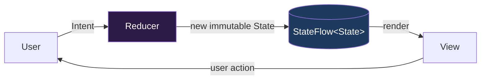

# MVVM vs MVI vs UDF

These three are not competitors on the same axis, and conflating them is the fastest way to sound junior. **UDF is a principle.** **MVVM and MVI are patterns that can both implement it.** A senior answer starts by untangling that.

## Precise definitions

**UDF (Unidirectional Data Flow)** — a data-movement principle: state flows down (from a single owner to the UI) and events flow up (from the UI back to the owner). The UI never mutates state directly; it emits events and re-renders from whatever new state comes back. It says nothing about classes or files — Compose, MVVM, MVI, and Redux are all ways to realize it.

**MVVM (Model–View–ViewModel)** — a structural pattern. The ViewModel exposes observable state and holds methods the View calls. Classic MVVM allows **multiple independent observable fields** and imperative method calls. It *can* be unidirectional (one `StateFlow<UiState>` + event methods) or it can drift into two-way binding and scattered mutable fields — the pattern does not force the discipline.

**MVI (Model–View–Intent)** — a stricter pattern that *forces* UDF. It has three non-negotiables:

1. **Single immutable state** — one `data class` describing the entire screen, replaced wholesale on every change.
2. **Intents/events** — every user action is a value (`sealed interface Intent`) sent into one entry point.
3. **A reducer** — a `(State, Intent) -> State` function (or event-to-state transform) that is the *only* place state changes.



## The comparison

| Axis | MVVM | MVI | UDF (principle) |
|---|---|---|---|
| What it is | Structural pattern | Structural pattern | Data-flow principle |
| State shape | One or many observables | Exactly one immutable state | Down-only, single owner |
| Mutation site | Anywhere in the ViewModel | Only the reducer | One owner |
| Impossible states | Possible (flags can contradict) | Prevented by design | — |
| Boilerplate | Low | High (intents, reducer, effects) | — |
| Replay / time-travel | Hard | Natural (state is a value stream) | — |
| Best fit | Simple/medium screens | Complex, stateful, many interactions | Everything |

!!! note "The reframe that scores points"
    "MVVM vs MVI" is often a trap. The right answer: *"I always want UDF. The question is how much structure I need to enforce it. MVVM with a single `StateFlow<UiState>` is UDF with low ceremony. MVI is UDF with guardrails that pay off when the screen is complex enough that impossible states become real bugs."*

## MVI pros and cons

!!! tip "MVI pros"
    - **No impossible states** — you cannot be `isLoading = true` and `error != null` at once if the state is a sealed hierarchy.
    - **Replayable & debuggable** — the screen is a stream of state values; log them, diff them, reproduce a bug from a captured sequence.
    - **Trivially testable** — the reducer is a pure function. Feed `(state, intent)`, assert the output. No mocks, no coroutines.
    - **Single entry point** — every action goes through `onIntent`, so behavior is discoverable in one place.

!!! warning "MVI cons"
    - **Boilerplate** — sealed intents, a state class, a reducer, and a separate effects channel for *every* screen, even a static settings page.
    - **Verbosity for trivial screens** — a screen with two buttons does not need a reducer; you have added ceremony for zero safety gain.
    - **Whole-state copies** — `state.copy(...)` on a large state object on every keystroke; usually fine, occasionally a real allocation cost in hot paths.

## When to pick which

- **MVVM (single-state)** — the default. Most screens. Medium complexity, a handful of interactions, a small team. Cheapest path to UDF.
- **MVI** — complex, highly interactive screens (a multi-step form, an editor, a media player, a search with filters/pagination), or a team that wants one enforced convention across a large codebase. The guardrails earn their cost.
- **Two-way-binding MVVM** — essentially never in modern Compose. It fights UDF and reintroduces the "who mutated this?" bug class.

## The same screen, both styles

### MVVM style

```kotlin
data class LoginUiState(
    val email: String = "",
    val password: String = "",
    val isSubmitting: Boolean = false,
    val error: String? = null,
)

class LoginViewModel(private val login: LoginUseCase) : ViewModel() {

    private val _state = MutableStateFlow(LoginUiState())
    val state: StateFlow<LoginUiState> = _state.asStateFlow()

    fun onEmailChange(value: String) = _state.update { it.copy(email = value) }
    fun onPasswordChange(value: String) = _state.update { it.copy(password = value) }

    fun onSubmit() = viewModelScope.launch {
        _state.update { it.copy(isSubmitting = true, error = null) }
        login(_state.value.email, _state.value.password)
            .onSuccess { _state.update { s -> s.copy(isSubmitting = false) } }
            .onFailure { e -> _state.update { s -> s.copy(isSubmitting = false, error = e.toUserMessage()) } }
    }
}
```

Multiple event methods, one state object. Clean, low-ceremony, unidirectional. Note the latent risk: nothing *stops* a future edit from setting `isSubmitting = true` and `error = "..."` together.

### MVI style — same screen

```kotlin
data class LoginState(
    val email: String = "",
    val password: String = "",
    val isSubmitting: Boolean = false,
    val error: String? = null,
)

sealed interface LoginIntent {
    data class EmailChanged(val value: String) : LoginIntent
    data class PasswordChanged(val value: String) : LoginIntent
    data object Submit : LoginIntent
}

// One-off events that must NOT live in state (see below).
sealed interface LoginEffect {
    data object NavigateHome : LoginEffect
    data class ShowToast(val message: String) : LoginEffect
}

class LoginViewModel(private val login: LoginUseCase) : ViewModel() {

    private val _state = MutableStateFlow(LoginState())
    val state: StateFlow<LoginState> = _state.asStateFlow()

    private val _effects = Channel<LoginEffect>(Channel.BUFFERED)
    val effects: Flow<LoginEffect> = _effects.receiveAsFlow()

    fun onIntent(intent: LoginIntent) {
        when (intent) {
            is LoginIntent.EmailChanged -> reduce { copy(email = intent.value) }
            is LoginIntent.PasswordChanged -> reduce { copy(password = intent.value) }
            LoginIntent.Submit -> submit()
        }
    }

    private fun submit() = viewModelScope.launch {
        reduce { copy(isSubmitting = true, error = null) }
        login(state.value.email, state.value.password)
            .onSuccess {
                reduce { copy(isSubmitting = false) }
                _effects.send(LoginEffect.NavigateHome)   // one-off, not state
            }
            .onFailure { e -> reduce { copy(isSubmitting = false, error = e.toUserMessage()) } }
    }

    private inline fun reduce(block: LoginState.() -> LoginState) = _state.update(block)
}
```

Single entry point (`onIntent`), single mutation site (`reduce`), and — critically — **one-off effects live in a separate channel, not in the state**.

## Side effects / one-off events (the classic senior gotcha)

The trap: modeling "navigate to home" or "show a toast" as a field in `UiState` (`val navigateHome: Boolean`). On the next recomposition or config change, the UI re-reads the state and **navigates again**. This is the single most common bug in state-driven UIs, and interviewers ask about it on purpose.

| Approach | Behavior on config change | Multiple collectors | Verdict |
|---|---|---|---|
| **Flag in `UiState`** | Re-fires the event (double nav) | — | ❌ Never for one-off events |
| **`Channel` + `receiveAsFlow`** | Buffered, delivered once, survives no-collector gap | ⚠️ Single consumer only | ✅ Default for one-off events |
| **`SharedFlow(replay=0)`** | Event dropped if no active collector | Multiple consumers | ⚠️ Risk of loss on backgrounded UI |
| **Consuming state** (set flag, then null it after handling) | Works but leaks event concerns into state | — | 🟡 Acceptable, uglier |

!!! tip "The senior answer on one-off events"
    "State is for *what to render*; it must be idempotent to re-read. One-off events — navigation, snackbars, toasts — are *not* state, because replaying them is a bug. I use a `Channel` exposed as `receiveAsFlow()` for single-consumer delivery that survives the collector gap during a config change. I reach for `SharedFlow` only when I genuinely need multiple collectors, and I accept its replay/loss semantics. Putting a `navigate` boolean in `UiState` is the anti-pattern — it double-fires on rotation."

Collecting effects in Compose, lifecycle-safe:

```kotlin
@Composable
fun LoginRoute(vm: LoginViewModel, onNavigateHome: () -> Unit) {
    val state by vm.state.collectAsStateWithLifecycle()

    LaunchedEffect(Unit) {
        vm.effects.flowWithLifecycle(lifecycle).collect { effect ->
            when (effect) {
                LoginEffect.NavigateHome -> onNavigateHome()
                is LoginEffect.ShowToast -> /* show snackbar */ Unit
            }
        }
    }
    LoginScreen(state = state, onIntent = vm::onIntent)
}
```
