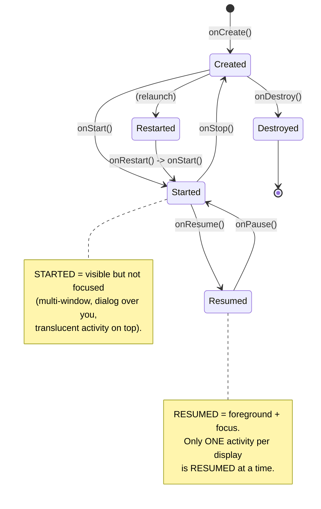
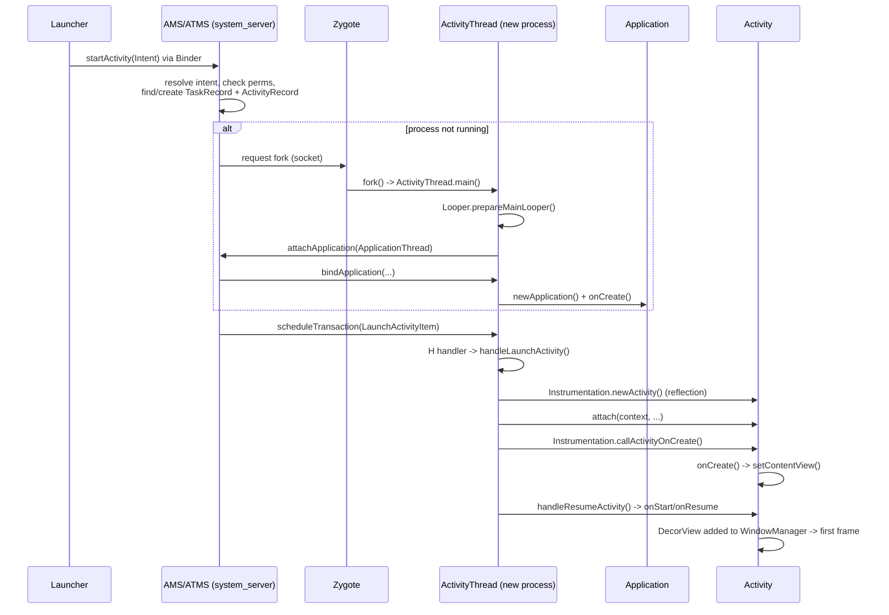

# Activity — Internals & Lifecycle

!!! abstract "Scope"
    This is a senior-level deep dive. It assumes you already know what `onCreate` is. The goal here is to explain *why* the lifecycle is shaped the way it is, *how* the framework drives it internally (ActivityThread, AMS, Zygote), and *where* people lose money in production (process death, launch-mode bugs, mutable `PendingIntent` CVEs). Every section is written to be defensible in a staff-level interview.

---

## Part A — Lifecycle & State

### The seven callbacks, precisely

An `Activity` is a *state machine driven by the system*, not by your code. You never call these; the framework does, in response to user actions and system pressure. Think of each callback as answering "the window's visibility/focus just changed — reconcile your resources."

| Callback | Fires when | You should | Guaranteed pair |
|---|---|---|---|
| `onCreate(Bundle?)` | Instance first created (or recreated after config change / process death) | Inflate UI, bind ViewModels, restore state | `onDestroy` |
| `onStart()` | Activity becoming **visible** | Register visibility-scoped observers (e.g. LiveData is lifecycle-aware) | `onStop` |
| `onResume()` | Activity in **foreground, has input focus** | Start camera, sensors, animations, exclusive resources | `onPause` |
| `onPause()` | Losing focus (dialog, multi-window, another activity partially covering) | Release exclusive resources, **commit nothing slow here** | — |
| `onStop()` | No longer visible | Persist non-trivial state, unregister broadcast receivers, stop location | — |
| `onRestart()` | Coming back from stopped (not from created) | Rare; re-acquire what `onStop` released | — |
| `onDestroy()` | Finishing (`finish()`) or being destroyed for config change | Final cleanup; check `isFinishing()` to distinguish | — |

!!! warning "onPause is not a save point"
    A common senior-interview trap: "where do you save state?" `onPause()` runs on the main thread and *blocks the next activity from resuming until it returns*. Doing disk/DB writes there jank-freezes the transition. Persist in `onStop()` (visibility gone, more time budget) and put *UI reconstruction* state in `onSaveInstanceState()`. Since Android 9 (API 28) `onStop` reliably precedes process death for background apps.

### State diagram



The Lifecycle library (`androidx.lifecycle`) collapses these into five `Lifecycle.State` values — `INITIALIZED, CREATED, STARTED, RESUMED, DESTROYED` — and drives `LifecycleObserver`s and `lifecycleScope` off them. `repeatOnLifecycle(Lifecycle.State.STARTED)` is the modern idiom for collecting flows only while visible.

### Every scenario, mapped to callbacks

!!! example "Callback sequences you must know cold"
    | Scenario | Sequence |
    |---|---|
    | Launch | `onCreate → onStart → onResume` |
    | Press Home | `onPause → onStop` (instance kept) |
    | Return from Home | `onRestart → onStart → onResume` |
    | Press Back (finishes) | `onPause → onStop → onDestroy` (`isFinishing()==true`) |
    | New opaque activity on top | A: `onPause → onStop`; B: `onCreate…onResume` |
    | New **translucent**/dialog activity on top | A: `onPause` **only** (stays visible → still STARTED) |
    | Rotation / config change | `onPause → onStop → onSaveInstanceState → onDestroy → onCreate → onStart → onRestoreInstanceState → onResume` |
    | Enter split-screen (multi-window) | `onPause` (you lose focus but stay visible); focus toggles drive `onPause/onResume` without stop |
    | Process death in background | No callbacks at kill time; on return: `onCreate(savedState) → …` (fresh process) |
    | `finish()` called *inside* `onCreate()` | `onCreate → onDestroy` — **skips `onStart`/`onResume`/`onPause`/`onStop` entirely** |

!!! note "The `finish()`-in-`onCreate()` trap — onDestroy with nothing in between"
    Calling `finish()` from `onCreate()` (a common pattern for a "router" activity that validates an argument or auth state and bails immediately) never lets the activity become visible: it goes straight from `onCreate` to `onDestroy`, skipping `onStart`, `onResume`, `onPause`, and `onStop` — not just the pause/stop pair, the entire visible-lifecycle side. This is the one legitimate case where `onDestroy` runs without ever having been resumed, and it's why `onDestroy` alone is not a safe place to assume any setup work from `onStart`/`onResume` has happened.

!!! note "Multi-window changed the meaning of onPause"
    Pre-multi-window, developers treated `onPause` as "app going to background." That is now wrong. In split-screen two activities are simultaneously **visible**; only the focused one is RESUMED, the other is paused-but-STARTED. Never stop playback/rendering in `onPause` — use `onStop`. This is the single most common lifecycle regression when apps first support multi-window.

### Configuration changes

By default the system **destroys and recreates** the activity on any configuration change it isn't told to handle (rotation, locale, dark-mode toggle, font scale, screen size in multi-window resize). This is deliberate: it forces you to reload configuration-dependent resources (layouts, drawables, strings).

Two ways to cope:

1. **Let it recreate (preferred)** and preserve state via `onSaveInstanceState` + `ViewModel`.
2. **Handle it yourself** via `android:configChanges` in the manifest, which suppresses recreation and instead calls `onConfigurationChanged(newConfig)`.

```xml
<activity
    android:name=".GameActivity"
    android:configChanges="orientation|screenSize|screenLayout|keyboardHidden|uiMode" />
```

!!! warning "configChanges is a footgun, not an optimization"
    Handling `configChanges` yourself means *you* are responsible for re-applying every configuration-dependent resource manually. Miss `uiMode` and your app won't re-theme on dark-mode switch; miss `screenSize` and multi-window resize breaks. Only justify it for surfaces where recreation is genuinely unacceptable (a live GL/camera session, a game render loop). For 95% of screens, recreate + `ViewModel` is correct and less buggy.

### savedInstanceState vs onRetainNonConfigurationInstance vs ViewModel

These three solve overlapping but distinct problems. Knowing the difference is a classic senior filter.

| Mechanism | Survives config change | Survives process death | Serialized? | Size limit | Modern status |
|---|---|---|---|---|---|
| `onSaveInstanceState(Bundle)` | ✅ | ✅ | Yes (Parcel → to `system_server`) | ~1 MB `TransactionTooLargeException` risk; keep KB | Use for **UI reconstruction state only** (scroll pos, text-in-progress, selected id) |
| `ViewModel` (via `ViewModelStore`) | ✅ | ❌ | No (live object in heap) | Heap-bounded | Use for **in-memory screen state** (parsed data, jobs) |
| `onRetainNonConfigurationInstance()` | ✅ | ❌ | No | Heap | **Legacy** — this is literally the primitive `ViewModel` is built on top of |

The mechanics: on a configuration change, the framework calls `onRetainNonConfigurationInstance()`, stashes the returned object in the `ActivityThread`'s `NonConfigurationInstances`, destroys the activity, creates a new one, and hands the object back via `getLastNonConfigurationInstance()`. `ComponentActivity` overrides this to carry the `ViewModelStore` across — *that* is why a `ViewModel` outlives rotation but not process death (the process, and its heap, are gone).

`SavedStateHandle` bridges the gap: it's a `ViewModel`-scoped, `Bundle`-backed map that is written into `onSaveInstanceState`, so it survives *both* rotation and process death. This is the correct home for "the id of the thing the user was looking at."

### Process death & recreation — the part everyone gets wrong

Android kills backgrounded app processes under memory pressure using an **LRU + `oom_adj`** scheme (empty processes first, then background, then services, then visible, then foreground last). Your process can be killed at *any moment* while backgrounded, with **no lifecycle callback at kill time** — `onDestroy` is **not** guaranteed on process death.

When the user returns (taps your icon / recents), the system **recreates the task's top activity in a brand-new process** and calls `onCreate(savedInstanceState)` with the `Bundle` you populated. Everything else — static fields, singletons, unsaved `ViewModel` state, in-flight coroutines — is **gone**.

!!! warning "The definitive test for process-death bugs"
    Enable *Developer Options → Don't keep activities*, or run:
    ```
    adb shell am kill <your.package>    # kills only backgrounded process
    ```
    Then return to the app. If your login/nav/detail screen crashes with an NPE, you stored state in a place that doesn't survive process death (a singleton, a plain field, a `ViewModel` without `SavedStateHandle`). This is the #1 source of "works on my machine, 0.3% ANR/crash in Play Console" bugs.

### Activity vs AppCompatActivity vs ComponentActivity vs FragmentActivity

The class hierarchy is a stack of capabilities:

```
android.app.Activity
   └─ androidx.core.app.ComponentActivity        (+ minimal lifecycle glue)
       └─ androidx.activity.ComponentActivity     (Lifecycle, ViewModelStore, SavedState, OnBackPressedDispatcher, Activity Result API, setContent for Compose)
           └─ androidx.fragment.app.FragmentActivity  (+ FragmentManager)
               └─ androidx.appcompat.app.AppCompatActivity  (+ AppCompat theming, ActionBar backport, vector/night-mode compat)
```

- **`Activity`** — the raw framework class. You almost never extend it directly today; it lacks `ViewModel`, the modern back dispatcher, and the Result API.
- **`androidx.activity.ComponentActivity`** — the base you want for a **pure Jetpack Compose** app. It gives you `setContent {}`, `LifecycleOwner`, `ViewModelStoreOwner`, `SavedStateRegistryOwner`, `OnBackPressedDispatcher`, and `registerForActivityResult` **without** dragging in Fragments or AppCompat.
- **`FragmentActivity`** — adds the `FragmentManager`. Needed only if you host Fragments.
- **`AppCompatActivity`** — adds AppCompat theming, `Theme.AppCompat`/`Theme.Material3` support, night-mode (`AppCompatDelegate`), vector-drawable backports, and the support `ActionBar`. This is the default for View-based apps; it is heavier than you need for Compose-only screens.

!!! tip "Opinion: choose the lowest base that works"
    A Compose-only screen should extend `androidx.activity.ComponentActivity`, not `AppCompatActivity`. AppCompat pulls in the whole theming/ActionBar backport you don't use, and its `Theme.AppCompat` requirement fights with a clean Material3 Compose theme. Reach for `AppCompatActivity` only when you actually need AppCompat night-mode delegation or you're hosting legacy Views/Fragments.

---

## Part B — Internals: how an Activity is actually created

### The cast of characters

| Component | Process | Role |
|---|---|---|
| **Zygote** | `zygote` (started by `init`) | Pre-warmed VM with framework classes + resources preloaded; **forks** to create every app process |
| **ActivityManagerService (AMS)** | `system_server` | Central authority for activities/tasks/processes; owns the back stack, decides launch modes, LRU-kills |
| **ActivityTaskManagerService (ATMS)** | `system_server` | Split out of AMS (Android 10+) to own tasks/activities specifically |
| **ActivityThread** | your app process | The *actual* `main()` entry point of an app process; runs the main-thread message loop; hosts `H` handler that receives lifecycle transactions |
| **Instrumentation** | your app process | The thing that actually calls `activity.performCreate()` etc.; also the seam tests hook into |
| **ApplicationThread** | your app process | Binder stub AMS calls back into; marshals scheduling requests onto `ActivityThread.H` |
| **LoadedApk / Application** | your app process | Your `Application` subclass, created once per process before any component |

### App launch flow: from tap to onCreate



Walking it: the Launcher calls `startActivity`, which is a **Binder** IPC into AMS in `system_server`. AMS resolves the `Intent` (against `PackageManagerService`'s cached intent filters), enforces permissions, and computes the target task per launch mode. If the app process doesn't exist, AMS asks **Zygote** (over a socket) to `fork()`. The child becomes your process and runs `ActivityThread.main()`, which sets up the main `Looper` and calls back into AMS via `attachApplication`. AMS responds with `bindApplication` (creates your `Application`, runs `onCreate`) and then dispatches a **`LaunchActivityItem`** client transaction. On the app's main thread the `ActivityThread.H` handler runs `handleLaunchActivity`, uses `Instrumentation` to **reflectively instantiate** your Activity, calls `attach()` (wiring the `Context`, `Window`, `ActivityThread`), then `callActivityOnCreate()`. Finally `handleResumeActivity` adds the `DecorView` to the `WindowManager` and the first frame renders.

!!! note "Why lifecycle callbacks are always on the main thread"
    They arrive as `ClientTransaction`s posted to `ActivityThread.H`, a `Handler` bound to the main `Looper`. AMS never touches your objects directly across the process boundary — it schedules transactions, and your main-thread message queue serializes them. This is *why* it's safe to touch UI in lifecycle callbacks and *why* blocking in them freezes everything.

!!! tip "Zygote is why app startup is fast (and why you can't change the VM at runtime)"
    Zygote preloads the framework and common classes into a shared, copy-on-write memory image at boot. Forking gives every app that image for free (shared pages until written). It's also why per-app JVM flags aren't a thing — you inherit Zygote's VM. `ART` + baseline/cloud profiles further AOT-compile hot paths.

### How setContentView() works

`setContentView` does **not** create your window. The `Window` already exists.

1. During `attach()`, the framework creates a **`PhoneWindow`** (the sole concrete `Window` impl) for the activity.
2. First call to `getWindow().setContentView()` (or `requestFeature`) lazily **installs the `DecorView`** — the root `FrameLayout` of the entire window. The `DecorView` inflates a *screen layout* chosen from the theme (title bar / action bar / no title / etc.), which contains a `ContentFrameLayout` with id `android.R.id.content`.
3. Your layout is then inflated (via `LayoutInflater`) and added as a child of `android.R.id.content`.

```
PhoneWindow
 └─ DecorView (FrameLayout)                 ← attached to WindowManager
     ├─ (system decorations: status/nav insets, action bar per theme)
     └─ @android:id/content  (ContentFrameLayout)
         └─ YOUR root view / ComposeView    ← what setContentView() fills
```

**LayoutInflater internals:** `inflate(R.layout.x, root, attach)` pulls the compiled binary XML from resources, then walks tags. For each tag it:

- Resolves the class name (`<Button>` → `android.widget.Button`; a `.` in the name → custom view fully-qualified).
- Instantiates it — historically via **reflection** on the two-arg `(Context, AttributeSet)` constructor, cached in a small constructor map. AppCompat installs an `LayoutInflater.Factory2` that intercepts creation to swap `Button`→`AppCompatButton` etc. (that's how tint/vector backports work).
- Parses `AttributeSet` against the view's `styleable` and applies attributes.
- Recurses into children, generating `LayoutParams` from the parent's `generateLayoutParams`.

!!! tip "Why inflation is expensive and Compose avoids it"
    XML inflation is reflection + I/O + attribute parsing on the main thread, per view. That's the cost `AsyncLayoutInflater` / view-holder reuse in RecyclerView exist to amortize. Jetpack Compose sidesteps the whole path: `setContent {}` installs a single `ComposeView` (one real Android view) and everything below is composables emitting to a `LayoutNode` tree — no per-widget reflection, no XML.

### Window & DecorView & WindowManager

- **`Window`** is an abstract policy object; **`PhoneWindow`** is the only implementation. It owns the `DecorView`, the window attributes (`WindowManager.LayoutParams`), features (title, floating, etc.), and callbacks (`Window.Callback`, which the Activity implements — that's how key/touch events reach `onKeyDown`/`dispatchTouchEvent`).
- **`DecorView`** is the top-level view; adding it to the **`WindowManager`** (a proxy to `WindowManagerService` in `system_server`) is what makes the window appear. Input events flow *back* from WMS → `ViewRootImpl` → `DecorView` → your view tree.
- **`ViewRootImpl`** is the bridge between the view hierarchy and WMS; it drives traversals (`measure`/`layout`/`draw`), owns the `Choreographer`-synced frame callbacks, and handles the input pipeline.

### Activity stack management: the records

Inside `system_server`, the hierarchy of bookkeeping objects is:

| Object | Represents | Analogy |
|---|---|---|
| `ActivityRecord` | One activity instance | A card |
| `TaskRecord` / `Task` | A stack of `ActivityRecord`s the user perceives as one "task" | A deck of cards |
| `ActivityStack` / `Task` (root) | A collection of tasks on a display (historically `ActivityStack`; modernized into the `Task`/`WindowContainer` hierarchy in Android 10+) | A table of decks |
| `ActivityDisplay` / `DisplayContent` | Everything on one display | The table |

**Recent Apps** is a rendering of the current tasks: the system keeps a snapshot (thumbnail) taken around `onStop`/`onPause`, plus the `TaskRecord` metadata. Swiping a task away in recents *removes the task and its `ActivityRecord`s* — which is why "recents swipe" behaves like `finishAndRemoveTask()` and can trigger process death, and why over-restoring stale UI on relaunch shows the well-known "stale snapshot flash" (fixable per-app with `setRecentsScreenshotEnabled(false)`).

---

## Part C — Launch modes & tasks

### The four launch modes

Set via `android:launchMode` on `<activity>`, or approximated at call-time with intent flags.

| Mode | New instance created when… | Task | Typical use |
|---|---|---|---|
| `standard` (default) | **Always** — every `startActivity` makes a new instance | Caller's task | Ordinary screens |
| `singleTop` | Only if **not already at the top** of the target task; else `onNewIntent()` on the existing top instance | Caller's task | Search, notification targets, dedupe rapid taps |
| `singleTask` | Only if **no instance exists anywhere**; else routed to existing instance, task brought forward, everything above it cleared (`clearTop`), `onNewIntent()` | Its own task (root, by affinity) | App "main"/home entry, single logical entry point |
| `singleInstance` | Like `singleTask` but the instance is the **only** activity its task may ever contain | Exclusive task | Launcher, telephony, standalone surfaces |
| `singleInstancePerTask` (API 31+) | One instance per task; can be root of multiple tasks (esp. with multi-display / `FLAG_ACTIVITY_MULTIPLE_TASK`) | Per-task root | Multi-instance apps on foldables/desktops |

!!! warning "singleTask ≠ 'singleton per app', and it clears the stack"
    Two senior gotchas: (1) `singleTask`/`singleInstance` create a **new task** based on `taskAffinity`, which surprises people who expect the activity to stay in the caller's task. (2) When a `singleTask` activity is re-invoked, **everything above it in the task is destroyed** to bring it to the top. If you put a mid-flow screen as `singleTask`, re-navigating to it silently nukes the user's progress above it. Reserve it for genuine app entry points.

### Internals: how the target is resolved

When `startActivity` reaches AMS, the "which task / which instance" decision runs roughly:

1. **Resolve the component** (explicit → done; implicit → intent resolution, Part D).
2. **Compute launch mode** = manifest `launchMode` combined/overridden by `Intent` flags (`FLAG_ACTIVITY_NEW_TASK`, `SINGLE_TOP`, `CLEAR_TOP`, etc.).
3. **Determine the task** via **`taskAffinity`**: default affinity = the app's package name. `NEW_TASK` + affinity decides whether to reuse an existing task with matching affinity or start a new one.
4. **Run the activity finder**: for `singleTask`/`singleInstance`, search existing tasks for a matching `ActivityRecord`; if found, reuse it (deliver `onNewIntent`, apply `clearTop`), else create.
5. **Apply flags**: `CLEAR_TOP` finishes activities above the target; `REORDER_TO_FRONT` moves it up without finishing others; `CLEAR_TASK` (with `NEW_TASK`) wipes the task first.

`taskAffinity` is the hidden variable behind most "why did it open in a weird task?" bugs. It's a string; set it to `""` to give an activity no affinity (never groups), or a custom value to group activities into a logical task across apps.

### Intent flags cheat-sheet

| Flag | Effect |
|---|---|
| `FLAG_ACTIVITY_NEW_TASK` | Start in a new/existing task by affinity (required to launch an Activity from a non-Activity `Context`) |
| `FLAG_ACTIVITY_SINGLE_TOP` | Same as `singleTop` for this launch |
| `FLAG_ACTIVITY_CLEAR_TOP` | If instance exists in the task, finish everything above it |
| `FLAG_ACTIVITY_CLEAR_TASK` | (with `NEW_TASK`) clear the whole task before starting — common for logout → login |
| `FLAG_ACTIVITY_REORDER_TO_FRONT` | Bring existing instance to top without recreating |
| `FLAG_ACTIVITY_NO_HISTORY` | Don't keep in back stack; finishes when you leave it |
| `FLAG_ACTIVITY_MULTIPLE_TASK` | (with `NEW_TASK`) force a *new* task even if one exists — multi-window/documents |

```kotlin
// Logout → clear everything, land on Login as the new task root
val intent = Intent(this, LoginActivity::class.java).apply {
    addFlags(Intent.FLAG_ACTIVITY_NEW_TASK or Intent.FLAG_ACTIVITY_CLEAR_TASK)
}
startActivity(intent)
```

### Documents, recents, and reparenting

- **`documentLaunchMode`** (`intoExisting` / `always` / `none` / `neverAllow`) makes each document open as its own entry in Recents (Chrome tabs, Docs files). `always` = a fresh task per launch; pairs with `FLAG_ACTIVITY_NEW_DOCUMENT`.
- **`maxRecents`** caps how many task entries this app keeps in Recents (default 16, max device-dependent).
- **`excludeFromRecents="true"`** hides a task from the Recents screen entirely (transient/utility activities, share targets).
- **`allowTaskReparenting="true"`** lets an activity move from the task that started it to a task with matching `taskAffinity` when that task next comes forward (classic: a browser opens your app's activity; later, launching your app "adopts" that activity into your task).
- **`clearTaskOnLaunch="true"`** wipes the task back to its root activity every time the user re-launches from Home — the task always starts clean.
- **`finishOnTaskLaunch`** finishes this specific activity when its task is relaunched.

```xml
<activity
    android:name=".DocumentActivity"
    android:launchMode="standard"
    android:documentLaunchMode="always"
    android:excludeFromRecents="false"
    android:maxRecents="10"
    android:taskAffinity="com.example.docs.viewer"
    android:allowTaskReparenting="true" />
```

---

## Part D — The Intent system

### Explicit vs implicit

- **Explicit** — names a component (`Intent(this, DetailActivity::class.java)` or `setClassName`). No resolution; fastest; the only safe form for internal navigation and for anything security-sensitive.
- **Implicit** — describes an *action* and lets the system find a handler. Subject to intent resolution and user disambiguation.

!!! warning "Implicit intents to your own components are a security smell"
    Sending an implicit intent to trigger your own internal component lets another app intercept it. For internal messaging use explicit intents (or explicitly set the package). Android 14 (API 34) tightened this: intents that target internal components must be explicit, and `PendingIntent`s are more constrained.

### Anatomy of an Intent

| Field | Meaning | Used in resolution? |
|---|---|---|
| **action** | Verb, e.g. `ACTION_VIEW`, `ACTION_SEND` | ✅ must match a filter's `<action>` |
| **data** (URI) | Subject, e.g. `https://…`, `content://…`, `tel:…` | ✅ matched against `<data>` scheme/host/path |
| **type** (MIME) | e.g. `image/png`, `text/plain` | ✅ matched against `<data>` mimeType |
| **category** | Context, e.g. `CATEGORY_DEFAULT`, `CATEGORY_BROWSABLE` | ✅ every category in the intent must be in the filter |
| **component** | Explicit target | Short-circuits resolution |
| **extras** | `Bundle` payload | ❌ (data, not routing) |
| **flags** | `FLAG_ACTIVITY_*` behavior modifiers | ❌ (behavior, not routing) |

Note `setData()` and `setType()` clear each other — use **`setDataAndType()`** when you need both.

### The intent resolution algorithm

For an implicit intent, `PackageManagerService` matches it against every `<intent-filter>` using a **three-part test**; a filter must pass **all three**:

1. **Action test** — the intent's action must be listed in the filter (a filter with no `<action>` matches nothing).
2. **Category test** — **every** category in the intent must appear in the filter. Crucial subtlety: `startActivity` implicitly adds `CATEGORY_DEFAULT`, so any activity you want reachable implicitly **must** declare `<category android:name="android.intent.category.DEFAULT"/>`.
3. **Data test** — scheme/host/port/path and MIME type must match. Rules cascade: a filter with no `<data>` accepts intents with no data; a filter specifying only a scheme matches any URI with that scheme; etc.

Multiple matches → the system shows a disambiguation chooser (or the user's set default). Ties in priority are otherwise resolved by user choice.

### Intent filters, priority & order

```xml
<activity android:name=".ShareReceiver" android:exported="true">
    <intent-filter android:priority="10" android:order="100">
        <action android:name="android.intent.action.SEND" />
        <category android:name="android.intent.category.DEFAULT" />
        <data android:mimeType="image/*" />
    </intent-filter>
</activity>
```

- **`priority`** (-1000..1000) influences ordering primarily for **broadcast receivers** (higher runs first, can abort ordered broadcasts) and hints preferred activities; the platform reserves high values and ignores abuse.
- **`order`** (API 28+) breaks ties **within a single component's own filters** to pick which filter is preferred — it does *not* rank across apps.
- **`exported`** must be explicit (API 31+ hard requirement) on any component with an intent filter; get it wrong and either the component is unreachable or dangerously open.

### PendingIntent — a token, not an intent

A `PendingIntent` is a **token handed to another app (or the system)** that lets it execute an operation *as your app, with your identity and permissions*, later. Notifications, alarms, widgets, and app-widget clicks all use them.

Creation flags (the *mutability* pair is now mandatory):

| Flag | Meaning |
|---|---|
| `FLAG_IMMUTABLE` | Recipient **cannot** modify the wrapped intent's unfilled fields. **Default choice.** |
| `FLAG_MUTABLE` | Recipient may fill in fields (`fillIn`). Needed for e.g. inline reply, Bubbles, some `RemoteInput` cases. |
| `FLAG_UPDATE_CURRENT` | Reuse the existing matching PI but replace its extras |
| `FLAG_CANCEL_CURRENT` | Cancel any existing matching PI, then create fresh |
| `FLAG_ONE_SHOT` | Usable exactly once, then auto-cancelled |
| `FLAG_NO_CREATE` | Return `null` if no matching PI already exists (probe) |

!!! warning "Android 12+ mutability is mandatory — and mutable PIs are a CVE class"
    On API 31+ you **must** specify either `FLAG_IMMUTABLE` or `FLAG_MUTABLE` or creation throws. Historically, a mutable `PendingIntent` with an *implicit* base intent was a serious vulnerability: a malicious app could receive it and `fillIn` a component to redirect the action back into your app's private components with your permissions ("PendingIntent hijacking"). Rule: **default to `FLAG_IMMUTABLE`**, and if you truly need `FLAG_MUTABLE`, make the base intent **explicit**.

```kotlin
val piFlags = PendingIntent.FLAG_IMMUTABLE or PendingIntent.FLAG_UPDATE_CURRENT

val tapIntent = Intent(context, DetailActivity::class.java).apply {
    putExtra("itemId", itemId)          // explicit target → safe
}
val pendingIntent = PendingIntent.getActivity(
    context,
    requestCode = itemId,               // distinct requestCode ⇒ distinct PI
    tapIntent,
    piFlags,
)
// ...attach to a NotificationCompat.Builder(...).setContentIntent(pendingIntent)
```

!!! note "requestCode + intent 'equality' decides PI identity"
    Two `PendingIntent`s are considered the same (for update/cancel/reuse) if their `requestCode` matches **and** their intents are equal ignoring extras (`filterEquals`: same action/data/type/component/categories). If you reuse the same requestCode for per-item notifications, they clobber each other — vary the requestCode.

### Deep links, app links, and verification (Android 12+)

| | Deep link | Web link | **Verified** Android App Link |
|---|---|---|---|
| Scheme | Any (`myapp://`) | `http(s)` | `https` only |
| Category | `DEFAULT` + `BROWSABLE` | + `BROWSABLE` | + `BROWSABLE`, `autoVerify="true"` |
| Opens directly (no chooser)? | No (may prompt) | No | **Yes**, if verified |
| Requires server file? | No | No | **Yes** — `/.well-known/assetlinks.json` |

App Links are the gold standard: a `https` intent filter with `android:autoVerify="true"`, plus a Digital Asset Links JSON at `https://yourdomain/.well-known/assetlinks.json` listing your package + signing-cert SHA-256. The system verifies ownership and then routes those URLs **straight into your app with no disambiguation dialog**.

!!! warning "Android 12 made link verification strict"
    Pre-12, unverified `autoVerify` links silently fell back to opening a chooser. On **API 31+**, verification failures mean the link **won't** auto-open your app at all, and users must manually enable it in *Settings → Open by default*. Debug with `adb shell pm get-app-links <pkg>` and `pm verify-app-links --re-verify <pkg>`. A malformed `assetlinks.json` (wrong SHA-256 for the *release* signing key — remember Play App Signing re-signs!) is the classic silent failure.

```xml
<intent-filter android:autoVerify="true">
    <action android:name="android.intent.action.VIEW" />
    <category android:name="android.intent.category.DEFAULT" />
    <category android:name="android.intent.category.BROWSABLE" />
    <data android:scheme="https" android:host="example.com" android:pathPrefix="/item" />
</intent-filter>
```

### Intent chooser

`Intent.createChooser()` forces the disambiguation sheet **even if the user has set a default**, and lets you set a title / excluded targets. Use it for share actions so users can pick the target each time.

```kotlin
val send = Intent(Intent.ACTION_SEND).apply {
    type = "text/plain"
    putExtra(Intent.EXTRA_TEXT, "Beat my score in Arrows Out!")
}
startActivity(Intent.createChooser(send, "Share via"))
```

---

## Part E — Results & permissions

### The Activity Result API (replacing onActivityResult)

`startActivityForResult` + `onActivityResult` + `requestPermissions` + `onRequestPermissionsResult` are **deprecated**. They were fragile: giant `when(requestCode)` blocks, results delivered to the wrong place after process death, and no type safety.

The modern **Activity Result API** (`registerForActivityResult`) fixes all three:

- **Type-safe** via `ActivityResultContract<Input, Output>`.
- **Decoupled** — the caller need not be the receiver; contracts encapsulate request/parse.
- **Process-death-safe** — registrations are restored automatically; a result that arrives after your process was rebuilt is still delivered to the re-registered callback.

| Old API | New API |
|---|---|
| `startActivityForResult(intent, RC)` | `launcher.launch(input)` |
| `onActivityResult(rc, res, data)` | callback lambda passed at registration |
| `requestPermissions(perms, RC)` | `RequestPermission` / `RequestMultiplePermissions` contracts |
| Manual `requestCode` bookkeeping | None |

!!! warning "You MUST register during initialization"
    `registerForActivityResult` has to be called **before** the activity/fragment reaches `STARTED` — i.e. as a field initializer or in `onCreate`, never lazily inside a click handler. It hooks into the `SavedStateRegistry`, which is why the registration (and thus the result) survives process death. Registering late throws `LifecycleOwners must call register before they are STARTED`.

```kotlin
class ProfileActivity : ComponentActivity() {

    // 1) Built-in contract: pick an image
    private val pickImage = registerForActivityResult(
        ActivityResultContracts.GetContent()
    ) { uri: Uri? ->
        uri?.let { showAvatar(it) }
    }

    // 2) Built-in contract: single runtime permission
    private val requestCamera = registerForActivityResult(
        ActivityResultContracts.RequestPermission()
    ) { granted: Boolean ->
        if (granted) openCamera() else showRationaleOrSettings()
    }

    // 3) Multiple permissions at once
    private val requestPerms = registerForActivityResult(
        ActivityResultContracts.RequestMultiplePermissions()
    ) { result: Map<String, Boolean> ->
        val allGranted = result.values.all { it }
        if (allGranted) startFeature() else handleDenied(result.filterValues { !it }.keys)
    }

    private fun onPickAvatarClicked() = pickImage.launch("image/*")

    private fun onEnableCameraClicked() {
        when {
            checkSelfPermission(Manifest.permission.CAMERA) == PERMISSION_GRANTED -> openCamera()
            shouldShowRequestPermissionRationale(Manifest.permission.CAMERA) -> showRationale { requestCamera.launch(Manifest.permission.CAMERA) }
            else -> requestCamera.launch(Manifest.permission.CAMERA)
        }
    }

    private fun onEnableAvClicked() =
        requestPerms.launch(arrayOf(Manifest.permission.CAMERA, Manifest.permission.RECORD_AUDIO))
}
```

### Built-in contracts worth knowing

| Contract | Input → Output |
|---|---|
| `StartActivityForResult` | `Intent` → `ActivityResult(resultCode, data)` (escape hatch for arbitrary intents) |
| `RequestPermission` / `RequestMultiplePermissions` | permission(s) → grant map |
| `GetContent` / `OpenDocument` | MIME → content `Uri` (OpenDocument gives persistable access) |
| `TakePicture` / `TakePicturePreview` | target `Uri` → `Boolean` / `Bitmap` |
| `CreateDocument` | filename → `Uri` (SAF) |
| `PickContact` | none → `Uri` |
| `PickVisualMedia` (Photo Picker) | media type → `Uri` (privacy-friendly, no storage permission) |

### Custom contracts

When you own the target and want type-safe input/output, implement `ActivityResultContract`:

```kotlin
class PickLevelContract : ActivityResultContract<Int, LevelResult?>() {
    override fun createIntent(context: Context, input: Int): Intent =
        Intent(context, LevelPickerActivity::class.java).putExtra(EXTRA_PACK_ID, input)

    override fun parseResult(resultCode: Int, intent: Intent?): LevelResult? {
        if (resultCode != Activity.RESULT_OK) return null
        val id = intent?.getIntExtra(EXTRA_LEVEL_ID, -1) ?: return null
        return LevelResult(id, intent.getIntExtra(EXTRA_STARS, 0))
    }
    companion object { const val EXTRA_PACK_ID = "pack"; const val EXTRA_LEVEL_ID = "level"; const val EXTRA_STARS = "stars" }
}

// usage
private val pickLevel = registerForActivityResult(PickLevelContract()) { result ->
    result?.let { startLevel(it.id) }
}
```

!!! tip "The permission flow, correctly"
    The right sequence for a runtime permission: (1) `checkSelfPermission` — already granted? do the thing. (2) `shouldShowRequestPermissionRationale` — the user denied once but didn't tick "don't ask again"? show an in-context rationale, *then* launch. (3) Otherwise launch directly. If a launch returns `false` **and** `shouldShow…` is still `false`, the user has permanently denied — you must route them to app Settings, because the system dialog won't reappear. On Android 11+ a second denial is treated as permanent automatically.

---

## Interview Q&A

!!! question "1. Walk me through what happens between tapping the launcher icon and your `onCreate` running, for an app whose process isn't alive."
    **Answer.** The Launcher issues `startActivity`, a Binder call into **AMS/ATMS** in `system_server`. AMS resolves the intent against `PackageManagerService`, checks permissions, and figures out the target task/launch mode. Since no process exists, AMS asks **Zygote** (over a socket) to `fork()`; the child runs `ActivityThread.main()`, which sets up the main `Looper` and calls `attachApplication` back to AMS. AMS replies with `bindApplication` (instantiating my `Application` and running its `onCreate`), then dispatches a `LaunchActivityItem` **client transaction**. On my main thread, `ActivityThread.H` runs `handleLaunchActivity`, which uses `Instrumentation` to reflectively construct my Activity, calls `attach()` to wire the `Context`/`PhoneWindow`, then `callActivityOnCreate()`. `handleResumeActivity` finally adds the `DecorView` to `WindowManager` and the first frame draws.

    *Follow-up:* Why are all lifecycle callbacks on the main thread even though AMS lives in another process? — Because AMS never touches my objects across the boundary; it posts `ClientTransaction`s to `ActivityThread.H`, a `Handler` on the main `Looper`, which serializes them onto my UI thread.

!!! question "2. What survives a configuration change but not process death, and why?"
    **Answer.** A plain `ViewModel` survives config change but **not** process death. On a config change the framework calls `onRetainNonConfigurationInstance()`, stashes the object (which `ComponentActivity` uses to carry the `ViewModelStore`) in `ActivityThread`, destroys+recreates the activity, and returns it via `getLastNonConfigurationInstance()`. It's an in-heap object handoff — so it dies with the process. To survive process death you need serialized state: `onSaveInstanceState`'s `Bundle` (Parceled to `system_server`) or `SavedStateHandle`, which is a `ViewModel`-scoped map backed by that same saved-state `Bundle`.

    *Follow-up:* Where would you store a 2 MB parsed list vs. the id of the selected row? — The 2 MB list belongs in a `ViewModel` (or repository/cache) and is re-fetched after process death; the selected-row id goes in `SavedStateHandle`/`onSaveInstanceState`. Putting 2 MB in the Bundle risks `TransactionTooLargeException`.

!!! question "3. A user reports that returning to your logged-in app after a while sometimes crashes with an NPE. No stack points to your recent code. What's your hypothesis and how do you reproduce it?"
    **Answer.** Classic **process-death** bug: state was stored somewhere that doesn't survive it — a singleton/static, or a `ViewModel` field populated only from a first-launch intent. While backgrounded, the OS reclaimed the process under memory pressure (no `onDestroy` fired). On return the system rebuilds the top activity in a fresh process and calls `onCreate(savedInstanceState)`, but the singleton is re-initialized empty → NPE. Reproduce with *Developer Options → Don't keep activities*, or `adb shell am kill <pkg>` while backgrounded, then relaunch. Fix by moving the critical id into `SavedStateHandle`/`onSaveInstanceState` and re-deriving the rest.

    *Follow-up:* Why isn't `onDestroy` a reliable place to persist data? — It isn't called on process death (or on `finish()` under some low-memory paths); `onStop` is the last reliably-called visibility callback for persistence.

!!! question "4. Explain `singleTask` and the mutable-`PendingIntent` risk — two features people misuse."
    **Answer.** `singleTask` guarantees one instance app-wide, rooted in its own task by `taskAffinity`; re-invoking it delivers `onNewIntent` and **clears everything above it** in the task. Misused on a mid-flow screen, it silently destroys the user's stack. Reserve it for a single logical entry point. For `PendingIntent`: it's a token letting another process act **with my app's identity**. A **mutable** PI wrapping an **implicit** intent lets a malicious recipient `fillIn` a component and redirect the action into my private components with my permissions — "PendingIntent hijacking." Android 12 makes specifying `FLAG_IMMUTABLE`/`FLAG_MUTABLE` mandatory; the rule is default to `IMMUTABLE`, and if mutable is genuinely required, make the base intent explicit.

    *Follow-up:* When do you legitimately need `FLAG_MUTABLE`? — Inline notification replies / `RemoteInput`, Bubbles, and some system integrations that must fill in fields at send time; keep the base intent explicit in those cases.

!!! question "5. Why did Google deprecate `startActivityForResult`, and how does the Activity Result API fix process-death correctness?"
    **Answer.** The old API relied on manual `requestCode` bookkeeping and a monolithic `onActivityResult`, which was untyped, error-prone, and — critically — couldn't reliably deliver a result if the process was killed while the child activity was foreground. The Activity Result API registers an `ActivityResultContract` through the `SavedStateRegistry` during initialization (before `STARTED`), so the registration key is persisted and **restored on recreation**; when the result arrives after a rebuild, it's routed to the freshly re-registered callback. It's also type-safe (`Contract<Input, Output>`) and decouples the launcher from the parsing logic.

    *Follow-up:* Why must you register the launcher as a field/in `onCreate` and not in a click listener? — Registration hooks the `SavedStateRegistry`, which is only writable before the owner reaches `STARTED`; registering later throws and breaks the process-death restoration guarantee.
