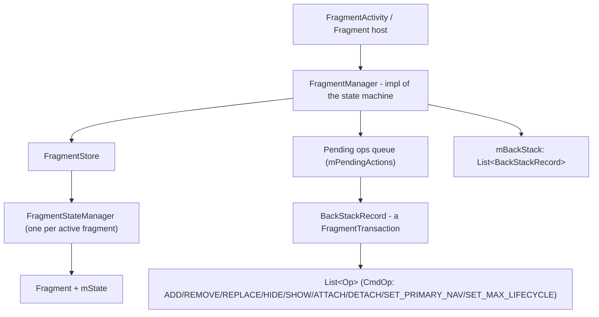
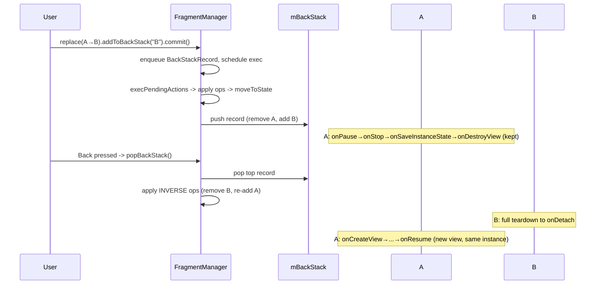

# Fragment — Internals & Lifecycle

!!! abstract "Scope"
    A `Fragment` is a reusable, host-attachable UI/behaviour controller with its **own lifecycle**, its **own view lifecycle**, and its own saved state — orchestrated by a `FragmentManager` state machine. This doc goes past "override `onViewCreated`" into how the manager drives states, how transactions are recorded and executed, how state is saved/restored, and how fragments talk to each other. It targets the AndroidX `androidx.fragment:fragment` library (1.6+), not the deprecated platform `android.app.Fragment`.

---

## Part A — Basics

### A.1 The two lifecycles

The single most important senior-level insight: a fragment has **two** distinct lifecycles.

| Lifecycle | Owner | Span | Use for |
|---|---|---|---|
| **Fragment lifecycle** | `Fragment` (is a `LifecycleOwner`) | `onAttach` → `onDestroy`/`onDetach` | ViewModels, non-view collaborators, retained observers |
| **View lifecycle** | `viewLifecycleOwner` | `onCreateView`/`onViewCreated` → `onDestroyView` | Anything touching views: LiveData, `repeatOnLifecycle`, binding |

A retained/back-stacked fragment can destroy and recreate its **view** many times while the **fragment instance** lives on. Confusing the two is the root cause of the classic LiveData leak (see A.6).

### A.2 Full lifecycle callback order

```mermaid
stateDiagram-v2
    [*] --> onAttach
    onAttach --> onCreate
    onCreate --> onCreateView
    onCreateView --> onViewCreated
    onViewCreated --> onViewStateRestored
    onViewStateRestored --> onStart
    onStart --> onResume
    onResume --> RUNNING
    RUNNING --> onPause
    onPause --> onStop
    onStop --> onSaveInstanceState : (pre-P after onStop; post-P before)
    onStop --> onDestroyView
    onDestroyView --> onDestroy
    onDestroy --> onDetach
    onDetach --> [*]
```

| Callback | What is valid here | Notes |
|---|---|---|
| `onAttach(context)` | Host `Context`/activity available | Earliest point to read `arguments`; fragment not yet created |
| `onCreate(bundle)` | Non-view init, restore fragment state | **No view yet.** Don't touch `requireView()` |
| `onCreateView(inflater, container, bundle)` | Inflate & return the view | Return `null` for no-UI fragments. Don't wire view logic here |
| `onViewCreated(view, bundle)` | View exists, `viewLifecycleOwner` valid | Do all view setup, observe LiveData, set adapters |
| `onViewStateRestored(bundle)` | View hierarchy state (scroll pos, EditText) restored | Restore view-dependent UI state here |
| `onStart()` | Fragment visible | Mirrors activity `onStart` |
| `onResume()` | Fragment interactive & focused | |
| `onPause()` | Losing focus | |
| `onStop()` | No longer visible | |
| `onDestroyView()` | View being torn down | **Null your binding.** `viewLifecycleOwner` is now `DESTROYED` |
| `onDestroy()` | Fragment instance being destroyed | Fragment lifecycle `DESTROYED` |
| `onDetach()` | Host reference dropped | `requireContext()` now throws |

!!! warning "`onDestroyView` vs `onDestroy` — the interview trap"
    They are **not** paired to the same lifecycle. `onDestroyView` can fire repeatedly (every time the fragment goes onto the back stack via `replace()`, or is detached) while `onDestroy` fires **once** at the end. Any `View`/binding reference held past `onDestroyView` is a leak, because the old view tree is gone but the fragment (and your field) survive.

### A.3 Lifecycle by scenario

!!! example "Scenario walkthroughs"
    - **`add()` fragment, then rotate:** full `onDestroyView → onDestroy → onDetach`, then `onAttach → … → onResume` on a **new instance** (unless retained). `onSaveInstanceState` is called before destruction.
    - **`replace()` A with B, `addToBackStack`:** A runs `onPause → onStop → onSaveInstanceState → onDestroyView` — but **NOT** `onDestroy`. A's instance is retained on the back stack with its view torn down. Press back → A runs `onCreateView → … → onResume` again (fresh view, same instance).
    - **`replace()` A with B, NO back stack:** A runs all the way to `onDetach`. Instance is gone.
    - **`hide()`/`show()`:** **no** lifecycle callbacks fire — the fragment stays `RESUMED`, only `View.setVisibility(GONE)` changes and `onHiddenChanged()` is called. Cheap but keeps view + state alive.
    - **`detach()`/`attach()`:** view is destroyed (`onDestroyView`) but instance kept; `attach()` rebuilds the view. Heavier than hide/show, lighter than remove.
    - **Home button (process alive):** `onPause → onStop → onSaveInstanceState`. Return → `onStart → onResume`, same view.
    - **Config-change with `ViewModel`:** fragment recreated but the activity/fragment-scoped `ViewModel` survives (it is not tied to the instance).

### A.4 Fragment states (the `mState` integer)

Internally the fragment tracks a monotonic state constant. The `FragmentManager` moves fragments **one step at a time** toward the target state.

| Constant | Value | Reached at |
|---|---|---|
| `INITIALIZING` | -1/0 | Object constructed, not attached |
| `ATTACHED` | 0 | after `onAttach` |
| `CREATED` | 1 | after `onCreate` |
| `VIEW_CREATED` | 2 | view inflated |
| `AWAITING_EXIT_EFFECTS` / `ACTIVITY_CREATED` | — | historical intermediate |
| `STARTED` | 5 | after `onStart` |
| `RESUMED` | 7 | after `onResume` |

The manager never skips steps; going from `CREATED` to `RESUMED` runs every intermediate transition in order (and the reverse on the way down). `setMaxLifecycle()` caps the top state a fragment may reach (see C.6).

### A.4b Fragment as `LifecycleOwner` — how `Lifecycle.State` is actually dispatched

A `Fragment` implements `LifecycleOwner` and owns a `LifecycleRegistry`. Every framework callback (`onAttach`, `onCreate`, `onStart`, `onResume`, and their inverses) is immediately followed by `mLifecycleRegistry.handleLifecycleEvent(...)`, which moves the registry to the matching `Lifecycle.State` and notifies any `LifecycleObserver`s (`lifecycleScope`, `repeatOnLifecycle`, LiveData). This is *why* `lifecycleScope`/observer callbacks fire in lockstep with the callback table above — they aren't polling anything, they're notified synchronously as part of the same `moveToState()` step that just invoked your callback.

The clamp that matters for nesting: `FragmentManager.moveToState()` computes each fragment's target as `min(fragment's own max target, setMaxLifecycle cap, host's current Lifecycle.State)`. A fragment can never be pushed to a state its host hasn't reached — a fragment attached to a `STARTED` (not yet `RESUMED`) host is itself capped at `STARTED` regardless of what the fragment "wants." This single `min()` is also what makes `childFragmentManager` nesting correct: a child fragment's registry is clamped by its **parent fragment's** Lifecycle state, which is itself clamped by the host Activity's — so a chain of nested fragments always trails the outermost host by construction, never leads it.

### A.5 `setArguments()` vs a parameterized constructor

!!! danger "Never write a parameterized fragment constructor"
    The system **recreates fragments reflectively using the no-arg constructor** on configuration change and process death (`FragmentFactory.instantiate` → `Class.newInstance()`). Any data you passed to a custom constructor is **gone** after recreation, and older runtimes throw `InstantiationException` / `Fragment ... could not be instantiated`.

    `arguments: Bundle` is the only state that survives recreation, because the `FragmentManager` saves and re-injects it. Always pass data via `setArguments()`.

```kotlin
class ProfileFragment : Fragment(R.layout.fragment_profile) {

    // 1) Companion factory builds the Bundle — the ONLY safe way to pass args.
    companion object {
        private const val ARG_USER_ID = "arg_user_id"

        fun newInstance(userId: String) = ProfileFragment().apply {
            arguments = bundleOf(ARG_USER_ID to userId)
        }
    }

    // 2) Read args as late-initialized, survives process death via saved args Bundle.
    private val userId: String by lazy {
        requireArguments().getString(ARG_USER_ID)
            ?: error("ProfileFragment requires ARG_USER_ID")
    }
}
```

!!! tip "Safe Args"
    The Navigation component's Safe Args plugin generates type-safe `Directions`/`Args` classes that write into this same `arguments` Bundle — same mechanism, compile-time safety.

### A.6 `viewLifecycleOwner` vs `this` (fragment `lifecycleOwner`)

The canonical leak: observing LiveData with the **fragment** as the owner instead of the **view** owner.

```kotlin
override fun onViewCreated(view: View, savedInstanceState: Bundle?) {
    // WRONG: observer bound to fragment lifecycle. On back-stack replace,
    // the view is destroyed but the fragment lives -> observer survives.
    // On return, onViewCreated runs again and registers a SECOND observer.
    // Now every emission updates a stale, detached view => leak + crash.
    viewModel.user.observe(this) { bind(it) }

    // RIGHT: bound to the view lifecycle. Auto-removed at onDestroyView,
    // re-registered cleanly when the view is recreated.
    viewModel.user.observe(viewLifecycleOwner) { bind(it) }
}
```

The same rule applies to coroutines: use `viewLifecycleOwner.lifecycleScope` + `repeatOnLifecycle(STARTED)` for anything that touches views, never `lifecycleScope` of the fragment.

```kotlin
viewLifecycleOwner.lifecycleScope.launch {
    viewLifecycleOwner.repeatOnLifecycle(Lifecycle.State.STARTED) {
        viewModel.uiState.collect { render(it) }   // safe: cancelled at onStop, restarted at onStart
    }
}
```

!!! note "Why `viewLifecycleOwner` throws before `onCreateView`"
    It is only valid between `onCreateView` returning non-null and `onDestroyView`. Accessing it in `onCreate` or after `onDestroyView` throws `IllegalStateException: Can't access the Fragment View's LifecycleOwner ... when getView() is null`.

### A.7 `setRetainInstance(true)` — deprecated

Retained fragments (instance survives config change while view is destroyed) were the pre-ViewModel way to keep data across rotation. **Deprecated since Fragment 1.3.** Problems: they were awkward to reason about (fragment survives, view doesn't), didn't survive process death, and encouraged putting business state in the fragment.

Replacement: `ViewModel` (survives config change, integrates with `SavedStateHandle` for process death). If you truly need a retained, headless holder, use a ViewModel or `androidx.lifecycle` `ViewModelStore` directly.

---

## Part B — Internals

### B.1 FragmentManager architecture



- **`FragmentManager`** (historically `FragmentManagerImpl`, since ~1.2 merged into `FragmentManager`): owns the transaction queue, the back stack, the primary nav fragment, and drives every fragment to its target state via `moveToState()`.
- **`FragmentStore`**: the registry of *active* fragments. Holds a map of `who` (UUID) → `FragmentStateManager`, plus the ordered list of added fragments. It is the source of truth the manager iterates over.
- **`FragmentStateManager`**: created **per fragment**. Encapsulates that fragment's transition logic — `moveToExpectedState()` calls `onAttach/onCreate/onCreateView/...` (going up) or the reverse (going down) one step at a time, and handles save/restore of that fragment's `FragmentState`.
- **The state machine**: `FragmentManager.moveToState(newState)` computes each fragment's expected state = `min(target, maxLifecycle, host state)` and nudges every `FragmentStateManager` toward it. This is why callbacks always run in strict order.

### B.2 FragmentTransaction internals — `BackStackRecord` & `Op`

A `FragmentTransaction` is an **abstract command builder**; its concrete implementation is **`BackStackRecord`**. Each builder call (`add`, `replace`, `hide`, `setMaxLifecycle`, …) appends an **`Op`** to an internal `ArrayList<Op>`.

```
Op {
   int cmd;             // OP_ADD, OP_REPLACE, OP_REMOVE, OP_HIDE, OP_SHOW,
                        // OP_ATTACH, OP_DETACH, OP_SET_PRIMARY_NAV, OP_SET_MAX_LIFECYCLE
   Fragment fragment;
   int containerId;
   Lifecycle.State oldMaxState, currentMaxState;   // for setMaxLifecycle
   int enterAnim, exitAnim, popEnterAnim, popExitAnim;
}
```

Key points:

- `replace()` is expanded at **execute** time into `OP_REMOVE` for every fragment currently in that container, followed by `OP_ADD` for the new one.
- The transaction is **inert until committed**. `commit()` just posts the `BackStackRecord` to `mPendingActions` and schedules `execPendingActions` on the main looper.
- On execution the manager applies ops in order (or reverse order when popping), then runs a single `moveToState` pass so all affected fragments transition together — and animations for entering/exiting fragments are coordinated (`FragmentTransition`/`SpecialEffectsController` in modern versions).

### B.3 `commit` variants — which is correct when

| Method | Async? | Allows state loss? | Runs immediately | Typical use |
|---|---|---|---|---|
| `commit()` | Yes (posts to main loop) | No — throws if after `onSaveInstanceState` | No | Default, from lifecycle-safe callbacks |
| `commitNow()` | **Synchronous** | No | Yes | Need the fragment attached before the method returns; **cannot** `addToBackStack` |
| `commitAllowingStateLoss()` | Yes | Yes | No | Commit that may land after state save (e.g. async callback, network response) |
| `commitNowAllowingStateLoss()` | Synchronous | Yes | Yes | Synchronous + may occur post-state-save |

!!! warning "The `IllegalStateException: Can not perform this action after onSaveInstanceState`"
    A normal `commit()` after the host saved its state would silently lose that transaction on restore, so the framework throws. Rules:

    - Commit from `onCreate`/`onStart`/`onViewCreated` — safe.
    - Commit from an **async callback** (network, `postDelayed`, coroutine) that might arrive after `onStop` — use `commitAllowingStateLoss()` **only if losing it is acceptable** (usually true for UI you'd rebuild from state anyway). Do not use it to paper over a lifecycle bug.
    - `commitNow()` bypasses the pending queue and executes inline, so it **may not be added to the back stack** (back-stack reordering needs the async optimizer). It throws if you call `addToBackStack` on it.

!!! tip "`commitNow()` vs `commit()` + `executePendingTransactions()`"
    `commitNow()` executes **only that** transaction synchronously. `executePendingTransactions()` flushes **all** queued transactions. Prefer `commitNow()` when you only need your own transaction to be applied immediately (e.g., in tests, or when a following line queries the just-added fragment by tag).

### B.4 State saving & restoration — `FragmentState` / `FragmentStateManager`

On `onSaveInstanceState` of the host, `FragmentManager.saveAllState()` produces a `FragmentManagerState` containing, per active fragment, a **`FragmentState`** — a `Parcelable` holding:

- class name, `who` (UUID), `mFromLayout`, container id, tag, retain flag, `maxLifecycleState`;
- the fragment's `arguments` Bundle;
- the fragment's own `savedInstanceState` (from its `onSaveInstanceState`);
- the **view hierarchy state** (`SparseArray` of view saved states → scroll positions, `EditText` text, etc.), restored in `onViewStateRestored`.

On restore, the `FragmentStateManager` reconstructs the fragment via `FragmentFactory.instantiate(classLoader, className)` (**no-arg ctor** — hence A.5), re-injects `arguments` and saved bundles, then drives it back up to the expected state. The back stack itself is a list of `BackStackState`/`BackStackRecordState` parcelables that replay the recorded ops on restore.

!!! note "Non-config vs saved state"
    Two channels survive config change: (1) **non-configuration instance** — retained `ViewModel`s and (legacy) retained fragments, kept in memory, lost on process death; (2) **saved instance state** — parcelled `Bundle`s written to disk, survive process death. `arguments` and `onSaveInstanceState` ride channel (2); `ViewModel` rides channel (1) plus `SavedStateHandle` for (2).

### B.4b `Fragment.SavedState` — capturing one fragment's state independent of the Activity Bundle

`FragmentManager.saveFragmentInstanceState(fragment)` returns a **`Fragment.SavedState`** — a `Parcelable` snapshot of exactly that one fragment's `FragmentState` (arguments, its own `onSaveInstanceState` bundle, view-hierarchy state), captured **on demand**, independent of whether the host Activity is saving its own `Bundle` right now. You hand that `SavedState` back in via `Fragment.setInitializationState()`/the `fragment.setInitialSavedState(state)` path (or, when constructing via `FragmentManager.fragmentFactory`, by reusing it during recreation) to reconstruct a fragment with its prior state without going through the Activity's `onSaveInstanceState` at all.

This is the mechanism that lets something like a manually-managed pager or a "remove this fragment but let the user come back to it later" flow rebuild a fragment's state without keeping the instance resident. It's the same underlying `FragmentState` machinery the back stack and full Activity save use (B.4) — just invoked for a single fragment, on your schedule, rather than for the whole `FragmentManager` on the host's schedule.

### B.5 `FragmentContainerView` vs `FrameLayout`

Always host fragments in **`FragmentContainerView`**, not a bare `FrameLayout`.

| Problem with `FrameLayout` | How `FragmentContainerView` fixes it |
|---|---|
| **Exit-animation z-order bug**: a disappearing fragment could draw *on top of* the entering one during `replace()` | It reorders drawing so exiting views draw first (correct z-order) |
| **`WindowInsets` dispatch**: `FrameLayout` dispatches the same insets to all children (only the last consumes) | It dispatches insets sequentially so each child gets the correct remaining insets |
| It's just a generic layout | It's fragment-aware: it uses its own `id` as the container id and can inflate the initial fragment via `android:name` |
| Adds/removes children directly, risking view-vs-transaction mismatches | It only permits fragment-managed children and throws if you add a non-fragment view |

```xml
<androidx.fragment.app.FragmentContainerView
    android:id="@+id/nav_host"
    android:layout_width="match_parent"
    android:layout_height="match_parent"
    android:name="androidx.navigation.fragment.NavHostFragment"
    app:navGraph="@navigation/nav_graph"
    app:defaultNavHost="true" />
```

---

## Part C — FragmentManager operations

### C.1 add / replace / remove

- **`add(containerId, f, tag)`**: inserts `f` into the store and container. Existing fragments in the container **remain** (stacked/overlaid). View lifecycles of both run.
- **`replace(containerId, f)`**: `remove` all current fragments in that container, then `add` f. Removed fragments hit `onDestroyView` (+ `onDestroy`/`onDetach` unless on back stack).
- **`remove(f)`**: detaches from store; runs down to `onDetach`.

### C.2 show / hide vs attach / detach

| Op | View destroyed? | Instance kept? | Lifecycle callbacks | Cost |
|---|---|---|---|---|
| `hide`/`show` | No (just `View.GONE`) | Yes | none (`onHiddenChanged`) | Cheapest; keeps memory |
| `detach`/`attach` | Yes (`onDestroyView`) | Yes | view-lifecycle only | Medium; frees view memory |
| `remove`/`add` | Yes + instance | No | full teardown | Most work; frees everything |

Use hide/show for a small, fixed set of tabs you switch between constantly; detach/attach when views are heavy and re-inflation is acceptable; remove/add for one-off screens.

### C.3 `addToBackStack()` mechanism

Calling `addToBackStack(name)` marks the `BackStackRecord` to be **pushed onto `mBackStack`** on commit. The record stores enough info (the ops + their reverse) to **undo itself**. On `popBackStack()`, the manager pops the top record and applies its **inverse** ops (an `OP_ADD` becomes `OP_REMOVE`, etc.), then re-runs `moveToState`. This is why a `replace(..).addToBackStack()` re-shows the previous fragment on back press without you re-adding it.



### C.4 `popBackStack` variations

| Call | Behaviour |
|---|---|
| `popBackStack()` | Async pop of the top entry |
| `popBackStackImmediate()` | Synchronous version (returns `true` if anything popped) |
| `popBackStack(name, flags)` | Pop up to (and optionally including, with `POP_BACK_STACK_INCLUSIVE`) the named entry |
| `popBackStack(id, flags)` | Same by the int id returned from `commit()` |
| `POP_BACK_STACK_INCLUSIVE` | Also pops the matching entry itself, not just everything above it |

### C.5 `executePendingTransactions()`

Forces synchronous execution of **all** queued transactions right now, returning `true` if any executed. Needed when the next line of code must observe the applied state (e.g. `findFragmentByTag` immediately after a `commit()`), since `commit()` is otherwise deferred to the next main-loop pass. Do not call it inside a fragment lifecycle callback that is itself part of a transaction pass — it can throw `FragmentManager is already executing transactions` (reentrancy).

### C.6 Child FragmentManager & `setMaxLifecycle`

- **`childFragmentManager`** hosts fragments **inside** a fragment (nested nav graphs, `ViewPager2` pages). Distinct from the parent's `supportFragmentManager`. A child fragment's max state is clamped by its parent's state. Always use `childFragmentManager` for fragments-in-fragments; using the activity's manager for nested fragments breaks lifecycle nesting and back-stack ownership.
- **`setMaxLifecycle(f, state)`**: caps the highest lifecycle state a fragment may reach. `ViewPager2` + `FragmentStateAdapter` uses it to keep off-screen pages at `STARTED` (or `CREATED`) instead of `RESUMED`, so only the visible page is resumed. Manual use: keep a background fragment prepared but not interactive.

```kotlin
parentFragmentManager.commit {
    setMaxLifecycle(backgroundFragment, Lifecycle.State.STARTED) // not RESUMED
}
```

---

## Part D — Communication

### D.1 Shared `ViewModel` (activity-scoped store)

Two fragments under the same activity share a `ViewModel` by scoping it to the **activity's `ViewModelStore`**. `activityViewModels()` resolves the store from the host `FragmentActivity` (which implements `ViewModelStoreOwner`), so both fragments get the **same instance**. The store survives config change via the activity's non-configuration instance.

```kotlin
// Both fragments call this -> SAME SharedViewModel instance (activity-scoped).
class ListFragment : Fragment() {
    private val shared: SharedViewModel by activityViewModels()
    fun onItemClick(id: String) { shared.select(id) }
}

class DetailFragment : Fragment() {
    private val shared: SharedViewModel by activityViewModels()
    override fun onViewCreated(v: View, s: Bundle?) {
        shared.selected.observe(viewLifecycleOwner) { renderDetail(it) }
    }
}

class SharedViewModel : ViewModel() {
    private val _selected = MutableLiveData<String>()
    val selected: LiveData<String> = _selected
    fun select(id: String) { _selected.value = id }
}
```

!!! tip "Scoping cheat sheet"
    `viewModels()` → this fragment's store. `activityViewModels()` → host activity's store (sibling sharing). `by viewModels({ requireParentFragment() })` → parent fragment's store (share among children of one parent nav graph). `hiltNavGraphViewModels(R.id.graph)` → nav-graph-scoped.

### D.2 Fragment Result API

The modern, lifecycle-safe replacement for `setTargetFragment()`/interfaces for one-shot results. The `FragmentManager` stores the result and delivers it **only when the listener's fragment is at least `STARTED`**, so no crash if the receiver isn't resumed yet.

```kotlin
// Receiver (Fragment A): register in onCreate/onViewCreated
parentFragmentManager.setFragmentResultListener("pick_color", viewLifecycleOwner) { key, bundle ->
    val color = bundle.getInt("color")
    applyColor(color)
}

// Sender (Fragment B or a DialogFragment): set result before/at dismiss
parentFragmentManager.setFragmentResult("pick_color", bundleOf("color" to Color.RED))
```

Rules: same `FragmentManager` for both sides (use `parentFragmentManager` from a `DialogFragment` to talk to its host), one result per key is buffered (latest wins), delivered once when STARTED.

### D.3 Communication options compared

| Mechanism | Direction | Lifecycle-safe | Survives config change | Best for |
|---|---|---|---|---|
| Shared `ViewModel` + LiveData/StateFlow | any ↔ any under a scope | Yes (with viewLifecycleOwner) | Yes | Ongoing shared state |
| Fragment Result API | fragment → fragment (one-shot) | Yes (STARTED gate) | Yes (buffered in FM) | Dialog/picker results |
| Interface callback to Activity | fragment → activity | Manual | No | Legacy; simple host events |
| `EventBus` (3rd-party) | global broadcast | No (manual register/unregister) | No | Avoid in new code |
| `SharedFlow`/`Channel` in shared VM | any ↔ any | Yes (repeatOnLifecycle) | State: yes; in-flight events: no | One-time events (nav, snackbar) |

!!! warning "LiveData vs SharedFlow for one-time events"
    LiveData re-emits its last value to new observers → a navigation/snackbar event fires again after rotation ("event replayed" bug). For **events** prefer a `Channel(Channel.BUFFERED)` exposed as `receiveAsFlow()` (single consumer, no replay) or `MutableSharedFlow(replay = 0)`. For **state**, `StateFlow`/LiveData are correct.

---

## Part E — DialogFragment & BottomSheetDialogFragment

### E.1 `DialogFragment` lifecycle

A `DialogFragment` is a fragment that hosts a `Dialog`. Extra hooks over a normal fragment:

- **`onCreateDialog(bundle)`**: return a custom `Dialog` (e.g. `AlertDialog`). If you override this **and** don't inflate via `onCreateView`, the dialog's own content is used.
- **`onCreateView`**: alternatively supply a view; `DialogFragment` wraps it in a default dialog window.
- It manages `show(fm, tag)` / `dismiss()` itself (a transaction under the hood). `dismiss()` runs the fragment down through `onDestroyView`/`onDestroy`.
- `isCancelable`, `setStyle()` (e.g. `STYLE_NO_TITLE`, `STYLE_NO_FRAME`), and `onDismiss`/`onCancel` callbacks.

!!! note "Don't override both blindly"
    If you override `onCreateDialog` returning an `AlertDialog`, your `onCreateView` layout is ignored. Pick one: `AlertDialog` builder path **or** custom-view path.

```kotlin
class ConfirmDialog : DialogFragment() {
    override fun onCreateDialog(savedInstanceState: Bundle?): Dialog =
        AlertDialog.Builder(requireContext())
            .setTitle("Delete?")
            .setPositiveButton("Delete") { _, _ ->
                parentFragmentManager.setFragmentResult("confirm", bundleOf("ok" to true))
            }
            .setNegativeButton("Cancel", null)
            .create()
}
// show: ConfirmDialog().show(parentFragmentManager, "confirm")
```

### E.2 `BottomSheetDialogFragment` & `BottomSheetBehavior`

Extends `DialogFragment` (Material lib). Its dialog is a `BottomSheetDialog` whose content is wrapped in a `CoordinatorLayout` with a `BottomSheetBehavior` attached — that behavior drives drag, the collapsed/expanded/hidden states, peek height, and the scrim.

```kotlin
class FilterSheet : BottomSheetDialogFragment() {
    override fun onCreateView(i: LayoutInflater, c: ViewGroup?, s: Bundle?) =
        i.inflate(R.layout.sheet_filter, c, false)

    override fun onViewCreated(v: View, s: Bundle?) {
        val dialog = dialog as BottomSheetDialog
        dialog.behavior.apply {
            state = BottomSheetBehavior.STATE_EXPANDED
            skipCollapsed = true
            peekHeight = resources.getDimensionPixelSize(R.dimen.sheet_peek)
            isDraggable = true
        }
    }
}
```

Behavior states: `STATE_EXPANDED`, `STATE_COLLAPSED`, `STATE_HALF_EXPANDED`, `STATE_HIDDEN`, `STATE_DRAGGING`, `STATE_SETTLING`. Use `addBottomSheetCallback` to react. For an edge-to-edge sheet, set the window flags in `onCreateDialog` or use `EdgeToEdgeUtils`.

---

## Part F — Fragment vs Custom View

| Dimension | Fragment | Custom `View`/`ViewGroup` |
|---|---|---|
| Lifecycle | Own + view lifecycle, managed by FM | None — follows its host |
| State saving | Automatic (arguments + saved state + back stack) | Manual (`onSaveInstanceState`/`BaseSavedState`) |
| Back stack / navigation | First-class | None |
| Instantiation cost | Heavier (FM bookkeeping, transactions, state managers) | Lightweight (just a View) |
| Memory overhead | Fragment instance + FSM + saved bundles | Just the view tree |
| Reuse across screens | Screen-level composition | Widget-level reuse (a button, a chart) |
| Testability | `FragmentScenario` | Plain view / Robolectric |

!!! tip "Rule of thumb"
    Use a **Fragment** when the unit is a **screen or a swappable destination** that needs its own lifecycle, navigation, or independent state (tabs, master/detail panes, nav destinations). Use a **custom View** for a **reusable widget** with no navigation concerns (a rating bar, a gauge, a chart). Reaching for a fragment to encapsulate a small widget adds FragmentManager overhead for nothing; reaching for a giant custom view to act as a screen means re-implementing lifecycle and state saving by hand.

!!! note "…and Jetpack Compose"
    In a Compose-first app, a single-Activity + Navigation-Compose setup often removes fragments entirely — composables replace both roles. Fragments remain relevant for interop (`AndroidView`, `ComposeView` inside a fragment) and for existing View-based codebases.

---

## Interview Q&A

!!! question "1. Why must a Fragment have a public no-arg constructor, and how do you pass data safely?"
    **Answer:** The framework recreates fragments **reflectively** via `FragmentFactory.instantiate` → the no-arg constructor on config change and process-death restore. A parameterized constructor's data is lost (and old runtimes throw `InstantiationException`). The only state that survives is the `arguments` Bundle, which the `FragmentManager` saves and re-injects. So pass data through `setArguments()`/`bundleOf`, ideally via a `newInstance()` factory.
    **Follow-up:** *What about non-parcelable data like a big object graph?* Pass an id/key in arguments and re-fetch from a repository/`ViewModel`; don't try to parcel large graphs. `SavedStateHandle` covers process-death for VM-held state.

!!! question "2. Explain `viewLifecycleOwner` vs the fragment as `LifecycleOwner`. Where does the LiveData leak come from?"
    **Answer:** A fragment has two lifecycles. The fragment lifecycle (`this`) spans `onAttach`→`onDestroy`; the view lifecycle (`viewLifecycleOwner`) spans `onCreateView`→`onDestroyView` and can cycle multiple times (e.g. when back-stacked). Observing LiveData with `this` means the observer isn't removed at `onDestroyView`; when the view is recreated you register a **second** observer, and emissions update the destroyed view → leak/crash. Always observe with `viewLifecycleOwner` (auto-removed at `onDestroyView`).
    **Follow-up:** *How does this apply to coroutines?* Use `viewLifecycleOwner.lifecycleScope` + `repeatOnLifecycle(STARTED)` for view-touching collectors so they cancel at `onStop` and restart cleanly.

!!! question "3. Compare `commit`, `commitNow`, `commitAllowingStateLoss`. When would each be wrong?"
    **Answer:** `commit()` is async (posts to main loop) and throws if called after `onSaveInstanceState`. `commitNow()` executes synchronously in-place — useful when the next code must see the fragment attached — but **can't** use `addToBackStack` (needs the reordering optimizer). `commitAllowingStateLoss()` is async and won't throw post-state-save, at the cost of the transaction being dropped on restore. Wrong uses: `commit()` from a late network callback (crashes) — use `commitAllowingStateLoss()`; `commitAllowingStateLoss()` everywhere to silence crashes (masks lifecycle bugs, loses UI); `commitNow()` with `addToBackStack` (throws).
    **Follow-up:** *`commitNow()` vs `executePendingTransactions()`?* `commitNow` runs only that transaction synchronously; `executePendingTransactions` flushes the whole queue and returns whether anything ran.

!!! question "4. Walk through what the FragmentManager does internally on `replace(...).addToBackStack().commit()`."
    **Answer:** `commit()` builds a `BackStackRecord` (a `FragmentTransaction` of `Op`s). `replace` is recorded as REMOVE-then-ADD for the container. `commit` enqueues the record in `mPendingActions` and schedules `execPendingActions` on the main looper. On execution the manager applies the ops via the affected `FragmentStateManager`s, pushes the record onto `mBackStack` (because of `addToBackStack`), and runs one `moveToState` pass — the outgoing fragment goes to `onDestroyView` but is **retained** (not destroyed), the incoming one goes up to `onResume`. On back press, `popBackStack` pops the record and applies its **inverse** ops.
    **Follow-up:** *Why isn't the outgoing fragment fully destroyed?* Because it's on the back stack; only its view is torn down (`onDestroyView`), its instance + saved state are kept so it can be restored on pop.

!!! question "5. Why `FragmentContainerView` instead of `FrameLayout`, and why is the child FragmentManager important?"
    **Answer:** `FragmentContainerView` fixes two concrete bugs: it reorders drawing so an **exiting** fragment doesn't draw on top of the **entering** one during `replace()` animations, and it dispatches `WindowInsets` sequentially to children (a `FrameLayout` gives every child the same insets, so only one consumes correctly). It's also fragment-aware — rejects non-fragment children and can inflate the initial fragment via `android:name`. The **child FragmentManager** (`childFragmentManager`) hosts nested fragments (ViewPager2 pages, nested nav) with a lifecycle clamped to the parent, keeping nested back-stack and lifecycle ownership correct; using the activity's manager for nested fragments breaks that nesting.
    **Follow-up:** *How does ViewPager2 keep off-screen pages non-interactive?* Via `setMaxLifecycle(page, STARTED)` on the `FragmentStateManager`, so only the visible page reaches `RESUMED`.

!!! question "6. FragmentPagerAdapter vs FragmentStatePagerAdapter — what is the difference, and when is each used?"
    **Answer:** Both are legacy ViewPager adapters that manage fragment lifecycles, but they differ in how they retain off-screen fragments:
    
    *   **`FragmentPagerAdapter`**: Keeps the **entire fragment instance** resident in memory. When a page is off-screen, its view is destroyed (`onDestroyView`), but the fragment instance itself is kept alive. It is best for small, static paging setups (like 3 tabs) where memory consumption is low.
    *   **`FragmentStatePagerAdapter`**: Destroys the **fragment instance** itself when off-screen. It saves the fragment's state (`onSaveInstanceState`) and removes it from the FragmentManager. When returned to, it reconstructs the fragment instance and restores its state. It is best for large, dynamic, or resource-heavy paging lists (like a photo album loop) to save memory.
    
    *Note:* In modern Jetpack development, both are deprecated in favor of `ViewPager2` and **`FragmentStateAdapter`**, which behaves like `FragmentStatePagerAdapter` but uses `RecyclerView` under the hood.
    **Follow-up:** *What happens to a FragmentPagerAdapter if you have 100 pages?* You will likely trigger an OutOfMemory (OOM) error because 100 fragment instances, along with their associated business logic and view models, remain fully resident in memory.

!!! question "7. How do you communicate between two Fragments, and why is direct method calling discouraged?"
    **Answer:** Direct coupling (e.g. `parentFragmentManager.findFragmentByTag(...)` and casting to call methods) makes fragments fragile and non-reusable. Jetpack provides three clean, decoupled mechanisms:
    
    1.  **Shared ViewModel (Preferred for Activity scope)**: Fragments share a ViewModel scoped to their parent Activity: `val viewModel: MyViewModel by activityViewModels()`. They communicate by observing common state (e.g., `StateFlow`).
    2.  **Fragment Result API (Preferred for simple one-off results)**: A child/sibling fragment sets a result: `setFragmentResult("key", bundle)`. The receiving fragment listens: `setFragmentResultListener("key") { _, bundle -> ... }`. It is safe across configuration changes and lifecycle-aware.
    3.  **Navigating with SafeArgs**: When using the Navigation Component, pass arguments in a bundle using generated Directions classes.
    **Follow-up:** *When would you use an interface callback to the Activity?* When the fragment needs to tell the host Activity to execute a global action (like launching a new flow or updating a toolbar) and you are not using a navigation graph or want to keep the fragment completely decoupled from the specific Activity implementation.

