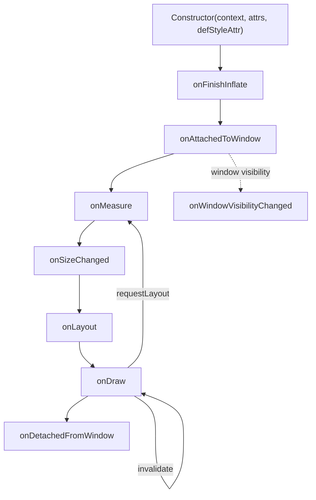
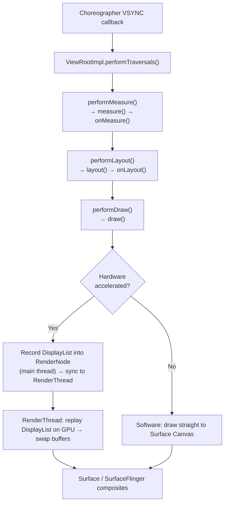
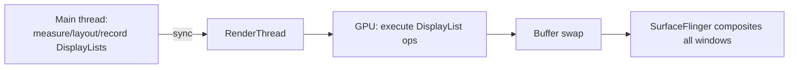
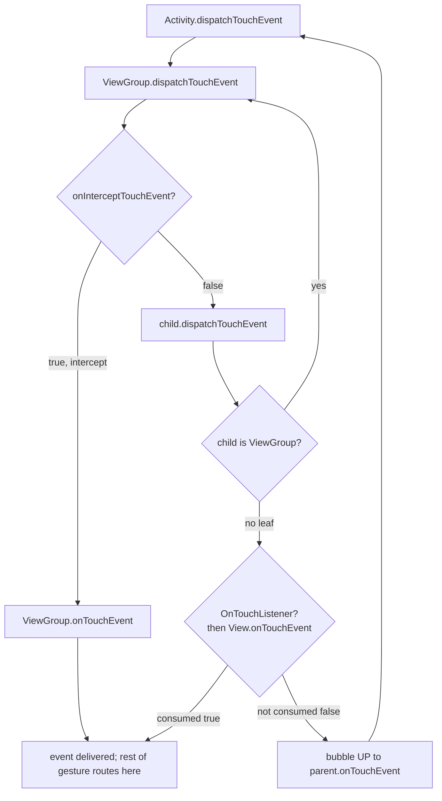

# View System — Rendering Internals

!!! abstract "What this covers"
    The classic Android `View` system from the metal up: how a `View` is born and dies, how `ViewRootImpl` drives every frame through measure → layout → draw, how custom views and touch dispatch actually work, and why each `ViewGroup` measures the way it does. Compose is a different pipeline (see [Compose Basics](25-compose-basics.md)); everything here is the `android.view.View` world that still underpins `RecyclerView`, `ConstraintLayout`, `MotionLayout`, and every interop surface.

---

## Part A — Lifecycle & Rendering

### The View lifecycle

A `View` is a plain object first, then becomes "live" only when attached to a window. The sequence:



| Stage | When | Use it for |
|---|---|---|
| Constructor | Inflation or `new View()` | Read attrs, init `Paint`/objects |
| `onFinishInflate()` | After all children inflated from XML | Grab child refs (only fires for XML inflation) |
| `onAttachedToWindow()` | View gains a window (`ViewRootImpl`) | Start animations, register listeners, allocate window-scoped resources |
| `onMeasure()` | Every traversal that dirties layout | Compute desired size |
| `onSizeChanged(w,h,ow,oh)` | Size actually changed | Rebuild size-dependent objects (`Shader`, `Bitmap`, gradients) |
| `onLayout()` | After measure | (ViewGroup) position children |
| `onDraw(Canvas)` | Redraw needed | Render pixels |
| `onDetachedFromWindow()` | Removed from hierarchy | **Stop animations, unregister listeners, cancel handlers** — the #1 leak site |

!!! warning "Constructor overloads are not interchangeable"
    The 2-arg `(Context, AttributeSet)` constructor is what the LayoutInflater calls. The 3-arg adds `defStyleAttr` (a theme attribute pointing at a default style); the 4-arg adds `defStyleRes`. Chain them with `@JvmOverloads` in Kotlin, but remember: XML inflation only ever calls the 2-arg form, so default styles must be threaded through `defStyleAttr`, not assumed.

### The rendering pipeline: `ViewRootImpl.performTraversals()`

Every visible window has exactly one `ViewRootImpl`. It is the bridge between your view tree and the `WindowManager`/`Choreographer`/`Surface`. When something requests a frame, the `Choreographer` schedules a callback on the `VSYNC` signal; that callback ultimately calls `performTraversals()`, the single method that orchestrates a frame.



Key facts a senior is expected to state without hesitation:

- **One `ViewRootImpl` per window.** An `Activity` window, a `Dialog`, a `PopupWindow`, and a `Toast` each get their own. This is why cross-window touch/focus behaves independently.
- **`performTraversals()` runs on the main thread.** Measure and layout are always main-thread. On hardware-accelerated windows, only the *record* phase (building `DisplayList`s) is main-thread; the *replay* (actual GPU drawing) is on `RenderThread`.
- **Measure can run twice (or more).** `RelativeLayout`, `LinearLayout` with weights, and any `ViewGroup` resolving `WRAP_CONTENT`/`match_parent` interplay may re-measure children. Deep nesting multiplies this — the origin of "measure is O(2ⁿ)" nesting horror stories.
- **Traversals are coalesced.** Multiple `requestLayout()`/`invalidate()` calls within a frame collapse into a single `performTraversals()` on the next VSYNC. You never render more than once per frame from a burst of calls.

### `onMeasure()` deep dive

`onMeasure(widthMeasureSpec, heightMeasureSpec)` receives two **packed ints** (`MeasureSpec`). Each packs a 2-bit **mode** in the high bits and a 30-bit **size** in the low bits.

```kotlin
val mode = MeasureSpec.getMode(widthMeasureSpec)   // top 2 bits
val size = MeasureSpec.getSize(widthMeasureSpec)   // bottom 30 bits
val spec = MeasureSpec.makeMeasureSpec(size, mode) // pack them back
```

| Mode | Meaning | Set by parent when child wants… | Contract on child |
|---|---|---|---|
| `EXACTLY` | Parent has fixed a size | `match_parent` or fixed `dp` | Must be exactly `size` |
| `AT_MOST` | Child may be any size up to `size` | `wrap_content` | Must not exceed `size` |
| `UNSPECIFIED` | Parent imposes no constraint | Measuring in scrollable dimension (`ScrollView`, `RecyclerView`) | Pick your natural size |

The parent computes each child's `MeasureSpec` from **its own spec + the child's `LayoutParams`** via `ViewGroup.getChildMeasureSpec()`. The child then reports its choice by calling `setMeasuredDimension(w, h)` — **failing to call it (in both dimensions) throws `IllegalStateException`.**

`resolveSize()` / `resolveSizeAndState()` are the helpers that enforce the contract correctly so you don't hand-roll the mode logic:

```kotlin
override fun onMeasure(widthMeasureSpec: Int, heightMeasureSpec: Int) {
    // The size this view WANTS if unconstrained (e.g. content + padding).
    val desiredW = suggestedMinimumWidth.coerceAtLeast(contentWidth + paddingLeft + paddingRight)
    val desiredH = suggestedMinimumHeight.coerceAtLeast(contentHeight + paddingTop + paddingBottom)

    // resolveSizeAndState clamps desired against the spec and folds in
    // MEASURED_STATE_TOO_SMALL so the parent can learn we were squeezed.
    val w = resolveSizeAndState(desiredW, widthMeasureSpec, 0)
    val h = resolveSizeAndState(desiredH, heightMeasureSpec, 0)

    setMeasuredDimension(w, h) // MANDATORY — both dimensions
}
```

!!! note "resolveSize vs resolveSizeAndState"
    `resolveSize(desired, spec)` returns the clamped size. `resolveSizeAndState(desired, spec, childState)` returns the size **OR'd with a state flag** in the high bits: if `desired > AT_MOST size`, it sets `MEASURED_STATE_TOO_SMALL`. A parent reads that via `getMeasuredState()` / `combineMeasuredStates()` and can grow itself. This is how nested layouts propagate "I didn't fit" upward.

!!! danger "Common onMeasure bugs"
    - Ignoring `UNSPECIFIED` and returning 0 → your view vanishes inside a `ScrollView`.
    - Measuring children but forgetting `measureChildWithMargins` / not adding margins → overlap.
    - Doing allocations (`new Paint()`, list building) inside `onMeasure` — it runs on every traversal, sometimes twice. Allocate in the constructor or `onSizeChanged`.

### `onLayout()` deep dive

`onLayout(changed, l, t, r, b)` is where a **ViewGroup positions its children** by calling `child.layout(left, top, right, bottom)` in *its own coordinate space*. Leaf views rarely override it. Measure decided *how big*; layout decides *where*.

```kotlin
override fun onLayout(changed: Boolean, l: Int, t: Int, r: Int, b: Int) {
    var cursorY = paddingTop
    for (i in 0 until childCount) {
        val child = getChildAt(i)
        if (child.visibility == GONE) continue
        val cw = child.measuredWidth      // decided in onMeasure
        val ch = child.measuredHeight
        val cursorX = paddingLeft
        child.layout(cursorX, cursorY, cursorX + cw, cursorY + ch)
        cursorY += ch
    }
}
```

**`getMeasuredWidth()` vs `getWidth()`** — a favorite interview trap:

| | `getMeasuredWidth()` | `getWidth()` |
|---|---|---|
| Set by | `onMeasure` (`setMeasuredDimension`) | `onLayout` (`layout()` → `right - left`) |
| Valid after | Measure pass | Layout pass |
| Meaning | Size the view *wants/was told* | Size the view *actually occupies* |
| In constructor / before layout | May be set (post-measure) | **0** |

They usually match, but a custom parent can call `child.layout()` with a different size than the child measured, making them diverge. If you read `view.width` in `onCreate` you get `0` — the view hasn't been laid out yet (see `OnGlobalLayoutListener` / `doOnLayout` in Part D).

### `onDraw()` deep dive

`onDraw(Canvas)` paints the view's content. Backgrounds draw *before* it; children and foreground draw *after* (via `dispatchDraw`, which a `ViewGroup` overrides instead of `onDraw`).

- **`Canvas`** — the drawing API surface. On hardware acceleration it's a *recording* canvas: your draw calls are captured as commands, not rasterized immediately.
- **`Paint`** — style/color/stroke/typeface/anti-alias/shader. **Create it once** (constructor), never in `onDraw`. Reusing `Paint` avoids per-frame GC churn.
- **`DisplayList` / `RenderNode`** — with hardware acceleration each view owns a `RenderNode` holding a recorded `DisplayList` (the serialized draw ops). If a view is *not* dirty, its `RenderNode` is **replayed without re-recording** — `onDraw` is skipped entirely. This is why `invalidate()` matters: it marks the `RenderNode` dirty so `onDraw` re-records.

```kotlin
private val fillPaint = Paint(Paint.ANTI_ALIAS_FLAG).apply {
    style = Paint.Style.FILL
    color = Color.parseColor("#2E1A47")
}

override fun onDraw(canvas: Canvas) {
    // No allocation here. Just draw.
    canvas.drawCircle(width / 2f, height / 2f, radius, fillPaint)
}
```

!!! tip "clipRect and save/restore"
    `canvas.save()` / `canvas.restore()` (or `withSave { }` / `withTranslation { }` KTX) bound transformations. `canvas.clipRect()` limits drawing to a region and is a cheap overdraw win. Unbalanced save/restore corrupts the canvas matrix for sibling views.

### Invalidation: telling the framework what changed

| Call | Runs on | Triggers | Use when |
|---|---|---|---|
| `invalidate()` | Main thread only | draw pass (re-record `DisplayList`) | Appearance changed, size did not (color, progress, animation frame) |
| `postInvalidate()` | Any thread | posts `invalidate()` to main thread | You're on a background thread |
| `invalidate(Rect)` | Main | draw pass, **dirty region** hint | Only a small region changed (pre-HWUI optimization; largely ignored under full HW accel, which redraws the whole node) |
| `requestLayout()` | Main | measure + layout + draw | Size/position may have changed (text set, child added, constraint changed) |
| `forceLayout()` | Main | flags this view for re-measure/layout **but does not schedule a traversal** | Rarely; you must still call `requestLayout()` on an ancestor to actually run it |

- **`invalidate` = "repaint me"; `requestLayout` = "re-measure and re-lay-out me (and my ancestors)".** `requestLayout` propagates *up* to the `ViewRootImpl` (each parent sets `PFLAG_FORCE_LAYOUT`), then a full traversal comes *down*. It implies a redraw too.
- **Dirty region:** historically `invalidate(l,t,r,b)` let the framework repaint only a rectangle. Under full hardware acceleration the unit of redraw is the `RenderNode`, so the whole view's display list re-records; the rectangle is mostly a legacy/software-path optimization.
- **`forceLayout()` is not `requestLayout()`.** `forceLayout` only sets the "needs layout" flag locally; without a `requestLayout()` reaching the root, no traversal is scheduled and nothing happens.

!!! danger "requestLayout during layout"
    Calling `requestLayout()` from inside `onLayout`/`onMeasure` (e.g. setting text on a child during layout) can produce "requestLayout() improperly called ... during layout" warnings and dropped frames because the traversal is re-entered. Batch size-affecting changes before the traversal.

### Hardware acceleration

Since API 14 (and on by default since 14 for apps targeting it), windows are **hardware accelerated**: drawing goes through the GPU (HWUI) instead of the CPU (Skia software rasterizer).



- **`RenderThread`** — a dedicated native thread (API 21+) that owns the GPU context and replays display lists. It can keep animating a `RenderNode` (e.g. a `RippleDrawable` or a `ViewPropertyAnimator` on `translationX`) **even if the main thread is briefly busy**, because the display list is already recorded. This is why property animations are smoother than redrawing in `onDraw`.
- **GPU vs CPU:** GPU excels at compositing textured quads, transforms, and alpha. It struggles with operations Skia's GL backend can't accelerate; those force a fallback and can be slower.

#### Layer types (`setLayerType`)

| Layer type | Backing | Effect | Use case |
|---|---|---|---|
| `LAYER_TYPE_NONE` (default) | none | View drawn normally, re-recorded when invalidated | Default — almost always correct |
| `LAYER_TYPE_HARDWARE` | GPU texture (FBO) | View rendered **once** into an offscreen GPU texture; that texture is reused across frames | Animating `alpha`/`translation`/`rotation`/`scale` of a **complex, static** subtree — the texture is just re-composited, no re-draw |
| `LAYER_TYPE_SOFTWARE` | `Bitmap` in RAM (CPU) | View rasterized on CPU into a bitmap | Force a code path HW accel can't render, or to snapshot; **disables GPU benefits** |

```kotlin
// Recommended pattern: HW layer only for the duration of the animation.
view.setLayerType(View.LAYER_TYPE_HARDWARE, null)
view.animate()
    .alpha(0f)
    .translationX(300f)
    .withEndAction { view.setLayerType(View.LAYER_TYPE_NONE, null) } // release the texture
    .start()
```

!!! warning "Hardware layers are not free"
    Each `LAYER_TYPE_HARDWARE` view consumes GPU memory (`width × height × 4` bytes) and adds a render-target switch. Leaving one on permanently, or on a view whose content changes every frame (so the texture is re-created constantly), is *slower* than `NONE`. `ViewPropertyAnimator` auto-applies a hardware layer for `alpha`/transform animations, so manual layer management is often unnecessary. Some effects (e.g. certain `PorterDuff` xfermodes, `Canvas.clipPath` on old APIs) require `LAYER_TYPE_SOFTWARE`.

---

## Part B — Custom Views

### Subclassing `View` vs `ViewGroup`

- **`View`** — a leaf that draws itself. Override `onMeasure` + `onDraw`. (e.g. a gauge, a chart, a custom progress ring.)
- **`ViewGroup`** — a container. Override `onMeasure` (measure children) + `onLayout` (position children). It does not usually draw content itself (override `dispatchDraw` if it must). Provide a `LayoutParams` subclass if children need custom XML attributes (like `layout_weight`).

### Custom attributes: `attrs.xml` + `obtainStyledAttributes` + `TypedArray`

Declare a styleable in `res/values/attrs.xml`:

```xml
<resources>
    <declare-styleable name="RingView">
        <attr name="ringColor" format="color" />
        <attr name="ringWidth" format="dimension" />
        <attr name="ringProgress" format="float" />
    </declare-styleable>
</resources>
```

Read them in the constructor. `obtainStyledAttributes` resolves the full cascade (view XML > style > theme `defStyleAttr` > `defStyleRes`):

```kotlin
class RingView @JvmOverloads constructor(
    context: Context,
    attrs: AttributeSet? = null,
    defStyleAttr: Int = 0
) : View(context, attrs, defStyleAttr) {

    private var ringColor: Int
    private var ringWidth: Float
    private var progress: Float

    init {
        val a: TypedArray = context.obtainStyledAttributes(
            attrs, R.styleable.RingView, defStyleAttr, /* defStyleRes = */ 0
        )
        try {
            ringColor = a.getColor(R.styleable.RingView_ringColor, Color.CYAN)
            ringWidth = a.getDimension(R.styleable.RingView_ringWidth, 8f)
            progress  = a.getFloat(R.styleable.RingView_ringProgress, 0f)
        } finally {
            a.recycle() // ALWAYS recycle — TypedArray is a pooled, shared resource
        }
    }
}
```

!!! danger "Always recycle() the TypedArray"
    `TypedArray` is drawn from a process-wide pool. Forgetting `recycle()` starves the pool and is a genuine leak. Use `try/finally`, or the KTX `context.withStyledAttributes(attrs, R.styleable.RingView) { ... }` which recycles for you.

### Saving view state: `onSaveInstanceState` / `onRestoreInstanceState`

A `View` persists its own state across configuration changes / process death **only if it has an `android:id`** and you implement these methods. State travels as a `Parcelable`, and you must chain the superclass state with `BaseSavedState`.

```kotlin
class RingView @JvmOverloads constructor(/* ... */) : View(/* ... */) {

    private var progress: Float = 0f

    override fun onSaveInstanceState(): Parcelable {
        val superState = super.onSaveInstanceState()        // preserve base View state
        return SavedState(superState).apply { progress = this@RingView.progress }
    }

    override fun onRestoreInstanceState(state: Parcelable?) {
        if (state is SavedState) {
            super.onRestoreInstanceState(state.superState)  // restore base state first
            progress = state.progress
            invalidate()
        } else {
            super.onRestoreInstanceState(state)
        }
    }

    private class SavedState : BaseSavedState {
        var progress: Float = 0f

        constructor(superState: Parcelable?) : super(superState)
        private constructor(parcel: Parcel) : super(parcel) {
            progress = parcel.readFloat()
        }

        override fun writeToParcel(out: Parcel, flags: Int) {
            super.writeToParcel(out, flags)                 // write base state
            out.writeFloat(progress)
        }

        companion object {
            @JvmField
            val CREATOR = object : Parcelable.Creator<SavedState> {
                override fun createFromParcel(source: Parcel) = SavedState(source)
                override fun newArray(size: Int) = arrayOfNulls<SavedState>(size)
            }
        }
    }
}
```

| Concept | Detail |
|---|---|
| **`Parcelable` vs `Bundle`** | View state is a `Parcelable`. A `Bundle` is itself a `Parcelable` map — convenient but heavier. `BaseSavedState` wraps the *superclass'* Parcelable so the whole chain (padding, scroll, focus) survives. |
| **Why `BaseSavedState`** | It carries the parent `superState`. Skip it and you silently drop base `View` state. |
| **The `id` requirement** | The framework keys saved state by view id in a `SparseArray`. No id → state discarded. Two views sharing an id → state cross-contaminates. |
| **`dispatchSaveInstanceState`** | A `ViewGroup` walks children saving each into the `SparseArray`; you rarely override it. |

### `GONE` vs `INVISIBLE` vs `VISIBLE`

| Value | Drawn? | Takes layout space? | Measured/laid out? | Typical use |
|---|---|---|---|---|
| `VISIBLE` | Yes | Yes | Yes | Normal |
| `INVISIBLE` | No | **Yes** (space reserved) | Yes | Keep layout stable while hiding (placeholder, avoid reflow) |
| `GONE` | No | **No** | **Skipped** | Remove from layout entirely; siblings collapse in |

!!! tip
    Toggling between `GONE` and `VISIBLE` triggers a `requestLayout()` (the tree must re-measure). Toggling `INVISIBLE`↔`VISIBLE` only triggers a redraw (`invalidate`) since geometry is unchanged — cheaper if you toggle frequently. In `ViewGroup.onLayout`, skip `GONE` children explicitly.

---

## Part C — Touch & Gestures

### The dispatch chain

Touch enters at the `ViewRootImpl`, flows **down** the tree via `dispatchTouchEvent`, and a `ViewGroup` may **intercept** via `onInterceptTouchEvent`. Actual handling is `onTouchEvent`, and the return value (`true` = consumed) decides whether the event stream continues to that view.



The rules that trip people up:

1. **`ACTION_DOWN` decides the target.** On `DOWN`, dispatch walks down to find who consumes. If a view returns `true` from `onTouchEvent` for `DOWN`, it becomes the **touch target** and *all subsequent* `MOVE`/`UP` for that gesture go to it. Return `false` for `DOWN` and you will **never see** the following `MOVE`/`UP`.
2. **`onInterceptTouchEvent` lets a parent steal the stream mid-gesture.** It's called on the parent for *every* event before the child sees it. Returning `true` (typically on a `MOVE` once a scroll threshold is crossed — the `ScrollView` / `RecyclerView` pattern) sends the child an `ACTION_CANCEL` and routes the rest to the parent's `onTouchEvent`. It is **not** called for events the parent already decided to handle.
3. **`OnTouchListener` runs *before* `onTouchEvent`.** `dispatchTouchEvent` on a `View` calls `mOnTouchListener.onTouch()` first; if it returns `true`, `onTouchEvent` is **not** called. This is how you add touch handling without subclassing — but it also means a listener returning `true` swallows the view's built-in behavior (e.g. `Button` click).

### `MotionEvent`

- `ACTION_DOWN` — first finger down; start of a gesture.
- `ACTION_MOVE` — movement; batched (`getHistorySize()` gives coalesced samples for high-frequency digitizers).
- `ACTION_UP` — last finger up; gesture end (fire a click here).
- `ACTION_CANCEL` — the framework/parent revoked the gesture (e.g. parent intercepted). Reset your state; **do not** treat it as a tap.
- `ACTION_POINTER_DOWN` / `ACTION_POINTER_UP` — secondary fingers (multitouch); use `actionMasked` + `getPointerId()`/`findPointerIndex()` to track individual fingers.

!!! warning
    Always branch on `event.actionMasked`, not `event.action`. `action` packs the pointer index in the high byte for pointer events, so `== ACTION_POINTER_DOWN` comparisons on raw `action` fail for the 2nd+ finger.

### `requestDisallowInterceptTouchEvent`

A child tells its ancestors "don't steal this gesture." Used when a scrollable child lives inside a scrollable parent (e.g. a horizontal carousel inside a vertical `RecyclerView`): the child calls `parent.requestDisallowInterceptTouchEvent(true)` on `DOWN` so the parent's `onInterceptTouchEvent` is bypassed for the rest of the gesture. The flag is auto-reset on the next `ACTION_DOWN`.

### `GestureDetector` and `ScaleGestureDetector`

Hand-rolling fling/long-press/double-tap from raw `MotionEvent`s is error-prone. Delegate:

```kotlin
class PannableView(context: Context) : View(context) {

    private val gestureDetector = GestureDetector(context,
        object : GestureDetector.SimpleOnGestureListener() {
            override fun onDown(e: MotionEvent) = true // MUST return true to receive the rest
            override fun onScroll(e1: MotionEvent?, e2: MotionEvent, dx: Float, dy: Float): Boolean {
                scrollBy(dx.toInt(), dy.toInt()); return true
            }
            override fun onFling(e1: MotionEvent?, e2: MotionEvent, vx: Float, vy: Float): Boolean {
                /* start fling animation */; return true
            }
            override fun onLongPress(e: MotionEvent) { /* context menu */ }
        })

    private val scaleDetector = ScaleGestureDetector(context,
        object : ScaleGestureDetector.SimpleOnScaleGestureListener() {
            override fun onScale(d: ScaleGestureDetector): Boolean {
                scaleFactor *= d.scaleFactor; invalidate(); return true
            }
        })

    private var scaleFactor = 1f

    @SuppressLint("ClickableViewAccessibility")
    override fun onTouchEvent(event: MotionEvent): Boolean {
        scaleDetector.onTouchEvent(event)     // feed both detectors
        gestureDetector.onTouchEvent(event)
        return true
    }
}
```

- `GestureDetector` recognizes tap, double-tap, long-press, scroll, fling. `onDown` **must** return `true` or the detector treats the gesture as unhandled and you get nothing else.
- `ScaleGestureDetector` recognizes pinch-zoom via the span between two pointers. Feed *both* detectors the same events — they coexist.
- **`OnTouchListener` vs overriding `onTouchEvent`:** use a listener to add behavior to a view you don't own (no subclassing); override `onTouchEvent` inside a custom view you *do* own. Remember the listener fires first and can suppress `onTouchEvent`.

### Minimal `onInterceptTouchEvent` example

A custom horizontal pager that only steals the gesture once horizontal movement dominates:

```kotlin
class HorizontalPager(context: Context, attrs: AttributeSet?) : ViewGroup(context, attrs) {

    private val touchSlop = ViewConfiguration.get(context).scaledTouchSlop
    private var downX = 0f
    private var downY = 0f

    override fun onInterceptTouchEvent(ev: MotionEvent): Boolean {
        when (ev.actionMasked) {
            MotionEvent.ACTION_DOWN -> {
                downX = ev.x; downY = ev.y
                return false // let children see DOWN; don't intercept yet
            }
            MotionEvent.ACTION_MOVE -> {
                val dx = kotlin.math.abs(ev.x - downX)
                val dy = kotlin.math.abs(ev.y - downY)
                // Intercept only when the drag is clearly horizontal and past slop.
                return dx > touchSlop && dx > dy
            }
        }
        return false
    }

    override fun onTouchEvent(event: MotionEvent): Boolean {
        // Reached here only after we intercepted (children got ACTION_CANCEL).
        // ... handle the horizontal drag / settle to a page ...
        return true
    }

    override fun onLayout(changed: Boolean, l: Int, t: Int, r: Int, b: Int) { /* lay out pages */ }
}
```

---

## Part D — `ViewTreeObserver`

`ViewTreeObserver` (from `view.viewTreeObserver`) exposes hooks into the traversal at points where geometry becomes known. It is the canonical answer to "the view's width is 0 in `onCreate`."

| Listener | Fires | Use case | Caveat |
|---|---|---|---|
| `OnGlobalLayoutListener` | After **every** layout pass of the tree | Read final width/height/position; measure text; position a popup | Fires *repeatedly* (keyboard, rotation, any child relayout). **Remove it after first use** or debounce. |
| `OnPreDrawListener` | Just before **each** draw, after layout | Last chance to tweak geometry (`return false` to *cancel* the current draw and reschedule) — used for shared-element/enter transitions | Return `true` to proceed; forgetting kills the frame |
| `OnDrawListener` | During draw | Frame timing / detecting draws | Must **not** add/remove views or trigger layout from inside |
| `OnScrollChangedListener` | Any descendant scrolls | React to scroll globally | Very hot; keep trivial |
| `OnGlobalFocusChangeListener` | Focus moves anywhere in tree | Accessibility, custom focus UI | — |

```kotlin
// Idiomatic: get the real size exactly once, then detach.
view.viewTreeObserver.addOnGlobalLayoutListener(object : ViewTreeObserver.OnGlobalLayoutListener {
    override fun onGlobalLayout() {
        view.viewTreeObserver.removeOnGlobalLayoutListener(this) // detach FIRST
        val w = view.width // now valid (non-zero)
        // ... use w ...
    }
})

// KTX equivalents that self-remove:
view.doOnLayout { /* runs once after next layout */ }
view.doOnPreDraw { /* runs once before next draw */ }
```

!!! danger "Leaking the observer"
    Not removing an `OnGlobalLayoutListener` keeps it firing forever and can hold a reference to your `Activity`/`Fragment`. Always remove it, guard against the observer being dead (`isAlive`), and prefer the one-shot KTX helpers.

---

## Part E — Layouts Deep Dive

### Comparison at a glance

| Layout | Measure passes | Strength | Cost / watch-out |
|---|---|---|---|
| `FrameLayout` | 1 (2 if a child is `match_parent` with siblings) | Cheapest container; z-stacking | Only positions via gravity |
| `LinearLayout` (no weights) | 1 | Simple, predictable | Deep nesting to build grids |
| `LinearLayout` (with weights) | **2** | Proportional sizing | Second pass doubles child measure cost |
| `RelativeLayout` | **2 (always)** | Sibling-relative rules, flat | Every child measured twice; slow with many children |
| `ConstraintLayout` | 1 (solver may iterate internally) | Flat hierarchy, complex UIs, no nesting | Solver setup overhead; misused as "just another RelativeLayout" |
| `CoordinatorLayout` | 1 + behavior passes | Scroll-linked motion (app bars, FABs) | Behavior logic complexity |

### `ConstraintLayout`

The flagship. Built to **flatten hierarchies** — replacing nested `LinearLayout`/`RelativeLayout` trees with a single container, which is the biggest measure/layout win available since deep nesting is what makes traversals expensive.

- **Cassowary solver:** `ConstraintLayout` expresses layout as a system of linear constraints/inequalities and solves them with the **Cassowary** linear-arithmetic constraint solver (the same algorithm behind Apple Auto Layout). Instead of measuring children multiple times in nested passes, it solves the whole flat system, generally in a single measure pass.
- **Why flat = fast:** measure cost grows with *nesting depth* (repeated child measurement). A flat tree with one solver pass beats a 5-deep `RelativeLayout` nest even though the solver itself isn't free.

Feature surface a senior should name:

| Feature | What it does |
|---|---|
| **Chains** | Link views in a bidirectional constraint run. Styles: `spread` (equal gaps incl. ends), `spread_inside` (ends pinned, equal gaps between), `packed` (grouped, positioned by bias), and **weighted** (`layout_constraintHorizontal_weight` with `0dp`/`MATCH_CONSTRAINT` — the flat-layout answer to `LinearLayout` weights) |
| **Guidelines** | Invisible helper lines at a fixed `dp` or `percent`; constrain views to them without a real view |
| **Barriers** | A virtual edge that moves to the max/min of a *set* of views (e.g. align a column to whichever label is widest) — dynamic, unlike a guideline |
| **Groups** | Toggle `visibility` of many referenced views at once (no layout of its own) |
| **Flow** | A virtual "chain of chains" that wraps/aligns a variable list of views into rows/columns without a nested container |
| **`ConstraintSet`** | The constraints extracted as a mutable object; apply a different set + `TransitionManager.beginDelayedTransition()` to animate between layout states |
| **`0dp` = `MATCH_CONSTRAINT`** | "fill the space my constraints allow" — the ConstraintLayout equivalent of `match_parent`, plus ratio/percent/wrap variants |

**`MotionLayout`** is a `ConstraintLayout` subclass that animates between two `ConstraintSet`s (`start`/`end`) defined in an XML `MotionScene`, driven by progress (touch, or programmatic). It handles keyframes, path motion, and `OnSwipe`/`OnClick` triggers — declarative complex motion without hand-written animators.

### `LinearLayout` — the weight algorithm

- **Without weights:** one pass. Each child measured with the appropriate spec; sizes summed along the orientation.
- **With `layout_weight`:** **two passes.** Pass 1 measures every child at its natural size to find total used space and *remaining* (or excess) space. Pass 2 distributes leftover space to weighted children in proportion to their weight, then **re-measures** those children with the new exact size. Hence "weights cost a second measure pass" — and nesting weighted LinearLayouts multiplies this exponentially.
- **`layout_width="0dp"` with a weight** skips the wasted natural-size measurement in pass 1 (child contributes 0 to used space), so it's the correct idiom for pure proportional splits.
- **`baselineAligned`:** by default LinearLayout aligns children by text **baseline**, not top edge — surprising with mixed content (an `ImageView` next to a `TextView`). Set `android:baselineAligned="false"` to align by geometry and skip the baseline computation.

### `RelativeLayout`

- **Always two measure passes** — a horizontal pass then a vertical pass — because a child's position can depend on a sibling's *measured size* (`toRightOf`, `below`, `alignBottom`), which isn't known until that sibling is measured. It builds a **dependency graph** of the rules and topologically sorts children so dependencies are measured first; cyclic rules throw at inflation.
- **Performance:** every child is measured twice regardless. With many children this is markedly slower than a flat `ConstraintLayout`, which is precisely why Google steered new layouts toward ConstraintLayout. Avoid nesting RelativeLayouts.

### `FrameLayout` — z-ordering

Stacks children on top of each other at the top-left (modifiable by `layout_gravity`). **Draw order = child index order**: the last child added is drawn last, i.e. on top. Change stacking with `bringChildToFront()` (reorders in the list, forces relayout) or, on API 21+, `View.setZ()`/`elevation`/`setTranslationZ()` which reorders drawing without changing child index. The go-to for overlays, badges, and loading spinners over content.

### `CoordinatorLayout` — the Behavior system

A super-powered `FrameLayout` whose children (or their `CoordinatorLayout.LayoutParams`) attach a **`Behavior`**. A `Behavior` lets one view react to another's changes or to nested scrolling:

- `layoutDependsOn()` / `onDependentViewChanged()` — "when view B moves/resizes, reposition view A" (e.g. a FAB dodging a Snackbar).
- Nested-scroll callbacks (`onStartNestedScroll`, `onNestedPreScroll`, `onNestedScroll`) — how `AppBarLayout` collapses a toolbar as a `RecyclerView` (with `nestedScrollingEnabled`) scrolls.
- Built-ins: `AppBarLayout.Behavior`, `AppBarLayout.ScrollingViewBehavior`, `FloatingActionButton.Behavior`, `BottomSheetBehavior`, `SwipeDismissBehavior`.

A **custom behavior** subclasses `CoordinatorLayout.Behavior<V>` and overrides the dependency or nested-scroll hooks. It centralizes cross-view choreography that would otherwise be scattered scroll listeners.

### `ScrollView` vs `NestedScrollView`

| | `ScrollView` | `NestedScrollView` |
|---|---|---|
| Package | `android.widget` | `androidx.core.widget` |
| Nested scrolling | **No** — does not cooperate with `CoordinatorLayout` or child scrollables | **Yes** — implements `NestedScrollingParent`/`Child` |
| Use with `AppBarLayout` / collapsing toolbar | Won't work (no scroll events propagated) | Required |
| A `RecyclerView` inside it | Broken (double scroll, no recycling) | Works, but recycling is defeated (all rows realized) — prefer a single `RecyclerView` with view types instead |

Both measure their single child with an `UNSPECIFIED` (unbounded) spec in the scroll direction so it can exceed the viewport. **Always prefer `NestedScrollView`** in modern apps for Material scroll behaviors.

### `merge` / `include` / `ViewStub`

- **`<include>`** — inlines a reusable layout file; `layout_*` attrs on the tag override the root's. Reduces duplication.
- **`<merge>`** — a *phantom* root used as the top tag of an included layout so that, when inlined into a parent, it **doesn't add a redundant wrapper `ViewGroup`**. Flattens the hierarchy (fewer measure levels). Only valid where the parent will supply the container.
- **`<ViewStub>`** — a zero-size, invisible, no-draw placeholder that **lazily inflates** its `layout` only when `inflate()` (or `visibility = VISIBLE`) is called. Perfect for rarely-shown heavy subtrees (error states, expanded panels): they cost nothing until needed. After inflation the stub removes itself and is replaced by the real hierarchy.

### Layout performance & tooling

- **Overdraw** — the same pixel painted multiple times per frame (opaque background under an opaque card under content). Diagnose with **Developer Options → Debug GPU Overdraw** (color-coded: blue = 1×, green 2×, pink 3×, red 4×+ — aim for mostly blue/no tint). Fix by removing redundant backgrounds, using `canvas.clipRect`, and flattening.
- **Flatten the hierarchy** — depth, not raw view count, drives measure/layout cost (double passes multiply per level). `ConstraintLayout` + `<merge>` are the primary tools.
- **Layout Inspector** (Android Studio) — live 3D view of the hierarchy, per-view attributes, and (with profiling) render timing; shows exactly where nesting or a 3× overdraw lives.
- **Profile GPU/HWUI rendering & `Systrace`/Perfetto** — reveal frames blowing the ~16.6 ms budget (60 Hz) and whether the cost is measure/layout vs draw vs GPU.
- **`ViewStub` + lazy inflation** and avoiding work in `onMeasure`/`onDraw` are the cheapest wins.

---

## Interview Q&A

!!! question "1. Walk me through what happens between `setContentView()` and pixels on screen."
    **Answer:** `setContentView` inflates the XML into a `View` tree and attaches it under the Activity's `DecorView`, but nothing is measured/drawn yet. When the window is added to the `WindowManager`, a `ViewRootImpl` is created and registered with the `Choreographer`. On the next VSYNC, `ViewRootImpl.performTraversals()` runs on the main thread: `performMeasure()` (top-down `measure`/`onMeasure`, resolving `MeasureSpec`s), then `performLayout()` (`layout`/`onLayout`, positioning children), then `performDraw()`. Under hardware acceleration, draw *records* each view's `DisplayList` into its `RenderNode` on the main thread, syncs to the `RenderThread`, which replays the ops on the GPU and swaps a buffer that `SurfaceFlinger` composites. So there's a full measure→layout→draw traversal, and the pixels appear one or two frames after `setContentView`.

    **Follow-up:** *Why is `view.width` 0 in `onCreate`?* Because `onCreate`/`setContentView` run before the first traversal; layout hasn't happened, so `getWidth()` (set in `onLayout`) is still 0. Use `doOnLayout {}` / `OnGlobalLayoutListener` / `OnPreDrawListener` to read real dimensions.

!!! question "2. Explain `MeasureSpec` and the three modes. When does `UNSPECIFIED` occur?"
    **Answer:** A `MeasureSpec` is a packed int: top 2 bits are the mode, bottom 30 the size. The parent builds each child's spec from its own spec plus the child's `LayoutParams`. `EXACTLY` means the parent fixed the size (child requested `match_parent` or a fixed dimension) — child must obey. `AT_MOST` means "up to this size" (child requested `wrap_content`) — child picks its natural size but must not exceed. `UNSPECIFIED` means no constraint — the child chooses freely; it occurs when a parent is measuring a child along a scrollable/unbounded axis, e.g. a `ScrollView` measuring its child height, or `RecyclerView`/`ListView` measuring row heights. A view that ignores `UNSPECIFIED` and returns 0 disappears inside a `ScrollView`.

    **Follow-up:** *What does `resolveSizeAndState` add over `resolveSize`?* It folds a `MEASURED_STATE_TOO_SMALL` flag into the high bits when the desired size didn't fit an `AT_MOST` spec, letting the parent detect the squeeze via `getMeasuredState()` and grow itself.

!!! question "3. Difference between `invalidate()` and `requestLayout()`? And `postInvalidate`?"
    **Answer:** `invalidate()` schedules a **draw** pass only — it marks the view's `RenderNode` dirty so `onDraw` re-records; use it when appearance changed but size/position didn't (color, progress). `requestLayout()` schedules a full **measure + layout (+ draw)** pass and propagates *up* to the root by flagging each ancestor, then the traversal comes back down — use it when a change may alter dimensions (setting text, adding a child). `requestLayout` implies redraw; `invalidate` does not imply relayout. `postInvalidate()` is just `invalidate()` safe to call from a background thread (it posts to the main thread's handler).

    **Follow-up:** *What's `forceLayout()` then?* It only sets the local "needs re-layout" flag on that view; it does **not** schedule a traversal, so alone it does nothing — you still need a `requestLayout()` reaching the `ViewRootImpl`.

!!! question "4. Trace a touch event through a `ViewGroup` and explain how a parent 'steals' a scroll."
    **Answer:** The event enters `Activity.dispatchTouchEvent` → `DecorView` → down the tree via each `ViewGroup.dispatchTouchEvent`. Before passing to a child, the group calls `onInterceptTouchEvent`. On `ACTION_DOWN`, dispatch finds a target: the deepest child whose `onTouchEvent` (or `OnTouchListener`) returns `true` becomes the touch target and receives the whole gesture. A scrolling parent (like `RecyclerView`) returns `false` from `onInterceptTouchEvent` on `DOWN` (so children can be pressed) but starts returning `true` on `MOVE` once movement passes `touchSlop` — at that moment the child receives `ACTION_CANCEL` and the rest of the stream routes to the parent's `onTouchEvent`. That's how a scroll is "stolen" mid-gesture.

    **Follow-up:** *How does a child prevent that?* It calls `parent.requestDisallowInterceptTouchEvent(true)` (typically on `DOWN`), which bypasses ancestors' `onInterceptTouchEvent` for the rest of the gesture; the flag resets on the next `DOWN`. This is how a horizontal carousel survives inside a vertical scroller.

!!! question "5. Why is `ConstraintLayout` considered faster than deeply nested `LinearLayout`/`RelativeLayout`?"
    **Answer:** Measure/layout cost scales with hierarchy *depth*, because containers like weighted `LinearLayout` and `RelativeLayout` measure their children **twice**, and nesting multiplies those double passes at every level. `ConstraintLayout` lets you express complex UIs in a single flat container, so there's no nesting multiplication. It resolves positions with the Cassowary linear-constraint solver, generally in one measure pass over the flat set of views. The win is flattening, not the solver itself — the solver has real setup cost, so a trivial two-view layout may not benefit, but complex screens do substantially.

    **Follow-up:** *When would ConstraintLayout NOT help?* Very simple layouts (a vertical stack of three items) where a plain `LinearLayout` is lighter and clearer, or when people recreate a deeply nested design inside ConstraintLayout without actually flattening — you pay solver cost for no structural benefit.

!!! question "6. When would you use `setLayerType(LAYER_TYPE_HARDWARE)`, and what's the cost?"
    **Answer:** Use a hardware layer when animating a **complex but static** subtree's `alpha`, `translation`, `rotation`, or `scale`. The view is rendered once into an offscreen GPU texture (FBO); each frame just re-composites that texture with the new transform instead of re-recording/re-drawing the subtree — big win for expensive content being moved as a unit. Enable it for the animation's duration and set it back to `LAYER_TYPE_NONE` in the end action to release the texture. Cost: GPU memory (`w × h × 4` bytes) and a render-target switch; if the layer's content changes every frame, the texture is re-created constantly and it becomes *slower* than no layer. `ViewPropertyAnimator` already applies a hardware layer automatically for alpha/transform animations, so manual management is often redundant.

    **Follow-up:** *When would you use `LAYER_TYPE_SOFTWARE`?* To force a CPU/Skia code path for effects the GPU pipeline can't render (certain `PorterDuff` xfermodes, some `clipPath`/shadow cases on older APIs) or to snapshot the view to a `Bitmap` — accepting that you lose all GPU acceleration for that view.
