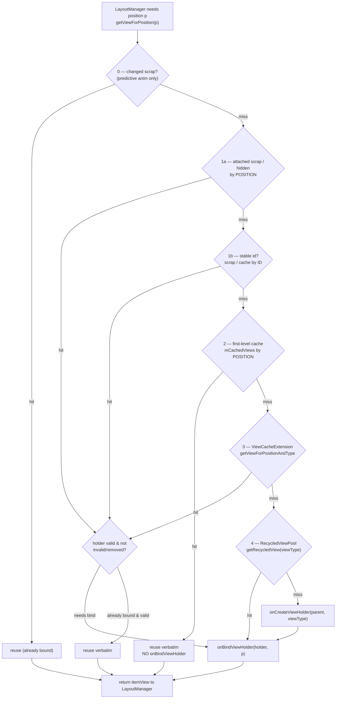

# RecyclerView — Complete Mastery

!!! abstract "What this covers"
    A senior, internals-first tour of `RecyclerView`: how the recycler actually
    finds (or creates) a view for a position, why there are *four* distinct
    caches, exactly when `onCreateViewHolder` vs `onBindViewHolder` fire, and how
    the adapter / layout-manager / animator / decoration collaborators plug in.
    Read the flow diagram in Part A first — every later section refers back to it.

`RecyclerView` is not a scrolling `ViewGroup`. It is a *coordinator* that
delegates four responsibilities to pluggable strategies:

| Responsibility | Owner | Contract |
|---|---|---|
| What data exists, how to bind it | `Adapter` | `getItemCount`, `onCreateViewHolder`, `onBindViewHolder` |
| Where items are positioned / measured | `LayoutManager` | `onLayoutChildren`, `scrollVerticallyBy`, … |
| Which view backs a screen cell | `Recycler` (internal) | `getViewForPosition(pos)` |
| How add/remove/move looks | `ItemAnimator` | `animateAppearance`, `animateDisappearance`, … |
| Spacing / dividers / overlays | `ItemDecoration` | `getItemOffsets`, `onDraw`, `onDrawOver` |

The single most important object is the **`Recycler`** — an inner class of
`RecyclerView` that owns the caches and is the source of every view the
`LayoutManager` lays out.

---

## Part A — Architecture & Recycler Internals

### A.1 The three public collaborators

- **`Adapter<VH>`** — owns the data and the create/bind logic. Stateless about
  layout. Emits change notifications.
- **`ViewHolder`** — a wrapper around one item `View` plus cached child
  references and a bag of internal *flags* (bound, invalid, removed, …).
- **`LayoutManager`** — measures and positions children. It *pulls* views from
  the recycler via `getViewForPosition()`; it never touches the adapter's
  create/bind methods directly.

The LayoutManager asking "give me a view for position 7" is the entry point for
everything interesting. It has no idea whether that view is brand-new, rebound,
or returned verbatim from a cache — the recycler decides.

### A.2 The four view stores

`RecyclerView` keeps recycled/soon-to-be-reused views in four structurally
different places. Understanding *why there are four* is the core senior insight:
each solves a different reuse problem.

| Tier | Field | Keyed by | Requires rebind? | Lifetime / scope | Purpose |
|---|---|---|---|---|---|
| 0. Attached / changed **scrap** | `mAttachedScrap`, `mChangedScrap` | position | No (attached), Yes (changed) | One layout pass | Detach-and-reattach views during a *single* `onLayoutChildren` without recycling them |
| 1. **First-level cache** | `mCachedViews` | **position + id** | **No** | Until scrolled away / invalidated | Return the *exact same* item you just scrolled off — the offscreen buffer |
| 2. **`ViewCacheExtension`** | custom | app-defined | app-defined | app-defined | Escape hatch for app-managed views |
| 3. **`RecycledViewPool`** | `RecycledViewPool` | **viewType** | **Yes** | Until cleared; **shareable** across RVs | Type-bucketed scrap of fully-recycled holders ready to rebind |

Key distinctions to say out loud in an interview:

- **Scrap** is *transient* — it exists only for the duration of a layout pass.
  Views in scrap are considered still "in use" by the layout; they are detached,
  not recycled.
- **`mCachedViews`** is **position-based** and **does not rebind**. Its whole
  point is: you scrolled item 10 off the top, then scrolled back — item 10 comes
  back byte-for-byte with no `onBindViewHolder` call. Default capacity is
  **2** (`DEFAULT_CACHE_SIZE`), tunable with `setItemViewCacheSize(n)`.
- The **`RecycledViewPool`** is **type-based** and **always rebinds**. When a
  holder is evicted from `mCachedViews` (cache full), it is scrubbed of its
  position and dropped into the pool bucket for its `viewType`. Default pool
  capacity is **5 holders per viewType** (`DEFAULT_MAX_SCRAP`).

!!! note "Scrap vs cache vs pool in one sentence"
    Scrap = "I'm mid-layout, hold this." Cache = "same position, same view, no
    rebind." Pool = "same type, recycle-and-rebind."

### A.3 The recycling flow — `getViewForPosition` → the 4-tier lookup

When the LayoutManager needs position `p`, it calls
`recycler.getViewForPosition(p)`, which delegates to
`tryGetViewHolderForPositionByDeadline(p, dryRun, deadlineNs)`. That method walks
the tiers **in order** and stops at the first hit:



Read the diagram as the answer to the two questions everyone gets wrong:

- **When is `onCreateViewHolder` called?** Only when the pool miss at tier 4
  occurs — i.e. no reusable holder of that `viewType` exists anywhere. Once the
  visible window is saturated and the pool is warm, `onCreateViewHolder` stops
  being called almost entirely (roughly `visibleItems + cacheSize + poolMax`
  creations per type over the app's life).
- **When is `onBindViewHolder` called?** Whenever a holder is produced that is
  *not* already valid-and-bound for that position: tier-4 create, tier-4 pool
  reuse, tier-2 extension, and tier-1 holders that were marked
  invalid/update-needed. Tier-1 `mCachedViews` hits and clean scrap hits skip
  bind entirely.

!!! tip "`deadlineNs` and GapWorker"
    The `ByDeadline` suffix exists for **prefetch**. `GapWorker` (Part I) calls
    this method with a deadline equal to the estimated time to the next frame's
    vsync. If creating/binding a not-yet-visible holder would blow the deadline,
    prefetch bails so it never causes jank. During normal layout the deadline is
    `FOREVER_NS`.

### A.4 The recycle path (the reverse trip)

When a view scrolls off, the LayoutManager calls
`removeAndRecycleView` → `recycler.recycleView(view)` →
`recycleViewHolderInternal(holder)`:

1. If the holder is invalid / not bound → try to put it straight into the pool.
2. Else if `mCachedViews` has room → add to cache (position-keyed, no scrub).
3. If cache is full → **evict the oldest** cached holder into the pool; the new
   holder takes the freed cache slot.
4. Entering the pool clears the holder's payload/position state via
   `clearPayloads()` and marking so it must rebind next time.

This is why the cache acts as a small FIFO in front of the type pool.

---

## Part B — The Adapter

### B.1 The three methods that matter

```kotlin
override fun getItemCount(): Int = items.size

override fun onCreateViewHolder(parent: ViewGroup, viewType: Int): VH {
    // Inflate ONCE per reusable holder. Heavy work is acceptable here.
    val binding = RowBinding.inflate(LayoutInflater.from(parent.context), parent, false)
    return VH(binding)
}

override fun onBindViewHolder(holder: VH, position: Int) {
    // Called MANY times. Must be cheap: no inflation, no allocation, no I/O.
    holder.bind(items[position])
}
```

The performance model follows directly from Part A: `onCreateViewHolder` is
rare, `onBindViewHolder` is hot. Every allocation in bind multiplies by fling
velocity.

### B.2 `notifyDataSetChanged` vs granular notifications vs DiffUtil

| API | What RV assumes | Rebinds | Animations | Cost |
|---|---|---|---|---|
| `notifyDataSetChanged()` | *Everything* changed | All visible | None (no item identity) | Cheap to call, expensive to render; kills predictive animations |
| `notifyItemChanged(pos[, payload])` | One item's contents changed | That item | Change anim (or payload rebind) | Precise |
| `notifyItemInserted/Removed/Moved` | Structural change | Only affected + shifted | Add/remove/move anims | Precise |
| `notifyItemRangeChanged/Inserted/Removed` | Contiguous range | Range | Batched | Precise |
| **`DiffUtil` / `ListAdapter`** | Computes the granular ops for you | Minimal | Full | Diff is O(N·D); binds minimal |

!!! warning "`notifyDataSetChanged` is the default anti-pattern"
    It marks every attached holder invalid, so the recycler cannot match items to
    positions — no move/change animations, and the whole visible window rebinds.
    Prefer granular notifications or, better, `DiffUtil`. The only legit use is a
    genuine wholesale replacement (e.g. switching data sources entirely).

### B.3 Stable IDs

```kotlin
init { setHasStableIds(true) }
override fun getItemId(position: Int): Long = items[position].id  // stable & unique
```

With stable IDs the recycler can track a holder by **id** across notifications
(tier 1b in the flow). This enables item persistence and animation even when
positions move. Rules: IDs must be unique and *stable* for the lifetime of an
item; return `RecyclerView.NO_ID` only if you truly have none. `ListAdapter`
generally makes stable IDs unnecessary because `DiffUtil` already establishes
identity via `areItemsTheSame`.

### B.4 View types & heterogeneous lists

```kotlin
override fun getItemViewType(position: Int): Int = when (items[position]) {
    is Header -> TYPE_HEADER
    is Row    -> TYPE_ROW
    is Ad     -> TYPE_AD
}
```

`viewType` is the pool's bucket key (Part A, tier 4). Two consequences:

- Holders only recycle within their own type — a `TYPE_HEADER` view never
  rebinds as a `TYPE_ROW`.
- If a type is rare and expensive, it barely benefits from pooling; consider
  `ConcatAdapter` (Part I) to separate concerns instead of a mega-`when`.

---

## Part C — The ViewHolder

### C.1 Why the pattern exists

Before `RecyclerView`, `ListView` re-ran `findViewById` on every `getView`.
The ViewHolder pattern caches child references once (in `onCreateViewHolder`),
so bind is pure data assignment. `RecyclerView` *enforces* the pattern — you
cannot use it without a `ViewHolder`.

### C.2 `getBindingAdapterPosition` vs `getAbsoluteAdapterPosition`

Since the `ConcatAdapter` era there are two position spaces:

| Method | Returns | Use when |
|---|---|---|
| `getBindingAdapterPosition()` | Position **within the adapter that bound this holder** | You need to index into *your* adapter's data (the common case) |
| `getAbsoluteAdapterPosition()` | Position within the **merged** `ConcatAdapter` | You need the global row index across all concatenated adapters |
| `getLayoutPosition()` | Position as of the **last completed layout** | Reading during layout/drawing; may lag pending updates |

All can return **`RecyclerView.NO_POSITION` (-1)**, and *this is the classic
crash*:

!!! danger "Never capture `position` in a click listener"
    The `position` argument to `onBindViewHolder` is a snapshot. By the time a
    click fires, items may have been inserted/removed, or the holder may be
    mid-recycle/animating-out and detached from the adapter — then
    `getBindingAdapterPosition()` returns `NO_POSITION`. Always re-read at click
    time and guard:

    ```kotlin
    holder.itemView.setOnClickListener {
        val pos = holder.bindingAdapterPosition
        if (pos != RecyclerView.NO_POSITION) onItemClick(items[pos])
    }
    ```

### C.3 Holder flags (internal state machine)

Each holder carries a bitmask (`mFlags`) that drives the tier walk in Part A:

- `FLAG_BOUND` — has valid contents for its position.
- `FLAG_UPDATE` — contents changed; needs rebind (set by `notifyItemChanged`).
- `FLAG_INVALID` — data structure invalid (`notifyDataSetChanged`); cannot be
  reused without rebind and cannot animate.
- `FLAG_REMOVED` — item removed from adapter; kept transiently for disappearance
  animation.
- `FLAG_NOT_RECYCLABLE` — pinned (e.g. `setIsRecyclable(false)` during a
  transient animation) so it won't be recycled mid-flight.

You rarely touch these directly, but they explain *why* a holder does or does
not skip bind.

### C.4 Partial binding with payloads

```kotlin
override fun onBindViewHolder(holder: VH, position: Int, payloads: MutableList<Any>) {
    if (payloads.isEmpty()) {
        super.onBindViewHolder(holder, position, payloads) // full bind
    } else {
        // Partial: only touch what changed → avoids re-decoding images, etc.
        payloads.forEach { payload ->
            when (payload) {
                Payload.LIKE_COUNT -> holder.updateLikeCount(items[position].likes)
                Payload.SELECTED   -> holder.updateSelection(items[position].selected)
            }
        }
    }
}
```

Payloads come from `notifyItemChanged(pos, payload)` or from
`DiffUtil.getChangePayload` (Part E). If **any** listener requests a full rebind
(payload list empty) the full path runs. Payloads are the cheapest way to
animate a single field (e.g. a like counter) without re-binding an entire card.

---

## Part D — LayoutManager

### D.1 LinearLayoutManager

```kotlin
rv.layoutManager = LinearLayoutManager(context).apply {
    orientation = RecyclerView.VERTICAL   // or HORIZONTAL
    reverseLayout = false                 // true → item 0 at the bottom/right
    stackFromEnd = false                  // true → content anchored to the end (chat lists)
}
```

- `reverseLayout` reverses the *adapter traversal* order.
- `stackFromEnd` keeps the list glued to the end so new items appear at the
  bottom and the view starts scrolled to the newest — the canonical chat setup
  (often combined with `reverseLayout` depending on data order).
- `scrollToPosition(p)` jumps instantly (no animation). `smoothScrollToPosition(p)`
  animates via a `SmoothScroller` (`LinearSmoothScroller`) that computes speed
  per pixel and can control final alignment (`SNAP_TO_START`, etc.).

### D.2 GridLayoutManager & SpanSizeLookup

```kotlin
val glm = GridLayoutManager(context, 3) // 3 columns
glm.spanSizeLookup = object : GridLayoutManager.SpanSizeLookup() {
    override fun getSpanSize(position: Int): Int = when (adapter.getItemViewType(position)) {
        TYPE_HEADER -> 3   // full-width header
        else        -> 1   // normal cell
    }
}
glm.spanCount = 3
rv.layoutManager = glm
```

!!! tip "Cache the span lookup"
    If `getSpanSize` is non-trivial, call
    `spanSizeLookup.isSpanIndexCacheEnabled = true` (and
    `isSpanGroupIndexCacheEnabled`) so the manager memoizes span indices instead
    of recomputing during scroll.

### D.3 StaggeredGridLayoutManager & gap strategy

```kotlin
val sglm = StaggeredGridLayoutManager(2, RecyclerView.VERTICAL)
sglm.gapStrategy = StaggeredGridLayoutManager.GAP_HANDLING_MOVE_ITEMS_BETWEEN_SPANS
```

Because items have variable heights, spans drift out of sync and gaps appear.
`GAP_HANDLING_MOVE_ITEMS_BETWEEN_SPANS` (default) re-lays-out to fill gaps;
`GAP_HANDLING_NONE` leaves them (cheaper, but visually ragged). Use
`invalidateSpanAssignments()` after data changes that would otherwise strand a
span.

### D.4 Custom LayoutManager (sketch)

The minimum contract is: report you support layout params, then lay children
out on demand.

```kotlin
class CenterZoomLayoutManager : RecyclerView.LayoutManager() {
    override fun generateDefaultLayoutParams() = RecyclerView.LayoutParams(
        RecyclerView.LayoutParams.WRAP_CONTENT,
        RecyclerView.LayoutParams.WRAP_CONTENT
    )

    override fun onLayoutChildren(recycler: RecyclerView.Recycler, state: RecyclerView.State) {
        detachAndScrapAttachedViews(recycler)          // move current views to scrap (tier 0)
        var top = 0
        for (i in 0 until state.itemCount) {
            val view = recycler.getViewForPosition(i)  // the Part A lookup
            addView(view)
            measureChildWithMargins(view, 0, 0)
            val w = getDecoratedMeasuredWidth(view)
            val h = getDecoratedMeasuredHeight(view)
            layoutDecoratedWithMargins(view, 0, top, w, top + h)
            top += h
            if (top > height) break                    // stop when off-screen (recycling)
        }
    }

    override fun canScrollVertically() = true

    override fun scrollVerticallyBy(dy: Int, recycler: RecyclerView.Recycler,
                                    state: RecyclerView.State): Int {
        offsetChildrenVertical(-dy)
        // recycle now-off-screen views into scrap/cache, fill the newly exposed edge
        return dy
    }
}
```

The two non-negotiables: **pull views through `getViewForPosition`** (so
recycling works) and **scrap before re-laying** (`detachAndScrapAttachedViews`)
so you reuse rather than re-inflate.

---

## Part E — DiffUtil & ListAdapter

### E.1 `DiffUtil.Callback` / `ItemCallback`

```kotlin
class UserDiff : DiffUtil.ItemCallback<User>() {
    // Same logical entity? Compare stable identity (id), NOT contents.
    override fun areItemsTheSame(old: User, new: User) = old.id == new.id

    // Same visual contents? Requires a correct equals() (data class helps).
    override fun areContentsTheSame(old: User, new: User) = old == new

    // Optional: what *specifically* changed → enables payload partial bind (Part C.4)
    override fun getChangePayload(old: User, new: User): Any? {
        val bits = mutableSetOf<Payload>()
        if (old.likes != new.likes) bits += Payload.LIKE_COUNT
        if (old.selected != new.selected) bits += Payload.SELECTED
        return bits.ifEmpty { null }
    }
}
```

The contract: `areItemsTheSame` establishes *identity* (drives move vs
add/remove); `areContentsTheSame` is only consulted when items are the same and
decides whether a *change* op is emitted; `getChangePayload` is only consulted
when contents differ.

!!! warning "Two classic DiffUtil bugs"
    - Comparing contents inside `areItemsTheSame` → every edit looks like
      remove+insert, so you get cross-fades instead of in-place change
      animations.
    - Mutating the *same* list instance in place. `DiffUtil` needs the old and
      new lists to both exist. Always submit a **new** list (copy), never mutate
      and resubmit the same reference.

### E.2 Myers' diff — why O((N+M)·D)

`DiffUtil` implements Myers' shortest-edit-script algorithm. Model the two lists
as axes of a grid; a diagonal = "elements equal", horizontal/vertical =
delete/insert. The algorithm finds the shortest path from top-left to
bottom-right in terms of non-diagonal moves.

- **N, M** = old/new list sizes; **D** = number of edits (the *edit distance*).
- Cost is **O((N+M)·D)** time and **O((N+M)) or O(D²)** space depending on
  variant. The insight: it is proportional to the *number of differences*, not
  the list size squared. For nearly-identical lists (small D — the normal UI
  case) it is close to linear. For wildly different lists (large D) it degrades,
  which is why huge diffs should run off the main thread.

`DiffUtil.calculateDiff(callback, detectMoves=true)` adds a second pass to spot
moves (costlier); pass `false` if you don't need move animations.

### E.3 AsyncListDiffer & ListAdapter

`ListAdapter` is a thin adapter wrapper over `AsyncListDiffer`.

```kotlin
class UserAdapter : ListAdapter<User, UserAdapter.VH>(UserDiff()) {
    override fun onCreateViewHolder(parent: ViewGroup, viewType: Int) =
        VH(RowBinding.inflate(LayoutInflater.from(parent.context), parent, false))

    override fun onBindViewHolder(holder: VH, position: Int) =
        holder.bind(getItem(position))           // getItem, not your own list

    override fun onBindViewHolder(holder: VH, position: Int, payloads: MutableList<Any>) {
        if (payloads.isEmpty()) super.onBindViewHolder(holder, position, payloads)
        else holder.applyPayloads(getItem(position), payloads)  // partial bind
    }

    class VH(val b: RowBinding) : RecyclerView.ViewHolder(b.root) {
        fun bind(u: User) { /* … */ }
        fun applyPayloads(u: User, p: List<Any>) { /* … */ }
    }
}

// usage — always submit a NEW list
adapter.submitList(newList)
adapter.submitList(newList) { /* commit callback: runs after diff applied */ }
```

### E.4 `submitList` internals

- **Background diff on a single serial executor.** `AsyncListDiffer` uses one
  background thread (default `sMainThreadExecutor` for results,
  `DEFAULT_EXECUTOR` — a single-thread pool — for computation). Diffs are
  computed off the main thread; the resulting granular `notify*` batch is
  dispatched back on the main thread.
- **List-generation guard.** Each `submitList` bumps an internal
  `mMaxScheduledGeneration`. When a background diff finishes it checks its
  generation against the latest; if a newer `submitList` arrived meanwhile, the
  stale result is **discarded**. This prevents out-of-order application when
  lists are submitted faster than they diff.
- Submitting the **same instance** short-circuits (no-op). Submitting `null`
  clears with a range-removed notification.
- The optional commit callback runs after the new list is live — the safe place
  to `scrollToPosition(0)` after an insert-at-top.

!!! tip "Diff on the main thread only for tiny lists"
    For small, synchronous cases you can still use `DiffUtil.calculateDiff` +
    `dispatchUpdatesTo(adapter)` directly. Beyond a few hundred items, prefer
    `ListAdapter`/`AsyncListDiffer` so the diff never blocks a frame.

### E.5 Paging with RecyclerView

Jetpack **Paging 3** provides `PagingDataAdapter` (a `ListAdapter` subclass) fed
by a `PagingData` flow. It diffs pages as they load, exposes `CombinedLoadStates`
for header/footer spinners (`withLoadStateHeaderAndFooter`, itself built on
`ConcatAdapter`), and drives prefetch of the next page as the user nears the
`prefetchDistance`. From the RecyclerView's perspective it is just another
`ListAdapter` calling granular `notify*`.

---

## Part F — ItemDecoration

An `ItemDecoration` can (a) reserve space around items and (b) draw beneath or
above them.

```kotlin
class GridSpacingDecoration(
    private val spanCount: Int,
    private val spacingPx: Int
) : RecyclerView.ItemDecoration() {

    override fun getItemOffsets(outRect: Rect, view: View,
                               parent: RecyclerView, state: RecyclerView.State) {
        val position = parent.getChildAdapterPosition(view)
        if (position == RecyclerView.NO_POSITION) return
        val column = position % spanCount
        outRect.left = spacingPx - column * spacingPx / spanCount
        outRect.right = (column + 1) * spacingPx / spanCount
        if (position >= spanCount) outRect.top = spacingPx   // no top gap on first row
    }

    override fun onDraw(c: Canvas, parent: RecyclerView, state: RecyclerView.State) {
        // drawn BEFORE item views → appears behind content (e.g. dividers)
    }

    override fun onDrawOver(c: Canvas, parent: RecyclerView, state: RecyclerView.State) {
        // drawn AFTER item views → appears on top (e.g. section headers, badges)
    }
}
```

| Callback | Timing | Space it affects | Typical use |
|---|---|---|---|
| `getItemOffsets` | During measure/layout | Adds to item's effective bounds (insets) | Dividers, grid gutters, section spacing |
| `onDraw` | Before children draw | Behind items | Divider lines, backgrounds |
| `onDrawOver` | After children draw | On top of items | Sticky headers, drag shadows, scroll badges |

`DividerItemDecoration(context, orientation)` is the batteries-included divider;
set a custom drawable via `setDrawable(...)`. Decorations stack — RV asks each
for offsets and sums them.

!!! note "Grid spacing math"
    Even column spacing requires the asymmetric left/right formula above (each
    column gets a fraction of the gutter) so all cells end up the same width.
    Naive `outRect.left = right = spacing/2` produces uneven edge columns.

---

## Part G — ItemAnimator

`ItemAnimator` turns adapter change notifications into motion.
`DefaultItemAnimator` implements the four primitives:

| Callback | Triggered by |
|---|---|
| `animateAdd` | `notifyItemInserted` |
| `animateRemove` | `notifyItemRemoved` |
| `animateMove` | `notifyItemMoved` / diff move |
| `animateChange` | `notifyItemChanged` (no payload) |

```kotlin
rv.itemAnimator = DefaultItemAnimator().apply {
    addDuration = 250; removeDuration = 250; moveDuration = 250; changeDuration = 120
    supportsChangeAnimations = false   // disable cross-fade on content change
}
```

### G.1 Predictive item animations

For a *smooth* insert/remove, RV must know where an incoming item comes *from*
(off-screen) and where an outgoing item goes *to*. This is **predictive
animation**: RV runs layout **twice** — a *pre-layout* (positions before the
change, including a "ghost" of appearing/disappearing items just off the edge)
and a *post-layout* — then interpolates between them.

- Requires `LayoutManager.supportsPredictiveItemAnimations()` to return `true`
  (LinearLayoutManager does by default).
- Requires **granular** notifications. `notifyDataSetChanged` marks holders
  invalid → RV can't map old to new positions → **no predictive animation**.
- Requires stable item identity (positions or stable IDs) so the animator can
  pair pre/post holders.

!!! danger "Payload changes suppress the change *animation*, not the rebind"
    If you pass a payload, `DefaultItemAnimator` treats it as an in-place update
    and skips the cross-fade — you animate the field yourself in bind. That's
    the point: cheaper and jank-free.

---

## Part H — ItemTouchHelper

`ItemTouchHelper` is an `ItemDecoration` + `OnItemTouchListener` that adds
swipe-to-dismiss and drag-to-reorder without custom gesture code.

```kotlin
val callback = object : ItemTouchHelper.SimpleCallback(
    ItemTouchHelper.UP or ItemTouchHelper.DOWN,      // drag directions
    ItemTouchHelper.START or ItemTouchHelper.END     // swipe directions
) {
    override fun onMove(rv: RecyclerView, vh: RecyclerView.ViewHolder,
                        target: RecyclerView.ViewHolder): Boolean {
        val from = vh.bindingAdapterPosition
        val to = target.bindingAdapterPosition
        adapter.moveItem(from, to)                   // mutate data
        adapter.notifyItemMoved(from, to)            // animate
        return true
    }

    override fun onSwiped(vh: RecyclerView.ViewHolder, direction: Int) {
        val pos = vh.bindingAdapterPosition
        if (pos != RecyclerView.NO_POSITION) {
            val removed = adapter.removeAt(pos)
            adapter.notifyItemRemoved(pos)
            showUndoSnackbar(removed)                // deletes should be undoable
        }
    }

    override fun onChildDraw(c: Canvas, rv: RecyclerView, vh: RecyclerView.ViewHolder,
                             dX: Float, dY: Float, actionState: Int, active: Boolean) {
        // draw the red delete background + icon behind the swiping row
        super.onChildDraw(c, rv, vh, dX, dY, actionState, active)
    }
}
ItemTouchHelper(callback).attachToRecyclerView(rv)
```

Notes: `getMovementFlags` (or the `SimpleCallback` constructor) declares which
gestures each row allows; `isLongPressDragEnabled` / `isItemViewSwipeEnabled`
toggle initiation; start a drag manually from a handle with
`startDrag(viewHolder)`. Always mutate the backing data **and** fire the matching
`notify*`, and never trust a captured position — re-read
`bindingAdapterPosition`.

---

## Part I — Performance

### I.1 `setHasFixedSize(true)`

Tells RV that adapter changes **won't change the RecyclerView's own
measurements**. RV then skips a full `requestLayout()`/remeasure on each
`notify*` and just updates the affected children. Set it whenever the RV has a
fixed width/height (`match_parent` or exact dp) — which is almost always. Do
*not* set it if the RV is `wrap_content` and grows with content.

### I.2 Sharing a `RecycledViewPool`

When several RecyclerViews show the **same item types** (e.g. nested horizontal
carousels inside a vertical list), share one pool so a holder created in row A
can be reused in row B:

```kotlin
val sharedPool = RecyclerView.RecycledViewPool()
sharedPool.setMaxRecycledViews(TYPE_CARD, 20)   // bump bucket size for hot types

fun bindOuterRow(holder: OuterVH) {
    holder.innerRecyclerView.apply {
        layoutManager = LinearLayoutManager(context, HORIZONTAL, false)
        setRecycledViewPool(sharedPool)          // <-- the win
        adapter = InnerAdapter(...)
    }
}
```

For nested RVs also set `recycledViewPool` + consider
`setInitialPrefetchItemCount(n)` on the inner LinearLayoutManager so GapWorker
prefetches inner items while the outer row is still approaching.

### I.3 Prefetching — GapWorker

`GapWorker` is a `RunnableFuture` posted to the message queue that uses the
**idle time between the current frame and the next vsync** to pre-create/pre-bind
the holders the user is about to scroll into (via the deadline-aware
`tryGetViewHolderForPositionByDeadline` from Part A). It is on by default since
support-lib 25 and needs no setup for a single RV. For nested lists,
`setInitialPrefetchItemCount` tells it how many inner items to warm.

### I.4 `setItemViewCacheSize(n)`

Enlarges `mCachedViews` (Part A tier 1). Bigger cache = more views returned
**without rebind** when the user reverses scroll direction, at the cost of more
retained views/memory. A modest bump (e.g. 4–8) helps jittery back-and-forth
scrolling; huge values waste memory.

### I.5 `onBindViewHolder` anti-patterns

!!! danger "Things that must never happen in bind"
    - **Allocation**: `SimpleDateFormat`, `new` lambdas/listeners, regex,
      `String.format` per bind. Hoist formatters; set listeners once in
      `onCreateViewHolder`.
    - **Layout inflation** or `findViewById` — that's `onCreateViewHolder`'s job.
    - **Blocking I/O / DB / decode** — offload; use an image loader (Glide/Coil)
      that streams into the view asynchronously and cancels on recycle.
    - **`notify*` calls** from inside bind — reentrancy → crashes.
    - **Capturing `position`** for later callbacks (Part C.2).
    Bind runs at fling velocity; each nanosecond is multiplied by hundreds of
    calls per second.

### I.6 `ConcatAdapter`

Combines multiple adapters into one RV without a mega-`getItemViewType`:

```kotlin
val concat = ConcatAdapter(headerAdapter, contentAdapter, footerAdapter)
rv.adapter = concat
```

- `Config.isolateViewTypes` (default `true`): each child adapter has its own
  view-type space and its own pool bucket — safe but no cross-adapter reuse.
  Set `false` (with `stableIdMode`) to share view types when children genuinely
  share layouts.
- This is how Paging 3's load-state headers/footers are attached. Prefer it over
  fake header/footer rows inside one adapter — it keeps each concern's data and
  binding isolated, and it's the clean way to compose lists.

---

## Interview Q&A

!!! question "1. Walk me through exactly what happens when the LayoutManager asks for position 20, and when `onCreateViewHolder` vs `onBindViewHolder` fire."
    `getViewForPosition(20)` → `tryGetViewHolderForPositionByDeadline` walks four
    tiers in order: (0) changed scrap, (1) attached scrap/hidden by position then
    by stable id, (2) first-level `mCachedViews` by position, (3)
    `ViewCacheExtension`, (4) `RecycledViewPool` by viewType; only on a total miss
    does it call `onCreateViewHolder`. `onBindViewHolder` fires whenever the
    produced holder isn't already valid-and-bound for that position — so on
    create, on pool reuse, on extension, and on invalidated scrap; it is
    **skipped** for `mCachedViews` hits and clean scrap. So create is rare
    (roughly visible + cache + pool per type), bind is hot.

    *Follow-up: why doesn't `mCachedViews` rebind but the pool does?* Because the
    cache is **position-keyed** — the holder still corresponds to the exact same
    item, so its contents are still valid. The pool is **type-keyed** and holders
    are scrubbed of position on entry, so any pooled holder must be rebound to
    whatever position now needs that type.

!!! question "2. Why does `notifyDataSetChanged()` kill your animations, and what should you use instead?"
    It marks every attached holder `FLAG_INVALID`. RV then can't establish which
    old holder maps to which new position, so predictive animation (which needs a
    pre-layout ↔ post-layout pairing) can't run, and the entire visible window
    rebinds. Use granular `notifyItem*` calls or, better, `DiffUtil`/`ListAdapter`
    which computes the minimal op set and emits precise notifications, giving free
    add/remove/move/change animations.

    *Follow-up: what one thing must be true for the change animations to actually
    play?* Item identity must be preserved — via positions across a granular
    change, or via stable IDs / `areItemsTheSame`. Without identity the animator
    treats a change as remove+insert (cross-fade) instead of an in-place update.

!!! question "3. Explain DiffUtil's complexity and when it becomes a problem."
    It's Myers' shortest-edit-script: model old vs new as grid axes, diagonals =
    equal elements, and find the path with the fewest insert/delete moves. Cost is
    **O((N+M)·D)** where D is the edit distance. For typical UI updates D is small
    (a few items changed), so it's near-linear. It degrades when D is large
    (lists are wildly different) or with `detectMoves=true` on big lists — that's
    when you must diff off the main thread via `AsyncListDiffer`/`ListAdapter` so
    it never blocks a frame.

    *Follow-up: how does `ListAdapter` avoid applying stale diffs when I call
    `submitList` rapidly?* A list-generation counter: each `submitList` bumps
    `mMaxScheduledGeneration`; when a background diff finishes it checks its
    generation against the latest and discards itself if a newer submission
    arrived, so updates apply in order.

!!! question "4. `getBindingAdapterPosition()` returned -1 and crashed my app. Why, and how do you fix it?"
    -1 is `RecyclerView.NO_POSITION`. It happens when the holder isn't currently
    attached to the adapter's position space — mid-recycle, animating out after a
    removal, or after pending adapter updates that haven't laid out yet. The bug
    is almost always capturing the `position` param from `onBindViewHolder` inside
    a click listener; by click time it's stale. Fix: re-read
    `bindingAdapterPosition` at click time and guard `!= NO_POSITION` before
    indexing your data.

    *Follow-up: when would you use `getAbsoluteAdapterPosition()` instead?* Under
    `ConcatAdapter`, when you need the row's index in the merged list rather than
    within the specific child adapter that bound the holder.

!!! question "5. I have a vertical list of horizontally-scrolling carousels and scrolling is janky. What do you do?"
    Share one `RecycledViewPool` across all inner RecyclerViews via
    `setRecycledViewPool(sharedPool)` so card holders created in one row are
    reused by others instead of each row inflating its own; bump the hot type's
    bucket with `setMaxRecycledViews`. Set `setInitialPrefetchItemCount(n)` on the
    inner LinearLayoutManager so GapWorker warms inner items while the outer row
    approaches. Ensure `setHasFixedSize(true)` where sizes are stable, and audit
    `onBindViewHolder` for allocations / synchronous image decode.

    *Follow-up: what makes GapWorker safe — why doesn't prefetch itself cause
    jank?* It works against a deadline (time to next vsync via
    `tryGetViewHolderForPositionByDeadline`); if creating/binding a prefetch
    holder would exceed the remaining frame budget, it bails, so prefetch only
    uses genuinely idle time.

!!! question "6. What are payloads and predictive animations, and how do they relate?"
    A payload (from `notifyItemChanged(pos, payload)` or
    `DiffUtil.getChangePayload`) is a hint of *what specifically* changed, letting
    you run the 3-arg `onBindViewHolder` and update only that field — no full
    rebind, no image re-decode. Predictive animations are RV's two-pass
    (pre-layout/post-layout) mechanism to smoothly animate items entering/leaving
    from off-screen, requiring `supportsPredictiveItemAnimations()` and granular
    notifications. They relate because passing a payload tells `DefaultItemAnimator`
    to treat the change as an in-place update and **skip** the cross-fade change
    animation — you animate the field yourself, which is cheaper and avoids the
    default flicker.

    *Follow-up: why does `notifyDataSetChanged` disable predictive animations
    specifically?* Predictive layout needs to pair pre-change and post-change
    holder positions; `notifyDataSetChanged` invalidates all holders so no pairing
    exists, and RV skips the predictive pass entirely.
