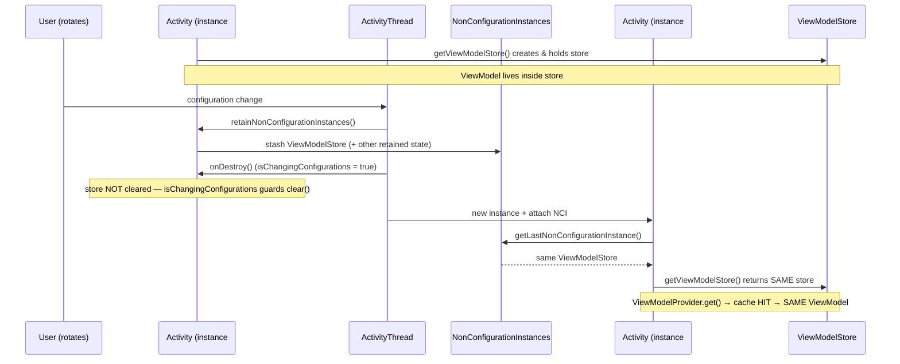
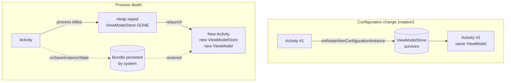
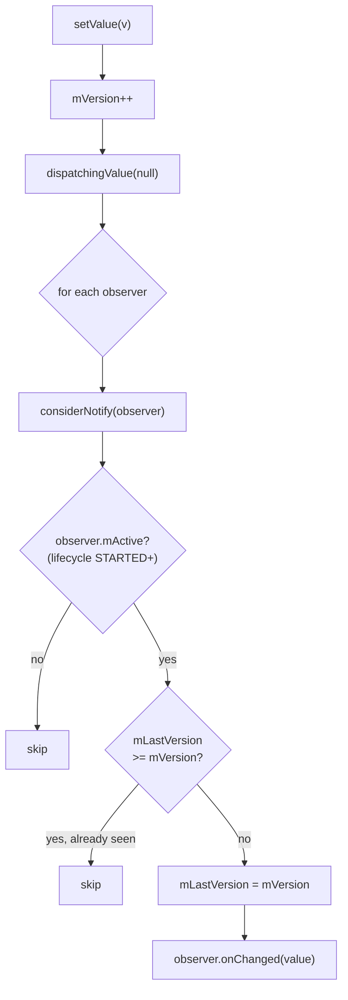

# ViewModel & LiveData — Internals

A senior-level walk through the machinery behind `androidx.lifecycle`. This is internals-first: how a ViewModel physically survives a configuration change, why it *cannot* survive process death, how `LiveData` wraps observers and gates emissions on lifecycle state, and where all of this loses to `StateFlow` today.

!!! abstract "TL;DR"
    - A `ViewModel` is retained because the framework stashes a `ViewModelStore` in a **non-configuration instance** that the new `Activity` inherits. It is plain heap memory — it dies with the process.
    - `SavedStateHandle` is the *only* ViewModel-scoped mechanism that survives process death, because it is backed by the saved-instance-state `Bundle`.
    - `LiveData` is lifecycle-aware: each observer is wrapped, gated on `STARTED`, and a monotonic `mVersion` counter prevents redelivery — except on config change, where a fresh observer with `mLastVersion = -1` *does* get re-emitted (the root of the SingleLiveEvent problem).
    - New code should prefer `StateFlow`/`SharedFlow` for state/events. `LiveData` remains only for legacy interop.

---

## Part A — ViewModel

### A.1 Purpose

A `ViewModel` holds UI-related state and business logic in a scope that **outlives** the lifecycle churn of its owner (an `Activity` rotating, a `Fragment` being detached/reattached). It exists to solve two concrete problems:

1. **State loss on config change.** Without it, every rotation destroys and recreates the `Activity`, discarding in-memory state.
2. **Leaks and cancellation.** `viewModelScope` gives you a `CoroutineScope` that is cancelled exactly once, in `onCleared()`, so background work does not outlive the screen.

!!! warning "What a ViewModel is NOT"
    - Not a place for `Context`/`View`/`Activity` references — those leak. Use `AndroidViewModel` for `Application` context only.
    - Not a persistence layer. It is RAM. Process death wipes it (except `SavedStateHandle`).
    - Not a god object. Business rules belong in the domain/repository layer; the ViewModel orchestrates.

### A.2 The core objects

The retention machinery is four collaborating types. Understanding their relationship is the whole game.

| Type | Role | Where it lives |
|---|---|---|
| `ViewModel` | Your state holder | Inside a `ViewModelStore` |
| `ViewModelStore` | A `HashMap<String, ViewModel>` | Retained across config change |
| `ViewModelStoreOwner` | Interface exposing `getViewModelStore()` | Implemented by `ComponentActivity`, `Fragment`, `NavBackStackEntry` |
| `ViewModelProvider` | Factory + cache lookup | Created on demand, cheap |

```kotlin
// The store is essentially this:
class ViewModelStore {
    private val map = HashMap<String, ViewModel>()
    fun put(key: String, vm: ViewModel) { map.put(key, vm)?.onCleared() }
    operator fun get(key: String): ViewModel? = map[key]
    fun clear() {
        map.values.forEach { it.clear() } // calls onCleared()
        map.clear()
    }
}
```

`ViewModelProvider.get()` is a **cache lookup, not a constructor call**. It derives a key (default: `"androidx.lifecycle.ViewModelProvider.DefaultKey:" + canonicalName`), checks the store's map, and only invokes the `Factory` on a miss.

```kotlin
// Simplified ViewModelProvider.get()
fun <T : ViewModel> get(key: String, modelClass: Class<T>): T {
    val cached = store[key]
    if (modelClass.isInstance(cached)) return cached as T  // HIT → same instance survives rotation
    return factory.create(modelClass, extras).also { store.put(key, it) } // MISS → build once
}
```

### A.3 How it survives a configuration change

This is the interview centerpiece. The `ViewModelStore` is *not* recreated on rotation because the framework transfers it to the new `Activity` instance via the **non-configuration instance** mechanism.



The guard that makes this correct lives in `ComponentActivity`:

```kotlin
// ComponentActivity, simplified
init {
    lifecycle.addObserver(LifecycleEventObserver { _, event ->
        if (event == Lifecycle.Event.ON_DESTROY) {
            // Rotation: DON'T clear. Real finish: DO clear.
            if (!isChangingConfigurations) {
                viewModelStore.clear()
            }
        }
    })
}

override fun onRetainNonConfigurationInstance(): Any {
    return NonConfigurationInstances(viewModelStore) // handed to the next instance
}
```

!!! note "Hilt / `ActivityRetainedComponent`"
    With Hilt, the retained scope is anchored to `ViewModelStore` lifetime too. `ActivityRetainedComponent` is created by a "holder" `ViewModel` stored in the Activity's `ViewModelStore`; it lives across config changes and is destroyed in that holder's `onCleared()`. This is why `@ActivityRetainedScoped` dependencies survive rotation but die on real finish — same lifetime as `ViewModelStore.clear()`.

### A.4 Why it does NOT survive process death

The `ViewModelStore` is a plain Java object on the heap, held only by a live `Activity`/`NonConfigurationInstances`. When Android kills your process (low memory, user swipes away then returns), the entire heap is gone. On relaunch the OS restores the **task/back stack and the saved-instance-state `Bundle`**, but every `ViewModel` is reconstructed from scratch.



!!! danger "The senior distinction"
    "Survives config change" and "survives process death" are **different guarantees with different mechanisms.**
    - Config change → in-memory retention via `NonConfigurationInstances`.
    - Process death → serialized `Bundle` via `onSaveInstanceState` / `SavedStateHandle`.
    A ViewModel gives you the first for free. You must *opt into* the second with `SavedStateHandle`.

### A.5 Scopes — who owns the store

The lifetime of a ViewModel equals the lifetime of the `ViewModelStoreOwner` you scope it to. Choosing the owner *is* choosing the lifetime.

| Scope | How | Cleared when |
|---|---|---|
| Activity-scoped | `by viewModels()` in Activity | Activity finishes |
| Fragment-scoped | `by viewModels()` in Fragment | Fragment destroyed (not just view) |
| Shared between fragments | `by activityViewModels()` | Host Activity finishes |
| Nav-graph-scoped | `by navGraphViewModels(R.id.graph)` | Back stack entry popped |

```kotlin
class DetailFragment : Fragment() {
    // Own instance, dies with this fragment
    private val vm: DetailViewModel by viewModels()

    // Shared with the host Activity and sibling fragments — same instance
    private val shared: CartViewModel by activityViewModels()

    // Scoped to a nested nav graph — shared by destinations in that graph,
    // cleared when the graph leaves the back stack
    private val flow: CheckoutViewModel by navGraphViewModels(R.id.checkout_graph)
}
```

!!! tip "Fragment view vs Fragment lifecycle"
    `by viewModels()` is tied to the **Fragment**, which can outlive its view (e.g. on the back stack, or during `putFragmentOnBackStack`). If you scope to `viewLifecycleOwner` for *observation* but the ViewModel to the Fragment, an observer registered against the old view can survive — always observe with `viewLifecycleOwner`, not `this`.

### A.6 `ViewModelProvider.Factory`

The `Factory` is how a ViewModel with constructor arguments gets built. Three tiers:

**1. Default** — no-arg or `Application`-arg ViewModels, resolved automatically.

**2. Custom factory** — for constructor injection without a DI framework:

```kotlin
class UserViewModel(private val repo: UserRepository) : ViewModel()

class UserViewModelFactory(
    private val repo: UserRepository
) : ViewModelProvider.Factory {
    override fun <T : ViewModel> create(modelClass: Class<T>): T {
        require(modelClass.isAssignableFrom(UserViewModel::class.java))
        @Suppress("UNCHECKED_CAST")
        return UserViewModel(repo) as T
    }
}
```

**3. `CreationExtras` (modern) + AssistedInject** — the newer `create(modelClass, extras)` overload passes a typed `CreationExtras` map, which is how `SavedStateHandle` and runtime arguments flow in. This is what lets you build a ViewModel that needs *both* injected deps and a runtime id.

```kotlin
// Modern CreationExtras-based factory
class ItemViewModel(
    private val repo: Repo,
    private val itemId: String,
    private val handle: SavedStateHandle,
) : ViewModel()

object ItemVmKey : CreationExtras.Key<String>

class ItemViewModelFactory(private val repo: Repo) : ViewModelProvider.Factory {
    override fun <T : ViewModel> create(modelClass: Class<T>, extras: CreationExtras): T {
        val handle = extras.createSavedStateHandle()          // built from extras
        val id = extras[ItemVmKey] ?: error("itemId required")
        @Suppress("UNCHECKED_CAST")
        return ItemViewModel(repo, id, handle) as T
    }
}

// Supplying an extra at call site:
val vm: ItemViewModel by viewModels(
    extrasProducer = {
        MutableCreationExtras(defaultViewModelCreationExtras).apply {
            this[ItemVmKey] = "item-42"
        }
    },
    factoryProducer = { ItemViewModelFactory(repo) }
)
```

!!! note "Hilt's `@HiltViewModel` + `@AssistedInject`"
    Hilt generates a `CreationExtras`-aware factory for you. For per-instance runtime args, combine `@HiltViewModel(assistedFactory = ...)` with `@AssistedInject`/`@Assisted`, then obtain the VM with `hiltViewModel<T, Factory> { factory.create(id) }` in Compose. Under the hood it is exactly the `CreationExtras` path above.

### A.7 `SavedStateHandle` — surviving process death

`SavedStateHandle` is a key-value map wired into the `SavedStateRegistry`. On `onSaveInstanceState` its contents are written to the system `Bundle`; on recreation after process death they are restored. It is the bridge across the one boundary a plain ViewModel cannot cross.

```kotlin
@HiltViewModel
class SearchViewModel @Inject constructor(
    private val handle: SavedStateHandle,
) : ViewModel() {

    // Direct get/set — value survives process death
    var lastTab: Int
        get() = handle["tab"] ?: 0
        set(v) { handle["tab"] = v }

    // Reactive: a Flow that re-emits restored value on recreation
    val query: StateFlow<String> =
        handle.getStateFlow(KEY_QUERY, "")

    // LiveData variant for legacy screens
    val queryLive: MutableLiveData<String> =
        handle.getLiveData(KEY_QUERY, "")

    fun onQueryChange(q: String) { handle[KEY_QUERY] = q } // persisted immediately

    companion object { private const val KEY_QUERY = "query" }
}
```

| | Plain field | `SavedStateHandle` |
|---|---|---|
| Config change | Survives | Survives |
| Process death | **Lost** | **Survives** (Bundle) |
| Size limit | Heap | `Bundle` (~1MB TransactionTooLarge risk) |
| Types | Anything | `Bundle`-able only |

!!! warning "Keep it small"
    `SavedStateHandle` is Bundle-backed. Store *identifiers and small UI state* (selected id, query text, scroll position) — never large lists or bitmaps. Rehydrate heavy data from the repository using the saved id.

### A.8 `AndroidViewModel` vs `ViewModel`

`AndroidViewModel` is a thin subclass that holds the `Application` instance. Use it **only** when you genuinely need an `Application` context (e.g. `getSystemService`, resources) and cannot inject it.

```kotlin
class ExportViewModel(app: Application) : AndroidViewModel(app) {
    fun cacheDir() = getApplication<Application>().cacheDir
}
```

!!! tip "Prefer plain ViewModel + injection"
    `AndroidViewModel` couples the ViewModel to Android and makes it harder to unit-test. In a DI codebase, inject exactly the dependency you need (a `Resources`, a `@ApplicationContext Context`) into a plain `ViewModel` instead. Holding `Application` is safe (it lives for the whole process); holding an `Activity`/`View` context is a leak.

### A.9 `onCleared()`

Called exactly once, when the owning `ViewModelStore` is cleared (real finish, fragment destroy, nav-pop) — **not** on config change. Use it to release resources the framework can't reclaim: unregister listeners, close `Closeable`s, cancel non-`viewModelScope` work.

```kotlin
class LocationViewModel @Inject constructor(
    private val client: LocationClient,
) : ViewModel() {
    private val callback = LocationCallback { /* ... */ }
    init { client.register(callback) }

    override fun onCleared() {
        client.unregister(callback) // viewModelScope is auto-cancelled; manual resources are not
    }
}
```

`viewModelScope` is cancelled automatically right before `onCleared()` via an internal `Closeable` the framework adds, so you rarely cancel jobs by hand.

---

## Part B — LiveData

### B.1 Basics

`LiveData<T>` is an observable data holder that is **lifecycle-aware**: it only delivers updates to observers whose `Lifecycle` is at least `STARTED`, and it automatically removes observers when their lifecycle hits `DESTROYED`. That combination is what prevents the two classic bugs it was built to kill: updating a stopped UI, and leaking a destroyed Activity through a dangling observer.

```kotlin
val liveData = MutableLiveData<Int>()
liveData.observe(viewLifecycleOwner) { value -> render(value) }
liveData.value = 5 // main thread only
```

### B.2 Internals — observer wrappers

Every `observe()` call wraps your `Observer<T>` in an internal `ObserverWrapper`. There are two concrete wrappers, chosen by which `observe` overload you called.

| Wrapper | Created by | Respects lifecycle? | Auto-removed? |
|---|---|---|---|
| `LifecycleBoundObserver` | `observe(owner, observer)` | Yes — active only when `STARTED`+ | Yes, on `DESTROYED` |
| `AlwaysActiveObserver` | `observeForever(observer)` | No — always "active" | No — you must `removeObserver` |

```kotlin
// Conceptual shape of the wrapper hierarchy
abstract class ObserverWrapper(val observer: Observer<T>) {
    var mActive = false
    var mLastVersion = START_VERSION // -1
    abstract fun shouldBeActive(): Boolean
    fun activeStateChanged(newActive: Boolean) {
        if (newActive == mActive) return
        mActive = newActive
        if (mActive) dispatchingValue(this) // pull latest on becoming active
    }
}

// Lifecycle-aware: active iff owner is STARTED or RESUMED
class LifecycleBoundObserver(val owner: LifecycleOwner, obs: Observer<T>)
    : ObserverWrapper(obs), LifecycleEventObserver {
    override fun shouldBeActive() =
        owner.lifecycle.currentState.isAtLeast(Lifecycle.State.STARTED)
    override fun onStateChanged(src: LifecycleOwner, e: Lifecycle.Event) {
        if (owner.lifecycle.currentState == DESTROYED) { removeObserver(observer); return }
        activeStateChanged(shouldBeActive())
    }
}
```

### B.3 The version mechanism

This is the heart of dedup and the source of the config-change "re-emission" surprise. `LiveData` keeps a monotonically increasing `mVersion`. Each observer wrapper keeps `mLastVersion`. A value is delivered to an observer only when the data version is *ahead* of what that observer last saw.

```kotlin
// LiveData.considerNotify(observer) — the delivery gate
private fun considerNotify(observer: ObserverWrapper) {
    if (!observer.mActive) return                       // gate 1: lifecycle STARTED?
    if (!observer.shouldBeActive()) {                   // re-check, may have changed
        observer.activeStateChanged(false); return
    }
    if (observer.mLastVersion >= mVersion) return       // gate 2: already seen this version?
    observer.mLastVersion = mVersion                    // catch up
    observer.observer.onChanged(mData as T)             // finally deliver
}
```

- `setValue` / `postValue` increment `mVersion` and dispatch.
- A **new** observer starts at `mLastVersion = -1`, so if `LiveData` already holds a value (`mVersion >= 0`), it immediately receives the current value on registration.

!!! note "Why rotation re-delivers"
    After rotation the *ViewModel and its LiveData survive* (so `mVersion` is unchanged), but the new Fragment registers a **brand-new observer** with `mLastVersion = -1`. `considerNotify` sees `-1 < mVersion` and delivers again. That is correct for *state* (you want the latest value) but wrong for *one-shot events* (you don't want the toast to fire twice). See B.9.



### B.4 Threading — `setValue` vs `postValue`

```kotlin
liveData.value = x         // setValue: MUST be main thread, synchronous
liveData.postValue(x)      // postValue: any thread, schedules to main
```

- **`setValue`** asserts main thread (`assertMainThread()`), sets `mData`, bumps `mVersion`, dispatches synchronously. Throws `IllegalStateException` off the main thread.
- **`postValue`** stores the value in a `mPendingData` field guarded by a lock and posts a runnable to the main-thread handler.

!!! danger "The postValue race — last-write-wins coalescing"
    `postValue` is **not** a queue. If you call it several times before the posted runnable runs, only the **last** value is delivered — intermediate values are silently dropped (coalesced).
    ```kotlin
    // Off the main thread:
    liveData.postValue(1)
    liveData.postValue(2)
    liveData.postValue(3)
    // Main-thread observer very likely sees only 3. Values 1 and 2 are lost.
    ```
    Internally: the first `postValue` sets `mPendingData` and posts the runnable; later calls just overwrite `mPendingData` (a sentinel guards against re-posting). The runnable reads whatever `mPendingData` holds when it finally runs. Never rely on `postValue` for a stream where every value matters — this is a real cause of "my counter skips values" bugs.

### B.5 `observe` vs `observeForever`

- `observe(owner) {}` — lifecycle-bound, auto-cleanup. The default and safe choice.
- `observeForever {}` — `AlwaysActiveObserver`, receives everything immediately, **never auto-removed**. You must call `removeObserver` yourself or you leak. Use only outside a lifecycle (e.g. in a repository or a `MediatorLiveData` source) and always pair with removal.

### B.6 `MutableLiveData`

Just `LiveData` with public `setValue`/`postValue`. Convention: expose an immutable `LiveData<T>` publicly, keep the `MutableLiveData<T>` private and backing.

```kotlin
private val _state = MutableLiveData<UiState>()
val state: LiveData<UiState> = _state
```

### B.7 `MediatorLiveData`

`MediatorLiveData` observes *other* LiveData sources and re-emits, letting you combine/react. It wires each source with `observeForever` internally but manages activation based on *its own* observers' lifecycle — so it only listens while it has an active downstream observer. This is the building block behind `Transformations`.

```kotlin
val a = MutableLiveData(0)
val b = MutableLiveData(0)
val sum = MediatorLiveData<Int>().apply {
    var av = 0; var bv = 0
    addSource(a) { av = it; value = av + bv }
    addSource(b) { bv = it; value = av + bv }
}
```

### B.8 `Transformations`

Built on `MediatorLiveData`. In Kotlin (`androidx.lifecycle:lifecycle-livedata-ktx`) these are extension functions.

```kotlin
// map: synchronous 1:1 transform, runs on main thread
val name: LiveData<String> = user.map { it.displayName }

// switchMap: swap the upstream — old source is removed, new one added.
// Classic use: query text → new DB query LiveData
val results: LiveData<List<Item>> = query.switchMap { q ->
    repository.search(q) // returns LiveData; previous search auto-detached
}
```

!!! note "`map` vs `switchMap`"
    `map` transforms the *value*. `switchMap` transforms into a *new LiveData source* and switches subscription to it, discarding the previous one — the right tool when each input spawns an async lookup and you must not leak or cross-deliver stale results.

### B.9 `distinctUntilChanged`

Suppresses consecutive duplicate values (by `==`). Handy against config-change re-emission of the *same* state and redundant renders.

```kotlin
val stable: LiveData<UiState> = _state.distinctUntilChanged()
```

It does not fix one-shot events — a distinct *new* event still re-delivers to a fresh observer.

### B.10 Problems and patterns

**Config-change re-emission** (B.3): fine for state, harmful for events (navigation, toasts, snackbars fire again after rotation).

**`SingleLiveEvent`** — a historical subclass using an `AtomicBoolean` "pending" flag so only one observer consumes each emission once. Works but is limited to a single observer and is easy to misuse.

**Event wrapper (preferred over `SingleLiveEvent`)** — wrap the payload; each consumer marks it handled.

```kotlin
class Event<out T>(private val content: T) {
    private var handled = false
    fun getContentIfNotHandled(): T? =
        if (handled) null else { handled = true; content }
    fun peek(): T = content
}

// In ViewModel
private val _navTo = MutableLiveData<Event<String>>()
val navTo: LiveData<Event<String>> = _navTo
fun onDone() { _navTo.value = Event("home") }

// In Fragment — survives rotation without re-navigating
viewModel.navTo.observe(viewLifecycleOwner) { event ->
    event.getContentIfNotHandled()?.let { dest -> navigate(dest) }
}
```

!!! tip "Modern answer: don't use LiveData for events at all"
    The whole `Event`/`SingleLiveEvent` saga exists *because* LiveData conflates state and events. `SharedFlow` (events) + `StateFlow` (state) removes the problem structurally — events are a hot stream with no "current value" to redeliver.

### B.11 LiveData vs StateFlow vs SharedFlow

| Aspect | `LiveData` | `StateFlow` | `SharedFlow` |
|---|---|---|---|
| Holds current value | Yes | Yes (`.value`) | No (configurable `replay`) |
| Initial value required | No | **Yes** | No |
| Lifecycle-aware | Yes (built in) | No — use `repeatOnLifecycle` / `collectAsStateWithLifecycle` | No — same |
| Conflation | Latest wins | Latest wins (dedups equal via `==`) | Configurable (`replay`, `extraBufferCapacity`, `onBufferOverflow`) |
| Duplicate suppression | Opt-in (`distinctUntilChanged`) | **Always** (equality) | Off by default |
| Threading | main-thread delivery; `postValue` race | dispatcher-driven, no hidden coalescing surprises | same |
| Good for | Legacy interop | **UI state** | **One-shot events** |
| Platform dependency | Android (`androidx`) | Pure Kotlin (KMP-friendly) | Pure Kotlin |
| Backpressure control | None | None (conflating) | Full (buffer + overflow policy) |
| Operators | Few (`map`, `switchMap`) | Full coroutines `Flow` operators | Full `Flow` operators |

**Why `StateFlow` is preferred today**

- **Not tied to the Android platform** — testable with `runTest`, reusable in KMP, no `InstantTaskExecutorRule` hacks.
- **No `postValue` coalescing footgun** and no implicit main-thread requirement; you control the dispatcher.
- **Structurally separates state from events** (`StateFlow` for state, `SharedFlow` for events), killing the `SingleLiveEvent` class of bugs.
- **Rich operator set** and first-class Compose integration via `collectAsStateWithLifecycle()`.
- Lifecycle-awareness — the one thing `LiveData` had for free — is regained with `repeatOnLifecycle(STARTED)` / `collectAsStateWithLifecycle`, which is the modern equivalent of the `STARTED` gate.

```kotlin
// StateFlow equivalent of a LiveData-backed screen state
class ProfileViewModel @Inject constructor(
    repo: UserRepository,
) : ViewModel() {

    private val _state = MutableStateFlow<UiState>(UiState.Loading)  // initial value REQUIRED
    val state: StateFlow<UiState> = _state.asStateFlow()

    // One-shot events go to SharedFlow, NOT StateFlow (no redelivery on rotation)
    private val _events = MutableSharedFlow<UiEvent>()               // replay = 0
    val events: SharedFlow<UiEvent> = _events.asSharedFlow()

    fun load() = viewModelScope.launch {
        _state.value = UiState.Loading
        runCatching { repo.profile() }
            .onSuccess { _state.value = UiState.Data(it) }
            .onFailure { _events.emit(UiEvent.ShowError(it.message)) }
    }
}

// View side (lifecycle gating == LiveData's STARTED gate)
lifecycleScope.launch {
    repeatOnLifecycle(Lifecycle.State.STARTED) {
        launch { vm.state.collect { render(it) } }         // state: safe to re-collect
        launch { vm.events.collect { handleEvent(it) } }   // events: consumed once
    }
}
// Compose:
val state by vm.state.collectAsStateWithLifecycle()
```

---

## Interview Q&A

### Q1. Mechanically, how does a ViewModel survive a rotation but not process death?

**Answer.** On a configuration change, `ComponentActivity.onRetainNonConfigurationInstance()` stashes the `ViewModelStore` (a `HashMap<String, ViewModel>`) into a `NonConfigurationInstances` object that `ActivityThread` hands to the *new* Activity instance. The new Activity's `getViewModelStore()` returns that same store, so `ViewModelProvider.get()` is a cache **hit** and returns the identical ViewModel instance. Crucially, `onDestroy` only calls `viewModelStore.clear()` when `!isChangingConfigurations`, so rotation skips the clear. Process death is different: the store is plain heap memory reachable only from the live Activity, so when the OS kills the process the heap — and the store — are gone. On relaunch the system restores the back stack and the saved-instance-state `Bundle`, but every ViewModel is rebuilt from scratch.

*Follow-up: So how do you retain state across process death?* `SavedStateHandle`, which is backed by the `SavedStateRegistry`/`Bundle` and persisted in `onSaveInstanceState`. Store small identifiers and UI state there, then rehydrate heavy data from the repository.

### Q2. Walk me through what `LiveData.considerNotify` does and why rotation re-delivers a value.

**Answer.** Each observer is a wrapper holding `mActive` and `mLastVersion`; the LiveData holds a monotonic `mVersion`. `considerNotify` delivers only if (1) the observer is active — its lifecycle is `STARTED`+ — and (2) `mLastVersion < mVersion`, i.e. it hasn't seen this version. On delivery it sets `mLastVersion = mVersion`. After rotation the ViewModel and its LiveData survive so `mVersion` is unchanged, but the recreated Fragment registers a **new** observer initialized with `mLastVersion = -1`. Since `-1 < mVersion`, the current value is delivered again. That's correct for state (you want the latest), but wrong for one-shot events.

*Follow-up: How do you stop an event firing twice?* Use an `Event` wrapper with a `getContentIfNotHandled()` flag, or better, move events to a `SharedFlow` (replay 0), which has no current value to redeliver.

### Q3. What's the difference between `setValue` and `postValue`, and what's the trap?

**Answer.** `setValue` must run on the main thread, sets the data and dispatches synchronously; called off-main it throws. `postValue` can be called from any thread — it stores the value in a lock-guarded `mPendingData` and posts a runnable to the main handler. The trap is **coalescing**: `postValue` is not a queue. Multiple `postValue` calls before the runnable executes overwrite `mPendingData`, so observers only see the last value; intermediate values are silently dropped.

*Follow-up: When does that bite in production?* Any high-frequency background source — sensor streams, progress counters, rapid DB updates posted from a worker — where you assumed every emission is delivered. `StateFlow` conflates too, but it exposes `.value` synchronously and gives you buffering options via `SharedFlow` when you need every value.

### Q4. `Transformations.map` vs `switchMap` — internals and when to use each.

**Answer.** Both are built on `MediatorLiveData`. `map` adds the upstream as a single source and emits a synchronous transform of each value — a value-to-value mapping on the main thread. `switchMap` adds the upstream as a source, and for each upstream value it produces a **new LiveData**, removes the previously-added inner source, and adds the new one — switching the subscription. Use `map` for pure transforms (entity → display string); use `switchMap` when each input triggers a new asynchronous lookup (query text → a fresh DB/network LiveData) so the old query is detached and can't cross-deliver stale results.

*Follow-up: What's the Flow equivalent?* `map` → `Flow.map`; `switchMap` → `Flow.flatMapLatest`, which cancels the previous inner flow when a new upstream value arrives.

### Q5. Why is `StateFlow` preferred over `LiveData` for new code, and what do you lose?

**Answer.** `StateFlow` is pure Kotlin (KMP-capable, unit-testable with `runTest` and no `InstantTaskExecutorRule`), has no hidden main-thread requirement or `postValue` coalescing footgun, always dedups equal consecutive values, and comes with the full `Flow` operator set. Structurally it lets you separate state (`StateFlow`) from events (`SharedFlow`), which eliminates the entire `SingleLiveEvent` problem. What you lose is built-in lifecycle awareness — LiveData gates on `STARTED` and auto-removes on `DESTROYED` for free. You regain it with `repeatOnLifecycle(STARTED)` or `collectAsStateWithLifecycle()`.

*Follow-up: What happens if you collect a StateFlow with plain `lifecycleScope.launch { collect {} }`?* Collection keeps running while the app is merely in the background (only stopped at `DESTROYED`), so you can update a stopped UI and waste work. Always wrap in `repeatOnLifecycle` / use `collectAsStateWithLifecycle` to mirror LiveData's `STARTED` gate.

### Q6. How do you build a ViewModel that needs both an injected repository and a runtime argument (like an item id)?

**Answer.** Use the `CreationExtras`-based `ViewModelProvider.Factory.create(modelClass, extras)` overload. Define a `CreationExtras.Key` for the runtime arg, populate a `MutableCreationExtras` at the call site (via `extrasProducer` in `viewModels()`), and read it in the factory alongside `extras.createSavedStateHandle()`. With Hilt this is the `@HiltViewModel(assistedFactory = ...)` + `@AssistedInject`/`@Assisted` pattern — Hilt generates a `CreationExtras`-aware factory and you call `factory.create(id)`.

*Follow-up: Why not just pass the id into the constructor via a plain custom factory?* You can, but then that ViewModel's scope caches the *first* id under the default key — navigating to a different item returns the stale instance unless you also vary the key. `CreationExtras`/assisted injection keeps DI wiring and per-instance args cleanly separated, and pairs correctly with `SavedStateHandle` so the id survives process death.
