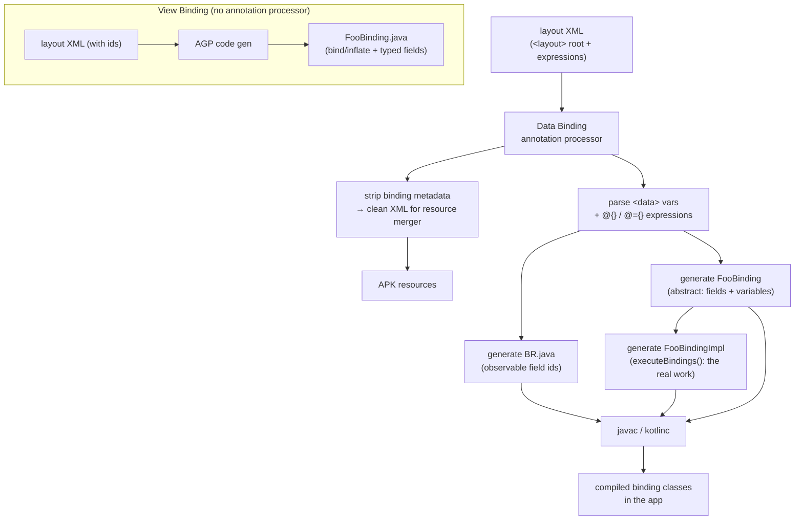

# Data Binding & View Binding

View systems on Android have offered four ways to reach a widget from code: `findViewById`, Kotlin synthetics (Kotlin Android Extensions), View Binding, and Data Binding. Only two survive as sane choices today — and for greenfield UI, the honest senior answer is **neither: use Jetpack Compose**. This deep-dive explains all four so you can defend the trade-offs in an interview and maintain the enormous body of existing XML-based code that will outlive Compose migrations by years.

!!! abstract "TL;DR the senior take"
    - **View Binding** is the correct default for XML views: compile-time-safe, null-safe, zero runtime reflection, negligible build cost.
    - **Data Binding** buys you two-way binding, `@BindingAdapter`s, and expressions in XML — at the cost of an annotation-processing (kapt/KSP) build tax and a class of runtime binding errors. Reach for it only when you genuinely need declarative two-way binding against an MVVM layer.
    - **`findViewById`** is verbose and crash-prone (`ClassCastException`, `NullPointerException`). **Kotlin synthetics** are deprecated and dangerous (leak view refs across layouts, no null-safety across layout variants).
    - **New work → Compose.** Binding is a bridge technology.

---

## View Binding

View Binding generates one lightweight `binding` class per XML layout. It is a pure code-generation feature — no annotation processor, no reflection, no runtime expression engine.

### Setup

```kotlin
// module build.gradle.kts
android {
    buildFeatures {
        viewBinding = true
    }
}
```

That single flag makes the Android Gradle Plugin generate a binding class for **every** layout in the module. To skip a layout, add `tools:viewBindingIgnore="true"` to its root element.

### The generated binding class

For `res/layout/activity_main.xml`, AGP generates `ActivityMainBinding` (snake_case file → PascalCase class, `_binding` suffix stripped). Every view with an `android:id` becomes a public final field, typed to the exact view class:

```xml
<!-- res/layout/activity_main.xml -->
<LinearLayout ...>
    <TextView android:id="@+id/title_text" ... />
    <Button   android:id="@+id/submit_button" ... />
    <View                                     ... />  <!-- no id → not in binding -->
</LinearLayout>
```

```kotlin
// Generated (simplified)
public final class ActivityMainBinding implements ViewBinding {
    @NonNull public final LinearLayout rootView;
    @NonNull public final TextView titleText;
    @NonNull public final Button submitButton;

    @NonNull @Override public View getRoot() { return rootView; }

    @NonNull public static ActivityMainBinding inflate(@NonNull LayoutInflater inflater) { ... }
    @NonNull public static ActivityMainBinding bind(@NonNull View rootView) { ... }
}
```

Key properties:

- **ID → camelCase field.** `title_text` becomes `titleText`. IDs are the only naming contract you must know.
- **Exact types.** `submitButton` is a `Button`, not a `View`. No casting, no `ClassCastException`.
- **Only IDs materialize.** Views without `android:id` are absent from the binding — they cost nothing.

### Null-safety for optional views

View Binding's null contract is subtle and a favorite interview probe.

- Views present in **all** configurations of a layout → `@NonNull` field.
- Views present in **some** layout variants (e.g. in `layout/` but not `layout-land/`) → `@Nullable` field, forcing a null check.

```kotlin
// present only in one config → generated as nullable
binding.optionalSidebar?.visibility = View.VISIBLE
```

This is compile-time-enforced correctness that synthetics never provided: synthetics happily returned a non-null property that crashed at runtime when the current configuration's layout lacked that view.

### Usage in an Activity

```kotlin
class MainActivity : AppCompatActivity() {
    private lateinit var binding: ActivityMainBinding

    override fun onCreate(savedInstanceState: Bundle?) {
        super.onCreate(savedInstanceState)
        binding = ActivityMainBinding.inflate(layoutInflater)
        setContentView(binding.root)          // pass the inflated root, not R.layout.*

        binding.titleText.text = "Senior Prep"
        binding.submitButton.setOnClickListener { submit() }
    }
}
```

An Activity holds the binding for its whole lifecycle, so a plain `lateinit var` is fine — the Activity and its view tree are destroyed together.

### Usage in a Fragment (the nulling pattern)

Fragments are the trap. A Fragment instance **outlives its view**: after `onDestroyView()` the view hierarchy is gone but the Fragment object may live on (e.g. on the back stack). Holding the binding in a `lateinit var` leaks the entire view tree and invites use-after-destroy crashes. The canonical fix is a nullable backing field cleared in `onDestroyView`.

```kotlin
class ProfileFragment : Fragment(R.layout.fragment_profile) {

    // nullable backing + non-null accessor valid only between onCreateView & onDestroyView
    private var _binding: FragmentProfileBinding? = null
    private val binding get() = _binding!!

    override fun onCreateView(
        inflater: LayoutInflater, container: ViewGroup?, savedInstanceState: Bundle?
    ): View {
        _binding = FragmentProfileBinding.inflate(inflater, container, false)
        return binding.root
    }

    override fun onViewCreated(view: View, savedInstanceState: Bundle?) {
        super.onViewCreated(view, savedInstanceState)

        // observe on the VIEW lifecycle, not the Fragment lifecycle — this is the real bug-magnet
        viewModel.state
            .flowWithLifecycle(viewLifecycleOwner.lifecycle, Lifecycle.State.STARTED)
            .onEach { binding.nameText.text = it.name }
            .launchIn(viewLifecycleOwner.lifecycleScope)
    }

    override fun onDestroyView() {
        super.onDestroyView()
        _binding = null    // release the view tree; without this you leak it
    }
}
```

!!! danger "viewLifecycleOwner vs this"
    Inside a Fragment, always drive UI observers with `viewLifecycleOwner`, never `this` (the Fragment). If you observe LiveData/Flow with the Fragment lifecycle, then after `onDestroyView` → `onCreateView` (nav back-stack, `replace()`), the **old** observer is still active and fires against a `binding` you just nulled → NPE, or worse, updates a detached view and leaks it. This is the single most common Fragment binding bug in code review.

!!! tip "Kill the boilerplate"
    The `_binding`/`null` dance repeats in every Fragment. Extract it into a property delegate (e.g. the well-known `viewBinding { }` delegate or Android's `FragmentViewBindingDelegate`) that auto-nulls by observing the `viewLifecycleOwner`. Seniors are expected to know the pattern exists and to have wrapped it once.

### Usage in a RecyclerView.Adapter

Pass the binding into the `ViewHolder` and hold it there. `inflate` on the item layout replaces the classic `LayoutInflater.inflate(...) + findViewById` pair.

```kotlin
class UserAdapter : ListAdapter<User, UserAdapter.VH>(DIFF) {

    class VH(val binding: ItemUserBinding) : RecyclerView.ViewHolder(binding.root) {
        fun bind(user: User) = with(binding) {
            nameText.text = user.name
            avatarImage.setImageResource(user.avatarRes)
        }
    }

    override fun onCreateViewHolder(parent: ViewGroup, viewType: Int): VH {
        val inflater = LayoutInflater.from(parent.context)
        return VH(ItemUserBinding.inflate(inflater, parent, false))  // attachToParent = false
    }

    override fun onBindViewHolder(holder: VH, position: Int) = holder.bind(getItem(position))

    companion object {
        val DIFF = object : DiffUtil.ItemCallback<User>() {
            override fun areItemsTheSame(a: User, b: User) = a.id == b.id
            override fun areContentsTheSame(a: User, b: User) = a == b
        }
    }
}
```

### Why View Binding replaced findViewById & synthetics

| Concern | `findViewById` | Kotlin synthetics | View Binding |
|---|---|---|---|
| Null-safety | none — returns view or null, you cast | fake: non-null property, crashes across configs | real, compile-time |
| Type-safety | manual cast, `ClassCastException` risk | inferred but unsound across layouts | exact type per id |
| Wrong-layout ids | compiles, crashes at runtime | compiles, crashes at runtime | **won't compile** |
| Reflection/runtime cost | small (view tree walk) | small | none beyond field assignment |
| Status | verbose legacy | **deprecated & removed from Kotlin plugin** | recommended for views |

Synthetics were deprecated because they lied: they imported an `import kotlinx.android.synthetic.main.foo.*` that dumped *all* ids of *some* layout into scope, with no guarantee the id belonged to the layout you actually set. They also polluted the global namespace and coupled Kotlin to a fragile Gradle plugin. View Binding fixes every one of those flaws by generating one explicit, scoped, exactly-typed class per layout.

---

## Data Binding

Data Binding is a superset: it can do everything View Binding does (it also generates a `binding` class) **plus** bind data directly in XML via an expression language, run one-way and two-way bindings, and dispatch UI updates from observable data. It is powered by an annotation processor, so it carries a real build cost.

```kotlin
android { buildFeatures { dataBinding = true } }
```

Data Binding layouts are wrapped in a `<layout>` root, which is what tells AGP to process them:

```xml
<layout xmlns:android="http://schemas.android.com/apk/res/android">
    <data>
        <variable name="vm" type="com.example.ProfileViewModel" />
    </data>

    <TextView
        android:text="@{vm.userName}" ... />           <!-- one-way: data → view -->
</layout>
```

```kotlin
val binding: ActivityProfileBinding =
    DataBindingUtil.setContentView(this, R.layout.activity_profile)
binding.vm = viewModel
binding.lifecycleOwner = this   // REQUIRED for LiveData/StateFlow to auto-update
```

### One-way binding

`android:attr="@{expression}"` pushes data into the view whenever the observable source changes. The expression language supports method calls, string concat, ternaries, null-coalescing (`??`), and resource references:

```xml
android:text="@{vm.user.name ?? @string/anonymous}"
android:visibility="@{vm.loading ? View.GONE : View.VISIBLE}"
```

### Observability: what actually triggers a re-bind

Data Binding only re-runs an expression when its source is *observable*. Three flavors:

- **`ObservableField<T>` / `ObservableInt` etc.** — wrap a single value; `set()` notifies.
- **`BaseObservable` + `@Bindable`** — annotate getters, call `notifyPropertyChanged(BR.x)` in setters for fine-grained updates on a POJO.
- **`LiveData` / `StateFlow`** — the modern choice; requires `binding.lifecycleOwner`. Data Binding subscribes for you and unsubscribes with the lifecycle.

```kotlin
class ProfileViewModel : ViewModel() {
    val userName = MutableLiveData("")            // LiveData path (needs lifecycleOwner)
    val score = ObservableInt(0)                  // ObservableField path (no lifecycleOwner needed)
}
```

!!! warning "The silent no-update bug"
    Binding a `LiveData`/`StateFlow` but forgetting `binding.lifecycleOwner = this` produces a UI that renders the initial value and never updates again — no crash, no log. It's the most-reported Data Binding "bug" and it's always this.

### `@BindingAdapter` — custom attributes

A `@BindingAdapter` teaches the framework how to apply an arbitrary attribute. This is how you bind an image URL, or any attribute the platform doesn't natively support, without touching XML plumbing.

```kotlin
@BindingAdapter("imageUrl", "placeholder", requireAll = false)
fun ImageView.bindImageUrl(url: String?, placeholder: Drawable?) {
    Glide.with(this)
        .load(url)
        .placeholder(placeholder)
        .into(this)
}
```

```xml
<ImageView
    app:imageUrl="@{vm.avatarUrl}"
    app:placeholder="@{@drawable/ph}" />
```

The method's first param is the view, remaining params map to the named attributes. `requireAll = false` lets you supply a subset.

### `@BindingConversion` — type coercion

When an expression yields a type that doesn't match the attribute, register a conversion:

```kotlin
@BindingConversion
fun colorToDrawable(@ColorInt color: Int): Drawable = ColorDrawable(color)
```

```xml
<View android:background="@{vm.highlighted ? @color/hi : @color/bg}" />
<!-- Int color expression coerced to Drawable for android:background -->
```

### Two-way binding: `@={}` and `@InverseBindingAdapter`

One-way is `@{}` (data → view). **Two-way** is `@={}` (data ↔ view): the view also writes back to the observable when the user changes it.

```xml
<EditText android:text="@={vm.query}" />   <!-- typing updates vm.query automatically -->
```

For this to work on a built-in attribute like `android:text`, the framework ships both directions. For **your own** attribute you must supply the read-back side with `@InverseBindingAdapter`, plus a way to signal changes:

```kotlin
// 1. Setter: data -> view (one-way half)
@BindingAdapter("rating")
fun RatingBar.setRating(value: Float) {
    if (rating != value) rating = value
}

// 2. Getter: view -> data (inverse half). The 'attribute' + "AttrChanged" convention links them.
@InverseBindingAdapter(attribute = "rating")
fun RatingBar.getRatingValue(): Float = rating

// 3. Change listener: tells DataBinding when to read back
@BindingAdapter("ratingAttrChanged")
fun RatingBar.setRatingListener(listener: InverseBindingListener?) {
    onRatingBarChangeListener =
        RatingBar.OnRatingBarChangeListener { _, _, _ -> listener?.onChange() }
}
```

```xml
<RatingBar app:rating="@={vm.stars}" />
```

The naming contract is load-bearing: `@InverseBindingAdapter(attribute = "rating")` + a `"ratingAttrChanged"` adapter that receives an `InverseBindingListener`. When the user drags the bar, the listener fires `onChange()`, Data Binding calls your inverse getter, and writes the result into `vm.stars`.

!!! note "Avoiding the two-way infinite loop"
    Two-way binding risks a data→view→data→view cycle. Guard your setter with an equality check (`if (rating != value)`) so a no-op write doesn't re-trigger the change listener. The framework also short-circuits when the value is unchanged, but your custom adapters must cooperate.

---

## Internals

### Code generation flow

Data Binding runs a Gradle-integrated annotation processor at build time. It parses each `<layout>` file, strips the binding metadata, produces a stripped XML for the resource merger, and emits a generated `*Binding` subclass plus a `*BindingImpl` where the expression logic lives.



The critical structural difference: **View Binding is a direct AGP code generator** (fast, no processor round-trip), while **Data Binding is annotation-processing** (kapt/KSP) that additionally rewrites your resources and compiles an expression language.

### The Observable pattern

Data Binding is an implementation of the observer pattern glued to the view tree. Each generated `*BindingImpl` registers listeners on the observable sources it depends on (`ObservableField`, `Observable`'s `PropertyChangeRegistry`, or `LiveData` via the `lifecycleOwner`). When a source notifies, the binding sets a dirty flag (`mDirtyFlags`, a bitfield — one bit per binding expression) and posts an invalidation. On the next frame, `executeBindings()` runs, checks the dirty bits, and updates **only** the affected views. That bitfield is why Data Binding is efficient at partial updates: a change to `vm.name` doesn't re-run the `vm.avatarUrl` expression.

### Binding-expression compilation

The strings inside `@{}` are not evaluated by reflection at runtime. The processor compiles them into plain Java/Kotlin statements inside `executeBindings()`. `android:text="@{vm.user.name}"` becomes roughly:

```java
// inside FooBindingImpl.executeBindings()
if ((dirtyFlags & FLAG_USER_NAME) != 0) {
    String name = (vm != null && vm.getUser() != null) ? vm.getUser().getName() : null;
    TextViewBindingAdapter.setText(this.nameText, name);   // null-safe navigation baked in
}
```

Notice the expression engine inserts **null-safe navigation** automatically — `vm.user.name` never NPEs; any null in the chain yields the default for the type. This is a genuine convenience and also a footgun: silent nulls hide bugs.

---

## Performance & recommendation

| Dimension | `findViewById` | Kotlin synthetics | View Binding | Data Binding |
|---|---|---|---|---|
| Compile-time null-safety | No | Partial (unsound) | **Yes** | Yes (+ null-safe expr) |
| Compile-time type-safety | No (manual cast) | Partial | **Yes** | Yes |
| Build cost | none | Gradle plugin | negligible (AGP codegen) | **high** (kapt/KSP annotation processing) |
| Incremental build impact | none | low | low | noticeable — expression compile + resource rewrite |
| Runtime cost | view-tree walk per call | view-tree walk (cached) | one-time field assignment | field assignment + observer registration + per-frame `executeBindings` |
| Reflection at runtime | No | No | No | No (expressions pre-compiled) |
| Two-way binding | manual | manual | manual | **built-in (`@={}`)** |
| Logic in XML | No | No | No | Yes (double-edged) |
| Debuggability | trivial | poor | good (plain code) | harder (generated Impl, XML stack traces) |
| Status (2026) | legacy | **deprecated** | **recommended for views** | maintenance; not for new work |

### The opinionated recommendation

1. **New UI: Jetpack Compose.** It subsumes both binding technologies. There is no binding class, no `findViewById`, no `viewLifecycleOwner` nulling dance — state flows into composables directly. Every binding pattern above is a workaround for a problem Compose doesn't have.
2. **Existing XML views: View Binding.** Safe, cheap, no build tax, no runtime surprises. This is the correct migration target away from synthetics and `findViewById`.
3. **Data Binding: only if you're already invested in it,** or you need declarative two-way binding tightly coupled to XML. New projects should not adopt it — the build cost, the "logic in XML" anti-pattern (untestable, undebuggable business logic hiding in layouts), and the harder-to-trace failures don't pay for themselves now that Compose exists.

!!! quote "Google's own guidance"
    Google recommends View Binding over Data Binding for the view-reference use case, and recommends Compose for new development. Data Binding predates a first-class UI-state story; Compose is that story.

---

## Interview Q&A

### Q1. Why does the Fragment View Binding pattern use a nullable `_binding` cleared in `onDestroyView`, when Activities just use `lateinit var`?

**Answer.** A Fragment's lifecycle is decoupled from its view's lifecycle. The Fragment instance can outlive its view — on the back stack, in a `ViewPager`, or after `replace()` — going through `onDestroyView()` while the object stays alive, then `onCreateView()` again. If you hold the binding in a non-null field, (a) you leak the entire destroyed view hierarchy for as long as the Fragment lives, and (b) any callback firing after `onDestroyView` touches views that are detached/gone. So you use a nullable backing field, expose a non-null accessor valid only between `onCreateView` and `onDestroyView`, and null it in `onDestroyView` to release the tree. An Activity is destroyed together with its views, so `lateinit var` is safe there.

**Follow-up.** *How would you eliminate the repetition?* A property delegate that observes `viewLifecycleOwner.lifecycle` and auto-nulls the reference on `ON_DESTROY` — the common `viewBinding { }` / `FragmentViewBindingDelegate` idiom.

### Q2. What's the difference between observing with `viewLifecycleOwner` and `this` inside a Fragment, and what bug does the wrong choice cause?

**Answer.** `this` is the Fragment lifecycle (spans the whole Fragment); `viewLifecycleOwner` is the *view's* lifecycle (only while the view exists). UI observers must use `viewLifecycleOwner`. If you observe LiveData/Flow with `this`, then after `onDestroyView` → `onCreateView` you end up with a stale observer still active from the previous view generation. When it fires it either NPEs on a nulled `binding` or updates a detached view and leaks it. With `viewLifecycleOwner`, the observer is torn down at `onDestroyView` and re-registered fresh in the new `onViewCreated`.

**Follow-up.** *For a cold `Flow` with `flowWithLifecycle`/`repeatOnLifecycle`, which owner?* Still `viewLifecycleOwner` — you want collection to stop at `onDestroyView` and restart on the new view, not span views.

### Q3. Walk through what actually happens between `android:text="@={vm.query}"` and the ViewModel field updating.

**Answer.** `@={}` is two-way. Forward direction: `vm.query` (observable) changes → the generated `executeBindings()` runs the compiled expression → `TextViewBindingAdapter.setText(view, value)`. Reverse direction: Data Binding registers a `TextWatcher` (via the built-in inverse adapter for `android:text`); when the user types, the watcher fires an `InverseBindingListener.onChange()`, Data Binding reads the view's current text through the inverse getter, and writes it back into `vm.query`. Equality guards on both sides prevent the data→view→data loop. For a **custom** attribute you provide all three pieces yourself: `@BindingAdapter` (setter), `@InverseBindingAdapter` (getter), and a `"<attr>AttrChanged"` `@BindingAdapter` that wires the view's change callback to the `InverseBindingListener`.

**Follow-up.** *What breaks two-way silently?* Missing `binding.lifecycleOwner` (LiveData never observed), or a custom setter without an equality guard causing an update storm / cursor jump in an `EditText`.

### Q4. Why were Kotlin synthetics deprecated, and how does View Binding fix each flaw?

**Answer.** Synthetics (`kotlinx.android.synthetic`) imported *all* ids of a layout as top-level properties. Flaws: (1) **unsound null/type-safety** — the property was non-null even though the current configuration's layout might not contain that view, crashing at runtime; (2) **wrong-layout access** — nothing stopped you referencing an id that belonged to a *different* layout than the one you set, again a runtime crash; (3) **namespace pollution** and implicit global state; (4) coupling Kotlin to a fragile Gradle plugin. View Binding generates one explicit, scoped class per layout with exactly-typed fields, marks views that are optional across configurations as nullable, and makes cross-layout id access a **compile error**. No runtime reflection, no namespace leakage.

**Follow-up.** *Is there any runtime cost difference vs findViewById?* Effectively no — View Binding calls `findViewById` once per id at `bind`/`inflate` time and caches into final fields, the same work you'd do by hand but generated and type-safe.

### Q5. When would you still pick Data Binding over View Binding in 2026, and what's the real cost of choosing it?

**Answer.** Only when you need declarative **two-way** binding wired directly to XML across many screens and the team is already fluent in it — Data Binding's `@={}`, `@BindingAdapter`, and observable dirty-flag partial updates genuinely reduce glue code in a heavily MVVM XML codebase. The costs: (1) an **annotation-processing build tax** (kapt/KSP) that slows incremental builds; (2) **logic leaking into XML** — expressions and adapters become untestable, hard-to-debug business logic in layout files; (3) **worse failure modes** — errors surface in generated `*BindingImpl` classes and cryptic XML-line stack traces, and whole categories of bugs (forgotten `lifecycleOwner`) fail silently. For anything new, Compose is the answer; for plain view references, View Binding wins on every axis except two-way binding.

**Follow-up.** *How does Data Binding avoid runtime reflection given all those expressions?* The annotation processor compiles each `@{}` expression into plain statements inside `executeBindings()`, guarded by a per-expression bit in `mDirtyFlags`, so at runtime it's ordinary field access and method calls with null-safe navigation baked in — no reflection, and only dirty expressions re-run per frame.
