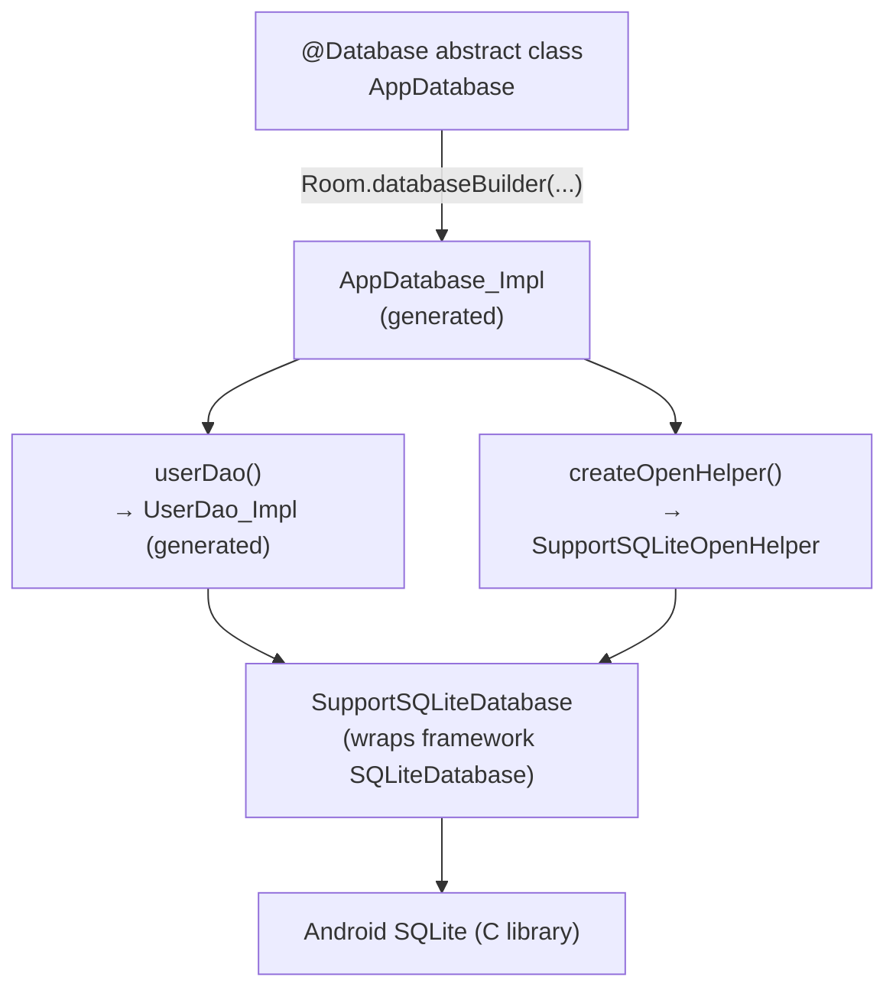
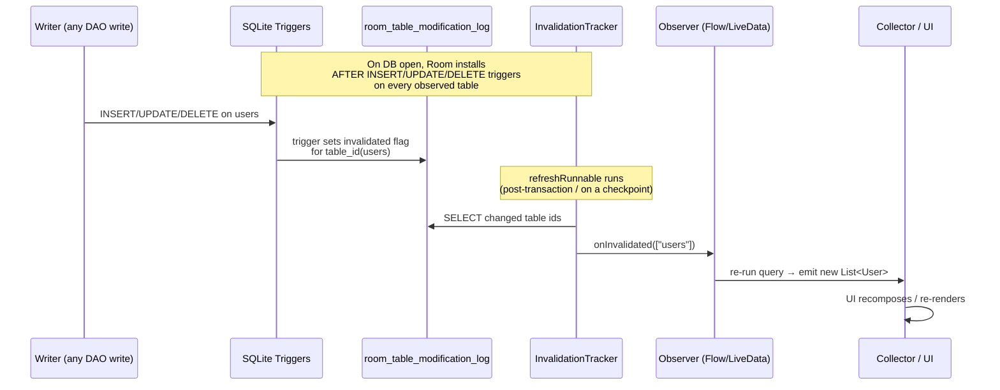

# Room Database — Internals

Room is a persistence library that sits on top of SQLite. It is **not** an ORM in the Hibernate sense — there is no runtime reflection, no lazy proxies, no session cache. Instead, Room is a **compile-time code generator**: annotations you write are consumed by an annotation processor (KSP or KAPT), which emits plain Java/Kotlin source that binds parameters into `SQLiteStatement`s and maps `Cursor` rows into your objects. Everything Room does at runtime is code you could have written by hand — it just guarantees the SQL is validated against your schema at build time.

!!! abstract "Why senior interviews probe Room"
    Room questions separate people who *use* the annotations from people who understand *what the annotations compile into*. The interesting answers are about generated `_Impl` classes, the `InvalidationTracker` trigger mechanism, thread confinement, and migration correctness — not about how to write `@Insert`.

---

## Part A — Architecture

### The three pillars

Room has exactly three annotated component types, and every app wires them the same way.

| Component | Annotation | Role | Generated artifact |
|-----------|-----------|------|--------------------|
| Entity | `@Entity` | Maps a class to a table; each field → column | Table schema (validated, not a class) |
| DAO | `@Dao` | Declares data-access methods as an interface/abstract class | `<Dao>_Impl` concrete class |
| Database | `@Database` | Holds the connection, lists entities, exposes DAOs | `<Db>_Impl` + `RoomOpenHelper`/`RoomOpenDelegate` |



### What the processor generates

For a database `AppDatabase` with a DAO `UserDao`, KSP emits (into `build/generated/ksp/.../`):

- **`AppDatabase_Impl.kt`** — subclass of your abstract `@Database` class. It implements `createOpenHelper()` (returns a configured `SupportSQLiteOpenHelper`), `createInvalidationTracker()` (declares which tables map to which observers), `clearAllTables()`, and lazy accessors for each DAO. It also carries the generated **schema-creation SQL** and the identity hash used to detect schema drift.
- **`UserDao_Impl.kt`** — concrete class implementing your DAO interface. Each `@Query` becomes a method that acquires a `RoomSQLiteQuery` (a pooled, reusable statement holder), binds arguments, runs the query, and maps the `Cursor` column-by-column into entity objects by **column index resolved at compile time** (`cursor.getColumnIndexOrThrow("name")` hoisted once per query).

!!! note "KSP vs KAPT"
    Room supports both KAPT (Java annotation processing over stub-generated Kotlin) and **KSP** (Kotlin Symbol Processing, which reads Kotlin directly without javac stubs). KSP is the recommended path today — it is materially faster because it skips stub generation, and Room ships a first-class KSP backend. Apply `id("com.google.devtools.ksp")` and use `ksp("androidx.room:room-compiler:<v>")` instead of `kapt(...)`. The generated output is equivalent.

!!! tip "Read the generated code in interviews-of-the-mind"
    When asked "how does Room map a row to an object," the honest answer is: *it doesn't do it reflectively — the processor already knows every field and column, so it emits straight-line `cursor.getString(index)` assignments.* That is why an unresolved column name is a **compile error**, not a runtime crash.

---

## Part B — Entity

An `@Entity` maps a class to a table. Table name defaults to the class name; override with `@Entity(tableName = "users")`.

### Primary keys

```kotlin
@Entity(tableName = "users")
data class User(
    @PrimaryKey(autoGenerate = true) val id: Long = 0,
    val name: String
)
```

- `autoGenerate = true` maps to SQLite `AUTOINCREMENT` on an `INTEGER PRIMARY KEY`. The field **must** be `Long`/`Int` (integer affinity). Insert with `0` (or the default) to let SQLite assign the rowid; `@Insert` returns the generated id.
- Composite keys: `@Entity(primaryKeys = ["firstName", "lastName"])`.

!!! warning "autoGenerate has a cost"
    `AUTOINCREMENT` forces SQLite to keep a monotonic counter in `sqlite_sequence` and prevents rowid reuse — slightly slower inserts and extra bookkeeping. If you don't need "never reuse a deleted id" semantics, a plain `INTEGER PRIMARY KEY` (no `autoGenerate`) already auto-assigns rowids and is faster.

### Column customization and ignored fields

```kotlin
@Entity
data class Product(
    @PrimaryKey val sku: String,
    @ColumnInfo(name = "display_name", defaultValue = "Untitled") val name: String,
    @ColumnInfo(typeAffinity = ColumnInfo.REAL) val price: Double,
    @Ignore val transientBitmap: Bitmap? = null   // not persisted, not a column
)
```

- `@ColumnInfo` renames the column, sets a SQL `defaultValue`, or pins `typeAffinity`.
- `@Ignore` excludes a field from the schema. Common for cached/derived state. Note the constructor interaction: if an `@Ignore` field is a constructor parameter, Room needs a way to construct the object without it (give it a default, or move it out of the primary constructor).

### `@Embedded` — flatten a nested object into columns

```kotlin
data class Address(val street: String, val city: String, val zip: String)

@Entity
data class Customer(
    @PrimaryKey val id: Long,
    val name: String,
    @Embedded(prefix = "addr_") val address: Address   // → addr_street, addr_city, addr_zip
)
```

`@Embedded` composes value objects into a single table with no join. Use `prefix` to avoid column-name collisions when embedding two objects of the same type.

### Indices and unique constraints

```kotlin
@Entity(
    tableName = "orders",
    indices = [
        Index(value = ["customer_id"]),                              // speeds up FK joins/filters
        Index(value = ["email"], unique = true),                     // enforces uniqueness
        Index(value = ["customer_id", "created_at"])                 // composite, leftmost-prefix rules apply
    ]
)
data class Order(/* ... */)
```

- Indices trade write speed and disk for read speed. Index columns you **filter, join, or order by**.
- `unique = true` creates a UNIQUE index — inserting a duplicate throws `SQLiteConstraintException` (interacts with `onConflict`, see Part C).
- Room emits a **build warning** if you declare a `@ForeignKey` whose child column is not indexed — full-table scans on the child are the classic N+1-adjacent performance bug.

### Foreign keys

```kotlin
@Entity(
    tableName = "orders",
    foreignKeys = [
        ForeignKey(
            entity = User::class,
            parentColumns = ["id"],
            childColumns = ["user_id"],
            onDelete = ForeignKey.CASCADE,
            onUpdate = ForeignKey.RESTRICT
        )
    ],
    indices = [Index("user_id")]
)
data class Order(
    @PrimaryKey(autoGenerate = true) val id: Long,
    @ColumnInfo(name = "user_id") val userId: Long
)
```

| Action | Constant | Behavior on parent row delete/update |
|--------|----------|--------------------------------------|
| Cascade | `CASCADE` | Delete/update children automatically |
| Restrict | `RESTRICT` | Reject the parent operation if children exist |
| Set null | `SET_NULL` | Set child FK column to `NULL` (column must be nullable) |
| Set default | `SET_DEFAULT` | Set child FK to its column default |
| No action | `NO_ACTION` | Defer enforcement to end of transaction (default) |

!!! danger "FK enforcement is off unless you enable it — but Room enables it for you"
    In raw SQLite, `PRAGMA foreign_keys` defaults to **OFF**. Room turns FK enforcement **ON** for every connection it opens. Consequence: `SET_NULL` requires the child column to be nullable, and `RESTRICT`/`CASCADE` fire at runtime. If you disable Room's default via a custom callback, referential actions silently stop enforcing — a subtle data-integrity footgun.

!!! tip "Foreign keys ≠ `@Relation`"
    A `@ForeignKey` is a **database constraint** (integrity). A `@Relation` is a **query-time convenience** (fetch children into a POJO). They are independent — you can have either without the other, though production schemas usually pair them.

---

## Part C — DAO

A `@Dao` is an interface (or abstract class) whose methods the processor implements.

### `@Query` — validated SQL

```kotlin
@Dao
interface UserDao {

    @Query("SELECT * FROM users WHERE id = :id")
    suspend fun getById(id: Long): User?

    @Query("SELECT * FROM users WHERE name LIKE :pattern ORDER BY name")
    fun search(pattern: String): Flow<List<User>>

    // IN clause with a collection — Room expands the bind args at runtime
    @Query("SELECT * FROM users WHERE id IN (:ids)")
    suspend fun getByIds(ids: List<Long>): List<User>

    @Query("UPDATE users SET name = :name WHERE id = :id")
    suspend fun rename(id: Long, name: String): Int   // returns rows affected

    @Query("DELETE FROM users WHERE id = :id")
    suspend fun deleteById(id: Long)
}
```

- **Named parameters** (`:id`) are matched to method parameters by name at compile time. A typo (`:idd`) is a **build error**.
- **The `IN (:ids)` case is special.** SQLite has no native array binding, so Room generates code that counts the collection size at runtime, rewrites the SQL with the right number of `?` placeholders, and binds each element. This is why `IN` works with a `List` — it's dynamic statement construction, not a single reusable compiled statement.
- The SQL string is parsed and **type-checked against the schema**: unknown tables/columns fail the build. Return-type columns must match the projection (or use `@ColumnInfo`/POJO with matching names).

### `@Insert`, `@Update`, `@Delete` — convenience methods

```kotlin
@Insert(onConflict = OnConflictStrategy.REPLACE)
suspend fun insert(user: User): Long          // returns new rowid

@Insert
suspend fun insertAll(users: List<User>): List<Long>

@Update
suspend fun update(user: User): Int           // rows updated (matched by primary key)

@Delete
suspend fun delete(user: User): Int           // rows deleted (matched by primary key)
```

These generate SQL for you: `@Update`/`@Delete` build a `WHERE` clause on the primary key of the passed entity. Return `Int` to get the affected-row count, or `Unit`.

#### `onConflict` strategies

| Strategy | SQLite clause | Behavior |
|----------|---------------|----------|
| `REPLACE` | `INSERT OR REPLACE` | On PK/unique conflict, **delete** old row then insert new. Fires FK `CASCADE` on the delete — can wipe children! |
| `IGNORE` | `INSERT OR IGNORE` | On conflict, silently skip the row (returns `-1` for that rowid) |
| `ABORT` (default) | `INSERT OR ABORT` | On conflict, roll back the statement and throw `SQLiteConstraintException` |

!!! danger "REPLACE is a delete-then-insert, not an upsert"
    Because `OR REPLACE` deletes the conflicting row first, any `onDelete = CASCADE` foreign keys pointing at it will **also delete the children**, and the replaced row gets a **new rowid** (breaking references). For true upsert semantics use Room's `@Upsert` (Room 2.5+) or an explicit `@Transaction` doing update-or-insert.

### `@Transaction`

```kotlin
@Transaction
suspend fun swapBalances(a: Long, b: Long) {
    val balA = getBalance(a)
    val balB = getBalance(b)
    setBalance(a, balB)
    setBalance(b, balA)
}
```

`@Transaction` wraps the method body in `db.beginTransaction()` / `setTransactionSuccessful()` / `endTransaction()`. Two uses:

1. **Atomic multi-step writes** — all-or-nothing across several DAO calls.
2. **Consistent multi-query reads** — mandatory on `@Relation` methods and on multi-table `@Query` reads, so the parent query and the child queries see the same snapshot (otherwise a concurrent write between them yields a torn read). Room emits a warning if you forget it on a `@Relation` method.

### Return types and threading implications

This is the crux of DAO design. **The return type dictates the threading contract.**

| Return type | Blocking? | Thread it runs on | Observes changes? |
|-------------|-----------|-------------------|-------------------|
| `User` / `List<User>` (direct) | **Yes, blocks** | Caller's thread — forbidden on main unless `allowMainThreadQueries()` | No (one-shot) |
| `suspend fun ...` | No (suspends) | Room's `Dispatchers.IO`-backed query executor | No (one-shot) |
| `LiveData<User>` | No | Query runs on Room's executor; delivers on main | **Yes** — re-queries on table change |
| `Flow<User>` | No | Cold; collect on any dispatcher, query runs on the query executor | **Yes** — re-emits on table change |
| RxJava `Single<T>` | No | Subscribe on a `Scheduler` you choose | No (one-shot) |
| RxJava `Maybe<T>` | No | Same | No; completes empty if no row |
| RxJava `Completable` | No | Same | No; for write side effects |
| RxJava `Flowable<T>`/`Observable<T>` | No | Same | **Yes** — observable stream |

!!! warning "Synchronous DAO methods on the main thread"
    A non-suspending, non-reactive `@Query` that returns `User` directly **blocks the calling thread**. If that's the main thread, Room throws `IllegalStateException: Cannot access database on the main thread` — unless you called `allowMainThreadQueries()`, which you should treat as a code smell reserved for tests.

!!! note "Why `suspend` is the modern default"
    A `suspend` DAO method is dispatched onto Room's internal query `Executor` (backed by a bounded thread pool, distinct from the transaction executor). You get off-main-thread execution for free without hand-writing `withContext(Dispatchers.IO)`. Room actually *ignores* the dispatcher you're on for the DB work — it uses its own executor — so wrapping a suspend DAO call in `withContext(Dispatchers.IO)` is redundant.

---

## Part D — Relations

### `@Embedded` vs `@Relation`

- **`@Embedded`**: one object, one table, no join — flattens fields into the same row.
- **`@Relation`**: separate tables, fetched with **multiple queries** and stitched in memory. Room runs the parent query, collects the parent keys, runs a **single** child query with `WHERE childKey IN (parentKeys)`, then groups the children by key. This is deliberately **not** a JOIN — it avoids the row multiplication of one-to-many joins and keeps mapping simple. It's why `@Relation` methods should be `@Transaction`.

### One-to-many

```kotlin
data class UserWithOrders(
    @Embedded val user: User,
    @Relation(
        parentColumn = "id",
        entityColumn = "user_id"
    )
    val orders: List<Order>
)

@Dao
interface UserDao {
    @Transaction
    @Query("SELECT * FROM users")
    fun getUsersWithOrders(): Flow<List<UserWithOrders>>
}
```

### Many-to-many via a junction table

```kotlin
@Entity(primaryKeys = ["playlistId", "songId"])
data class PlaylistSongCrossRef(val playlistId: Long, val songId: Long)

data class PlaylistWithSongs(
    @Embedded val playlist: Playlist,
    @Relation(
        parentColumn = "id",
        entityColumn = "id",
        associateBy = Junction(
            value = PlaylistSongCrossRef::class,
            parentColumn = "playlistId",
            entityColumn = "songId"
        )
    )
    val songs: List<Song>
)
```

`Junction` tells Room to resolve the association through the cross-reference table. Index both columns of the junction entity for performance.

### When you *do* want a JOIN

For filtered/aggregated reads across tables, write an explicit `@Query` with a JOIN returning a projection POJO:

```kotlin
data class OrderSummary(
    @ColumnInfo(name = "user_name") val userName: String,
    @ColumnInfo(name = "order_count") val orderCount: Int
)

@Query("""
    SELECT u.name AS user_name, COUNT(o.id) AS order_count
    FROM users u LEFT JOIN orders o ON o.user_id = u.id
    GROUP BY u.id
""")
fun orderSummaries(): Flow<List<OrderSummary>>
```

Use `@Relation` for "give me the whole object graph"; use JOIN projections for "give me this specific shape."

---

## Part E — Type Converters

SQLite stores only `NULL`, `INTEGER`, `REAL`, `TEXT`, `BLOB`. Anything else needs a `@TypeConverter` pair: one to a storable type, one back.

```kotlin
class Converters {
    @TypeConverter
    fun fromTimestamp(value: Long?): Date? = value?.let { Date(it) }

    @TypeConverter
    fun dateToTimestamp(date: Date?): Long? = date?.time

    @TypeConverter
    fun fromStringList(csv: String?): List<String> =
        if (csv.isNullOrEmpty()) emptyList() else csv.split("|")

    @TypeConverter
    fun stringListToString(list: List<String>): String = list.joinToString("|")
}
```

Room picks the converter by **matching the method's parameter and return types** to the field type it's trying to persist — there's no explicit binding beyond the type signature.

### Registration scope

Attach converters with `@TypeConverters`, and the placement controls scope:

| Placement | Scope |
|-----------|-------|
| On `@Database` class | All entities and DAOs in that database |
| On an `@Entity` | Only that entity |
| On a specific field / DAO method / parameter | Only that element |

```kotlin
@Database(entities = [Event::class], version = 1)
@TypeConverters(Converters::class)
abstract class AppDatabase : RoomDatabase()
```

!!! tip "Prefer narrow, deterministic, lossless converters"
    - Keep converters **pure and total** — a converter that throws (e.g., failing JSON parse) will crash a query mid-cursor-mapping.
    - Beware storing complex objects as JSON blobs: you **cannot query into them** (no `WHERE tags CONTAINS ...` on a JSON string efficiently). If you need to filter by a field, model it as a real column or a related entity, not a converted blob.
    - Converters run **per row, per column** during cursor mapping — a heavy converter (reflective JSON) on a large result set is a real hotspot.

!!! warning "Nullability must match the data"
    If a column can be `NULL` but your converter's return type is non-null, Room may pass `null` into a non-null Kotlin parameter and NPE during mapping. Make converter signatures nullable when the column is nullable.

---

## Part F — Internals

### SQLite integration: the Support layer

Room does not talk to `android.database.sqlite.SQLiteDatabase` directly. It talks to the **`SupportSQLite*` abstraction** (`androidx.sqlite`):

- `SupportSQLiteOpenHelper` — analog of `SQLiteOpenHelper`; `onCreate`/`onUpgrade`/`onOpen` callbacks.
- `SupportSQLiteDatabase` — the connection interface Room issues statements against.
- `SupportSQLiteStatement` — a compiled, reusable prepared statement.

The default implementation (`FrameworkSQLiteOpenHelper`) wraps the Android framework SQLite. Because Room codes against the *interface*, you can swap in an alternative SQLite build (e.g., the standalone `androidx.sqlite:sqlite-bundled` / requery driver) by passing a different `SupportSQLiteOpenHelper.Factory` to the builder — the DAOs never change.

### Query execution: compilation and mapping

1. A DAO method acquires a **`RoomSQLiteQuery`** — a pooled object holding the SQL string plus bound arguments (Room maintains a small pool to avoid re-allocating query holders).
2. Arguments are bound positionally into a `SupportSQLiteStatement` (`bindLong`, `bindString`, `bindNull`, …). SQLite **compiles** the statement (parse → bytecode program) — reused across calls when the SQL text is identical.
3. Execution returns a `Cursor`.
4. The generated code resolves each column index **once** (`getColumnIndexOrThrow`), then loops rows calling `cursor.getLong/getString/...` and invoking your type converters, constructing entities via the constructor + field assignment the processor picked at compile time.
5. The `RoomSQLiteQuery` is released back to the pool.

There is no per-row reflection and no per-column name lookup inside the loop — that's the performance point of compile-time generation.

### Threading model

Room runs on **two executors**, both defaulting to `Dispatchers.IO`-style bounded pools (`ArchTaskExecutor` / builder-provided):

- **Query executor** — one-shot `suspend` reads/writes and reactive query re-runs.
- **Transaction executor** — `@Transaction`/`withTransaction` bodies, kept separate so a long transaction can't starve reads.

```kotlin
Room.databaseBuilder(context, AppDatabase::class.java, "app.db")
    // .allowMainThreadQueries()   // ← DANGER: only in tests, blocks UI thread
    .setQueryExecutor(myQueryDispatcher.asExecutor())
    .setTransactionExecutor(myTxnDispatcher.asExecutor())
    .build()
```

!!! danger "`allowMainThreadQueries()` is a production anti-pattern"
    It disables Room's main-thread guard. Every synchronous query then blocks the UI thread — jank, ANRs, and a frozen app under load. The only legitimate uses are trivial tests and, rarely, tiny startup reads you've measured. In app code, use `suspend`, `Flow`, or `LiveData` so the work is off-main by construction.

!!! note "SQLite concurrency & WAL"
    Room enables **Write-Ahead Logging (WAL)** by default (`JournalMode.WRITE_AHEAD_LOGGING`) on API 16+. WAL allows **concurrent readers alongside one writer**. Writes are still serialized (SQLite is single-writer), which is why a single transaction executor is fine. On very low-memory devices Room may downgrade to `TRUNCATE` journaling.

### `InvalidationTracker` — how `Flow`/`LiveData` stay live

This is the mechanism interviewers most want to hear about. Room does **not** poll and does **not** diff. It uses **SQLite triggers** plus an in-process observer registry.



Step by step:

1. When the DB opens, Room creates an internal bookkeeping table and installs **temp triggers** (`AFTER INSERT/UPDATE/DELETE`) on each table that has an observer. Each trigger writes into an in-memory modification-log table, marking that table's id dirty.
2. After a write transaction commits, Room's `refreshVersionsAsync` runs a **`refreshRunnable`** on the query executor that reads which table ids were marked dirty and clears the flags.
3. For each dirty table, the tracker notifies registered **`Observer`s**. A `Flow` query registers an observer that, on notification, re-runs the query and emits; `LiveData` does the same and posts to main.
4. `Flow` uses `conflate`/channel semantics so bursts of writes coalesce — you get "at least the latest," not one emission per row changed.

!!! tip "Invalidation is table-granular, not row-granular"
    Any write to a table invalidates **every** observer of that table, even if the changed row doesn't match the observer's `WHERE`. The observer re-queries and emits; if the result is identical, the UI layer must de-dupe (e.g., `distinctUntilChanged()` on the `Flow`, or Compose/DiffUtil noticing equal data). Senior candidates mention this over-invalidation and how to blunt it.

!!! note "Multi-process caveat"
    The trigger log lives in a single process's connection. For **multi-process** databases, enable `enableMultiInstanceInvalidation()` so instances broadcast invalidations to each other; otherwise process B won't see process A's writes reflected in its `Flow`s.

### `RoomDatabase.Callback`

```kotlin
Room.databaseBuilder(context, AppDatabase::class.java, "app.db")
    .addCallback(object : RoomDatabase.Callback() {
        override fun onCreate(db: SupportSQLiteDatabase) {
            // Runs ONCE, right after the schema is first created.
            // Seed reference data here.
            db.execSQL("INSERT INTO settings (k, v) VALUES ('theme', 'dark')")
        }
        override fun onOpen(db: SupportSQLiteDatabase) {
            // Runs EVERY time the DB is opened (after migrations).
            db.execSQL("PRAGMA foreign_keys = ON")
        }
        override fun onDestructiveMigration(db: SupportSQLiteDatabase) {
            // Runs when a destructive migration wiped and recreated the schema.
        }
    })
    .build()
```

`onCreate` fires exactly once in a DB's lifetime; `onOpen` fires on every open. Both hand you a raw `SupportSQLiteDatabase` — you're pre-DAO here, so use `execSQL`/`query` directly.

---

## Part G — Migration

Every schema change must **increment `version`** in `@Database`. On open, Room compares the stored version to the code's version and runs the path between them.

### Manual `Migration`

```kotlin
val MIGRATION_1_2 = object : Migration(1, 2) {
    override fun migrate(db: SupportSQLiteDatabase) {
        // Additive change: safe. SQLite ALTER TABLE ADD COLUMN is cheap.
        db.execSQL("ALTER TABLE users ADD COLUMN last_login INTEGER NOT NULL DEFAULT 0")
    }
}

val MIGRATION_2_3 = object : Migration(2, 3) {
    override fun migrate(db: SupportSQLiteDatabase) {
        // Complex change (drop/rename column, change type): SQLite can't ALTER these,
        // so use the create-copy-drop-rename dance.
        db.execSQL("""
            CREATE TABLE users_new (
                id INTEGER PRIMARY KEY AUTOINCREMENT NOT NULL,
                name TEXT NOT NULL
            )
        """.trimIndent())
        db.execSQL("INSERT INTO users_new (id, name) SELECT id, name FROM users")
        db.execSQL("DROP TABLE users")
        db.execSQL("ALTER TABLE users_new RENAME TO users")
    }
}

val db = Room.databaseBuilder(context, AppDatabase::class.java, "app.db")
    .addMigrations(MIGRATION_1_2, MIGRATION_2_3)
    .build()
```

Room chains migrations: opening a v1 file with a v3 app runs `1→2` then `2→3`. If no path exists, Room throws `IllegalStateException`.

!!! danger "The generated SQL must match the expected schema exactly"
    After migration, Room validates the live schema against the schema its processor expects for `version = N` (using the exported `.json`). A mismatch — a `NOT NULL` you forgot, a wrong default, a missing index — throws `IllegalStateException: Migration didn't properly handle ...`. This is why **exporting schemas** and **testing migrations** are non-negotiable.

### Automatic migrations (Room 2.4+)

For **simple, declarative** changes (add table, add column with default, rename via spec), Room can generate the migration from the two exported schemas:

```kotlin
@Database(
    entities = [User::class],
    version = 3,
    exportSchema = true,
    autoMigrations = [
        AutoMigration(from = 1, to = 2),
        AutoMigration(from = 2, to = 3, spec = MyAutoMigrationSpec::class)
    ]
)
abstract class AppDatabase : RoomDatabase()

@RenameColumn(tableName = "users", fromColumnName = "name", toColumnName = "full_name")
@DeleteColumn(tableName = "users", columnName = "legacy_flag")
class MyAutoMigrationSpec : AutoMigrationSpec {
    override fun onPostMigrate(db: SupportSQLiteDatabase) { /* optional data fixups */ }
}
```

Auto-migration **requires `exportSchema = true`** — it diffs the two JSON schemas to synthesize the SQL. Ambiguous changes (a rename looks like a drop+add) need a `spec` with `@RenameColumn`/`@DeleteColumn`/`@RenameTable`/`@DeleteTable` to disambiguate. Anything involving **data transformation** still needs a manual `Migration`.

### `fallbackToDestructiveMigration`

```kotlin
Room.databaseBuilder(context, AppDatabase::class.java, "app.db")
    .fallbackToDestructiveMigration(false)                 // drop & recreate if no migration path
    // .fallbackToDestructiveMigrationFrom(2, 3)            // only for these start versions
    // .fallbackToDestructiveMigrationOnDowngrade(true)     // only when version decreases
    .build()
```

!!! warning "Destructive fallback = data loss"
    It **drops every table and recreates the schema** — all user data gone. Acceptable for a pure cache you can re-fetch; catastrophic for a source-of-truth DB. Never leave a blanket `fallbackToDestructiveMigration()` in a production app that stores irreplaceable data — a shipped migration bug will silently wipe users.

### Schema export

```kotlin
// build.gradle.kts (KSP)
ksp { arg("room.schemaLocation", "$projectDir/schemas") }
// Also add the schemas dir as an assets source set / test asset for MigrationTestHelper.
```

With `exportSchema = true`, each version's schema is written to `schemas/<db-class>/<version>.json`. **Commit these to VCS** — they're the ground truth for auto-migrations and migration tests, and reviewers can diff schema changes.

### Testing migrations

```kotlin
@RunWith(AndroidJUnit4::class)
class MigrationTest {
    private val DB = "migration-test.db"

    @get:Rule
    val helper = MigrationTestHelper(
        InstrumentationRegistry.getInstrumentation(),
        AppDatabase::class.java            // reads exported schemas from test assets
    )

    @Test
    fun migrate1To2() {
        // Create the DB at v1 and seed a row using raw SQL.
        helper.createDatabase(DB, 1).apply {
            execSQL("INSERT INTO users (id, name) VALUES (1, 'Ada')")
            close()
        }
        // Run the real migration and validate the resulting schema matches v2.
        val db = helper.runMigrationsAndValidate(DB, 2, true, MIGRATION_1_2)
        val c = db.query("SELECT last_login FROM users WHERE id = 1")
        assertTrue(c.moveToFirst())
        assertEquals(0L, c.getLong(0))      // default applied
        c.close()
    }
}
```

`runMigrationsAndValidate` both **applies** your migration and **asserts** the final schema equals the exported target — catching the "migration didn't handle X" class of bugs before release.

---

## Part H — Advanced

### Multiple databases

Nothing stops you from defining several `@Database` classes (e.g., a durable `UserDatabase` and a wipeable `CacheDatabase`). **Foreign keys and `@Relation` cannot cross database files** — SQLite `ATTACH` isn't exposed through Room's typed API, so cross-DB joins must be done in application code. Split databases when lifecycle/retention differs (cache vs. source-of-truth).

### Prepopulated databases

```kotlin
Room.databaseBuilder(context, AppDatabase::class.java, "app.db")
    .createFromAsset("database/seed.db")          // bundled in assets/
    // .createFromFile(File(...))                 // or from a downloaded file
    .build()
```

Ships a pre-built SQLite file (dictionaries, catalogs, offline reference data). The bundled file's schema/version must line up with your `@Database` version; combine with migrations for updates. Faster and cleaner than seeding thousands of rows in `onCreate`.

### In-memory databases

```kotlin
val db = Room.inMemoryDatabaseBuilder(context, AppDatabase::class.java)
    .allowMainThreadQueries()     // fine here: tests
    .build()
```

Lives entirely in RAM; **destroyed when the process ends**. The canonical use is **fast, isolated unit/instrumentation tests** — no file cleanup, no cross-test contamination. Occasionally used for genuinely ephemeral scratch data.

### Full-text search — `@Fts4`

```kotlin
@Fts4(contentEntity = Note::class)     // external-content FTS mirrors a normal table
@Entity(tableName = "notes_fts")
data class NoteFts(
    val title: String,
    val body: String
)

@Query("SELECT n.* FROM notes n JOIN notes_fts f ON n.rowid = f.rowid WHERE notes_fts MATCH :q")
fun search(q: String): Flow<List<Note>>
```

`@Fts4` (or `@Fts3`) backs the entity with a SQLite FTS virtual table, enabling `MATCH` full-text queries with tokenization, prefix, and ranking — far faster than `LIKE '%...%'` for text search. FTS tables have constraints (rowid-based PK, limited column types); `contentEntity` lets the FTS index shadow a normal table so you don't duplicate storage.

### `@RawQuery` — dynamic SQL

```kotlin
@RawQuery(observedEntities = [User::class])
fun search(query: SupportSQLiteQuery): Flow<List<User>>

// caller builds SQL at runtime (e.g., dynamic filters/sort):
dao.search(SimpleSQLiteQuery(
    "SELECT * FROM users WHERE name LIKE ? ORDER BY $safeColumn",
    arrayOf("%$term%")
))
```

`@RawQuery` escapes compile-time SQL validation for cases where the query shape is only known at runtime (user-driven filters, dynamic sort columns). Trade-offs:

- You **lose build-time schema checking** — the responsibility for correct SQL is yours.
- For reactive returns (`Flow`/`LiveData`), you **must** declare `observedEntities` so `InvalidationTracker` knows which tables to watch — it can't infer them from a runtime string.
- **Injection risk**: bind values via `?` args; never string-concatenate untrusted input. Whitelist dynamic identifiers (column/table names) since those can't be parameter-bound.

---

## Interview Q&A

!!! question "1. Walk me through what Room generates at compile time and why it matters."
    **Answer.** Room's annotation processor (KSP or KAPT) emits concrete implementations at build time: a `<Database>_Impl` that builds the `SupportSQLiteOpenHelper`, wires the `InvalidationTracker`, and lazily instantiates DAOs; and a `<Dao>_Impl` per DAO where each `@Query` becomes a method that binds args into a pooled `RoomSQLiteQuery`, executes, and maps the `Cursor` into objects using column indices resolved once at compile time. The payoff is threefold: **SQL is validated against the schema at build time** (unknown column = compile error, not a runtime crash), there's **zero runtime reflection** (straight-line getters, fast row mapping), and the generated code is fully inspectable. This is why Room feels like an ORM but performs like hand-written JDBC-style code.
    **Follow-up.** *Why does `IN (:list)` need special handling?* SQLite can't bind an array to one placeholder, so Room generates code that measures the collection at runtime, rewrites the SQL with N `?` placeholders, and binds each element — dynamic statement construction rather than a single reusable compiled statement.

!!! question "2. How do `Flow`/`LiveData` DAO methods know to re-emit when the data changes?"
    **Answer.** Via the `InvalidationTracker`. On DB open, Room installs `AFTER INSERT/UPDATE/DELETE` **temp triggers** on every observed table; each trigger marks its table id dirty in an internal modification-log table. After a write transaction commits, a `refreshRunnable` on the query executor reads which table ids are dirty, clears the flags, and notifies registered observers. A `Flow`/`LiveData` query registers an observer that re-runs the query and emits/posts the new result. It is **trigger-based push, not polling and not diffing**.
    **Follow-up.** *What's the efficiency pitfall?* Invalidation is **table-granular**: any write to `users` invalidates every observer of `users`, even rows outside its `WHERE`. The observer re-queries unconditionally, so bursty writes cause redundant emissions. Mitigate with `distinctUntilChanged()` on the `Flow`, careful query scoping, and letting DiffUtil/Compose skip equal results. Also mention `enableMultiInstanceInvalidation()` for multi-process.

!!! question "3. What actually happens with `OnConflictStrategy.REPLACE`, and when does it bite you?"
    **Answer.** `REPLACE` compiles to `INSERT OR REPLACE`, which in SQLite is a **delete-then-insert**, not an update. On a primary-key or unique conflict it **deletes the existing row first**, then inserts the new one. Two consequences: (1) any `onDelete = CASCADE` foreign keys pointing at that row **also delete the children** — you can silently wipe related data; (2) the row gets a **new rowid**, breaking anything referencing the old one. It looks like an upsert but isn't.
    **Follow-up.** *How do you get real upsert semantics?* Use Room's `@Upsert` (2.5+), which does update-if-exists / insert-otherwise without the destructive delete, or an explicit `@Transaction` that tries `UPDATE` and falls back to `INSERT`.

!!! question "4. Compare manual `Migration`, `@AutoMigration`, and `fallbackToDestructiveMigration`. When do you reach for each?"
    **Answer.** **Manual `Migration(from, to)`** — you write raw SQL in `migrate()`; required whenever data must be transformed, columns dropped/retyped (the SQLite create-copy-drop-rename dance), or logic is non-trivial. **`@AutoMigration`** (2.4+) — Room diffs the two exported schema JSONs and generates SQL for **simple declarative** changes (add table/column-with-default, renames via an `AutoMigrationSpec`); requires `exportSchema = true` and can't do data transformation. **`fallbackToDestructiveMigration`** — drops and recreates everything when no path exists; **acceptable only for caches**, catastrophic for a source-of-truth DB. Rule of thumb: auto for trivial additive changes, manual whenever data moves, destructive only for disposable data.
    **Follow-up.** *How do you prevent "Migration didn't properly handle" crashes?* Set `exportSchema = true`, commit the version JSONs, and write `MigrationTestHelper` tests that `runMigrationsAndValidate` — this applies the migration on a real seeded DB and asserts the resulting schema matches the exported target.

!!! question "5. Explain Room's threading model and why `allowMainThreadQueries()` is dangerous."
    **Answer.** Room uses two bounded executors — a **query executor** for one-shot `suspend` reads/writes and reactive re-runs, and a separate **transaction executor** so long transactions don't starve reads. A `suspend` DAO method is dispatched onto the query executor regardless of the coroutine dispatcher you're on, so wrapping it in `withContext(Dispatchers.IO)` is redundant. **Synchronous** DAO methods (returning `User` directly) block the caller; on the main thread Room throws `Cannot access database on the main thread`. `allowMainThreadQueries()` removes that guard, so every blocking query runs on the UI thread — jank and ANRs under real load. It's a test-only shortcut.
    **Follow-up.** *How does SQLite handle concurrent access here?* Room enables **WAL** by default, which permits concurrent readers with a single writer. Writes are still serialized (SQLite is single-writer), which is exactly why one transaction executor suffices.

!!! question "6. When would you use `@Relation` versus a JOIN, and what's the cost of each?"
    **Answer.** `@Relation` fetches an **object graph** — Room runs the parent query, then one child query with `WHERE childKey IN (parentKeys)`, and stitches children to parents in memory. It deliberately avoids a JOIN so one-to-many results don't multiply parent rows, and mapping stays clean. Cost: it must be inside `@Transaction` for a consistent snapshot, and it fetches whole child entities even if you only need a count. A **JOIN with a projection POJO** is the right tool when you want a specific denormalized shape or aggregates (`COUNT`, `SUM`) — one query, but you own the SQL and risk row multiplication on one-to-many.
    **Follow-up.** *How do you model many-to-many?* With a **junction entity** (cross-ref table with a composite PK) referenced from `@Relation` via `associateBy = Junction(...)`. Index both junction columns, or the association query degrades to full scans.
