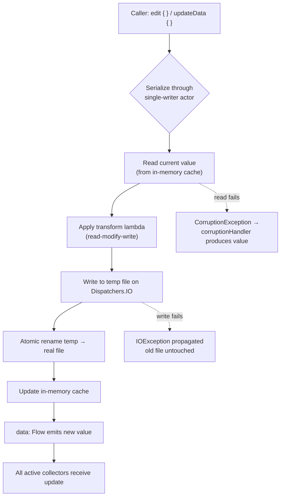

# DataStore

Jetpack **DataStore** is the modern replacement for `SharedPreferences`. It stores small
key-value or typed data **asynchronously**, using **Kotlin coroutines and Flow**, with
**transactional** writes and explicit error signalling. It comes in two flavours:

- **Preferences DataStore** — untyped key-value pairs, no schema. The drop-in `SharedPreferences` replacement.
- **Proto DataStore** — a strongly-typed object backed by a Protocol Buffers schema. Full compile-time type safety.

!!! abstract "The one-sentence pitch"
    DataStore fixes the three fatal flaws of `SharedPreferences` — it never blocks the
    main thread, it can signal read/write errors, and every write is an atomic
    transaction — by exposing state as a `Flow` and mutations as `suspend` functions.

## Preferences DataStore

### Setup

Declare a single instance at the top level of a Kotlin file via the property delegate.
The delegate guarantees exactly **one** `DataStore` per file/name for the whole process —
creating two for the same file throws.

```kotlin
// build.gradle: implementation("androidx.datastore:datastore-preferences:1.1.1")

import androidx.datastore.preferences.core.*
import androidx.datastore.preferences.preferencesDataStore

// Process-wide singleton, lazily created on first access.
val Context.dataStore: DataStore<Preferences> by preferencesDataStore(name = "settings")
```

### Type-safe keys

Keys are created with typed factory functions. The key type parameter is enforced at
compile time, so you can never read an `Int` key as a `String`.

```kotlin
object Keys {
    val USERNAME    = stringPreferencesKey("username")
    val LAUNCH_COUNT = intPreferencesKey("launch_count")
    val DARK_MODE    = booleanPreferencesKey("dark_mode")
    val VOLUME       = floatPreferencesKey("volume")
    val LAST_SYNC    = longPreferencesKey("last_sync_ms")
    val TAGS         = stringSetPreferencesKey("tags")
    // Also: doublePreferencesKey, byteArrayPreferencesKey
}
```

### Reading — `data: Flow<Preferences>`

Reads are a cold `Flow` that **re-emits on every successful write**. Map it down to the
one field you need and add `distinctUntilChanged()` to avoid recomposition churn.

```kotlin
val darkMode: Flow<Boolean> = context.dataStore.data
    .catch { e ->
        // IOException = disk read failure → emit safe empty defaults, don't crash.
        if (e is IOException) emit(emptyPreferences()) else throw e
    }
    .map { prefs -> prefs[Keys.DARK_MODE] ?: false }
    .distinctUntilChanged()
```

!!! warning "Always `.catch` the IOException"
    A raw disk error propagates through the Flow. Swallow **only** `IOException`
    (transient read failure) and rethrow everything else — masking a
    `CorruptionException` or a programming bug hides real problems.

### Writing — `edit {}` transactional block

`edit {}` is a `suspend` function. It reads the current snapshot, hands you a
`MutablePreferences`, applies your changes, and commits **atomically** — nothing else can
interleave. If the block throws, nothing is persisted.

```kotlin
suspend fun setDarkMode(enabled: Boolean) {
    context.dataStore.edit { prefs ->
        prefs[Keys.DARK_MODE] = enabled
    }
}

// Safe read-modify-write: the whole block is one atomic transaction, so
// concurrent increments cannot lose updates (unlike SharedPreferences).
suspend fun incrementLaunchCount() {
    context.dataStore.edit { prefs ->
        val current = prefs[Keys.LAUNCH_COUNT] ?: 0
        prefs[Keys.LAUNCH_COUNT] = current + 1
    }
}
```

!!! tip "`edit` returns the new snapshot"
    `edit {}` returns the resulting `Preferences`, and `updateData` (Proto) returns the
    new object — handy when you need the committed value immediately without a second read.

## Proto DataStore

Preferences DataStore has no schema — typos in key names compile fine and defaults are
scattered. **Proto DataStore** trades a little setup for a single, versioned, typed object.

### 1. Schema

```protobuf
// app/src/main/proto/settings.proto
syntax = "proto3";
option java_package = "com.example.app";
option java_multiple_files = true;

message UserSettings {
  bool   dark_mode    = 1;
  int32  launch_count = 2;
  string username     = 3;
}
```

The protobuf-gradle-plugin generates the immutable `UserSettings` Java/Kotlin class with a
builder at build time.

### 2. Serializer

You supply a `Serializer` telling DataStore how to turn bytes ↔ object, and the value used
when the file does not yet exist.

```kotlin
object SettingsSerializer : Serializer<UserSettings> {
    override val defaultValue: UserSettings = UserSettings.getDefaultInstance()

    override suspend fun readFrom(input: InputStream): UserSettings =
        try {
            UserSettings.parseFrom(input)          // protobuf binary → object
        } catch (e: InvalidProtocolBufferException) {
            throw CorruptionException("Cannot read settings proto.", e)
        }

    override suspend fun writeTo(t: UserSettings, output: OutputStream) =
        t.writeTo(output)                          // object → protobuf binary
}

val Context.settingsStore: DataStore<UserSettings> by dataStore(
    fileName = "settings.pb",
    serializer = SettingsSerializer,
)
```

### 3. Read / write

```kotlin
val username: Flow<String> = context.settingsStore.data.map { it.username }

suspend fun updateUsername(name: String) {
    context.settingsStore.updateData { current ->
        current.toBuilder().setUsername(name).build()   // immutable copy
    }
}
```

!!! note "Type safety end-to-end"
    With Proto there is no `Key` and no cast: `it.username` is a `String` because the
    schema says so. Renaming a field is a compile error, not a silent runtime `null`.

## Internals

Both flavours share the same engine (`androidx.datastore:datastore-core`). Understanding it
explains the guarantees.

| Mechanism | How it works |
|---|---|
| **Single-file storage** | Each DataStore is backed by exactly one file in `filesDir/datastore/`. Preferences serialises to a proto internally too. |
| **Async API** | Reads are `Flow`; writes are `suspend`. All disk I/O runs on `Dispatchers.IO` — the main thread is never touched. |
| **In-memory cache** | After the first read, the current value is held in memory; subsequent reads are served from cache, so `data` emits instantly to new collectors. |
| **Read-modify-write** | `edit`/`updateData` operate on the cached value, apply your lambda, then persist. |
| **Atomic transactions** | Writes are serialised through a single-consumer `SimpleActor` message queue (see below). A write commits by writing to a **temp file, fsync-ing, then renaming** — the rename is atomic, so a crash mid-write leaves the old file intact. Concurrent writes queue; each sees the previous one's result (no lost updates). |
| **Corruption handling** | If the serializer throws a `CorruptionException` on read, an optional `corruptionHandler` is invoked to produce a replacement value instead of crashing. |

### Write → Flow-emit flow



### The engine: `SingleProcessDataStore`

The default factory (`preferencesDataStore { }`, `dataStore { }`, `DataStoreFactory.create`)
builds a `SingleProcessDataStore<T>`. Its guarantees are not magic — they fall out of two
concrete mechanisms: a single-consumer actor for ordering, and a `MutableStateFlow` for
fan-out.

**Writes are serialised through a `SimpleActor`.** Every `edit`/`updateData` call does not
touch the file directly; it enqueues a message onto an internal `SimpleActor<Message<T>>`.
The actor is a hand-rolled, allocation-light mailbox: an atomic `messageQueue`
(a lock-free `Channel`) plus an atomic `remainingMessages` counter, drained by **one**
coroutine at a time. Two message types flow through it:

- `Message.Read` — "make sure the current value is loaded" (used to service `data`).
- `Message.Update` — carries your transform lambda plus an `ack` `CompletableDeferred<T>`
  that the caller `await()`s for the committed result.

Because exactly one coroutine consumes the mailbox, updates run **strictly in submission
order, one at a time**. That single-consumer discipline *is* the "single-writer"
guarantee — there is no lock you can forget to take; ordering is structural. A concurrent
increment therefore always observes the previous write's result, so updates can't be lost.

!!! note "`SimpleActor` vs a `Mutex`"
    Earlier descriptions (and older code) framed the write path as "a `Mutex`-guarded
    section." The modern engine uses a `SimpleActor` message queue instead — same
    mutual-exclusion outcome, but a queue also gives natural back-pressure and FIFO
    fairness without a coroutine ever *holding* a lock across the suspending disk I/O.

**Reads are a `MutableStateFlow<State<T>>`.** The in-memory cache is literally a
`MutableStateFlow` whose value is a sealed `State<T>`:

| `State<T>` | Meaning |
|---|---|
| `UnInitialized` | Nothing read from disk yet; first collector triggers the initial read. |
| `Data<T>(value, hashCode)` | A valid cached value. New collectors of `data` get this immediately. |
| `ReadException<T>(readException)` | The last read threw; the exception is replayed to collectors (this is the `IOException` you `.catch {}`). |
| `Final<T>(finalException)` | The store is closed/scope-cancelled; terminal. |

`data` is built on top of this flow, so a new collector after the first successful read
gets the cached `Data` **synchronously** — no disk hit — which is why `data` "emits
instantly to new collectors."

**Durability is temp-file + fsync + atomic rename.** When the actor commits an update it
does not overwrite the live file. It writes the serialized bytes to a scratch file
(`<name>.tmp`), then — critically — calls `fileStream.fd.sync()` (a real **fsync**) to
force the bytes and metadata out of the OS page cache onto stable storage, and only then
performs an atomic `File.rename(tmp, real)`. If the process is killed between steps, the
original file is still intact; you never observe a half-written file.

```kotlin
// Conceptual, matching androidx.datastore.core.okio/FileStorage semantics:
tmpFile.outputStream().use { stream ->
    serializer.writeTo(newValue, stream)
    stream.fd.sync()          // fsync: durability barrier, not just a flush()
}
if (!tmpFile.renameTo(realFile)) {   // atomic on the same filesystem
    tmpFile.delete()
    throw IOException("Unable to rename $tmpFile to $realFile")
}
```

!!! warning "`flush()` is not `fsync`"
    A plain `OutputStream.flush()` only pushes bytes into the OS cache; a power loss can
    still lose them. DataStore calls `fd.sync()` so the rename is only reached after the
    new bytes are durably on disk — that ordering is what makes crash-mid-write safe.

If `serializer.readFrom` throws a `CorruptionException` during the initial read, the
configured `corruptionHandler` runs *inside* the actor to produce a replacement value,
which is then written back through the same temp→fsync→rename path.

### Multi-process access: `MultiProcessDataStoreFactory`

DataStore is **single-process by default**: `SingleProcessDataStore` keeps its cache and
its `SimpleActor` in one process's memory, so two processes each holding a
`SingleProcessDataStore` over the same file will clobber each other and diverge.

Since **androidx.datastore 1.1**, cross-process access is supported via
`MultiProcessDataStoreFactory.create(...)`, which builds a `MultiProcessDataStore<T>`. It
coordinates through an `InterProcessCoordinator` (`createMultiProcessCoordinator`) that
replaces the single-process in-memory ordering with OS-level primitives:

- A **`FileLock`** (an exclusive lock on a `.lock` file via `FileChannel.lock()`) serialises
  writers *across processes* — the cross-process analog of the in-process actor.
- A **shared version file**, bumped on every write and `mmap`-watched by the other
  processes, so a process notices another process's commit and invalidates/reloads its
  cache. This is what lets each process's `data` flow re-emit after a foreign write.

```kotlin
val dataStore: DataStore<UserSettings> = MultiProcessDataStoreFactory.create(
    serializer = SettingsSerializer,
    produceFile = { File(context.filesDir, "datastore/settings.pb") },
)
// Now safe to open from your :sync service process and the main process.
```

!!! warning "Only Proto-style multi-process, and only via the multi-process factory"
    `MultiProcessDataStoreFactory` takes a `Serializer<T>` (the Proto/typed path). There is
    no drop-in `preferencesDataStore(multiProcess = true)` delegate — you build the
    multi-process store explicitly. And every process must open the file through
    `MultiProcessDataStoreFactory`; mixing a single-process store into one process
    reintroduces the divergence you were trying to avoid.

### Handling corruption

```kotlin
val Context.dataStore: DataStore<Preferences> by preferencesDataStore(
    name = "settings",
    corruptionHandler = ReplaceFileCorruptionHandler { corruptionException ->
        // Called when the file can't be parsed. Return a fresh default;
        // DataStore rewrites the file with this value. Log + reset, never crash.
        emptyPreferences()
    },
)
```

!!! danger "The handler replaces the file"
    `ReplaceFileCorruptionHandler` **overwrites the corrupt file** with whatever you
    return. That is data loss by design — the alternative is a permanent crash loop on
    every launch. Log the exception before returning defaults.

## SharedPreferences vs DataStore

| Concern | SharedPreferences | DataStore |
|---|---|---|
| **Main-thread blocking** | `commit()` does synchronous disk I/O on the calling thread. Even `getX()` can block on the initial disk load (via `loadFromDisk` latch), causing jank / ANRs. | All I/O on `Dispatchers.IO`. Reads are `Flow`, writes are `suspend`. Never blocks the caller. |
| **`apply()` gotcha** | `apply()` is async but its fsync is queued onto the main thread and **runs on `Activity`/`Service` lifecycle transitions** — a known source of ANRs. | No lifecycle-coupled fsync. Commit is a normal coroutine on IO. |
| **Error signalling** | None. `apply()` swallows disk errors silently; a failed write is invisible. | Write failures throw from the `suspend` call; read failures surface in the `Flow` (catchable). |
| **Transactions** | No atomicity across multiple keys; no read-modify-write guarantee (concurrent edits can lose updates). | `edit {}` / `updateData {}` are atomic, isolated transactions. |
| **Type safety** | Stringly-typed keys; `ClassCastException` at runtime if types mismatch. | Typed keys (Preferences) or full schema types (Proto). |
| **Async / reactivity** | Callback-based `OnSharedPreferenceChangeListener`; easy to leak. | First-class `Flow` — reactive, lifecycle-aware via `collect`. |
| **Consistency** | Eventual; in-memory and disk can diverge on multi-process, with no coordination. | Strong consistency: single-process by default (`SingleProcessDataStore`); safe cross-process access via `MultiProcessDataStoreFactory` (since 1.1). |

!!! quote "The core problem, in one line"
    "SharedPreferences has a runtime API that gives no way to signal errors and no
    transactional API" — and its synchronous reads/`apply()` fsync run on the main thread.
    DataStore was built specifically to fix these.

## Migration from SharedPreferences

DataStore ships `SharedPreferencesMigration`, run automatically **once**, before the first
read/write. It copies keys across and then (by default) **deletes** the old
`SharedPreferences` file so the migration never runs twice.

```kotlin
val Context.dataStore: DataStore<Preferences> by preferencesDataStore(
    name = "settings",
    produceMigrations = { context ->
        listOf(
            // Copies all keys from the "user_prefs" xml, then clears it.
            SharedPreferencesMigration(context, "user_prefs")
        )
    },
)
```

For **Proto** DataStore you must map the untyped keys into the typed object yourself:

```kotlin
val migration = SharedPreferencesMigration(
    context = context,
    sharedPreferencesName = "user_prefs",
) { sharedPrefs: SharedPreferencesView, current: UserSettings ->
    current.toBuilder()
        .setDarkMode(sharedPrefs.getBoolean("dark_mode", false))
        .setLaunchCount(sharedPrefs.getInt("launch_count", 0))
        .build()
}
```

!!! warning "Migrate through DataStore only, afterwards"
    Once migration is configured, **stop touching the old `SharedPreferences`** anywhere in
    the app. Reading/writing the xml directly after migration reintroduces the exact
    main-thread and consistency problems you migrated away from, and can resurrect the
    deleted file.

## When NOT to use DataStore

DataStore is for **small, simple datasets**. It reads and writes the **entire file** on
every operation and holds the whole thing in memory — it is not a database.

| Use DataStore | Use Room (SQLite) instead |
|---|---|
| App settings, flags, user prefs | Large datasets (lists of entities) |
| A handful of scalar values | **Relational** data (foreign keys, joins) |
| A single typed config object | Partial reads / queries / `WHERE` filters |
| Low write frequency | Frequent, granular updates to one of many rows |
| — | Anything needing indexing, transactions across tables, pagination |

!!! danger "Don't store large/growing data in DataStore"
    Because every write serialises and rewrites the whole file, a large or unbounded
    DataStore file makes every single write progressively slower and inflates memory.
    Lists, records, or anything relational → **Room**.

## Interview Q&A

!!! question "1. Why was DataStore created when SharedPreferences already existed?"
    `SharedPreferences` has three unfixable design flaws: (a) `getX()` can block the main
    thread on the initial disk load, and `apply()`'s fsync is dispatched to the main thread
    on lifecycle transitions — both cause ANRs; (b) it has **no way to signal errors** —
    `apply()` fails silently; (c) it has **no transactional API**, so read-modify-write and
    multi-key updates aren't atomic. DataStore fixes all three: I/O on `Dispatchers.IO`,
    errors surfaced through `Flow`/`suspend`, and atomic `edit {}` transactions.

    **Follow-up:** *Does DataStore use SharedPreferences under the hood?* No. It's an
    independent implementation on coroutines + a single file. `SharedPreferencesMigration`
    only reads the old xml once to import it.

!!! question "2. Preferences vs Proto DataStore — when do you pick which?"
    Preferences DataStore is untyped key-value — a drop-in `SharedPreferences` replacement,
    no schema, but you can still mistype a key or forget a default. Proto DataStore uses a
    protobuf schema and a `Serializer`, giving a single strongly-typed object with
    compile-time safety and no casting. Pick Proto when the data has structure or you want
    the compiler to enforce the shape; pick Preferences for a few loose flags where the
    protobuf setup isn't worth it.

    **Follow-up:** *What does the `Serializer` need?* A `defaultValue` (used when the file
    doesn't exist) plus `readFrom`/`writeTo` for bytes ↔ object, throwing
    `CorruptionException` on parse failure.

!!! question "3. How does DataStore guarantee atomic writes and no lost updates?"
    All writes funnel through a single-consumer `SimpleActor` message queue: `edit`/
    `updateData` enqueue a `Message.Update` (transform lambda + an `ack`
    `CompletableDeferred`) and exactly one coroutine drains the mailbox, so updates run
    strictly in submission order. That single-consumer discipline *is* the single-writer
    guarantee — no lock to forget. Each update reads the current (cached) value, applies
    your lambda (read-modify-write), writes to a **temp file**, calls `fileStream.fd.sync()`
    (fsync), then does an atomic `rename()` over the real file. Because writes are
    serialised, a concurrent increment always sees the previous write's result — no lost
    updates. A crash mid-write leaves the old file intact because the rename hadn't happened.

    **Follow-up:** *Is it multi-process safe?* By default no — the standard factory builds a
    `SingleProcessDataStore` whose actor and cache live in one process. But **since
    androidx.datastore 1.1** you can build a `MultiProcessDataStore` via
    `MultiProcessDataStoreFactory.create(...)`; it swaps the in-memory actor for an
    `InterProcessCoordinator` backed by a `FileLock` (cross-process write serialisation)
    plus a shared version file (so each process reloads its cache after a foreign commit).

!!! question "4. What happens if the DataStore file is corrupted, and how do you handle it?"
    On read, the serializer throws a `CorruptionException`. Without a handler this
    propagates and can crash the app on every launch. You pass a `corruptionHandler`
    (e.g. `ReplaceFileCorruptionHandler`) that returns a replacement value; DataStore
    **overwrites** the corrupt file with it. That's intentional data loss to escape a crash
    loop — log the exception, then return sane defaults.

    **Follow-up:** *How is that different from an `IOException` in the read Flow?* An
    `IOException` is a transient disk failure — catch it in `.catch {}` and emit
    `emptyPreferences()` without wiping anything. Corruption means the bytes are unparseable
    and is handled by the `corruptionHandler`, which does replace the file.

!!! question "5. When would you reach for Room instead of DataStore?"
    DataStore rewrites and caches the whole file per operation, so it's only for small,
    simple data — settings, flags, one config object. The moment you have lists of
    entities, relational data with foreign keys/joins, need partial reads or `WHERE`
    queries, or do frequent granular updates to one of many records, use Room. Putting a
    growing dataset in DataStore makes every write progressively slower and bloats memory.

    **Follow-up:** *Can they coexist?* Yes — a common pattern is DataStore for user
    preferences and Room for domain data, each exposing `Flow`s that a repository combines.

!!! question "6. Can DataStore be shared across processes? Walk me through the mechanics."
    Yes, since **androidx.datastore 1.1**. The default `SingleProcessDataStore` cannot —
    its `SimpleActor` and `MutableStateFlow` cache are per-process, so two processes over
    the same file diverge and lose writes. For cross-process use, build a
    `MultiProcessDataStore` via `MultiProcessDataStoreFactory.create(serializer, produceFile,
    ...)`. Internally it replaces the in-process ordering with an `InterProcessCoordinator`:
    an exclusive **`FileLock`** on a `.lock` file serialises writers across processes (the
    cross-process analog of the single-consumer actor), and a **shared version file** is
    bumped on every write so other processes detect a foreign commit and invalidate/reload
    their cache — that's what makes each process's `data` flow re-emit. The durability path
    (temp → fsync → atomic rename) is unchanged.

    **Follow-up:** *Is there a Preferences multi-process delegate?* No — there's no
    `preferencesDataStore(multiProcess = true)`. `MultiProcessDataStoreFactory` takes a
    typed `Serializer<T>` (the Proto-style path), and every participating process must open
    the file through that factory; mixing in a single-process store anywhere reintroduces
    divergence.

!!! question "7. What are the states of DataStore's in-memory cache, and why do new collectors of `data` get a value instantly?"
    The cache is a `MutableStateFlow<State<T>>` with a sealed `State`: `UnInitialized`
    (nothing read yet — the first collector triggers the disk read), `Data<T>` (a valid
    cached value), `ReadException<T>` (the last read threw — this is the `IOException`
    replayed to collectors that you `.catch {}`), and `Final<T>` (store closed / scope
    cancelled — terminal). Because `data` is layered over this `StateFlow`, once the first
    read succeeds the value sits in the flow as `Data`, so a later collector receives it
    synchronously with no disk hit — that's the "emits instantly to new collectors" behavior.

    **Follow-up:** *How does a read error surface versus corruption?* A transient read
    `IOException` is captured as `ReadException` and replayed through `data`, so you handle
    it with `.catch {}` and emit defaults without touching the file. A `CorruptionException`
    (unparseable bytes) instead invokes the `corruptionHandler` inside the actor, which
    produces a replacement value that gets rewritten through the temp→fsync→rename path.
