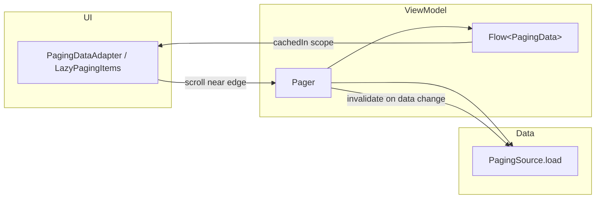
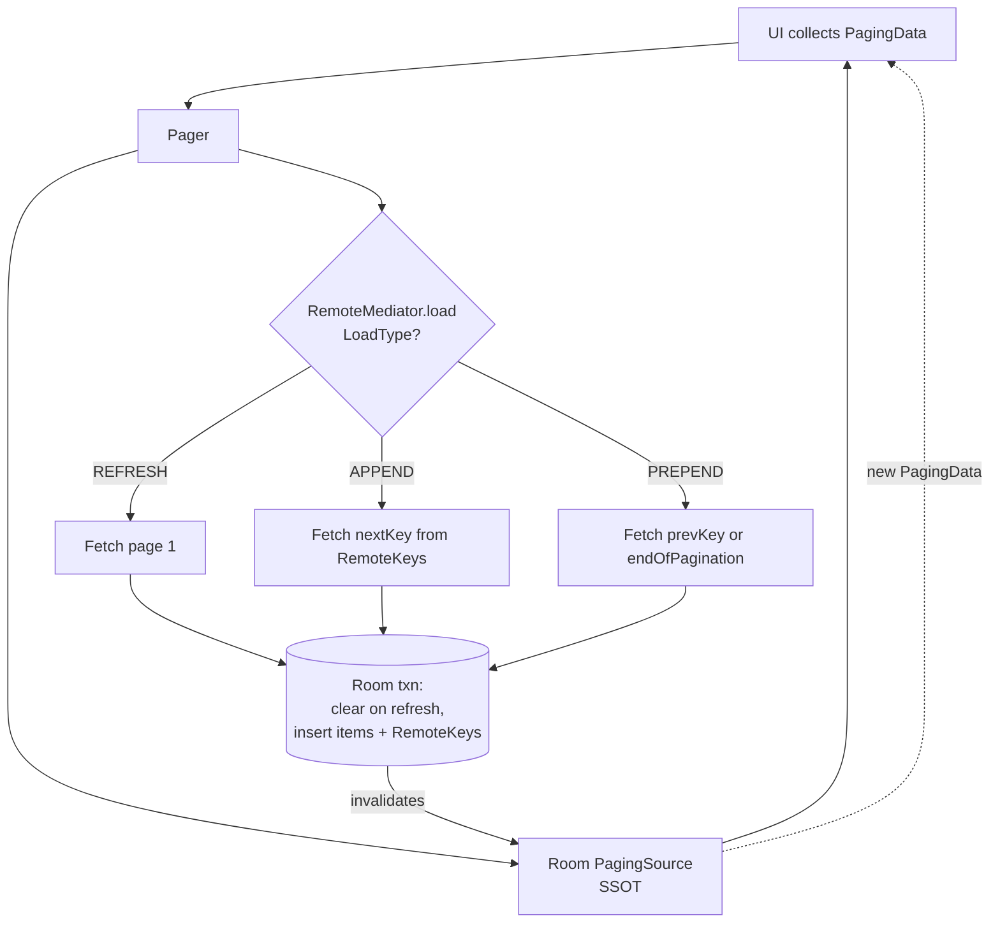
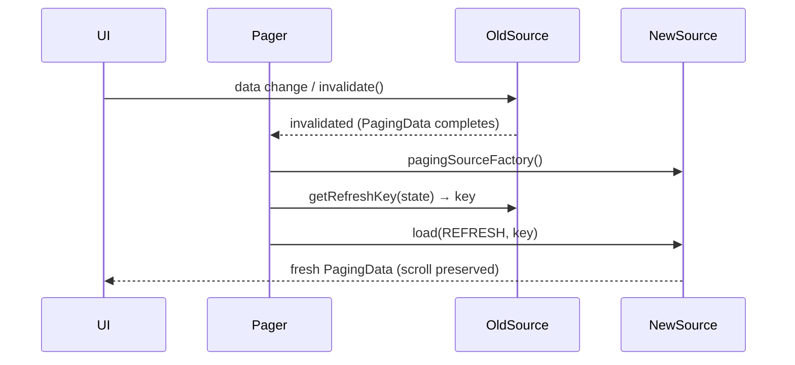

# Paging 3

Paging 3 is Jetpack's library for loading and displaying large datasets in **pages**, on demand, from local or network sources. It solves three hard problems at once: **memory** (never hold the full list in RAM), **network/DB efficiency** (fetch only what the user is about to see), and **UI consistency** (a single reactive stream that survives config changes, drives loading/error UI, and diffs into your list). It is coroutine/Flow-first, integrates natively with Room and Compose, and treats a database as the single source of truth when combined with `RemoteMediator`.

!!! abstract "The one-paragraph mental model"
    A `PagingSource` knows how to load *one page* given a key. A `Pager` wraps it with a `PagingConfig` and exposes a cold `Flow<PagingData<T>>`. `PagingData` is an immutable snapshot of a paged stream. In the ViewModel you `cachedIn(viewModelScope)` so the stream survives rotation. The UI collects it — `PagingDataAdapter` (Views) or `collectAsLazyPagingItems()` (Compose) — and Paging drives scrolling, prefetch, placeholders, retry, and diffing for you. When data changes, the source is **invalidated** and a fresh `PagingSource` + `PagingData` is generated.

---

## Architecture at a glance

Paging is layered so each layer has exactly one job. You rarely touch the internals; you implement the two ends (source + UI) and configure the middle.

| Layer | Component | Your job | Lives in |
|---|---|---|---|
| Data | `PagingSource<Key, Value>` | Implement `load()` + `getRefreshKey()` | Repository/data layer |
| Data (network+DB) | `RemoteMediator<Key, Value>` | Fetch network → write DB on boundary | Repository/data layer |
| Stream | `Pager` → `Flow<PagingData<T>>` | Configure `PagingConfig`, call `.cachedIn()` | ViewModel |
| Model | `PagingData<T>` | Transform with `map`/`filter`/`insertSeparators` | ViewModel |
| UI | `PagingDataAdapter` / `collectAsLazyPagingItems()` | Bind items, react to `LoadState` | UI layer |



!!! tip "Key vs Value"
    `PagingSource<Key, Value>` is generic in both the *page key* and the *item*. For a network API paged by page-number use `PagingSource<Int, Article>`. For Room keyed by a cursor you might use `PagingSource<String, Article>`. Room's generated `PagingSource` is `PagingSource<Int, T>` (positional).

---

## PagingSource

A `PagingSource` produces **one page per call**. You implement two functions.

### load()

`load(params: LoadParams<Key>): LoadResult<Key, Value>` is a `suspend` function — do blocking I/O directly, it runs off the main thread. `LoadParams` carries the `key` (null on the first/refresh load) and `loadSize`. You return `LoadResult.Page` with the loaded items plus the keys for the neighbouring pages, or `LoadResult.Error`, or `LoadResult.Invalid`.

```kotlin
class ArticlePagingSource(
    private val api: ArticleApi,
) : PagingSource<Int, Article>() {

    override suspend fun load(
        params: LoadParams<Int>,
    ): LoadResult<Int, Article> = try {
        val page = params.key ?: STARTING_PAGE   // null key == initial load
        val response = api.getArticles(
            page = page,
            pageSize = params.loadSize,          // = initialLoadSize on first load
        )
        LoadResult.Page(
            data = response.articles,
            prevKey = if (page == STARTING_PAGE) null else page - 1,
            nextKey = if (response.articles.isEmpty()) null else page + 1,
        )
    } catch (e: IOException) {
        LoadResult.Error(e)          // surfaces as LoadState.Error → retry works
    } catch (e: HttpException) {
        LoadResult.Error(e)
    }

    override fun getRefreshKey(state: PagingState<Int, Article>): Int? {
        // Called on invalidation. Return the key to reload so the user stays
        // roughly where they were. anchorPosition = last accessed index.
        val anchor = state.anchorPosition ?: return null
        val closestPage = state.closestPageToPosition(anchor)
        return closestPage?.prevKey?.plus(1) ?: closestPage?.nextKey?.minus(1)
    }

    companion object { private const val STARTING_PAGE = 1 }
}
```

!!! danger "`prevKey`/`nextKey` == null means *stop*"
    A `null` key tells Paging "there is no page in this direction," so it will not call `load()` that way again. The single most common Paging bug is returning `nextKey = page + 1` when the response is empty — that produces an **infinite append loop** hammering your API. Guard on empty/short pages, as above.

### getRefreshKey()

When the source is invalidated (data changed, or the user pulled to refresh), Paging builds a **new** `PagingSource` and calls `getRefreshKey(state)` to decide which key to load first. Use `state.anchorPosition` (the most recently accessed index, i.e. what's on screen) and `closestPageToPosition` to reload around the current scroll position so the list doesn't jump to the top.

!!! note "Return types of LoadResult"
    - `LoadResult.Page` — success, with `data`, `prevKey`, `nextKey`, and optional `itemsBefore`/`itemsAfter` counts for placeholders.
    - `LoadResult.Error` — recoverable; drives `LoadState.Error` and enables `retry()`.
    - `LoadResult.Invalid` — the data read is stale (e.g. row deleted mid-load); Paging discards it and invalidates, triggering a fresh load.

---

## Pager, PagingData, and cachedIn

`Pager` is the factory that turns a `PagingConfig` + a `pagingSourceFactory` lambda into a `Flow<PagingData<T>>`. The factory lambda **must return a brand-new `PagingSource` each time** it's called — a `PagingSource` is single-use and cannot be reused after invalidation.

```kotlin
class ArticleViewModel(
    private val repo: ArticleRepository,
) : ViewModel() {

    val articles: Flow<PagingData<Article>> = Pager(
        config = PagingConfig(
            pageSize = 20,
            prefetchDistance = 10,
            initialLoadSize = 60,
            enablePlaceholders = true,
        ),
        pagingSourceFactory = { repo.articlePagingSource() },  // NEW source each call
    )
        .flow
        .map { pagingData ->                      // transforms are per-item, lazy
            pagingData.map { it.toUiModel() }
        }
        .cachedIn(viewModelScope)                 // MUST be last, MUST be a ViewModel scope
}
```

!!! warning "`cachedIn` is not optional — and order matters"
    `cachedIn(scope)` makes the `Flow<PagingData>` **shareable and stateful**: loaded pages survive configuration changes and multiple collectors (e.g. re-subscribe after rotation) share the same data instead of re-fetching from scratch. It must be the **last** operator — any `map`/`filter` *after* `cachedIn` re-runs on every collection and defeats the cache. Applying transforms *before* `cachedIn` caches the transformed result.

!!! tip "`PagingData` is a snapshot, not a `List`"
    You cannot index into `PagingData` or ask its size. It's an opaque, immutable container for a stream of pages plus load-state events. All access goes through the adapter/`LazyPagingItems`, which hand you items lazily and may return `null` placeholders.

---

## PagingConfig

`PagingConfig` tunes the loading strategy. Getting these numbers right is the difference between a butter-smooth list and one that either jank-loads at the edge or over-fetches.

| Param | Meaning | Typical / notes |
|---|---|---|
| `pageSize` | Items loaded per `load()` after the first | 20–50. Should comfortably exceed one screen. |
| `prefetchDistance` | How many items from the edge before triggering the next `load()` | Default `pageSize`. Larger = earlier fetch = fewer spinners, more data. |
| `initialLoadSize` | Size of the **first** load | Default `3 × pageSize`. Fills the viewport + prefetch buffer up front. |
| `enablePlaceholders` | Emit `null` items for not-yet-loaded positions | Needs a **countable** source (Room, or `LoadResult.Page.itemsBefore/After`). |
| `maxSize` | Cap on items in memory; drops far pages | Default `MAX_VALUE` (no dropping). If set, must be ≥ `pageSize + 2*prefetchDistance`. |
| `jumpThreshold` | Distance jumped that triggers a refresh instead of paging | For fast-scroll/scrubber UIs. |

!!! note "enablePlaceholders trade-offs"
    - **On:** scrollbar is accurate, positions are stable, no "list grows as you scroll" jump. Your UI must render a placeholder for `null` items. Requires the source to know its total count.
    - **Off:** simpler UI (never see `null`), but the scrollbar and item positions shift as pages load, and `getItem()`/`peek()` never return `null`.
    - Network-only sources that don't know the total count usually run with placeholders **off**.

---

## RemoteMediator — network + database

For apps that must work offline and cache, the pattern is: **Room is the single source of truth**, the UI *only* ever reads from a Room-backed `PagingSource`, and a `RemoteMediator` sits behind it to fetch from the network and **write into Room** when the user paginates past the cached edge. The UI never talks to the network directly — it reacts to the DB changing.



### load() and LoadType

`RemoteMediator.load(loadType, state)` is called by Paging when the Room source runs dry at an edge. You dispatch on `LoadType`:

- **`REFRESH`** — initial load or explicit refresh. Fetch the first page; on success **clear** the cached table + keys inside a transaction, then insert.
- **`PREPEND`** — user scrolled toward the top; load the page before the first cached item. Often immediately returns `endOfPaginationReached = true` for forward-only APIs.
- **`APPEND`** — user scrolled past the bottom; load the page after the last cached item.

You return `MediatorResult.Success(endOfPaginationReached = …)` (setting the flag stops further loads in that direction) or `MediatorResult.Error(e)`.

### The RemoteKeys table pattern

Because Room's `PagingSource` is positional but your network API is keyed (page numbers / cursors), you need a side table mapping each cached item to its `prevKey`/`nextKey`. That's the **RemoteKeys** pattern.

```kotlin
@Entity(tableName = "remote_keys")
data class RemoteKey(
    @PrimaryKey val articleId: String,
    val prevKey: Int?,
    val nextKey: Int?,
)

@OptIn(ExperimentalPagingApi::class)
class ArticleRemoteMediator(
    private val db: AppDatabase,
    private val api: ArticleApi,
) : RemoteMediator<Int, Article>() {

    private val articleDao get() = db.articleDao()
    private val keyDao get() = db.remoteKeyDao()

    // Optional: skip a network refresh if the cache is fresh enough.
    override suspend fun initialize(): InitializeAction =
        InitializeAction.LAUNCH_INITIAL_REFRESH

    override suspend fun load(
        loadType: LoadType,
        state: PagingState<Int, Article>,
    ): MediatorResult = try {
        val page: Int = when (loadType) {
            LoadType.REFRESH -> {
                val keys = remoteKeyClosestToCurrentPosition(state)
                keys?.nextKey?.minus(1) ?: STARTING_PAGE
            }
            LoadType.PREPEND -> {
                val keys = remoteKeyForFirstItem(state)
                    ?: return MediatorResult.Success(endOfPaginationReached = keys != null)
                keys.prevKey
                    ?: return MediatorResult.Success(endOfPaginationReached = true)
            }
            LoadType.APPEND -> {
                val keys = remoteKeyForLastItem(state)
                    ?: return MediatorResult.Success(endOfPaginationReached = keys != null)
                keys.nextKey
                    ?: return MediatorResult.Success(endOfPaginationReached = true)
            }
        }

        val response = api.getArticles(page = page, pageSize = state.config.pageSize)
        val endReached = response.articles.isEmpty()

        db.withTransaction {                          // atomic: keys + items together
            if (loadType == LoadType.REFRESH) {
                keyDao.clearAll()
                articleDao.clearAll()
            }
            val prev = if (page == STARTING_PAGE) null else page - 1
            val next = if (endReached) null else page + 1
            keyDao.insertAll(response.articles.map {
                RemoteKey(it.id, prevKey = prev, nextKey = next)
            })
            articleDao.insertAll(response.articles)
        }
        MediatorResult.Success(endOfPaginationReached = endReached)
    } catch (e: IOException) {
        MediatorResult.Error(e)
    } catch (e: HttpException) {
        MediatorResult.Error(e)
    }

    private suspend fun remoteKeyForLastItem(state: PagingState<Int, Article>) =
        state.pages.lastOrNull { it.data.isNotEmpty() }?.data?.lastOrNull()
            ?.let { keyDao.remoteKeyById(it.id) }

    private suspend fun remoteKeyForFirstItem(state: PagingState<Int, Article>) =
        state.pages.firstOrNull { it.data.isNotEmpty() }?.data?.firstOrNull()
            ?.let { keyDao.remoteKeyById(it.id) }

    private suspend fun remoteKeyClosestToCurrentPosition(state: PagingState<Int, Article>) =
        state.anchorPosition?.let { pos ->
            state.closestItemToPosition(pos)?.id?.let { keyDao.remoteKeyById(it) }
        }

    companion object { private const val STARTING_PAGE = 1 }
}
```

Wiring it into the `Pager` (note `remoteMediator` is `@ExperimentalPagingApi`):

```kotlin
@OptIn(ExperimentalPagingApi::class)
fun articles(): Flow<PagingData<Article>> = Pager(
    config = PagingConfig(pageSize = 20),
    remoteMediator = ArticleRemoteMediator(db, api),
    pagingSourceFactory = { db.articleDao().pagingSource() },  // Room-generated
).flow
```

!!! tip "The two sources are different jobs"
    The `pagingSourceFactory` returns the **Room** source (reads the DB, drives the UI). The `remoteMediator` fills the DB from the network. Room's `pagingSource()` is auto-generated for any `@Query` returning `PagingSource<Int, T>`, and it **auto-invalidates** whenever the underlying tables change — which is how a `RemoteMediator` write becomes a UI update.

!!! danger "Always write in a transaction"
    Clearing + inserting items + inserting RemoteKeys must be a single `db.withTransaction { }`. A partial write (items without keys, or cleared table with a failed insert) corrupts pagination and can crash on the next `APPEND`.

---

## LoadState and CombinedLoadStates

Every loading operation exposes a `LoadState`, so you can drive spinners, error banners, retry buttons, and empty states declaratively.

`LoadState` is a sealed type:

- `LoadState.Loading` — a load is in flight.
- `LoadState.NotLoading(endOfPaginationReached: Boolean)` — idle; `endOfPaginationReached` tells you if you've hit the end.
- `LoadState.Error(error: Throwable)` — the load failed; call `retry()`.

`CombinedLoadStates` bundles the states for the three logical operations, split across the mediator and the local source:

| Field | Fires when |
|---|---|
| `refresh` | Initial load / pull-to-refresh — drive the **full-screen** spinner + error |
| `append` | Loading the next page at the bottom — drive the **footer** |
| `prepend` | Loading the previous page at the top — drive the **header** |
| `source` | State of the local `PagingSource` |
| `mediator` | State of the `RemoteMediator` (null if none) |

```kotlin
// Compose
val items = viewModel.articles.collectAsLazyPagingItems()

when (val refresh = items.loadState.refresh) {
    is LoadState.Loading -> FullScreenSpinner()
    is LoadState.Error   -> ErrorScreen(refresh.error) { items.retry() }
    is LoadState.NotLoading -> {
        if (items.itemCount == 0) EmptyState()
    }
}

LazyColumn {
    items(count = items.itemCount, key = items.itemKey { it.id }) { i ->
        val article = items[i]           // may be null if placeholders on
        if (article != null) ArticleRow(article) else PlaceholderRow()
    }
    when (items.loadState.append) {
        is LoadState.Loading -> item { FooterSpinner() }
        is LoadState.Error   -> item { RetryFooter { items.retry() } }
        else -> Unit
    }
}
```

!!! note "refresh vs append/prepend"
    A senior tell: use `loadState.refresh` for full-screen UI (spinner/error/empty), and `loadState.append`/`prepend` for inline footer/header UI. Confusing them gives you a full-screen spinner mid-scroll, or a tiny footer spinner on first load.

---

## LoadStateAdapter — footer, header, and concat (Views)

In the RecyclerView world, you render load state as list items using a `LoadStateAdapter`, then concatenate it with your `PagingDataAdapter`.

```kotlin
class ArticleLoadStateAdapter(
    private val retry: () -> Unit,
) : LoadStateAdapter<LoadStateViewHolder>() {

    override fun onCreateViewHolder(parent: ViewGroup, state: LoadState) =
        LoadStateViewHolder(parent, retry)

    override fun onBindViewHolder(holder: LoadStateViewHolder, state: LoadState) =
        holder.bind(state)   // show spinner on Loading, error+retry on Error
}

// Footer only:
recyclerView.adapter = pagingAdapter.withLoadStateFooter(
    footer = ArticleLoadStateAdapter { pagingAdapter.retry() },
)

// Header + footer:
recyclerView.adapter = pagingAdapter.withLoadStateHeaderAndFooter(
    header = ArticleLoadStateAdapter { pagingAdapter.retry() },
    footer = ArticleLoadStateAdapter { pagingAdapter.retry() },
)

// Full-screen refresh state via the flow:
lifecycleScope.launch {
    pagingAdapter.loadStateFlow.collectLatest { states ->
        progressBar.isVisible = states.refresh is LoadState.Loading
        errorView.isVisible = states.refresh is LoadState.Error
    }
}
```

!!! tip "`ConcatAdapter` under the hood"
    `withLoadStateHeaderAndFooter` builds a `ConcatAdapter` combining the header adapter, your paging adapter, and the footer adapter. The header/footer adapters show at most one item and only when their respective `LoadState` warrants it.

---

## Internals: loading strategy, placeholders, invalidation

Understanding the machinery is what separates "I can copy the codelab" from "I can debug a production paging list."

**Page-loading strategy.** Paging keeps a window of loaded pages. When the UI *accesses* an item within `prefetchDistance` of either edge of that window, Paging launches a `load()` in the matching direction. The **first** load uses `initialLoadSize`; subsequent loads use `pageSize`. If `maxSize` is set, loading a new page beyond the cap **drops** the page furthest from the access point (and, without placeholders, that dropped page will be re-fetched if the user scrolls back). Access, not scroll pixels, drives loading — which is why the *adapter* getting an item is the trigger.

**Placeholders.** With `enablePlaceholders = true` and a countable source, Paging represents unloaded positions as `null`, so the adapter reports the full item count immediately (accurate scrollbar, stable positions). The count comes from Room's `COUNT(*)` or from `itemsBefore`/`itemsAfter` in your `LoadResult.Page`. With placeholders off, `itemCount` only ever reflects loaded items and grows as you page.

**Invalidation.** A `PagingSource` is **single-use**. When the data changes (Room table write, or you call `invalidate()`), the current source is marked invalid and its `PagingData` completes. The `Pager` calls your `pagingSourceFactory` to build a **new** source, then calls `getRefreshKey()` on the *old* source's state to pick the reload key so the user keeps their scroll position. This is why the factory must return a fresh instance every time, and why `cachedIn` matters — it holds the current `PagingData` so a new collector (post-rotation) doesn't restart from page one.



---

## Testing Paging

Two levels: unit-test the `PagingSource` directly, and integration-test the emitted `PagingData`.

**PagingSource — call `load()` directly.** It's a plain suspend function; assert on the `LoadResult`.

```kotlin
@Test
fun load_returnsPage_withCorrectKeys() = runTest {
    val source = ArticlePagingSource(fakeApi)
    val result = source.load(
        LoadParams.Refresh(key = null, loadSize = 20, placeholdersEnabled = false),
    )
    assertEquals(
        LoadResult.Page(data = expected, prevKey = null, nextKey = 2),
        result,
    )
}
```

**PagingData — use `asSnapshot` (or `AsyncPagingDataDiffer`).** You can't index a `PagingData`; you must materialize it. The `paging-testing` artifact provides `Flow<PagingData<T>>.asSnapshot { }`, which collects, lets you drive scrolling, and returns a plain `List`.

```kotlin
@Test
fun pager_emitsFirstPage() = runTest {
    val snapshot: List<Article> = viewModel.articles.asSnapshot {
        scrollTo(index = 40)          // forces append loads up to index 40
    }
    assertEquals(60, snapshot.size)   // initialLoadSize + one append page
}
```

`AsyncPagingDataDiffer` is the lower-level tool `asSnapshot` builds on — you submit `PagingData` to it and read `snapshot()`/`getItem()`. Use it when you need to assert on placeholder `null`s or exercise `LoadState` transitions explicitly.

!!! note "Always `runTest` + a test dispatcher"
    Paging loads on `Dispatchers.Default` by default via `PagingConfig`; inject a `TestDispatcher` (or set the config's dispatcher) so `runTest`'s virtual clock controls load timing and `asSnapshot` is deterministic.

---

## Interview Q&A

!!! question "1. Why must `cachedIn()` be the last operator in the chain, and what breaks if you put a `.map` after it?"
    `cachedIn(scope)` multicasts the `PagingData` stream and caches loaded pages within the given `CoroutineScope`, so the data survives configuration changes and is shared by multiple collectors. Operators **before** it (like `.map { it.map { … } }`) run once and their results are cached. Operators **after** `cachedIn` run *per collection* — so on every rotation or re-subscribe they re-execute against the (cached) pages, wasting CPU and, worse, breaking the guarantee that transforms are applied consistently. If a `.map` after `cachedIn` performs expensive work or has side effects, you'll see it fire repeatedly. Rule: transform first, `cachedIn` last.
    **Follow-up:** *What scope do you pass and why not `lifecycleScope`?* Pass `viewModelScope`. `lifecycleScope` dies on config change, which defeats the whole point — the cache would be discarded on rotation and paging would restart from page one.

!!! question "2. In a `RemoteMediator` app, why does the UI never read from the network source, and how does a network fetch become a screen update?"
    Room is the single source of truth. The `Pager`'s `pagingSourceFactory` returns the **Room-generated** `PagingSource`, so the UI only ever renders cached DB rows. The `RemoteMediator` runs *behind* that source: when the Room source runs dry at an edge, Paging calls `mediator.load(APPEND/…)`, which fetches from the network and **writes into Room inside a transaction**. That write invalidates the Room `PagingSource` (Room auto-invalidates on table change), Paging builds a fresh source, and the new rows flow to the UI. So the update path is network → DB write → invalidation → new `PagingData` → UI. This gives offline support and a consistent cache for free.
    **Follow-up:** *Why must the DB write be a single transaction?* Because you write both the items and their `RemoteKeys` (prev/next). A partial write leaves items without keys, so the next `APPEND` can't compute the page to fetch — pagination stalls or crashes on a null key.

!!! question "3. Explain `getRefreshKey()`. What goes wrong if you return a constant like page 1?"
    On invalidation Paging creates a new `PagingSource` and calls `getRefreshKey(state)` to choose the first key to reload. You use `state.anchorPosition` (the most recently accessed index — what's on screen) with `closestPageToPosition`/`closestItemToPosition` to return a key near the current scroll position. If you hard-code page 1, every invalidation (including a Room write triggered by pull-to-refresh, or a single-item change) snaps the user back to the top of the list, which feels broken. Returning `null` refreshes from the initial key, which is only acceptable for genuine "start over" cases.
    **Follow-up:** *When is `getRefreshKey` even called?* Only on refresh after invalidation — not on normal append/prepend. Normal pagination uses the `prevKey`/`nextKey` returned from the previous `LoadResult.Page`.

!!! question "4. Walk through `PagingConfig`. How do `pageSize`, `initialLoadSize`, and `prefetchDistance` interact, and when do you enable placeholders?"
    `initialLoadSize` (default `3 × pageSize`) is the first load — sized to fill the viewport plus a prefetch buffer so the user doesn't immediately see a spinner. `pageSize` is every subsequent load. `prefetchDistance` (default = `pageSize`) is how many items from the edge of loaded data an access must come within to trigger the next load; bigger values fetch earlier (fewer spinners, more data/battery). Enable placeholders when the source knows its **total count** (Room, or you supply `itemsBefore`/`itemsAfter`) and you want an accurate scrollbar and stable item positions with no "list grows as I scroll" jump; disable for count-unknown network-only sources or when you don't want to render `null` rows.
    **Follow-up:** *What does `maxSize` do and what's the risk?* It caps items in memory, dropping the page furthest from the access point. Risk: without placeholders, scrolling back re-fetches the dropped page, so a too-small `maxSize` causes repeated network calls. It must be ≥ `pageSize + 2 × prefetchDistance`.

!!! question "5. How do you drive loading, error, retry, empty, and end-of-list UI in Paging 3?"
    Through `CombinedLoadStates`, exposed as `adapter.loadStateFlow` (Views) or `lazyPagingItems.loadState` (Compose). Use `.refresh` for full-screen states: `Loading` → full-screen spinner, `Error` → error screen with a `retry()` button, `NotLoading` + `itemCount == 0` → empty state. Use `.append`/`.prepend` for inline footer/header states. In Views you render these as list items via a `LoadStateAdapter` concatenated with `withLoadStateHeaderAndFooter`. End-of-list is `NotLoading(endOfPaginationReached = true)`. `retry()` re-runs only the failed load (it doesn't refresh everything).
    **Follow-up:** *Difference between `retry()` and `refresh()`?* `retry()` re-attempts the specific failed `append`/`prepend`/`refresh` load, keeping existing data. `refresh()` invalidates the source and reloads from `getRefreshKey()`, discarding the current pages — that's what pull-to-refresh calls.
