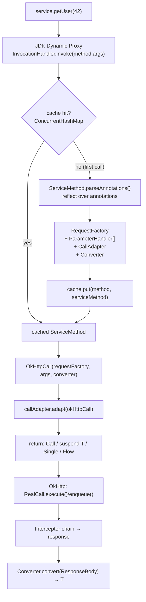
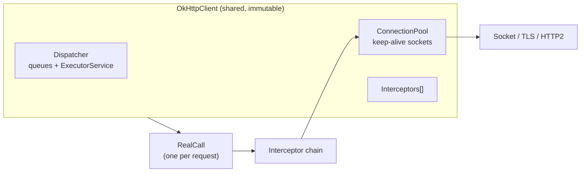
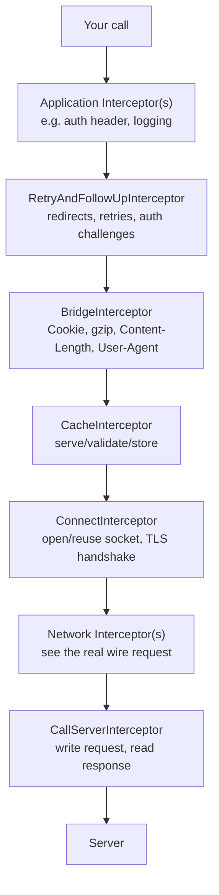

# Retrofit & OkHttp — Internals

!!! abstract "What this covers"
    Retrofit is a **thin declarative layer** over OkHttp. It does exactly two clever
    things: it turns a Kotlin/Java **interface into a live object via a JDK dynamic
    proxy**, and it **caches a parsed description of each method** so the reflection
    cost is paid once. Everything else — connections, threads, retries, caching, TLS —
    is OkHttp. This document goes engine-deep on both, with the dynamic-proxy path as
    the centerpiece.

---

## Part A — Retrofit Basics

### The Builder

```kotlin
val retrofit = Retrofit.Builder()
    .baseUrl("https://api.example.com/v1/")   // MUST end with '/'
    .client(okHttpClient)                       // any okhttp3.Call.Factory
    .addConverterFactory(MoshiConverterFactory.create())
    .addCallAdapterFactory(RxJava3CallAdapterFactory.create())
    .build()

val service: ApiService = retrofit.create(ApiService::class.java)
```

| Builder method | Role | Notes |
|---|---|---|
| `baseUrl(String \| HttpUrl)` | Root for resolving relative paths | Must end in `/`. A `@GET("users")` resolves against it like an `<a href>`. An absolute `@Url` bypasses it. |
| `client(Call.Factory)` | Supplies the HTTP engine | Usually an `OkHttpClient`. Retrofit never creates connections itself. If omitted, a default `OkHttpClient()` is built. |
| `callFactory(Call.Factory)` | Lower-level alias of `client()` | Lets you pass a lazy factory instead of a full client. |
| `addConverterFactory(Converter.Factory)` | `ResponseBody ⇄ T` serialization | **Order matters** — first factory that returns non-null wins. Put Scalars before Gson. |
| `addCallAdapterFactory(CallAdapter.Factory)` | Adapts `Call<T>` to your return type | Enables RxJava/Flow/suspend/CompletableFuture. Default handles `Call<T>` + suspend. |
| `callbackExecutor(Executor)` | Thread for `Callback` delivery | On Android, defaults to the **main thread** executor. |
| `validateEagerly(true)` | Parse all methods at `create()` | Fails fast at startup instead of on first call. Great for tests/CI. |

!!! tip "baseUrl resolution gotcha"
    `baseUrl("https://api.example.com/v1/")` + `@GET("/users")` (leading slash) →
    `https://api.example.com/users` — the `v1` is dropped, because a leading slash
    resolves against the **host root**. Use `@GET("users")` (no leading slash) to keep
    the `v1` prefix. This is standard RFC 3986 relative-URL resolution.

---

## Part B — Annotations

### HTTP method annotations

| Annotation | Body? | Typical use |
|---|---|---|
| `@GET` | No | Reads. Params via `@Query`/`@Path`. |
| `@POST` | Yes | Creates. `@Body`, or form/multipart. |
| `@PUT` | Yes | Full replace. |
| `@PATCH` | Yes | Partial update. (OkHttp supports PATCH natively.) |
| `@DELETE` | Optional | Delete. Body allowed but rare. |
| `@HEAD` | No | Headers only; return type must be `Void`/`Unit`. |
| `@OPTIONS` | No | Rarely used directly. |
| `@HTTP(method, path, hasBody)` | Custom | Arbitrary verbs, or DELETE-with-body. |

### Parameter & header annotations — cheat sheet

| Annotation | Applies to | Effect | Example |
|---|---|---|---|
| `@Path("id")` | method arg | Substitutes `{id}` in the relative URL. Encoded by default. | `@GET("users/{id}")` |
| `@Query("q")` | method arg | Appends `?q=…`. Null → omitted. `List`/array → repeated key. | `@Query("page") page: Int` |
| `@QueryMap` | `Map<String,*>` | Bulk query params. | `@QueryMap filters: Map<String,String>` |
| `@QueryName` | method arg | Query param with **no value** (`?flag`). | `@QueryName raw: String` |
| `@Body` | method arg | Serialized by the converter into the request body. | `@Body user: User` |
| `@Field("k")` | method arg | One form field. Requires `@FormUrlEncoded`. | `@Field("email") email: String` |
| `@FieldMap` | `Map` | Bulk form fields. | `@FieldMap form: Map<String,String>` |
| `@Part` | method arg | One multipart part. Requires `@Multipart`. | `@Part file: MultipartBody.Part` |
| `@PartMap` | `Map` | Bulk multipart parts. | `@PartMap parts: Map<String, RequestBody>` |
| `@Header("H")` | method arg | Dynamic header from an argument. Null → omitted. | `@Header("Authorization") tok: String` |
| `@HeaderMap` | `Map` | Bulk dynamic headers. | `@HeaderMap h: Map<String,String>` |
| `@Headers({...})` | method | **Static** headers declared inline. | `@Headers("Accept: application/json")` |
| `@Url` | method arg | Full/relative URL passed at call time; overrides the path. | `@GET suspend fun get(@Url url: String)` |
| `@Tag` | method arg | Attaches a typed tag to the `Request` (read in interceptors). | `@Tag req: RequestMeta` |

### `@FormUrlEncoded` vs `@Multipart`

```kotlin
@FormUrlEncoded
@POST("login")
suspend fun login(
    @Field("user") user: String,
    @Field("pass") pass: String,
): Response<Token>
// Content-Type: application/x-www-form-urlencoded
// Body: user=alice&pass=secret

@Multipart
@POST("upload")
suspend fun upload(
    @Part("meta") meta: RequestBody,
    @Part file: MultipartBody.Part,
): Response<Unit>
// Content-Type: multipart/form-data; boundary=…
```

!!! warning "Mutually exclusive"
    A method may use **`@FormUrlEncoded`**, **`@Multipart`**, or a single **`@Body`** —
    never more than one. Mixing (e.g. `@Field` + `@Body`) throws
    `IllegalArgumentException` at method-parse time.

### `@Streaming`

Without `@Streaming`, Retrofit **buffers the entire `ResponseBody` into memory** before
the converter runs — fine for JSON, fatal for a 500 MB download. `@Streaming` hands you
the live `ResponseBody` so you can stream `byteStream()` to disk.

```kotlin
@Streaming
@GET
suspend fun download(@Url url: String): Response<ResponseBody>
```

---

## Part C — Retrofit Internals (the money section)

### The one-line magic: `retrofit.create()`

`create()` returns an object that **implements your interface but has no source code**.
It is a JDK **dynamic proxy** — a class synthesized at runtime whose every method call is
funneled into a single `InvocationHandler.invoke(...)`.

```java
// Retrofit.create(), lightly paraphrased from the real source
public <T> T create(final Class<T> service) {
  validateServiceInterface(service);
  return (T) Proxy.newProxyInstance(
      service.getClassLoader(),
      new Class<?>[] { service },
      new InvocationHandler() {
        @Override public Object invoke(Object proxy, Method method, Object[] args) {
          // 1) java.lang.Object methods (equals/hashCode/toString) → run normally
          if (method.getDeclaringClass() == Object.class) {
            return method.invoke(this, args);
          }
          // 2) Kotlin/Java 8 default methods → delegate to the default impl
          if (isDefaultMethod(method)) {
            return invokeDefaultMethod(method, service, proxy, args);
          }
          // 3) THE HOT PATH: parse (once, cached) → build a call → adapt it
          return loadServiceMethod(method).invoke(args);
        }
      });
}
```

The proxy object holds no per-method logic. **Every** interface method arrives at the same
`invoke`, tagged with the `java.lang.reflect.Method` that was called and the runtime `args`.
Retrofit's job is to translate `(Method, args)` → an HTTP call of the type your signature
promised.

!!! note "Why a proxy and not codegen?"
    A dynamic proxy needs zero annotation processing, zero generated sources, and works for
    any interface shape. The cost is reflection — which Retrofit pays **exactly once per
    method** and then caches (see below). Dagger/Hilt chose the opposite trade (codegen) to
    avoid runtime reflection; Retrofit's per-method work is small enough that caching makes
    reflection a non-issue.

### `loadServiceMethod` — parse once, cache forever

```java
ServiceMethod<?> loadServiceMethod(Method method) {
  ServiceMethod<?> result = serviceMethodCache.get(method);   // ConcurrentHashMap
  if (result != null) return result;
  synchronized (serviceMethodCache) {                          // double-checked locking
    result = serviceMethodCache.get(method);
    if (result == null) {
      result = ServiceMethod.parseAnnotations(this, method);   // expensive: reflection
      serviceMethodCache.put(method, result);
    }
  }
  return result;
}
```

- The cache is a `ConcurrentHashMap<Method, ServiceMethod<?>>`.
- First call to a method reflects over its annotations, builds parameter handlers, resolves
  the converter and call adapter, and stores a **`ServiceMethod`** (concretely
  `HttpServiceMethod`) — a reusable, immutable plan.
- Every subsequent call is a hashmap hit + one virtual dispatch. No reflection.

### What `parseAnnotations` produces

`ServiceMethod.parseAnnotations` builds two things and fuses them into an `HttpServiceMethod`:

1. **`RequestFactory`** — the parsed method template:
   - HTTP method + relative URL template (`users/{id}`).
   - Static headers from `@Headers`.
   - Flags: `isFormEncoded`, `isMultipart`, `hasBody`.
   - An array of **`ParameterHandler<?>`** — one per argument, each knowing how to write its
     value into the request builder (`@Path` → path substitution, `@Query` → query param,
     `@Body` → converter invocation, etc.). Suspend functions get an extra synthetic
     trailing `Continuation` parameter, which Retrofit detects and strips.
2. **The response side**:
   - A **`CallAdapter<ResponseT, ReturnT>`** chosen from the registered factories by matching
     your return type.
   - A **`Converter<ResponseBody, ResponseT>`** chosen from the registered factories by
     matching the payload type.



### Building the request: `RequestFactory` → `okhttp3.Request`

At call time, `OkHttpCall` walks the `ParameterHandler[]` against the runtime `args`:

- URL: starts from `baseUrl`, applies the path template with `@Path` substitution, appends
  `@Query`/`@QueryMap` params. Encoding: `@Path`/`@Query` are URL-encoded by default;
  `encoded = true` opts out when you've already encoded.
- Headers: static `@Headers` merged with dynamic `@Header`/`@HeaderMap` (null values skip).
- Body: `@Body` runs the request `Converter` (`T → RequestBody`); `@Field*` builds a
  `FormBody`; `@Part*` builds a `MultipartBody`.

The output is a plain `okhttp3.Request`. Retrofit's request-building work ends here.

### Call adaptation — turning `Call<T>` into your return type

Retrofit's native currency is `retrofit2.Call<T>` (a single, deferred, one-shot HTTP call).
A **`CallAdapter`** converts it into whatever your method returns.

```java
public interface CallAdapter<R, T> {
  Type responseType();                 // the T inside Response<T> / body type
  T adapt(Call<R> call);               // wrap the raw Call as the return type
}
```

Factories are consulted **in registration order**; the first that returns non-null for the
return type wins.

=== "Default `Call<T>`"
    Return `Call<User>` → the `DefaultCallAdapterFactory` hands back the `OkHttpCall`
    (optionally wrapped with the callback executor so `Callback`s fire on the main thread).
    You call `.execute()` or `.enqueue()` yourself.

=== "suspend fun (coroutines)"
    A suspend function's bytecode return type is erased to `Object` and it gains a trailing
    `Continuation<T>` parameter. Retrofit detects the `Continuation`, treats the effective
    return as `Call<T>` (or `Call<Response<T>>`), and bridges it with
    `KotlinExtensions.await`, which uses `suspendCancellableCoroutine`:

    ```kotlin
    // Retrofit's KotlinExtensions.await(), simplified
    suspend fun <T> Call<T>.await(): T = suspendCancellableCoroutine { cont ->
        cont.invokeOnCancellation { cancel() }          // coroutine cancel → HTTP cancel
        enqueue(object : Callback<T> {
            override fun onResponse(call: Call<T>, response: Response<T>) {
                if (response.isSuccessful) cont.resume(response.body()!!)
                else cont.resumeWithException(HttpException(response))
            }
            override fun onFailure(call: Call<T>, t: Throwable) =
                cont.resumeWithException(t)
        })
    }
    ```

    Key consequences: **`enqueue` is used under the hood** (async, non-blocking the caller
    thread), and **cancelling the coroutine cancels the OkHttp call**. If you declare
    `suspend fun x(): User` a null body or non-2xx throws; declare
    `suspend fun x(): Response<User>` to inspect status/headers yourself.

=== "RxJava"
    `RxJava3CallAdapterFactory` maps `Single<T>`/`Observable<T>`/`Completable`/`Maybe<T>`.
    Subscription triggers the call; disposal cancels it. Compose with `subscribeOn(io())`.

=== "Flow"
    Retrofit has no built-in Flow adapter. Either wrap a suspend function
    (`flow { emit(api.get()) }`) or add a third-party `Call<T> → Flow<T>` adapter. Flow is
    a poor fit for a one-shot call anyway — a suspend function is the idiomatic choice.

### Response conversion — `Converter.Factory`

```java
public interface Converter<F, T> { T convert(F value); }
// Two directions, resolved separately:
//   responseBodyConverter:  ResponseBody -> T
//   requestBodyConverter:   T -> RequestBody   (for @Body)
```

| Factory | Handles | Note |
|---|---|---|
| `GsonConverterFactory` | JSON ⇄ POJO via Gson | Reflection-based; lenient defaults. |
| `MoshiConverterFactory` | JSON ⇄ class via Moshi | Codegen adapters avoid reflection; Kotlin-friendly. |
| `ScalarsConverterFactory` | `String`, primitives, boxed | Register **before** JSON factories so a `String` return isn't JSON-parsed. |
| `KotlinxSerializationConverterFactory` | `@Serializable` classes | Pairs with the kotlinx.serialization plugin. |
| `ProtoConverterFactory` | protobuf messages | Binary. |

!!! danger "Converter order is load-bearing"
    Factories are tried in order; the first returning a non-null converter wins. A
    `GsonConverterFactory` registered before `ScalarsConverterFactory` will try to JSON-decode
    a `String` body and blow up. **Scalars first, JSON last.**

---

## Part D — OkHttp Internals

### Architecture



| Component | Responsibility |
|---|---|
| `OkHttpClient` | Immutable config + shared resources (dispatcher, pool, interceptors, TLS). **Create one, reuse it.** `newBuilder()` shares the pool/dispatcher cheaply. |
| `RealCall` | The concrete `Call`. One per request; **not reusable** (`clone()` for a fresh one). |
| `Dispatcher` | Async policy: max **64** concurrent requests, max **5 per host**, backed by a cached `ExecutorService`. Holds `readyAsyncCalls`, `runningAsyncCalls`, `runningSyncCalls`. |
| `ConnectionPool` | Reuses idle keep-alive connections (default: 5 idle, 5-min TTL). Enables HTTP/2 coalescing. |

!!! tip "Reuse the client"
    Each `OkHttpClient` owns a thread pool and a connection pool. Creating one per request
    leaks threads and defeats connection reuse. Inject a singleton.

### The interceptor chain — the heart of OkHttp

An interceptor is a one-method functional interface that receives a `Chain`, may inspect/
rewrite the request, calls `chain.proceed(request)` to continue, and may inspect/rewrite the
response. It's a **responsibility chain**: every request descends through all interceptors to
the network and the response climbs back up in reverse.



**Built-in chain order (top → bottom):**

| # | Interceptor | Job |
|---|---|---|
| 1 | *(your application interceptors)* | Run once per `call`. |
| 2 | `RetryAndFollowUpInterceptor` | Recovers from failures; follows 3xx redirects and 401/407 auth (`Authenticator`). |
| 3 | `BridgeInterceptor` | App request → wire request: adds `Content-Length`/`Content-Type`, `Host`, `Connection: Keep-Alive`, `Accept-Encoding: gzip`, cookies; **transparently gunzips** the response. |
| 4 | `CacheInterceptor` | Consults `Cache` + `CacheStrategy`; may short-circuit or add conditional headers. |
| 5 | `ConnectInterceptor` | Acquires a healthy connection from the pool (or opens one + does the TLS handshake). |
| 6 | *(your network interceptors)* | Run once per **network** hop (twice if a redirect is followed). |
| 7 | `CallServerInterceptor` | Writes request bytes, reads response bytes. The terminal interceptor — does not call `proceed`. |

#### Application vs network interceptors

| | Application interceptor | Network interceptor |
|---|---|---|
| Added via | `addInterceptor` | `addNetworkInterceptor` |
| Invoked | Once per call | Once per network request (redirects/retries re-invoke) |
| Sees redirects/retries | No (only final result) | Yes (each hop) |
| Sees cached responses | Yes (even fully-cached, no network) | No (skipped when served from cache) |
| Sees `Accept-Encoding: gzip` / gzipped body | No (bridge adds/strips it below) | Yes (raw wire bytes) |
| Best for | Auth tokens, logging app-level intent, retries you control | Wire-level debugging, rewriting on-the-wire headers, per-hop metrics |

!!! note "Rule of thumb"
    Put **auth headers** in an *application* interceptor (you want it on the logical request,
    once). Put **byte-level / wire concerns** in a *network* interceptor.

### Connection management

- **Pooling & keep-alive**: idle sockets are held in `ConnectionPool` and reused, skipping
  TCP + TLS setup on the next request to the same origin. Huge latency win.
- **HTTP/2 multiplexing**: many concurrent streams over one socket. The 5-per-host dispatcher
  cap effectively lifts for HTTP/2 because requests share the connection.
- **Connection coalescing**: with HTTP/2, if two hostnames resolve to the same IP and the
  TLS certificate covers both (SAN), OkHttp reuses **one** connection for both — fewer
  handshakes.

### Execution: sync vs async

```kotlin
val call = client.newCall(request)

// Synchronous — blocks the caller thread, runs on it. You manage threading.
call.execute().use { resp -> /* ... */ }

// Asynchronous — Dispatcher schedules onto its thread pool; callback on a pool thread.
call.enqueue(object : Callback {
    override fun onResponse(call: Call, response: Response) { response.use { /* ... */ } }
    override fun onFailure(call: Call, e: IOException) { /* ... */ }
})
```

- `execute()` adds to `runningSyncCalls` and runs inline — **must not** be on the main thread.
- `enqueue()` adds to `readyAsyncCalls`; the dispatcher promotes it to `runningAsyncCalls`
  when under the concurrency caps, then a pool thread runs the chain.
- Retrofit's suspend support uses `enqueue` — that's why a suspend call doesn't block the
  dispatcher despite looking synchronous in your code.

!!! warning "Always close the body"
    `Response`/`ResponseBody` hold a socket/stream. Leaking them (not calling `close()` /
    not using `.use { }`, or reading the stream twice) starves the connection pool. Retrofit's
    converters close for you; raw OkHttp does not.

### Caching

OkHttp implements a **disk HTTP cache** compliant with RFC 7234 (semantics driven by
response headers). You must install it explicitly:

```kotlin
val client = OkHttpClient.Builder()
    .cache(Cache(File(context.cacheDir, "http"), 10L * 1024 * 1024)) // 10 MB
    .build()
```

- **`Cache-Control`** on the response governs storage/freshness: `max-age`, `no-cache`
  (store but revalidate), `no-store` (never store), `must-revalidate`.
- **`CacheStrategy`** computes, per request, a `(networkRequest, cacheResponse)` pair:
  - both null-ish → 504 (when `only-if-cached` and nothing cached),
  - cacheResponse only → serve from disk (fresh enough),
  - networkRequest only → go to network,
  - both → **conditional GET** (`If-None-Match`/`If-Modified-Since`); a `304` reuses the
    stored body and refreshes headers.
- **`Cache.Entry`** is the on-disk record: the stored response headers + body, keyed by URL,
  validated with `ETag`/`Last-Modified`.
- Force behavior per request with `CacheControl`:

```kotlin
val request = Request.Builder()
    .url(url)
    .cacheControl(CacheControl.Builder().maxStale(7, TimeUnit.DAYS).build()) // offline-friendly
    .build()
```

---

## Part E — Advanced

### Custom `CallAdapter` & `Converter`

A `CallAdapter.Factory` that unwraps into a coroutine-friendly `NetworkResult<T>` (see the
sealed wrapper below), or a `Converter.Factory` that special-cases an envelope, both follow
the same pattern: subclass the factory, inspect the `Type`/annotations in `get(...)`, return
`null` to defer to the next factory.

```kotlin
class EnvelopeConverterFactory(private val delegateFactory: Converter.Factory) : Converter.Factory() {
    override fun responseBodyConverter(
        type: Type, annotations: Array<Annotation>, retrofit: Retrofit,
    ): Converter<ResponseBody, *> {
        // wrap the JSON converter, unwrap `{ "data": ... }` before delegating
        val delegate = delegateFactory.responseBodyConverter(type, annotations, retrofit)!!
        return Converter<ResponseBody, Any> { body -> delegate.convert(body) /* ...unwrap... */ }
    }
}
```

### Coroutines: `Response<T>` vs `T`

```kotlin
interface UserApi {
    // Throws HttpException on non-2xx, IOException on network failure.
    @GET("users/{id}")
    suspend fun getUser(@Path("id") id: Long): User

    // Never throws for HTTP status — you inspect code()/headers/errorBody yourself.
    @GET("users")
    suspend fun listUsers(@Query("page") page: Int): Response<List<User>>
}
```

Prefer `Response<T>` at the repository boundary when you need status codes/headers/error
bodies; map to a domain result there so callers never touch Retrofit types.

### A canonical suspend interface

```kotlin
interface GitHubApi {
    @Headers("Accept: application/vnd.github+json")
    @GET("repos/{owner}/{repo}/issues")
    suspend fun issues(
        @Path("owner") owner: String,
        @Path("repo") repo: String,
        @Query("state") state: String = "open",
        @Query("per_page") perPage: Int = 30,
    ): Response<List<Issue>>

    @POST("repos/{owner}/{repo}/issues")
    suspend fun createIssue(
        @Path("owner") owner: String,
        @Path("repo") repo: String,
        @Body body: NewIssue,
    ): Response<Issue>
}
```

### Error handling: a sealed `NetworkResult`

There are **three distinct failure classes** to keep separate:

1. **HTTP errors** — the request completed but returned non-2xx (`404`, `500`). *Not* an
   exception unless you use the `T`-returning form (then `HttpException`).
2. **`IOException`** — no HTTP response at all: DNS failure, timeout, connection reset,
   cancellation (`CancellationException` for coroutines).
3. **Parse/conversion errors** — 2xx but the converter failed (malformed JSON, schema drift).

```kotlin
sealed interface NetworkResult<out T> {
    data class Success<T>(val data: T) : NetworkResult<T>
    data class HttpError(val code: Int, val message: String, val body: String?) : NetworkResult<Nothing>
    data class NetworkError(val cause: IOException) : NetworkResult<Nothing>
    data class UnknownError(val cause: Throwable) : NetworkResult<Nothing>
}

suspend fun <T> safeApiCall(call: suspend () -> Response<T>): NetworkResult<T> =
    try {
        val response = call()
        val body = response.body()
        if (response.isSuccessful && body != null) {
            NetworkResult.Success(body)
        } else {
            NetworkResult.HttpError(
                code = response.code(),
                message = response.message(),
                body = response.errorBody()?.string(),
            )
        }
    } catch (e: CancellationException) {
        throw e                                   // never swallow coroutine cancellation
    } catch (e: IOException) {
        NetworkResult.NetworkError(e)             // timeout / no connectivity
    } catch (e: Throwable) {
        NetworkResult.UnknownError(e)             // JSON parse errors, etc.
    }
```

!!! danger "Never swallow `CancellationException`"
    A broad `catch (e: Throwable)` in a suspend function will eat the
    `CancellationException` that structured concurrency relies on, breaking cancellation.
    Rethrow it explicitly, as above.

### Auth: application interceptor vs `Authenticator`

They solve different problems and are often used **together**:

- **Interceptor** — *proactively* attaches the current token to every outgoing request.
- **`Authenticator`** — *reactively* fires only on a **401** to refresh the token and retry
  the original request. OkHttp calls it inside `RetryAndFollowUpInterceptor`.

```kotlin
class AuthInterceptor(private val tokens: TokenStore) : Interceptor {
    override fun intercept(chain: Interceptor.Chain): Response {
        val request = chain.request()
        // Don't attach to the refresh endpoint itself.
        val access = tokens.accessToken ?: return chain.proceed(request)
        val authed = request.newBuilder()
            .header("Authorization", "Bearer $access")
            .build()
        return chain.proceed(authed)
    }
}

class TokenAuthenticator(
    private val tokens: TokenStore,
    private val refreshApi: RefreshApi,
) : Authenticator {
    override fun authenticate(route: Route?, response: Response): Request? {
        // Give up after a couple of attempts to avoid an infinite 401 loop.
        if (responseCount(response) >= 2) return null

        synchronized(this) {
            val current = tokens.accessToken
            val sent = response.request.header("Authorization")?.removePrefix("Bearer ")
            // If another thread already refreshed, just retry with the new token.
            val fresh = if (current != null && current != sent) {
                current
            } else {
                val refreshed = runBlocking { refreshApi.refresh(tokens.refreshToken) }
                    ?: return null                       // refresh failed → propagate 401
                tokens.save(refreshed)
                refreshed.accessToken
            }
            return response.request.newBuilder()
                .header("Authorization", "Bearer $fresh")
                .build()
        }
    }

    private fun responseCount(response: Response): Int {
        var r: Response? = response; var count = 1
        while (r?.priorResponse != null) { count++; r = r.priorResponse }
        return count
    }
}

val client = OkHttpClient.Builder()
    .addInterceptor(AuthInterceptor(tokens))
    .authenticator(TokenAuthenticator(tokens, refreshApi))
    .build()
```

!!! tip "Single-flight refresh"
    Guard the refresh with a lock and re-check the token inside it (shown above). Without it,
    ten parallel 401s trigger ten refresh calls and a token-rotation stampede.

### Multipart upload with progress

Wrap the source `RequestBody` and report bytes written as OkHttp pumps it to the socket.

```kotlin
class ProgressRequestBody(
    private val delegate: RequestBody,
    private val onProgress: (sent: Long, total: Long) -> Unit,
) : RequestBody() {
    override fun contentType() = delegate.contentType()
    override fun contentLength() = delegate.contentLength()
    override fun writeTo(sink: BufferedSink) {
        val total = contentLength()
        val counting = object : ForwardingSink(sink) {
            var sent = 0L
            override fun write(source: Buffer, byteCount: Long) {
                super.write(source, byteCount)
                sent += byteCount
                onProgress(sent, total)
            }
        }
        val bufferedSink = counting.buffer()
        delegate.writeTo(bufferedSink)
        bufferedSink.flush()
    }
}

// Usage
val part = MultipartBody.Part.createFormData(
    name = "file", filename = file.name,
    body = ProgressRequestBody(file.asRequestBody("image/jpeg".toMediaType())) { sent, total ->
        val pct = (100 * sent / total).toInt()
    },
)
api.upload(part)
```

### `@Streaming` download with progress

```kotlin
@Streaming @GET
suspend fun download(@Url url: String): Response<ResponseBody>

suspend fun saveToFile(url: String, out: File, onProgress: (Int) -> Unit) {
    val body = api.download(url).body() ?: return
    val total = body.contentLength()
    body.byteStream().use { input ->
        out.outputStream().use { output ->
            val buf = ByteArray(8 * 1024)
            var read: Int; var done = 0L
            while (input.read(buf).also { read = it } != -1) {
                output.write(buf, 0, read)
                done += read
                if (total > 0) onProgress((100 * done / total).toInt())
            }
        }
    }
}
```

Without `@Streaming`, the whole body is buffered into memory first — this loop would OOM on
large files.

### WebSocket

OkHttp speaks WebSocket natively (Retrofit does not):

```kotlin
val ws = client.newWebSocket(
    Request.Builder().url("wss://stream.example.com/socket").build(),
    object : WebSocketListener() {
        override fun onOpen(webSocket: WebSocket, response: Response) { webSocket.send("hello") }
        override fun onMessage(webSocket: WebSocket, text: String) { /* ... */ }
        override fun onClosing(webSocket: WebSocket, code: Int, reason: String) {
            webSocket.close(1000, null)
        }
        override fun onFailure(webSocket: WebSocket, t: Throwable, response: Response?) { /* ... */ }
    },
)
```

### TLS: certificate pinning

Pin the server's public-key hash so a rogue/compromised CA can't MITM you.

```kotlin
val pinner = CertificatePinner.Builder()
    .add("api.example.com", "sha256/AAAAAAAAAAAAAAAAAAAAAAAAAAAAAAAAAAAAAAAAAAA=")
    .add("api.example.com", "sha256/BBBBBBBBBBBBBBBBBBBBBBBBBBBBBBBBBBBBBBBBBBB=") // backup pin
    .build()

val client = OkHttpClient.Builder()
    .certificatePinner(pinner)
    .build()
```

!!! warning "Always ship a backup pin"
    A single pin bricks the app the moment the server rotates its key. Include a **backup
    pin** for the next cert, and prefer pinning an **intermediate CA** key over a leaf.
    Better still on modern Android: use the **Network Security Config** XML so pins can be
    updated without a code change and expiry is enforced.

### Timeouts

| Timeout | Builder method | Governs |
|---|---|---|
| Call | `callTimeout` | **Whole call** incl. redirects, retries, body I/O. The overall cap. |
| Connect | `connectTimeout` | TCP + TLS handshake to establish a connection. |
| Read | `readTimeout` | Gap between two read operations (idle socket during read). |
| Write | `writeTimeout` | Gap between two write operations (uploading). |

```kotlin
OkHttpClient.Builder()
    .callTimeout(30, TimeUnit.SECONDS)
    .connectTimeout(10, TimeUnit.SECONDS)
    .readTimeout(15, TimeUnit.SECONDS)
    .writeTimeout(15, TimeUnit.SECONDS)
    .build()
```

!!! note "Read timeout ≠ total time"
    `readTimeout` fires on inactivity between reads, not total transfer time. A slow but
    steady stream can run for minutes without tripping it — use `callTimeout` for a hard cap.

---

## Interview Q&A

!!! question "1. How does `retrofit.create()` turn an interface with no implementation into working code?"
    It uses `java.lang.reflect.Proxy.newProxyInstance` to synthesize a **dynamic proxy** that
    implements your interface. Every method call is routed to a single
    `InvocationHandler.invoke(method, args)`. For real API methods, the handler calls
    `loadServiceMethod(method)` — which reflects over the annotations **once**, builds a
    `ServiceMethod` (request template + parameter handlers + call adapter + converter), caches
    it in a `ConcurrentHashMap`, and invokes it to produce a `Call<T>` adapted to your return
    type. Object methods and default methods are special-cased.

    **Follow-up — why cache, and where?** Reflection is expensive; parsing happens once per
    `Method` and is stored in a `ConcurrentHashMap<Method, ServiceMethod<?>>` under
    double-checked locking, so steady-state cost is a map lookup + a virtual dispatch — no
    reflection.

!!! question "2. How does a `suspend` function map onto Retrofit's `Call<T>`?"
    At bytecode level a suspend function loses its return type (erased to `Object`) and gains a
    trailing `Continuation<T>` parameter. Retrofit detects the `Continuation`, treats the
    effective type as `Call<T>` (or `Call<Response<T>>`), and bridges via
    `KotlinExtensions.await`, which wraps `Call.enqueue` in `suspendCancellableCoroutine`. So a
    suspend call is asynchronous under the hood (uses `enqueue`, not `execute`) and cancelling
    the coroutine cancels the OkHttp call.

    **Follow-up — `suspend fun x(): User` vs `Response<User>`?** The `T` form resumes with the
    body on 2xx and throws `HttpException` on non-2xx / `IOException` on failure. The
    `Response<T>` form never throws for HTTP status — you inspect `code()`, `headers()`,
    `errorBody()` yourself. Prefer `Response<T>` at repo boundaries.

!!! question "3. Application interceptor vs network interceptor — when do you use each?"
    Application interceptors run **once per logical call**, sit above retries/redirects/cache,
    and see the final result even if it was served entirely from cache — ideal for auth
    headers and app-level logging. Network interceptors run **once per network hop** (again on
    each redirect/retry), see the raw wire request/response including gzip and redirect
    intermediates, and are skipped for fully-cached responses — ideal for wire-level debugging
    and per-hop metrics.

    **Follow-up — where does the auth header go?** In an application interceptor, so it's
    attached once to the logical request regardless of retries. Token *refresh* on 401 belongs
    in an `Authenticator`, not an interceptor.

!!! question "4. Walk the built-in OkHttp interceptor chain in order."
    `[your app interceptors]` → `RetryAndFollowUpInterceptor` (redirects, retries, auth
    challenges) → `BridgeInterceptor` (adds Content-Length/Type, Host, cookies,
    `Accept-Encoding: gzip`; gunzips the response) → `CacheInterceptor` (serve/validate/store
    via `CacheStrategy`) → `ConnectInterceptor` (acquire/open a connection, TLS handshake) →
    `[your network interceptors]` → `CallServerInterceptor` (write request, read response —
    terminal, doesn't call `proceed`).

    **Follow-up — which interceptor never calls `proceed()`?** `CallServerInterceptor`, the
    terminal one; it performs the actual socket I/O and returns the response up the chain.

!!! question "5. `Authenticator` vs an interceptor for token refresh — and the concurrency trap?"
    An interceptor is *proactive* (attach the current token to every request); an
    `Authenticator` is *reactive* — OkHttp invokes it only after a **401**, letting you refresh
    the token and return a rebuilt request that OkHttp automatically retries. The trap: N
    parallel requests all 401 at once and each triggers a refresh, causing a stampede and
    rotating tokens out from under each other. Fix with a **single-flight** guard — synchronize
    the refresh and, inside the lock, check whether another thread already refreshed (compare
    the token on the failed request to the current one) before refreshing again. Also cap
    attempts via `priorResponse` count to avoid infinite loops.

    **Follow-up — how do you stop an infinite 401 loop?** Walk `response.priorResponse` to
    count attempts and return `null` (give up) past a threshold; returning `null` propagates the
    401 to the caller.

!!! question "6. What are the distinct error classes in a Retrofit call and how do you model them?"
    Three: (a) **HTTP errors** — request completed, non-2xx status (not an exception unless
    using the body-returning suspend form, which throws `HttpException`); (b) **`IOException`**
    — no response at all (DNS, timeout, reset, cancellation); (c) **parse/conversion errors** —
    2xx but the converter failed on malformed JSON. Model them with a sealed
    `NetworkResult` (Success / HttpError / NetworkError / UnknownError) produced by a
    `safeApiCall` wrapper that catches `IOException` and `Throwable` separately — while
    **rethrowing `CancellationException`** so coroutine cancellation still works.

    **Follow-up — why rethrow `CancellationException`?** Structured concurrency signals
    cancellation by throwing it; a broad `catch (Throwable)` that swallows it leaves coroutines
    running after their scope is cancelled and breaks `withTimeout`/job cancellation.

!!! question "7. Should you model Retrofit request/response DTOs as Kotlin `data class`es or standard `class`es, and what are the tradeoffs?"
    **Answer:** You should **almost always model request/response DTOs as `data class`es**. DTOs are pure data containers (value objects) with no behavior. Declaring them as data classes auto-generates `equals()`, `hashCode()`, `toString()`, and `copy()`, which are highly beneficial:
    
    1.  **Debugging & Logging:** The auto-generated `toString()` prints clean, readable property values (e.g. `UserResponse(id=123, name=Ann)`) in Logcat instead of generic class references (`com.app.UserResponse@3f2a1b`).
    2.  **Unit Testing:** Unit tests comparing network payloads require structural equality. `data class`es compare property values out of the box (`expectedResponse == actualResponse`), whereas standard classes do referential comparisons, forcing you to write custom assertion checkers or manually override `equals()`.
    3.  **Payload Mutation:** The generated `copy()` method makes it easy to copy and mutate request structures (e.g. duplicating a query parameter set or updating pagination limits) for downstream calls.
    
    **When to use a normal `class` (or other structures):**
    *   **Polymorphic JSON:** If your API returns a list of items with varying schemas based on a `"type"` field, you cannot use a simple `data class` because data classes cannot be `open` or `abstract`. You must model them using an inheritance hierarchy (`sealed interface` or `sealed class` with discrete `data class` subtypes).
    *   **Empty Payloads:** If an endpoint requires an empty JSON body or has no parameters, a `data class` cannot be declared because it requires at least one primary constructor parameter. Use a standard `class` or a `data object` instead.
    
    **Follow-up:** *What is the risk of using mutable variables (`var`) inside DTO primary constructors?* — It breaks `hashCode` stability. If a DTO is mutated after being placed in a `HashMap` or `HashSet` (such as a local deduplication cache), the entry cannot be retrieved because its bucket index is computed from a hash code that has since changed. Keep all DTO fields `val` and immutable.

