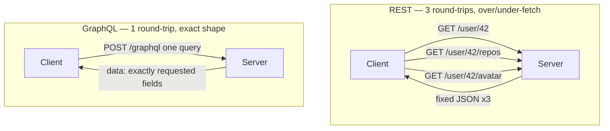
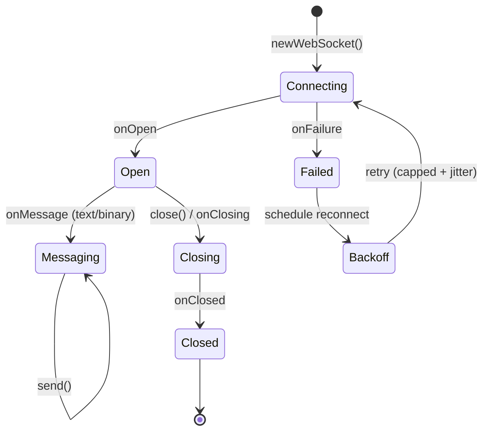

# Networking — Advanced

This module goes past "add Retrofit + OkHttp and call it a day." It covers the transport-security layer the platform enforces (Network Security Config), the legacy clients you'll still meet in old code (HttpURLConnection, Volley), the two modern non-REST protocols seniors are expected to reason about (GraphQL/Apollo, gRPC), real-time transport (WebSocket on OkHttp), and the cross-cutting topic interviewers love because it has burned everyone at least once: **TLS pinning and pin rotation**.

!!! abstract "What a senior is expected to own here"
    - Configure transport security **declaratively** (NSC) rather than sprinkling trust managers through code.
    - Know when a pin is a liability, not a feature — and how to rotate one without bricking installed apps.
    - Pick a protocol (REST / GraphQL / gRPC / WebSocket) from first principles: payload shape, round-trips, streaming needs, and mobile constraints (radio wakeups, battery, flaky networks).

---

## Network Security Config (NSC)

Since Android 7.0 (API 24) you can declare TLS/trust policy in an XML file instead of writing a custom `X509TrustManager`. Since **API 28 (Android 9) cleartext (HTTP) is disabled by default** app-wide. NSC is the *correct* place to relax or tighten that — code-based trust hacks are a red flag in review.

Wire it up in the manifest:

```kotlin
// AndroidManifest.xml
<application
    android:networkSecurityConfig="@xml/network_security_config"
    ... >
```

### The four things NSC controls

| Element | Purpose | Typical use |
|---|---|---|
| `cleartextTrafficPermitted` | Allow/deny plain HTTP | Deny in prod; allow only for a local dev host |
| `<domain-config>` | Per-domain overrides | Pin only your API host, leave the rest default |
| `<pin-set>` | Certificate pinning (SPKI hashes) | Lock the app to known cert public keys |
| `<debug-overrides>` | Trust settings applied **only** when `android:debuggable=true` | Trust Charles/Proxyman CA in debug builds |

### A production-grade config

```kotlin
<!-- res/xml/network_security_config.xml -->
<?xml version="1.0" encoding="utf-8"?>
<network-security-config>

    <!-- App-wide default: no cleartext, only system CAs -->
    <base-config cleartextTrafficPermitted="false">
        <trust-anchors>
            <certificates src="system" />
        </trust-anchors>
    </base-config>

    <!-- Pin the API host to two SPKI hashes (current + backup) -->
    <domain-config cleartextTrafficPermitted="false">
        <domain includeSubdomains="true">api.example.com</domain>
        <pin-set expiration="2026-12-31">
            <!-- Leaf/intermediate public key, base64(SHA-256(SPKI)) -->
            <pin digest="SHA-256">k3X4b2c1...currentPinHash=</pin>
            <!-- Backup pin: a key you control but have NOT deployed yet -->
            <pin digest="SHA-256">Zx9Qp0aa...backupPinHash=</pin>
        </pin-set>
    </domain-config>

    <!-- Applied ONLY in debuggable builds: trust a user-installed proxy CA -->
    <debug-overrides>
        <trust-anchors>
            <certificates src="user" />
            <certificates src="system" />
        </trust-anchors>
    </debug-overrides>

</network-security-config>
```

!!! warning "The three details that trip people up"
    - **`expiration` on `<pin-set>` is a safety valve, not decoration.** After that date the OS *ignores* the pins and falls back to normal CA validation — this is deliberate, so an app you can no longer update doesn't brick itself. Set it, and track it.
    - **`debug-overrides` only activates when `android:debuggable="true"`.** Release builds never trust user CAs through it — which is exactly why your MITM proxy "stops working" on a release build.
    - **Always ship a backup pin.** A `<pin-set>` with a single pin is a time bomb (see rotation section).

!!! tip "Cleartext for a local dev server"
    Don't flip `cleartextTrafficPermitted="true"` globally. Scope it: a `<domain-config cleartextTrafficPermitted="true">` for `10.0.2.2` (emulator loopback) or your LAN host only.

---

## HttpURLConnection (legacy)

`java.net.HttpURLConnection` is the JDK's built-in client and still the substrate a lot of old Android code sits on. You should recognize it and know *why* the ecosystem moved off it.

```kotlin
val url = URL("https://api.example.com/v1/user")
val conn = (url.openConnection() as HttpURLConnection).apply {
    requestMethod = "GET"
    connectTimeout = 15_000
    readTimeout = 15_000
    setRequestProperty("Accept", "application/json")
}
try {
    if (conn.responseCode in 200..299) {
        val body = conn.inputStream.bufferedReader().use { it.readText() }
        // ...parse...
    } else {
        conn.errorStream?.bufferedReader()?.use { it.readText() }
    }
} finally {
    conn.disconnect()   // easy to forget; leaks connections if you do
}
```

### Why OkHttp replaced it

| Concern | HttpURLConnection | OkHttp |
|---|---|---|
| Connection pooling | Manual / brittle | Automatic, shared pool |
| HTTP/2 & multiplexing | No | Yes |
| Transparent GZIP | Partial | Yes |
| Retry / redirect handling | Quirky, historically buggy | Robust, configurable |
| Interceptors | None | Full pipeline (auth, logging, retries) |
| Response caching | Awkward | Built-in disk cache |
| TLS config / pinning | Manual trust managers | `CertificatePinner`, `ConnectionSpec` |
| API ergonomics | Verbose, stream-based | Fluent, cancellable calls |

!!! note "One-liner for the interview"
    "HttpURLConnection works, but you end up re-implementing connection pooling, HTTP/2, caching, and retry logic that OkHttp gives you for free — and its historical edge cases (e.g. buggy redirect/`Connection: keep-alive` handling on older Androids) are the reason Google itself recommends OkHttp."

---

## Volley (brief)

Volley is Google's older request-queue library (circa 2013). It's not something you'd *start* with today, but you'll see it in legacy apps and it occasionally still gets asked.

- **Model:** you build a `RequestQueue` (backed by a thread pool + cache) and enqueue `Request` objects (`StringRequest`, `JsonObjectRequest`, `ImageRequest`). Volley schedules, dispatches, caches, and delivers callbacks on the main thread.
- **Sweet spot:** high volume of *small* RPC/JSON calls where automatic request scheduling and response caching matter.
- **Why it faded:** no first-class streaming, weak for large downloads/uploads, callback-based (no coroutines/Flow), and it historically wrapped HttpURLConnection. Retrofit + OkHttp + coroutines superseded it on every axis.

!!! quote "When you'd still see it"
    Maintenance work on an app built 2014–2018, or a codebase that standardized on `ImageLoader`/`NetworkImageView` before Glide/Coil. Recommend migration; don't extend it.

---

## GraphQL with Apollo

REST gives you fixed endpoints returning fixed shapes. **GraphQL** gives the *client* control of the response shape via a typed query against a single endpoint. On Android, **Apollo Kotlin** (formerly Apollo Android) is the de-facto client: it does codegen from your schema + `.graphql` files and ships a normalized cache.

### The moving parts

1. **Schema** (`schema.graphqls`) — the server's type system, downloaded via introspection. Source of truth for codegen.
2. **Operations** (`*.graphql`) — the queries/mutations *you* write, checked into your module.
3. **Codegen** — the Apollo Gradle plugin reads schema + operations and generates type-safe Kotlin: query classes, `Data` models, adapters. A field you didn't request literally doesn't exist on the generated model.
4. **Normalized cache** — responses are flattened into a key→object store (by `id`/`__typename`). Two queries touching the same entity share one cache record, so a mutation updates every screen showing that entity.

```kotlin
// build.gradle.kts
plugins { id("com.apollographql.apollo3") version "4.x" }

apollo {
    service("api") {
        packageName.set("com.example.graphql")
        // schema.graphqls + *.graphql live in src/main/graphql/...
    }
}
```

```graphql
# src/main/graphql/GetUser.graphql
query GetUser($id: ID!) {
  user(id: $id) {
    id
    name
    avatarUrl          # ask for exactly what the screen needs
    repositories(first: 5) {
      nodes { id name stargazerCount }
    }
  }
}
```

```kotlin
// Calling the generated operation — suspends, returns a typed response
val apollo = ApolloClient.Builder()
    .serverUrl("https://api.example.com/graphql")
    .normalizedCache(MemoryCacheFactory(maxSizeBytes = 10 * 1024 * 1024))
    .build()

val response: ApolloResponse<GetUserQuery.Data> =
    apollo.query(GetUserQuery(id = "42")).execute()

if (!response.hasErrors()) {
    val user = response.data?.user          // GetUserQuery.User — fully typed
    render(user?.name, user?.repositories?.nodes.orEmpty())
} else {
    // GraphQL errors arrive in the body with HTTP 200 — check response.errors
    response.errors?.forEach { log(it.message) }
}
```

### Request shape: REST vs GraphQL



### Tradeoffs vs REST

| Dimension | REST | GraphQL |
|---|---|---|
| Endpoints | Many, resource-oriented | One (`/graphql`) |
| Over/under-fetching | Common | Client picks exact fields |
| Round-trips for a screen | Often several | Usually one |
| Response typing on client | Manual (or OpenAPI codegen) | Strong via schema codegen |
| Caching | HTTP caching "for free" (URLs, CDNs, `ETag`) | App-level normalized cache; HTTP caching is harder (POST, one URL) |
| Error semantics | HTTP status codes | Usually HTTP 200 + `errors[]` in body |
| Versioning | `/v2/...` | Schema evolution + field deprecation |
| File upload | Native | Needs the multipart spec |
| Server complexity | Lower | Resolver/N+1 concerns |

!!! tip "Senior framing"
    GraphQL wins when screens aggregate many related resources and the client is the one that knows what it needs. REST wins when responses are cacheable at the HTTP/CDN layer and endpoints are simple. The classic gotcha: **GraphQL errors return HTTP 200** — check `response.hasErrors()`, don't rely on status codes.

---

## gRPC basics

**gRPC** is a contract-first RPC framework: you define services and messages in **Protocol Buffers** (`.proto`), codegen client + server stubs, and communicate over **HTTP/2** with a compact binary payload. On mobile you'd typically use **gRPC + `grpc-okhttp`** transport, or **gRPC-Web** through a proxy.

```protobuf
// user.proto
syntax = "proto3";
service UserService {
  rpc GetUser (UserRequest) returns (User);                 // unary
  rpc StreamUpdates (UserRequest) returns (stream Update);  // server streaming
  rpc UploadEvents (stream Event) returns (Ack);            // client streaming
  rpc Chat (stream Msg) returns (stream Msg);               // bidirectional
}
message UserRequest { string id = 1; }
message User { string id = 1; string name = 2; }
```

### The four call types

| Type | Shape | Example |
|---|---|---|
| Unary | 1 request → 1 response | Fetch a profile |
| Server streaming | 1 request → N responses | Live feed / progress |
| Client streaming | N requests → 1 response | Batch upload |
| Bidirectional | N ↔ N over one connection | Chat, live sync |

### When to use it on mobile — and when not

**Use it when:** you own both ends, payloads are chatty/structured, you want strict typed contracts, and you benefit from HTTP/2 multiplexing + streaming (e.g. internal microservice-backed apps, real-time sync).

**Think twice when:**

- **Browsers/CDNs/proxies** are in the path — raw gRPC needs HTTP/2 trailers many intermediaries mangle; you fall back to gRPC-Web + a proxy.
- **Binary payloads are hard to debug** on flaky mobile networks (no eyeballing JSON in a proxy without proto descriptors).
- **APK size / build complexity** — protoc toolchain and generated code add weight.
- **Public third-party API** — REST/GraphQL are far more approachable for external consumers.

!!! note "vs GraphQL"
    Both are typed and contract-first. GraphQL puts *response shaping* in the client's hands over HTTP/1.1-friendly POSTs; gRPC puts *performance + streaming* first over HTTP/2 with a rigid, compiled contract. gRPC's streaming is its real differentiator on mobile.

---

## WebSocket with OkHttp

For true full-duplex, push-driven communication (chat, live scores, presence), a WebSocket keeps one TCP connection open both ways. OkHttp has a first-class client — no extra dependency.

```kotlin
class ChatSocket(private val client: OkHttpClient) {

    private var webSocket: WebSocket? = null
    private var retryAttempt = 0

    fun connect() {
        val request = Request.Builder()
            .url("wss://api.example.com/chat")
            .build()

        webSocket = client.newWebSocket(request, object : WebSocketListener() {

            override fun onOpen(webSocket: WebSocket, response: Response) {
                retryAttempt = 0                     // reset backoff on success
                webSocket.send("""{"type":"hello"}""")
            }

            override fun onMessage(webSocket: WebSocket, text: String) {
                handleFrame(text)                    // text frame
            }

            override fun onMessage(webSocket: WebSocket, bytes: ByteString) {
                handleBinary(bytes)                  // binary frame
            }

            override fun onClosing(webSocket: WebSocket, code: Int, reason: String) {
                webSocket.close(1000, null)          // ack the close handshake
            }

            override fun onFailure(webSocket: WebSocket, t: Throwable, response: Response?) {
                scheduleReconnect()                  // network drop / server reset
            }
        })
    }

    private fun scheduleReconnect() {
        // Exponential backoff with cap + jitter — never hammer the server
        val delayMs = minOf(30_000L, (1L shl retryAttempt) * 1_000L) +
            Random.nextLong(0, 1_000)
        retryAttempt++
        scope.launch { delay(delayMs); connect() }
    }

    fun shutdown() {
        webSocket?.close(1000, "bye")                // 1000 = normal closure
        // Do NOT reconnect after an intentional close
    }
}
```

### Lifecycle & the reconnection contract



!!! warning "Production concerns interviewers probe"
    - **Backoff, not a tight loop.** On `onFailure`, reconnect with exponential backoff + jitter and a cap. A naïve `connect()` inside `onFailure` is a self-inflicted DDoS on your own backend when the network flaps.
    - **Heartbeats.** NAT/proxies silently drop idle connections. Use OkHttp's `pingInterval(20, TimeUnit.SECONDS)` on the client, or app-level ping/pong, so dead connections are detected fast.
    - **Lifecycle awareness.** Tie the socket to a lifecycle/`CoroutineScope`. Close on background if the feature doesn't need push while backgrounded — an open socket keeps the radio warm and drains battery.
    - **Distinguish intentional close from failure.** After `shutdown()` (code 1000) you must *not* reconnect; only reconnect on `onFailure`/abnormal close.
    - **Backpressure.** `send()` buffers; if the peer is slow, `queueSize()` grows. Watch it and shed load if needed.

---

## TLS/SSL pinning strategies

Pinning means: don't trust *any* valid CA-issued cert — trust only the specific key(s) you baked into the app. It defeats MITM via a rogue/compromised CA. There are three ways to do it, and one big footgun.

### The three approaches

| Strategy | Where | Pros | Cons |
|---|---|---|---|
| **Network Security Config `<pin-set>`** | Declarative XML | No code; OS-enforced; `expiration` safety valve; per-domain | API 24+; less dynamic; ships in APK |
| **OkHttp `CertificatePinner`** | Code | Fine-grained; easy to unit test; works below API 24; can swap client | Lives in code; must handle rotation yourself |
| **Custom `X509TrustManager` / `SSLSocketFactory`** | Code (low-level) | Total control (custom chains, self-signed roots) | Easy to get catastrophically wrong; disables platform checks if sloppy; avoid unless truly needed |

```kotlin
// OkHttp CertificatePinner — pin to SPKI hashes, current + backup
val pinner = CertificatePinner.Builder()
    .add("api.example.com", "sha256/k3X4b2c1...currentPinHash=")
    .add("api.example.com", "sha256/Zx9Qp0aa...backupPinHash=")  // not yet deployed
    .build()

val client = OkHttpClient.Builder()
    .certificatePinner(pinner)
    .build()
```

!!! tip "Pin the public key (SPKI), not the certificate"
    Pin `base64(SHA-256(SubjectPublicKeyInfo))`, not the whole cert. The cert changes every renewal; if you keep the *same key pair* across renewals, the SPKI pin survives the renewal. Pinning to the intermediate CA's key is a common middle ground — fewer rotations, still meaningfully protective.

### Pin rotation risk — the part that has bricked apps

This is the reason many senior engineers argue pinning is a liability for most consumer apps.

!!! danger "The failure mode"
    A pin lives inside the shipped APK. If your server cert's key rotates (renewal with a new key, emergency revocation, CA change) and the *new* key isn't already pinned in an app version the user has installed, **every request fails TLS validation — permanently, until they update.** You cannot fix it server-side. Users on old versions are locked out. This has caused real multi-day outages.

**How to rotate safely:**

1. **Always ship ≥2 pins:** the current key *and* a backup key you control but haven't deployed. The backup lets you switch server keys without an app release.
2. **Rotate in the right order:** ship the app that trusts *both* pins → wait for adoption → switch the server to the backup key → in the *next* release, drop the retired pin and add a fresh backup.
3. **Set `expiration`** on the NSC `<pin-set>` so a stale, un-updatable app degrades to normal CA validation instead of bricking.
4. **Prefer pinning the intermediate CA key** over the leaf when you can — it rotates far less often.
5. **Have a kill switch / remote config** to disable pinning fast, and monitor TLS-failure rates in analytics so you *see* a bad rotation within minutes.

!!! quote "The honest senior take"
    "Pinning protects against a compromised CA, but for most apps the operational risk of self-inflicted lockout outweighs the threat it mitigates. If you pin: pin the SPKI (not the cert), always carry a backup pin, set an expiration, and wire a remote kill switch. If you can't commit to that operational discipline, don't pin."

---

## Interview Q&A

!!! question "1. Since API 28, cleartext is off by default. Your app must talk to a legacy HTTP-only internal host. How do you enable it *safely*?"
    Use a **scoped `<domain-config cleartextTrafficPermitted="true">`** in the Network Security Config listing only that host — never flip `base-config` globally. Even better, restrict it to debug builds via `debug-overrides` if it's only for local dev.

    **Follow-up — why not just add `android:usesCleartextTraffic="true"` in the manifest?** That's a blunt app-wide switch that permits *all* cleartext and is overridden by NSC anyway. NSC lets you allow exactly one domain while keeping HTTPS-only everywhere else, which is what a policy/security reviewer wants to see.

!!! question "2. You ship an app with a single certificate pin. What can go wrong, and how do you prevent it?"
    If the server's pinned key rotates (renewal with a new key, revocation, CA migration) and no installed app version pins the new key, **all TLS handshakes fail permanently until users update** — a server-side unfixable outage. Prevent it by always shipping a **backup pin**, rotating in the order *deploy-both → switch-server → drop-old-next-release*, setting an `expiration` on the pin-set, and having a remote kill switch.

    **Follow-up — pin the leaf cert or something else?** Pin the **SPKI (public key)**, ideally of the intermediate CA. Cert-level pins break on every renewal; SPKI pins survive renewals that reuse the key, and intermediate-CA pins rotate least often.

!!! question "3. When would you choose GraphQL over REST for an Android app, and what's the client-side gotcha?"
    Choose GraphQL when screens aggregate many related resources and you want to eliminate over/under-fetching and multiple round-trips — the client requests the exact field set in one query, and Apollo's normalized cache keeps entities consistent across screens. REST stays better when HTTP/CDN caching and simple cacheable endpoints matter.

    **Follow-up — the gotcha?** GraphQL typically returns **HTTP 200 even on errors**, with problems in the `errors[]` array of the body. You must check `response.hasErrors()` instead of relying on status codes, and handle partial-data responses (some fields resolved, some errored).

!!! question "4. gRPC vs WebSocket for a real-time chat feature on mobile — how do you decide?"
    Both give bidirectional streaming. **gRPC bidi streaming** fits when you own both ends, want a typed protobuf contract, and can accept the HTTP/2 + toolchain overhead (and proxy/gRPC-Web caveats). **WebSocket on OkHttp** is lighter, firewall/proxy-friendly, trivial to debug (text frames), needs no extra dependency, and is the pragmatic default for chat unless you specifically need proto contracts and multiplexed streams.

    **Follow-up — battery/reliability concerns either way?** An always-open connection keeps the radio warm and drains battery, and mobile networks flap constantly. You need lifecycle-scoped connections (close when backgrounded if push isn't needed), heartbeats/pings to detect dead NAT'd connections, and **exponential backoff with jitter** on reconnect so a network blip doesn't turn thousands of clients into a self-DDoS.

!!! question "5. A junior wrote a custom `X509TrustManager` that accepts all certificates to 'fix' an SSL error. What's wrong and what do you do?"
    A trust-all trust manager **disables certificate validation entirely** — every connection is trivially MITM-able, and Google Play flags it as a security vulnerability (rejected/warned). It "fixes" the symptom (usually a proxy CA or self-signed dev cert) by removing all transport security.

    **Follow-up — the correct fix?** For a debug proxy, add the CA via NSC `debug-overrides` with `src="user"` (release builds stay locked). For a legitimately self-signed server, add its CA as a `<trust-anchors>` certificate resource scoped to that domain. For pinning, use NSC `<pin-set>` or OkHttp `CertificatePinner`. Never override the platform trust manager to accept everything — scope trust narrowly and declaratively.
