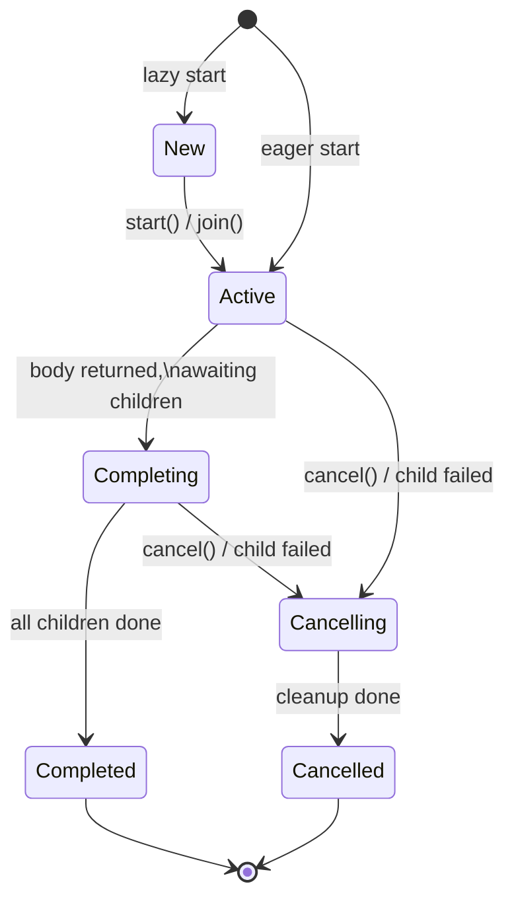
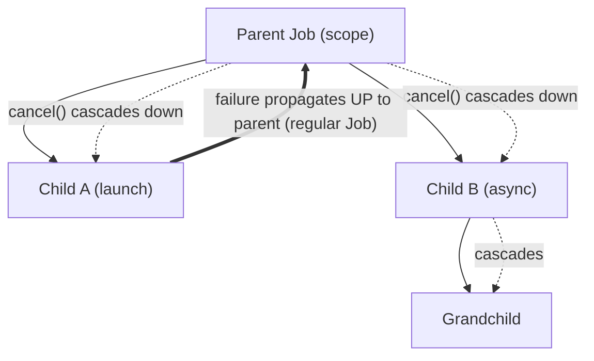
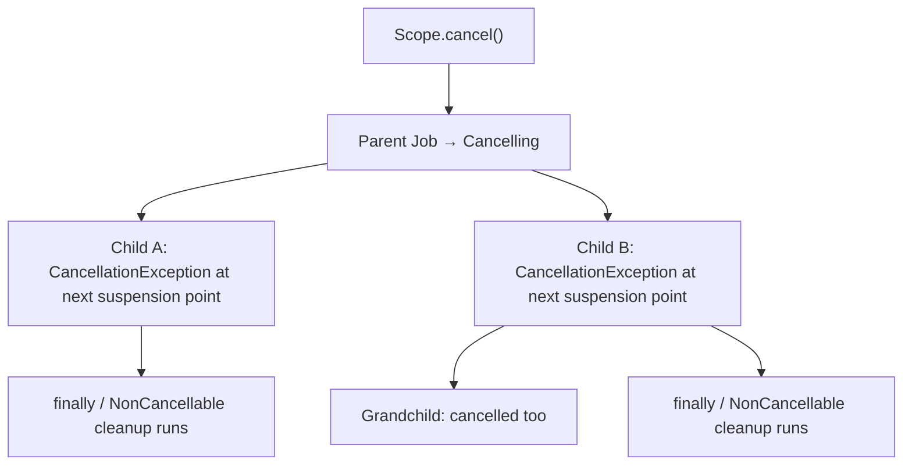

# Coroutines — Internals

Kotlin coroutines are not threads and not green threads in the JVM sense. They are a **compiler transformation** plus a small runtime library. A suspend function is rewritten into a state machine, and "suspension" is just returning a sentinel value up the call stack while parking a callback (a `Continuation`). Everything else — dispatchers, jobs, structured concurrency — is ordinary library code built on top of that one primitive.

This doc is internals-first. Part B (CPS + state machine) is the section that separates a senior answer from a memorized one.

---

## Part A — Basics

### What a coroutine actually is

A coroutine is a **suspendable computation**: a unit of work that can pause at well-defined points and resume later, possibly on a different thread, without blocking the thread while paused. The pause/resume machinery costs no OS thread — a single thread can host thousands of concurrently *suspended* coroutines.

Key distinction:

- **Blocking** (`Thread.sleep`) holds the OS thread hostage.
- **Suspending** (`delay`) releases the thread back to the dispatcher; the coroutine is resumed later via a scheduled callback.

### `suspend` functions

A `suspend` function can call other suspend functions and can suspend. It can only be called from another suspend function or from a coroutine builder. The `suspend` keyword changes the function's signature at the bytecode level (see Part B) — it is not just a marker.

```kotlin
suspend fun fetchUser(id: String): User {
    val profile = api.getProfile(id)   // suspends
    val prefs   = api.getPrefs(id)     // suspends
    return User(profile, prefs)
}
```

Reads top-to-bottom like blocking code, but each `api.*` call may release the thread.

### Builders

| Builder | Returns | Blocks caller? | Use |
|---|---|---|---|
| `launch` | `Job` | No | Fire-and-forget side-effecting work |
| `async` | `Deferred<T>` | No | Concurrent work that produces a result |
| `runBlocking` | `T` | **Yes** | Bridge blocking → suspending (main(), tests) |

```kotlin
val scope = CoroutineScope(Dispatchers.Default)

val job: Job = scope.launch { doWork() }
val deferred: Deferred<Int> = scope.async { compute() }
val result: Int = runBlocking { compute() }   // blocks the current thread
```

!!! warning "`runBlocking` blocks a real thread"
    `runBlocking` parks the calling thread until the coroutine completes. Never call it on the main thread of an Android app or inside another coroutine — it defeats the entire purpose and can deadlock a single-threaded dispatcher.

### Structured concurrency

Every coroutine belongs to a `CoroutineScope` and gets a parent `Job`. This creates a tree:

- A parent does not complete until **all** its children complete.
- Cancelling a parent cancels **all** children.
- A failing child (for `launch`) cancels the parent and its siblings.

The practical payoff: **no leaked coroutines**. When a scope dies, its subtree dies with it. `coroutineScope { }` and `supervisorScope { }` enforce this locally; `viewModelScope`/`lifecycleScope` tie it to Android lifecycles.

```kotlin
suspend fun loadDashboard() = coroutineScope {      // waits for both children
    val user = async { fetchUser() }
    val feed = async { fetchFeed() }
    Dashboard(user.await(), feed.await())
}   // if either throws, the other is cancelled, and loadDashboard rethrows
```

---

## Part B — Internals (the money section)

### Continuation Passing Style (CPS)

The compiler rewrites every `suspend` function to take an extra parameter: a `Continuation`. Conceptually:

```kotlin
// You write:
suspend fun fetchUser(id: String): User

// Compiler emits (roughly):
fun fetchUser(id: String, completion: Continuation<User>): Any?
```

The return type becomes `Any?` because the function can return one of two things:

1. The actual `User` result (if it completed without suspending), **or**
2. The sentinel `COROUTINE_SUSPENDED` (if it suspended and will deliver the result later via `completion.resumeWith(...)`).

That single return-type union is the whole trick. "Suspending" = *returning `COROUTINE_SUSPENDED` up the stack*, which unwinds every frame and frees the thread. "Resuming" = calling `resumeWith` on the saved continuation, which re-enters the state machine at the saved label.

### The `Continuation` interface

```kotlin
public interface Continuation<in T> {
    public val context: CoroutineContext
    public fun resumeWith(result: Result<T>)   // Result = success(T) | failure(Throwable)
}
```

A `Continuation` is a callback that "knows how to continue the rest of the function." It carries the `CoroutineContext` (dispatcher, job, etc.). `resumeWith` takes a `Result`, which is how both normal returns and exceptions flow back through the same channel. `resume(value)` and `resumeWithException(e)` are extension helpers over `resumeWith`.

### The compiler-generated state machine

Each suspend function with N suspension points compiles into one anonymous `ContinuationImpl` subclass with:

- A `label: Int` field — which state (suspension point) we're at.
- Fields for every local variable that must **survive** across a suspension point (spilled onto the continuation object — the "stack" becomes heap fields).
- An `invokeSuspend(result)` method containing a `switch`/`when` over `label`.

Here is a conceptual decompilation of `fetchUser` from Part A:

```kotlin
// CONCEPTUAL decompiled form — illustrative, not exact compiler output.
fun fetchUser(id: String, completion: Continuation<User>): Any? {

    // 1. Reuse or create the state-machine object for this invocation.
    val cont = completion as? FetchUserStateMachine
        ?: FetchUserStateMachine(completion)

    when (cont.label) {
        0 -> {
            cont.label = 1
            cont.id = id                          // spill local for later state
            // getProfile returns COROUTINE_SUSPENDED or a Profile
            val r = api.getProfile(id, cont)       // pass cont as the callback
            if (r == COROUTINE_SUSPENDED) return COROUTINE_SUSPENDED
            cont.profile = r as Profile            // fell through synchronously
            // fall through to state 1 logic below via re-entry
        }
        1 -> {
            // resumed: getProfile's result was delivered into cont.result
            cont.profile = cont.result as Profile
            cont.label = 2
            val r = api.getPrefs(cont.id, cont)
            if (r == COROUTINE_SUSPENDED) return COROUTINE_SUSPENDED
            cont.prefs = r as Prefs
        }
        2 -> {
            cont.prefs = cont.result as Prefs
            return User(cont.profile, cont.prefs)  // final result → resumeWith up-stack
        }
        else -> throw IllegalStateException("call to 'resume' before 'invoke'")
    }
    // ...re-dispatch into the when again after a synchronous fall-through...
}

class FetchUserStateMachine(
    val completion: Continuation<User>
) : ContinuationImpl(completion) {
    var label = 0
    var id: String? = null          // spilled locals
    var profile: Profile? = null
    var prefs: Prefs? = null
    var result: Any? = null         // where resumeWith stashes the incoming value

    override fun invokeSuspend(r: Result<Any?>): Any? {
        this.result = r.getOrThrow()
        return fetchUser(id!!, this)   // re-enter with updated label
    }
}
```

The mechanics to internalize:

1. **One object per invocation.** The `ContinuationImpl` *is* the coroutine's stack frame, moved to the heap. Locals that cross a suspension point are fields ("variable spilling"); locals that don't are cheap JVM stack slots as usual.
2. **`label` is the resume address.** `resumeWith` → `invokeSuspend` → re-enter `fetchUser` → the `when(label)` jumps straight to the next state.
3. **`COROUTINE_SUSPENDED` unwinds the thread.** When a callee returns the sentinel, every caller in the chain also returns it, so the physical thread is released all the way up. No thread is parked at a suspension point.
4. **Fast path is free.** If `getProfile` has its data ready and returns synchronously (never returns the sentinel), there is no allocation of a resume and no thread hand-off — the `when` falls straight through. This is why suspend calls that don't actually suspend are nearly zero-cost.

!!! warning "Variable spilling is a real memory cost"
    Every local alive across a suspension point becomes a field on the continuation object and is kept reachable until resume. Holding a large `Bitmap` or list in a local across a `delay`/network call keeps it on the heap for the whole wait. Scope big objects tightly so they fall out before the suspension point.

!!! note "`suspendCoroutine` / `suspendCancellableCoroutine`"
    These are how you *manually* obtain the continuation to bridge callback APIs. `suspendCancellableCoroutine` is almost always the right one — it wires cancellation so a cancelled coroutine doesn't leak the pending callback. Always prefer it over `suspendCoroutine`.

### `CoroutineContext`

A `CoroutineContext` is an **immutable, indexed set** of `Element`s, keyed by a companion `Key`. It behaves like a persistent map from `Key` → `Element`.

```kotlin
public interface CoroutineContext {
    operator fun <E : Element> get(key: Key<E>): E?           // indexed lookup
    fun <R> fold(initial: R, operation: (R, Element) -> R): R
    operator fun plus(context: CoroutineContext): CoroutineContext
    fun minusKey(key: Key<*>): CoroutineContext

    interface Element : CoroutineContext {
        val key: Key<*>
    }
    interface Key<E : Element>
}
```

Common elements: `Job`, `ContinuationInterceptor` (the dispatcher implements this), `CoroutineName`, `CoroutineExceptionHandler`.

Combination with `+` merges two contexts; on key collision the **right operand wins**:

```kotlin
val ctx = Dispatchers.IO + CoroutineName("loader") + SupervisorJob()
val d: CoroutineDispatcher? = ctx[ContinuationInterceptor] as? CoroutineDispatcher
val name = ctx[CoroutineName]?.name          // "loader"

// right side wins on collision:
val merged = (Dispatchers.IO) + (Dispatchers.Default)
// merged's dispatcher is Default
```

Internally small contexts are a linked `CombinedContext` structure; lookup folds across it by `Key`. Because it's immutable, passing a context around is safe and cheap.

### `Job` — the lifecycle handle

A `Job` is the cancellable, hierarchical handle to a coroutine's lifecycle. Every `launch` returns one; every coroutine has one in its context. Jobs form the parent-child tree of structured concurrency.

State model:

| State | `isActive` | `isCompleted` | `isCancelled` |
|---|---|---|---|
| New (lazy, not started) | false | false | false |
| Active | **true** | false | false |
| Completing (waiting on children) | true | false | false |
| Cancelling | false | false | true |
| Cancelled (final) | false | **true** | **true** |
| Completed (final) | false | **true** | false |



Notes that trip people up:

- **Completing** is an internal transient state: the body finished but the job stays alive until children finish. Externally it still reports `isActive == true`.
- In **Cancelling** and **Cancelled**, `isCancelled == true`, but `isCompleted` only becomes true once cleanup finishes. So a cancelled-but-still-cleaning-up job has `isCancelled == true, isCompleted == false`.
- `isActive` is the flag your cancellation checks should read.

### Parent-child mechanics



- Creating a child registers it with the parent; the parent won't complete until the child does.
- `parent.cancel()` cancels the whole subtree.
- With a **regular `Job`**, a child's *failure* propagates up, cancelling the parent and all siblings.

### `SupervisorJob` vs `Job`

The only behavioral difference is **exception propagation direction for children**.

| | `Job` | `SupervisorJob` |
|---|---|---|
| Child failure cancels parent? | **Yes** | No |
| Child failure cancels siblings? | **Yes** | No |
| Parent cancel cancels children? | Yes | Yes |
| Typical use | Atomic group ("all or nothing") | Independent children (UI event handlers, per-request jobs) |

```kotlin
// Regular Job: one failing child tears down the whole group.
val scope = CoroutineScope(Job())
scope.launch { error("boom") }          // cancels scope + sibling below
scope.launch { doOtherWork() }          // gets cancelled

// SupervisorJob: children fail in isolation.
val ui = CoroutineScope(SupervisorJob() + Dispatchers.Main)
ui.launch { error("boom") }             // this one dies
ui.launch { stillRuns() }               // unaffected
```

!!! warning "Supervision is about the scope's Job, not where you put the handler"
    `supervisorScope { }` and a scope built with `SupervisorJob()` isolate their *direct* children. But a coroutine you `launch` inside a supervised scope still installs a *regular* `Job` for its own subtree — so a failure inside that child still tears down *that child's* grandchildren. Supervision is one level deep, at the supervisor node.

### `Deferred` — a Job with a result

`Deferred<T>` is a `Job` that additionally carries a value. `await()` suspends until it completes, then returns the value or rethrows the failure.

```kotlin
val d: Deferred<Int> = scope.async { compute() }
val v: Int = d.await()      // suspends until done; rethrows if async body threw
```

`await()` on a failed `Deferred` throws at the call site — this is why `async` exceptions surface where you await, not at throw time (see Part F).

For a fixed set of parallel tasks, `awaitAll(d1, d2, ...)` is the idiomatic replacement for calling `.await()` on each `Deferred` individually — same result (all values, in order, once all complete), but it also **fails fast**: if any one of them throws, `awaitAll` cancels the rest immediately instead of waiting for stragglers to finish before you notice the failure.

```kotlin
suspend fun fetchAllUsers(ids: List<String>): List<User> = coroutineScope {
    val deferreds: List<Deferred<User>> = ids.map { id -> async { fetchUser(id) } }
    deferreds.awaitAll()     // fails fast: one throwing cancels the rest immediately
}
```

`awaitAll` requires every `Deferred` to share the same result type `T` (it's `vararg Deferred<T>` or `Collection<Deferred<T>>`, returning `List<T>`) — for a small *fixed* set of differently-typed results (a `Deferred<User>` and a `Deferred<Feed>`), just `await()` each one individually inside `coroutineScope { }`, which already gives you the same fail-fast cancellation via structured concurrency.

---

## Part C — Dispatchers

A dispatcher is a `ContinuationInterceptor` that decides **which thread(s)** a coroutine resumes on. It wraps each continuation so `resumeWith` runs on the right thread.

| Dispatcher | Backing | Default size | Use for |
|---|---|---|---|
| `Main` | Android `Handler` (main Looper) | 1 (the UI thread) | UI updates, touching Views/Compose state |
| `Default` | Shared JVM thread pool | `max(2, ncores)` | CPU-bound work (parsing, sorting, image math) |
| `IO` | Shares Default's pool, elastic | up to 64 (or ncores if larger) | Blocking I/O (disk, network, DB) |
| `Unconfined` | none — resumes on the resuming thread | n/a | Rarely; advanced/testing only |

### `Main`

Handler-based. Every resume posts to the main `Looper`'s message queue. `Dispatchers.Main.immediate` skips the post if you're already on the main thread (avoids a needless re-dispatch and a frame's worth of latency).

### `IO` and `Default` share a pool

Important and non-obvious: **`IO` and `Default` share the same underlying thread pool** (the `CoroutineScheduler`). `Default` is capped at CPU count; `IO` can grow to 64 threads *on top of* that but reuses the same worker pool. Switching between them via `withContext` is cheap and often doesn't hand off to a physically different thread. `IO` is elastic because blocking calls should not starve CPU work — extra threads absorb blocked ones.

### `Unconfined`

Does not confine the coroutine to any thread. It starts in the caller's thread and, after a suspension, resumes on whatever thread called `resumeWith`. Order-of-execution is surprising; use only for tests or specific low-level cases.

### Custom dispatchers and `limitedParallelism`

```kotlin
// Wrap your own executor:
val db = Executors.newFixedThreadPool(4).asCoroutineDispatcher()
// remember to db.close() when done — it owns real threads.

// Preferred modern approach: cap concurrency on a shared pool without a new pool.
val limitedIo = Dispatchers.IO.limitedParallelism(4)   // at most 4 concurrent on IO
```

`limitedParallelism(n)` creates a **view** over the parent dispatcher that lets at most `n` coroutines run concurrently — ideal for rate-limiting a resource (e.g. "max 4 concurrent DB connections") without allocating a separate thread pool.

!!! warning "Don't build a thread pool per screen"
    `newFixedThreadPoolContext` / `asCoroutineDispatcher()` create real OS threads you must `close()`. Leaking them is a classic Android memory/thread leak. For concurrency limits, prefer `Dispatchers.IO.limitedParallelism(n)` over a bespoke pool.

---

## Part D — Builders, internally

### `launch` → `StandaloneCoroutine`

`launch` instantiates a `StandaloneCoroutine` (or `LazyStandaloneCoroutine` when `start = CoroutineStart.LAZY`), registers it as a child of the scope's `Job`, and starts it on the given dispatcher. It's a `Job`, no result. An **uncaught exception** in a `StandaloneCoroutine` is treated as unhandled → propagates to parent / `CoroutineExceptionHandler`.

### `async` → `DeferredCoroutine`, lazy vs eager

`async` instantiates a `DeferredCoroutine`, which is a `Job` that stores the result. Exceptions are **captured** in the deferred and only rethrown on `await()`.

```kotlin
val eager = scope.async { compute() }                 // starts immediately
val lazy  = scope.async(start = CoroutineStart.LAZY) { compute() }
// lazy runs only on first await() or start()
```

### `withContext` — context switch with an undispatched fast-path

`withContext(ctx) { }` runs its block in the current coroutine but with `ctx` merged into the context (typically a dispatcher change), suspends the caller until the block returns, and returns the block's value. It is the idiomatic way to hop threads.

```kotlin
suspend fun loadFile(): String = withContext(Dispatchers.IO) {
    file.readText()           // blocking I/O, safely off the main thread
}   // control returns to the original dispatcher afterward
```

Fast-path: if the target context's dispatcher equals the current one, `withContext` **doesn't re-dispatch** — it runs undispatched, avoiding a thread hand-off. So a redundant `withContext(Dispatchers.Default)` while already on Default is close to free.

### `coroutineScope` vs `supervisorScope`

Both create a child scope and **suspend until all children finish** — but they don't return until the whole subtree is done (unlike `launch`, which returns immediately).

- `coroutineScope { }`: any child failure cancels the scope and rethrows out of `coroutineScope`.
- `supervisorScope { }`: child failures are isolated; the scope survives one child failing.

```kotlin
suspend fun parallelLoad() = coroutineScope {
    val a = async { loadA() }
    val b = async { loadB() }
    a.await() + b.await()
}   // suspends here until both children done; propagates the first failure
```

### `runBlocking` → `BlockingCoroutine`

`runBlocking` creates a `BlockingCoroutine` with an event loop on the current thread. It **blocks that thread**, pumping the coroutine's tasks on it until completion. This is the only builder that bridges the blocking world into the suspending world — hence it's for `main()`, unit tests, and top-of-stack integration, never inside app code on the main thread.

---

## Part E — Cancellation & timeouts

### `cancel()` and `CancellationException`

Cancellation is **cooperative and exception-based**. `job.cancel()` moves the job to Cancelling and, at the next suspension point, the coroutine throws a `CancellationException`. This exception is **special**: the machinery treats it as normal cancellation, not a failure, so it does **not** propagate up as an error.

```kotlin
val job = scope.launch { longWork() }
job.cancel()          // request cancellation
job.join()            // wait for it to finish cleaning up
// or: job.cancelAndJoin()
```

### Cooperative cancellation

A coroutine that never suspends and never checks `isActive` **cannot be cancelled** — cancellation only takes effect at suspension points or explicit checks. All `kotlinx.coroutines` suspending functions (`delay`, `withContext`, `await`, ...) check for cancellation. Tight CPU loops must check themselves:

```kotlin
suspend fun crunch(items: List<Item>) = withContext(Dispatchers.Default) {
    for (item in items) {
        ensureActive()          // throws CancellationException if cancelled
        // — or —
        if (!isActive) return@withContext
        heavyProcess(item)
        yield()                 // also a cancellation point + lets others run
    }
}
```

- `isActive`: boolean check, no throw.
- `ensureActive()`: throws `CancellationException` if not active (preferred — fail fast).
- `yield()`: suspension point that also yields the thread; cancellation-checking.

!!! warning "Swallowing `CancellationException` breaks cancellation"
    A blanket `try { } catch (e: Exception) { }` catches `CancellationException` too, silently killing cooperative cancellation and often leaking the coroutine. Either catch specific exceptions, or rethrow: `catch (e: CancellationException) { throw e }`. In Kotlin, prefer `catch (e: Exception)` only when you rethrow `CancellationException` explicitly.

### `withContext(NonCancellable)`

Cleanup work that must run even during cancellation (closing a file, emitting a final analytics event) must be shielded, because a cancelled coroutine can't suspend normally anymore:

```kotlin
suspend fun writeThenClose() {
    try {
        stream.write(data)      // may suspend
    } finally {
        withContext(NonCancellable) {
            stream.flushAndClose()   // guaranteed to run to completion
        }
    }
}
```

### `withTimeout` / `withTimeoutOrNull`

```kotlin
// throws TimeoutCancellationException on timeout:
val r = withTimeout(2_000) { fetch() }

// returns null on timeout instead of throwing:
val r2 = withTimeoutOrNull(2_000) { fetch() }
```

`TimeoutCancellationException` is a subclass of `CancellationException`, so a timeout cancels the block cooperatively. `withTimeoutOrNull` is the ergonomic choice when a timeout is an expected, non-exceptional outcome.

### Propagation



Cancellation flows **down** the tree. Each coroutine gets its `CancellationException` at its next suspension/check, runs its `finally` blocks (shielded by `NonCancellable` if needed), and completes into the Cancelled state.

---

## Part F — Exception handling

### The core rule: `launch` vs `async`

| | `launch` | `async` |
|---|---|---|
| When does the exception surface? | **Immediately**, at throw time | **On `await()`** |
| How to handle | `CoroutineExceptionHandler` or try/catch inside | try/catch around `await()` |
| Uncaught behavior | Propagates to parent → handler → (crash) | Stored in `Deferred`; lost if never awaited* | 

\* With a regular `Job`, an `async` failure *also* propagates to the parent even before `await`, because it cancels the parent. With a `SupervisorJob`/root async, it's held until `await`.

```kotlin
// launch: throws propagate up now
scope.launch { throw IOException() }     // handled by CoroutineExceptionHandler

// async: throw is deferred to await
val d = scope.async { throw IOException() }
try {
    d.await()                            // <-- exception thrown HERE
} catch (e: IOException) { /* handle */ }
```

### `CoroutineExceptionHandler`

A context element that acts as a **last-resort** handler for *uncaught* exceptions. It is invoked **only for `launch`-style root coroutines** — never for `async` (which routes through `await`), and never for a non-root coroutine (the exception propagates to the parent first).

```kotlin
val handler = CoroutineExceptionHandler { context, throwable ->
    log.e("Uncaught in ${context[CoroutineName]}", throwable)
}

// Install at the ROOT scope/coroutine, not on a child:
val scope = CoroutineScope(SupervisorJob() + Dispatchers.Default + handler)
scope.launch { riskyWork() }          // handler catches uncaught failures

// This does NOTHING — handler on a child is ignored:
scope.launch(handler) { }             // (unless this launch is itself the root)
```

!!! warning "Handler placement is the #1 gotcha"
    A `CoroutineExceptionHandler` only fires when installed on the **root coroutine's** context (the scope, or the outermost `launch`). Put it on a nested `launch`/`async` and it's silently ignored — the exception propagates to the parent instead. Also: it cannot *recover* — by the time it runs, the coroutine is already failing. For recoverable errors, use try/catch inside the coroutine.

### try/catch inside the coroutine

The most local, most predictable option — a plain `try/catch` around the suspending call handles the error right there and never involves propagation. Preferred for expected, recoverable failures.

### `SupervisorJob` isolation (recap in exception terms)

Under a `SupervisorJob`/`supervisorScope`, a failing child does **not** cancel siblings or the parent — its exception is handled by its own `CoroutineExceptionHandler` (for `launch`) or held in its `Deferred` (for `async`). This is exactly what you want for a screen where each independent UI action can fail without nuking the others.

---

## Part G — Scopes

A `CoroutineScope` is just a holder for a `CoroutineContext` (which always contains a `Job`). Its purpose is to bound the lifetime of coroutines. Structured concurrency = "coroutines live and die with their scope."

### `GlobalScope` — avoid

```kotlin
// DON'T:
GlobalScope.launch { syncData() }
```

`GlobalScope` is a scope with **no parent Job** and application lifetime. Coroutines launched in it:

- Are **not** cancelled when your screen/ViewModel dies → leaks.
- Are **not** part of any structured tree → orphaned work, no error propagation to a real owner.
- Make tests non-deterministic.

Use it essentially never in app code. If you need an app-lifetime scope, create a named one (`CoroutineScope(SupervisorJob() + Dispatchers.Default)`) you own and can reason about.

### `CoroutineScope()` factory

```kotlin
val scope = CoroutineScope(SupervisorJob() + Dispatchers.Main + CoroutineName("player"))
// ...
scope.cancel()   // cancels everything you launched in it
```

Note: the `CoroutineScope(...)` **factory function** adds a `Job` for you if the context doesn't include one — distinct from the `CoroutineScope` interface.

### Android lifecycle scopes

| Scope | Bound to | Dispatcher | Cancelled when |
|---|---|---|---|
| `viewModelScope` | `ViewModel` | `Main.immediate` + `SupervisorJob` | `onCleared()` |
| `lifecycleScope` | `Lifecycle` (Activity/Fragment) | `Main.immediate` + `SupervisorJob` | lifecycle `DESTROYED` |

Both use a `SupervisorJob` so one failed job doesn't tear down the rest, and both auto-cancel — this is why you almost never manage cancellation manually on Android. Pair with `repeatOnLifecycle`/`flowWithLifecycle` for flow collection tied to `STARTED`.

### A custom scope (the pattern to remember)

```kotlin
class SyncManager(
    private val io: CoroutineDispatcher = Dispatchers.IO
) {
    // SupervisorJob: one failing sync doesn't cancel the others.
    // Named + handler: observable failures. Own dispatcher: testable.
    private val handler = CoroutineExceptionHandler { _, e ->
        Log.e("SyncManager", "sync failed", e)
    }
    private val scope = CoroutineScope(
        SupervisorJob() + io + CoroutineName("sync") + handler
    )

    fun start() {
        scope.launch { syncA() }
        scope.launch { syncB() }
    }

    fun shutdown() {
        scope.cancel()   // structured teardown — all children cancelled
    }
}
```

This is the canonical "I own a component with background work" shape: `SupervisorJob` for isolation, an injectable dispatcher for testability, a name + handler for observability, and an explicit `cancel()` for teardown.

---

## Part H — `select` expression

`select { }` suspends until **the first** of several clauses becomes available, then runs that clause and abandons the rest. It's the coroutine analog of a "whichever finishes first" race — used for timeouts, first-response-wins, and multiplexing channels.

```kotlin
suspend fun fastestOf(a: Deferred<String>, b: Deferred<String>): String =
    select {
        a.onAwait { it }        // whichever Deferred completes first
        b.onAwait { it }
    }

// Multiplexing channels + a timeout:
suspend fun receiveFirst(c1: ReceiveChannel<Int>, c2: ReceiveChannel<Int>): Int =
    select {
        c1.onReceive { it }
        c2.onReceive { it }
        onTimeout(1_000) { -1 }
    }
```

Available clauses include `Deferred.onAwait`, `Channel.onReceive` / `onSend`, `Job.onJoin`, and `onTimeout`. `select` picks the first ready clause; if several are ready it picks by declaration order (with `selectUnbiased` for fairness). Remember: losing `Deferred`s are **not** auto-cancelled — cancel them yourself if the race's losers should stop (typically by running the `select` inside a `coroutineScope` and cancelling on exit).

!!! note "When to reach for `select`"
    Most "race" needs are better served by `withTimeoutOrNull` (deadline) or `merge`/`flatMapMerge` on `Flow` (fan-in). Reach for raw `select` when you genuinely multiplex heterogeneous events (multiple channels + a timeout + a job completion) in one suspension point.

---

## Interview Q&A

**1. Explain what actually happens at a suspension point, at the bytecode level.**
The compiler rewrites the suspend function into a state-machine class (a `ContinuationImpl`) with a `label` field and spilled locals. Calling a suspend function passes a `Continuation`. If the callee can't produce a result yet, it returns the sentinel `COROUTINE_SUSPENDED`, which every caller also returns — unwinding and freeing the physical thread. When the awaited work finishes, it calls `continuation.resumeWith(result)`, which re-enters `invokeSuspend`, and the `when(label)` jumps to the next state. So "suspending" is returning a sentinel up the stack while parking a callback; "resuming" is invoking that callback to re-enter the state machine.
*Follow-up:* Why is the return type `Any?` and not the declared type? — Because the function returns a union of the real result *or* `COROUTINE_SUSPENDED`; `Any?` is the only common supertype. The declared type is recovered by the compiler-generated cast on the fast path.

**2. What's the real difference between `Job` and `SupervisorJob`?**
Only the direction of child-failure propagation. Under a regular `Job`, a child failure cancels the parent and all siblings (all-or-nothing). Under a `SupervisorJob`, children fail in isolation — a failing child neither cancels the parent nor its siblings. In both, cancelling the parent still cancels all children. `viewModelScope`/`lifecycleScope` use `SupervisorJob` so one failed job doesn't nuke the screen.
*Follow-up:* Does `supervisorScope` make *all* descendants independent? — No. Supervision is one level deep: it isolates the scope's *direct* children. Each of those children still runs a regular `Job` for its own subtree, so a grandchild failure still cancels that child's subtree.

**3. Why did my `CoroutineExceptionHandler` never fire?**
Because it only runs for **uncaught exceptions in root `launch` coroutines** and must be installed on the root's context (the scope or the outermost `launch`). Installed on a nested `launch`/`async`, it's ignored — the exception propagates to the parent instead. And it never fires for `async`, where exceptions are stored in the `Deferred` and rethrown at `await()`. For recoverable errors use try/catch inside the coroutine.
*Follow-up:* Where should it go for a ViewModel? — On the scope, but usually you don't need one: `viewModelScope` already has a `SupervisorJob`, and you handle errors with try/catch or by turning them into UI state. The handler is a last-resort logger, not a recovery mechanism.

**4. My coroutine ignores `cancel()`. Why, and how do I fix it?**
Cancellation is cooperative — it only takes effect at suspension points or explicit checks. A tight CPU loop with no `delay`/`yield`/suspend call and no `isActive`/`ensureActive()` check runs to completion despite `cancel()`. Fix by adding `ensureActive()` or `yield()` in the loop (or checking `isActive`). Also make sure you aren't swallowing `CancellationException` in a broad `catch (e: Exception)` — always rethrow it.
*Follow-up:* How do you guarantee cleanup runs during cancellation? — Put it in a `finally` block, and if the cleanup itself suspends, wrap it in `withContext(NonCancellable)`, because a cancelled coroutine can't suspend normally anymore.

**5. `Dispatchers.IO` vs `Dispatchers.Default` — how are they related, and when do you use each?**
`Default` targets CPU-bound work, sized to `max(2, ncores)`. `IO` targets blocking I/O and is elastic up to 64 threads. Crucially they **share the same underlying thread pool** (`CoroutineScheduler`); `IO` is allowed to spin up extra threads so blocking calls don't starve CPU work, and switching between them via `withContext` is cheap (often no physical thread hand-off). Use `Default` for parsing/sorting/math, `IO` for disk/network/DB. To bound concurrency on a resource, use `Dispatchers.IO.limitedParallelism(n)` rather than a bespoke pool.
*Follow-up:* What does `withContext(Dispatchers.Default)` cost if you're already on Default? — Almost nothing: `withContext` has an undispatched fast-path that skips re-dispatch when the target dispatcher equals the current one.

**6. Contrast exception behavior of `launch` and `async`.**
`launch` treats a thrown exception as immediately uncaught: it propagates to the parent and ultimately the `CoroutineExceptionHandler` (or crashes). `async` **captures** the exception in its `Deferred` and rethrows it at `await()` — so you catch it around `await`, not at throw time. Caveat: under a regular `Job`, an `async` failure also cancels the parent (structured concurrency) even before you await; under a `SupervisorJob` or a root/`GlobalScope` async it's held until `await` and lost if never awaited.
*Follow-up:* How do you run two calls concurrently and handle either failing? — Wrap in `coroutineScope { }`, `async` both, and `await()` inside a try/catch. If one throws, `coroutineScope` cancels the other and rethrows out of the block — a single, structured failure path.

**7. How do you implement a `debounce` operator using Coroutines?**
A `debounce` operator delays the emission of a value until a specified quiet period (e.g. 300 ms) has elapsed without any new values. Using raw coroutines, you can implement it by cancelling and restarting a delay job on each emission:
```kotlin
fun <T> Flow<T>.debounce(waitMs: Long): Flow<T> = channelFlow {
    var searchJob: Job? = null
    collect { value ->
        searchJob?.cancel() // cancel the previous delayed emission
        searchJob = launch {
            delay(waitMs)
            send(value) // emit only if waitMs passes without cancellation
        }
    }
}
```
*Follow-up:* What's the difference between this manual implementation and the built-in `Flow.debounce`? — Under the hood, `Flow.debounce` is highly optimized and uses `select { }` with a timer clause (`onTimeout`) rather than spawning a new child coroutine job per element, reducing allocation overhead.

**8. Write a Kotlin code snippet demonstrating how to run two coroutines in series and parallel.**
To run two operations in **series** (sequentially), call their suspending functions in sequence within a coroutine:
```kotlin
suspend fun loadSequentially(): Result = coroutineScope {
    val resultA = makeNetworkCallA()         // suspends until A is done
    val resultB = makeNetworkCallB(resultA)  // suspends until B is done
    Result(resultA, resultB)
}
```
To run them in **parallel** (concurrently), use the `async` builder and await their results together:
```kotlin
suspend fun loadConcurrently(): Result = coroutineScope {
    val deferredA = async { makeNetworkCallA() } // starts A immediately
    val deferredB = async { makeNetworkCallB() } // starts B immediately
    Result(deferredA.await(), deferredB.await()) // suspends until both finish
}
```
*Follow-up:* What happens in the parallel snippet if `makeNetworkCallA()` fails? — Because both are children under `coroutineScope`, a failure in child `deferredA` immediately cancels the scope, which in turn cancels sibling `deferredB` and propagates the exception out of the block, preventing a leaked task.

