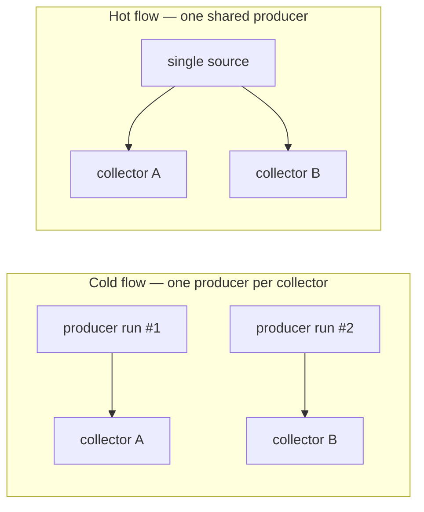
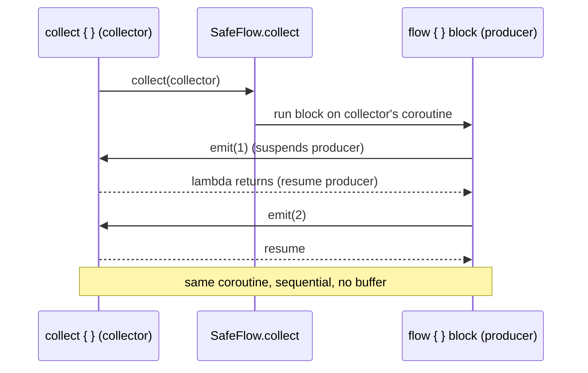

# Flow — Internals

Kotlin `Flow` is a cold, sequential stream of values built entirely on top of suspending functions and structured concurrency. There is no thread, no scheduler, and no reactive machinery hidden inside a plain `Flow` — it is a suspend lambda that calls back into a collector. Everything else (hot streams, buffering, context switching) is layered on top of that one primitive. This page works from the surface API down to the implementation, then back up through the hot variants, operators, channels, and testing.

!!! abstract "What a senior is expected to know"
    - Why a `Flow` re-runs its producer for every collector (cold), and exactly where that producer runs.
    - The `emit`/`collect` contract and the *context preservation* rule that `flowOn` exists to bend.
    - How `StateFlow` conflates, dedups by `equals`, and why `WhileSubscribed(5000)` is the ViewModel default.
    - `SharedFlow` replay/buffer/overflow knobs and why `replay=0` beats `SingleLiveEvent`.
    - `flatMapLatest`, `combine` vs `zip`, `debounce` vs `sample`, and channel capacities.

---

## Part A — Flow basics

### What Flow is

A `Flow<T>` is a declarative description of an asynchronous sequence. Nothing runs until a **terminal operator** (usually `collect`) is called, and `collect` is a `suspend` function — so a flow can only be consumed from inside a coroutine. Between producer and consumer sit **intermediate operators** (`map`, `filter`, …) that are themselves lazy: they wrap the upstream flow and return a new flow without touching data.

```kotlin
val numbers: Flow<Int> = flow {          // cold: this block is the producer
    for (i in 1..3) {
        delay(100)                        // suspending work is fine
        emit(i)                           // push a value downstream
    }
}

// nothing has happened yet
numbers
    .map { it * 10 }                      // still lazy
    .collect { println(it) }              // NOW the producer runs: 10, 20, 30
```

### Cold vs hot

| | Cold (`Flow`, `flow{}`) | Hot (`StateFlow`, `SharedFlow`, channels) |
|---|---|---|
| Producer runs | Once **per collector**, on `collect` | Independently of collectors |
| Values | Regenerated for each collector | Broadcast to all current collectors |
| Missed values | Impossible (starts fresh) | Possible (emitted while nobody collects) |
| Backpressure | Natural via suspension | Needs a buffer / conflation strategy |
| Analogy | A function you can call | A live radio broadcast |

A cold flow is *pull-like*: the consumer drives it and each consumer gets its own private run. A hot flow is *push-like*: the source emits whether or not anyone listens.



### Builders

```kotlin
flow { emit(1); emit(2) }                 // general purpose, can suspend
flowOf(1, 2, 3)                           // fixed set of values
listOf(1, 2, 3).asFlow()                  // adapt a collection / sequence / range
(1..100).asFlow()
channelFlow { send(1); send(2) }          // producer may emit from other coroutines
callbackFlow { /* bridge a callback API */ }
```

`flow{}` is the workhorse. `channelFlow`/`callbackFlow` exist for the cases `flow{}` forbids (see Part F: concurrent emission).

### Terminal operators

```kotlin
flow.collect { value -> ... }             // the fundamental terminal; suspends until done
flow.toList()  / .toSet()                 // collect into a collection
flow.first()   / .first { pred }          // take one, then cancel upstream
flow.single()                             // exactly one value or throw
flow.reduce { a, b -> a + b }             // fold without initial
flow.fold(0) { acc, x -> acc + x }
flow.count() / .last()
flow.launchIn(scope)                      // collect in a scope, non-blocking (Part F)
```

`first()` is worth internalizing: it collects until the first value, then throws a special `AbortFlowException` internally to cancel the rest of the producer — a normal, expected control-flow mechanism, not an error.

---

## Part B — Flow internals

### The two interfaces

The entire cold-flow machinery is two interfaces:

```kotlin
public interface Flow<out T> {
    public suspend fun collect(collector: FlowCollector<T>)
}

public interface FlowCollector<in T> {
    public suspend fun emit(value: T)
}
```

That is the whole contract. `Flow.collect` is given a `FlowCollector`; the producer calls `collector.emit(value)` for each element. `collect { }` with a lambda is sugar — the lambda *becomes* the `emit` implementation:

```kotlin
// flow.collect { println(it) } desugars to roughly:
flow.collect(object : FlowCollector<Int> {
    override suspend fun emit(value: Int) { println(value) }
})
```

Because both functions are `suspend`, the producer and the collector run on the **same coroutine, in lockstep**. `emit` suspends the producer until the collector's body returns. There is no queue, no thread hop, no lost value — that is why cold flows have natural backpressure for free.

### The `flow {}` builder

`flow { }` returns a `SafeFlow`, whose `collect` simply runs your `block` with the incoming collector as receiver:

```kotlin
// Conceptually:
public fun <T> flow(block: suspend FlowCollector<T>.() -> Unit): Flow<T> =
    SafeFlow(block)

private class SafeFlow<T>(private val block: suspend FlowCollector<T>.() -> Unit) : Flow<T> {
    override suspend fun collect(collector: FlowCollector<T>) {
        // block runs with a SAFE wrapper around `collector`
        SafeCollector(collector, coroutineContext).block()
    }
}
```

Each `collect` call executes `block` again from scratch — **this is why cold flows have one producer per collector.** No shared state between collections unless you capture it yourself.

### Exception transparency & `SafeCollector`

`flow{}` enforces **exception transparency**: a flow must not "leak" downstream exceptions and must not emit from the wrong coroutine context. The `SafeCollector` wrapper checks, on every `emit`, that the emitting coroutine is the same one that started `collect`. Violating this throws:

> Flow invariant is violated: Emission from another coroutine is detected…

This is what stops you from doing `withContext(IO) { emit(x) }` inside `flow{}` — emission must stay on the collector's coroutine. To move the *producer* to another dispatcher, use `flowOn` (Part E/F); to emit from another coroutine legitimately, use `channelFlow`.

!!! warning "Don't catch-and-swallow inside `flow{}`"
    Wrapping `emit` in a `try/catch` that also catches downstream exceptions breaks exception transparency (a downstream `collect` failure would be caught by the producer). Use the `catch` operator (Part G) instead, which is transparent by construction.



---

## Part C — StateFlow

### Basics

`StateFlow` is a **hot, conflated, state-holder** flow that always has exactly one current value. It is the idiomatic replacement for `LiveData` in a ViewModel.

```kotlin
private val _state = MutableStateFlow(UiState.Loading)   // must have an initial value
val state: StateFlow<UiState> = _state.asStateFlow()      // read-only view

_state.value = UiState.Content(items)                     // synchronous set
_state.update { it.copy(loading = false) }                // atomic read-modify-write
```

A new collector **immediately** receives the current value, then every subsequent change.

### Internals

- **Always has a value.** Construction requires an initial value; `.value` is a plain property backed by an atomic reference — reading it never suspends.
- **Conflation.** `StateFlow` keeps only the latest value (`replay = 1`, buffer conflated). A slow collector that falls behind skips intermediate values and jumps to the newest. You are guaranteed the *latest*, not *every*, value.
- **Distinct by `equals`.** Setting `.value` to something `equals` the current value is a **no-op** — no emission. This built-in `distinctUntilChanged` is why you should use immutable data classes for state: structural equality drives dedup. (Corollary: mutating a list in place and reassigning the same reference emits nothing.)
- **Thread-safety.** `.value` set/get and `update{}` are safe from any thread; `update{}` uses a CAS loop so it's atomic under contention.
- **Subscriber management (slots).** Internally, `StateFlowImpl` maintains an array of "slots", one per active collector, each holding an index/continuation. On `emit`/`value` change it bumps a sequence number and resumes any suspended collector slots. Slots are pooled and reused, so adding/removing collectors is cheap and allocation-light.

### `.value`

`StateFlow.value` gives you synchronous, non-suspending access to the current state — useful in event handlers where you can't collect. `MutableStateFlow.value` is also a setter. Prefer `update{}` over `value =` when the new value depends on the old one, to avoid lost updates from concurrent writers.

### StateFlow vs LiveData

| | StateFlow | LiveData |
|---|---|---|
| Library | Coroutines (pure Kotlin, multiplatform) | Android (androidx.lifecycle) |
| Initial value | **Required** | Optional (nullable until set) |
| Lifecycle-aware | No (use `repeatOnLifecycle`) | Yes (built in) |
| Threading | Any thread; emits on collector context | Main thread for `setValue` |
| Operators | Full Flow operator set | Almost none (`map`, `switchMap`) |
| Backpressure/conflation | Conflated by design | Conflated by design |
| Distinct | Yes, by `equals` | No (re-emits equal values) |

The main migration gotcha: `LiveData` stops delivering when the view is stopped for free; `StateFlow` does not, so you must collect with `repeatOnLifecycle(STARTED)` (or `flowWithLifecycle`) to avoid updating a backgrounded UI.

### StateFlow in the ViewModel: `stateIn` + `WhileSubscribed(5000)`

The canonical pattern converts a cold upstream (e.g. a Room/repository flow) into a hot `StateFlow` scoped to the ViewModel:

```kotlin
val uiState: StateFlow<UiState> =
    repository.observeItems()                 // cold Flow<List<Item>>
        .map { UiState.Content(it) }
        .stateIn(
            scope = viewModelScope,
            started = SharingStarted.WhileSubscribed(5_000),
            initialValue = UiState.Loading
        )
```

- **`stateIn`** launches one shared collection of the upstream in `viewModelScope` and multicasts the latest value to all UI collectors — the expensive upstream (DB query, network) runs *once*, not once per collector.
- **`WhileSubscribed(5000)`** keeps the upstream active only while there is ≥1 subscriber, and **waits 5000 ms after the last one leaves** before stopping.

!!! tip "Why 5000 ms specifically?"
    It outlasts a configuration change. On rotation the old collector unsubscribes and the new one subscribes a few hundred ms later. A 5-second grace window means the upstream flow (and its DB cursor / network call) is **not** torn down and restarted across the rotation — the new UI re-attaches to the still-running collection and gets the cached value instantly. Too short (e.g. `Eagerly`/`Lazily`) wastes work or never stops; `WhileSubscribed(0)` restarts on every rotation. 5 s is the community-standard sweet spot balancing "don't do work when the screen is gone" against "don't thrash on rotation."

| `SharingStarted` | Upstream starts | Upstream stops |
|---|---|---|
| `Eagerly` | Immediately, on `stateIn` call | Only when scope cancels |
| `Lazily` | On first subscriber | Only when scope cancels |
| `WhileSubscribed(stopTimeoutMillis, replayExpiration)` | On first subscriber | `stopTimeout` ms after last subscriber leaves |

---

## Part D — SharedFlow

### Basics

`SharedFlow` is the general-purpose hot broadcast primitive; `StateFlow` is actually a specialized `SharedFlow` (replay=1, conflated, distinct). Use `SharedFlow` when you need events, multiple replay, or no initial value.

```kotlin
private val _events = MutableSharedFlow<UiEvent>()        // replay=0 by default
val events: SharedFlow<UiEvent> = _events.asSharedFlow()

suspend fun send(e: UiEvent) = _events.emit(e)            // may suspend if buffer full
fun tryPost(e: UiEvent): Boolean = _events.tryEmit(e)     // non-suspending, returns success
```

### Internals

`MutableSharedFlow(replay, extraBufferCapacity, onBufferOverflow)` is backed by a single circular buffer shared across all collectors, plus per-collector slots that track each subscriber's read index.

- **`replay`** — how many most-recent values a *new* collector receives on subscription. `replay=0` → new collectors only see future emissions.
- **`extraBufferCapacity`** — buffer slots *beyond* replay, used to let `emit` proceed without suspending when collectors are slow.
- **Total buffer** = `replay + extraBufferCapacity`.
- **`onBufferOverflow`** — what happens when a value is emitted and the buffer is full **and** at least one collector hasn't consumed the oldest slot:

| `BufferOverflow` | Behavior when buffer full | `emit` suspends? |
|---|---|---|
| `SUSPEND` (default) | Producer waits for space | Yes |
| `DROP_OLDEST` | Evict oldest buffered value, keep new | No |
| `DROP_LATEST` | Discard the value being emitted | No |

!!! note "`tryEmit` and overflow interact"
    `tryEmit` can only succeed without suspending. With `onBufferOverflow = SUSPEND` and a full buffer, `tryEmit` returns `false`. With `DROP_OLDEST`/`DROP_LATEST` it always succeeds (it drops instead of suspending) — which is exactly what you want for fire-and-forget event posting.

- **Subscriber slots.** Like `StateFlow`, each collector gets a slot with an index into the shared buffer. The buffer's head advances only when the *slowest* required collector has consumed a slot (under `SUSPEND`), which is how backpressure propagates to the emitter.

### SharedFlow vs StateFlow

| | StateFlow | SharedFlow |
|---|---|---|
| Initial value | Required | None |
| Replay | Always 1 | Configurable (0..n) |
| Conflation / distinct | Yes, by `equals` | No (every emission delivered, unless you configure overflow) |
| `.value` accessor | Yes | No |
| Best for | Observable **state** | **Events** / streams / multi-replay |
| Equal consecutive values | Dropped | Delivered |

Key trap: because `StateFlow` drops equal values, it's wrong for events where the same event can legitimately fire twice (e.g. "show toast" twice). Use `SharedFlow(replay=0)`.

### SharedFlow as an event bus — and why it beats `SingleLiveEvent`

```kotlin
class MyViewModel : ViewModel() {
    private val _events = MutableSharedFlow<UiEvent>(
        replay = 0,                           // events are not replayed to late subscribers
        extraBufferCapacity = 1,              // lets tryEmit succeed without a collector
        onBufferOverflow = BufferOverflow.DROP_OLDEST
    )
    val events = _events.asSharedFlow()

    fun onSaveClicked() {
        _events.tryEmit(UiEvent.NavigateBack) // fire-and-forget, never suspends
    }
}

// UI
lifecycleScope.launch {
    repeatOnLifecycle(Lifecycle.State.STARTED) {
        viewModel.events.collect { event -> handle(event) }
    }
}
```

Why this is superior to the old `SingleLiveEvent` hack:

- **`SingleLiveEvent` only supports one observer** — a second observer silently gets nothing. `SharedFlow` correctly multicasts to every active collector.
- `SingleLiveEvent` relied on a fragile "has been handled" boolean to prevent redelivery on rotation. With `replay=0`, a `SharedFlow` structurally never redelivers past events to a re-subscribing collector — combined with `repeatOnLifecycle`, events emitted while the UI is stopped are simply not delivered (and, with `DROP_OLDEST` + buffer, not lost to a full-buffer suspension either, depending on your policy).
- It's plain Kotlin, testable, and composes with the full operator set.

---

## Part E — Operators

### Intermediate operators

```kotlin
flow.map { it * 2 }                       // transform each value
flow.filter { it > 0 }                    // keep matching
flow.transform { emit(it); emit(it * 10) }// 0..n emissions per input (map+filter generalized)
flow.take(3)                              // first 3, then cancel upstream
flow.drop(2)                              // skip first 2
flow.distinctUntilChanged()               // suppress consecutive duplicates (by equals, or selector)
flow.onEach { log(it) }                   // side effect, passes value through
flow.runningReduce { a, b -> a + b }      // emit running accumulation
```

`transform` is the primitive the others are built on — `map`/`filter` are just constrained `transform`s.

### flatMap family

Used when each value maps to *another flow* that must be flattened. The difference is entirely in **concurrency and cancellation**:

| Operator | Inner flows | Order preserved? | On new value | Use for |
|---|---|---|---|---|
| `flatMapConcat` | One at a time (sequential) | Yes | Waits for current inner to finish | Ordered, dependent requests |
| `flatMapMerge` | Concurrent (up to `concurrency`) | No (interleaved) | Starts new inner alongside others | Parallel independent work |
| `flatMapLatest` | One; **cancels** previous | N/A | Cancels current inner, starts new | Search / latest-wins |

```kotlin
// flatMapLatest: every keystroke cancels the in-flight search
searchQuery                                   // Flow<String> from a text field
    .debounce(300)                            // wait for a 300 ms pause
    .filter { it.length >= 2 }
    .distinctUntilChanged()
    .flatMapLatest { query ->                 // new query => cancel previous request
        repository.search(query)              // returns Flow<List<Result>>
    }
    .catch { emit(emptyList()) }
    .collect { results -> render(results) }
```

`flatMapLatest`'s cancellation is the whole point: when the upstream emits a new value, the coroutine running the previous inner flow is **cancelled** (cooperatively — the network call is aborted at the next suspension point). This guarantees the collector only ever renders results for the most recent query, eliminating out-of-order/stale responses.

### combine vs zip

Both merge two flows, but pairing differs:

- **`zip`** pairs values **positionally**: it waits for *both* flows to produce their *n*-th value, then emits the pair. Completes when either flow completes. Strict lockstep.
- **`combine`** emits whenever **either** flow emits, pairing the newest value from each. It needs *both* to have emitted at least once before the first output, then re-emits on every change from either side.

```kotlin
val a = flowOf(1, 2, 3)
val b = flowOf("a", "b")

a.zip(b) { x, y -> "$x$y" }        // 1a, 2b        (stops at shorter)
a.combine(b) { x, y -> "$x$y" }    // e.g. 3a, 3b   (latest-of-each; timing-dependent)
```

`combine` is what you want for UI state assembled from several independent sources ("username OR password changed → recompute button-enabled"). `zip` is for correlating two streams that advance together.

### Rate-limiting: conflate, debounce, sample

```kotlin
flow.conflate()                 // drop intermediate values if collector is slow; keep latest
flow.debounce(300)              // emit only after 300 ms of SILENCE (no new upstream value)
flow.sample(1000)               // emit the latest value every 1000 ms (periodic snapshot)
```

- **`conflate`** — backpressure by dropping: never blocks the producer, collector always gets the most recent value it can.
- **`debounce`** — "settle" detector: good for search-as-you-type; emits when the user *pauses*. Bursty input → one output at the end of the burst.
- **`sample`** — periodic sampler: good for high-frequency sources (sensor, location) where you want a value every N ms regardless of burst pattern. Emits on a fixed clock, not on silence.

Debounce vs sample in one line: **debounce fires on a gap; sample fires on a timer.**

### buffer

```kotlin
flow.buffer(capacity = 64)      // run producer and collector concurrently
```

`buffer` breaks the lockstep: the producer emits into a channel-backed buffer and keeps going while the collector processes at its own pace, running them on separate coroutines. This speeds up pipelines where production and consumption are both slow (they overlap instead of alternating). `conflate` and `flowOn` both introduce a buffer implicitly.

### flowOn internals

By default a flow runs entirely on the collector's coroutine/context (Part F). `flowOn(context)` changes the context of everything **upstream** of it — and nothing downstream.

```kotlin
flow { /* heavy work, DB, parsing */ emit(x) }   // runs on Dispatchers.IO
    .map { transform(it) }                        // runs on Dispatchers.IO
    .flowOn(Dispatchers.IO)                       // boundary: upstream -> IO
    .map { render(it) }                           // runs on the COLLECTOR's context (e.g. Main)
    .collect { updateUi(it) }                     // collector context
```

How it works internally:

- `flowOn` returns a **`ChannelFlow`** (specifically a fused `ChannelFlowOperatorImpl`). It launches the upstream in a *new coroutine* on the requested `context`, and that coroutine's `emit` writes into a **channel**. The downstream reads from that channel on the original collector context.
- So `flowOn` inserts a **channel + a coroutine + a context switch**, and consequently a buffer. Because emission crosses coroutines through a channel, it does **not** violate exception transparency (the channel is the sanctioned bridge).
- **It only affects upstream.** Operators *after* `flowOn` still run on the collector's context. Multiple `flowOn` calls create multiple segments, each on its own context — they compose left-to-right over the upstream.
- Adjacent `flowOn`/`buffer` operators are **fused** so you don't pay for redundant channels.

```mermaid
flowchart LR
    subgraph IO["Dispatchers.IO (new coroutine)"]
        A[flow { } producer] --> B[map transform]
    end
    B -->|channel / buffer| X((flowOn boundary))
    subgraph Main["collector context e.g. Main"]
        X --> C[map render] --> D[collect updateUi]
    end
```

!!! danger "`withContext` inside `flow{}` is wrong; `flowOn` is right"
    Wrapping `emit` in `withContext(IO)` throws the "emission from another coroutine" error. Move the upstream instead with `flowOn(Dispatchers.IO)`.

---

## Part F — Context & concurrency

### Context preservation

The core rule: **`emit` must happen on the same coroutine that runs `collect`.** A flow is *context-preserving* — the collector controls the execution context, and the producer inherits it. This is what makes flows composable and predictable, and it's why `SafeCollector` polices emission.

Consequences:

- You cannot `emit` from inside a `launch`/`async`/`withContext` block nested in `flow{}`. Use `channelFlow { send(...) }` when you genuinely need concurrent emission from multiple coroutines.
- To change *where the producer runs*, don't touch `emit` — declare it with `flowOn`.

### launchIn

`collect` suspends the calling coroutine until the flow completes, which is awkward for fire-and-forget UI collection. `launchIn(scope)` is sugar for `scope.launch { flow.collect() }`:

```kotlin
viewModel.uiState
    .onEach { render(it) }        // do the work in onEach
    .flowOn(Dispatchers.Default)  // upstream context if needed
    .launchIn(viewLifecycleOwner.lifecycleScope)   // returns a Job; non-blocking
```

`launchIn` returns a `Job` you can cancel. Pair with `onEach` for the per-value work (since the terminal `collect()` here takes no lambda). For lifecycle-correct UI, prefer wrapping in `repeatOnLifecycle` over a bare `launchIn`.

---

## Part G — Exceptions

### catch — upstream only

```kotlin
flow
    .map { risky(it) }
    .catch { e -> emit(fallback) }    // catches exceptions from EVERYTHING ABOVE it
    .collect { render(it) }           // exceptions HERE are NOT caught by catch
```

`catch` is **transparent to downstream**: it only intercepts exceptions thrown *upstream* of itself (in the producer and preceding operators). An exception in the `collect` lambda propagates out normally — this is deliberate, so you can't accidentally swallow a UI-layer bug. Position `catch` accordingly (usually just before the terminal). Inside `catch` you may `emit` a fallback value or rethrow.

### onCompletion

```kotlin
flow
    .onCompletion { cause ->          // runs on success (cause==null) AND on failure/cancel
        if (cause == null) log("done") else log("failed/cancelled: $cause")
    }
    .catch { ... }
```

`onCompletion` is the flow analog of `finally` — it always runs, and its `cause` tells you *why* the flow ended (null = normal completion, non-null = exception or cancellation). Unlike `catch`, it does **not** consume the exception; it just observes. Put `onCompletion` before `catch` if you want it to see the exception before `catch` handles it.

### retry / retryWhen

```kotlin
flow
    .retry(retries = 3) { e -> e is IOException }        // retry up to 3x on IOException
    .retryWhen { cause, attempt ->                        // full control
        val shouldRetry = cause is IOException && attempt < 3
        if (shouldRetry) delay(1000L * (attempt + 1))     // exponential-ish backoff
        shouldRetry                                        // return true to re-collect upstream
    }
```

`retry`/`retryWhen` re-collect the **entire upstream flow** from scratch when the predicate returns true (cold flows are re-runnable — this is where coldness pays off). `retryWhen` gives you the attempt index and the cause so you can back off. Combine with `catch` at the end for the terminal fallback after retries are exhausted.

```kotlin
apiFlow
    .retryWhen { cause, attempt ->
        cause is IOException && attempt < 3 && run { delay(1000L shl attempt.toInt()); true }
    }
    .catch { emit(CachedResult) }   // after retries exhausted
    .collect { render(it) }
```

---

## Part H — Channels

### Basics

A `Channel` is the **hot, one-shot** primitive underneath much of the Flow machinery (`buffer`, `flowOn`, `channelFlow`, `produce` all use channels). It's a coroutine-safe queue: a value **sent** is received by **exactly one** receiver (point-to-point, *not* broadcast — that's the key difference from `SharedFlow`).

```kotlin
val channel = Channel<Int>()
launch { for (x in 1..3) channel.send(x); channel.close() }
launch { for (y in channel) println(y) }      // iterate until closed
```

### Internals

```kotlin
public interface SendChannel<in E> {
    suspend fun send(element: E)
    fun trySend(element: E): ChannelResult<Unit>
    fun close(cause: Throwable? = null): Boolean
}
public interface ReceiveChannel<out E> {
    suspend fun receive(): E
    fun tryReceive(): ChannelResult<E>
    operator fun iterator(): ChannelIterator<E>
}
public interface Channel<E> : SendChannel<E>, ReceiveChannel<E>
```

A channel has an internal buffer and two suspension queues (waiting senders, waiting receivers). `send` suspends when the buffer is full; `receive` suspends when it's empty. Sender and receiver rendezvous through the buffer.

### Capacity

```kotlin
Channel<Int>()                        // RENDEZVOUS (0): send suspends until a receiver takes it
Channel<Int>(capacity = 10)           // BUFFERED: holds 10, then send suspends
Channel<Int>(Channel.CONFLATED)       // keep only the latest; send never suspends, old value dropped
Channel<Int>(Channel.UNLIMITED)       // unbounded buffer; send never suspends (watch memory)
Channel<Int>(Channel.BUFFERED)        // default buffered size (64)
```

| Capacity | Value | `send` behavior | Use |
|---|---|---|---|
| `RENDEZVOUS` | 0 | Suspends until a receiver is ready | Tight handoff / synchronization |
| `BUFFERED` / *n* | 64 / n | Suspends when buffer full | Smooth bursts |
| `CONFLATED` | -1 | Never suspends; overwrites latest | Only latest matters (like StateFlow) |
| `UNLIMITED` | MAX | Never suspends; grows unbounded | Never block producer (memory risk) |

You can also pass `onBufferOverflow` (`SUSPEND`/`DROP_OLDEST`/`DROP_LATEST`) for finer control, mirroring `SharedFlow`.

### produce and consumeEach

```kotlin
val nums: ReceiveChannel<Int> = scope.produce {   // coroutine builder returning a channel
    for (i in 1..5) send(i)
    // channel auto-closes when the block completes
}
nums.consumeEach { println(it) }                  // receive until closed, then cancel channel
```

`produce{}` is the safe way to build a channel-backed producer: it ties the channel's lifetime to the coroutine and closes it automatically. `consumeEach` iterates and guarantees the channel is cancelled at the end (even on exception) — safer than a bare `for` loop over a channel.

### Channel vs Flow

| | Channel | Flow |
|---|---|---|
| Temperature | **Hot** (active immediately) | **Cold** (runs on collect) |
| Fan-out | One value → one receiver | Each collector gets its own run |
| Multiple consumers | Compete for values | Each independent |
| Backpressure | Buffer/suspension | Suspension lockstep |
| Lifecycle | Manual `close`/cancel | Bound to collection |
| When to use | Cross-coroutine communication, work queues | Streams of data / transformations |

Rule of thumb: use `Flow` for exposing streams; use `Channel` internally for coroutine-to-coroutine handoff, and convert to a flow at the boundary (`channelFlow`, `receiveAsFlow`, `consumeAsFlow`). Don't expose raw channels from a repository/ViewModel.

---

## Part I — Testing

### runTest + the test dispatcher

`kotlinx-coroutines-test` gives you virtual time. `runTest` runs the body on a `TestScope` whose `StandardTestDispatcher` (or `UnconfinedTestDispatcher`) uses a `TestCoroutineScheduler` — `delay` doesn't actually wait, it advances virtual time on demand.

```kotlin
@Test
fun example() = runTest {                 // TestScope receiver; auto-advances at end
    val flow = flow {
        delay(1000); emit(1)
        delay(1000); emit(2)
    }
    val result = flow.toList()            // completes instantly (virtual time)
    assertEquals(listOf(1, 2), result)
}
```

- **`StandardTestDispatcher`** queues coroutines; nothing runs until you advance time / yield. Deterministic ordering.
- **`UnconfinedTestDispatcher`** runs eagerly up to the first suspension — handy for collecting hot flows where you want the collector started before you emit.
- **`advanceTimeBy(ms)`** — move virtual clock forward, running anything scheduled up to that point (great for `debounce`/`delay`/`sample`).
- **`advanceUntilIdle()`** — run everything until no more scheduled work remains.
- **`runCurrent()`** — run tasks scheduled at the current time only.

Inject the test dispatcher into your subject (constructor param / `Dispatchers.setMain(testDispatcher)` for `viewModelScope`).

```kotlin
@Test
fun debounce_waits_for_pause() = runTest {
    val results = mutableListOf<String>()
    val job = launch {
        queries.debounce(300).collect { results += it }
    }
    queries.emit("a"); advanceTimeBy(100)
    queries.emit("ab"); advanceTimeBy(400)   // 400ms silence -> "ab" emitted
    advanceUntilIdle()
    assertEquals(listOf("ab"), results)
    job.cancel()
}
```

### Turbine

Turbine (`app.cash.turbine`) makes flow assertions ergonomic — it collects in the background and lets you pull items one at a time, failing on unexpected extra/missing items.

```kotlin
@Test
fun state_transitions() = runTest {
    viewModel.uiState.test {                 // Turbine's test { } extension
        assertEquals(UiState.Loading, awaitItem())     // initial
        viewModel.load()
        assertEquals(UiState.Content(data), awaitItem())
        cancelAndIgnoreRemainingEvents()               // required for infinite/hot flows
    }
}

// Also:
//   awaitItem() / awaitComplete() / awaitError()
//   expectNoEvents()
//   skipItems(n)
```

Turbine's value: it **fails the test if you don't consume every emitted item**, catching accidental extra emissions (a common bug with `StateFlow`/`SharedFlow`) that a naive `toList()` on an infinite hot flow can't test at all.

!!! tip "Testing StateFlow specifically"
    A `StateFlow` never completes, so `toList()` hangs. Either assert `.value` directly for synchronous state, or use Turbine's `test { awaitItem() }` to observe the sequence of states across an action.

---

## Interview Q&A

!!! question "1. Why is a `flow{}` cold, and where does the producer code actually run?"
    **Answer:** `flow{}` returns a `SafeFlow` whose `collect` simply *invokes the builder block* using the incoming `FlowCollector`. Nothing runs at construction; the block runs when `collect` is called, and **re-runs from scratch on every `collect`** — that's coldness. It runs on the *collector's* coroutine and context (context preservation), in lockstep with the collector because both `emit` and `collect` are `suspend` and share one coroutine. **Follow-up:** *How do you move only the producer to IO?* Use `flowOn(Dispatchers.IO)`, which affects everything upstream of it by launching that segment in a new coroutine bridged via a channel — not `withContext` inside `flow{}`, which violates exception transparency.

!!! question "2. `StateFlow` vs `SharedFlow` vs `LiveData` — when do you reach for each?"
    **Answer:** `StateFlow` = observable *state*: always has a value, replay=1, conflated, dedups by `equals`, has `.value`. `SharedFlow` = *events/streams*: no initial value, configurable replay, no dedup, delivers every emission. `LiveData` = legacy Android state holder, lifecycle-aware for free but almost no operators and main-thread-bound. Use `StateFlow` for UI state, `SharedFlow(replay=0)` for one-off events (navigation, toasts), and prefer both over `LiveData` in new code. **Follow-up:** *Why not `StateFlow` for a "show error toast" event?* Because it dedups equal values — two identical errors in a row emit once, so the second toast never shows. `SharedFlow` delivers both.

!!! question "3. Explain `WhileSubscribed(5000)` — what breaks with 0 or `Eagerly`?"
    **Answer:** `stateIn(scope, WhileSubscribed(5000), initial)` shares one upstream collection, started on first subscriber and stopped 5 s after the last leaves. The 5 s outlives a configuration change: on rotation the old collector unsubscribes and the new one re-subscribes within that window, so the upstream (DB/network) is **not** restarted. `WhileSubscribed(0)` tears down and restarts the upstream on every rotation (wasteful, loses in-flight work). `Eagerly`/`Lazily` never stop until the scope is cancelled, so the upstream keeps running even when the screen is gone. **Follow-up:** *What's `replayExpiration`?* A second parameter controlling how long the cached replay value is kept after stopping; default `Long.MAX_VALUE` keeps it forever, so the new subscriber still gets the last value instantly.

!!! question "4. How does `flatMapLatest` differ from `flatMapMerge`, and why is it the search-box operator?"
    **Answer:** `flatMapMerge` runs inner flows concurrently and interleaves their outputs (order not guaranteed). `flatMapLatest` keeps only one inner flow alive: when the upstream emits a new value, it **cancels the coroutine running the previous inner flow** and starts a new one. For search-as-you-type that means each keystroke cancels the in-flight request, so the collector only ever renders results for the latest query — no stale/out-of-order responses. **Follow-up:** *What actually cancels the network call?* Cooperative cancellation: the inner coroutine is cancelled and the suspending network call throws `CancellationException` at its next suspension point (assuming the client is coroutine-aware, e.g. Retrofit `suspend` functions / OkHttp with the coroutine adapter).

!!! question "5. `combine` vs `zip` — give the behavioral difference and a use case for each."
    **Answer:** `zip` pairs values *positionally* and in lockstep: it waits for the n-th value from *both* flows, emits one pair, and completes when either flow ends. `combine` emits whenever *either* flow emits, using the latest value from each (after both have emitted once). Use `zip` to correlate two streams that advance together (e.g. matching request/response pairs). Use `combine` to derive UI state from independent sources — "email OR password field changed → recompute isButtonEnabled." **Follow-up:** *What does `combine` emit if one source never emits?* Nothing — `combine` cannot produce its first value until *every* combined flow has emitted at least once. A source stuck without an initial value stalls the whole combination (a common "my UI never updates" bug — give it a `StateFlow`/`onStart` seed).

!!! question "6. What's the difference between a `Channel` and a `SharedFlow`, and when would you use a channel directly?"
    **Answer:** A `Channel` is hot and **point-to-point**: each sent element is received by exactly one receiver; multiple receivers *compete* for values. A `SharedFlow` is hot and **broadcast**: every active collector gets every emission. Channels also have `close`/lifecycle you manage manually. Use a channel for coroutine-to-coroutine handoff or a work queue (fan-out to workers where each item should be processed once); use `SharedFlow` for events broadcast to all observers. **Follow-up:** *Should you expose a `Channel` from a ViewModel for events?* No — a channel event is consumed by only one collector, so a second observer (or a re-subscribing UI) may miss it, and rotation semantics get murky. Expose a `SharedFlow` (or `receiveAsFlow()` over a channel if you specifically want single-delivery with buffering). Raw channels stay internal.

!!! question "7. `stateIn` vs `shareIn` — when to use each, and how do they differ?"
    **Answer.** `stateIn` converts a cold flow into a hot `StateFlow`. It **always has a value** (requires an initial value or waits for the first emission) and caches the latest value for new subscribers, conflating intermediate emissions. `shareIn` converts a cold flow into a hot `SharedFlow`. It **does not have a default/initial value**, and you configure its `replay` size (how many past emissions new subscribers receive), its buffer capacity, and its start strategy (`Eagerly`, `Lazily`, or `WhileSubscribed`). Use `stateIn` when you are exposing UI *state* (like screen state in a ViewModel). Use `shareIn` when you are exposing UI *events* (like navigation, notifications) or a shared stream of events.
    *Follow-up:* Can you read the current value of a flow returned by `shareIn`? — No, a `SharedFlow` has no `.value` property. Only a `StateFlow` has `.value`.

!!! question "8. `collect` vs `collectLatest` — what is the difference, and when is `collectLatest` preferred?"
    **Answer.** `collect` processes emissions sequentially: it suspends processing of the next emission until the block for the current emission completes. `collectLatest` is a cancellable collector: when a new emission is produced upstream, it **cancels the active collection block for the previous emission** and immediately starts processing the new one. Use `collectLatest` when intermediate emissions can be safely discarded in favor of the latest value, such as search-as-you-type query processing or instant state updates, preventing a slow processing block from lagging behind fast emissions.
    *Follow-up:* What is the catch with `collectLatest`? — If the collection block does not suspend (e.g., performs synchronous CPU work), it cannot be cancelled early and behaves identically to `collect`. If the block does suspend (e.g., database query or network call), it will be cancelled, which can result in incomplete transactions or network calls aborted mid-flight if the user interacts quickly.

