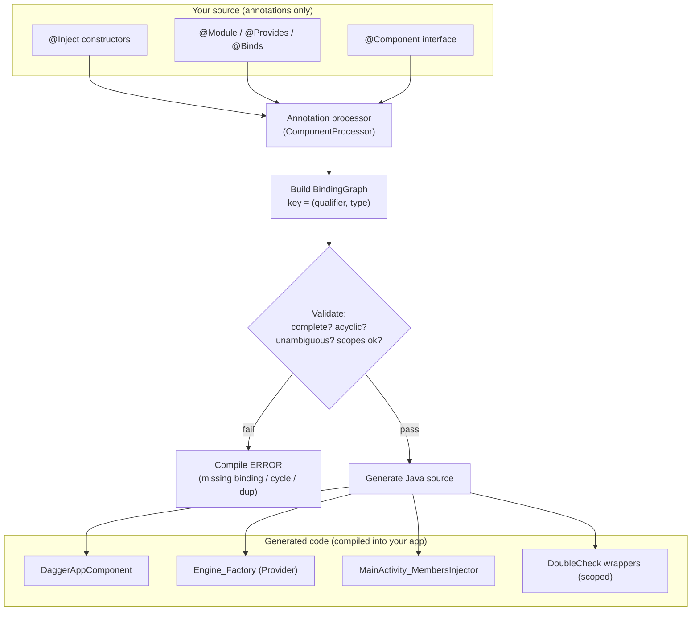
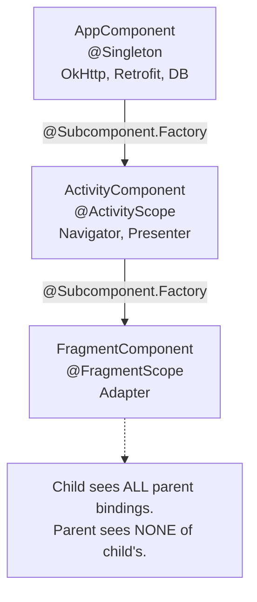

# Dagger — Internals

Dagger is a **compile-time** dependency-injection framework. It reads `@Inject`/`@Module`/`@Component` annotations during annotation processing, builds a directed dependency graph, resolves it, and emits plain Java source (`DaggerXxxComponent`, `Xxx_Factory`, `Xxx_MembersInjector`). There is no reflection at runtime, no XML, and no runtime graph walk — everything is a chain of `Provider.get()` calls decided by `javac`. Hilt is a layer of code generation *on top of* this exact machinery: it generates the components, modules, and `@InstallIn` wiring so you stop writing them by hand, but the objects that actually construct your dependencies are still Dagger's factories.

!!! abstract "Senior mental model"
    Dagger is a **source-to-source compiler**. Think of `@Component` as a request ("give me a graph that can build these roots") and the generated `DaggerXxxComponent` as the *proof* the compiler found a valid construction for every node. If the graph is incomplete, cyclic, or ambiguous, you get a **build error**, not a runtime crash. This compile-time guarantee is the entire value proposition.

---

## DI basics

Dependency injection means an object never constructs its own collaborators — they are handed to it. Dagger automates the "handing".

### The four ways things enter the graph

=== "Constructor injection (preferred)"

    ```kotlin
    class Engine @Inject constructor(
        private val fuelPump: FuelPump,
        private val logger: Logger,
    )
    ```

    `@Inject` on a constructor tells Dagger: *"I know how to build this; recurse into its params."* This is the only form that gives Dagger everything (how to build it **and** its dependencies) with zero extra config. Prefer it always.

=== "Field injection"

    ```kotlin
    class MainActivity : AppCompatActivity() {
        @Inject lateinit var engine: Engine   // framework owns the ctor
    }
    ```

    Used when a framework (Android `Activity`, `Fragment`, `Service`) owns the constructor so you can't `@Inject` it. You must call `component.inject(this)` explicitly. Dagger generates a `MembersInjector` to populate the fields.

=== "Method injection"

    ```kotlin
    class Registrar {
        @Inject fun init(bus: EventBus) { bus.register(this) }
    }
    ```

    Rare. Runs after construction and after field injection; useful when the injected object needs `this` (e.g. passing itself to a collaborator) without leaking `this` from the constructor.

### Telling Dagger how to build things it doesn't own

Constructor injection fails for **interfaces**, **third-party classes**, and things needing **runtime config**. That's what modules are for.

```kotlin
@Module
object NetworkModule {
    @Provides
    @Singleton
    fun provideOkHttp(): OkHttpClient =
        OkHttpClient.Builder().build()          // you can't @Inject OkHttpClient's ctor

    @Provides
    fun provideApi(client: OkHttpClient): Api =  // params are resolved from the graph
        Retrofit.Builder().client(client).build().create(Api::class.java)
}
```

The `@Component` stitches modules and injection sites into one graph:

```kotlin
@Singleton
@Component(modules = [NetworkModule::class])
interface AppComponent {
    fun inject(activity: MainActivity)   // members-injection entry point
    fun engine(): Engine                 // provision method (returns a graph node)
}
```

!!! note "Binding vs provision method"
    A `@Provides`/`@Binds`/`@Inject` gives a **binding** (a recipe). A no-arg method on the `@Component` (`fun engine(): Engine`) is a **provision method** — an entry point you call to pull a fully-built object out of the graph. `inject(activity)` is the members-injection variant.

---

## Internals: annotation processing & codegen

### The pipeline

Dagger runs as an annotation processor (`dagger.internal.codegen.ComponentProcessor`) via KAPT (stub-generating) or KSP (Dagger 2.48+). Over the processing rounds it:

1. **Scans** for `@Inject`, `@Provides`, `@Binds`, `@Component`, `@Module`, scopes, qualifiers.
2. **Builds a `BindingGraph`** — a node per key, where a *key* is the pair `(qualifier?, Type)`. `@Named("io") Dispatcher` and `@Named("main") Dispatcher` are **different keys** even though the type is identical.
3. **Validates**: every dependency has exactly one binding (no missing, no duplicate), no cycles (unless broken by `Provider`/`Lazy`), scopes are consistent.
4. **Emits Java source** — one component impl plus a factory per injectable type.



### What the generated code looks like

For `class Engine @Inject constructor(fuelPump: FuelPump, logger: Logger)`, Dagger emits a `Provider<Engine>`:

```java
// Engine_Factory.java  (generated, simplified)
public final class Engine_Factory implements Factory<Engine> {
  private final Provider<FuelPump> fuelPumpProvider;
  private final Provider<Logger> loggerProvider;
  // ... ctor stores the providers ...
  @Override public Engine get() {
    return new Engine(fuelPumpProvider.get(), loggerProvider.get());
  }
}
```

Every injectable type becomes a `Xxx_Factory implements Factory<Xxx> extends Provider<Xxx>`. Construction is just nested `provider.get()` calls — **that is the "dependency graph at runtime": a tree of factories**, wired once when the component is created. No map lookups, no reflection.

Field injection generates a `MembersInjector`:

```java
// MainActivity_MembersInjector.java (generated, simplified)
public static void injectEngine(MainActivity instance, Engine engine) {
  instance.engine = engine;
}
```

And the component ties it together:

```java
// DaggerAppComponent.java (generated, simplified)
public final class DaggerAppComponent implements AppComponent {
  private Provider<OkHttpClient> provideOkHttpProvider;   // DoubleCheck (see below)
  // ...
  @Override public void inject(MainActivity activity) {
    MainActivity_MembersInjector.injectEngine(activity, engineProvider.get());
  }
}
```

### Dependency-resolution algorithm (how it actually resolves)

For each root (provision method / injected field), Dagger performs a **depth-first walk** over keys:

1. Take the required key `(qualifier, type)`.
2. Find its **single** binding: an `@Inject` ctor, a `@Provides`, or a `@Binds`. Zero → *missing binding* error. Two+ → *duplicate binding* error.
3. Recurse into that binding's own dependencies (its constructor/method params).
4. Detect cycles along the current path. A true cycle is an error **unless** an edge is a `Provider<T>` or `Lazy<T>`, which defers construction and legally breaks the loop.
5. Wrap the resulting `Provider` in `DoubleCheck` if the binding carries a scope.

Because this all happens in `javac`, an unresolved graph **cannot compile**. This is the property that makes Dagger safe at scale.

!!! tip "Lazy&lt;T&gt; and Provider&lt;T&gt;"
    - `Provider<T>.get()` → a **new** call into the binding each time (new instance for unscoped, cached instance for scoped).
    - `Lazy<T>.get()` → computed **once on first call**, then memoized locally (a `DoubleCheck` around a single binding) regardless of scope.
    Both defer construction, so both can break a dependency cycle.

---

## Scopes & qualifiers

### Scopes = caching, implemented by DoubleCheck

A scope annotation (`@Singleton`, or a custom one) does **not** mean "global." It means: *within one component instance, reuse the same object.* Dagger implements this by wrapping the binding's provider in `DoubleCheck`, a double-checked-locking single-instance provider:

```java
// dagger.internal.DoubleCheck (conceptual)
public T get() {
  Object result = instance;
  if (result == UNINITIALIZED) {
    synchronized (this) {
      result = instance;
      if (result == UNINITIALIZED) {
        result = delegate.get();   // build exactly once
        instance = result;
      }
    }
  }
  return (T) result;
}
```

So `@Singleton` scoped = `DoubleCheck`-wrapped provider held in the `AppComponent`. "Singleton" is only as singular as the component that owns it — two `AppComponent` instances give two "singletons." Unscoped bindings get a plain factory and hand back a **new instance every `get()`**.

```kotlin
@Singleton
class SessionCache @Inject constructor()   // one per AppComponent instance
```

A **custom scope** is just a marker; its lifetime is defined by which component you attach it to:

```kotlin
@Scope
@Retention(AnnotationRetention.RUNTIME)
annotation class ActivityScope

@ActivityScope
@Subcomponent
interface ActivityComponent { /* bindings marked @ActivityScope live as long as this */ }
```

!!! warning "Scope rules Dagger enforces at compile time"
    - A `@Provides`/`@Inject` binding may carry **at most one** scope.
    - A component's scope must **match** the scope of the bindings it hosts; a child (subcomponent) cannot use its parent's scope.
    - A scoped binding may **not** depend on a narrower-lived binding (e.g. a `@Singleton` depending on an `@ActivityScope` object) — this would outlive its dependency. Dagger rejects it.

### Qualifiers: disambiguating the same type

When two bindings have the **same type**, the key collides. Qualifiers add a discriminator so `(qualifier, type)` stays unique.

`@Named` is the built-in string qualifier — convenient but stringly-typed (typos compile). A custom `@Qualifier` is type-safe and self-documenting; prefer it in real code.

```kotlin
// Custom, type-safe qualifier
@Qualifier
@Retention(AnnotationRetention.BINARY)
annotation class IoDispatcher

@Qualifier
@Retention(AnnotationRetention.BINARY)
annotation class MainDispatcher

@Module
object DispatchersModule {
    @Provides @IoDispatcher
    fun io(): CoroutineDispatcher = Dispatchers.IO

    @Provides @MainDispatcher
    fun main(): CoroutineDispatcher = Dispatchers.Main
}

class Repo @Inject constructor(
    @IoDispatcher private val io: CoroutineDispatcher,   // resolves to the IO binding
)
```

The `@Named` equivalent — same behavior, weaker safety:

```kotlin
@Provides @Named("io") fun io(): CoroutineDispatcher = Dispatchers.IO
class Repo @Inject constructor(@Named("io") d: CoroutineDispatcher)
```

---

## @Binds vs @Provides

When you just need to say "interface `Repo` is implemented by `RepoImpl`," `@Provides` works but is wasteful — it generates a factory whose body is a trivial cast/return. `@Binds` tells Dagger the same thing declaratively, and Dagger emits **no factory at all**: it rewires the graph edge directly to the delegate's provider.

```kotlin
@Module
abstract class RepoModule {           // must be abstract (or an interface)
    @Binds
    abstract fun bindRepo(impl: RepoImpl): Repo   // abstract, one param, param is the impl
}
```

Rules Dagger enforces: `@Binds` methods must be **abstract**, take **exactly one parameter** (the concrete type, which must itself be injectable/provided), and the parameter type must be assignable to the return type. Because it's abstract you can't put it in an `object` module — use an `abstract class` or `interface` module.

| | `@Binds` | `@Provides` |
|---|---|---|
| Method form | `abstract`, single param, no body | Concrete, has a body |
| Module container | `interface` / `abstract class` | `object` / `class` (or `companion` for statics) |
| Generated code | **No factory** — graph edge points at the delegate provider | A `Xxx_Factory` wrapping the method call |
| Cost | Zero runtime object, smaller APK, faster build | Extra generated class + indirection |
| Use for | Interface → impl aliasing, multibinding contributions | Anything with real construction logic, third-party types, runtime params |
| Can construct? | No — only aliases an existing binding | Yes — arbitrary code |

!!! tip "Rule of thumb"
    If the method body would be `return impl` (or `return SomeImpl(...)` where the impl is itself `@Inject`-constructable), use `@Binds`. The moment you need real logic — a builder, a factory call, config — use `@Provides`.

### @BindsInstance — injecting runtime values into the graph

`@BindsInstance` binds a value you only have at **component-creation time** (application context, a user token, a base URL) directly into the graph, without a module.

```kotlin
@Singleton
@Component
interface AppComponent {
    @Component.Factory
    interface Factory {
        fun create(
            @BindsInstance app: Application,      // supplied at build time
            @BindsInstance @BaseUrl url: String,
        ): AppComponent
    }
}

// usage
val component = DaggerAppComponent.factory().create(this, "https://api.example.com")
```

The provided instance becomes a first-class binding available to the whole graph — no wrapper `@Provides` needed. This is exactly the mechanism Hilt uses under the hood to inject `@ApplicationContext`.

---

## Subcomponents & component hierarchy

A `@Subcomponent` **inherits the entire parent graph** and adds its own bindings + a narrower scope. This models nested lifecycles: `AppComponent` (app lifetime) → `ActivityComponent` (activity lifetime) → `FragmentComponent`.

```kotlin
@ActivityScope
@Subcomponent(modules = [ActivityModule::class])
interface ActivityComponent {
    @Subcomponent.Factory
    interface Factory {
        fun create(@BindsInstance activity: Activity): ActivityComponent
    }
    fun inject(activity: MainActivity)
}

// Parent exposes a way to spawn the child
@Singleton
@Component
interface AppComponent {
    fun activityComponentFactory(): ActivityComponent.Factory
}
```

Because the subcomponent is generated as an **inner class of the parent's implementation**, it can see every parent provider field directly — cheap, no bridging.



### Subcomponent vs component-dependencies

Both let you compose graphs, but they differ in coupling and what's visible.

| | `@Subcomponent` | Component dependencies (`@Component(dependencies = [...])`) |
|---|---|---|
| Relationship | Child is generated **inside** the parent; tight coupling | Two **independent** components; loose coupling |
| Access to parent graph | Sees **all** parent bindings automatically | Sees **only** what the parent **explicitly exposes** as provision methods |
| Creation | Parent hands out a `Subcomponent.Factory` | You build both components yourself and pass one into the other |
| Scope | Must be a **child** scope, different from parent | Each component has its **own independent** scope |
| Encapsulation | Weak — full parent surface visible | Strong — parent's public API is the contract |
| Build/codegen | One fused generated graph | Separate generated graphs; better incremental builds across module boundaries |
| Use when | Nested lifecycles in one module (Activity in App) | Crossing **module/library** boundaries, or you want a strict exposed contract |

```kotlin
// Component-dependency style: parent must EXPOSE what child can use
@Singleton
@Component
interface CoreComponent {
    fun okHttp(): OkHttpClient   // only this leaks to dependents
}

@FeatureScope
@Component(dependencies = [CoreComponent::class])
interface FeatureComponent {   // can inject OkHttpClient, nothing else from Core
    fun inject(f: FeatureFragment)
}
```

!!! note "Which to reach for"
    In-app nested lifecycles → **subcomponents** (this is what Hilt generates: `SingletonComponent → ActivityRetainedComponent → ActivityComponent → …`). Independent feature modules that shouldn't see each other's internals → **component dependencies**.

---

## Multibinding

Multibindings let **many modules each contribute** to one collection (`Set` or `Map`) that Dagger assembles. This is the backbone of plugin architectures and Hilt's `@IntoMap`-keyed `ViewModel`/`WorkerFactory` systems.

### @IntoSet

```kotlin
@Module
abstract class InitializersModule {
    @Binds @IntoSet
    abstract fun analytics(i: AnalyticsInitializer): AppInitializer

    @Binds @IntoSet
    abstract fun crash(i: CrashInitializer): AppInitializer
}

// Anyone can now inject the whole set — no central registry to edit
class AppStartup @Inject constructor(
    private val initializers: Set<@JvmSuppressWildcards AppInitializer>,
)
```

Add a new initializer by dropping a `@IntoSet` binding in *any* module — no edit to a central list. That's the decoupling win.

### @IntoMap + @MapKey

`@IntoMap` builds a `Map<K, V>`. The key comes from a `@MapKey` annotation. Dagger ships `@StringKey`, `@IntKey`, `@ClassKey`; you can define your own (e.g. a `KClass` key for the ViewModel pattern).

```kotlin
// Custom map key over a KClass<out ViewModel>
@MapKey
@Retention(AnnotationRetention.RUNTIME)
annotation class ViewModelKey(val value: KClass<out ViewModel>)

@Module
abstract class ViewModelModule {
    @Binds @IntoMap @ViewModelKey(HomeViewModel::class)
    abstract fun home(vm: HomeViewModel): ViewModel

    @Binds @IntoMap @ViewModelKey(ProfileViewModel::class)
    abstract fun profile(vm: ProfileViewModel): ViewModel
}

// Dagger assembles: Map<Class<out ViewModel>, Provider<ViewModel>>
class ViewModelFactory @Inject constructor(
    private val creators: Map<Class<out ViewModel>, @JvmSuppressWildcards Provider<ViewModel>>,
) : ViewModelProvider.Factory {
    override fun <T : ViewModel> create(cls: Class<T>): T =
        @Suppress("UNCHECKED_CAST") (creators[cls]!!.get() as T)
}
```

!!! warning "@JvmSuppressWildcards is not optional"
    Kotlin compiles `Set<Foo>`/`Map<K, Provider<V>>` params to `Set<? extends Foo>` in bytecode. Dagger's generated key is the invariant `Set<Foo>`, so they don't match and you get a *missing binding*. `@JvmSuppressWildcards` on the type strips the wildcard. This is one of the most common "why won't my multibinding inject" bugs.

---

## How Hilt builds on all of this

Everything above is what Hilt **generates for you**. When you write `@HiltAndroidApp`, `@AndroidEntryPoint`, `@Module @InstallIn(SingletonComponent::class)`, `@HiltViewModel`, Hilt's processor emits:

- A **predefined subcomponent hierarchy** (`SingletonComponent → ActivityRetainedComponent → ViewModelComponent → ActivityComponent → FragmentComponent → …`) — the subcomponent pattern from above, standardized.
- `@InstallIn` = "add this module's bindings to that generated component" — sugar over `@Component(modules = …)`.
- Field injection into `Activity`/`Fragment` via generated `MembersInjector`s, so you never call `component.inject(this)`.
- `@BindsInstance` of `Application`/`Activity` context behind `@ApplicationContext`/`@ActivityContext`.
- The `@HiltViewModel` + `@IntoMap` multibinding machinery shown above, prebuilt.

So Hilt is **not a different DI system** — it's opinionated Dagger with the component graph and boilerplate generated. Every debugging skill (reading `DaggerXxx`/`Hilt_Xxx` generated sources, scope-mismatch errors, missing-binding errors, `@JvmSuppressWildcards`) transfers directly.

---

## Interview Q&A

!!! question "1. Dagger is 'compile-time DI.' What does that actually buy you over a reflection-based container like Guice or Koin?"
    Correctness is verified by `javac`, not at runtime. Dagger builds and validates the full dependency graph during annotation processing: a missing binding, a duplicate binding, a scope mismatch, or an unbroken cycle is a **compile error**, not a runtime `NullPointerException` on some rare code path. There's also **no reflection cost** — construction is nested `Provider.get()` calls in generated Java, so startup and injection are as fast as hand-written code, which matters on Android. The trade-off is build time (annotation processing) and a steeper learning curve.

    **Follow-up — "So how does it break a legitimate dependency cycle if cycles are errors?"** Inject a `Provider<T>` or `Lazy<T>` on one edge instead of `T` directly. That defers construction past the point the cycle would close, so the graph is no longer cyclic *at construction time*. `Lazy` also memoizes the first `get()`.

!!! question "2. What does @Singleton mechanically do in the generated code, and why is 'singleton' a misleading name?"
    `@Singleton` causes Dagger to wrap that binding's provider in a `DoubleCheck` — a double-checked-locking provider that builds the instance once and caches it for the lifetime of **the component instance that owns it**. It's not a process-global singleton; it's "one per component instance." Two `AppComponent`s (e.g. recreated after process death, or a misconfigured test) give two distinct "singletons." Unscoped bindings get a plain factory that returns a new instance on every `get()`.

    **Follow-up — "How would you scope something to an Activity?"** Define a custom `@Scope` (`@ActivityScope`), attach it to a subcomponent whose lifetime matches the Activity, and mark the binding with it. Dagger holds it in a `DoubleCheck` inside that subcomponent, so it lives and dies with the subcomponent — which you create in `onCreate` and drop in `onDestroy`. (Hilt automates exactly this with `@ActivityScoped`.)

!!! question "3. When would you use @Binds instead of @Provides, and why does the compiler force @Binds methods to be abstract?"
    Use `@Binds` when the binding is a pure alias — "interface `Repo` is `RepoImpl`," where `RepoImpl` is itself `@Inject`-constructable. It's abstract because it has **no body to run**: it's a declaration, not code. Dagger uses it to rewire the graph edge straight to the delegate's existing provider, generating **no factory class**. `@Provides` is for real construction logic (builders, third-party types, runtime params) and generates a `Xxx_Factory` that invokes your method body. `@Binds` is cheaper: fewer generated classes, smaller APK, faster builds.

    **Follow-up — "Can @Binds and @Provides live in the same module?"** Not comfortably. `@Binds` needs an abstract module (`interface`/`abstract class`); `@Provides` statics want an `object` or `companion object`. The common pattern is an `abstract class` module with abstract `@Binds` methods plus a nested `companion object`/`@Module object` holding the static `@Provides`.

!!! question "4. You have two @Provides methods both returning CoroutineDispatcher. What happens, and how do you fix it? Why prefer a custom @Qualifier over @Named?"
    Two bindings for the same key `(no-qualifier, CoroutineDispatcher)` → **duplicate binding compile error**. A Dagger key is `(qualifier, type)`, so you disambiguate by attaching different qualifiers: `@IoDispatcher` and `@MainDispatcher` (or `@Named("io")`/`@Named("main")`). Now the keys differ and each injection site picks the one it annotates. Prefer a **custom `@Qualifier`** because it's type-safe and self-documenting — a typo in a `@Named("io")` string compiles fine and fails as a confusing missing-binding error, whereas a mistyped custom qualifier won't compile.

    **Follow-up — "Where does the qualifier annotation actually need to appear?"** On **both** ends: the binding that produces it (`@Provides @IoDispatcher`) and every consumption site (`@IoDispatcher dispatcher: CoroutineDispatcher` in a constructor/field). They must match exactly, or the key won't resolve.

!!! question "5. Explain multibinding and a real use case. What's the classic Kotlin gotcha?"
    **Answer:** Multibinding (`@IntoSet`, `@IntoMap`) lets multiple modules each contribute an element to a `Set` or `Map` that Dagger assembles, and you inject the whole collection. The killer use case is a **plugin/registry without a central list**: e.g., `Set<AppInitializer>` where any feature module drops in a `@IntoSet` binding, or the ViewModel pattern — `@IntoMap @ViewModelKey(...)` building a `Map<Class<out ViewModel>, Provider<ViewModel>>` that a single `ViewModelFactory` consumes (this is essentially what `@HiltViewModel` generates). The gotcha: Kotlin lowers `Set<Foo>` to `Set<? extends Foo>` in bytecode while Dagger's generated key is invariant `Set<Foo>`, so injection fails with a missing binding until you add **`@JvmSuppressWildcards`** to the injected collection type.

    **Follow-up — "How does this connect to Hilt?"** Hilt's `@HiltViewModel` and its `WorkerFactory`/`@AndroidEntryPoint` plumbing are built on exactly this `@IntoMap` machinery over the generated component hierarchy — Hilt just generates the map keys, modules, and factory so you never hand-write the `ViewModelModule`/`ViewModelFactory` boilerplate.

!!! question "6. Explain the exact generated code structure of Dagger. What classes are generated when you compile, and what does each do?"
    **Answer:** Dagger operates by generating standard, highly optimized Java classes during compilation (under annotation processing or KSP). It generates:
    
    1.  **Factories for @Inject Constructors (`Class_Factory.java`):** For every class marked with an `@Inject` constructor, Dagger generates a factory class implementing `Provider<T>`. This class has a static `newInstance` method and holds `Provider` references for all constructor parameters.
    2.  **Factories for Modules (`Module_MethodFactory.java`):** For every `@Provides` method in a `@Module`, Dagger generates a factory implementing `Provider<T>`. It holds references to the module instance (if not static) and providers for all method parameters, calling the provider method in its `get()` implementation.
    3.  **Members Injectors (`Class_MembersInjector.java`):** For classes containing `@Inject lateinit var` fields (such as Activities/Fragments), Dagger generates a class implementing `MembersInjector<T>`. It contains an `injectMembers(T instance)` method that directly sets each field.
    4.  **Component Implementations (`DaggerComponent.java`):** The component implementation implements your `@Component` interface. It:
        *   Holds all `Provider` fields (representing factories for the dependency instances).
        *   Initializes these fields in a private `initialize(...)` method (wrapping scoped providers in `DoubleCheck` wrappers).
        *   Implements the interface's provision methods by delegating to the cached factories (`get()`), or calls the generated `MembersInjector` inside target injection methods.

!!! question "7. Dagger 1 vs Dagger 2 — how did they differ internally, and why did Google rewrite Dagger?"
    **Answer:** Dagger 1 (created by Square) and Dagger 2 (forked and rewritten by Google) are fundamentally different in execution and validation:
    
    1.  **Dagger 1 (Reflection-based at Runtime):** Dagger 1 performed graph validation at compile time, but it built the actual dependency graph at runtime using **Java reflection**. This meant that class loading, field injection, and object construction required reflective lookups, which degraded startup performance and memory layout on resource-constrained Android devices.
    2.  **Dagger 2 (100% Compile-Time Code Generation):** Google rewrote Dagger to eliminate runtime reflection. Dagger 2 generates standard, concrete Java code (`DaggerAppComponent`, `Class_Factory`, etc.) that performs normal constructor and member injection.
    3.  **No Object Graphs:** Dagger 1 used an `ObjectGraph` class at runtime. Dagger 2 replaces this with compile-time generated `@Component` implementations.
    4.  **Error Surface:** Because Dagger 2 generates code at compile time, any missing or cyclic dependency results in a compiler build failure. In Dagger 1, some invalid graph configurations would build successfully but throw crashes at runtime.
    
    *Follow-up:* Why is Dagger 2 preferred for Android? — By generating direct Java calls, Dagger 2 is trace-friendly (you can set breakpoints inside the generated code and step through it) and incurs **zero runtime CPU/reflection overhead**, making app startup significantly faster.


