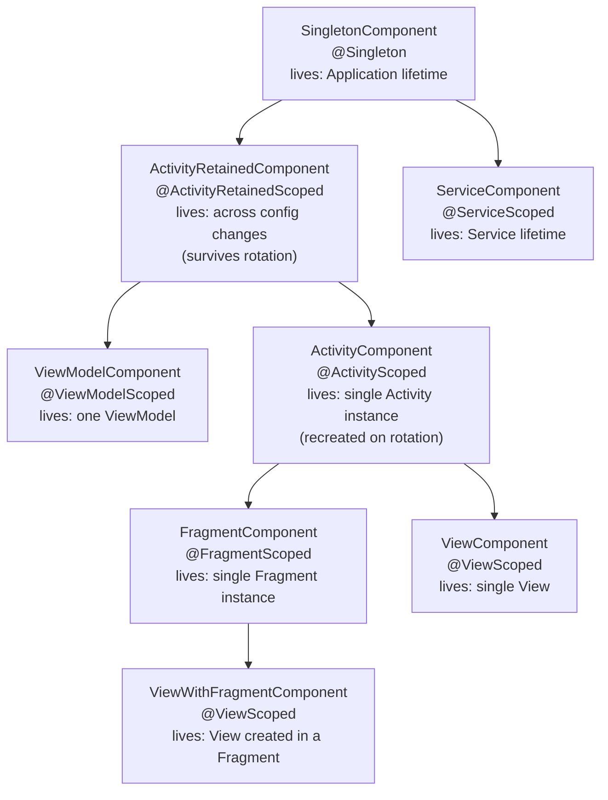

# Hilt — Complete Guide

Hilt is Google's opinionated dependency-injection library for Android. It is a thin
layer on top of **Dagger**: same compile-time code generation, same `javax.inject`
annotations, same graph validation — but with a fixed set of components pre-wired to
the Android lifecycle so you never hand-write `@Component` interfaces or manage
component lifetimes yourself. If you understand Dagger, Hilt is Dagger with the
boilerplate removed and a standardized component tree bolted onto Android's framework
classes.

!!! abstract "What a senior is expected to know"
    Not "how to add `@Inject`" — but *why* the graph is validated at compile time, *which*
    component outlives a configuration change, what `@Binds` generates versus `@Provides`,
    how `@AndroidEntryPoint` rewrites your class hierarchy via a Gradle bytecode transform,
    and how to swap a real dependency for a fake in an instrumented test without touching
    production code.

---

## Part A — Basics

### What Hilt is (and is not)

- **Is:** a standardized DI setup for Android built on Dagger. It defines a set of
  components (`SingletonComponent`, `ActivityComponent`, …), generates them for you, and
  attaches them to the Android lifecycle.
- **Is not:** a new DI engine. There is no reflection at runtime for graph resolution.
  The dependency graph is resolved and validated **at compile time** by an annotation
  processor. A missing binding is a build error, not a runtime crash.

### The three entry annotations

```kotlin
// 1. Application — the root of the whole graph. Exactly one per app.
@HiltAndroidApp
class MyApp : Application()

// 2. Android framework classes that want injection.
@AndroidEntryPoint
class MainActivity : AppCompatActivity() {

    // 3. Field injection — Hilt populates this before super.onCreate() returns control.
    @Inject lateinit var analytics: AnalyticsManager

    override fun onCreate(savedInstanceState: Bundle?) {
        super.onCreate(savedInstanceState) // injection already done by the generated base class
        analytics.log("main_open")
    }
}
```

- `@HiltAndroidApp` triggers generation of the root component and makes the `Application`
  the holder of the `SingletonComponent`.
- `@AndroidEntryPoint` can be placed on `Activity`, `Fragment`, `View`, `Service`, and
  `BroadcastReceiver`. It generates a base class (see [Part F](#part-f-internals)) that
  performs member injection.
- `@Inject` on a `lateinit var` field requests a member injection; `@Inject` on a
  constructor tells Hilt how to *create* that type.

!!! warning "Field injection vs constructor injection"
    Constructor injection (`@Inject constructor(...)`) is always preferred — it makes
    dependencies explicit, immutable, and testable. Field injection exists **only** because
    Android instantiates framework classes (Activity, Fragment, Service) for you, so you
    cannot own their constructors. Use field injection for framework classes; use
    constructor injection for everything you construct yourself.

### The minimal `@Inject constructor` case

If a class's dependencies are themselves injectable, you do not need a module at all:

```kotlin
class AnalyticsManager @Inject constructor(
    private val api: AnalyticsApi,          // provided/injectable elsewhere
    private val clock: Clock,
) { /* ... */ }
```

Hilt now knows how to build `AnalyticsManager` anywhere in the graph. Modules
([Part C](#part-c-modules)) are needed only for types you cannot annotate: interfaces,
third-party classes (Retrofit, OkHttp, Room), and anything requiring builder logic.

---

## Part B — Components, lifespans, and scopes

Hilt generates a **fixed hierarchy** of components. Each component is created and
destroyed alongside a specific Android lifecycle, and each has an associated scope
annotation. A child component can see every binding its parents expose.

### The component hierarchy



### Components ↔ scopes ↔ lifespans

| Component | Scope annotation | Created at | Destroyed at | Survives config change? |
|---|---|---|---|---|
| `SingletonComponent` | `@Singleton` | `Application#onCreate` | app process death | n/a (whole app) |
| `ActivityRetainedComponent` | `@ActivityRetainedScoped` | first `Activity#onCreate` | last `Activity#onDestroy` (not rotation) | **Yes** |
| `ViewModelComponent` | `@ViewModelScoped` | `ViewModel` created | `ViewModel#onCleared` | **Yes** (tied to ViewModel) |
| `ActivityComponent` | `@ActivityScoped` | `Activity#onCreate` | `Activity#onDestroy` | No (recreated) |
| `FragmentComponent` | `@FragmentScoped` | `Fragment#onAttach` | `Fragment#onDestroy` | No |
| `ViewComponent` | `@ViewScoped` | `View` constructed | `View` destroyed | No |
| `ViewWithFragmentComponent` | `@ViewScoped` | View created inside Fragment | View destroyed | No |
| `ServiceComponent` | `@ServiceScoped` | `Service#onCreate` | `Service#onDestroy` | n/a |

!!! note "Why `ActivityRetainedComponent` exists"
    It sits between `SingletonComponent` and `ActivityComponent` and survives configuration
    changes (rotation) because it is retained via a `ViewModel` under the hood — the same
    mechanism that keeps your `@HiltViewModel` alive. This is exactly the lifetime you want
    for state that should outlive a rotation but not the whole app. `ViewModelComponent` is
    its child, which is why ViewModels can inject `@ActivityRetainedScoped` bindings.

### What "scoped" actually means

A scope annotation means **one instance per component instance** — the component caches
the object and hands out the same reference to every consumer for the life of that
component. It is *not* a global singleton unless the component itself is global.

- `@Singleton` → one instance for the whole app (because `SingletonComponent` is a
  singleton).
- `@ActivityScoped` → one instance **per Activity instance**. Rotate the screen and the
  Activity is recreated, so you get a *new* instance.
- **Unscoped** (no scope annotation) → a **new instance is created on every injection
  point / every request**. This is the default and is often what you want for lightweight
  stateless objects. Scoping has a cost (the component holds the reference), so scope only
  when sharing an instance actually matters (shared mutable state, expensive construction).

!!! danger "Scope ≠ singleton"
    A common misconception is that `@Singleton` makes *the type* a singleton. It makes the
    *binding within the SingletonComponent* return a cached instance. The same type provided
    unscoped elsewhere would still be re-created. Scope is a property of the binding in a
    component, not of the class.

---

## Part C — Modules

A **module** tells Hilt how to provide a type it cannot construct on its own (interfaces,
third-party classes, values requiring builder logic).

### `@Module` + `@InstallIn`

`@InstallIn(component)` decides **which component the bindings live in** — and therefore
their scope availability and lifetime. A binding installed in `SingletonComponent` is
visible everywhere; one installed in `ActivityComponent` is visible only from Activities,
Fragments, and Views downstream. Choosing the right component is a design decision:
install as high as the binding needs to be shared, no higher.

```kotlin
@Module
@InstallIn(SingletonComponent::class)
object NetworkModule {

    @Provides
    @Singleton
    fun provideOkHttp(): OkHttpClient =
        OkHttpClient.Builder()
            .addInterceptor(HttpLoggingInterceptor())
            .build()

    @Provides
    @Singleton
    fun provideRetrofit(client: OkHttpClient): Retrofit =
        Retrofit.Builder()
            .baseUrl("https://api.example.com/")
            .client(client)                       // OkHttpClient injected from the binding above
            .addConverterFactory(MoshiConverterFactory.create())
            .build()

    @Provides
    @Singleton
    fun provideUserApi(retrofit: Retrofit): UserApi =
        retrofit.create(UserApi::class.java)
}
```

!!! tip "`@InstallIn` and scope must be compatible"
    You can only use a scope annotation that belongs to the component you installed into.
    `@Singleton` is legal in `SingletonComponent`; `@ActivityScoped` would be a compile
    error there. The processor enforces this.

### `@Provides` vs `@Binds`

- **`@Provides`** — a function body that constructs and returns the object. Use it when
  you need builder logic or the type is third-party. The processor generates a **Factory**
  class that calls your method.
- **`@Binds`** — an **abstract** function that simply tells Hilt "when someone asks for
  interface `X`, give them implementation `Y`." No body, no factory generated — the
  processor just rewires the graph edge. This is why `@Binds` is **cheaper**: it produces
  less generated code and no runtime factory allocation.

```kotlin
interface UserRepository { suspend fun load(id: String): User }

class UserRepositoryImpl @Inject constructor(
    private val api: UserApi,
    private val db: UserDao,
) : UserRepository { /* ... */ }

@Module
@InstallIn(SingletonComponent::class)
abstract class RepositoryModule {

    // No body. Hilt maps UserRepository -> UserRepositoryImpl.
    // UserRepositoryImpl is @Inject-constructed, so Hilt already knows how to build it.
    @Binds
    @Singleton
    abstract fun bindUserRepository(impl: UserRepositoryImpl): UserRepository
}
```

| | `@Provides` | `@Binds` |
|---|---|---|
| Function form | concrete, has a body | abstract, no body |
| Module type | `object` (or companion) | `abstract class` / interface |
| Generated code | a Factory that invokes your method | none — just a graph edge |
| Use when | third-party type, builder logic needed | interface → single `@Inject` impl |
| Cost | one factory class + method call | zero extra allocation |

!!! note "Mixing `@Binds` and `@Provides`"
    They cannot both live in the same non-abstract `object` module (abstract `@Binds` needs
    an abstract class/interface; `@Provides` in an abstract module must be `companion object`
    or static). Common pattern: an `abstract class` module with `@Binds` methods plus a
    `companion object` holding `@Provides` methods.

---

## Part D — ViewModel injection

### `@HiltViewModel` + `SavedStateHandle`

```kotlin
@HiltViewModel
class ProfileViewModel @Inject constructor(
    private val repo: UserRepository,          // from the graph
    private val savedStateHandle: SavedStateHandle,  // provided by Hilt automatically
) : ViewModel() {

    // Nav arg "userId" survives process death via SavedStateHandle.
    private val userId: String = checkNotNull(savedStateHandle["userId"])

    val user: StateFlow<User?> = savedStateHandle.getStateFlow("user", null)

    fun refresh() = viewModelScope.launch {
        savedStateHandle["user"] = repo.load(userId)
    }
}
```

- `@HiltViewModel` registers the ViewModel with a Hilt-provided
  `ViewModelProvider.Factory`, so you never write a factory.
- The ViewModel is created in the `ViewModelComponent`, so it can inject anything
  `@ViewModelScoped`, `@ActivityRetainedScoped`, or `@Singleton`.
- **`SavedStateHandle` is injectable for free** inside a `@HiltViewModel`. Hilt wires the
  Activity/Fragment/nav `SavedStateHandle` into the ViewModel component. Navigation
  arguments land in it automatically when using Navigation-Compose.

### Retrieving it

```kotlin
// Views (Activity/Fragment): standard delegate, no factory needed.
class ProfileFragment : Fragment() {
    private val vm: ProfileViewModel by viewModels()
}

// Compose: hiltViewModel() resolves the factory from the local ViewModelStoreOwner.
@Composable
fun ProfileScreen(vm: ProfileViewModel = hiltViewModel()) {
    val user by vm.user.collectAsStateWithLifecycle()
    // ...
}
```

!!! warning "Compose scoping gotcha"
    `hiltViewModel()` scopes the ViewModel to the nearest `ViewModelStoreOwner` — usually
    the `NavBackStackEntry` for the current destination when inside a `NavHost`, or the host
    Activity otherwise. Calling it in two different destinations yields two different
    instances. To share one ViewModel across destinations, pass the parent nav graph's
    back-stack entry as the `viewModelStoreOwner`.

---

## Part E — Entry points (`@EntryPoint`)

Hilt owns injection only for classes it generates base classes for (Activity, Fragment,
Service, etc.). To pull a dependency out of the graph from a class Hilt **doesn't own** —
a `ContentProvider`, a non-Hilt library, a `WorkManager` worker before `HiltWorker`, or
plain Java code — you define an **entry point**: an interface annotated with
`@EntryPoint`, installed in a component, exposing accessor methods. You then resolve it
through `EntryPointAccessors`.

```kotlin
// Define the entry point: which bindings we want to reach into.
@EntryPoint
@InstallIn(SingletonComponent::class)
interface WorkerDepsEntryPoint {
    fun userRepository(): UserRepository
    fun analytics(): AnalyticsManager
}

// Use it from a class Hilt does NOT instantiate (e.g. a ContentProvider or legacy Worker).
class LegacySyncWorker(
    private val context: Context,
    params: WorkerParameters,
) : Worker(context, params) {

    override fun doWork(): Result {
        val entryPoint = EntryPointAccessors.fromApplication(
            context.applicationContext,
            WorkerDepsEntryPoint::class.java,
        )
        val repo = entryPoint.userRepository()
        val analytics = entryPoint.analytics()
        // ... use them ...
        return Result.success()
    }
}
```

`EntryPointAccessors` has variants matching component holders:
`fromApplication(...)` (SingletonComponent), `fromActivity(...)` (ActivityComponent),
`fromFragment(...)` (FragmentComponent). You must resolve from a component that is at
least as broad as where the entry point is installed.

!!! note "ContentProviders and startup ordering"
    `ContentProvider#onCreate` can run **before** `Application#onCreate` finishes. If your
    provider needs graph access at that moment, use an `@EntryPoint` from the application
    context — but be aware the `SingletonComponent` is available very early because
    `@HiltAndroidApp` initializes it eagerly.

!!! tip "Modern WorkManager"
    For workers today, prefer `@HiltWorker` with `@AssistedInject` and the
    `HiltWorkerFactory` — the manual `@EntryPoint` approach above is the pre-`HiltWorker`
    fallback and is still the pattern for arbitrary non-Hilt classes.

---

## Part F — Internals

### Code generation, step by step

Hilt runs as an annotation processor (KAPT or, preferably, **KSP**) plus a **Gradle
bytecode-transform plugin**. Roughly:

1. **`@HiltAndroidApp`** → generates `Hilt_MyApp` (a base `Application`) and the root
   `SingletonComponent` implementation (`DaggerMyApp_HiltComponents_SingletonC`). It also
   generates a `GeneratedComponentManager` that holds the component.
2. **`@AndroidEntryPoint`** on `MainActivity` → generates `Hilt_MainActivity`, a base
   class that:
   - lazily creates the `ActivityComponent`,
   - implements `GeneratedComponentManagerHolder`,
   - performs **member injection** (populates your `@Inject` fields) at the right moment.
3. **The Gradle plugin rewrites bytecode** so that your `class MainActivity : AppCompatActivity()`
   effectively becomes `class MainActivity : Hilt_MainActivity()`. You *write*
   `AppCompatActivity` as the superclass; the transform splices `Hilt_MainActivity` in
   between. This is why you never see or type the generated base class.
4. **`@InstallIn` processor** collects every module and entry point, groups them by target
   component, and assembles the final Dagger `@Component`/`@Subcomponent` interfaces —
   validating the whole graph. A missing or duplicate binding fails the build here.

### How field injection happens before `super.onCreate`

For an Activity, the generated `Hilt_MainActivity` injects fields in its
`onCreate(Bundle)` **before** delegating to your code:

```text
Hilt_MainActivity.onCreate(savedInstanceState):
    inject()                      // populates @Inject fields via the ActivityComponent
    super.onCreate(...)           // AppCompatActivity
// then YOUR MainActivity.onCreate runs, fields already non-null
```

Concretely, `inject()` obtains the `ActivityComponent`, casts it to the generated
`MainActivity_GeneratedInjector`, and calls `injectMainActivity(this)`, which assigns each
`@Inject lateinit var`. Because this runs in the base class's `onCreate` before your
override executes its body, your fields are guaranteed initialized by the time your
`super.onCreate()` returns. (For Fragments, injection happens in `onAttach`.)

!!! note "KSP over KAPT"
    KAPT generates Java stubs and is slow. Hilt fully supports **KSP**, which processes
    Kotlin directly and is markedly faster on large modules. On a 14+ module monorepo, KSP
    is the right choice.

---

## Part G — Testing

Hilt has first-class test support: it can build a **test-specific component**, let you
remove production modules, and substitute fakes — all validated at compile time.

### Setup

```kotlin
@HiltAndroidTest
class ProfileFlowTest {

    @get:Rule(order = 0)
    val hiltRule = HiltAndroidRule(this)      // must run first

    @get:Rule(order = 1)
    val composeRule = createAndroidComposeRule<HiltTestActivity>()

    @Inject lateinit var repo: UserRepository // injected fake (see below)

    @Before fun setUp() {
        hiltRule.inject()                     // populates @Inject fields in the test
    }

    @Test fun loadsProfile() { /* ... */ }
}
```

You also need a **custom test runner** so the test app uses `HiltTestApplication`:

```kotlin
class HiltTestRunner : AndroidJUnitRunner() {
    override fun newApplication(cl: ClassLoader?, name: String?, ctx: Context?): Application =
        super.newApplication(cl, HiltTestApplication::class.java.name, ctx)
}
// build.gradle.kts:  testInstrumentationRunner = "com.example.HiltTestRunner"
```

### Swapping a real binding for a fake

**`@TestInstallIn`** replaces a production module across an entire test source set — the
preferred approach for a fake you want everywhere:

```kotlin
@Module
@TestInstallIn(
    components = [SingletonComponent::class],
    replaces = [RepositoryModule::class],     // the production module to remove
)
abstract class FakeRepositoryModule {
    @Binds
    abstract fun bindFakeRepo(fake: FakeUserRepository): UserRepository
}
```

**`@UninstallModules`** removes a module for a **single test class**, letting you provide
a binding inline — useful for one-off overrides:

```kotlin
@HiltAndroidTest
@UninstallModules(RepositoryModule::class)
class ErrorStateTest {

    @BindValue @JvmField
    val repo: UserRepository = FakeUserRepository(alwaysFails = true)

    @get:Rule val hiltRule = HiltAndroidRule(this)
    // ...
}
```

| Mechanism | Scope of effect | Use when |
|---|---|---|
| `@TestInstallIn` | whole test source set | one fake shared by many tests |
| `@UninstallModules` + `@BindValue` | single test class | per-test override / different fakes |
| `@BindValue` | single test class | bind an instance created in the test |

!!! tip "`@BindValue`"
    `@BindValue` binds a field's value directly into the test graph — great for a fake you
    configure per test method. Combine with `@UninstallModules` to remove the real binding
    it collides with.

---

## Qualifiers — disambiguating identical types

When two bindings have the **same type** (two `OkHttpClient`s, two `String`s, two
`CoroutineDispatcher`s), Hilt cannot tell them apart. Qualifiers add a compile-time tag.

- **`@Named("...")`** — a built-in string qualifier. Quick, but stringly-typed: a typo is
  a runtime-shaped bug the compiler can't catch semantically, and it's easy to collide.
- **Custom `@Qualifier`** — a typed annotation. Preferred in serious codebases: refactor-
  safe, self-documenting, and impossible to misspell silently.

```kotlin
// Custom qualifiers — the senior-preferred approach.
@Qualifier @Retention(AnnotationRetention.BINARY) annotation class IoDispatcher
@Qualifier @Retention(AnnotationRetention.BINARY) annotation class DefaultDispatcher

@Module
@InstallIn(SingletonComponent::class)
object DispatchersModule {
    @Provides @IoDispatcher fun io(): CoroutineDispatcher = Dispatchers.IO
    @Provides @DefaultDispatcher fun default(): CoroutineDispatcher = Dispatchers.Default
}

class SyncRepository @Inject constructor(
    @IoDispatcher private val io: CoroutineDispatcher,   // resolves the correct binding
) { /* ... */ }

// vs the @Named equivalent (works, but stringly-typed):
// @Provides @Named("io") fun io(): CoroutineDispatcher = Dispatchers.IO
// class Repo @Inject constructor(@Named("io") d: CoroutineDispatcher)
```

!!! note "`@ApplicationContext` and `@ActivityContext`"
    Hilt ships two predefined qualifiers so you can inject the right `Context`:
    `@ApplicationContext` (from `SingletonComponent`) and `@ActivityContext` (from
    `ActivityComponent`). Never inject a raw `Context` without one — the type is ambiguous.

---

## Hilt vs plain Dagger vs Koin

| | **Hilt** | **Plain Dagger** | **Koin** |
|---|---|---|---|
| Graph resolution | **Compile time** | **Compile time** | **Runtime** (service locator) |
| Errors surface | at build | at build | at first resolution (runtime) |
| Boilerplate | low (components pre-built) | high (you write components/subcomponents) | low |
| Android lifecycle integration | built-in, standardized | manual (you wire scopes) | manual modules + scopes |
| Learning curve | moderate | steep | gentle |
| Runtime overhead | none (generated code) | none | reflection / map lookups |
| Build-time cost | annotation processing | annotation processing | negligible |
| Best for | production Android apps | libraries / non-standard graphs | small apps, fast prototyping, KMP |

!!! abstract "The senior framing"
    The real axis is **compile-time graph vs runtime lookup**. Hilt and Dagger fail your
    *build* if a dependency is missing; Koin fails your *running app* (or a test) when the
    missing binding is first requested. For a large, revenue-bearing app the compile-time
    guarantee is worth the annotation-processing cost. Hilt buys Dagger's safety while
    deleting most of Dagger's ceremony; you drop to raw Dagger only when you need a graph
    shape Hilt's fixed component tree doesn't express (rare in app code, common in
    libraries).

---

## Interview Q&A

**Q1. What does `@AndroidEntryPoint` actually do to my class, and why can I still write `: AppCompatActivity()`?**
:   It generates a `Hilt_MyActivity` base class that owns the component and performs member
    injection, then a **Gradle bytecode transform** rewrites your class so its real
    superclass becomes `Hilt_MyActivity` instead of `AppCompatActivity`. You write the
    framework superclass; the transform splices the generated one in between at compile
    time, which is why the generated class is invisible in your source.
    *Follow-up:* When exactly are `@Inject` fields ready? — In the generated base's
    `onCreate` (Activities) or `onAttach` (Fragments), **before** your override's body runs,
    so fields are non-null by the time you use them in `onCreate`.

**Q2. Explain scopes. Is `@Singleton` a global singleton?**
:   A scope means **one instance per component instance**, cached by that component for its
    lifetime. `@Singleton` is app-wide only because `SingletonComponent` is app-wide;
    `@ActivityScoped` gives one instance *per Activity* (a new one after rotation).
    Unscoped bindings create a fresh instance on every request. So scope is a property of a
    binding within a component, not of the class.
    *Follow-up:* When should you *not* scope? — When the object is cheap and stateless;
    scoping forces the component to hold a reference (memory) with no benefit.

**Q3. `@Binds` vs `@Provides` — which and why?**
:   `@Provides` is a concrete method with a body; the processor generates a factory that
    calls it — use it for third-party types or builder logic. `@Binds` is abstract with no
    body and simply maps an interface to an `@Inject`-constructed implementation; the
    processor generates **no factory**, just a graph edge, so it's cheaper. Prefer `@Binds`
    for interface→impl.
    *Follow-up:* Why can't they share a plain `object` module? — `@Binds` needs an abstract
    class/interface; to mix, put `@Provides` in a `companion object` inside the abstract
    module.

**Q4. Which component holds a `@HiltViewModel`, and how does `SavedStateHandle` get injected?**
:   ViewModels live in the `ViewModelComponent`, a child of `ActivityRetainedComponent`, so
    they can inject `@ViewModelScoped`, `@ActivityRetainedScoped`, and `@Singleton`
    bindings. `@HiltViewModel` registers a Hilt `ViewModelProvider.Factory`, and
    `SavedStateHandle` is a built-in binding in that component — Hilt wires the owner's
    saved-state handle in, so navigation args appear in it automatically.
    *Follow-up:* Why does `hiltViewModel()` sometimes return different instances across
    Compose destinations? — It scopes to the nearest `ViewModelStoreOwner`, which is the
    per-destination `NavBackStackEntry` inside a `NavHost`; share by passing a parent
    back-stack entry as the store owner.

**Q5. I need a dependency inside a `ContentProvider` (or a non-Hilt library class). How?**
:   Define an `@EntryPoint` interface, `@InstallIn` the appropriate component, expose
    accessor methods, then resolve it with `EntryPointAccessors.fromApplication/fromActivity`
    at runtime. This is the escape hatch for classes Hilt doesn't generate a base for.
    *Follow-up:* What about WorkManager? — Modern code uses `@HiltWorker` +
    `@AssistedInject` + `HiltWorkerFactory`; the `@EntryPoint` route is the pre-`HiltWorker`
    fallback and the general pattern for arbitrary non-Hilt classes.

**Q6. How do you replace a real dependency with a fake in an instrumented test without editing production code?**
:   Use `@TestInstallIn(replaces = [RealModule::class])` to swap a module across the whole
    test source set, or `@UninstallModules(RealModule::class)` + `@BindValue` for a single
    test class. Drive it with `@HiltAndroidTest`, a `HiltAndroidRule`, and a custom
    `AndroidJUnitRunner` that launches `HiltTestApplication`. The substituted graph is still
    validated at compile time.
    *Follow-up:* `@TestInstallIn` vs `@UninstallModules`? — `@TestInstallIn` is global to the
    test source set (one shared fake); `@UninstallModules`/`@BindValue` is per-class, for
    one-off or per-test overrides.
