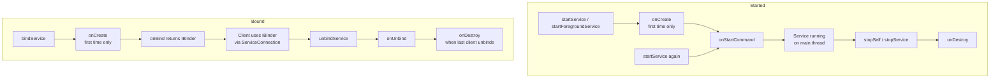
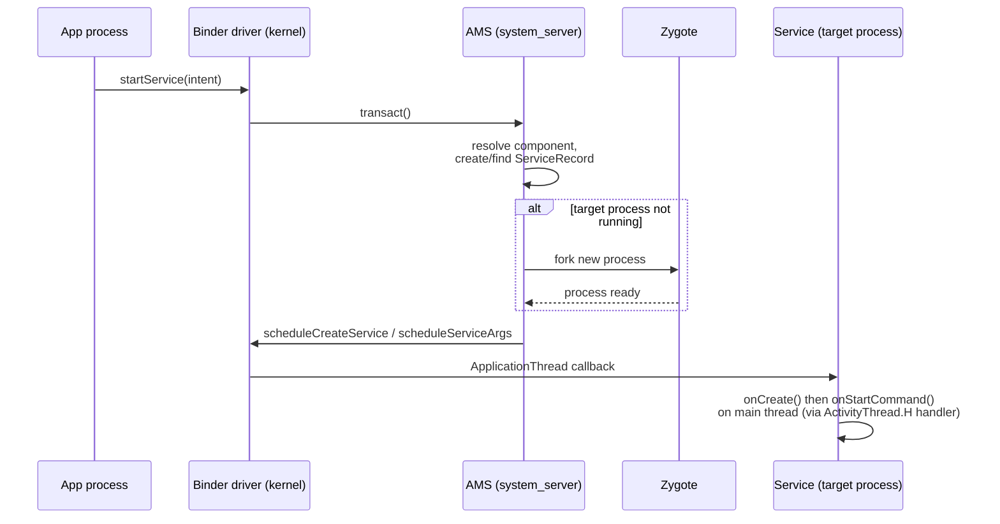
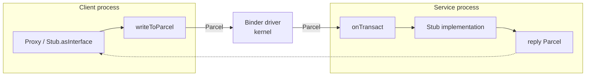

# Services

A `Service` is an application component that runs work **without a UI**, hosted by default on the app's main thread inside the app process. It is not a thread and not a separate process — a common junior mistake. A Service is a *declaration to the system* that your app wants to keep doing something, and a set of lifecycle hooks the system calls. Everything senior about Services is really about one question: **how hard does the OS try to keep your process alive while the Service runs, and what does it demand in return?**

The modern answer, on Android 8+ (API 26), is: it barely tries at all unless the Service is *foreground* and user-visible. That reframes the whole topic — most work that used to be a background `Service` is now wrong, and the correct tool is `WorkManager` or a coroutine scoped to a visible component.

!!! abstract "TL;DR (the senior take)"
    - A Service runs on the **main thread**. You still need your own thread/coroutine for real work.
    - Two orthogonal modes: **started** (`startService`/`startForegroundService`) and **bound** (`bindService`). A Service can be both at once.
    - `onStartCommand` return value controls **restart semantics** after the process is killed.
    - **Background Services are effectively dead** since Android 8. Use `WorkManager` for deferrable/guaranteed work, coroutines for in-process work, and a **foreground service only for ongoing, user-visible work** (music, navigation, fitness, active call).
    - Android 14 (API 34) requires a **declared `foregroundServiceType`** and a matching runtime permission for every FGS.

---

## Service lifecycle

There are two entry paths, and they drive two different lifecycles. A Service instance is a singleton within the process: repeated `startService` calls hit `onStartCommand` again on the *same* instance; `onCreate` runs only once.



| Callback | When it fires | Notes |
|---|---|---|
| `onCreate()` | Once, on first start or first bind | Do one-time setup here, not in a constructor |
| `onStartCommand(intent, flags, startId)` | Every `startService`/`startForegroundService` | Return an `int` restart flag (see below) |
| `onBind(intent)` | First `bindService` | Return an `IBinder`, or `null` if binding unsupported |
| `onUnbind(intent)` | Last client unbinds | Return `true` to have `onRebind` used later |
| `onDestroy()` | Service torn down | Stop threads, release resources; **not guaranteed** if process is killed |

!!! warning "The main-thread trap"
    Every callback above runs on the main thread. Blocking in `onStartCommand` triggers ANR just like blocking in an Activity. Offload to a coroutine (`CoroutineScope(Dispatchers.Default)`), a `HandlerThread`, or an executor, and call `stopSelf(startId)` when the work for that `startId` finishes.

---

## Started vs bound service

These are the two fundamental Service shapes. Knowing exactly how they differ — and how they compose — is a standard senior interview probe.

| Dimension | Started service | Bound service |
|---|---|---|
| Trigger | `startService` / `startForegroundService` | `bindService` |
| Lifetime | Runs until `stopSelf()` / `stopService()` | Lives while ≥1 client is bound |
| Client communication | One-way (Intent extras in); no return channel | Two-way via `IBinder` interface |
| Multiple callers | `onStartCommand` per call, one instance | Ref-counted; `onBind` once, `onDestroy` at last unbind |
| Survives client death | Yes | No — unbinds automatically |
| Typical use | Fire-and-forget ongoing work (playback, upload) | Client needs to call methods / query state (in-process API, cross-process IPC) |
| Restart semantics | Controlled by `onStartCommand` return flag | N/A |

A Service can be **both**: started (so it outlives its clients) *and* bound (so clients can call it while present). A music player is the classic example — `startService` keeps playback alive when the Activity dies; `bindService` lets the visible Activity read the current track and seek. When both apply, the Service is destroyed only after it is *both* stopped **and** has no bound clients.

!!! tip "Rule of thumb"
    If callers only need to *kick off* work → started. If callers need to *talk to* the running component (query, control, subscribe) → bound. Need both → do both, and remember the combined teardown condition.

---

## `onStartCommand` return flags

The return value tells the system what to do if it kills your process *after* `onStartCommand` returns but *before* you call `stopSelf()`. This only matters for **started** services.

| Flag | Recreate after kill? | Redeliver last Intent? | Use when |
|---|---|---|---|
| `START_STICKY` | Yes | No — `onStartCommand` gets a **null** intent | Ongoing service that manages its own state and doesn't depend on the original intent (e.g. a media player waiting for commands) |
| `START_NOT_STICKY` | No (only if there are pending start commands) | N/A | Work that is only meaningful if explicitly re-requested; safe to just drop (most one-shot jobs) |
| `START_REDELIVER_INTENT` | Yes | Yes — last intent redelivered | Work that must complete and is fully described by the intent (e.g. a specific file to process) |

```kotlin
override fun onStartCommand(intent: Intent?, flags: Int, startId: Int): Int {
    // intent may be null on a START_STICKY restart — always guard.
    val url = intent?.getStringExtra(EXTRA_URL)
    if (url == null) {
        stopSelf(startId)          // nothing to do; release this startId
        return START_NOT_STICKY
    }
    scope.launch {
        download(url)
        stopSelf(startId)          // stop only if no newer start arrived
    }
    return START_REDELIVER_INTENT  // must finish; redeliver if killed mid-flight
}
```

!!! note "`stopSelf(startId)` vs `stopSelf()`"
    `stopSelf(startId)` only stops the service if `startId` is the most recent start command — this prevents a race where a later request arrives while an earlier one is finishing. Prefer the `startId` overload whenever multiple starts are possible.

---

## Foreground services

A foreground service is one the user is actively aware of via a **mandatory, non-dismissable notification**. In exchange the system treats the process as near-untouchable — it won't be killed under normal memory pressure and is exempt from most background execution limits while running.

### The startForeground contract

Since Android 8 you start it with `startForegroundService()` (or `ContextCompat.startForegroundService`), and you then have a **hard 5-second window** to call `startForeground(id, notification)` from inside the service, or the system kills the process with a `ForegroundServiceDidNotStartInTimeException` (formerly a plain ANR/crash).

### Android 14 (API 34): typed foreground services

Every foreground service must now declare a **type**, and the type gates behavior:

1. Declare the type in the manifest on the `<service>` element.
2. Declare the matching **runtime permission** (`FOREGROUND_SERVICE_*`) — normal permissions, granted at install, but required.
3. Pass the type when calling `startForeground(id, notification, type)`, or declare it in the manifest and let the system infer it.
4. Some types (e.g. `location`, `camera`, `microphone`, `health`) additionally require the *underlying* runtime permission to already be granted, or `startForeground` throws `SecurityException`.

Types include `mediaPlayback`, `location`, `camera`, `microphone`, `dataSync`, `connectedDevice`, `health`, `phoneCall`, `shortService`, `specialUse`, `remoteMessaging`, `systemExempted`. Google is progressively restricting `dataSync` and `specialUse` — you must justify `specialUse` in Play Console.

```xml
<!-- AndroidManifest.xml -->
<uses-permission android:name="android.permission.FOREGROUND_SERVICE" />
<uses-permission android:name="android.permission.FOREGROUND_SERVICE_MEDIA_PLAYBACK" />
<uses-permission android:name="android.permission.POST_NOTIFICATIONS" /><!-- API 33+ -->

<service
    android:name=".playback.PlaybackService"
    android:foregroundServiceType="mediaPlayback"
    android:exported="false" />
```

```kotlin
class PlaybackService : Service() {

    private val scope = CoroutineScope(SupervisorJob() + Dispatchers.Default)

    override fun onStartCommand(intent: Intent?, flags: Int, startId: Int): Int {
        val notification = buildNotification()
        // API 34+: pass the FGS type explicitly.
        if (Build.VERSION.SDK_INT >= Build.VERSION_CODES.UPSIDE_DOWN_CAKE) {
            startForeground(
                NOTIF_ID,
                notification,
                ServiceInfo.FOREGROUND_SERVICE_TYPE_MEDIA_PLAYBACK,
            )
        } else {
            startForeground(NOTIF_ID, notification)
        }
        scope.launch { play(intent?.data) }
        return START_STICKY
    }

    private fun buildNotification(): Notification {
        val channelId = "playback"
        if (Build.VERSION.SDK_INT >= Build.VERSION_CODES.O) {
            val channel = NotificationChannel(
                channelId, "Playback", NotificationManager.IMPORTANCE_LOW,
            )
            getSystemService(NotificationManager::class.java)
                .createNotificationChannel(channel)
        }
        return NotificationCompat.Builder(this, channelId)
            .setContentTitle("Now playing")
            .setSmallIcon(R.drawable.ic_play)
            .setOngoing(true)
            .build()
    }

    override fun onBind(intent: Intent?): IBinder? = null

    override fun onDestroy() {
        scope.cancel()
        super.onDestroy()
    }
}
```

!!! danger "You cannot start a FGS from the background on Android 12+ (API 31)"
    Launching a foreground service *while your app is in the background* throws `ForegroundServiceStartNotAllowedException`, with a list of exemptions (high-priority FCM, exact alarm, Bluetooth device connection, geofence, etc.). If you need guaranteed background-triggered work, use `WorkManager` and let *it* promote to an expedited/foreground worker — it centralizes these rules for you.

!!! note "`shortService` (API 34)"
    A special short-lived FGS type (~3 minutes) that needs **no** specific permission and no ongoing notification requirement of a specific type — for brief critical completion work (finishing a save). It cannot be started from the background and is timeboxed; overrunning it triggers a timeout callback.

---

## Background (non-foreground) services

Historically you'd `startService()` and the plain background service would keep running. **Since Android 8 (API 26) this is broken by design.** While your app is in the background, the system:

- Disallows starting background services with `startService()` (throws `IllegalStateException`).
- Stops existing background services shortly after the app leaves the foreground (roughly the same window as if `stopService` had been called).

The migration paths:

| Old pattern | Modern replacement |
|---|---|
| Background `Service` for periodic sync | `WorkManager` (`PeriodicWorkRequest`) |
| Background `Service` for guaranteed one-shot work | `WorkManager` (`OneTimeWorkRequest`, `expedited`) |
| Background `Service` for ongoing user-visible work | Foreground service (typed) |
| `Service` + own thread for in-process async | Coroutine scoped to a visible component / `viewModelScope` |
| `IntentService` queued work | `WorkManager`, or `CoroutineWorker` |

---

## Bound services & the local binder pattern

A bound service exposes an API through an `IBinder`. **In-process** (client and service in the same process — the overwhelmingly common case) you use the **local binder** pattern: subclass `Binder`, return `this`/the service, and the client casts and calls methods directly — no marshalling, no IPC overhead.

```kotlin
class LocationService : Service() {

    // Binder handed to in-process clients. No AIDL, no Parcel — direct references.
    inner class LocalBinder : Binder() {
        fun getService(): LocationService = this@LocationService
    }

    private val binder = LocalBinder()
    private val _location = MutableStateFlow<Location?>(null)
    val location: StateFlow<Location?> = _location.asStateFlow()

    override fun onBind(intent: Intent?): IBinder = binder

    fun currentSpeed(): Float = _location.value?.speed ?: 0f
}
```

```kotlin
class TrackerActivity : ComponentActivity() {

    private var service: LocationService? = null

    private val connection = object : ServiceConnection {
        override fun onServiceConnected(name: ComponentName?, binder: IBinder?) {
            // Safe cast only because we're in the same process.
            service = (binder as LocationService.LocalBinder).getService()
        }
        override fun onServiceDisconnected(name: ComponentName?) {
            // Called on unexpected loss (process crash), NOT on normal unbind.
            service = null
        }
    }

    override fun onStart() {
        super.onStart()
        bindService(
            Intent(this, LocationService::class.java),
            connection,
            Context.BIND_AUTO_CREATE, // create the service if not already running
        )
    }

    override fun onStop() {
        super.onStop()
        unbindService(connection)     // ALWAYS pair bind/unbind with lifecycle
        service = null
    }
}
```

!!! warning "Bind/unbind must be lifecycle-balanced"
    Binding in `onStart` and unbinding in `onStop` is the standard pairing. Forgetting `unbindService` leaks the connection and keeps the service alive (`ServiceConnectionLeaked` in logcat). `onServiceDisconnected` fires only on *abnormal* loss (the service process died), never on a clean `unbindService`.

`BIND_AUTO_CREATE` starts the service on bind and tears it down when the last client unbinds — *unless* it was also `startService`-started, in which case the started lifetime keeps it alive.

---

## IntentService / JobIntentService → WorkManager

`IntentService` was the classic "queue of intents processed sequentially on a background thread, self-stops when the queue empties" helper. It is **deprecated** (since API 30) because it cannot start from the background on Android 8+.

- `IntentService` → deprecated. Sequential worker thread + auto-stop.
- `JobIntentService` → the transitional bridge (JobScheduler behind the scenes) — **also deprecated**.
- **`WorkManager`** is the answer for both today: it survives process death and reboots, respects constraints (network, charging), handles backoff/retry, and coordinates with Doze. Use `CoroutineWorker` for suspend-friendly work.

```kotlin
// The modern replacement for a queued IntentService job.
class UploadWorker(ctx: Context, params: WorkerParameters) : CoroutineWorker(ctx, params) {
    override suspend fun doWork(): Result = try {
        uploadPending()
        Result.success()
    } catch (e: IOException) {
        Result.retry()  // WorkManager applies backoff automatically
    }
}

val request = OneTimeWorkRequestBuilder<UploadWorker>()
    .setConstraints(Constraints(requiredNetworkType = NetworkType.CONNECTED))
    .build()
WorkManager.getInstance(context).enqueue(request)
```

---

## Internals: how a Service actually starts

Understanding the plumbing separates senior from mid-level answers. `startService` is not a direct call into your Service — it's an IPC round-trip through the **Activity Manager Service (AMS)**, the system_server component that owns component lifecycles.



- **`ServiceRecord`**: AMS's server-side bookkeeping object for each service — tracks the hosting process, binding clients (`ConnectionRecord`s), start requests (`StartItem`s / `startId`s), foreground state, and restart policy. Your Service instance lives in the app; the `ServiceRecord` is AMS's shadow of it.
- The app's `ApplicationThread` (a Binder stub) receives `scheduleCreateService`/`scheduleServiceArgs`; `ActivityThread` posts these to the main-thread `Handler`, which is *why* callbacks run on the main thread.
- The `onStartCommand` return flag is stored in the `ServiceRecord` so AMS knows whether/how to recreate the service if the process is reaped.

### Binder IPC (bound & cross-process)

Binder is Android's core IPC mechanism — a kernel driver (`/dev/binder`) plus a thread pool. For **in-process** binding, `IBinder` is just a direct object reference (the local binder pattern) — no kernel involvement. For **cross-process** binding, calls are marshalled.



- **`Parcel`**: a high-performance, non-persistent serialization container. It flattens data (and live `IBinder` references / file descriptors) for transport across the kernel boundary. **Never** persist a `Parcel` to disk — it's an in-memory transport format, not `Serializable`.
- **`Parcelable`**: the interface objects implement to write/read themselves to/from a `Parcel`. `@Parcelize` (kotlin-parcelize) generates the boilerplate.
- **AIDL**: for **cross-process** service APIs (e.g. a service exposed to other apps, or a `:remote` process), you define the interface in AIDL; the tool generates a `Stub` (server-side, extends `Binder`) and a `Proxy` (client-side). By default calls are **synchronous and blocking** on the caller, dispatched on a Binder thread-pool thread on the service side — so `onTransact` implementations must be thread-safe and must not block. `oneway` makes a call async/fire-and-forget.
- The Binder transaction buffer is **~1 MB per process, shared across all in-flight transactions** — oversized Parcels throw `TransactionTooLargeException` (the classic cause of "works in debug, crashes with a big bundle").

### Service process priority

AMS assigns every process an **`oom_adj`** score; the Linux low-memory killer reaps the highest scores first. Service state directly moves this score:

| Process state | Relative priority | Killed under memory pressure? |
|---|---|---|
| Foreground (visible Activity / **foreground service**) | Highest | Almost never |
| Visible (bound to a foreground component) | High | Rarely |
| **Service process** (started, background) | Medium | Yes, when memory is tight |
| Cached / empty | Lowest | First to go |

A plain started background service keeps a process at "service" priority — killable. `startForeground` promotes it to foreground priority. This is the *real* reason a foreground service survives: not the notification per se, but the priority bump AMS grants because the notification makes the work user-visible.

---

## Background execution limits

Three overlapping systems throttle background work. Senior candidates should distinguish them precisely.

- **Background service limits (Android 8 / API 26):** as above — you can't start background services from the background, and existing ones are stopped when the app backgrounds. Scope: services specifically.
- **Doze mode:** when the device is stationary, unplugged, and screen-off for a while, the system defers wakelocks, network access, `AlarmManager`, jobs, and syncs into periodic **maintenance windows** (which grow further apart over time). Full Doze needs stationarity; a lighter Doze applies whenever the screen is off on the move. Network and jobs resume in the windows and on plug-in/screen-on.
- **App Standby (+ Standby Buckets, API 28):** unused apps are bucketed **active → working set → frequent → rare → restricted**. The bucket caps how often jobs run, alarms fire, and FCM quota — a rarely used app gets far less background allowance.
- **Battery optimizations / OEM restrictions:** users (and aggressive OEM skins like MIUI, EMUI, OneUI) can put apps in "restricted" states that kill background work entirely. Don't fight this; request `REQUEST_IGNORE_BATTERY_OPTIMIZATIONS` only when genuinely justified (Play polices it), and design for interruption.

!!! tip "How WorkManager wins"
    `WorkManager` is Doze/Standby-aware: it schedules through JobScheduler, coalesces work into maintenance windows, persists across reboots, and respects buckets. You get "run this eventually, reliably, without wasting battery" without hand-writing any of the throttling logic. That's why the modern guidance is "reach for WorkManager first, foreground service only for genuinely ongoing user-visible work."

---

## Strong opinion: services are a last resort

Most "I need a Service" instincts are wrong in 2024+. Decision order:

1. **Is the work tied to a visible screen?** → Coroutine in `lifecycleScope`/`viewModelScope`. No Service.
2. **Is it deferrable/guaranteed background work (sync, upload, cleanup)?** → `WorkManager`. No Service.
3. **Is it ongoing work the user is actively aware of** *right now* (playing music, turn-by-turn navigation, tracking a run, an active call)? → **Foreground service, correctly typed.** This is the *only* case where a raw Service is the right call.
4. **Do you need a client/server API within your app across processes?** → Bound service with AIDL (rare). In-process → local binder, but often a shared singleton/repository is simpler.

Reasons: background services are unreliable on modern Android, drain battery, harm the process priority story, and are the #1 source of "works on my Pixel, dies on the user's Xiaomi" bugs. A foreground service without a real user-visible justification risks Play Console rejection under the foreground-service-type policy.

---

## Interview Q&A

!!! question "1. A Service runs on which thread, and what's the practical consequence?"
    **Answer:** The main (UI) thread of the hosting process. All lifecycle callbacks (`onCreate`, `onStartCommand`, `onBind`) run there. So any blocking work inside a Service will ANR exactly like it would in an Activity — you must offload to a coroutine/executor/`HandlerThread` and self-stop when done. A Service is *not* a background thread; it's a lifecycle contract with the system.

    **Follow-up:** *Then why does `IntentService` seem to run in the background?* Because `IntentService` internally spins up its own `HandlerThread` and processes each intent on it sequentially, auto-stopping when the queue drains — the base `Service` gives you none of that. It's deprecated; `WorkManager`/`CoroutineWorker` replaces it.

!!! question "2. Explain `START_STICKY` vs `START_NOT_STICKY` vs `START_REDELIVER_INTENT`."
    **Answer:** They control what AMS does if it kills the process after `onStartCommand` returns but before `stopSelf`. `START_STICKY` recreates the service and calls `onStartCommand` with a **null** intent (good for state-managing services like a media player). `START_NOT_STICKY` doesn't recreate unless there are pending starts (good for droppable one-shots). `START_REDELIVER_INTENT` recreates *and* redelivers the last intent (good for must-complete, intent-described work like processing a specific file).

    **Follow-up:** *With `START_STICKY`, the intent is null on restart — how do you handle that?* Guard for null and either restore state from persistence or just idle waiting for the next real command; never assume the original extras are present.

!!! question "3. Walk me through what actually happens when I call `startService`."
    **Answer:** It's a Binder IPC to AMS in system_server, not a direct call. AMS resolves the component, creates/finds a `ServiceRecord`, forks a new process via Zygote if needed, then calls back into the app's `ApplicationThread` (`scheduleCreateService`/`scheduleServiceArgs`). `ActivityThread` posts those to the main-thread Handler, which runs `onCreate` (first time) then `onStartCommand`. The return flag is stored in the `ServiceRecord` for restart decisions, and the service moves the process's `oom_adj` to "service" priority.

    **Follow-up:** *What's a `ServiceRecord`?* AMS's server-side bookkeeping object mirroring your service — hosting process, binding `ConnectionRecord`s, start items/`startId`s, foreground state, restart policy. Your instance is in the app; the `ServiceRecord` is AMS's shadow of it.

!!! question "4. When is a foreground service the right choice, and what does Android 14 require?"
    **Answer:** Only for **ongoing work the user is actively aware of**: media playback, navigation, fitness tracking, active calls, ongoing file transfer they initiated. Android 14 (API 34) requires: a declared `android:foregroundServiceType` on the `<service>`, the matching `FOREGROUND_SERVICE_*` runtime permission, passing the type into `startForeground`, and — for sensitive types like location/camera/mic — the underlying runtime permission already granted or `startForeground` throws `SecurityException`. You also have ~5 seconds after `startForegroundService()` to call `startForeground()` or the process is killed.

    **Follow-up:** *Why can't I just start a foreground service from a background broadcast to do my sync?* Android 12+ blocks starting a FGS from the background (`ForegroundServiceStartNotAllowedException`) outside a short exemption list. Deferrable background work belongs in `WorkManager`, which can promote to an expedited/foreground worker under the right conditions and handles the exemption rules for you.

!!! question "5. Local binder pattern vs AIDL — when each, and what's the risk with AIDL?"
    **Answer:** Use the **local binder** when the service and clients are in the **same process** (the common case): subclass `Binder`, return the service, client casts and calls methods directly — zero marshalling. Use **AIDL** only when crossing process boundaries (exposing a service to other apps or a `:remote` process); it generates a `Stub`/`Proxy` and marshals args through `Parcel`s over the Binder driver.

    **Follow-up:** *What can go wrong with AIDL calls?* They're synchronous and block the caller by default while executing on a Binder thread-pool thread on the server side — so the server implementation must be thread-safe and non-blocking, and callers should avoid calling from the UI thread for slow ops. Large payloads risk `TransactionTooLargeException` because the per-process Binder transaction buffer is only ~1 MB shared across all in-flight transactions. Use `oneway` for fire-and-forget async.
