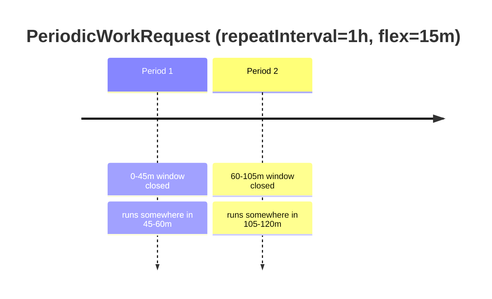
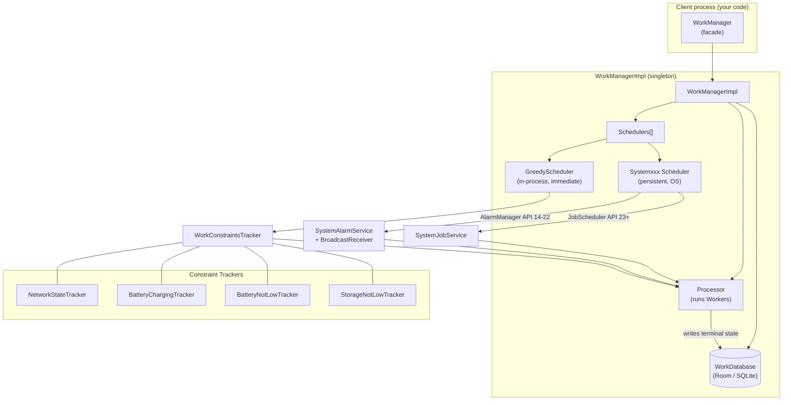
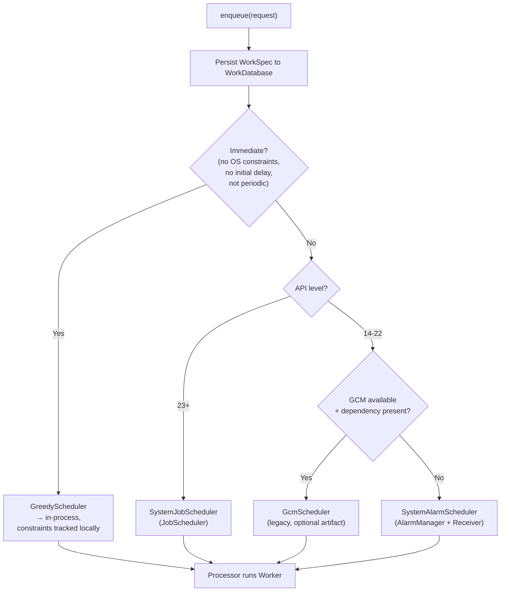
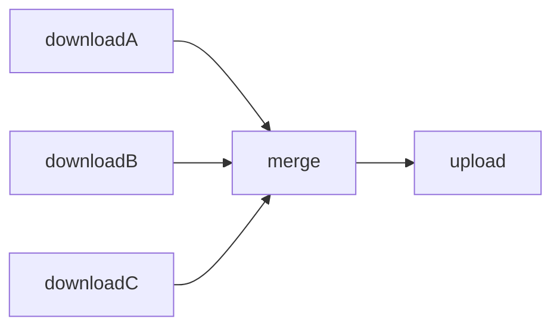
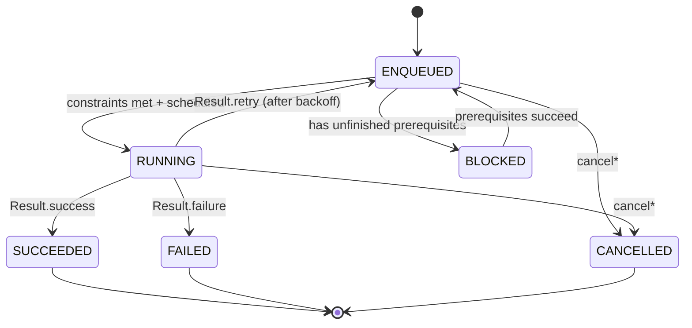

# WorkManager — Internals

WorkManager is the Jetpack library for **deferrable, guaranteed** background work: work that must eventually run, even if the app exits, the process is killed, or the device reboots. It is the recommended replacement for the tangle of `FirebaseJobDispatcher`, `GcmNetworkManager`, `JobScheduler`, and hand-rolled `AlarmManager` + `BroadcastReceiver` that used to be needed to cover every API level.

!!! abstract "The one-sentence mental model"
    WorkManager is a **persistent job queue backed by a Room database**, with a pluggable OS-scheduler on the back end and constraint trackers on the front end. You enqueue an intent-to-run; WorkManager persists it, picks the best OS primitive for the current API level, waits for constraints, executes your `Worker`, records the terminal state, and honors retries/chaining — all surviving process death and reboot.

---

## Why WorkManager (and when NOT to use it)

The value proposition is **durability of intent**. Once `enqueue()` returns, the request is committed to disk. From that point WorkManager owns the lifecycle.

| Property | How it is achieved |
|---|---|
| Survives process death | Request persisted in `WorkDatabase` (Room/SQLite) before enqueue returns |
| Survives reboot | `RescheduleReceiver` listens for `BOOT_COMPLETED` and re-schedules `ENQUEUED` work |
| Respects OS background limits | Delegates to `JobScheduler` (Doze, App Standby buckets aware) |
| Guaranteed eventual execution | Terminal state recorded only after `doWork()` returns; retries re-enqueue |
| Constraint-gated | Won't run until network/charging/idle conditions are met |

!!! warning "WorkManager is NOT for..."
    - **Exact-time alarms** (alarm clock, calendar reminder) → use `AlarmManager.setExactAndAllowWhileIdle`.
    - **Immediate, in-process work tied to a visible UI** → use coroutines/`lifecycleScope`. WorkManager work can be deferred by the OS by minutes.
    - **Long-running high-priority user-visible tasks** (media playback, active navigation, big user-initiated upload) → use a **foreground `Service`** directly. (WorkManager *can* run a long-running worker as a foreground service via `setForeground()`, but a plain `Service` is more appropriate when the work is inherently tied to a visible session.)
    - **Sub-15-minute periodic polling** → not possible; the minimum period is 15 minutes.

---

## Request types

### OneTimeWorkRequest

Runs once. Supports initial delay, constraints, backoff, tags, expedited, input data, and chaining.

### PeriodicWorkRequest

Runs repeatedly on an interval. Key internals:

- **Minimum interval is 15 minutes** (`PeriodicWorkRequest.MIN_PERIODIC_INTERVAL_MILLIS`). Ask for less, it is clamped to 15.
- Optional **flex interval** (min 5 min): the work may run anywhere within the flex window at the *end* of each period, letting the OS batch it.
- Periodic work **cannot be chained** and its `Result.retry()` does not apply the way one-time backoff does — the next period simply runs again on schedule. `Result.success()` and `Result.failure()` are treated the same for scheduling purposes (both just wait for the next period); `retry()` triggers backoff before the next run.
- Interval is **best-effort**, not exact. Doze, batching, and App Standby buckets stretch it.



### Worker / CoroutineWorker / RxWorker

| Class | Threading | `doWork()` returns | Use when |
|---|---|---|---|
| `Worker` | Runs `doWork()` synchronously on a **background thread** from WorkManager's `Executor` | `Result` | Simple blocking work |
| `CoroutineWorker` | `doWork()` is a **`suspend` fun**; runs in `Dispatchers.Default` by default (override `coroutineContext`) | `Result` | Kotlin, suspend APIs, structured concurrency; cancellation is cooperative via coroutine cancellation |
| `RxWorker` | `createWork()` returns `Single<Result>` on RxJava scheduler | `Single<Result>` | RxJava codebases |
| `ListenableWorker` | Base class; `startWork()` returns `ListenableFuture<Result>` | future | Full manual control / callback-based APIs |

`Worker`, `CoroutineWorker`, and `RxWorker` are all conveniences over `ListenableWorker`.

```kotlin
class SyncWorker(
    appContext: Context,
    params: WorkerParameters,
) : CoroutineWorker(appContext, params) {

    override suspend fun doWork(): Result {
        val userId = inputData.getString(KEY_USER_ID)
            ?: return Result.failure()   // bad input → don't retry

        return try {
            // setForeground makes this an expedited/long-running FGS worker
            setForeground(createForegroundInfo())
            repository.sync(userId)       // suspend; cancellation-cooperative
            val out = workDataOf(KEY_SYNCED_COUNT to repository.count)
            Result.success(out)
        } catch (e: IOException) {
            Result.retry()                // transient → backoff + re-enqueue
        } catch (e: Exception) {
            Result.failure()              // permanent → give up
        }
    }

    override suspend fun getForegroundInfo() = createForegroundInfo()

    private fun createForegroundInfo(): ForegroundInfo { /* notification */ }

    companion object {
        const val KEY_USER_ID = "user_id"
        const val KEY_SYNCED_COUNT = "synced_count"
    }
}
```

!!! note "doWork() runs on a background thread already"
    For plain `Worker`, don't spin up your own thread inside `doWork()` — you're already off the main thread. For `CoroutineWorker`, don't block; suspend.

---

## Configuration

### Constraints

Work stays in `ENQUEUED` until **all** constraints are satisfied. WorkManager subscribes to OS signals via **constraint trackers** and only hands the request to the scheduler-runner when they are all met (for the `JobScheduler` path, most constraints are expressed natively to `JobScheduler`; on older paths WorkManager tracks them itself).

| Constraint | Builder | Notes |
|---|---|---|
| Network type | `setRequiredNetworkType(NetworkType.X)` | `NOT_REQUIRED`, `CONNECTED`, `UNMETERED`, `NOT_ROAMING`, `METERED`, `TEMPORARILY_UNMETERED` |
| Charging | `setRequiresCharging(true)` | Device on power |
| Battery not low | `setRequiresBatteryNotLow(true)` | Above the system low-battery threshold |
| Storage not low | `setRequiresStorageNotLow(true)` | Above the low-storage threshold |
| Device idle | `setRequiresDeviceIdle(true)` | API 23+; Doze-idle |
| Content URI | `addContentUriTrigger(uri, triggerForDescendants)` | API 24+; fire when a `content://` changes |

```kotlin
val constraints = Constraints.Builder()
    .setRequiredNetworkType(NetworkType.UNMETERED)
    .setRequiresCharging(true)
    .setRequiresBatteryNotLow(true)
    .build()
```

### Input / Output Data

`Data` is a persisted key-value bag (primitives + their arrays + `String`). Built with `workDataOf(...)` or `Data.Builder`.

!!! danger "10KB serialization limit"
    A `Data` blob is capped at **`Data.MAX_DATA_BYTES` = 10,240 bytes** after serialization. Exceeding it throws `IllegalStateException` at build/enqueue time. For anything bigger — bitmaps, files, large JSON — write to disk/DB and pass a **URI or row id**, not the payload.

Output flows to the next node in a chain as input, and to observers via `WorkInfo.outputData`.

### Backoff (retry policy)

When a worker returns `Result.retry()`, WorkManager re-enqueues it after a backoff delay.

| Policy | Delay formula (n = retry attempt) | Shape |
|---|---|---|
| `BackoffPolicy.LINEAR` | `delay = backoffDelay × n` | 10s, 20s, 30s, … |
| `BackoffPolicy.EXPONENTIAL` | `delay = backoffDelay × 2^(n-1)` | 10s, 20s, 40s, 80s, … |

- Default: **`EXPONENTIAL`, 30 seconds** (`WorkRequest.DEFAULT_BACKOFF_DELAY_MILLIS`).
- Minimum backoff = `MIN_BACKOFF_MILLIS` = **10s**; maximum = `MAX_BACKOFF_MILLIS` = **5 hours**.
- `runAttemptCount` (available in the worker) increments each retry — cap your own retries with it.

### Tags, initial delay, expedited

```kotlin
val request = OneTimeWorkRequestBuilder<SyncWorker>()
    .setConstraints(constraints)
    .setInputData(workDataOf("user_id" to "42"))
    .setInitialDelay(15, TimeUnit.MINUTES)                       // earliest start
    .setBackoffCriteria(BackoffPolicy.EXPONENTIAL, 30, TimeUnit.SECONDS)
    .addTag("sync")                                              // group label for query/cancel
    .setExpedited(OutOfQuotaPolicy.RUN_AS_NON_EXPEDITED_WORK_REQUEST)
    .build()

WorkManager.getInstance(context).enqueue(request)
```

**Expedited work** (`setExpedited`, API 12+/S with graceful fallback):

- Signals *"run ASAP, this is important and short"*. On Android 12+ it maps to an **expedited `JobScheduler` job**; on older APIs WorkManager falls back to running it as a **foreground service** (so you must implement `getForegroundInfo()`).
- Subject to a **system quota** per app (based on App Standby bucket). When quota is exhausted, `OutOfQuotaPolicy` decides:
    - `RUN_AS_NON_EXPEDITED_WORK_REQUEST` — downgrade to a normal deferred job.
    - `DROP_WORK_REQUEST` — cancel it.
- Expedited work **cannot have initial delay** and its constraints are limited (network, storage — not idle).

---

## Architecture internals



### Key components

| Component | Role |
|---|---|
| **`WorkManager`** | Public facade / abstract class. `getInstance(context)` returns the singleton. |
| **`WorkManagerImpl`** | The real singleton. Holds the DB, processor, scheduler list, task executor. Initialized via `Configuration` (startup `Initializer` by default, or manual `WorkManager.initialize`). |
| **`WorkDatabase`** | A **Room database** (`androidx.work.impl.WorkDatabase`). Tables: `WorkSpec` (the work + its config + state), `WorkTag`, `Dependency` (chain edges), `WorkName` (unique work), `WorkProgress`, `SystemIdInfo` (maps WorkSpec → JobScheduler job id), `Preference`. This is the source of truth. |
| **`Processor`** | Owns actual execution. Creates a `WorkerWrapper` per running work, runs the `ListenableWorker` on the task executor, and reports completion. Tracks which work ids are currently running. |
| **`Scheduler`** (interface) | Decides *when/where* work gets dispatched. Multiple implementations run together. |
| **`GreedyScheduler`** | In-process scheduler for **immediate, non-constrained** (or in-process-satisfiable) one-time work. Uses `WorkConstraintsTracker`; schedules straight into the `Processor` without going through the OS. Also handles delayed work via a `DelayedWorkTracker`. |
| **`SystemJobScheduler`** | Wraps the framework **`JobScheduler`** (API 23+). Persistent; work survives reboot. |
| **`SystemAlarmScheduler`** | **`AlarmManager` + `SystemAlarmService` + `BroadcastReceiver`** (API 14–22). |
| **Constraint trackers** | `NetworkStateTracker`, `BatteryChargingTracker`, `BatteryNotLowTracker`, `StorageNotLowTracker`, `ConstraintController`s — observe OS broadcasts/callbacks and notify listeners when constraints flip. |
| **`RescheduleReceiver`** | `BOOT_COMPLETED` / timezone / package-replaced receiver that re-schedules persisted work after reboot. |

### Scheduler selection



| API range | Persistent scheduler | Mechanism |
|---|---|---|
| **23+** | `SystemJobScheduler` | Framework `JobScheduler` (Doze/Standby-aware) |
| **14–22** | `SystemAlarmScheduler` | `AlarmManager` inexact alarms → `SystemAlarmService` (a broadcast-driven, wake-lock-holding command service) |
| **14–22 (with optional `work-gcm`)** | `GcmScheduler` | GCM Network Manager (deprecated; separate artifact) |
| Any | `GreedyScheduler` | In-process, for immediate work; never touches the OS scheduler |

!!! info "Why the DB is the source of truth"
    The OS scheduler only holds an opaque job id (stored in `SystemIdInfo`). All the real detail — worker class, input data, constraints, state, run attempt count, chain edges — lives in `WorkSpec`. On reboot the OS may drop jobs; WorkManager rebuilds them from the DB.

### Execution flow

1. Scheduler decides the work is runnable → calls into `Processor.startWork(id)`.
2. `Processor` builds a `WorkerWrapper`, instantiates the `ListenableWorker` via the **`WorkerFactory`**, injects `WorkerParameters` (input data, tags, run attempt count, runtime extras).
3. `WorkerWrapper` invokes `doWork()` / `startWork()` on the configured executor.
4. Worker returns a **`Result`**:

| `Result` | Meaning | State recorded |
|---|---|---|
| `Result.success(outputData?)` | Done | `SUCCEEDED` — dependent chained work becomes eligible |
| `Result.failure(outputData?)` | Permanent failure | `FAILED` — **dependent chained work is also marked `FAILED`/cancelled** |
| `Result.retry()` | Transient failure | `ENQUEUED` again after backoff; `runAttemptCount++` |

5. `WorkerWrapper` writes the terminal state to `WorkDatabase`, releases wake locks, and (via the OS scheduler) reschedules next steps.

!!! note "Constraint tracking during execution"
    When a constraint is lost *while the worker runs* (e.g., network drops on an `UNMETERED`-required job on the `JobScheduler` path), the framework **stops the worker** — `isStopped` becomes true / the coroutine is cancelled — and WorkManager treats it as a retry. Always check `isStopped` (or honor coroutine cancellation) in long loops.

---

## Chaining

Build DAGs of dependent work. Successful completion of a node feeds its `outputData` as input to the next; failure/cancellation propagates downstream.

```kotlin
WorkManager.getInstance(context)
    .beginWith(listOf(downloadA, downloadB, downloadC))   // 3 run in PARALLEL
    .then(merge)                                           // waits for all 3
    .then(upload)                                          // sequential
    .enqueue()
```

- `beginWith(work)` / `beginWith(listOf(...))` → returns a **`WorkContinuation`**.
- `.then(work)` chains sequentially; the previous step(s) must all succeed first.
- **Parallel**: pass a `List` to `beginWith`/`then` — all run concurrently, and the next `.then` fans them in.
- `WorkContinuation.combine(listOf(cont1, cont2))` joins multiple independent continuations into one, gated on all of them.
- Output merging when multiple parents feed one child: an **`InputMerger`** runs. Default `OverwritingInputMerger` (last writer wins per key); `ArrayCreatingInputMerger` collects same-key values into arrays.



!!! warning "Failure semantics"
    If any node returns `Result.failure()`, all its **dependent** (downstream) work is marked failed and will not run. Parallel siblings that already completed are unaffected. Design chains so a retryable transient error uses `Result.retry()`, not `failure()`.

---

## Unique work

Deduplicate by a **string name**, so you never enqueue two of the same logical job.

```kotlin
WorkManager.getInstance(context).enqueueUniqueWork(
    "sync",                                  // unique name
    ExistingWorkPolicy.KEEP,                 // conflict policy
    syncRequest,
)
```

| `ExistingWorkPolicy` | Behavior when a job with that name already exists (pending/running) |
|---|---|
| `REPLACE` | Cancel the existing one and enqueue the new one |
| `KEEP` | Keep the existing one; **drop** the new request (no-op) |
| `APPEND` | Chain the new work *after* the existing one; if the existing is `FAILED`/`CANCELLED`, the new work is also cancelled |
| `APPEND_OR_REPLACE` | Like `APPEND`, but if the existing chain is in a terminal failed/cancelled state, start fresh instead of cancelling |

For periodic work, use **`enqueueUniquePeriodicWork(name, ExistingPeriodicWorkPolicy.KEEP | UPDATE, request)`**. `KEEP` avoids resetting the schedule on every app launch (a classic bug: `REPLACE`/`UPDATE` on every start resets the 15-min timer so it never fires). `UPDATE` (API-recent) changes the spec while preserving schedule/state where possible.

!!! tip "Idiomatic periodic setup"
    Enqueue periodic sync once with `enqueueUniquePeriodicWork(name, KEEP, request)` in `Application.onCreate` or a startup `Initializer`. `KEEP` makes repeated calls harmless.

---

## Observing work

State machine:



`SUCCEEDED`, `FAILED`, `CANCELLED` are **terminal**. `BLOCKED` = waiting on chain prerequisites.

```kotlin
val wm = WorkManager.getInstance(context)

// Flow (androidx.work:work-runtime-ktx)
wm.getWorkInfoByIdFlow(request.id).collect { info ->
    when (info?.state) {
        WorkInfo.State.RUNNING   -> showProgress(info.progress.getInt("pct", 0))
        WorkInfo.State.SUCCEEDED -> showResult(info.outputData.getInt("synced_count", 0))
        WorkInfo.State.FAILED    -> showError()
        else -> Unit
    }
}

// Or LiveData
wm.getWorkInfoByIdLiveData(request.id).observe(owner) { /* ... */ }

// Query APIs: by id, by tag, by unique name
wm.getWorkInfosByTagFlow("sync")
wm.getWorkInfosForUniqueWorkFlow("sync")
```

- **Progress**: inside a worker call `setProgress(workDataOf("pct" to 40))`; readable via `WorkInfo.progress` while `RUNNING`.
- Observers survive config changes when scoped to a `ViewModel`/lifecycle.

---

## Cancellation

```kotlin
wm.cancelWorkById(request.id)
wm.cancelAllWorkByTag("sync")
wm.cancelUniqueWork("sync")
wm.cancelAllWork()                 // nuclear; avoid in libraries
```

Cancellation is **cooperative** for already-running work:

- The worker's `isStopped` flag flips to `true`; for `CoroutineWorker` the coroutine is **cancelled** (so `ensureActive()` / suspend points throw `CancellationException`).
- `onStopped()` is called — release resources there.
- The returned `Result` after a stop is ignored; state goes to `CANCELLED`.

!!! note "Why check isStopped"
    A worker can be stopped for cancellation, constraint loss, or OS reclaiming the execution window (10-minute cap on `JobScheduler` work). Long loops must poll `isStopped` (or respect coroutine cancellation) to exit promptly and let WorkManager reschedule.

---

## Testing

`work-testing` artifact provides synchronous drivers so you don't wait on real constraints/delays.

```kotlin
@Before
fun setup() {
    val config = Configuration.Builder()
        .setMinimumLoggingLevel(Log.DEBUG)
        .setExecutor(SynchronousExecutor())    // run inline, no threads
        .build()
    WorkManagerTestInitHelper.initializeTestWorkManager(context, config)
}

@Test
fun syncWorker_meetsConstraints_succeeds() {
    val request = OneTimeWorkRequestBuilder<SyncWorker>()
        .setConstraints(Constraints.Builder().setRequiresCharging(true).build())
        .setInitialDelay(10, TimeUnit.MINUTES)
        .build()

    val wm = WorkManager.getInstance(context)
    val driver = WorkManagerTestInitHelper.getTestDriver(context)!!

    wm.enqueue(request).result.get()          // block until enqueued

    driver.setAllConstraintsMet(request.id)   // pretend charging etc.
    driver.setInitialDelayMet(request.id)     // skip the 10-min delay
    // driver.setPeriodDelayMet(id)           // for PeriodicWorkRequest

    val info = wm.getWorkInfoById(request.id).get()
    assertThat(info.state).isEqualTo(WorkInfo.State.SUCCEEDED)
}
```

- **`WorkManagerTestInitHelper`** installs a test `WorkManager` with a `SynchronousExecutor`.
- **`TestDriver`** manually satisfies gates: `setAllConstraintsMet(id)`, `setInitialDelayMet(id)`, `setPeriodDelayMet(id)`.
- For unit-testing a worker's logic in isolation, use **`TestWorkerBuilder`** (for `Worker`) / **`TestListenableWorkerBuilder`** (for `CoroutineWorker`/`ListenableWorker`) to construct it with fake input data and run `doWork()` directly.

---

## Dependency injection: HiltWorker + custom WorkerFactory

By default WorkManager instantiates workers via `DefaultWorkerFactory`, which needs a `(Context, WorkerParameters)` constructor — so it can't inject your repositories. Two ways to fix it.

### Custom WorkerFactory (manual)

```kotlin
class SyncWorkerFactory(
    private val repository: SyncRepository,
) : WorkerFactory() {
    override fun createWorker(
        appContext: Context,
        workerClassName: String,
        params: WorkerParameters,
    ): ListenableWorker? = when (workerClassName) {
        SyncWorker::class.java.name -> SyncWorker(appContext, params, repository)
        else -> null   // fall through to default factory for other workers
    }
}

// Provide it via Configuration (disable the default startup Initializer first)
class App : Application(), Configuration.Provider {
    override val workManagerConfiguration: Configuration
        get() = Configuration.Builder()
            .setWorkerFactory(SyncWorkerFactory(repository))
            .build()
}
```

### HiltWorker (idiomatic)

```kotlin
@HiltWorker
class SyncWorker @AssistedInject constructor(
    @Assisted appContext: Context,
    @Assisted params: WorkerParameters,
    private val repository: SyncRepository,   // injected by Hilt
) : CoroutineWorker(appContext, params) {
    override suspend fun doWork(): Result { /* ... */ return Result.success() }
}
```

```kotlin
@HiltAndroidApp
class App : Application(), Configuration.Provider {
    @Inject lateinit var workerFactory: HiltWorkerFactory
    override val workManagerConfiguration: Configuration
        get() = Configuration.Builder()
            .setWorkerFactory(workerFactory)   // Hilt-provided
            .build()
}
```

!!! danger "Disable the default initializer or Hilt injection won't take effect"
    Because you supply `Configuration` via `Configuration.Provider`, you must **remove the automatic `WorkManagerInitializer`** so it doesn't initialize WorkManager first with the default factory:
    ```xml
    <provider
        android:name="androidx.startup.InitializationProvider"
        android:authorities="${applicationId}.androidx-startup"
        android:exported="false"
        tools:node="merge">
        <meta-data
            android:name="androidx.work.WorkManagerInitializer"
            android:value="androidx.startup"
            tools:node="remove" />
    </provider>
    ```
    `HiltWorkerFactory` is a **delegating** factory: it routes each `@HiltWorker` class to its generated `AssistedFactory` and returns `null` for unknown classes so other factories/the default can handle them.

---

## Interview Q&A

!!! question "1. When would you choose WorkManager over a foreground Service, JobScheduler, or AlarmManager?"
    **Answer:** WorkManager for **deferrable work that must be guaranteed** to run eventually and should survive process death/reboot — sync, upload, log flushing, periodic cleanup. It's a compatibility wrapper that picks `JobScheduler` (23+) or `AlarmManager` (14–22) for you and persists intent in Room. Use a **foreground Service** for ongoing, user-visible work that must run *now* (media, active navigation). Use **`AlarmManager` (setExactAndAllowWhileIdle)** for exact wall-clock alarms. Use **`JobScheduler` directly** almost never anymore — WorkManager is the recommended layer on top of it.

    *Follow-up: Is WorkManager appropriate for a 30-second upload the moment the user taps "send"?* Not really — that's immediate, user-initiated work; a coroutine or foreground Service is more responsive. If it must survive app-kill, use expedited work with `setForeground`, but understand it's still subject to quota and OS deferral.

!!! question "2. What actually persists WorkManager's guarantee across reboots and process death?"
    **Answer:** The **`WorkDatabase`** (a Room/SQLite DB). `enqueue()` writes the `WorkSpec` (worker class, constraints, state, input data, run attempt count, chain edges) to disk *before returning*. The OS scheduler only stores an opaque job id (in `SystemIdInfo`). On `BOOT_COMPLETED`, `RescheduleReceiver` reads the DB and re-registers still-`ENQUEUED` work with the OS scheduler.

    *Follow-up: What happens to work that was `RUNNING` when the process died?* It wasn't in a terminal state, so on restart WorkManager sees it as incomplete and reschedules it — which is why workers must be **idempotent**.

!!! question "3. Explain the scheduler layering — GreedyScheduler vs SystemJobScheduler."
    **Answer:** WorkManager holds a list of `Scheduler`s. **`GreedyScheduler`** runs in-process for immediate work (no OS constraints, no delay, non-periodic): it tracks constraints locally via `WorkConstraintsTracker` and dispatches straight to the `Processor`, avoiding OS scheduling latency. **`SystemJobScheduler`** wraps framework `JobScheduler` (API 23+) for persistent/constrained/delayed/periodic work; on API 14–22 `SystemAlarmScheduler` uses `AlarmManager` + a broadcast-driven `SystemAlarmService`. All of them ultimately call into the `Processor`, which builds a `WorkerWrapper` and runs your `ListenableWorker`.

    *Follow-up: Why bother with GreedyScheduler if JobScheduler exists?* Latency and cost — for immediate in-process work you don't want to round-trip through the framework job service; GreedyScheduler runs it as soon as constraints allow.

!!! question "4. Walk through the Result types and how they interact with backoff and chaining."
    **Answer:** `doWork()` returns `success` (→ `SUCCEEDED`, dependents become eligible, optional output data flows forward), `failure` (→ `FAILED`, **downstream chained work is also cancelled/failed**), or `retry` (→ back to `ENQUEUED` after a **backoff delay**, `runAttemptCount++`). Backoff is `LINEAR` (delay × n) or `EXPONENTIAL` (delay × 2^(n-1)), default `EXPONENTIAL`/30s, clamped to [10s, 5h]. Choose `retry` only for transient errors (network) and `failure` for permanent ones (bad input) — otherwise you either spin forever or wrongly kill a chain.

    *Follow-up: How do you stop infinite retries?* Read `runAttemptCount` in the worker and return `failure()` past a threshold.

!!! question "5. What are the constraints on Data payloads and periodic work, and what bugs do they cause?"
    **Answer:** `Data` is capped at **10KB** (`MAX_DATA_BYTES`) after serialization — exceed it and enqueue throws; pass a URI/id and store the blob elsewhere. Periodic work has a **15-minute minimum interval** (clamped up), an optional 5-min flex window, is **best-effort** (Doze/Standby stretch it), and **cannot be chained**. Classic bug: calling `enqueueUniquePeriodicWork` with `REPLACE`/`UPDATE` on every app launch resets the interval so it never fires — use **`KEEP`**.

    *Follow-up: Why doesn't my periodic worker run exactly every 15 minutes?* App Standby buckets, Doze, and OS batching defer it; WorkManager guarantees *eventual* execution per period, not punctuality.

!!! question "6. How do you inject dependencies into a Worker, and what's the gotcha with Hilt?"
    **Answer:** The default factory only supports a `(Context, WorkerParameters)` constructor. Provide a **custom `WorkerFactory`** (or `HiltWorkerFactory` via `@HiltWorker` + `@AssistedInject`) through `Configuration.Provider.workManagerConfiguration`. **Gotcha:** you must remove the automatic `androidx.work.WorkManagerInitializer` from the manifest (`tools:node="remove"` on its `<meta-data>`), otherwise App Startup initializes WorkManager with the *default* factory before your `Configuration.Provider` is consulted, and injection silently fails at runtime with an instantiation exception.

    *Follow-up: How does HiltWorkerFactory dispatch to the right worker?* It's a delegating factory holding a map of `@HiltWorker` classes → generated assisted factories; it returns `null` for classes it doesn't know, letting the chain fall back to the default factory.
