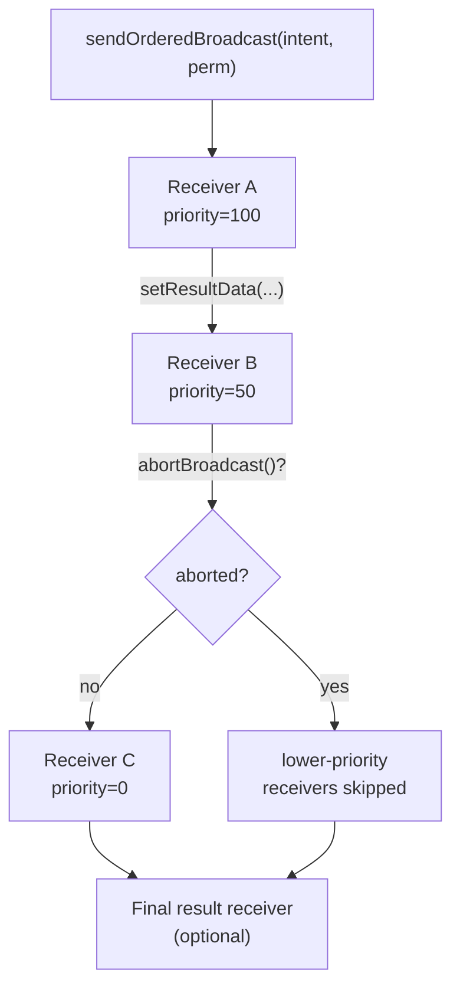
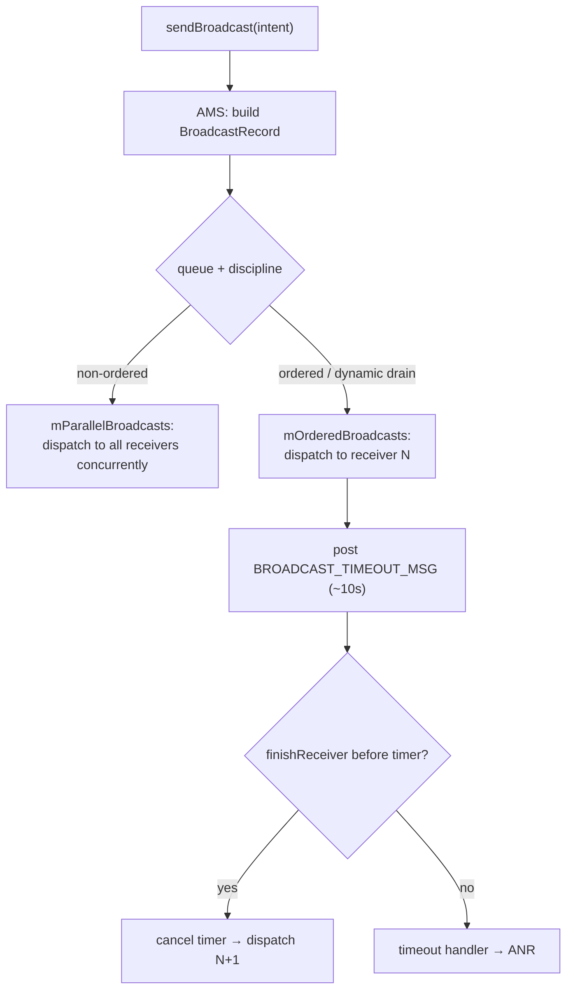

# BroadcastReceiver

A `BroadcastReceiver` is one of Android's four component types. It lets an app respond to system-wide or app-scoped *events* delivered as `Intent`s — connectivity changes, boot completion, battery state, alarms firing, custom app signals. It is a pub/sub inbox: the system (or another component) publishes an `Intent`, and every receiver registered for that action gets a callback.

At senior level the interesting part is almost never "how do I write `onReceive`" — it's *when a broadcast is the wrong tool*, the ANR and lifecycle traps, and the platform restrictions (Android 8 implicit-broadcast ban, Android 13/14 exported flag) that break naive code in production.

!!! abstract "TL;DR"
    - `onReceive()` runs on the **main thread** with a hard **~10s** window before ANR. No long work, no UI, no async you don't `await`.
    - **Static (manifest)** receivers wake your process even when dead; **dynamic (`registerReceiver`)** receivers live only while registered and are tied to a component's lifecycle. Forgetting `unregisterReceiver` leaks the receiver (and its enclosing Activity/Context).
    - Android 8+ **bans most implicit broadcasts from manifest registration**. Register dynamically or use one of the exempted actions.
    - Android 13 (API 33)+ requires `RECEIVER_EXPORTED` / `RECEIVER_NOT_EXPORTED` on runtime registration for non-system broadcasts; enforced (crash) at API 34 for apps targeting 34.
    - For **in-app** eventing, `LocalBroadcastManager` is deprecated — use a `SharedFlow`/`StateFlow` or `LiveData`. For **background work**, use `WorkManager`. Reach for `BroadcastReceiver` only for genuine system events.

---

## The basics

A receiver subclasses `BroadcastReceiver` and implements a single method:

```kotlin
class ConnectivityReceiver : BroadcastReceiver() {
    override fun onReceive(context: Context, intent: Intent) {
        val action = intent.action ?: return
        // Runs on the MAIN THREAD. Return fast.
        Log.d("Conn", "Received $action")
    }
}
```

Broadcasts come in two flavors:

- **System broadcasts** — sent by the framework (`ACTION_BOOT_COMPLETED`, `ACTION_AIRPLANE_MODE_CHANGED`, `ACTION_TIMEZONE_CHANGED`, `ACTION_POWER_CONNECTED`, etc.).
- **Custom broadcasts** — sent by your own app via `sendBroadcast(intent)`, `sendOrderedBroadcast(...)`, or (historically) `LocalBroadcastManager`.

And two delivery styles:

- **Normal** (`sendBroadcast`) — asynchronous, delivered to all matching receivers in undefined order, no result passing.
- **Ordered** (`sendOrderedBroadcast`) — serial, priority-ordered, each receiver can abort or mutate a shared result.

---

## `onReceive` constraints

This is the single most tested area. `onReceive` is not a general-purpose callback — it runs under strict constraints:

!!! danger "The 10-second rule"
    `onReceive()` executes on the **main thread** of the receiving process. If it does not return within **~10 seconds** (foreground) the system raises an **ANR** ("Application Not Responding"). For a manifest-declared receiver the process may be low priority, so the effective budget is far smaller — treat it as **milliseconds, not seconds**.

Consequences that follow directly:

- **No blocking / long work.** No network, no disk-heavy I/O, no `Thread.sleep`. If you must do real work, hand off to `WorkManager` / `JobScheduler` / a foreground service, or use `goAsync()` (below) for a *short* bounded extension.
- **No UI.** You cannot reliably show UI from `onReceive`. Post a notification or start an Activity intent instead — and even starting Activities from the background is restricted on Android 10+.
- **The receiver object is ephemeral.** Once `onReceive` returns, the `BroadcastReceiver` instance is considered finished and may be GC'd. Do **not** start async work whose callback fires after `onReceive` returns — the process may be killed. `goAsync()` is the only sanctioned way to extend that window.
- **Bind/service caveat.** You cannot call `bindService()` from a manifest receiver's `onReceive` (allowed from a context-registered one, with caveats). Avoid it.

!!! warning "Async trap"
    Launching a coroutine on a random scope inside `onReceive` and returning immediately tells the system "I'm done." The OS may kill the process before your coroutine runs. Either finish synchronously, use `goAsync()` with a bounded task, or schedule durable work with `WorkManager`.

---

## Static (manifest) vs dynamic (runtime) registration

| Dimension | Static (manifest `<receiver>`) | Dynamic (`registerReceiver`) |
|---|---|---|
| Declared in | `AndroidManifest.xml` | Code, at runtime |
| Process state to fire | Can **wake / cold-start** a dead process | Process must be **alive** and receiver registered |
| Lifecycle | Independent of any component | Tied to the `Context` that registered it |
| Cleanup | None needed (framework-managed) | **Must** `unregisterReceiver` or leak |
| Android 8+ implicit broadcasts | **Blocked** (with an exemption list) | **Allowed** |
| Typical use | `BOOT_COMPLETED`, `MY_PACKAGE_REPLACED`, explicit/exempt actions | UI-scoped, transient events (connectivity while a screen is open) |
| Cost | Higher — arbitrary wakeups hurt battery | Lower — only while you care |

**Static** — the receiver is a first-class app entry point; the framework instantiates your class on demand even if the app was never launched this boot:

```xml
<receiver
    android:name=".BootReceiver"
    android:exported="true"
    android:enabled="true">
    <intent-filter>
        <action android:name="android.intent.action.BOOT_COMPLETED" />
    </intent-filter>
</receiver>
```
```xml
<uses-permission android:name="android.permission.RECEIVE_BOOT_COMPLETED" />
```

**Dynamic** — the receiver only exists while your code keeps it registered, and its lifetime is *coupled to the lifecycle of the component that registered it*. Register in `onStart`/`onResume`, unregister in the symmetric `onStop`/`onPause`. If you register with an Activity `Context` and never unregister, the receiver keeps a strong reference to the Activity → **memory leak** + a runtime warning at process death.

```kotlin
class DashboardActivity : AppCompatActivity() {

    private val batteryReceiver = object : BroadcastReceiver() {
        override fun onReceive(context: Context, intent: Intent) {
            val level = intent.getIntExtra(BatteryManager.EXTRA_LEVEL, -1)
            // update UI-facing state fast
        }
    }

    override fun onStart() {
        super.onStart()
        val filter = IntentFilter(Intent.ACTION_BATTERY_CHANGED)
        // Android 13 (API 33)+: exported flag is MANDATORY.
        ContextCompat.registerReceiver(
            this,
            batteryReceiver,
            filter,
            ContextCompat.RECEIVER_NOT_EXPORTED // app-internal only
        )
    }

    override fun onStop() {
        super.onStop()
        unregisterReceiver(batteryReceiver) // symmetric cleanup — no leak
    }
}
```

!!! tip "Use `ContextCompat.registerReceiver`"
    `ContextCompat.registerReceiver(...)` accepts the `RECEIVER_EXPORTED` / `RECEIVER_NOT_EXPORTED` flag and does the right thing across API levels, so you don't need `if (SDK_INT >= 33)` branches. Prefer it over the raw `Context.registerReceiver` overloads.

---

## `RECEIVER_EXPORTED` / `RECEIVER_NOT_EXPORTED` (Android 13/14)

Starting **Android 13 (API 33)**, any app that registers a receiver for a **non-system** broadcast at runtime must specify whether other apps can send to it:

- `RECEIVER_NOT_EXPORTED` — only your own app can deliver to this receiver. **Default choice** for internal events.
- `RECEIVER_EXPORTED` — any app on the device can send matching broadcasts to you. Only use if you *intend* cross-app delivery, and then guard with a permission.

For apps **targeting Android 14 (API 34)+**, omitting the flag when it's required throws `SecurityException` at registration time — an outright crash, not a warning. Receivers that listen *only* to protected system broadcasts are exempt. Same distinction applies to the manifest `android:exported` attribute, which has been mandatory on all components since Android 12 (API 31).

---

## Ordered broadcasts

`sendOrderedBroadcast` delivers to matching receivers **one at a time**, in descending `android:priority` order (ties broken arbitrarily). Each receiver can:

- **Abort** the broadcast (`abortBroadcast()`) so lower-priority receivers never see it — only meaningful for ordered broadcasts.
- **Pass a result** forward: `resultCode`, `resultData`, and a result-extras `Bundle`, mutated in place and readable by the next receiver and an optional final result receiver.



```kotlin
// Sender
sendOrderedBroadcast(
    Intent("com.example.ACTION_PING"),
    /* receiverPermission = */ null,
    /* resultReceiver = */ object : BroadcastReceiver() {
        override fun onReceive(c: Context, i: Intent) {
            Log.d("Ping", "final code=$resultCode data=$resultData")
        }
    },
    /* scheduler = */ null,
    /* initialCode = */ Activity.RESULT_OK,
    /* initialData = */ "start",
    /* initialExtras = */ null
)

// A high-priority receiver in the chain
class PingReceiver : BroadcastReceiver() {
    override fun onReceive(context: Context, intent: Intent) {
        resultData = (resultData ?: "") + "|A"
        // abortBroadcast()  // would stop propagation to lower priority
    }
}
```

Ordered broadcasts are slower (serial) and priority is best-effort — don't build correctness-critical ordering on them.

---

## Sticky broadcasts (deprecated)

`sendStickyBroadcast` cached the last `Intent` so a receiver registering *later* immediately received it (e.g. `ACTION_BATTERY_CHANGED` was sticky — you could read the current level by registering with a null receiver). **Deprecated since API 21** because there is no security (any app can read/mutate), no delivery guarantee, and no ordering. Replace with an explicit query API (`registerReceiver(null, filter)` for battery, `ConnectivityManager` for network) or your own state holder. Do not use in new code.

---

## Local broadcasts — `LocalBroadcastManager` (deprecated) → Flow/LiveData

`LocalBroadcastManager` delivered app-internal broadcasts without leaving the process (no IPC, no cross-app exposure). It was the recommended way to decouple in-app components — until it was **deprecated** for conflating "a global event bus" with "a lifecycle-scoped observable," encouraging spaghetti.

The modern replacement is an **observable data holder** in a shared owner (repository / `ViewModel`):

```kotlin
// Event source (repository / singleton)
object DownloadBus {
    private val _events = MutableSharedFlow<DownloadEvent>(extraBufferCapacity = 8)
    val events: SharedFlow<DownloadEvent> = _events.asSharedFlow()
    suspend fun emit(e: DownloadEvent) = _events.emit(e)
}

// Collector — lifecycle-aware, auto-cancels
class StatusFragment : Fragment() {
    override fun onViewCreated(view: View, savedInstanceState: Bundle?) {
        viewLifecycleOwner.lifecycleScope.launch {
            viewLifecycleOwner.repeatOnLifecycle(Lifecycle.State.STARTED) {
                DownloadBus.events.collect { render(it) }
            }
        }
    }
}
```

Benefits over `LocalBroadcastManager`: type-safe payloads (no `Bundle` stringly-typing), automatic lifecycle scoping (`repeatOnLifecycle`), backpressure/replay control, and testability. Use `SharedFlow` for one-shot events, `StateFlow`/`LiveData` for state.

---

## Android 8+ implicit broadcast restrictions

!!! danger "Manifest-declared implicit receivers are (mostly) dead since Oreo"
    Since **Android 8.0 (API 26)**, apps **cannot register in the manifest for most implicit broadcasts** (broadcasts not targeted at a specific package). This was the biggest source of battery drain: dozens of apps waking up on every `CONNECTIVITY_CHANGE`. Such manifest receivers simply **never fire** on 8.0+.

What still works:

- **Explicit broadcasts** (targeted at your package via `setPackage`/component) — unaffected.
- **Dynamic registration** with `registerReceiver` — unaffected (you're already awake).
- **Exempted implicit broadcasts** — a specific allow-list the platform keeps for actions where a static receiver is genuinely needed.

Common exemptions (partial — the list evolves per release): `ACTION_BOOT_COMPLETED`, `ACTION_LOCKED_BOOT_COMPLETED`, `ACTION_MY_PACKAGE_REPLACED`, `ACTION_PACKAGE_REPLACED` (data scheme), `ACTION_TIMEZONE_CHANGED`, `ACTION_LOCALE_CHANGED`, `ACTION_USB_ACCESSORY_ATTACHED`, SMS/MMS received, and a handful of telephony/account actions.

!!! example "The classic migration"
    "React to connectivity changes" via a manifest `CONNECTIVITY_CHANGE` receiver stopped working on API 26+. The correct replacement is `ConnectivityManager.registerNetworkCallback(...)` (or `WorkManager` constraints for deferrable work), **not** a broadcast at all.

---

## `PendingIntent` with a receiver

A `PendingIntent` is a token that lets another process (e.g. `AlarmManager`, a notification action, the system) fire *your* `Intent` later with *your* identity/permissions. Targeting a `BroadcastReceiver` is the canonical pattern for alarms:

```kotlin
val intent = Intent(context, AlarmReceiver::class.java).apply {
    action = "com.example.ALARM_FIRED"
}
val pi = PendingIntent.getBroadcast(
    context,
    /* requestCode = */ 0,
    intent,
    // FLAG_IMMUTABLE is REQUIRED on Android 12 (API 31)+ unless you truly need mutability
    PendingIntent.FLAG_UPDATE_CURRENT or PendingIntent.FLAG_IMMUTABLE
)

val am = context.getSystemService(Context.ALARM_SERVICE) as AlarmManager
am.setExactAndAllowWhileIdle(
    AlarmManager.RTC_WAKEUP,
    System.currentTimeMillis() + 60_000,
    pi
)
```

!!! warning "Mutability + exact alarms"
    - Android 12+: `PendingIntent` must declare `FLAG_IMMUTABLE` or `FLAG_MUTABLE` explicitly.
    - Android 12+: exact alarms need the `SCHEDULE_EXACT_ALARM` / `USE_EXACT_ALARM` permission; otherwise use inexact/`WorkManager`.
    - The receiver still runs under the 10s rule — for anything substantial, the alarm receiver should enqueue `WorkManager` or start a foreground service, not do the work itself.

---

## `goAsync()` — a bounded extension, not a license for long work

`goAsync()` tells the system that your receiver needs a *little* more time after `onReceive` returns. It returns a `PendingResult`; the receiver is kept alive (and the process protected) until you call `finish()`. This is still **short** — target well under 10s; abusing it will ANR or get the process killed.

```kotlin
class SyncTriggerReceiver : BroadcastReceiver() {
    override fun onReceive(context: Context, intent: Intent) {
        val pending = goAsync() // keep the receiver alive past onReceive
        val appContext = context.applicationContext
        CoroutineScope(Dispatchers.Default).launch {
            try {
                // SHORT bounded work only (a few reads, a quick enqueue)
                WorkManager.getInstance(appContext)
                    .enqueue(OneTimeWorkRequestBuilder<SyncWorker>().build())
            } finally {
                pending.finish() // MUST be called or the process is held/killed
            }
        }
    }
}
```

Rule of thumb: use `goAsync()` for a quick off-main-thread hop (read a value, enqueue durable work). For anything longer, `goAsync()` is the wrong tool — schedule `WorkManager`.

---

## AMS dispatch internals — how a broadcast actually travels

Everything above is app-facing. Underneath, a broadcast is a scheduling problem solved inside `ActivityManagerService` (AMS), and the mechanics explain the two facts you're expected to *derive*, not memorize: why the ~10s ANR exists at all, and why `goAsync()` keeps a process alive.

### `BroadcastQueue`, records, and the ANR timer

AMS owns `BroadcastQueue` instances — historically split into a **foreground** queue (short timeout, for broadcasts sent with `FLAG_RECEIVER_FOREGROUND`) and a **background** queue (longer timeout, the default). Each `sendBroadcast` becomes a **`BroadcastRecord`** capturing the intent, the resolved receiver list, the sender, and result state, which is enqueued onto the appropriate queue.

Within a queue, delivery uses two different disciplines:

- **`mParallelBroadcasts`** — non-ordered broadcasts. Matching receivers are handed their `BroadcastRecord` **concurrently**; the queue doesn't wait for one to finish before dispatching the next.
- **`mOrderedBroadcasts`** — ordered broadcasts (and, importantly, *all* dynamically-registered receivers of a given record are drained serially). The queue dispatches to receiver N, and only advances to N+1 when N reports back via `finishReceiver`.

The serial path is where the ANR lives. When AMS dispatches an ordered broadcast to a receiver, it posts a **timeout message** (`BROADCAST_TIMEOUT_MSG`) with a per-queue deadline — the ~10s foreground budget. If the receiver's `onReceive` (plus any `goAsync` window) hasn't called back before the timer fires, AMS's timeout handler declares the receiver unresponsive → **ANR**. So the "10-second rule" is not a property of `onReceive` itself; it is *this timeout handler on the ordered queue* that drives it.



### Why `goAsync()` keeps the process alive (the actual mechanism)

While a `BroadcastRecord` is in-flight to your process, AMS treats your process as **actively serving a broadcast** and raises its **`oom_adj`** (the out-of-memory adjustment score the `lowmemorykiller` uses to rank kill victims) into a more-protected band — roughly the "receiver" tier, well above a cached/empty process. That elevated `oom_adj` is *the* reason the process survives long enough to run `onReceive`.

`goAsync()` hooks directly into this: it returns a `PendingResult`, and until you call `PendingResult.finish()`, AMS considers the broadcast still in-flight, so the `oom_adj` stays elevated and the process keeps its protection. Calling `finish()` tells AMS the receiver is done → the record is retired, `oom_adj` drops back toward the cached band, and (for ordered broadcasts) the timer is cancelled and the next receiver is dispatched. This is why "launch a coroutine and return" fails but `goAsync()` works: returning retires the record and drops your priority, whereas `goAsync()` holds it. Forgetting `finish()` is the mirror bug — the process is pinned at elevated priority and the ordered queue eventually ANRs on your timeout.

### Cold manifest-receiver delivery path

For a **dynamic** receiver the process is already alive, so AMS just posts the record to the existing `ApplicationThread`. A **manifest (static)** receiver is the interesting path — AMS may need to *create* the process:

1. AMS resolves the manifest receiver and finds no running process for that package.
2. AMS asks Zygote to **fork** a new process (`Process.start` → `ActivityThread.main`).
3. Once the process's `ApplicationThread` binder is attached, AMS calls `scheduleReceiver(...)` on it (the `IApplicationThread` AIDL).
4. `ActivityThread` handles that on its binder thread by posting `H.RECEIVER` onto the main-thread `Handler` (`ActivityThread.mH`).
5. The main thread instantiates your `BroadcastReceiver` class, builds a `ReceiverData`, and invokes `onReceive` — then reports back to AMS via `finishReceiver`.

The re-post onto `mH` is why `onReceive` is guaranteed to run on the **main thread** even though the IPC arrives on a pooled binder thread — the same `ActivityThread.mH` mechanism that drives Activity and Service lifecycle callbacks.

### Android 14+ broadcast freezing / deferral

On modern Android (the deferral machinery was tightened through API 34), a **cached** app — one with no visible components, that App Standby / cached-process management has **frozen** (via the freezer cgroup, so its threads aren't scheduled at all) — cannot meaningfully receive a broadcast. Rather than thaw the process for every event, AMS **defers** delivery of non-urgent broadcasts to frozen/cached processes and **coalesces** them: many broadcasts of the same action collapse, and the queue holds them until the process is un-frozen (or drops them if superseded). Broadcasts flagged urgent, and protected system broadcasts the app must see, bypass this. The practical upshot for app authors: a manifest receiver in a cached app may receive a broadcast **late, coalesced, or not at all** — another reason durable work belongs in `WorkManager`, whose constraints survive freezing, rather than in a receiver you assume fires promptly.

## Modern alternatives — reach for a broadcast last

!!! success "Decision guide"
    | You want to… | Don't use | Use instead |
    |---|---|---|
    | React to network state | manifest `CONNECTIVITY_CHANGE` | `ConnectivityManager.registerNetworkCallback` / `WorkManager` constraints |
    | Do deferrable background work on an event | receiver + Thread | **`WorkManager`** (survives process death, constraints, retries) |
    | Notify UI of in-app events | `LocalBroadcastManager` | `SharedFlow` / `StateFlow` / `LiveData` |
    | Run after boot | manifest `BOOT_COMPLETED` doing work | `BOOT_COMPLETED` receiver that only **enqueues** `WorkManager` |
    | Periodic/scheduled work | `AlarmManager` + receiver loops | `WorkManager` (periodic) unless you need exact wall-clock alarms |
    | Long-running foreground task | receiver | Foreground `Service` |

`BroadcastReceiver` remains the right tool for genuine, immediate **system events you can't observe another way** (package replaced, locale/timezone change, exact-alarm callback, SMS). For everything else, prefer a lifecycle-scoped observable or `WorkManager`.

---

## Common senior-level pitfalls

- **Leaking a receiver** by registering with an Activity `Context` and never unregistering (or unregistering in the wrong lifecycle callback). Symptom: `IntentReceiver leaked` logcat warning + retained Activity.
- **Double-unregister** → `IllegalArgumentException: Receiver not registered`. Guard with a registered flag or keep register/unregister strictly symmetric.
- **Doing work in `onReceive`** and blaming "random" ANRs.
- **Assuming a manifest implicit receiver fires** on API 26+ (it doesn't).
- **Missing `RECEIVER_NOT_EXPORTED`** → `SecurityException` crash on API 34 targets.
- **Missing `FLAG_IMMUTABLE`** on a receiver `PendingIntent` → crash on API 31+.
- **Unprotected exported receiver** → any app can trigger your logic; guard with a signature/custom permission or keep it not-exported.

---

## Interview Q&A

**Q1. Why can't you do network or database work directly inside `onReceive`, and what are the correct options?**
`onReceive` runs on the **main thread** with a ~10s ANR budget (much less for a low-priority manifest receiver), and the receiver object is considered dead once `onReceive` returns — async work started naively may be killed with the process. Options: (a) `goAsync()` for a *short* bounded off-main hop, calling `finish()` when done; (b) enqueue **`WorkManager`** for durable, constraint-aware background work; (c) start a **foreground service** for ongoing work.
*Follow-up: Why doesn't launching a coroutine and returning fix it?* — Returning from `onReceive` signals completion; the OS can drop the process's priority and kill it, cancelling the coroutine. You must hold the receiver alive with `goAsync()` or move work to a durable scheduler.

**Q2. Contrast static vs dynamic registration and when each is appropriate.**
Static (manifest) receivers are app entry points — the framework can cold-start a dead process to deliver (e.g. `BOOT_COMPLETED`); they need no cleanup but cost battery and are blocked for most implicit broadcasts on API 26+. Dynamic receivers exist only while registered, are scoped to a `Context`'s lifecycle, must be unregistered, and can receive implicit broadcasts. Use static for genuine wake-from-dead system events on the exemption list; use dynamic for UI-scoped, transient events.
*Follow-up: What breaks if you register dynamically with an Activity context and never unregister?* — The receiver holds a strong reference to the Activity → memory leak, plus a "Receiver leaked" warning at process teardown. Unregister in the symmetric lifecycle callback.

**Q3. What changed for `BroadcastReceiver` in Android 8, 13, and 14?**
API 26 (8.0): manifest registration for most **implicit** broadcasts is banned (exemption list aside) to curb battery drain. API 33 (13): runtime registration for non-system broadcasts must pass `RECEIVER_EXPORTED` or `RECEIVER_NOT_EXPORTED`. API 34 (14): omitting that flag when required is a **`SecurityException`** for apps targeting 34. (Also API 31: `android:exported` mandatory on all components; `PendingIntent` mutability flag mandatory.)
*Follow-up: How do you handle the exported flag cleanly across versions?* — Use `ContextCompat.registerReceiver(...)` with the compat flag constant; it no-ops the flag on older APIs, avoiding `SDK_INT` branching.

**Q4. How do ordered broadcasts differ from normal ones, and what can a receiver in the chain do?**
Normal broadcasts (`sendBroadcast`) go to all matching receivers asynchronously, in no defined order, with no result. Ordered broadcasts (`sendOrderedBroadcast`) deliver **serially** in descending `android:priority`; each receiver can **abort** propagation (`abortBroadcast()`) and **pass a result** (`resultCode`/`resultData`/extras) to the next receiver and an optional final result receiver.
*Follow-up: Any downside to relying on priority for correctness?* — Priority ties are resolved arbitrarily and delivery is serial (slower); it's best-effort, so don't build correctness-critical sequencing on it.

**Q5. `LocalBroadcastManager` is deprecated — what replaces it and why is the replacement better?**
Use a lifecycle-scoped observable — `SharedFlow`/`StateFlow` (or `LiveData`) exposed from a repository/`ViewModel`, collected with `repeatOnLifecycle`. It's better because it gives **type-safe payloads** (no `Bundle` stringly-typing), **automatic lifecycle scoping** (no manual unregister, no leaks), **backpressure/replay** control, and easy testability — versus `LocalBroadcastManager`, which encouraged a global untyped event bus.
*Follow-up: `SharedFlow` vs `StateFlow` for events?* — `StateFlow` always has a current value and conflates rapid updates (good for *state*); `SharedFlow` (with buffer, no initial value) is right for **one-shot events** like "download finished" so they aren't re-delivered as current state on re-collection.

**Q6. Where does the ~10s ANR budget actually come from, and how does `goAsync()` keep the process alive at the OS level?**
Neither is a property of `onReceive` itself. Inside AMS, each `sendBroadcast` becomes a `BroadcastRecord` on a `BroadcastQueue`; ordered broadcasts (and the serial drain of dynamic receivers) go through `mOrderedBroadcasts`, and when AMS dispatches to a receiver it posts a `BROADCAST_TIMEOUT_MSG` with the queue's deadline (~10s foreground). If the receiver doesn't call back (`finishReceiver`) before that timer fires, the **timeout handler declares an ANR**. Separately, while a record is in-flight to your process AMS raises the process's **`oom_adj`** into a protected band so the `lowmemorykiller` won't reap it mid-delivery. `goAsync()` returns a `PendingResult` that keeps the record in-flight — so the `oom_adj` stays elevated — until you call `finish()`, which retires the record, drops priority back toward the cached band, and cancels the timeout. That's why "launch a coroutine and return" is unsafe (returning retires the record and lowers priority) while `goAsync()` is not.
*Follow-up: What happens if you never call `PendingResult.finish()`?* — The record stays in-flight, so the process is pinned at elevated `oom_adj` and, for an ordered broadcast, the queue's timeout eventually fires an ANR on you. `finish()` is mandatory.

**Q7. Trace how a manifest receiver in a not-running app ends up executing `onReceive` on the main thread.**
AMS resolves the manifest receiver, finds no live process, and asks **Zygote to fork** one (`Process.start` → `ActivityThread.main`). When the new process's `ApplicationThread` binder attaches, AMS calls `scheduleReceiver(...)` on that `IApplicationThread`. The call lands on a pooled **binder thread**, which posts an `H.RECEIVER` message onto the main-thread handler **`ActivityThread.mH`**; the main thread then instantiates the `BroadcastReceiver`, invokes `onReceive`, and reports back via `finishReceiver`. The re-post onto `mH` is exactly why `onReceive` always runs on the main thread despite arriving over IPC — the same handler that drives Activity/Service lifecycle callbacks.
*Follow-up: On Android 14+, why might that manifest receiver fire late or not at all?* — If the app is **cached and frozen** (freezer cgroup), AMS **defers and coalesces** non-urgent broadcasts to it instead of thawing it per event; queued broadcasts may collapse or be dropped if superseded. Only urgent/protected system broadcasts bypass this — so durable work belongs in `WorkManager`, not a receiver you assume fires promptly.
