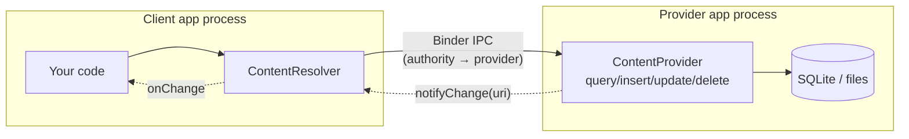

# ContentProvider

A `ContentProvider` is one of the four Android components. It wraps a data store behind a **uniform CRUD + URI interface** so that data can cross the **process boundary**. It is the only framework component whose primary job is to be a *data API for other processes* — Activities show UI, Services do background work, Receivers react to broadcasts, and Providers **serve structured data over Binder**.

!!! abstract "The one-sentence mental model"
    A ContentProvider is a `Binder`-backed table-like RPC endpoint identified by an **authority**, addressed by **content:// URIs**, and consumed through a `ContentResolver`. The resolver is a thin proxy; the provider is the real implementation running in the owning app's process.

---

## When you actually need one

This matters at senior level because the honest answer is **rarely, for your own app**. If data only lives inside your process, use Room / DataStore / a repository — a ContentProvider adds a Binder hop, `Cursor` marshalling, and boilerplate for nothing.

You need (or are forced into) a ContentProvider when:

| Scenario | Why a Provider | Alternative if not cross-process |
| --- | --- | --- |
| **Cross-app data sharing** | Another app's process must read/write your data. Binder + URI permissions is the sanctioned channel. | In-process repository / bound Service with AIDL |
| **Exposing to system integrations** | Contacts, Calendar, MediaStore, Documents, and the Storage Access Framework are all ContentProviders. To appear in the system, you *implement one*. | N/A — the platform dictates the contract |
| **Global Search / Quick Search Box** | The search framework queries your provider for suggestions via a fixed URI contract. | App-local search |
| **App Widgets / launcher / Assistant** | Some surfaces read data through a resolver, not your Activity. | Direct API in-process |
| **`SyncAdapter`** | The sync framework is hard-wired to a `ContentProvider` + `Account`. You must declare one (even a stub) to get scheduled, batched, network-aware sync. | `WorkManager` for plain background sync |
| **`FileProvider`** | Sharing a file with another app on API 24+ (`content://` instead of `file://`). **This is the one almost every app uses.** | None — `file://` throws `FileUriExposedException` |

!!! tip "Senior framing"
    "Do I need a ContentProvider?" → "Does another *process* need my data, or does a *platform framework* (SyncAdapter, Search, SAF, FileProvider) require the ContentProvider contract?" If neither, you don't.

---

## The CRUD contract

A provider is an abstract class with six methods you override. Five are the classic CRUD surface plus MIME typing:

```kotlin
abstract fun onCreate(): Boolean                       // init; return true if ready
abstract fun query(uri, projection, selection,
                   selectionArgs, sortOrder): Cursor?   // READ  -> Cursor
abstract fun insert(uri, values: ContentValues?): Uri?  // CREATE -> row URI
abstract fun update(uri, values, selection, args): Int  // UPDATE -> rows changed
abstract fun delete(uri, selection, args): Int          // DELETE -> rows deleted
abstract fun getType(uri: Uri): String?                 // MIME type of uri
```

| Method | Returns | Notes |
| --- | --- | --- |
| `query` | `Cursor` | The `Cursor` is marshalled across Binder via a shared-memory `CursorWindow` — not a full copy per row. Call `cursor.setNotificationUri()` so observers refresh. |
| `insert` | `Uri` of the new row | Convention: `ContentUris.withAppendedId(tableUri, newRowId)`. |
| `update` / `delete` | affected row count | Both take a `selection` (`WHERE`) + `selectionArgs`. |
| `getType` | MIME string | `vnd.android.cursor.dir/...` for a **collection**, `vnd.android.cursor.item/...` for a **single item**. Powers implicit-intent matching. |
| `bulkInsert` | count | Override for batched writes; default loops `insert`. |
| `applyBatch` | results | Runs `ContentProviderOperation`s; wrap in a transaction for atomicity. |

!!! warning "`getType` is not optional"
    Skipping `getType` (returning `null` everywhere) breaks intent resolution and, on modern Android, `getType` can be **called by any app without permission** — so never leak sensitive info through the MIME string. Providers may also override `getTypeAnonymous` to control unguarded MIME access.

---

## ContentResolver — the client side

Clients never touch the provider object. They call `context.contentResolver`, which resolves the URI's **authority** to the owning provider (via `PackageManager`) and dispatches over Binder.

```kotlin
val resolver = context.contentResolver

// READ
resolver.query(
    ContactsContract.Contacts.CONTENT_URI,
    arrayOf(ContactsContract.Contacts._ID, ContactsContract.Contacts.DISPLAY_NAME),
    null, null,
    "${ContactsContract.Contacts.DISPLAY_NAME} ASC"
)?.use { c ->                          // .use{} -> Cursor is a native resource, always close
    val nameCol = c.getColumnIndexOrThrow(ContactsContract.Contacts.DISPLAY_NAME)
    while (c.moveToNext()) log(c.getString(nameCol))
}

// CREATE
val uri = resolver.insert(MyContract.Notes.CONTENT_URI, contentValuesOf("title" to "Hi"))
```

Key resolver responsibilities: pick the right provider, marshal args, manage the `CursorWindow`, and route `notifyChange` events to registered observers.

---

## URI structure

Every row-set is addressed by a `content://` URI. This is the provider's "REST path".

```
content://com.example.app.provider/notes/42
└──┬──┘   └────────────┬─────────┘ └─┬─┘ └┬┘
scheme        authority             path  id
```

| Segment | Meaning |
| --- | --- |
| `content://` | Fixed scheme telling the resolver "this is a provider". |
| **authority** | Globally unique id of the provider (matches `android:authorities` in the manifest). Convention: your package + `.provider`. |
| **path** | Which table / data set / view (`/notes`, `/notes/archived`). |
| **id** | Optional trailing id selecting a single row (`/notes/42`). |

Helpers: `Uri.withAppendedPath`, `ContentUris.withAppendedId(uri, id)`, `ContentUris.parseId(uri)`.

---

## UriMatcher

`UriMatcher` maps incoming URIs to integer codes so your CRUD methods can `when`-branch cheaply instead of string-parsing.

```kotlin
private const val NOTES = 1        // collection: content://authority/notes
private const val NOTE_ID = 2      // item:       content://authority/notes/#

private val matcher = UriMatcher(UriMatcher.NO_MATCH).apply {
    addURI(AUTHORITY, "notes", NOTES)
    addURI(AUTHORITY, "notes/#", NOTE_ID)   // # = any number, * = any string
}

override fun query(uri: Uri, proj: Array<String>?, sel: String?,
                   args: Array<String>?, sort: String?): Cursor {
    val db = helper.readableDatabase
    val cursor = when (matcher.match(uri)) {
        NOTES   -> db.query("notes", proj, sel, args, null, null, sort)
        NOTE_ID -> db.query("notes", proj, "_id=?",
                            arrayOf(ContentUris.parseId(uri).toString()), null, null, sort)
        else    -> throw IllegalArgumentException("Unknown URI: $uri")
    }
    cursor.setNotificationUri(context!!.contentResolver, uri)   // enables observers
    return cursor
}

override fun getType(uri: Uri) = when (matcher.match(uri)) {
    NOTES   -> "vnd.android.cursor.dir/vnd.$AUTHORITY.note"
    NOTE_ID -> "vnd.android.cursor.item/vnd.$AUTHORITY.note"
    else    -> throw IllegalArgumentException("Unknown URI: $uri")
}
```

---

## ContentObserver — change notifications

Providers push change events; clients observe them. This is how Contacts/MediaStore UIs update live.

**Provider side:** after any mutation, notify the resolver so registered observers wake up.

```kotlin
override fun insert(uri: Uri, values: ContentValues?): Uri {
    val id = helper.writableDatabase.insert("notes", null, values)
    val rowUri = ContentUris.withAppendedId(uri, id)
    context!!.contentResolver.notifyChange(rowUri, null)   // fan out to observers
    return rowUri
}
```

**Client side:** register a `ContentObserver` against a URI (with `notifyForDescendants = true` to also catch child URIs).

```kotlin
val observer = object : ContentObserver(Handler(Looper.getMainLooper())) {
    override fun onChange(selfChange: Boolean, changedUri: Uri?) {
        reload()   // re-query; or use CursorLoader / Room, which observe for you
    }
}
resolver.registerContentObserver(MyContract.Notes.CONTENT_URI, /*descendants=*/ true, observer)
// ...later, in onDestroy:
resolver.unregisterContentObserver(observer)   // leak if you forget
```

!!! note "You rarely write this by hand today"
    Room's `Flow`/`LiveData` queries and MediaStore-backed paging observe change URIs internally. Hand-rolled `ContentObserver`s appear mostly when consuming *system* providers (Contacts, Calendar, MediaStore) reactively.

---

## FileProvider — the everyday use case

`file://` URIs are banned across app boundaries since API 24 (`StrictMode` throws `FileUriExposedException`). `FileProvider` is a **framework subclass of ContentProvider** that hands out `content://` URIs for files in your app's storage, plus **temporary, per-grant read/write permission** to the receiving app.

**1. Declare it in the manifest** (no code — the class is provided by `androidx.core`):

```xml
<provider
    android:name="androidx.core.content.FileProvider"
    android:authorities="${applicationId}.fileprovider"
    android:exported="false"
    android:grantUriPermissions="true">
    <meta-data
        android:name="android.support.FILE_PROVIDER_PATHS"
        android:resource="@xml/provider_paths" />
</provider>
```

`exported="false"` + `grantUriPermissions="true"` is the correct combo: **nobody has standing access**, but you can hand out a **scoped, temporary grant** per URI.

**2. `res/xml/provider_paths.xml`** — whitelist which directories may be shared (anything outside these throws `IllegalArgumentException`):

```xml
<paths xmlns:android="http://schemas.android.com/apk/res/android">
    <cache-path name="shared_cache" path="shared/" />        <!-- getCacheDir()/shared/ -->
    <files-path name="shared_files" path="exports/" />       <!-- getFilesDir()/exports/ -->
    <external-files-path name="ext" path="images/" />        <!-- getExternalFilesDir() -->
</paths>
```

**3. Build the URI and grant permission on the Intent:**

```kotlin
fun shareReport(context: Context, report: File) {
    val uri: Uri = FileProvider.getUriForFile(
        context,
        "${context.packageName}.fileprovider",   // must match android:authorities
        report                                    // must live under a provider_paths entry
    )

    val intent = Intent(Intent.ACTION_SEND).apply {
        type = "application/pdf"
        putExtra(Intent.EXTRA_STREAM, uri)
        // The critical flag: grant the RESOLVED app temporary read access to THIS uri only.
        addFlags(Intent.FLAG_GRANT_READ_URI_PERMISSION)
    }
    context.startActivity(Intent.createChooser(intent, "Share report"))
}
```

!!! danger "`FLAG_GRANT_READ_URI_PERMISSION` is mandatory"
    Without the grant flag, the receiver gets a `SecurityException` the instant it opens the URI — because `exported="false"` means it has no baseline permission. The grant is **tied to the target's lifecycle** and revoked automatically (or explicitly via `revokeUriPermission`). For camera capture you additionally need `FLAG_GRANT_WRITE_URI_PERMISSION`. When passing a URI via a `ClipData`/EXTRA, the flag must be on the Intent that *starts* the component.

---

## Internals

### Registration & the process/thread model



- A provider is declared with `<provider android:authorities=...>`; the system indexes authorities so any process's resolver can find it.
- The **provider always runs in its owning app's process**. Cross-app calls hop over Binder; same-app calls still go through the resolver but stay in-process.
- **Threading:** `query/insert/update/delete` are invoked on a **Binder thread pool**, so multiple client calls run **concurrently** — your implementation **must be thread-safe**. `SQLiteDatabase` serializes writes internally, but shared in-memory state needs your own locking. `onCreate` runs on the **main thread**, so it must be cheap.

### `onCreate` timing — the load-bearing detail

This is the most interview-worthy internal. During app startup, `ActivityThread.handleBindApplication` does roughly:

```
1. new Application()                      // instance created
2. installContentProviders()              // ALL manifest providers instantiated + onCreate()
3. Application.onCreate()                  // <-- runs AFTER every provider.onCreate()
```

So **`ContentProvider.onCreate()` runs before `Application.onCreate()`**, and every provider is initialized eagerly at process start.

!!! quote "Why libraries abused this"
    Because a provider's `onCreate` is a guaranteed, zero-configuration hook that fires **before any of your app code**, libraries hid an *invisible* provider in their manifest (merged in automatically) to auto-initialize themselves — no `Application` subclass or `init()` call required. Firebase, LeakCanary, WorkManager, and others all shipped a "stub" `ContentProvider` whose *only* purpose was `onCreate` → `init(context)`. It served no data.

The costs: (1) every such library adds a provider that runs serially at cold start, **inflating startup time**; (2) initialization order across providers is not something apps control; (3) it's a semantic abuse — a data component used purely as a lifecycle hook.

### App Startup replaced the hack

Jetpack **App Startup** (`androidx.startup`) consolidates all this into **one** `InitializationProvider`. Libraries declare an `Initializer<T>` with a `dependencies()` list; App Startup builds a dependency graph and initializes everyone from a single provider, either eagerly or lazily.

```kotlin
class LoggerInitializer : Initializer<Logger> {
    override fun create(context: Context): Logger = Logger.init(context)
    override fun dependencies(): List<Class<out Initializer<*>>> = emptyList()
}
```

- **One** provider at cold start instead of N.
- Explicit, ordered dependency resolution.
- Opt-in **lazy** init (remove the auto-merged entry, call `AppInitializer.getInstance(ctx).initializeComponent(...)` on demand).

WorkManager's own default initializer now goes through App Startup for exactly this reason.

### Permission model

| Mechanism | Effect |
| --- | --- |
| `android:exported` | Whether *other apps* can reach the provider at all. **Must be set explicitly** since API 31 (build fails otherwise). Default it to `false`. |
| `android:permission` / `readPermission` / `writePermission` | Callers must hold the named permission. Separate read vs write perms are common. |
| `android:grantUriPermissions="true"` | Allows **temporary, per-URI** grants even when `exported="false"` — the basis of `FileProvider` and `FLAG_GRANT_*`. |
| `<path-permission>` / `<grant-uri-permission>` | Fine-grained per-path permissions or grant scopes inside one provider. |
| `Context.grantUriPermission` / `revokeUriPermission` | Programmatic grant/revoke, e.g. to a specific package. |

!!! warning "Exported providers are attack surface"
    A world-readable provider over SQLite is a classic **SQL-injection / path-traversal** target. Always parameterize with `selectionArgs` (never string-concat user input into `selection`), validate URIs through `UriMatcher`, restrict projections, and prefer `exported="false"` + scoped grants over blanket permissions.

---

## Custom ContentProvider (end-to-end skeleton)

```kotlin
// Contract: single source of truth for authority, URIs, columns.
object NotesContract {
    const val AUTHORITY = "com.example.notes.provider"
    val CONTENT_URI: Uri = Uri.parse("content://$AUTHORITY/notes")
    const val COL_ID = "_id"          // _id is required by CursorAdapter/CursorLoader convention
    const val COL_TITLE = "title"
}

class NotesProvider : ContentProvider() {

    private lateinit var helper: SQLiteOpenHelper

    private val matcher = UriMatcher(UriMatcher.NO_MATCH).apply {
        addURI(NotesContract.AUTHORITY, "notes", NOTES)
        addURI(NotesContract.AUTHORITY, "notes/#", NOTE_ID)
    }

    override fun onCreate(): Boolean {             // main thread — keep cheap
        helper = NotesDbHelper(context!!)          // lazy DB open, no heavy I/O here
        return true
    }

    override fun query(uri: Uri, projection: Array<String>?, selection: String?,
                       selectionArgs: Array<String>?, sortOrder: String?): Cursor {
        val cursor = when (matcher.match(uri)) {
            NOTES   -> helper.readableDatabase.query(
                          "notes", projection, selection, selectionArgs, null, null, sortOrder)
            NOTE_ID -> helper.readableDatabase.query(
                          "notes", projection, "${NotesContract.COL_ID}=?",
                          arrayOf(ContentUris.parseId(uri).toString()), null, null, null)
            else    -> throw IllegalArgumentException("Unknown URI $uri")
        }
        cursor.setNotificationUri(context!!.contentResolver, uri)
        return cursor
    }

    override fun insert(uri: Uri, values: ContentValues?): Uri {
        require(matcher.match(uri) == NOTES) { "Insert not supported on $uri" }
        val id = helper.writableDatabase.insertOrThrow("notes", null, values)
        context!!.contentResolver.notifyChange(uri, null)
        return ContentUris.withAppendedId(uri, id)
    }

    override fun update(uri: Uri, values: ContentValues?,
                        selection: String?, selectionArgs: Array<String>?): Int {
        val rows = helper.writableDatabase.update("notes", values, selection, selectionArgs)
        if (rows > 0) context!!.contentResolver.notifyChange(uri, null)
        return rows
    }

    override fun delete(uri: Uri, selection: String?, selectionArgs: Array<String>?): Int {
        val rows = helper.writableDatabase.delete("notes", selection, selectionArgs)
        if (rows > 0) context!!.contentResolver.notifyChange(uri, null)
        return rows
    }

    override fun getType(uri: Uri) = when (matcher.match(uri)) {
        NOTES   -> "vnd.android.cursor.dir/vnd.${NotesContract.AUTHORITY}.note"
        NOTE_ID -> "vnd.android.cursor.item/vnd.${NotesContract.AUTHORITY}.note"
        else    -> throw IllegalArgumentException("Unknown URI $uri")
    }

    companion object { private const val NOTES = 1; private const val NOTE_ID = 2 }
}
```

```xml
<!-- Manifest: exported=false + read permission; nobody sees data without the perm -->
<provider
    android:name=".NotesProvider"
    android:authorities="com.example.notes.provider"
    android:exported="false"
    android:readPermission="com.example.notes.permission.READ" />
```

---

## Interview Q&A

### Q1. Why does `ContentProvider.onCreate()` run before `Application.onCreate()`, and why did libraries exploit it?

During `ActivityThread.handleBindApplication`, the framework creates the `Application` instance, then calls `installContentProviders()` — which instantiates every manifest-declared provider and calls each `onCreate()` — and **only then** calls `Application.onCreate()`. So a provider's `onCreate` is the earliest app-owned code with a valid `Context`, requiring zero setup from the app developer. Libraries (Firebase, LeakCanary, old WorkManager) merged a stub provider into the manifest whose sole job was to auto-initialize in `onCreate`, sparing users a manual `init()` call.

**Follow-up: What's the downside, and what replaced it?** Every such provider runs serially at cold start (slower startup), init order is uncontrollable, and it's a semantic abuse. Jetpack **App Startup** (`androidx.startup`) replaced it: one `InitializationProvider` runs a dependency-ordered graph of `Initializer<T>`s, and you can opt into lazy init to remove the cold-start cost entirely.

### Q2. What thread do a provider's CRUD methods run on, and what does that imply?

`query/insert/update/delete` are invoked from the **Binder thread pool** when called cross-process, so calls can run **concurrently** — your implementation must be thread-safe (SQLite serializes writes for you; shared in-memory caches need your own synchronization). `onCreate`, however, runs on the **main thread** during startup, so it must not do heavy I/O — open the DB lazily. Clients must also not call the resolver on the main thread for large queries, since a synchronous Binder call can block on the provider.

**Follow-up: Does a same-app query still cross Binder?** No IPC across processes is involved for a same-process provider, but the call still goes through the `ContentResolver` and the provider object — it's not a direct method call, so the URI/`UriMatcher` dispatch still applies.

### Q3. How does `FileProvider` let another app read your file without granting it a permission?

`FileProvider` is declared `exported="false"` (no baseline access) with `grantUriPermissions="true"`. You call `FileProvider.getUriForFile()` to get a `content://` URI for a file whitelisted in `provider_paths.xml`, then set `FLAG_GRANT_READ_URI_PERMISSION` on the Intent. The system grants the **resolved target app** temporary read access **to that specific URI only**, tied to the target component's lifecycle and revoked automatically. This replaces `file://`, which throws `FileUriExposedException` under StrictMode since API 24.

**Follow-up: The receiver gets a `SecurityException` on open — why?** Almost always the grant flag is missing (or the URI was passed somewhere the flag doesn't propagate, e.g. a nested Intent / `ClipData` without the flag on the launching Intent), or the file isn't under a `provider_paths` entry. For write-back (camera capture) you also need `FLAG_GRANT_WRITE_URI_PERMISSION`.

### Q4. When should you NOT build a ContentProvider, and what are the alternatives?

When data never leaves your process. A ContentProvider forces a `Cursor`/`ContentValues` shape, a Binder round-trip, and URI boilerplate that buy nothing for in-app data. Use Room / DataStore / a repository for local persistence. Genuine need arises only for **cross-app sharing** or when a **platform framework mandates the contract**: `SyncAdapter` (requires a provider + account), Global Search suggestions, the Storage Access Framework, or `FileProvider` for file sharing.

**Follow-up: You need periodic network sync but no cross-app data — provider or not?** Use `WorkManager`. `SyncAdapter` only earns its complexity when you specifically want the account-tied, system-batched sync semantics; otherwise its mandatory stub provider + authority + account are pure overhead.

### Q5. How do you keep an exported ContentProvider secure?

Set `android:exported` explicitly (required since API 31) and default it to `false`; expose data through **temporary URI grants** rather than blanket access when possible. Use distinct `readPermission`/`writePermission` (or `<path-permission>`) so read and write are gated separately. Critically, **never concatenate caller input into the `selection` string** — always parameterize with `selectionArgs` to prevent SQL injection, validate every URI through `UriMatcher`, and constrain projections so callers can't read columns they shouldn't.

**Follow-up: Why is `getType` a subtle leak vector?** On modern Android `getType` can be called **without holding the provider's permission** (and there's a separate `getTypeAnonymous` path), so returning descriptive MIME strings derived from row data can leak information to unauthorized callers. Keep MIME types static per URI pattern and never encode record contents into them.
