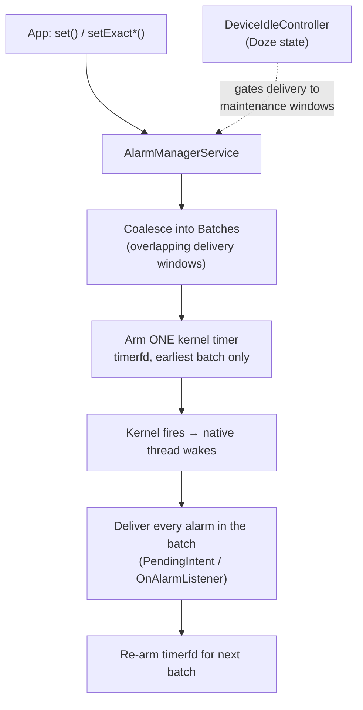
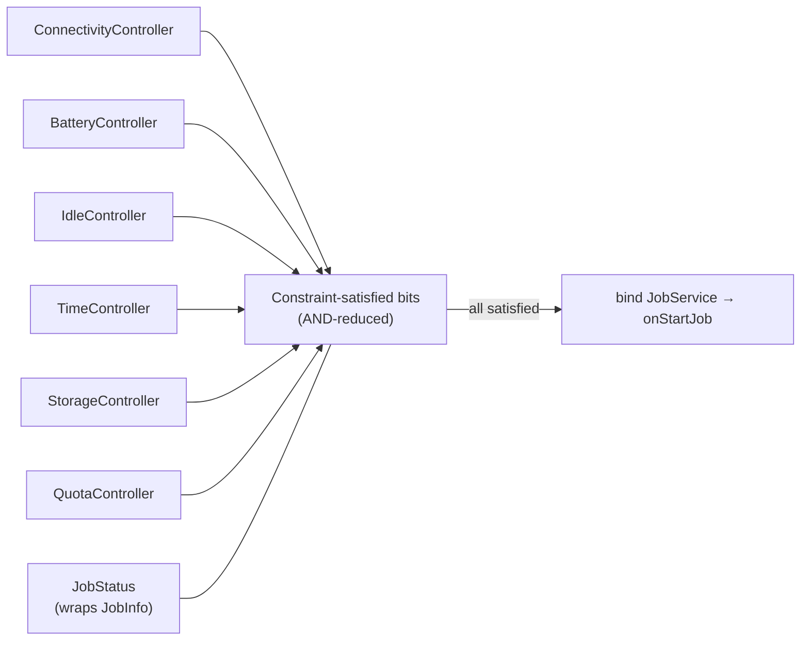
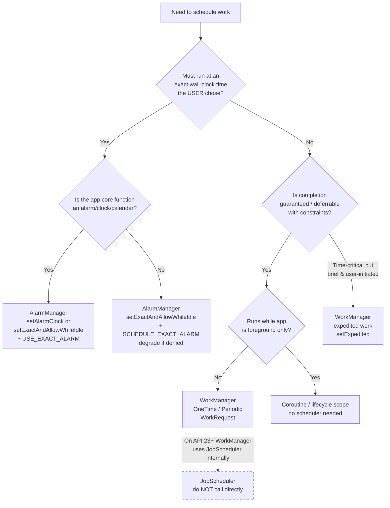

# AlarmManager & JobScheduler

Two low-level scheduling primitives that predate WorkManager. A senior Android engineer must know *why* they still exist, *when* one is correct, and *why you almost never call `JobScheduler` directly anymore*. The one-line mental model:

> **Exact wall-clock time → `AlarmManager`. Deferrable, constraint-driven, guaranteed work → `WorkManager`. `JobScheduler` is the OS engine WorkManager sits on — you rarely touch it yourself.**

---

## AlarmManager

`AlarmManager` fires a `PendingIntent` (or, on API 21+, an `OnAlarmListener`) at a point in time. It is the only API that can wake the device to run at a **precise wall-clock moment**. It does *not* run your code — it delivers a broadcast/service/activity trigger; your work happens in the receiver, which is subject to the ~10s `BroadcastReceiver` limit (offload to `goAsync()` or a `WorkManager` job).

### Clock types

Two orthogonal choices: **which clock** (wall-clock vs boot-elapsed) and **whether it wakes the device**.

| Type | Clock base | Wakes device? | Survives reboot? | Use for |
|------|-----------|---------------|------------------|---------|
| `RTC` | `System.currentTimeMillis()` (wall clock) | No — fires when device next wakes | No (RTC baseline changes) | Non-urgent wall-clock events; UI refresh while awake |
| `RTC_WAKEUP` | Wall clock | **Yes** | No | Alarm clock, calendar reminder at a specific date/time |
| `ELAPSED_REALTIME` | `SystemClock.elapsedRealtime()` (since boot, incl. sleep) | No | Timer resets on reboot | "N minutes from now", relative delays that shouldn't wake device |
| `ELAPSED_REALTIME_WAKEUP` | Elapsed since boot | **Yes** | Timer resets on reboot | Relative wake-up ("wake me in 30 min") independent of wall-clock/timezone changes |

!!! tip "Wall-clock vs elapsed — the senior distinction"
    Use `RTC*` when the trigger is tied to a **calendar time** ("7:00 AM") — but beware timezone/clock changes and NTP corrections shifting it. Use `ELAPSED_REALTIME*` when the trigger is a **relative interval** ("90 minutes of cook time"); it is immune to the user changing the clock or crossing timezones. Alarms do **not** persist across reboot — re-register in a `BOOT_COMPLETED` receiver.

### Scheduling methods

| Method | Precision | Doze-safe? | Notes |
|--------|-----------|------------|-------|
| `set()` | **Inexact** (OS batches; window widens) | No | API 19+ is inexact by design — OS coalesces to save battery |
| `setWindow(type, start, length, pi)` | Inexact within a window you define | No | You express tolerance; OS picks the moment. Battery-friendly |
| `setExact()` | Exact | **No** — deferred in Doze | Requires exact-alarm permission on 12+. Delayed until maintenance window in Doze |
| `setExactAndAllowWhileIdle()` | Exact | **Yes** — one shot pierces Doze | Rate-limited to ~1 per 9 min per app. The correct choice for a real alarm |
| `setAndAllowWhileIdle()` | Inexact | Yes (fires in Doze) | Inexact + Doze-piercing; same ~9 min throttle |
| `setRepeating()` | **Inexact** on API 19+ | No | For exact repetition, reschedule a one-shot each time it fires |
| `setInexactRepeating()` | Inexact, pre-set intervals | No | OS batches wakeups across apps |
| `setAlarmClock(AlarmClockInfo, pi)` | **Exact**, highest priority | **Yes** — always fires on time | Surfaces the next-alarm status-bar icon; exempt from Doze deferral; **no exact-alarm permission needed**. Use only for user-visible alarm-clock UX |

!!! warning "`setRepeating` is a trap"
    Since API 19, `setRepeating()` is **inexact** — intervals are batched and drift. If you need exact periodic firing, schedule a single `setExactAndAllowWhileIdle()` and re-schedule the next one from inside the receiver. But if it's *deferrable* periodic work, that's a `PeriodicWorkRequest` in WorkManager, not AlarmManager.

### Doze & App Standby

Doze (API 23+) is the reason exact alarms are hard. When the screen is off, unplugged, and stationary, the device enters Doze and **defers** normal alarms, network, jobs, and wakelocks to periodic **maintenance windows** (which grow less frequent over time).

- `set()` / `setExact()` / `setRepeating()` → **deferred** until the next maintenance window in Doze.
- `setExactAndAllowWhileIdle()` / `setAndAllowWhileIdle()` → allowed to fire in Doze, **but throttled** to roughly once every 9 minutes per app.
- `setAlarmClock()` → exempt; fires on time (and briefly brings the device out of Doze before it fires).

### Inside `AlarmManagerService`

The API is a thin `Binder` proxy; the scheduling logic lives in the system-server component `AlarmManagerService`. Understanding it explains *why* `set()` is inexact and *why* alarms coalesce.

**One kernel timer, not one timer per alarm.** The service does not arm a hardware timer per pending alarm — that wouldn't scale to thousands of alarms across all apps, and every fire would be a wakeup. Instead it keeps an in-memory list of `Alarm` objects grouped into `Batch`es. A `Batch` has a `[start, end]` **delivery window**; two alarms whose windows overlap are merged into one batch, so they fire together on a single wakeup. The service arms the kernel for **only the earliest batch**, via a single file descriptor:

- On modern kernels it's a `timerfd` (one per clock type); older devices used the `/dev/alarm` driver. A native thread blocks in a `read()`/`ioctl` on that fd; when the kernel timer expires the read returns, the service wakes, delivers every alarm in the fired batch, then re-arms the fd for the next batch's start time.
- `RTC`/`RTC_WAKEUP` are armed against `CLOCK_REALTIME`; `ELAPSED_REALTIME*` against `CLOCK_BOOTTIME` (which keeps counting through suspend). That is the concrete reason the two clock families behave differently across reboot and clock changes — they are literally different kernel clocks.
- The `*_WAKEUP` variants arm a wakeup-capable timer that pulls the SoC out of suspend; the non-wakeup variants arm a timer that only fires when the device is already awake, so they get folded into the next natural wakeup.

**Why `set()` is inexact.** Because batching is the whole point: giving each alarm a window lets `AlarmManagerService` line up unrelated apps' alarms into one wakeup instead of N. `set()` hands the OS a wide window; `setWindow()` lets you pick the tolerance; `setExact*()` collapses the window to a point (a batch of one), which is why exact alarms cost battery and are permission-gated.



**`DeviceIdleController` is the Doze gate.** Doze isn't implemented inside `AlarmManagerService`; it's driven by `DeviceIdleController`, which tracks the idle state machine (ACTIVE → IDLE_PENDING → IDLE → IDLE_MAINTENANCE). While the device is IDLE it tells `AlarmManagerService` to hold back non-allowlisted batches; during a **maintenance window** it releases them. `*AllowWhileIdle` alarms are placed on an allowlist that pierces IDLE but is rate-limited (the ~9-minute throttle), and `setAlarmClock()` alarms are exempt entirely. This is why "deferred until the next maintenance window" is the exact behavior, not a vague description.

### Exact-alarm permission (Android 12+/13+)

Google clamped down on exact alarms because they wake the device and drain battery. From **Android 12 (API 31)**:

- `SCHEDULE_EXACT_ALARM` — a **special app access**. Declared in the manifest; on 31–32 it is *granted by default* but the user (or OS) can revoke it, and it is visible in Settings → "Alarms & reminders."
- `USE_EXACT_ALARM` (**Android 13 / API 33+**) — a **normal permission**, granted at install, no user toggle. **BUT** Google Play restricts it to apps whose *core function* is an alarm clock or calendar. Using it elsewhere risks policy rejection.

The correct runtime pattern:

1. Declare the permission in the manifest.
2. Before scheduling, call `AlarmManager.canScheduleExactAlarms()` (API 31+).
3. If `false`, either fall back to an inexact alarm **or** send the user to `ACTION_REQUEST_SCHEDULE_EXACT_ALARM` settings — never crash.
4. Listen for `ACTION_SCHEDULE_EXACT_ALARM_PERMISSION_STATE_CHANGED` to re-schedule when granted.

!!! danger "Play policy: exact alarms must be justified"
    Only declare `USE_EXACT_ALARM` if the app is genuinely an alarm/clock/calendar app. Everyone else uses `SCHEDULE_EXACT_ALARM` and must **gracefully degrade** when it's denied. Calling `setExact*` without permission on 31+ throws `SecurityException`.

### When exact alarms are legitimate

- **Alarm clock / wake-up app** — the user expects it to fire at exactly 6:30 AM.
- **Calendar / event reminders** — "Meeting in 10 minutes" tied to a specific instant.
- **Medication / dosing reminders** — time-critical to the user.

Everything else — sync, backup, upload, cache cleanup, "refresh feed every few hours," prefetch — is **deferrable** and belongs in WorkManager. If a reviewer asks "why an exact alarm?" and your answer isn't "the user set a specific time," it's the wrong tool.

### Kotlin: exact-and-allow-while-idle with permission check

```kotlin
class ReminderScheduler(private val context: Context) {

    private val alarmManager = context.getSystemService(AlarmManager::class.java)

    /** @return true if scheduled exactly; false if we degraded to inexact. */
    fun scheduleReminder(triggerAtMillis: Long, requestCode: Int): Boolean {
        val pendingIntent = PendingIntent.getBroadcast(
            context,
            requestCode,
            Intent(context, ReminderReceiver::class.java),
            PendingIntent.FLAG_UPDATE_CURRENT or PendingIntent.FLAG_IMMUTABLE,
        )

        // API 31+: exact alarms require SCHEDULE_EXACT_ALARM to be granted.
        val canExact = if (Build.VERSION.SDK_INT >= Build.VERSION_CODES.S) {
            alarmManager.canScheduleExactAlarms()
        } else {
            true // pre-12: no special access needed
        }

        return if (canExact) {
            // Pierces Doze, fires at the wall-clock instant. Best for real reminders.
            alarmManager.setExactAndAllowWhileIdle(
                AlarmManager.RTC_WAKEUP,
                triggerAtMillis,
                pendingIntent,
            )
            true
        } else {
            // Degrade gracefully — never crash, never spam the user with dialogs.
            alarmManager.setAndAllowWhileIdle(
                AlarmManager.RTC_WAKEUP,
                triggerAtMillis,
                pendingIntent,
            )
            false
        }
    }

    /** Send the user to grant exact-alarm access, only if the UX truly needs it. */
    fun requestExactAlarmPermission() {
        if (Build.VERSION.SDK_INT >= Build.VERSION_CODES.S) {
            context.startActivity(
                Intent(Settings.ACTION_REQUEST_SCHEDULE_EXACT_ALARM).apply {
                    data = Uri.fromParts("package", context.packageName, null)
                    addFlags(Intent.FLAG_ACTIVITY_NEW_TASK)
                },
            )
        }
    }
}
```

!!! note "Receiver hygiene"
    The `PendingIntent` must be `FLAG_IMMUTABLE` (mandatory on API 31+). Keep `ReminderReceiver.onReceive()` under ~10s; for anything heavier, acquire a short wakelock via `goAsync()` or enqueue an expedited `OneTimeWorkRequest`. Alarms die on reboot — re-register from a `RECEIVE_BOOT_COMPLETED` receiver.

---

## JobScheduler

`JobScheduler` (API 21+) is the platform service that runs **deferrable background work under constraints** — network, charging, idle, storage-not-low. It batches jobs across apps to preserve battery and is Doze-aware. It is the foundation WorkManager builds on for API 23+.

### JobInfo — the constraint spec

You describe *what conditions* the job needs; the OS decides *when* to run it.

```kotlin
val job = JobInfo.Builder(JOB_ID, ComponentName(context, SyncJobService::class.java))
    .setRequiredNetworkType(JobInfo.NETWORK_TYPE_UNMETERED) // Wi-Fi only
    .setRequiresCharging(true)
    .setRequiresDeviceIdle(false)
    .setPersisted(true)          // survive reboot — needs RECEIVE_BOOT_COMPLETED
    .setBackoffCriteria(30_000L, JobInfo.BACKOFF_POLICY_EXPONENTIAL)
    .setPeriodic(15 * 60_000L)   // min period is 15 min, enforced by OS
    .build()

val scheduler = context.getSystemService(JobScheduler::class.java)
scheduler.schedule(job)
```

Common constraints: `setRequiredNetworkType`, `setRequiresCharging`, `setRequiresDeviceIdle`, `setRequiresStorageNotLow`, `setMinimumLatency` (one-shot only), `setOverrideDeadline`, `setPersisted`, `setBackoffCriteria`, `setPeriodic`.

### JobService — the execution contract

```kotlin
class SyncJobService : JobService() {

    private val scope = CoroutineScope(SupervisorJob() + Dispatchers.IO)

    // Runs on the MAIN thread. You MUST move real work off it yourself.
    override fun onStartJob(params: JobParameters): Boolean {
        scope.launch {
            try {
                doSync()                       // heavy work off the main thread
                jobFinished(params, /* wantsReschedule = */ false)
            } catch (e: Exception) {
                jobFinished(params, /* wantsReschedule = */ true) // apply backoff
            }
        }
        return true // TRUE = work continues on a background thread; keep me alive
    }

    // Called when constraints are no longer met (e.g. Wi-Fi dropped) or timeout.
    override fun onStopJob(params: JobParameters): Boolean {
        scope.coroutineContext.cancelChildren()
        return true // TRUE = reschedule with backoff; FALSE = drop it
    }
}
```

The three contract traps seniors are expected to nail:

1. **`onStartJob` runs on the main thread.** The framework does *not* give you a background thread — you must dispatch work yourself (coroutine, executor, thread). Blocking here causes ANRs.
2. **Return value of `onStartJob`**: `true` means "I've handed work to another thread, keep the job alive — I'll call `jobFinished()` when done." `false` means "work is already complete, release me now."
3. **`jobFinished(params, wantsReschedule)`** must be called explicitly when async work ends, or the job is considered running forever (and eventually killed). `wantsReschedule = true` re-queues with your backoff policy. `onStopJob` returning `true` reschedules; return the value that matches whether the work is worth retrying.

`JobParameters` carries `jobId`, the `PersistableBundle`/`Bundle` extras, the triggered content URIs (for content-observer jobs), and `stopReason` (API 31+ tells you *why* you were stopped — timeout, constraint lost, app standby, user action).

### Inside `JobSchedulerService`

The `JobScheduler` you call is a `Binder` proxy; the engine is `JobSchedulerService` in system-server. It's the framework-side parallel to WorkManager's constraint trackers — in fact WorkManager's `SystemJobService` schedules through this very service on API 23+.

**Every scheduled job becomes a `JobStatus`.** When you call `schedule(JobInfo)`, the service wraps your `JobInfo` in a `JobStatus` object that holds the constraints plus the live "satisfied" bookkeeping. Persisted jobs (`setPersisted(true)`) are written by `JobStore` to `/data/system/job/jobs.xml`, which is why they survive reboot — on boot the service reads `jobs.xml` back into memory and re-evaluates every `JobStatus`.

**Readiness is a bank of constraint bits, one per controller.** The service doesn't poll. It registers each `JobStatus` with a set of `StateController` singletons, each of which owns one constraint and flips a **constraint-satisfied bit** on the `JobStatus` when the device state changes:

| Controller | Constraint it tracks | Flipped by |
|---|---|---|
| `ConnectivityController` | `setRequiredNetworkType` (any / unmetered / not-roaming) | `ConnectivityManager` network callbacks |
| `BatteryController` | `setRequiresCharging`, battery-not-low | charging / battery broadcasts |
| `IdleController` | `setRequiresDeviceIdle` | screen-off / dream / Doze idle signals |
| `TimeController` | `setMinimumLatency`, `setOverrideDeadline` | an alarm the service sets for the next deadline |
| `StorageController` | `setRequiresStorageNotLow` | storage-low / storage-ok broadcasts |
| `QuotaController` | App-Standby-bucket execution quota (API 28+) | usage/bucket changes + a running quota tally |

A job is **ready to run only when *all* of its controllers report satisfied** — the service AND-reduces the constraint bits. As controllers flip bits, the service re-checks affected jobs and dispatches the ready ones (subject to a max-concurrent-jobs cap) by binding to your `JobService` and calling `onStartJob`.



**`QuotaController` and the standby buckets.** Since API 28, App Standby sorts each app into a bucket — **active, working-set, frequent, rare, restricted** — and `QuotaController` grants each bucket a shrinking **running-time budget within a sliding window**. A rare-bucket app might get only a few minutes of job execution every several hours; an active app is effectively unthrottled. When a running job exhausts its quota (or the standard ~10-minute per-execution window elapses), the service stops it and calls `onStopJob`. On API 31+ the reason is surfaced as a `stopReason` code — e.g. `STOP_REASON_TIMEOUT`, `STOP_REASON_CONSTRAINT_CONNECTIVITY`, `STOP_REASON_QUOTA`, `STOP_REASON_DEVICE_IDLE`, `STOP_REASON_APP_STANDBY`, `STOP_REASON_USER` — so you can log *why* you were interrupted and decide whether to reschedule.

!!! warning "Why you don't write this by hand anymore"
    Raw `JobService` gives you: no built-in threading, manual reboot persistence, no unified chaining, min-SDK 21, and no observable state. **WorkManager wraps all of it** — picks `JobScheduler` on 23+, handles threading via `CoroutineWorker`/`ListenableWorker`, persists across reboot for free, and adds chaining, `LiveData`/`Flow` observation, and expedited work. In 2024+ code, calling `JobScheduler` directly is a smell unless you have a very specific reason (e.g. `TRIGGER_CONTENT_URI` jobs, or you're implementing the library layer itself).

---

## Decision matrix: WorkManager vs JobScheduler vs AlarmManager

| Dimension | WorkManager | JobScheduler (raw) | AlarmManager |
|-----------|-------------|--------------------|--------------|
| **Best for** | Guaranteed, deferrable background work | (Legacy) constraint-based deferrable work | Exact wall-clock time-of-day triggers |
| **Timing model** | "Eventually, when constraints met" | "Eventually, when constraints met" | "At *this* instant" |
| **Constraints (network/charging/idle)** | ✅ Rich | ✅ Rich | ❌ None |
| **Survives reboot** | ✅ Automatic | ⚠️ `setPersisted(true)` only | ❌ Re-register on `BOOT_COMPLETED` |
| **Survives app kill / force-stop** | ✅ (until force-stop) | ✅ | Force-stop cancels alarms |
| **Doze behavior** | Deferred to maintenance; expedited option | Deferred to maintenance windows | Only `*AllowWhileIdle` / `setAlarmClock` pierce Doze |
| **Threading provided** | ✅ Worker gives you a thread | ❌ You dispatch off main yourself | ❌ Receiver runs briefly on main |
| **Chaining / observability** | ✅ Chains, `Flow`/`LiveData` | ❌ | ❌ |
| **Min API** | 14 (Jetpack) | 21 | 1 |
| **Wakes the device precisely** | ❌ | ❌ | ✅ (`*_WAKEUP`) |



**The rules of thumb, ranked:**

1. **Deferrable + must eventually complete** (sync, upload, backup, cleanup, prefetch) → **WorkManager**. This is the default answer for ~90% of background scheduling.
2. **Exact time-of-day the user set** (alarm, reminder, calendar) → **AlarmManager** with `setExactAndAllowWhileIdle` / `setAlarmClock`, gated on exact-alarm permission with graceful degradation.
3. **Time-critical but short and user-triggered** → WorkManager **expedited** work (foreground service quota) rather than an alarm.
4. **JobScheduler directly** → almost never in app code. Use it only for niche cases (content-URI trigger jobs) or when you can't take a Jetpack dependency. Otherwise let WorkManager own it.

---

## Interview Q&A

**Q1. Difference between `RTC_WAKEUP` and `ELAPSED_REALTIME_WAKEUP`, and when would using the wrong one bite you?**
`RTC_WAKEUP` triggers relative to wall-clock time (`System.currentTimeMillis()`); `ELAPSED_REALTIME_WAKEUP` triggers relative to time since boot (`SystemClock.elapsedRealtime()`, which includes deep sleep). Both wake the device. Use `RTC_WAKEUP` for calendar/alarm-clock events tied to a real date-time. Use `ELAPSED_REALTIME_WAKEUP` for relative intervals ("in 30 minutes"). Getting it wrong bites you when the user changes the timezone or the system clock: an `RTC` alarm shifts (a "7 AM" alarm can fire early/late or twice), while `ELAPSED_REALTIME` is immune. Conversely, using `ELAPSED_REALTIME` for a fixed calendar time drifts because the boot baseline has no notion of wall-clock date.
*Follow-up: why don't RTC alarms survive a reboot?* Because pending alarms live in RAM in the AlarmManagerService and are cleared on reboot; you must re-register them from a `BOOT_COMPLETED` receiver (and mark jobs `setPersisted` for JobScheduler).

**Q2. What does Doze do to `setExact()`, and how do you actually get an alarm to fire on time?**
In Doze, `setExact()` (and `set`, `setRepeating`) are deferred until the next maintenance window, which grows increasingly infrequent — so "exact" becomes "sometime later." To fire in Doze you need `setExactAndAllowWhileIdle()` (throttled to ~once per 9 min per app) or, for genuine alarm-clock UX, `setAlarmClock()`, which is exempt from Doze deferral and always fires on time (it also shows the status-bar alarm icon). If work is deferrable, the right answer is *don't fight Doze* — use WorkManager.
*Follow-up: why the 9-minute throttle on `setExactAndAllowWhileIdle`?* To stop apps from using it as a general wakeup loop that defeats Doze's battery savings; the OS rate-limits Doze-piercing alarms per app.

**Q3. Walk me through the exact-alarm permission changes in Android 12 and 13.**
Android 12 (API 31) introduced `SCHEDULE_EXACT_ALARM` as a special app access: declared in the manifest, grantable/revocable by the user in Settings ("Alarms & reminders"), and required before `setExact*` calls (else `SecurityException`). On 31–32 it's granted by default but can be revoked. Android 13 (API 33) added `USE_EXACT_ALARM`, a normal install-time permission with no user toggle — but Google Play restricts it to apps whose core purpose is alarms/clock/calendar. So: general apps use `SCHEDULE_EXACT_ALARM`, check `canScheduleExactAlarms()`, and degrade gracefully; only true alarm apps use `USE_EXACT_ALARM`.
*Follow-up: user revokes `SCHEDULE_EXACT_ALARM` while your alarm is pending — what happens?* Existing exact alarms are cancelled by the system, and you receive `ACTION_SCHEDULE_EXACT_ALARM_PERMISSION_STATE_CHANGED`; you should re-evaluate and either reschedule (if regranted) or fall back to inexact.

**Q4. In a `JobService`, what thread does `onStartJob` run on, and what does its return value mean?**
`onStartJob` runs on the app's **main thread**. The framework does not hand you a worker thread, so you must offload heavy work yourself (coroutine/executor). The return value tells the framework whether work is ongoing: `true` = "I've dispatched work to another thread, keep me alive; I'll call `jobFinished()` when done," `false` = "work already finished synchronously, release me." Forgetting to call `jobFinished()` after returning `true` leaves the job "running" until the system kills it, and you lose your backoff/reschedule intent.
*Follow-up: what's `onStopJob` for and what should it return?* It's called when constraints are lost or the job times out (`stopReason` on API 31+ says why). Cancel your in-flight work and return `true` to reschedule with your backoff policy, or `false` to abandon it.

**Q5. When would you reach for AlarmManager over WorkManager, and why is calling JobScheduler directly discouraged?**
Reach for AlarmManager only when work must run at a precise wall-clock instant the user chose — alarm clock, calendar reminder, medication reminder — because it's the only API that wakes the device at an exact time. Everything deferrable (sync, upload, backup, cleanup, periodic refresh) goes to WorkManager, which guarantees eventual execution under constraints and survives reboot. Calling `JobScheduler` directly is discouraged because WorkManager already wraps it on API 23+, adding threading, reboot persistence, chaining, observability, expedited work, and a single API across SDK levels — hand-rolling `JobService` reintroduces bugs (main-thread work, manual persistence) the library already solved.
*Follow-up: is there any case where you'd still touch JobScheduler directly?* Niche ones: content-URI trigger jobs (`setTriggerContentUri`) that WorkManager doesn't expose as cleanly, or environments where you can't add the Jetpack dependency. Otherwise, no.

**Q6. Inside `JobSchedulerService`, how does the framework decide a job is ready to run, and what role do the controllers and standby buckets play?**
Each scheduled `JobInfo` is wrapped in a `JobStatus` and registered with a bank of `StateController` singletons — `ConnectivityController`, `BatteryController`, `IdleController`, `TimeController`, `StorageController`, and `QuotaController` — one per constraint. The service is event-driven, not polling: when device state changes (network callback, charging broadcast, deadline alarm), the responsible controller flips a **constraint-satisfied bit** on the `JobStatus`. The job becomes eligible only when the AND of all its bits is true, at which point the service binds your `JobService` and calls `onStartJob`. `QuotaController` additionally enforces the App-Standby bucket budget: the app's bucket (active/working-set/frequent/rare/restricted) sets a running-time allowance within a sliding window, so a rarely-used app gets far less execution time. This is the exact framework-side analog of WorkManager's constraint trackers — and WorkManager's `SystemJobService` schedules through this same service on API 23+.
*Follow-up: which jobs survive a reboot and how?* Only jobs scheduled with `setPersisted(true)`. `JobStore` serializes them to `/data/system/job/jobs.xml`; on boot the service reloads that file, rebuilds each `JobStatus`, and re-evaluates its constraints. Non-persisted jobs are lost on reboot, exactly like AlarmManager alarms.

**Q7. Explain how `AlarmManagerService` actually delivers alarms — why is `set()` inexact, and how does one kernel timer serve thousands of alarms?**
`AlarmManagerService` keeps all pending alarms in memory grouped into `Batch`es, where a batch is a set of alarms whose `[start, end]` delivery windows overlap. It arms the kernel for only the **earliest batch** using a single file descriptor — a `timerfd` (or the legacy `/dev/alarm` driver) per clock type — with a native thread blocked on it; when the timer fires, every alarm in that batch is delivered on one wakeup and the fd is re-armed for the next batch. `set()` is inexact precisely because batching is the goal: a wide delivery window lets the service coalesce unrelated apps' alarms into a single wakeup to save battery, whereas `setExact*()` collapses the window to a point (a batch of one). `RTC*` alarms arm `CLOCK_REALTIME` and `ELAPSED_REALTIME*` arm `CLOCK_BOOTTIME`, which is why they diverge across clock changes and reboots. Doze deferral is layered on top by `DeviceIdleController`, which holds back non-allowlisted batches until a maintenance window.
*Follow-up: how do `setExactAndAllowWhileIdle` and `setAlarmClock` escape Doze at this level?* `DeviceIdleController` keeps an allowlist of alarms permitted to fire during IDLE. `*AllowWhileIdle` alarms are on it but rate-limited (the ~9-minute throttle), so they pierce Doze sparingly; `setAlarmClock()` alarms are fully exempt and even bring the SoC out of suspend just before firing, because they back user-visible alarm-clock UX.
