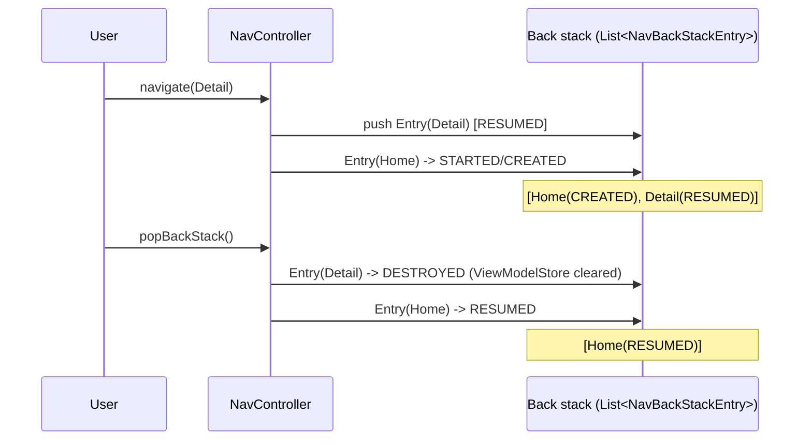

# Navigation Component

The Jetpack **Navigation Component** is a library + Gradle plugin + Android Studio tooling that models in-app navigation as a **graph** of destinations connected by **actions**. It centralizes the back stack, argument passing, deep linking, and transitions behind a single `NavController`, and is the structural backbone of the recommended **single-Activity architecture**.

!!! abstract "Senior mental model"
    Think of Navigation as a **state machine over a back stack**. The `NavGraph` is the static declaration (nodes + edges). The `NavController` is the runtime that owns a stack of `NavBackStackEntry` objects. Each entry is a *full lifecycle-and-state scope* — it is a `LifecycleOwner`, `ViewModelStoreOwner`, and `SavedStateRegistryOwner`. Most "how do I share data / scope a ViewModel / survive process death" questions reduce to *which `NavBackStackEntry` owns the state*.

---

## Core pieces

| Piece | What it is | Views world | Compose world |
|---|---|---|---|
| **NavGraph** | The set of destinations + actions | `nav_graph.xml` or Kotlin DSL | `NavHost { composable(...) }` builder |
| **Destination** | A node: fragment, activity, dialog, or nested graph | `<fragment>`, `<activity>`, `<dialog>` | `composable`, `dialog`, `navigation` |
| **NavHost** | The swappable container that shows the current destination | `NavHostFragment` | `NavHost` composable |
| **NavController** | Runtime that manipulates the back stack | `findNavController()` | `rememberNavController()` |
| **Action** | A named, typed edge between destinations | `<action>` | direct `navigate(route)` |
| **Args** | Typed payload for a destination | Safe Args / `@Serializable` route | `@Serializable` route or `toRoute()` |

```mermaid
graph LR
    subgraph NavGraph[nav_graph.xml]
        Home[HomeFragment\nstartDestination]
        List[ListFragment]
        Detail[DetailFragment\narg: itemId]
        Settings[SettingsFragment]
    end
    Home -->|action_home_to_list| List
    List -->|action_list_to_detail| Detail
    Home -.->|global action_settings| Settings
    List -.->|global action_settings| Settings
    Detail -->|deepLink app://item/{itemId}| Detail
```

---

## The navigation graph

### XML (`nav_graph.xml`)

```xml
<navigation xmlns:android="http://schemas.android.com/apk/res/android"
    xmlns:app="http://schemas.android.com/apk/res-auto"
    android:id="@+id/nav_graph"
    app:startDestination="@id/homeFragment">

    <fragment
        android:id="@+id/homeFragment"
        android:name="com.example.HomeFragment"
        android:label="Home">
        <action
            android:id="@+id/action_home_to_detail"
            app:destination="@id/detailFragment"
            app:enterAnim="@anim/slide_in_right"
            app:exitAnim="@anim/slide_out_left"
            app:popUpTo="@id/homeFragment"
            app:popUpToInclusive="false" />
    </fragment>

    <fragment
        android:id="@+id/detailFragment"
        android:name="com.example.DetailFragment">
        <argument
            android:name="itemId"
            app:argType="long" />
        <argument
            android:name="title"
            app:argType="string"
            android:defaultValue="Untitled"
            app:nullable="false" />
        <deepLink app:uri="myapp://items/{itemId}" />
    </fragment>
</navigation>
```

### Kotlin DSL

Build the graph programmatically — useful for dynamically-sized graphs or feature modules.

```kotlin
navController.graph = navController.createGraph(startDestination = "home") {
    fragment<HomeFragment>("home") { label = "Home" }
    fragment<DetailFragment>("detail/{itemId}") {
        argument("itemId") { type = NavType.LongType }
        deepLink { uriPattern = "myapp://items/{itemId}" }
    }
}
```

!!! tip "Why a graph and not just `startActivity`/`FragmentTransaction`"
    The graph makes navigation **declarative and inspectable**: the tooling can validate that every action points to a real destination, generate type-safe args, wire Up/Back correctly, and expose deep links to the manifest. Manual `FragmentTransaction`s scatter this logic across the codebase and make the back stack ad-hoc.

---

## NavController & NavHost

`NavHostFragment` hosts the graph; `NavController` drives it.

```kotlin
// Activity layout hosts a NavHostFragment
val navHostFragment = supportFragmentManager
    .findFragmentById(R.id.nav_host_fragment) as NavHostFragment
val navController = navHostFragment.navController

// From anywhere inside a destination fragment:
findNavController().navigate(R.id.action_home_to_detail)
```

!!! warning "`findNavController()` timing"
    `findNavController()` walks up the view hierarchy to find the controller attached via `Navigation.setViewNavController`. Calling it before the fragment's view is created (e.g. in `onCreate`) throws `IllegalStateException`. Call it from `onViewCreated` onward. In Compose, `rememberNavController()` survives recomposition but you must hoist it above the `NavHost`.

**Up vs Back:**

| | Up (`navigateUp()`) | Back (`popBackStack()`) |
|---|---|---|
| Triggered by | Toolbar/ActionBar arrow | System back gesture/button |
| Semantics | Navigate within the app's hierarchy | Pop the most recent entry |
| At start destination | May exit the app if it's the task root | Finishes the Activity |

---

## Actions

An **action** is a named edge with attributes that describe the transition and back-stack manipulation.

| Attribute | Meaning |
|---|---|
| `app:destination` | Target destination id |
| `app:popUpTo` | Pop the back stack up to (and optionally including) this destination before navigating |
| `app:popUpToInclusive` | Whether to also pop `popUpTo` itself |
| `app:launchSingleTop` | Don't create a duplicate if already on top |
| `app:enterAnim`/`exitAnim`/`popEnterAnim`/`popExitAnim` | Transitions |

```kotlin
// Log in, then clear the auth flow off the stack so Back doesn't return to it
findNavController().navigate(
    R.id.action_login_to_home,
    args = null,
    navOptions {
        popUpTo(R.id.loginFragment) { inclusive = true }
        launchSingleTop = true
    }
)
```

### Global actions

A **global action** is defined at the graph level (not inside a single destination) so *any* destination can invoke it — ideal for "go to Settings" or "go to Upsell" from many screens.

```xml
<navigation ... app:startDestination="@id/homeFragment">
    <action
        android:id="@+id/action_global_settings"
        app:destination="@id/settingsFragment" />
    <fragment android:id="@+id/homeFragment" .../>
    <fragment android:id="@+id/listFragment" .../>
</navigation>
```

```kotlin
findNavController().navigate(R.id.action_global_settings)
```

---

## Safe Args (type-safe arguments)

### Classic Safe Args (Gradle plugin, codegen)

Apply `androidx.navigation.safeargs.kotlin`. For each destination with `<argument>`s, the plugin generates a `Directions` class (for the source) and an `Args` class (for the destination).

```kotlin
// Sender — generated builder enforces required args at compile time
val directions = HomeFragmentDirections
    .actionHomeToDetail(itemId = 42L, title = "Widget")
findNavController().navigate(directions)

// Receiver
class DetailFragment : Fragment(R.layout.detail) {
    private val args: DetailFragmentArgs by navArgs()
    override fun onViewCreated(v: View, s: Bundle?) {
        val id = args.itemId          // Long, non-null, no key strings
        val title = args.title        // String with default applied
    }
}
```

!!! note "Supported `argType`s"
    `integer`, `long`, `float`, `boolean`, `string`, `reference`, enums, and any `Parcelable`/`Serializable` (referenced by fully-qualified class). Use `app:nullable="true"` only with reference types (String, Parcelable). Primitives can't be nullable; give them a `defaultValue` instead.

### Type-safe Navigation (2.8+, `@Serializable` routes)

Navigation **2.8.0** replaced string routes with **Kotlin Serialization**–backed types. You declare destinations as `@Serializable` classes/objects; arguments become **constructor properties**. This works for both Fragments and Compose and removes stringly-typed routes entirely.

```kotlin
@Serializable object Home
@Serializable data class Detail(val itemId: Long, val title: String = "Untitled")

// Navigate by passing an instance — args are just fields
navController.navigate(Detail(itemId = 42L, title = "Widget"))

// Read args back, fully typed
val detail: Detail = backStackEntry.toRoute()

// popUpTo now takes a type
navController.navigate(Home) {
    popUpTo<Home> { inclusive = true }
}
```

| | Classic Safe Args | Type-safe routes (2.8+) |
|---|---|---|
| Mechanism | Gradle plugin codegen from XML | `kotlinx.serialization` on `@Serializable` types |
| Route identity | XML id / string route | The type itself |
| Args | Generated `Args`/`Directions` | Constructor params + `toRoute()` |
| Works in Compose | Awkward | First-class |
| Graph definition | XML or DSL | Kotlin DSL / Compose builder |

---

## Deep links

A **deep link** maps an external URI (or pending intent) to a destination, so the OS/notifications/other apps can jump straight into a screen with the correct synthetic back stack.

### Implicit deep links

Declared with `<deepLink>` in the graph. Add `<nav-graph>` to the manifest so the tooling auto-generates the required `<intent-filter>`s.

```xml
<!-- nav_graph.xml -->
<fragment android:id="@+id/detailFragment" ...>
    <argument android:name="itemId" app:argType="long"/>
    <deepLink app:uri="https://example.com/items/{itemId}"
              app:action="android.intent.action.VIEW"
              app:autoVerify="true" />
</fragment>
```

```xml
<!-- AndroidManifest.xml -->
<activity android:name=".MainActivity" android:exported="true">
    <nav-graph android:value="@navigation/nav_graph" />
</activity>
```

Navigation builds a **synthetic back stack** rooted at the graph's `startDestination`, so pressing Back from a deep-linked Detail lands on Home, not another app.

### Explicit deep links

A `PendingIntent` (e.g. from a notification) built with `NavDeepLinkBuilder` or `NavController.createDeepLink()`.

```kotlin
val pending = NavDeepLinkBuilder(context)
    .setGraph(R.navigation.nav_graph)
    .setDestination(R.id.detailFragment)
    .setArguments(bundleOf("itemId" to 42L))
    .createPendingIntent()
```

| | Implicit | Explicit |
|---|---|---|
| Source | External URI matched by intent-filter | You construct a `PendingIntent` |
| Declared | `<deepLink>` in graph | Code (`NavDeepLinkBuilder`) |
| Typical use | App Links, web URLs | Notifications, widgets, shortcuts |

---

## Conditional navigation

Common pitfall: gating a destination behind auth/onboarding. Do **not** put the check inside the destination and redirect in `onCreate` — that flashes the protected screen and corrupts the stack. Instead intercept before navigating, or observe state and redirect, popping the origin.

```kotlin
// Gate at the call site
fun openProfile() {
    if (authRepository.isLoggedIn) {
        findNavController().navigate(R.id.profileFragment)
    } else {
        findNavController().navigate(R.id.loginFragment)
    }
}

// Or: login destination returns a result and pops itself
class LoginFragment : Fragment() {
    private fun onLoginSuccess() {
        findNavController().apply {
            previousBackStackEntry?.savedStateHandle?.set("logged_in", true)
            popBackStack()
        }
    }
}
```

!!! tip
    For flows, prefer a **nested graph** for the whole auth flow and `popUpTo` the graph inclusively when it completes, so the entire flow leaves the back stack atomically.

---

## Bottom navigation & navigation drawer integration

`NavigationUI` wires menu items to destinations by matching `menu` item `id` to destination `id`.

```kotlin
// Bottom nav
binding.bottomNav.setupWithNavController(navController)

// Drawer + toolbar (Up arrow becomes hamburger for top-level destinations)
val appBarConfig = AppBarConfiguration(
    topLevelDestinationIds = setOf(R.id.homeFragment, R.id.searchFragment, R.id.profileFragment),
    drawerLayout = binding.drawerLayout
)
binding.toolbar.setupWithNavController(navController, appBarConfig)
binding.navView.setupWithNavController(navController)
```

!!! warning "Multiple back stacks"
    Since Navigation **2.4**, `setupWithNavController` for `BottomNavigationView` **preserves a separate back stack per tab** automatically (state saving/restoring on `NavOptions`). Re-selecting a tab restores that tab's stack rather than resetting to its start. If you build tab switching manually, replicate this with `saveState`/`restoreState` + `launchSingleTop` in `NavOptions`, else you regress to the old single-stack behavior.

---

## Nested graphs

A **nested graph** groups related destinations under a parent node with its own `startDestination`. It provides encapsulation (feature module can own its subgraph), a **ViewModel scope** (see below), and atomic `popUpTo`.

```xml
<navigation android:id="@+id/nav_graph" app:startDestination="@id/homeFragment">
    <fragment android:id="@+id/homeFragment" .../>

    <navigation android:id="@+id/checkout_graph"
        app:startDestination="@id/cartFragment">
        <fragment android:id="@+id/cartFragment" .../>
        <fragment android:id="@+id/paymentFragment" .../>
        <fragment android:id="@+id/confirmFragment" .../>
    </navigation>
</navigation>
```

You navigate to the *graph id* (`checkout_graph`) and land on its start destination. Include reusable subgraphs from feature modules with `<include app:graph="@navigation/checkout_graph"/>`.

---

## Passing data between destinations

Two distinct problems: **forward** args (going *to* a screen) and **returning a result** (coming *back*).

### Forward: Safe Args / typed routes

Use Safe Args or `@Serializable` routes (above). Keep payloads **small and identifier-based** — pass an `itemId`, not the whole object. Large `Parcelable`s bloat the saved `Bundle` (subject to the ~1MB `TransactionTooLarge` binder limit on the enclosing transaction) and duplicate the source of truth.

### Returning a result: `SavedStateHandle` on `previousBackStackEntry`

The modern replacement for `setTargetFragment`/`startActivityForResult`. The destination that *returns* a result writes into the **previous** entry's `SavedStateHandle`; the destination that *awaits* it observes its **current** entry.

```kotlin
// Destination B (e.g. a picker) returns a result to A, then pops
findNavController().previousBackStackEntry
    ?.savedStateHandle
    ?.set("selected_color", "#FF0000")
findNavController().popBackStack()

// Destination A observes its OWN entry (lifecycle-aware, survives config change)
val entry = findNavController().currentBackStackEntry!!
entry.savedStateHandle
    .getLiveData<String>("selected_color")
    .observe(viewLifecycleOwner) { color ->
        applyColor(color)
        entry.savedStateHandle.remove<String>("selected_color") // consume once
    }
```

!!! danger "Observe the *current* entry, set the *previous* one"
    A → B. B sets on `previousBackStackEntry` (that's A). A reads from `currentBackStackEntry` (itself). Getting these backwards is the #1 result-passing bug. Also remove the key after consuming, or a returning-and-leaving-again cycle re-delivers the stale value.

| Mechanism | Direction | Type-safe | Survives process death | Use |
|---|---|---|---|---|
| Safe Args / routes | Forward (A→B) | Yes | Yes (saved in args Bundle) | Inputs to a screen |
| `SavedStateHandle` + `previousBackStackEntry` | Backward (B→A) | No (string keys) | Yes | Results / callbacks |

---

## Animations & transitions

Set per-action in XML (`enterAnim`/`exitAnim`/`popEnterAnim`/`popExitAnim`) or via `navOptions { anim { ... } }`. Fragment **shared element transitions** are supported through `FragmentNavigator.Extras`.

```kotlin
val extras = FragmentNavigatorExtras(binding.thumbnail to "hero_image")
findNavController().navigate(directions, extras)
```

In Compose, transitions are parameters on `NavHost`/`composable`:

```kotlin
NavHost(
    navController, startDestination = Home,
    enterTransition = { slideIntoContainer(SlideDirection.Left) },
    exitTransition  = { slideOutOfContainer(SlideDirection.Left) },
) { /* ... */ }
```

---

## Internals: the back stack

### `NavBackStackEntry` is the state scope

`NavController` holds a `StateFlow`-backed list of `NavBackStackEntry`. **Every entry independently implements three owner interfaces:**

- `LifecycleOwner` — the entry's lifecycle tracks its stack position. The top entry is `RESUMED`; entries covered by a non-dialog destination move to `CREATED`/`STARTED`; a popped entry moves to `DESTROYED`, which clears its `ViewModelStore`.
- `ViewModelStoreOwner` — each entry owns a `ViewModelStore`, enabling **destination-scoped** and **graph-scoped** ViewModels.
- `SavedStateRegistryOwner` — backs `SavedStateHandle` and survives system-initiated process death.



### Graph-scoped ViewModels (`navGraphViewModels`)

Because a *nested graph's* `NavBackStackEntry` is itself a `ViewModelStoreOwner`, you can scope a shared ViewModel to the **lifetime of the flow**. Every destination in the checkout flow sees the *same* instance; it's cleared automatically when the flow is popped off the stack — no manual cleanup, no leaking into the rest of the app.

```kotlin
// Every fragment inside checkout_graph shares ONE CheckoutViewModel
class PaymentFragment : Fragment() {
    private val vm: CheckoutViewModel by navGraphViewModels(R.id.checkout_graph) {
        // optional factory
        defaultViewModelProviderFactory
    }
}

// Compose equivalent: scope to the parent graph's back stack entry
@Composable
fun PaymentScreen(navController: NavController) {
    val parentEntry = remember(navController.currentBackStackEntry) {
        navController.getBackStackEntry<CheckoutGraph>()
    }
    val vm: CheckoutViewModel = hiltViewModel(parentEntry)
}
```

!!! tip "Scope selection cheat-sheet"
    - **Screen-local** state → `by viewModels()` (destination entry scope).
    - **Shared across a flow** → `by navGraphViewModels(subgraphId)`.
    - **App-global** → an application-scoped singleton (Hilt `@Singleton`), *not* the graph. Don't scope global state to the root graph and expect it to clear.

### `SavedStateHandle` in navigation

Each entry's `SavedStateHandle` is persisted via its `SavedStateRegistry`, so it survives **configuration change and process death** (values must be `Bundle`-able). This is what makes result-passing (`previousBackStackEntry.savedStateHandle`) robust across a system kill — and why a Hilt ViewModel injected with `SavedStateHandle` transparently receives the destination's typed nav arguments as pre-populated keys.

---

## Navigation in Compose (brief)

The Compose integration keeps the same runtime (`NavController`, `NavBackStackEntry`) but replaces the graph with a composable builder and prefers **type-safe `@Serializable` routes**.

```kotlin
@Serializable object Home
@Serializable data class Detail(val itemId: Long)

@Composable
fun AppNav() {
    val navController = rememberNavController()
    NavHost(navController, startDestination = Home) {
        composable<Home> {
            HomeScreen(onOpen = { id -> navController.navigate(Detail(id)) })
        }
        composable<Detail> { entry ->
            val args: Detail = entry.toRoute()   // typed, no string keys
            DetailScreen(args.itemId)
        }
        dialog<Confirm> { ConfirmDialog() }
        navigation<CheckoutGraph>(startDestination = Cart) { /* nested */ }
    }
}
```

- `rememberNavController()` hoists the controller; pass it down or expose lambdas.
- `entry.toRoute<T>()` decodes the typed route; deep links use `deepLinks = listOf(navDeepLink<Detail>(basePath = "https://example.com/items"))`.
- Result passing uses the same `previousBackStackEntry.savedStateHandle`.

---

## Single-Activity architecture rationale

Navigation exists to make **one Activity + many destinations** practical. Why senior teams prefer it:

| Benefit | Why |
|---|---|
| One back stack | The `NavController` owns the entire in-app history; no fragile inter-Activity `Intent`/`finish` choreography. |
| Cheap transitions | Swapping fragments/composables avoids full Activity re-creation and window transitions. |
| Shared scoping | Activity- and graph-scoped ViewModels let sibling screens share state without `Intent` extras. |
| Centralized concerns | Deep links, transitions, and Up/Back live in one graph, not scattered across manifests. |
| Testability | The graph is inspectable; `TestNavHostController` drives navigation in unit tests. |

!!! note "When multiple Activities still make sense"
    Distinct **launcher entry points**, `Activity`-based third-party SDKs, screens needing different `taskAffinity`/launch modes, or truly independent feature surfaces (e.g. a separate settings task). Single-Activity is the default, not a dogma.

---

## Interview Q&A

!!! question "1. Result passing: precisely which `NavBackStackEntry` do you set, and which do you observe — and why does removing the key matter?"
    The screen **returning** the result (B) writes to `findNavController().previousBackStackEntry?.savedStateHandle` — `previousBackStackEntry` from B's perspective is A. The screen **awaiting** the result (A) observes `currentBackStackEntry.savedStateHandle` (itself), because after B pops, A is current. You observe with `getLiveData(key)` (or `StateFlow`) against `viewLifecycleOwner` so it's lifecycle-aware. You **remove the key after consuming** because `SavedStateHandle` retains it; if the user navigates B→A→B→A again without removal, the stale value is re-emitted immediately, causing a phantom "result".

    **Follow-up — why not just use a shared ViewModel instead?** You can, via `navGraphViewModels`, and it's cleaner for continuous shared state within a flow. `SavedStateHandle` result-passing is preferred for **one-shot results** between two adjacent screens because it survives process death and doesn't require both screens to live in the same subgraph.

!!! question "2. Explain how `navGraphViewModels(R.id.subgraph)` scopes a ViewModel and when it gets cleared."
    A nested graph's `NavBackStackEntry` is a `ViewModelStoreOwner`. `navGraphViewModels` resolves that entry and creates/returns the ViewModel from **its** `ViewModelStore`. Every destination inside the subgraph shares the one instance. It's cleared when that subgraph entry is **popped off the back stack** (entry → `DESTROYED`, `ViewModelStore.clear()` called), so completing a checkout flow with `popUpTo(checkout_graph){inclusive=true}` disposes the shared state automatically.

    **Follow-up — what breaks if you scope it to the root graph instead?** The root entry lives for the app session, so the "shared flow" ViewModel effectively becomes a singleton that never clears between flow re-entries, leaking state (e.g. a stale cart) into the next run.

!!! question "3. Implicit vs explicit deep links, and what is the synthetic back stack?"
    An **implicit** deep link is a URI matched by an intent-filter that Navigation generates from `<deepLink>` + `<nav-graph>` in the manifest; the OS routes the `VIEW` intent to the destination. An **explicit** deep link is a `PendingIntent` you build with `NavDeepLinkBuilder` (notifications, widgets). In both cases Navigation constructs a **synthetic back stack**: it doesn't just show the target in isolation — it rebuilds the hierarchy from the graph's `startDestination` down to the target, so pressing Back walks *into* your app rather than exiting to the caller.

    **Follow-up — how do you keep Back from leaving the app on a deep-linked entry?** Ensure the destination is reachable from `startDestination` in the graph (or set correct parent nesting); Navigation derives the synthetic stack from that path. If you override with custom `NavOptions`/`popUpTo` you can accidentally strip the parents.

!!! question "4. Compare classic Safe Args with the 2.8+ type-safe `@Serializable` routes."
    Classic Safe Args is a **Gradle plugin** that generates `Directions`/`Args` classes from XML `<argument>` declarations — compile-time safety but tied to XML and awkward in Compose. Type-safe Navigation (2.8+) uses **kotlinx.serialization**: destinations are `@Serializable` objects/classes, arguments are constructor properties, you `navigate(Detail(id))` and read back with `entry.toRoute<Detail>()`. It unifies Fragments and Compose, eliminates string routes and codegen, and makes `popUpTo<T>()` type-safe.

    **Follow-up — what's the runtime cost / constraint?** Route types must be `@Serializable`, and arguments still ultimately serialize into a `Bundle`, so keep them small/identifier-based; complex objects need custom `NavType`. The binder `TransactionTooLarge` limit still applies to the enclosing transaction.

!!! question "5. Why single-Activity, and what does `NavBackStackEntry` implementing three owner interfaces buy you?"
    Single-Activity centralizes the back stack, transitions, and deep links in one `NavController`, avoids expensive Activity re-creation, and enables shared scoping — instead of passing state through `Intent` extras across Activities. `NavBackStackEntry` being a `LifecycleOwner` + `ViewModelStoreOwner` + `SavedStateRegistryOwner` means each destination is a **self-contained state scope**: lifecycle-correct observation, per-destination/per-graph ViewModels, and `SavedStateHandle` that survives process death — all keyed to stack position and cleaned up on pop.

    **Follow-up — how does the entry's lifecycle behave when a dialog destination sits on top?** A `DialogFragment`/`dialog` destination is drawn over the previous one without fully obscuring it, so the underlying entry stays `STARTED` (not `CREATED`), whereas a full fragment destination pushes the covered entry down to `CREATED`. This distinction matters for when observers below keep receiving updates.
