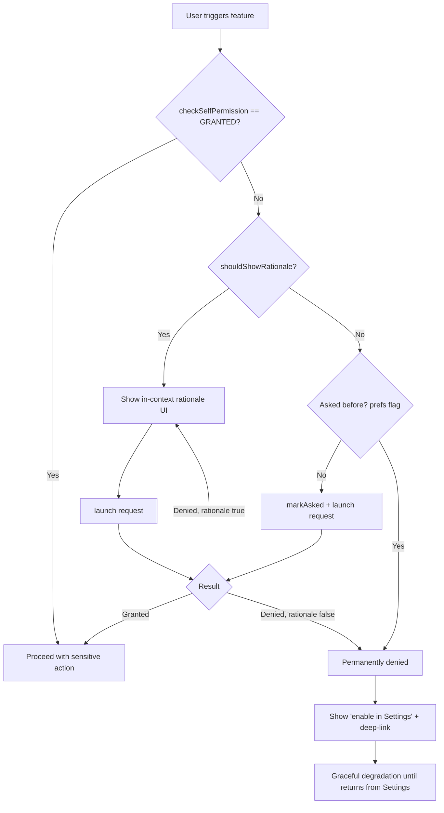

# Permissions

Android permissions gate access to user data (contacts, location, camera) and restricted system actions (drawing over other apps, exact alarms). A senior engineer is expected to know the protection-level taxonomy, the modern `ActivityResultContracts` request flow, the "permanently denied" edge case, and — above all — the moving target of **storage, location, media, and notification** permissions across API levels, because that is where real apps break and where policy strikes happen.

## Protection levels

Every permission declares a **protection level** in its manifest definition. The three that matter day-to-day:

| Level | Granted | User prompt? | Examples | Notes |
|---|---|---|---|---|
| **normal** | At install, automatically | No | `INTERNET`, `ACCESS_NETWORK_STATE`, `VIBRATE`, `SET_ALARM`, `WAKE_LOCK` | Low risk. Just declare in manifest. |
| **dangerous** | At runtime, per user consent | Yes (system dialog) | `CAMERA`, `ACCESS_FINE_LOCATION`, `READ_CONTACTS`, `RECORD_AUDIO`, `POST_NOTIFICATIONS` | Must request via runtime API on API 23+. Grouped. Revocable. |
| **signature** | At install, only if signed with same cert as declarer | No | Custom permissions between your own apps; many platform/OEM perms | Used for inter-app trust without user friction. |

!!! note "Special/appop permissions are a fourth bucket"
    `SYSTEM_ALERT_WINDOW`, `WRITE_SETTINGS`, `MANAGE_EXTERNAL_STORAGE`, `SCHEDULE_EXACT_ALARM`, and `PACKAGE_USAGE_STATS` are technically `signature|appop` or similar. They are **not** grantable via the runtime dialog — they route through a dedicated Settings screen. Treat them as their own category (see [Special permissions](#special-permissions)).

**Install-time vs runtime** is the mental model that replaced the old pre-Marshmallow "accept everything at install" model. Since API 23 (Android 6), dangerous permissions must be requested and can be revoked by the user at any time — so **never assume a permission you had yesterday is still granted.** Always re-check with `ContextCompat.checkSelfPermission()` before the sensitive call.

## Permission groups

Related dangerous permissions belong to a **group** (e.g. `ACCESS_FINE_LOCATION` and `ACCESS_COARSE_LOCATION` are both in `LOCATION`). Historically, granting one member auto-granted the rest of the group. That is **no longer guaranteed** — modern Android prompts per-permission, and the group mostly affects how the dialog is worded and how revocation cascades. Do not rely on "grant one, get the group." Request exactly what you need, and if you need fine location, request the fine/coarse pair together so the system can show the approximate/precise toggle.

## Runtime request flow

### Legacy API (`requestPermissions` / `onRequestPermissionsResult`)

The pre-AndroidX-Activity approach. Still seen in older codebases and worth recognizing:

```kotlin
// Deprecated pattern — recognize it, don't write new code with it.
if (ContextCompat.checkSelfPermission(this, Manifest.permission.CAMERA)
        != PackageManager.PERMISSION_GRANTED) {
    ActivityCompat.requestPermissions(
        this, arrayOf(Manifest.permission.CAMERA), REQ_CAMERA
    )
}

override fun onRequestPermissionsResult(
    requestCode: Int, permissions: Array<String>, grantResults: IntArray
) {
    if (requestCode == REQ_CAMERA &&
        grantResults.firstOrNull() == PackageManager.PERMISSION_GRANTED) {
        openCamera()
    }
}
```

Problems: manual request-code bookkeeping, result delivered to the Activity/Fragment (not the call site), fragile across config changes and process death.

### Modern API (`ActivityResultContracts`)

`registerForActivityResult` with `RequestPermission` (single) or `RequestMultiplePermissions` (batch). It survives config change/process death, delivers the result to a typed callback, and is the current recommendation. **Register during initialization** (as a field / before `STARTED`), never inside a click handler.

```kotlin
class CameraActivity : ComponentActivity() {

    private val requestCamera =
        registerForActivityResult(ActivityResultContracts.RequestPermission()) { granted ->
            if (granted) {
                openCamera()
            } else if (shouldShowRequestPermissionRationale(Manifest.permission.CAMERA)) {
                // User denied once (not permanently). Explain and offer retry.
                showRationaleSnackbar { requestCamera.launch(Manifest.permission.CAMERA) }
            } else {
                // Either first-ever ask (rare here) OR permanently denied ("Don't ask again").
                // Distinguish by tracking "have we asked before?" in prefs.
                if (hasAskedBefore()) sendToAppSettings() else /* first ask edge */ {}
            }
        }

    private fun onTakePhotoClicked() {
        when {
            ContextCompat.checkSelfPermission(this, Manifest.permission.CAMERA)
                == PackageManager.PERMISSION_GRANTED -> openCamera()

            shouldShowRequestPermissionRationale(Manifest.permission.CAMERA) ->
                showRationaleSnackbar { requestCamera.launch(Manifest.permission.CAMERA) }

            else -> {
                markAsked()
                requestCamera.launch(Manifest.permission.CAMERA)
            }
        }
    }

    private fun sendToAppSettings() {
        startActivity(Intent(Settings.ACTION_APPLICATION_DETAILS_SETTINGS,
            Uri.fromParts("package", packageName, null)))
    }
}
```

Multiple permissions at once:

```kotlin
private val requestPerms =
    registerForActivityResult(ActivityResultContracts.RequestMultiplePermissions()) { result ->
        val fine = result[Manifest.permission.ACCESS_FINE_LOCATION] == true
        val coarse = result[Manifest.permission.ACCESS_COARSE_LOCATION] == true
        when {
            fine -> startPreciseTracking()
            coarse -> startApproximateTracking()   // Android 12+ user chose "Approximate"
            else -> degradeGracefully()            // no location — still usable
        }
    }

// Request fine + coarse together so the OS can offer the precise/approximate toggle.
requestPerms.launch(arrayOf(
    Manifest.permission.ACCESS_FINE_LOCATION,
    Manifest.permission.ACCESS_COARSE_LOCATION,
))
```

### `shouldShowRequestPermissionRationale` and the "don't ask again" trap

There is **no direct API** for "is this permanently denied?" You infer it from a combination:

| `checkSelfPermission` | `shouldShowRequestPermissionRationale` | Interpretation |
|---|---|---|
| GRANTED | — | Have it. Proceed. |
| DENIED | `true` | Denied at least once, can ask again → **show rationale, then re-request**. |
| DENIED | `false` (and you've asked before) | **Permanently denied** ("Don't ask again" / two silent denials on Android 11+) → dialog won't show; **deep-link to App Settings**. |
| DENIED | `false` (never asked) | First run → just launch the request. |

The ambiguity in the last two rows is why you must persist a **"have we asked before"** flag yourself (SharedPreferences/DataStore). On Android 11+ (API 30), the system auto-treats a **second denial** as permanent — the user never sees an explicit "don't ask again" checkbox anymore.



## Special permissions

These bypass the runtime dialog. You **cannot** `launch()` them through a permission contract — you send the user to a Settings screen and check the state on return (typically in `onResume`).

| Permission | Check | Settings intent |
|---|---|---|
| `SYSTEM_ALERT_WINDOW` (draw over apps) | `Settings.canDrawOverlays(ctx)` | `ACTION_MANAGE_OVERLAY_PERMISSION` |
| `WRITE_SETTINGS` | `Settings.System.canWrite(ctx)` | `ACTION_MANAGE_WRITE_SETTINGS` |
| `MANAGE_EXTERNAL_STORAGE` (all-files) | `Environment.isExternalStorageManager()` | `ACTION_MANAGE_APP_ALL_FILES_ACCESS_PERMISSION` |
| `SCHEDULE_EXACT_ALARM` | `AlarmManager.canScheduleExactAlarms()` | `ACTION_REQUEST_SCHEDULE_EXACT_ALARM` |

```kotlin
if (!Settings.canDrawOverlays(this)) {
    startActivity(Intent(Settings.ACTION_MANAGE_OVERLAY_PERMISSION,
        Uri.parse("package:$packageName")))
}
// Re-check in onResume(); the result is not delivered via a callback.
```

!!! warning "SCHEDULE_EXACT_ALARM is a Play policy minefield"
    On Android 13 (API 33) `SCHEDULE_EXACT_ALARM` was auto-granted; on **Android 14 (API 34) it is denied by default** for apps targeting 34+, and Google Play restricts it to genuine alarm-clock/calendar use cases. If you don't strictly need to-the-second timing, use `USE_EXACT_ALARM` (allowed for alarm/calendar apps only) or, better, `setAndAllowWhileIdle` / WorkManager with inexact windows to avoid the review friction entirely.

## Storage evolution

Storage is the single most version-sensitive area. The arc:

| API level | Model | What you use |
|---|---|---|
| ≤ 18 (pre-4.4) | Free-for-all external storage | `WRITE_EXTERNAL_STORAGE` for everything |
| 19–28 (4.4–9) | Legacy external storage | `READ/WRITE_EXTERNAL_STORAGE`; broad file access |
| **29 (10)** | **Scoped storage introduced** | App-private dirs need no permission; shared media via `MediaStore`. `requestLegacyExternalStorage=true` as temporary opt-out. |
| **30 (11)** | **Scoped storage enforced** | Legacy flag ignored. `MediaStore` for media, **SAF** (`ACTION_OPEN_DOCUMENT` / `ACTION_CREATE_DOCUMENT`) for arbitrary files. All-files needs `MANAGE_EXTERNAL_STORAGE` + Play justification. |
| **33 (13)** | Granular media perms | `READ_EXTERNAL_STORAGE` split into `READ_MEDIA_IMAGES` / `READ_MEDIA_VIDEO` / `READ_MEDIA_AUDIO`. **Photo Picker** added — no permission at all. |
| **34 (14)** | Partial media access | `READ_MEDIA_VISUAL_USER_SELECTED` — user grants access to *selected* photos only. |

Key takeaways:

- **App-private storage** (`getExternalFilesDir`, `filesDir`, `cacheDir`) **never** needs a permission — first thing to reach for.
- **`WRITE_EXTERNAL_STORAGE` does nothing on API 30+** (has no effect; `maxSdkVersion="28"` it in the manifest).
- **`MANAGE_EXTERNAL_STORAGE` is a hard Play gate**: you must submit a declaration proving a core use case (file manager, backup, antivirus). Reaching for it to "just read a file" gets the app rejected — use SAF or the photo picker instead.

## Media & the Photo Picker

The modern, permission-free way to let a user pick images/videos. Backed by a system UI that shows only what the user selects — no `READ_MEDIA_*` required, and it backports to older versions via Google Play services.

```kotlin
private val pickMedia =
    registerForActivityResult(ActivityResultContracts.PickVisualMedia()) { uri ->
        uri?.let { loadImage(it) }   // null = user cancelled
    }

// Images only; use PickVisualMediaRequest for image/video filters.
pickMedia.launch(PickVisualMediaRequest(
    ActivityResultContracts.PickVisualMedia.ImageOnly
))
```

Media permission matrix:

| Target API | Read images | Notes |
|---|---|---|
| ≤ 32 | `READ_EXTERNAL_STORAGE` | Single broad permission. |
| 33 | `READ_MEDIA_IMAGES` / `READ_MEDIA_VIDEO` / `READ_MEDIA_AUDIO` | Declare only the types you use. |
| 34+ | above **+** `READ_MEDIA_VISUAL_USER_SELECTED` | Handle **partial** grants: user may share only some photos. Query `MediaStore` and expect a subset; offer a "manage selection" affordance. |

!!! tip "Prefer the Photo Picker; declare media perms only if you must enumerate the library"
    If all you need is "let the user choose a picture," use `PickVisualMedia` and declare **no** storage/media permission. Only fall back to `READ_MEDIA_*` when you genuinely need to browse/index the whole library (galleries, editors).

## Location

Three permissions, requested incrementally:

| Permission | Grants | Rule |
|---|---|---|
| `ACCESS_COARSE_LOCATION` | ~city-block accuracy | Fine on its own for many apps. |
| `ACCESS_FINE_LOCATION` | Precise GPS | On **Android 12 (API 31)** the dialog shows a **Precise/Approximate toggle** — the user may downgrade you to coarse even when you asked for fine. Always request fine **and** coarse together and handle the coarse-only outcome. |
| `ACCESS_BACKGROUND_LOCATION` | Location while app is backgrounded | **Must be a separate, later request** — you cannot bundle it with foreground location on API 30+. The system dialog sends the user to Settings to pick "Allow all the time." |

!!! warning "Background location = Play policy review"
    `ACCESS_BACKGROUND_LOCATION` triggers a mandatory Google Play declaration and prominent-disclosure requirement. You must (1) get foreground location first, (2) show an in-context prominent disclosure explaining the background use, (3) then request background separately. Requesting it without a genuine, disclosed feature is a common rejection. Design so the app is fully usable with foreground-only location.

## Notification permission

`POST_NOTIFICATIONS` is a **runtime dangerous permission on Android 13+ (API 33)**. Before 33, notifications needed no permission.

- Apps targeting API 33+ **must** request it at runtime; notifications posted without it are silently dropped.
- Apps targeting ≤ 32 on a 13+ device: the system auto-prompts the first time you post a notification (or on next launch), but you get no control over timing — so **target 33+ and request it in-context** (e.g., right after the user enables an alarm/reminder feature), not at cold start.

```kotlin
if (Build.VERSION.SDK_INT >= Build.VERSION_CODES.TIRAMISU) {
    requestNotif.launch(Manifest.permission.POST_NOTIFICATIONS)
}
```

## Best-practice UX

1. **Request in-context, at the moment of need** — never a wall of permission dialogs at first launch. Ask for camera when they tap the shutter.
2. **Show rationale before the system dialog** when `shouldShowRequestPermissionRationale` is true — explain the value, then request.
3. **Degrade gracefully** — a denied permission should disable a feature, not crash or dead-end the app. A photo app without gallery access should still let the user take a new picture.
4. **Prefer permission-free alternatives** — Photo Picker over `READ_MEDIA_*`, SAF over `MANAGE_EXTERNAL_STORAGE`, app-private dirs over external storage, inexact alarms over `SCHEDULE_EXACT_ALARM`.
5. **Handle permanent denial with a Settings deep-link**, not a nag loop.
6. **Re-check on every use** — permissions are revocable at runtime and the OS may auto-reset unused-app permissions.
7. **Register `ActivityResult` launchers at init time**, never lazily inside a callback.

## Interview Q&A

!!! question "1. What's the difference between normal, dangerous, and signature permissions, and how does each get granted?"
    **Normal** (e.g. `INTERNET`, `VIBRATE`) are low-risk and granted automatically at install just by declaring them. **Dangerous** (e.g. `CAMERA`, `ACCESS_FINE_LOCATION`) access private data and must be requested at runtime on API 23+ via a system dialog; they're revocable at any time. **Signature** permissions are granted only if the requesting app is signed with the same certificate as the app that declared the permission — used for trusted inter-app communication without user prompts. There's also a de-facto fourth bucket, *special/appop* permissions, granted via a dedicated Settings screen, not the runtime dialog.

    *Follow-up: Why can't you request `SYSTEM_ALERT_WINDOW` with `RequestPermission`?* Because it's not a runtime dangerous permission — it's a special permission. You send the user to `ACTION_MANAGE_OVERLAY_PERMISSION` via a Settings intent and check `Settings.canDrawOverlays()` on return; there's no callback result.

!!! question "2. How do you detect and handle a permanently denied permission?"
    There's no direct "is permanently denied" API. You infer it: if `checkSelfPermission` returns DENIED **and** `shouldShowRequestPermissionRationale` returns `false` **and** you've asked before (a flag you persist yourself), the permission is permanently denied — the system dialog won't appear again. At that point you stop re-requesting and instead deep-link the user to App Settings via `ACTION_APPLICATION_DETAILS_SETTINGS`. On Android 11+, the system treats a second denial as permanent automatically.

    *Follow-up: Why do you need your own "asked before" flag?* Because `shouldShowRequestPermissionRationale` returns `false` in **two** distinct cases — never-asked and permanently-denied — so the flag disambiguates them. Without it you'd send a first-run user to Settings unnecessarily.

!!! question "3. Walk me through storage access on Android 13 and 14 for an app that displays user photos."
    On API 33+, `READ_EXTERNAL_STORAGE` no longer works for media; you'd use `READ_MEDIA_IMAGES`. But the better answer is the **Photo Picker** (`ActivityResultContracts.PickVisualMedia`), which needs **no permission at all** and shows a system UI where the user picks specific items. On API 34, if you do declare `READ_MEDIA_IMAGES`, the user can grant **partial** access (`READ_MEDIA_VISUAL_USER_SELECTED`) — you must handle getting back only a subset of the library and offer a way to manage the selection. Rule of thumb: use the Photo Picker unless you genuinely need to enumerate the entire library.

    *Follow-up: When would you ever use `MANAGE_EXTERNAL_STORAGE`?* Almost never — only for true file-manager/backup/antivirus apps, and it requires a Google Play declaration proving that core use case. For everything else, SAF or the photo picker.

!!! question "4. Why is background location handled differently from foreground location, and what are the Play Store implications?"
    On API 30+ you **cannot** request `ACCESS_BACKGROUND_LOCATION` in the same call as foreground location — it must be a separate, later, incremental request, and the system routes the user to Settings to choose "Allow all the time." Google Play requires a formal declaration plus a prominent in-context disclosure justifying the background use; misuse is a common rejection reason. Best practice: get foreground location first, prove the feature works, disclose the background need, then request it separately — and keep the app usable with foreground-only location.

    *Follow-up: On Android 12, a user grants location but the app still gets low accuracy — why?* Android 12 added the Precise/Approximate toggle in the location dialog. The user chose Approximate, so you only got `ACCESS_COARSE_LOCATION` even though you requested fine. You must handle that outcome — request fine and coarse together and degrade to approximate behavior.

!!! question "5. Why is `registerForActivityResult` preferred over `requestPermissions`/`onRequestPermissionsResult`, and where must you register it?"
    The legacy API delivers results to `onRequestPermissionsResult` via manual integer request codes, decoupled from the call site, and is fragile across configuration changes and process death. `registerForActivityResult` with `RequestPermission`/`RequestMultiplePermissions` gives a typed, lambda-based result at the call site, and the framework correctly re-delivers results after config change or process recreation. You **must register it during initialization** — as a field or before the component reaches `STARTED` — never lazily inside a click handler, or you'll get an `IllegalStateException`.

    *Follow-up: How do you request several permissions and react to a partial grant?* Use `RequestMultiplePermissions`, whose callback receives a `Map<String, Boolean>`. Inspect each entry and branch — e.g. fine-location granted → precise tracking, only coarse granted → approximate, none → graceful degradation. Never assume all-or-nothing.
