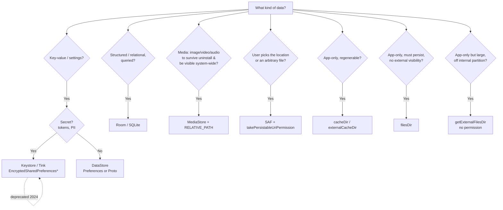

# Storage

Android storage is a layered stack: app-private sandboxes that need no permissions, a scoped-storage media abstraction (`MediaStore`), a user-mediated document picker (Storage Access Framework), and secure key-value/file primitives. Getting the choice right is a senior-level judgment call — the wrong tier ships permission dialogs users reject, `SecurityException`s on Android 10+, or plaintext secrets on disk.

!!! abstract "The one-sentence mental model"
    **App-private → no permission, wiped on uninstall. Shared media → `MediaStore`, no broad file access. User-picked → SAF + persistable URI. Key-value → DataStore. Structured → Room.**

## Internal storage

Internal storage lives on the device's private partition, under `/data/data/<package>/`. It is always available, never requires a permission, and is fully removed on uninstall. Other apps cannot read it (barring root).

| API | Path | Backed up | Cleared by |
|---|---|---|---|
| `filesDir` | `/data/data/<pkg>/files` | Yes (Auto Backup) | Uninstall |
| `cacheDir` | `/data/data/<pkg>/cache` | No | Uninstall, low-disk (OS evicts), "Clear cache" |
| `noBackupFilesDir` | `/data/data/<pkg>/no_backup` | No | Uninstall |
| `codeCacheDir` | `.../code_cache` | No | Uninstall, app update |

```kotlin
// Persistent private file
context.filesDir.resolve("session.json").writeText(json)

// Ephemeral — OS may delete under storage pressure; never assume it survives
val tmp = File.createTempFile("dl_", ".tmp", context.cacheDir)
```

!!! warning "`cacheDir` is not durable"
    The system deletes cache files when the device runs low on space, in no guaranteed order, while your app is not running. Treat `cacheDir` strictly as *regenerable* data (thumbnails, network response caches). Anything you cannot recompute belongs in `filesDir`.

!!! tip "Auto Backup surprises"
    Files under `filesDir` are swept into Google Auto Backup (up to 25 MB) by default and restored on reinstall. If a file holds device-specific state (an FCM token, a `MasterKey`-wrapped secret), a restored copy will be *wrong* on the new device. Exclude it via `noBackupFilesDir` or a `data_extraction_rules.xml` / `full_backup_content` rule.

## External storage (app-specific)

"External" is a historical name — on modern devices it is emulated internal flash. The **app-specific** external directories require **no permission on any API level** and are removed on uninstall, but are world-readable via their path (don't store secrets there).

```kotlin
// App-specific external files — no permission, ever
val docs = context.getExternalFilesDir(Environment.DIRECTORY_DOCUMENTS)
val cache = context.externalCacheDir            // large, evictable cache

// Multiple physical volumes (SD card etc.); index 0 == primary
val allDirs: Array<File?> = context.getExternalFilesDirs(null)
```

Use app-specific external storage over internal when files are large (media exports, downloaded model files) and you want them off the tighter internal partition — but the moment the data must **outlive uninstall** or be **visible to other apps / the Files app**, you need `MediaStore` or SAF instead.

## Scoped storage (Android 10+)

Android 10 (API 29) introduced **scoped storage** and it became mandatory in Android 11 (API 30). The `READ_EXTERNAL_STORAGE` / `WRITE_EXTERNAL_STORAGE` permissions no longer grant broad filesystem access. An app can freely touch only:

- Its **own** app-specific dirs (no permission).
- **Shared media** it created, via `MediaStore` (no permission).
- Other apps' media, via `MediaStore` with the granular read permissions.
- Anything the **user explicitly picks** via SAF or the photo picker.

Raw `File` paths into `/sdcard/...` throw `SecurityException` or silently fail. `WRITE_EXTERNAL_STORAGE` is a no-op on API 30+.

!!! danger "The Android 11 permission split"
    On **API 33+** (Android 13) `READ_EXTERNAL_STORAGE` is gone — you request granular `READ_MEDIA_IMAGES`, `READ_MEDIA_VIDEO`, `READ_MEDIA_AUDIO`. On **API 34+** add `READ_MEDIA_VISUAL_USER_SELECTED` for partial ("Select photos") access. For picking *images* prefer the **Photo Picker** (`ActivityResultContracts.PickVisualMedia`) — it needs **zero permissions** and backports to API 19 via Google Play services.

### The `requestLegacyExternalStorage` escape hatch

`android:requestLegacyExternalStorage="true"` in the manifest opts an app **out** of scoped storage — but only when running on **API 29**. It is ignored on API 30+. It was a one-release migration bridge, not a permanent fix. Any app targeting modern SDKs must have completed the migration; interviewers ask this to check you know it's dead weight now.

For genuine file-manager / backup apps that truly need the whole tree, `MANAGE_EXTERNAL_STORAGE` ("All files access") exists — but it triggers a Play Console policy review and rejection for apps that can't justify it. Never reach for it to dodge doing scoped storage properly.

## MediaStore

`MediaStore` is the content-provider API for **shared media** (images, video, audio, downloads) that survives uninstall and is visible system-wide. Two scoped-storage details make it work without broad permissions: `RELATIVE_PATH` (where in the shared collection the file lands) and `IS_PENDING` (hide a half-written file until you commit it).

```kotlin
suspend fun saveImageToGallery(
    context: Context,
    bitmap: Bitmap,
    displayName: String,
): Uri = withContext(Dispatchers.IO) {
    val resolver = context.contentResolver

    // On API 29+ use the versioned volume; older devices use EXTERNAL_CONTENT_URI.
    val collection = if (Build.VERSION.SDK_INT >= Build.VERSION_CODES.Q) {
        MediaStore.Images.Media.getContentUri(MediaStore.VOLUME_EXTERNAL_PRIMARY)
    } else {
        MediaStore.Images.Media.EXTERNAL_CONTENT_URI
    }

    val details = ContentValues().apply {
        put(MediaStore.Images.Media.DISPLAY_NAME, displayName)
        put(MediaStore.Images.Media.MIME_TYPE, "image/jpeg")
        if (Build.VERSION.SDK_INT >= Build.VERSION_CODES.Q) {
            // Scoped-storage path *inside* Pictures/, no WRITE permission needed
            put(MediaStore.Images.Media.RELATIVE_PATH, "Pictures/MyApp")
            put(MediaStore.Images.Media.IS_PENDING, 1)   // hide until finished
        }
    }

    val uri = resolver.insert(collection, details)
        ?: error("MediaStore insert failed")

    resolver.openOutputStream(uri)!!.use { out ->
        if (!bitmap.compress(Bitmap.CompressFormat.JPEG, 95, out))
            error("Bitmap compress failed")
    }

    if (Build.VERSION.SDK_INT >= Build.VERSION_CODES.Q) {
        details.clear()
        details.put(MediaStore.Images.Media.IS_PENDING, 0) // publish
        resolver.update(uri, details, null, null)
    }
    uri
}
```

Querying is a standard `ContentResolver.query` against the collection with a projection, selection, and sort order:

```kotlin
val projection = arrayOf(
    MediaStore.Images.Media._ID,
    MediaStore.Images.Media.DISPLAY_NAME,
    MediaStore.Images.Media.DATE_ADDED,
)
resolver.query(
    MediaStore.Images.Media.EXTERNAL_CONTENT_URI,
    projection,
    /* selection = */ "${MediaStore.Images.Media.DISPLAY_NAME} LIKE ?",
    /* args = */ arrayOf("%.jpg"),
    "${MediaStore.Images.Media.DATE_ADDED} DESC",
)?.use { cursor ->
    val idCol = cursor.getColumnIndexOrThrow(MediaStore.Images.Media._ID)
    while (cursor.moveToNext()) {
        val id = cursor.getLong(idCol)
        val contentUri = ContentUris.withAppendedId(
            MediaStore.Images.Media.EXTERNAL_CONTENT_URI, id
        )
        // contentUri is what you hand to Coil/Glide/openInputStream
    }
}
```

!!! note "Editing / deleting other apps' media"
    You can only freely modify media **your app created**. To delete or edit media owned by another app on API 29+, the write throws `RecoverableSecurityException` (API 29) — or you proactively request consent with `MediaStore.createWriteRequest()` / `createDeleteRequest()` (API 30+), which returns a `PendingIntent` you launch to get a system confirmation dialog.

## Storage Access Framework (SAF)

When the user needs to pick or create a file **anywhere** — Drive, Dropbox, a USB drive, any `DocumentsProvider` — use SAF. It is permissionless: the system file picker mediates access, and you get a URI scoped to exactly what the user chose.

| Intent / Contract | Purpose |
|---|---|
| `ACTION_OPEN_DOCUMENT` / `OpenDocument` | Pick one existing file (read/write) |
| `ACTION_CREATE_DOCUMENT` / `CreateDocument` | Create a new file at a user-chosen location |
| `ACTION_OPEN_DOCUMENT_TREE` / `OpenDocumentTree` | Grant access to a whole directory subtree |

```kotlin
// Registered at Fragment/Activity init — not inside a composable/callback
private val openDoc = registerForActivityResult(
    ActivityResultContracts.OpenDocument()
) { uri: Uri? ->
    uri ?: return@registerForActivityResult

    // Persist the grant across process death & reboots
    val flags = Intent.FLAG_GRANT_READ_URI_PERMISSION or
        Intent.FLAG_GRANT_WRITE_URI_PERMISSION
    contentResolver.takePersistableUriPermission(uri, flags)

    contentResolver.openInputStream(uri)?.use { it.readBytes() }
}

// Launch — mimeTypes filters the picker
fun pickJson() = openDoc.launch(arrayOf("application/json"))
```

!!! warning "URI permissions die with the process unless made persistable"
    A URI returned from the picker is granted only to your current process by default — it evaporates on process death. Call `takePersistableUriPermission()` to keep it (survives reboot). The system caps total persisted grants (historically ~128–512), so `releasePersistableUriPermission()` ones you no longer need. Enumerate live grants with `contentResolver.persistedUriPermissions`.

For a picked **tree** URI, wrap it in `DocumentFile` to traverse and create children without juggling document-ID string math:

```kotlin
val tree = DocumentFile.fromTreeUri(context, treeUri) ?: return
val child = tree.createFile("text/plain", "export.txt")
child?.uri?.let { u -> contentResolver.openOutputStream(u)?.use { /* write */ } }
```

!!! tip "SAF is slow — don't loop it"
    `DocumentFile.listFiles()` and per-file metadata calls each cross a Binder/IPC boundary into the provider. Listing a large tree file-by-file is pathologically slow. For bulk traversal, query the `DocumentsContract` children URI directly with a projection and a single cursor.

## SharedPreferences

`SharedPreferences` is the legacy XML-backed key-value store. Still ubiquitous, but for **new code, prefer DataStore** ([Module 8](08-datastore.md)) — SharedPreferences has real correctness and performance traps.

```kotlin
val prefs = context.getSharedPreferences("settings", Context.MODE_PRIVATE)
prefs.edit().putBoolean("dark_mode", true).apply()   // async, fire-and-forget
prefs.edit().putBoolean("dark_mode", true).commit()  // synchronous, returns Boolean
```

### `apply()` vs `commit()`

| | `apply()` | `commit()` |
|---|---|---|
| Return | `void` | `Boolean` (success) |
| Disk write | Async on a background thread | **Synchronous on the calling thread** |
| Memory update | Immediate (in-memory map updated at once) | Immediate |
| Use when | Almost always | You genuinely need the write result *now* |

!!! danger "SharedPreferences blocks the main thread — even `apply()`"
    The first `getSharedPreferences()` / read call **loads and parses the entire XML file synchronously**, blocking whatever thread you're on. And `apply()` isn't free either: it writes to memory synchronously and schedules a disk write, but any pending `apply()` writes are **forced to finish synchronously on the main thread** during `Activity.onPause()` / `onStop()` and service lifecycle transitions. With a large prefs file this is a documented source of ANRs. Never call `commit()` on the main thread. This main-thread cost is the core reason DataStore (fully async, `Flow`-based, transactional) replaced it.

Other traps: no type safety, no transactional multi-key update guarantees across processes, `getStringSet` returning a shared mutable instance you must never mutate, and `MODE_MULTI_PROCESS` being deprecated/unreliable.

## Security: encrypted storage

For secrets at rest, the Jetpack Security library (`androidx.security:security-crypto`) wraps AES-256 keys held in the Android Keystore behind a `MasterKey`.

```kotlin
val masterKey = MasterKey.Builder(context)
    .setKeyScheme(MasterKey.KeyScheme.AES256_GCM)
    .build()

val securePrefs = EncryptedSharedPreferences.create(
    context,
    "secure_prefs",
    masterKey,
    EncryptedSharedPreferences.PrefKeyEncryptionScheme.AES256_SIV,   // keys deterministic-encrypted
    EncryptedSharedPreferences.PrefValueEncryptionScheme.AES256_GCM, // values authenticated-encrypted
)
securePrefs.edit().putString("api_token", token).apply()  // same API, ciphertext on disk

// Encrypted files
val encryptedFile = EncryptedFile.Builder(
    context,
    File(context.filesDir, "secret.bin"),
    masterKey,
    EncryptedFile.FileEncryptionScheme.AES256_GCM_HKDF_4KB,
).build()
encryptedFile.openFileOutput().use { it.write(payload) }
```

!!! note "What this actually protects against"
    Keystore-backed encryption defends **data at rest on a lost/stolen device** and against other apps reading a rooted-but-offline dump. It does **not** protect against a live root exploit while your app runs, nor make a determined reverse-engineer's job impossible. Treat it as raising the bar, not a vault.

!!! warning "Jetpack Security is deprecated (2024)"
    Google **deprecated `androidx.security:security-crypto`** and it receives no further updates. For new work, use the Android Keystore directly (`KeyGenParameterSpec` + `Cipher`) or Google **Tink**. Know both the API *and* its status — a senior candidate who cites `EncryptedSharedPreferences` without flagging deprecation looks out of date.

## Sharing files: FileProvider

You may **never** hand another app a `file://` URI — since Android 7 (API 24) it throws `FileUriExposedException`. Expose files through a `FileProvider` (a `ContentProvider`) that mints a temporary `content://` URI with a grant. This ties directly into intents ([Module 19](19-contentprovider.md)).

```kotlin
val uri = FileProvider.getUriForFile(
    context,
    "${context.packageName}.fileprovider",   // authority from the manifest
    File(context.cacheDir, "report.pdf"),
)
val share = Intent(Intent.ACTION_SEND).apply {
    type = "application/pdf"
    putExtra(Intent.EXTRA_STREAM, uri)
    addFlags(Intent.FLAG_GRANT_READ_URI_PERMISSION)  // scoped, temporary grant
}
startActivity(Intent.createChooser(share, "Share report"))
```

The `<provider>` is declared in the manifest with a `<meta-data>` pointing at an XML `<paths>` file that whitelists exactly which directories are shareable. Forgetting `FLAG_GRANT_READ_URI_PERMISSION` is the classic bug: the receiver gets a `SecurityException` on read.

## Decision guide



### Storage locations at a glance

| Location | API to get it | Permission | Survives uninstall | Visible to others |
|---|---|---|---|---|
| Internal files | `filesDir` | None | No | No |
| Internal cache | `cacheDir` | None | No (OS-evictable) | No |
| App-specific external | `getExternalFilesDir()` | None | No | Via path only |
| App-specific ext. cache | `externalCacheDir` | None | No | Via path only |
| Shared media | `MediaStore` | None to create; granular read for others' | **Yes** | **Yes** |
| User-picked file/tree | SAF (`content://`) | None (user-mediated) | Yes (persist grant) | N/A |
| Key-value | DataStore / SharedPreferences | None | Auto Backup unless excluded | No |
| Structured | Room | None | Auto Backup unless excluded | No |

### Permission needs by data type

| Goal | API 28- | API 29 | API 30–32 | API 33+ |
|---|---|---|---|---|
| App-private files (any) | None | None | None | None |
| Write to your gallery/media | `WRITE_EXTERNAL_STORAGE` | None (scoped) | None | None |
| Read your own media | `READ_EXTERNAL_STORAGE` | None | None | None |
| Read **others'** images | `READ_EXTERNAL_STORAGE` | `READ_EXTERNAL_STORAGE` | `READ_EXTERNAL_STORAGE` | `READ_MEDIA_IMAGES` |
| Pick a photo (Photo Picker) | None | None | None | None |
| Pick any file (SAF) | None | None | None | None |
| Whole filesystem | `WRITE_EXTERNAL_STORAGE` | *legacy flag* | `MANAGE_EXTERNAL_STORAGE` | `MANAGE_EXTERNAL_STORAGE` |

## Interview Q&A

!!! question "1. What changed with scoped storage, and how do you write an image to the gallery on Android 10+ without `WRITE_EXTERNAL_STORAGE`?"
    Scoped storage (API 29, enforced API 30) removed broad filesystem access: `WRITE_EXTERNAL_STORAGE` became a no-op and raw `/sdcard` `File` paths fail. To save an image you `insert()` into `MediaStore.Images.Media` with a `RELATIVE_PATH` (e.g. `Pictures/MyApp`) and `IS_PENDING=1`, stream bytes into the returned `content://` URI via `openOutputStream`, then `update()` `IS_PENDING=0` to publish. No permission is needed because the app owns what it creates.
    
    **Follow-up:** *How would you later delete an image another app created?* On API 30+ build a `PendingIntent` with `MediaStore.createDeleteRequest()` and launch it so the system shows the user a confirmation dialog; on API 29 you catch the `RecoverableSecurityException` and launch its embedded `PendingIntent`.

!!! question "2. `apply()` vs `commit()` — and why does SharedPreferences cause ANRs?"
    `commit()` writes to disk synchronously on the calling thread and returns a success `Boolean`; `apply()` updates the in-memory map immediately and schedules the disk write asynchronously, returning void. Both update memory atomically, so reads after either are consistent. ANRs come from two places: the first read parses the entire XML file synchronously (blocking that thread), and pending `apply()` writes are **forced to complete synchronously on the main thread** during `onPause`/`onStop`. A large prefs file plus a lifecycle transition = jank or ANR.
    
    **Follow-up:** *What do you use instead?* DataStore — fully async, coroutine/`Flow`-based, transactional, and it surfaces read errors instead of swallowing them.

!!! question "3. Walk through SAF and persistable URI permissions."
    SAF lets the user pick a file/tree via the system picker (`ACTION_OPEN_DOCUMENT`, `ACTION_CREATE_DOCUMENT`, `ACTION_OPEN_DOCUMENT_TREE`) with no storage permission — access is scoped to exactly what they selected. The returned URI grant is process-scoped and dies on process death; to keep it you call `contentResolver.takePersistableUriPermission(uri, flags)`, which survives reboot. There's a system-wide cap on persisted grants, so release ones you no longer need.
    
    **Follow-up:** *You saved a tree URI last week and now it throws `SecurityException`.* Either you never took the persistable grant (only had the transient one), the user revoked it, or the source app/document was deleted — you must re-prompt via the picker; there is no silent re-grant.

!!! question "4. `getFilesDir()` vs `getExternalFilesDir()` vs `MediaStore` vs SAF — pick for: an offline ML model, a cropped avatar cache, a user photo export, and importing a `.csv` the user chose."
    ML model → `getExternalFilesDir()` (large, no permission, gone on uninstall — fine, it's re-downloadable). Avatar cache → `cacheDir` (regenerable, let the OS evict it). Photo export the user expects in their gallery → `MediaStore` (survives uninstall, visible in Photos). Importing a user-chosen `.csv` from anywhere → SAF `ACTION_OPEN_DOCUMENT`.
    
    **Follow-up:** *Why not just use `getExternalFilesDir` for the gallery export?* Because app-specific dirs are wiped on uninstall and don't appear in the Photos/Gallery app — the user would "lose" their export and can't find it.

!!! question "5. How do you store an auth token securely, and what's the current state of Jetpack Security?"
    Historically `EncryptedSharedPreferences` / `EncryptedFile` with a `MasterKey` (AES-256, key held in the Android Keystore) — same API surface as SharedPreferences but ciphertext on disk. **But `androidx.security:security-crypto` was deprecated in 2024**, so for new code use the Android Keystore directly (`KeyGenParameterSpec` + `Cipher`) or Google Tink. It protects data at rest on a lost/stolen or offline-rooted device; it does not stop a live root exploit.
    
    **Follow-up:** *How would you share that encrypted file with another app?* You wouldn't share the ciphertext — you'd decrypt in-process and expose the plaintext through a `FileProvider` `content://` URI with a temporary `FLAG_GRANT_READ_URI_PERMISSION`, never a `file://` URI (which throws `FileUriExposedException` since API 24).
