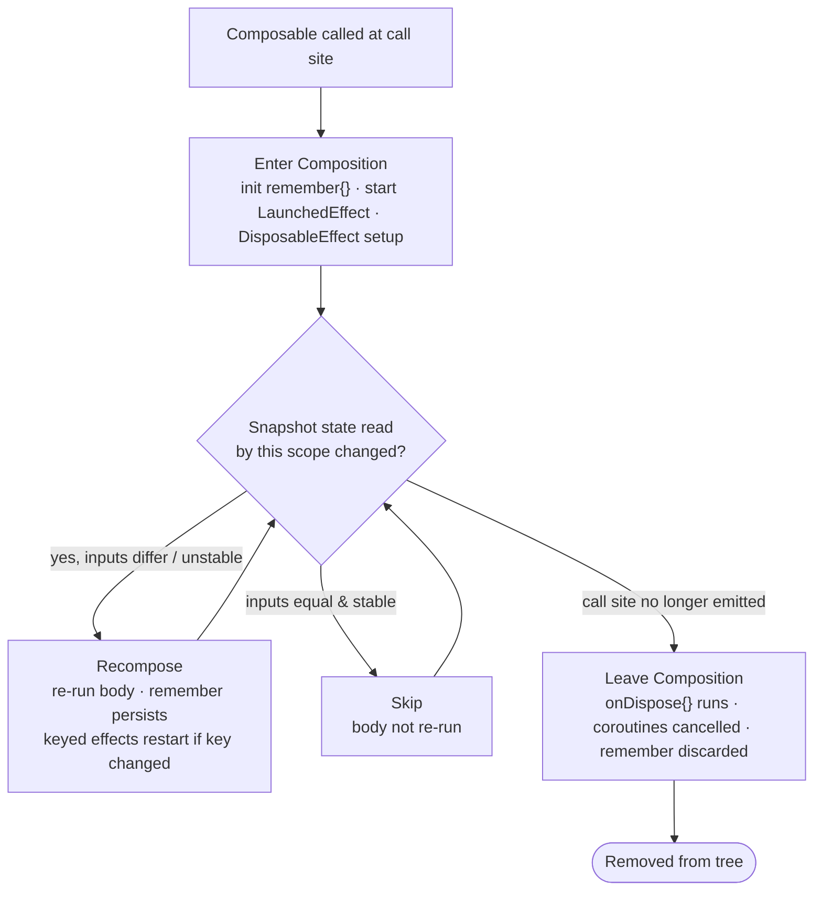

# Jetpack Compose — Basics

A senior-level foundation for engineers who know the View system and are newer to Compose. This module builds the mental model — declarative UI, state, recomposition, side effects, hoisting, layout, lists, and interop — and gives you the vocabulary to reason about a Compose codebase. The deeper runtime (recomposition scoping, the `@Stable`/`@Immutable` contract, the three phases, the slot table) is summarized here but lives in full in your runtime PDF.

!!! abstract "TL;DR"
    - Compose is **declarative**: you describe UI as a function of state (`UI = f(state)`). You never mutate a widget; you change state and the framework re-runs the affected functions.
    - A `@Composable` function **emits** UI as a side effect and returns `Unit`. It is not a normal function — the compiler rewrites it to participate in composition.
    - State that drives UI must be **observable snapshot state** (`mutableStateOf`) held across recompositions with `remember` (or `rememberSaveable` to survive process death). Reading such state inside a composable **subscribes** that scope to it.
    - **Recomposition** re-runs only the composables that read state that changed, and skips those whose inputs are unchanged *and stable*. `key()` controls identity so state is preserved or reset correctly.
    - Anything that isn't "describe UI" — starting a coroutine, subscribing to a callback API, logging after commit — is a **side effect** and belongs in a dedicated effect API (`LaunchedEffect`, `DisposableEffect`, `SideEffect`, …), never inline in the composable body.
    - **Hoist state** out of composables to make them stateless, testable, and reusable; drive them with `value` down / `onEvent` up (unidirectional data flow).

---

## Part A — The declarative model

### A.1 Imperative vs declarative

In the View system you build a tree of mutable widgets once (XML inflation) and then **push mutations** into it over the object's lifetime: `textView.text = "…"`, `button.isEnabled = false`, `adapter.notifyItemChanged(3)`. You are responsible for keeping every widget consistent with the current state, from every code path that can change that state. Bugs are usually a state change that forgot to update one view, or two code paths updating the same view in a racing order.

In Compose you write a function that, given the current state, describes what the UI **should** look like right now. When state changes, the framework re-invokes that function and diffs the result against what's on screen, applying the minimum set of changes. You never hold a reference to a "TextView" and never mutate it.

```kotlin
// Imperative (View): you mutate the widget
fun onCountChanged(n: Int) {
    countLabel.text = "Count: $n"
    resetButton.isEnabled = n > 0
}

// Declarative (Compose): you describe UI from state
@Composable
fun Counter(count: Int, onReset: () -> Unit) {
    Text("Count: $count")
    Button(onClick = onReset, enabled = count > 0) { Text("Reset") }
}
```

!!! note "The mental shift"
    Stop asking "when X happens, which views do I update?" Start asking "what state exists, and what does the screen look like for any value of it?" Consistency is then automatic: there is exactly one code path (the composable) that maps state → UI.

### A.2 Composable functions

`@Composable` is not a decoration — it changes the function's calling convention. The Compose compiler plugin rewrites every `@Composable` function to receive an implicit `Composer` parameter and a `changed` bitmask, and inserts "group" markers so the runtime can track *where in the UI tree* each call sits.

Rules that fall out of this:

- **They return `Unit` and emit UI.** Calling `Text(...)` doesn't return a widget; it records "a Text node should exist here" into the composition. Composition structure is positional.
- **They can only be called from other composables.** The `Composer` is only in scope inside `@Composable` context.
- **They must be side-effect free in their body.** Re-running is normal and can happen at any time, on any frame, possibly in parallel, and can be abandoned. Don't mutate external variables, don't start coroutines, don't do I/O directly in the body.
- **Order and identity matter.** The runtime identifies a call by its position in the source (its call site) plus loop index. This is why `key()` exists (see C.4).
- **Naming convention:** UI-emitting composables are `PascalCase` nouns (`ProfileCard`). Composables that *return* a value (like `remember`-based helpers) are `camelCase`.

!!! warning "Do not treat the body as `onCreate`"
    A composable body runs on the very first composition **and on every recomposition**. Code like `viewModel.load()` or `analytics.log("screen")` placed directly in the body will fire repeatedly and unpredictably. That work belongs in an effect (Part D).

---

## Part B — State

### B.1 What counts as state

State is any value that, when it changes, should change the UI. For Compose to react, the state must be **observable snapshot state**, produced by `mutableStateOf(...)` (or its typed variants `mutableIntStateOf`, `mutableStateListOf`, `mutableStateMapOf`). A plain `var` is invisible to the runtime — mutating it changes nothing on screen.

```kotlin
var plain = 0                          // NOT observable — changing it does nothing
val state = mutableStateOf(0)          // observable; state.value is tracked
```

`mutableStateOf` returns a `MutableState<T>`, which is a `State<T>` (read-only `value`) plus a setter. **Reading `.value` inside a composable records a subscription**: the runtime notes "this composition scope read this state object," and when the state's `value` changes, it schedules that scope for recomposition. This read-tracking is the entire reactivity mechanism — there are no manual observers.

### B.2 `remember` — surviving recomposition

If you write `val state = mutableStateOf(0)` directly in a composable body, you get a **fresh** state object on every recomposition — you'd throw away the value each time. `remember { }` stores the result of its lambda in the composition's slot table at this call site and returns the same instance across recompositions:

```kotlin
val count = remember { mutableStateOf(0) }   // same MutableState across recompositions
// idiomatic: destructure into value + setter
var count by remember { mutableStateOf(0) }  // `by` uses the property delegate
```

`remember(key1, key2)` re-initializes when any key changes — use this to reset derived cached values when an input changes.

!!! note "`remember` survives recomposition, not everything"
    `remember` is cleared when the composable **leaves the composition** (e.g., you navigate away, or an `if` removes it). It does **not** survive configuration changes or process death — that's `rememberSaveable`'s job.

### B.3 `rememberSaveable` — surviving config change & process death

`rememberSaveable` behaves like `remember` but also writes the value into the saved-instance-state `Bundle`, so it survives configuration changes (rotation) and system-initiated process death. The value must be `Bundle`-able (primitives, `Parcelable`, `Serializable`) or you must supply a custom `Saver`.

```kotlin
var name by rememberSaveable { mutableStateOf("") }  // survives rotation
```

| | `remember` | `rememberSaveable` |
|---|---|---|
| Survives recomposition | ✅ | ✅ |
| Survives config change (rotation) | ❌ | ✅ |
| Survives system process death | ❌ | ✅ |
| Value constraints | any type | `Bundle`-able or custom `Saver` |
| Backing store | slot table (heap) | slot table **+** saved-state `Bundle` |
| Use for | transient UI state (animations, scroll target, expanded flags) | user input, selections that must outlive rotation |

!!! warning "Don't put screen-level state in either"
    `remember`/`rememberSaveable` are for **local, ephemeral UI state**. Business state, data loaded from a repository, and anything that must be shared or survive navigation belongs in a `ViewModel` (Part H). `rememberSaveable` is for small local values, not lists of domain objects.

### B.4 The snapshot system (essentials)

Compose state lives in a **snapshot** system (`androidx.compose.runtime.snapshots`) — a transactional, MVCC-style model borrowed from software transactional memory. Two properties matter at this level:

- **Isolation:** each snapshot sees a consistent view of all state. This is what makes Compose safe to run on multiple threads and enables tools like `derivedStateOf` and `snapshotFlow`.
- **Change notification:** when a mutable snapshot is applied (committed), the system knows exactly which state objects changed and notifies subscribers (the recomposer, `snapshotFlow`, etc.). This is how a `.value =` write from any thread eventually schedules the right recompositions on the main thread.

You rarely touch the API directly, but it explains *why* only `mutableStateOf` triggers recomposition and why reads are what create subscriptions.

---

## Part C — Recomposition

### C.1 What triggers it

Recomposition is re-running composable functions to update the tree. It is triggered when **a snapshot state object that was read during composition changes value**. Nothing else triggers it — not method calls, not time passing, not a plain variable changing. The unit of recomposition is a **recompose scope** (roughly, the body of a composable, or a smaller restartable region), not the whole screen.

Flow: `state.value = x` → snapshot applied → recomposer sees which state changed → the scopes that *read* that state are invalidated → on the next frame they re-run → the diff is applied to the tree.

### C.2 Reading is subscribing — where you read matters

Because the subscription is created at the point of the read, **pushing the read down** to the smallest composable that needs it narrows what recomposes. Reading a frequently-changing state high in the tree recomposes everything below the read; reading it in a leaf recomposes only the leaf.

```kotlin
// BAD: reads scroll offset high up → whole layout recomposes each frame
@Composable
fun Header(scroll: ScrollState) {
    val alpha = 1f - (scroll.value / 300f)   // read here
    Box(Modifier.graphicsLayer { this.alpha = alpha }) { /* big subtree */ }
}

// BETTER: defer the read into the layer lambda (runs in a later phase, not recomposition)
Box(Modifier.graphicsLayer { alpha = 1f - (scroll.value / 300f) }) { /* subtree */ }
```

### C.3 Skipping & stability (high level)

If a composable is re-invoked but **all its parameters are equal to last time**, the runtime **skips** it — it doesn't re-run the body. But this optimization is only safe when the parameter types are **stable**: the compiler can prove that `equals` is reliable and that the object won't mutate behind Compose's back.

- **Stable / Immutable:** primitives, `String`, functional types, `@Immutable`/`@Stable`-annotated types, and types the compiler infers as stable. These enable skipping.
- **Unstable:** types the compiler can't prove — e.g., a `data class` with a `List<T>` field (the `List` interface could be a mutable implementation), or classes from modules not compiled with Compose. An unstable parameter defeats skipping and forces recomposition even when "nothing changed."

!!! note "Practical rule"
    Prefer immutable data (`kotlinx.collections.immutable`'s `ImmutableList`, `val`-only data classes) for state passed into composables. Unstable params are the #1 cause of "why is this recomposing every frame?" Full treatment — strong skipping mode, stability inference, `@Stable` contract — is in the runtime PDF.

### C.4 `key()` and list identity

Composition identity is positional by default. When you emit items in a loop, the Nth call site "is" the Nth item — if the list reorders or an item is inserted at the front, Compose matches by position and mis-associates state (`remember`ed values, animations) with the wrong item.

`key(id) { … }` wraps a region with an explicit identity so Compose preserves/moves its state correctly across recompositions:

```kotlin
Column {
    for (task in tasks) {
        key(task.id) {                 // state stays glued to this task, not its slot
            TaskRow(task)
        }
    }
}
```

For lazy lists, you pass `key = { it.id }` to `items(...)` instead (Part F). Keys are about **identity and state preservation**, and they also enable animated reordering.

---

## Part D — Side effects

A **side effect** is anything that escapes the "describe UI from state" contract: starting a coroutine, registering/unregistering a listener, mutating an object outside composition, or running code *after* the UI is committed. Because composable bodies re-run arbitrarily, side effects must be wrapped in effect APIs that give them a defined, lifecycle-aware execution.

### D.1 The effect APIs

| API | Runs | Coroutine? | Keyed / cancellable | Use when |
|---|---|---|---|---|
| `LaunchedEffect(keys)` | Enters composition; **restarts** when a key changes; cancels on leave | ✅ suspend block | keyed; auto-cancelled | Run suspend work tied to composition: load data, animate, collect a flow, one-shot per key |
| `rememberCoroutineScope()` | Returns a scope tied to composition | ✅ launch from callbacks | cancelled on leave | Start coroutines from **event callbacks** (button `onClick`), not on composition |
| `DisposableEffect(keys)` | Enters composition; **cleanup** on leave or key change | ❌ (has `onDispose`) | keyed | Subscribe + must unsubscribe: register listeners, `LifecycleObserver`, sensors, callbacks |
| `SideEffect` | After **every successful** (re)composition/commit | ❌ | not keyed | Publish Compose state to a non-Compose object every frame it changes (e.g., analytics, third-party controller) |
| `derivedStateOf { }` | Lazily; recomputes only when read *and* inputs changed | ❌ | remembered | Derive state from other state where the derived value changes **less often** than its inputs |
| `produceState(initial, keys)` | Launches a coroutine that pushes into a returned `State<T>` | ✅ | keyed | Convert a non-Compose async/callback source into `State<T>` |
| `snapshotFlow { }` | Cold `Flow` emitting when the read snapshot state changes | ✅ (collect it) | — | Bridge Compose state → Flow operators (debounce, distinctUntilChanged) |

### D.2 `LaunchedEffect` vs `rememberCoroutineScope`

The single most common confusion. **`LaunchedEffect` starts work as a consequence of composition/state; `rememberCoroutineScope` starts work as a consequence of a user event.**

```kotlin
@Composable
fun SearchScreen(query: String, repo: Repo) {
    val scope = rememberCoroutineScope()
    val snackbar = remember { SnackbarHostState() }

    // 1) Composition-driven: re-runs whenever `query` changes, cancels the previous.
    //    Perfect for "when the input changes, do async work."
    var results by remember { mutableStateOf<List<Item>>(emptyList()) }
    LaunchedEffect(query) {
        delay(300)                       // debounce; cancelled if query changes again
        results = repo.search(query)
    }

    // 2) Event-driven: launched from a callback, NOT on composition.
    //    Using LaunchedEffect here would be wrong — there's no key to hang it on.
    Button(onClick = {
        scope.launch { snackbar.showSnackbar("Saved") }
    }) { Text("Save") }
}
```

!!! warning "Don't launch from a composable body, don't LaunchedEffect from a callback"
    - `scope.launch { }` directly in the body → a new coroutine on every recomposition. Wrong.
    - `LaunchedEffect(Unit) { }` to react to a click → the click isn't a key; the effect ran once at composition, not on the click. Wrong. Use `rememberCoroutineScope`.

!!! note "Handling exceptions inside a composable"
    A composable function itself isn't a place to `try`/`catch` around state that changes shape mid-recomposition — the crash usually needs to happen *before* you get there. The real cases:

    - **Inside `LaunchedEffect`/`rememberCoroutineScope` work** (a suspend call that can throw): catch it exactly like any coroutine — `try { repo.search(query) } catch (e: Exception) { errorState = e }` inside the effect block — and store the failure as **state** (an `error` field in your `UiState`), then let the composable render that state. Don't let the exception propagate out of the effect uncaught; an uncaught exception in `LaunchedEffect` crashes the app like any other unhandled coroutine exception (see [M12 Coroutines](12-coroutines.md)).
    - **An exception thrown directly from composition** (a bug in the composable body itself, e.g. an unguarded `list[10]` on a 3-item list) is *not* recoverable per-composable — Compose has no per-node error boundary. It propagates up like any Kotlin exception and, if uncaught, crashes the activity. Guard with normal Kotlin null-safety/bounds-checking in the body; don't rely on `try`/`catch` around UI code as a safety net.
    - The idiomatic pattern is therefore: **push failures into state, render error state declaratively** (`is UiState.Error -> ErrorScreen(...)`), the same UDF discipline as loading/success — not ad-hoc `try`/`catch` scattered through composables.

### D.3 `DisposableEffect` — subscriptions with cleanup

When you register something that must be unregistered, use `DisposableEffect`; its `onDispose` runs when the composable leaves or a key changes. Classic case: observing the `Lifecycle`.

```kotlin
@Composable
fun OnResume(onResume: () -> Unit) {
    val owner = LocalLifecycleOwner.current
    DisposableEffect(owner) {
        val obs = LifecycleEventObserver { _, e ->
            if (e == Lifecycle.Event.ON_RESUME) onResume()
        }
        owner.lifecycle.addObserver(obs)
        onDispose { owner.lifecycle.removeObserver(obs) }   // no leak
    }
}
```

### D.4 `derivedStateOf` — computed state that changes less often

Use it when a value is derived from other state but changes far less frequently than its inputs, so you want to avoid recomposing on every input change.

```kotlin
val listState = rememberLazyListState()
// firstVisibleItemIndex changes constantly while scrolling; `showButton` flips rarely.
val showButton by remember {
    derivedStateOf { listState.firstVisibleItemIndex > 5 }
}
if (showButton) ScrollToTopFab()   // recomposes only when the boolean flips, not every scroll px
```

!!! note "`derivedStateOf` vs just computing inline"
    If the derived value changes at the same rate as its inputs (e.g., `fullName = "$first $last"`), skip `derivedStateOf` — a plain computation is cheaper. `derivedStateOf` earns its keep only when it **collapses** frequent input changes into infrequent output changes.

### D.5 `snapshotFlow` — Compose state → Flow

`snapshotFlow` turns reads of snapshot state into a cold `Flow`, letting you apply Flow operators:

```kotlin
LaunchedEffect(listState) {
    snapshotFlow { listState.firstVisibleItemIndex }
        .distinctUntilChanged()
        .debounce(200)
        .collect { analytics.log("scrolled_to", it) }
}
```

---

## Part E — State hoisting & unidirectional data flow

### E.1 The pattern

A **stateless** composable holds no state; it receives its state as parameters and reports events via callbacks. **Hoisting** is the act of moving `remember { mutableStateOf() }` *out* of a composable and up to its caller. The canonical shape is `value` down, `onValueChange` up:

```kotlin
// Stateful wrapper (owns state) — hoist the state to whatever level needs to share it.
@Composable
fun NameField() {
    var name by rememberSaveable { mutableStateOf("") }
    NameFieldContent(name = name, onNameChange = { name = it })
}

// Stateless, reusable, previewable, testable — pure function of its inputs.
@Composable
fun NameFieldContent(name: String, onNameChange: (String) -> Unit) {
    TextField(value = name, onValueChange = onNameChange, label = { Text("Name") })
}
```

### E.2 Why hoist

- **Single source of truth** — one owner of the value; children can't diverge.
- **Reusability** — the stateless version works anywhere; no hidden state.
- **Testability / previews** — you drive it purely with parameters.
- **Correct sharing** — hoist to the **lowest common ancestor** of all composables that read or write the state.

!!! note "Unidirectional data flow (UDF)"
    State flows **down** (as parameters), events flow **up** (as lambdas). The owner mutates state in response to events; the change flows back down as a new value. This is the same loop as MVI/`StateFlow`-based ViewModels — Compose's UI layer is a natural fit for UDF.

---

## Part F — Layout

### F.1 The Modifier — order matters

`Modifier` is an ordered, immutable chain of decorations applied to a composable — size, padding, background, click handling, semantics, etc. **Order is significant** because each modifier wraps the next: layout modifiers affect the constraints passed inward, and draw/background modifiers paint in chain order.

```kotlin
// padding OUTSIDE background → padding is transparent (background starts after it)
Box(Modifier.padding(16.dp).background(Color.Blue))

// padding INSIDE background → background fills first, padding is inset (blue border effect)
Box(Modifier.background(Color.Blue).padding(16.dp))
```

Common families: sizing (`size`, `fillMaxWidth`, `weight` inside Row/Column), spacing (`padding`), appearance (`background`, `clip`, `border`, `graphicsLayer`), interaction (`clickable`, `pointerInput`), and insets (`windowInsetsPadding`, `systemBarsPadding`). Build shared modifiers with `Modifier.then(...)`.

!!! warning "Two more order gotchas"
    - `.clip()` before `.background()` vs after changes whether the background is clipped.
    - `.clickable()` defines the touch target at its position in the chain — put it *after* `padding` if you want the padding to be tappable, *before* if not.

!!! note "`Modifier.padding().height()` vs `Modifier.height().padding()`"
    Same principle, applied to sizing instead of drawing — each layout modifier constrains the *next* one inward, so which one runs first changes what the fixed size actually measures.

    ```kotlin
    // height() OUTSIDE padding(): the box is exactly 100.dp tall; padding eats INTO that,
    // shrinking the visible/content area to 100.dp - 32.dp.
    Box(Modifier.height(100.dp).padding(16.dp))

    // padding() OUTSIDE height(): padding is applied first (adds to the outer size), then
    // a 100.dp-tall child is placed inside — the total occupied height is 100.dp + 32.dp.
    Box(Modifier.padding(16.dp).height(100.dp))
    ```

    Read the chain outside-in for constraints: whichever sizing modifier is **outermost** is measured against the *incoming* constraints from the parent; everything inside it receives the *already-reduced* constraints. This is exactly why `.padding().background()` and `.background().padding()` differ for drawing, and `.padding().height()` / `.height().padding()` differ for the final measured box size — same "modifiers wrap inward" mental model, two different modifier families.

!!! note "There is no `margin` in Compose"
    Compose has no `Modifier.margin()` — the View-system split between "my own inset" (padding) and "space around me, outside my bounds" (margin) doesn't exist as two separate concepts here. Everything is `padding`, applied at whichever level actually needs the space:

    - **Space around a single child inside its parent** → put `Modifier.padding(...)` **on the child itself**, not the parent (padding on the parent shrinks everyone's content area; padding on one child only pushes that child).
    - **Even spacing between siblings in a `Row`/`Column`** → `Arrangement.spacedBy(8.dp)` on the parent, not per-child padding (avoids doubled gaps at the boundary between two padded children).
    - **Asymmetric "margin" on one side only** → `Modifier.padding(start = 16.dp)` on that child, same as any other padding — there's no separate margin API to reach for.

!!! note "Window insets modifiers"
    Since edge-to-edge is the default (see [M37 Material](37-material.md) for the View-system side), Compose gives you inset-aware modifiers instead of a manual `OnApplyWindowInsetsListener`:

    - **`Modifier.windowInsetsPadding(WindowInsets.systemBars)`** — the general form; insets content by an arbitrary `WindowInsets` value (status bar, nav bar, IME, display cutout — or a union of them).
    - **`Modifier.systemBarsPadding()`** — shorthand for insetting by the status bar + navigation bar together; use it on a screen's root when you want content clear of both bars.
    - **`Modifier.navigationBarsPadding()`** / **`.statusBarsPadding()`** — insets by just one bar, when a screen wants to draw *under* the status bar but stay clear of the nav bar (or vice versa) — e.g. a full-bleed header image that should still start below the status bar.
    - **`Modifier.imePadding()`** — insets by the on-screen keyboard, so a bottom text field/send-button row isn't covered when the IME opens; typically paired with `Scaffold`'s own inset handling.

    Apply these once near the root (often via `Scaffold`'s `contentWindowInsets` / `innerPadding`) rather than on every leaf composable, or you'll double-inset nested content.

### F.2 Column, Row, Box

| Composable | Lays out | Main axis (Arrangement) | Cross axis (Alignment) |
|---|---|---|---|
| `Column` | children **vertically** | `verticalArrangement` | `horizontalAlignment` |
| `Row` | children **horizontally** | `horizontalArrangement` | `verticalAlignment` |
| `Box` | children **stacked** (z-order) | — | `contentAlignment` (+ per-child `Modifier.align`) |

- **Arrangement** distributes children along the main axis: `spacedBy(8.dp)`, `SpaceBetween`, `Center`, `Bottom`/`End`.
- **Alignment** positions along the cross axis.
- **`weight`** (Row/Column only) splits remaining space proportionally, like `layout_weight`.

```kotlin
Row(
    Modifier.fillMaxWidth().padding(16.dp),
    horizontalArrangement = Arrangement.spacedBy(8.dp),
    verticalAlignment = Alignment.CenterVertically,
) {
    Icon(Icons.Default.Person, null)
    Text("Profile", Modifier.weight(1f))   // takes leftover space
    Switch(checked = true, onCheckedChange = {})
}
```

!!! note "These are not nested-layout-cheap the way ViewGroups are expensive"
    Compose measures each child once (single-pass, with the constraints model), so deep nesting of `Row`/`Column`/`Box` is generally fine — there is no measure/layout explosion like nested `LinearLayout`s. Use `ConstraintLayout` only when you genuinely need cross-child constraints, not for perf.

### F.3 Custom layouts with `Layout`

When `Row`/`Column`/`Box` can't express the arrangement you need (a flow layout that wraps to the next line, a staggered grid, a custom two-pane split), drop to the **`Layout`** composable — the same primitive `Row`/`Column`/`Box` are themselves built on. You supply a `content` slot and a **measure policy**: measure each child against incoming `Constraints`, decide your own size, then place each child at an offset.

```kotlin
@Composable
fun FlowRow(
    modifier: Modifier = Modifier,
    hGap: Dp = 8.dp,
    vGap: Dp = 8.dp,
    content: @Composable () -> Unit,
) {
    Layout(content = content, modifier = modifier) { measurables, constraints ->
        val hGapPx = hGap.roundToPx()
        val vGapPx = vGap.roundToPx()
        val placeables = measurables.map { it.measure(constraints) }   // measure once, each

        // Decide placement: wrap to a new row when the next item would overflow.
        var x = 0; var y = 0; var rowHeight = 0
        val positions = placeables.map { p ->
            if (x + p.width > constraints.maxWidth) { x = 0; y += rowHeight + vGapPx; rowHeight = 0 }
            val pos = x to y
            x += p.width + hGapPx
            rowHeight = maxOf(rowHeight, p.height)
            pos
        }

        layout(constraints.maxWidth, y + rowHeight) {           // report final size
            placeables.forEachIndexed { i, p -> p.placeIndexed(positions[i]) }
        }
    }
}

private fun Placeable.placeIndexed(pos: Pair<Int, Int>) = placeRelative(pos.first, pos.second)
```

Key rules the measure policy must follow: **measure each child at most once** (Compose enforces single-pass measurement; re-measuring throws), and `layout(width, height) { }` is where you call `placeable.placeRelative(x, y)` for every child — nothing is drawn until placement runs. For layouts that need a child's *intrinsic* size before deciding constraints for others (e.g. "size this column to the tallest sibling"), use the intrinsic-measurement APIs (`IntrinsicSize.Max`) rather than measuring twice by hand. `SubcomposeLayout` is the escape hatch when you need a *later* child's content to depend on an *earlier* child's measured size — it defers composing some children until after others are measured, at a real performance cost, so reach for `Layout` first.

---

## Part G — Lazy lists

`Column`/`Row` compose **all** children immediately — fine for a handful, disastrous for hundreds. `LazyColumn`/`LazyRow` are the Compose equivalent of `RecyclerView`: they only compose and lay out the items in (and near) the viewport, recycling as you scroll. There is no adapter and no ViewHolder — you describe items in a DSL.

### G.1 Keys and contentType

```kotlin
@Composable
fun MessageList(messages: List<Message>, state: LazyListState) {
    LazyColumn(
        state = state,
        contentPadding = PaddingValues(vertical = 8.dp),
        verticalArrangement = Arrangement.spacedBy(8.dp),
    ) {
        item { ListHeader() }                       // single item

        items(
            items = messages,
            key = { it.id },                        // stable identity
            contentType = { it.type },              // recycling hint
        ) { message ->
            MessageRow(message)
        }

        item { if (messages.isEmpty()) EmptyState() }
    }
}
```

- **`key`** gives each item a stable identity. Without it, insert/remove/reorder mis-associates item state and scroll position (same problem as `key()` in C.4). With it, Compose preserves state and animates reorders. Keys must be unique and stable.
- **`contentType`** tells Compose which items share a layout "shape," so it reuses the composition/slots of a scrolled-off item for a new item of the same type — analogous to `RecyclerView` view types. Give distinct types to structurally different rows (header vs message vs ad) for better reuse.
- **`LazyListState`** (from `rememberLazyListState()`) exposes scroll position and is your handle for programmatic scrolling and derived UI (like C.4's scroll-to-top FAB).

!!! warning "Don't nest scrollables in the same direction"
    A vertically-scrolling `Column(Modifier.verticalScroll())` containing a `LazyColumn` throws (infinite height constraints). Use a single `LazyColumn` with multiple `item`/`items` blocks, or `contentPadding`/header items, instead of nesting.

---

## Part H — ViewModel & navigation in Compose

### H.1 ViewModel in a composable

`hiltViewModel()` (or `viewModel()`) obtains a `ViewModel` scoped to the nearest `ViewModelStoreOwner` — the host `Activity`, or in Navigation Compose, the **`NavBackStackEntry`** (so each destination gets its own instance, cleared when it pops off the back stack). Collect its state with **`collectAsStateWithLifecycle()`**, which pauses collection when the lifecycle drops below `STARTED` — the correct default, versus `collectAsState()` which collects even in the background.

```kotlin
@Composable
fun ProfileRoute(viewModel: ProfileViewModel = hiltViewModel()) {
    // Lifecycle-aware: stops collecting when the screen is not at least STARTED.
    val uiState by viewModel.uiState.collectAsStateWithLifecycle()

    ProfileScreen(
        state = uiState,                          // state down
        onRefresh = viewModel::refresh,           // events up (UDF)
    )
}

// Stateless screen — no ViewModel, fully previewable/testable.
@Composable
fun ProfileScreen(state: ProfileUiState, onRefresh: () -> Unit) { /* … */ }
```

!!! note "Keep the ViewModel at the route edge"
    Inject the ViewModel in a thin *route* composable, then pass plain state + lambdas to a stateless *screen* composable. This keeps the bulk of your UI free of DI and lifecycle concerns, and trivially previewable. (Recall: standalone screens should not smuggle mutable business state into `remember`.)

!!! warning "`collectAsState` vs `collectAsStateWithLifecycle`"
    Prefer `collectAsStateWithLifecycle()` (from `lifecycle-runtime-compose`) for flows backed by app data — it avoids doing work and holding upstream resources while the UI is in the background. Use plain `collectAsState()` only for flows that are cheap and purely UI-local.

### H.2 Navigation Compose (brief)

Navigation Compose hosts a `NavHost` with `composable("route") { }` destinations and a `NavController` for navigation. Each destination is a `NavBackStackEntry` and its own `ViewModelStoreOwner` and `SavedStateHandle` scope. Type-safe routes (serializable route objects) are the modern approach.

```kotlin
val nav = rememberNavController()
NavHost(nav, startDestination = "list") {
    composable("list")  { ListRoute(onOpen = { id -> nav.navigate("detail/$id") }) }
    composable("detail/{id}") { DetailRoute() }
}
```

See **[M21 — Navigation Component](21-navigation.md)** for the full treatment (back stack, args, deep links, nested graphs, type-safe navigation, scoping ViewModels to a graph).

### H.3 Handling the system back press (`BackHandler`)

**`BackHandler(enabled = true) { }`** is the Compose-idiomatic way to intercept the system back gesture/button from inside a composable — it wraps `OnBackPressedCallback` (the same AndroidX dispatcher `Activity`/`Fragment` use) so you don't reach into `LocalOnBackPressedDispatcherOwner` by hand. It follows on/off registration the same way `DisposableEffect` does — enabled while the composable is in composition, automatically removed when it leaves.

```kotlin
@Composable
fun ConfirmDiscardScreen(hasUnsavedChanges: Boolean, onConfirmedBack: () -> Unit) {
    var showDialog by remember { mutableStateOf(false) }

    BackHandler(enabled = hasUnsavedChanges) {   // only intercepts while there's something to lose
        showDialog = true                         // show a confirm dialog instead of leaving
    }

    if (showDialog) {
        AlertDialog(
            onDismissRequest = { showDialog = false },
            confirmButton = { TextButton(onClick = onConfirmedBack) { Text("Discard") } },
            text = { Text("Discard unsaved changes?") },
        )
    }
}
```

`enabled` toggling is the key lever: when `false`, the callback steps out of the way and the *next* handler up the chain (a parent `BackHandler`, `NavController`'s own back handling, or finally the system) gets the event — so you only intercept back when you actually need to (an open bottom sheet, unsaved-changes confirmation, a custom multi-step wizard), not unconditionally. Navigation Compose's `NavHost` already installs its own back handling for popping the back stack; a screen-level `BackHandler` composes *in front of* that and takes priority while enabled, which is exactly the mechanism a confirm-before-leaving dialog relies on. For the **predictive back** gesture animation (Android 14+), the platform surfaces progress callbacks that Navigation 2.8+ and Compose's `PredictiveBackHandler` can drive a transition from — see `android:enableOnBackInvokedCallback` in [M30 Manifest](30-manifest.md).

---

## Part I — Theming (Material 3)

`MaterialTheme` provides three design axes via `CompositionLocal`s, readable anywhere below it as `MaterialTheme.colorScheme`, `MaterialTheme.typography`, `MaterialTheme.shapes`:

```kotlin
@Composable
fun AppTheme(dark: Boolean = isSystemInDarkTheme(), content: @Composable () -> Unit) {
    val colors = if (dark) darkColorScheme(primary = Purple80) else lightColorScheme(primary = Purple40)
    MaterialTheme(
        colorScheme = colors,
        typography = Typography(bodyLarge = TextStyle(fontSize = 16.sp)),
        shapes = Shapes(medium = RoundedCornerShape(12.dp)),
        content = content,
    )
}

// Consume — never hardcode:
Text("Title", style = MaterialTheme.typography.titleLarge, color = MaterialTheme.colorScheme.primary)
```

- **Color** — semantic roles (`primary`, `surface`, `onSurface`, `error`…), not raw colors. Supports light/dark schemes and (M3) dynamic color from wallpaper on Android 12+.
- **Typography** — named text styles (`displayLarge` … `labelSmall`).
- **Shape** — corner shapes for small/medium/large components.

!!! note "Theme is delivered via CompositionLocal"
    `MaterialTheme` doesn't pass values as parameters; it publishes them through `CompositionLocal`, which any descendant reads implicitly. This is the idiomatic way to provide ambient, tree-scoped values (also how `LocalContext`, `LocalLifecycleOwner`, `LocalDensity` work). Reading a `CompositionLocal` subscribes to it like any other state.

---

## Part J — Compose lifecycle

A composable has a lifecycle inside the **composition** distinct from the `Activity`/`Fragment` lifecycle:

1. **Enter composition** — the composable is called for the first time at a call site; its `remember`ed values and effects initialize.
2. **Recompose (0..n times)** — inputs/state change; the body re-runs; `remember` persists; keyed effects restart if their keys changed.
3. **Leave composition** — the call site is no longer emitted (removed by an `if`, list change, or navigation); `remember`ed values are discarded and `DisposableEffect.onDispose`/`LaunchedEffect` cancellation runs.



!!! note "This is why effects are keyed"
    An effect's key is how you tie its lifetime to a piece of state: same key across recompositions → the effect keeps running; changed key → cancel + restart; leaves composition → cancel/dispose. Getting keys right is most of "using effects correctly."

---

## Part K — Interop with the View system

Compose and Views coexist in the same app, even the same screen. Two bridges:

- **`ComposeView`** — a `View` that hosts Compose. Drop it into an XML layout or add it programmatically to run Compose inside a View-based screen (incremental migration, or Compose inside a `Fragment`/`RecyclerView` row). Set `setContent { }`.
- **`AndroidView`** — a composable that hosts a `View`. Use it to embed a widget Compose doesn't have or you can't yet migrate: `MapView`, `WebView`, `AdView`, a custom `TextureView`, legacy custom views.

```kotlin
// View hosting Compose
class LegacyFragment : Fragment() {
    override fun onCreateView(i: LayoutInflater, c: ViewGroup?, s: Bundle?) =
        ComposeView(requireContext()).apply {
            setViewCompositionStrategy(ViewCompositionStrategy.DisposeOnViewTreeLifecycleDestroyed)
            setContent { AppTheme { Greeting() } }
        }
}

// Compose hosting a View
@Composable
fun Map(latLng: LatLng) {
    AndroidView(
        factory = { ctx -> MapView(ctx).apply { onCreate(null) } },  // created once
        update = { it.moveCamera(latLng) },                          // runs on recomposition
    )
}
```

!!! warning "Interop pitfalls"
    - Set an appropriate `ViewCompositionStrategy` on `ComposeView` (default disposes on lifecycle destroy) to avoid leaks — critical inside `RecyclerView`.
    - `AndroidView`'s `factory` runs once; `update` runs on every recomposition — put creation in `factory`, state application in `update`.
    - Both directions incur a bridging cost; avoid deeply interleaving them per-item in a hot list.

---

## Part L — Compose vs XML: tradeoffs

| Dimension | Compose | View/XML |
|---|---|---|
| Paradigm | Declarative, state-driven | Imperative, mutate widgets |
| UI + logic location | Kotlin, one place | XML + Kotlin/Java, split |
| Boilerplate | Low (no `findViewById`, adapters, ViewHolders) | High (binding, adapters, custom view lifecycle) |
| Lists | `LazyColumn` DSL | `RecyclerView` + Adapter + ViewHolder + DiffUtil |
| Reuse | Composable functions + Modifiers | Custom views, `<include>`, styles |
| Animation | First-class, state-based, concise | Verbose (`Animator`, transitions) |
| Theming | `MaterialTheme` via CompositionLocal, dynamic color | Themes/styles in XML |
| Preview / iteration | `@Preview` + live edit | Layout editor / device run |
| Maturity / ecosystem | Newer; some gaps still bridged via interop | Decades of libraries, samples, Stack Overflow |
| Learning curve | New mental model (recomposition, stability) | Familiar to most Android devs |
| Runtime cost | Recomposition/stability must be understood to keep it fast | Measure/layout cost of deep ViewGroups; but predictable |

!!! note "Senior take"
    Compose is the default for new UI and its productivity/consistency wins are real, but it is **not free of foot-guns** — recomposition and stability replace the View system's measure/layout pitfalls. Interop (`ComposeView`/`AndroidView`) means migration is incremental, not all-or-nothing; a large app can (and usually does) run both for years.

---

## Interview Q&A

!!! question "1. What actually triggers a recomposition, and why doesn't mutating a plain `var` do anything?"
    Recomposition is triggered only when a **snapshot state object** (`mutableStateOf` et al.) that was **read during composition** has its `value` changed. Reading `.value` inside a composable records a subscription for that recompose scope; committing a write to that state invalidates the subscribed scopes, which re-run on the next frame. A plain `var` isn't observable — the runtime has no way to know it changed and no subscription was ever recorded, so the UI never updates. That's why UI-driving state must be `mutableStateOf` held in `remember`.

    **Follow-up:** *Where you place the read affects performance — why?* Because the subscription is created at the read site, reading high in the tree invalidates the whole subtree below the read; pushing the read into the smallest leaf (or deferring it into a lambda that runs in a later phase, like `graphicsLayer`) narrows what recomposes.

!!! question "2. `remember` vs `rememberSaveable` — when does each fail to preserve state?"
    `remember` survives recomposition but is discarded when the composable **leaves the composition** and does **not** survive configuration changes or process death. `rememberSaveable` additionally writes into the saved-instance-state `Bundle`, so it survives rotation and system-initiated process death — but the value must be `Bundle`-able or have a custom `Saver`, and it's meant for **small local UI state**, not domain data. Neither is a substitute for a `ViewModel` (config-change survival for arbitrary in-memory state) or a repository/`DataStore` (real persistence).

    **Follow-up:** *You have a text field that loses its content on rotation — what's the minimal fix and the "correct" fix?* Minimal: `rememberSaveable { mutableStateOf("") }`. Correct at scale: hoist the value into a `ViewModel` (backed by `SavedStateHandle` if it must survive process death), keeping the field stateless.

!!! question "3. `LaunchedEffect` vs `rememberCoroutineScope` — when do you reach for each?"
    `LaunchedEffect(key)` starts a coroutine **as a consequence of composition/state**: it launches when the composable enters, cancels+restarts when a key changes, and cancels when it leaves. Use it for data loads tied to an input, animations, or collecting a flow. `rememberCoroutineScope()` returns a composition-scoped scope you `launch` from **event callbacks** (a button click) — work that isn't caused by composition. Rule of thumb: composition-driven → `LaunchedEffect`; user-event-driven → `rememberCoroutineScope`.

    **Follow-up:** *What breaks if you `scope.launch{}` directly in the composable body, or use `LaunchedEffect(Unit){}` for a click?* The former spawns a new coroutine on every recomposition (leaks/duplicated work); the latter runs once at composition and never on the click, because the click isn't a key.

!!! question "4. What is state hoisting and why is it the backbone of a good Compose codebase?"
    Hoisting moves state out of a composable up to its caller, turning it into a **stateless** function that takes `value` and emits `onValueChange`/`onEvent` — value down, events up (unidirectional data flow). Benefits: a single source of truth (children can't diverge), reusability (no hidden state), and testability/previewability (drive it purely with parameters). You hoist to the lowest common ancestor of everything that reads or writes the state. It's the same UDF loop as a `StateFlow`-based ViewModel, which is why the two compose cleanly: ViewModel owns state, stateless composables render it.

    **Follow-up:** *Where should the ViewModel live in this pattern?* At a thin "route" composable at the destination edge (`hiltViewModel()`), which passes plain state + lambdas into a stateless "screen" composable — keeping the bulk of the UI DI- and lifecycle-free.

!!! question "5. Why do `LazyColumn` items need `key` and `contentType`, and what goes wrong without them?"
    Composition identity is positional, so without a `key`, item state (`remember`ed values, animations, and scroll anchoring) is associated with **slot position**, not the data item — inserting/removing/reordering mis-associates state and can jump the scroll position. `key = { it.id }` gives stable identity so state moves with the item and reorders can animate. `contentType` is a recycling hint: items of the same type can reuse each other's composition/slots (like `RecyclerView` view types), improving scroll performance when you have structurally different rows. Keys fix correctness; contentType tunes performance.

    **Follow-up:** *Your list janks when new items prepend at the top — likely cause?* Missing/unstable keys, so Compose rebuilds items instead of moving them and the scroll anchor shifts; add stable keys.

!!! question "6. What does 'stability' mean for skipping, and how would you diagnose a composable that recomposes every frame?"
    A composable is **skipped** on recomposition only if all parameters are equal to last time **and** their types are **stable** — the compiler can trust their `equals` and that they won't mutate unobserved. Unstable params (e.g., a `data class` holding a `List<T>`, or a type from a non-Compose module) defeat skipping, so the composable re-runs even when nothing visibly changed. To diagnose: enable Compose compiler metrics/reports to see which params are inferred unstable, watch recomposition counts in Layout Inspector, then fix by using immutable types (`ImmutableList`, `val`-only data classes), annotating with `@Immutable`/`@Stable`, or hoisting the unstable value out. Also check for a lambda being recreated each recomposition or a `CompositionLocal`/state read placed too high.

    **Follow-up:** *`collectAsState` vs `collectAsStateWithLifecycle` — how does the wrong choice waste work here?* `collectAsState` keeps collecting the upstream flow even when the UI is in the background, holding resources and potentially driving recompositions off-screen; `collectAsStateWithLifecycle` pauses below `STARTED`, so prefer it for app-data flows.

!!! question "7. Compare Jetpack Compose and XML Views in terms of rendering and build performance. What are the key advantages of Compose?"
    **Answer:** Compose offers substantial performance wins over the traditional XML View system by fundamentally redesigning how UI is built, measured, and drawn:
    
    1.  **Elimination of XML Parsing (Zero Inflation):** In the View system, `setContentView()` or inflating views requires reading XML resource files on the main thread via reflection (`LayoutInflater`), which is notoriously slow. Compose is built entirely in Kotlin; UI layouts are compiled directly to JVM bytecode, eliminating XML parsing and reflection overhead entirely during screen rendering.
    2.  **Flat Layout Hierarchy (Single Measure Pass):** Deeply nested XML ViewGroups (like `LinearLayout` with weights or `RelativeLayout`) trigger multiple measure passes, which scales exponentially with depth and causes frame drops. Compose enforces a strict **Single Pass Measurement** policy: a layout node cannot measure its children more than once, and the compiler encourages a completely flat composition tree.
    3.  **Granular Smart Recomposition:** In the View system, calling `invalidate()` or changing visibility triggers a layout traversal up to the root (`ViewRootImpl`) and redrawing of large segments of the tree. In Compose, recomposition operates at the level of individual restartable scopes (often a single composable block); if a state parameter changes, only that specific node re-runs, and sibling nodes with stable inputs are completely skipped.
    4.  **No Style Resolution Overhead:** Traditional views must resolve style attributes, themes, and selectors dynamically at runtime. Compose binds styling, themes, and colors directly as Kotlin properties at compilation time, skipping runtime attribute traversal.
    
    **Follow-up:** *Where can Compose perform worse than XML if not optimized?* — (1) During **initial composition** (which has startup cost as the slot table is allocated), and (2) during debug builds (Compose relies heavily on compiler optimizations like strong skipping, R8 code stripping, and outline generation, so debug performance is noticeably slower than release).

!!! question "8. Walk me through the different side-effect APIs in Jetpack Compose, their internal differences, and when to use each."
    **Answer:** Compose side-effects are structured hooks to safely perform actions that escape a composable's pure-function boundary. They differ in timing, scope, and key tracking:
    
    1.  **`LaunchedEffect(keys)` (Coroutine/Async):** Launches a coroutine scoped to the composition lifecycle. It starts when entering composition, cancels and restarts when any `key` changes, and cancels when leaving composition. Use for network calls, animations, or collecting state flows.
    2.  **`DisposableEffect(keys)` (Non-Coroutine/Cleanup):** Similar to `LaunchedEffect` but runs non-suspending setup code and **forces** you to provide an `onDispose { }` block. It executes its cleanup when keys change or the composable leaves composition. Use for adding/removing listeners, registering callbacks, or binding resources.
    3.  **`rememberCoroutineScope()` (Event-driven Coroutine):** Returns a CoroutineScope bound to the composition. It does *not* launch a coroutine automatically; you call `.launch { }` inside standard callback listeners (like a button's `onClick`). Use when asynchronous operations are triggered by user actions rather than composition entry.
    4.  **`SideEffect` (Compose-to-Non-Compose):** Executes its block on **every successful recomposition** (after state writes are committed to the screen). Use to publish internal Compose states to non-Compose systems (like a Firebase tracker or a legacy view manager).
    5.  **`rememberUpdatedState(value)` (Keep reference fresh):** Creates a stable wrapper state pointing to the latest `value`. If a long-running effect (like a 5-second network request in `LaunchedEffect`) needs to read a parameter that might change *without* restarting the effect, wrap it in `rememberUpdatedState` so the effect reads the updated reference directly.
    6.  **`derivedStateOf { }` (Reduce recompositions):** Wraps a calculation that reads other state parameters. It caches the calculation result and only invalidates observers when the *final calculated value* changes, avoiding excessive recompositions from high-frequency updates (e.g., scroll positions).
    7.  **`produceState(initialValue, keys)` (Non-Compose to Compose):** Syntactic sugar over `LaunchedEffect` that exposes a `produceState` helper to convert external callbacks, flows, or listeners into a Compose `State<T>` wrapper.
    
    **Follow-up:** *What is the risk of using a hardcoded `LaunchedEffect(Unit)` or `LaunchedEffect(true)`?* — The coroutine will only run once upon entering composition and will never restart, even if the values it reads inside the block change. This can lead to stale state bugs; only use `Unit` when the operation is genuinely a one-shot task (like showing a splash screen).


