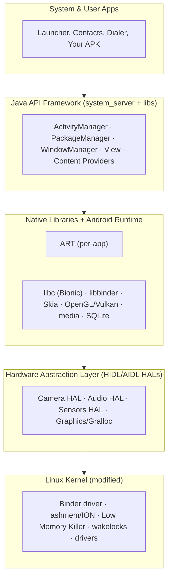
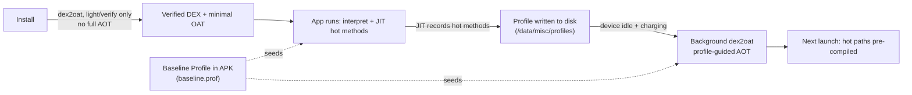
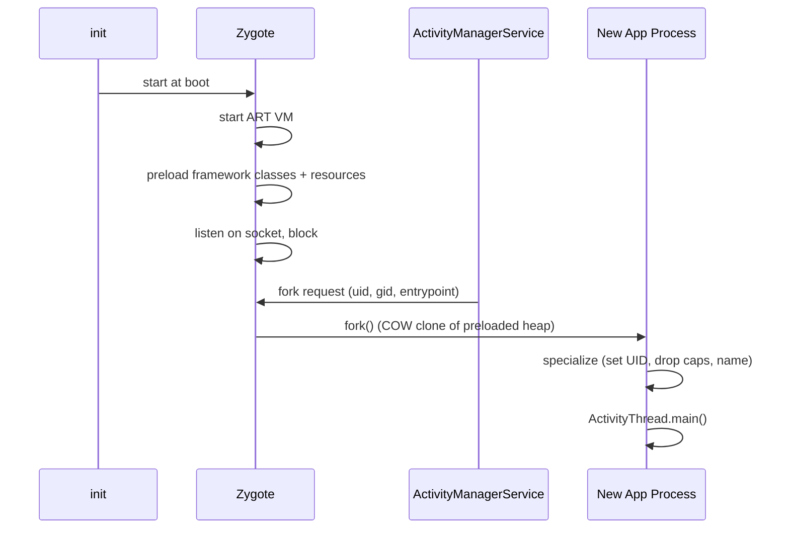
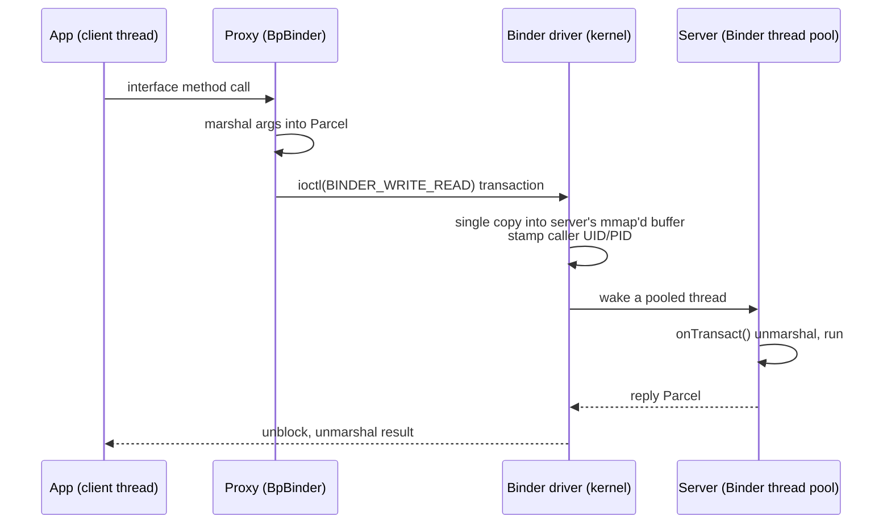
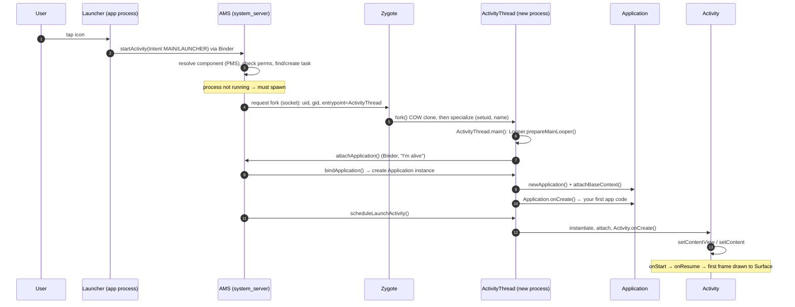

# Android Architecture & System

Android is not a Linux distribution with a phone UI bolted on. It is a layered system where a modified Linux kernel provides isolation and drivers, a native userspace hosts the runtime and system services, and every app process is a **fork of a warm template process** that shares memory with every other app. Understanding these layers — and the Binder IPC fabric that stitches them together — is what separates "I use `Activity`" from "I know what happens when the user taps the icon."

!!! abstract "What a senior is expected to explain"
    - Why an app process starts in ~tens of milliseconds instead of booting a fresh JVM (Zygote + copy-on-write).
    - Why the runtime is *neither* pure AOT *nor* pure JIT, and where baseline profiles fit (see [M33 · Performance](33-performance.md)).
    - Why Android built Binder instead of using pipes/sockets, and what the 1 MB limit actually is.
    - The exact call chain from `Launcher` tap to `Application.onCreate()` to first frame.

---

## The Android Software Stack

The platform is a stack of five layers. Each layer only talks to the one directly beneath it through a stable interface, which is what lets Google ship a new framework while OEM kernels and vendor HALs stay frozen (Project Treble formalized this boundary).



| Layer | Runs as | Key responsibility | Senior-relevant detail |
|---|---|---|---|
| **Linux kernel** | ring 0 | Process/memory isolation, drivers, scheduling | Modified: adds the **Binder driver**, **ashmem/ION** shared memory, **Low Memory Killer**, `wakelock` power mgmt. Each app UID is a real Linux user → filesystem sandbox. |
| **HAL** | native `.so` loaded into a HAL process | Uniform C/AIDL interface over vendor drivers | Treble split it into its own process so the framework can update independently of the vendor image. |
| **Native libs + ART** | native | Skia (2D), Vulkan/GL, media codecs, Bionic libc, SQLite | ART is loaded **per app process**; the native libs are largely `mmap`ed read-only and shared. |
| **Java API Framework** | mostly inside `system_server` + in-process libs | The SDK you compile against (`Activity`, `View`, managers) | Manager objects in your process are thin **Binder proxies**; the real state lives in `system_server`. |
| **System apps** | normal app processes | Launcher, SystemUI, Settings, etc. | Have no special API access beyond granted permissions — SystemUI is "just an app" with signature perms. |

!!! note "Bionic, not glibc"
    Android's libc is **Bionic** — smaller, BSD-licensed (avoids GPL in userspace), with a custom `pthread`/`dlmalloc`(→`jemalloc`/`scudo`) and a linker that supports namespaces. This is why native code built for desktop Linux does not run unmodified.

---

## ART — The Android Runtime

ART replaced Dalvik in Android 5.0. The interview trap is the false binary "AOT vs JIT" — modern ART is a **hybrid** that changes strategy across the app's lifetime.

### Dex bytecode

Kotlin/Java compiles to `.class` (stack-based JVM bytecode), then **d8/R8** transforms it into **DEX** (Dalvik Executable) — a **register-based** ISA. Register machines emit fewer instructions per operation than stack machines (no constant push/pop), which matters on memory-constrained devices. All classes are packed into `classes.dex` (multidex → `classes2.dex`…), and at install time the dex is optimized/verified into an **OAT** file (ELF wrapping compiled native code + the dex).

### The AOT ↔ JIT hybrid



| Strategy | When | Cost | Payoff |
|---|---|---|---|
| **Interpreter** | Cold, unprofiled code | Zero compile, slow execution | Instant startup, no install bloat |
| **JIT** | Method crosses hotness threshold at runtime | CPU + battery to compile; lives in memory | Adapts to *actual* usage; feeds the profile |
| **AOT (profile-guided)** | Idle maintenance (`dex2oat`) using recorded profiles | Disk + one-time CPU while charging | Hot methods run as native on next launch |

The pre-Android-7 model was **install-time full AOT**: every method compiled up front → slow installs, huge OAT files, and app updates re-compiled everything. The profile-guided model (N+) compiles only what's actually hot.

!!! tip "Baseline Profiles — the piece seniors are expected to name"
    A **Baseline Profile** (`baseline.prof`, shipped inside the APK/AAB) is a list of hot methods/classes generated *at build time* (via Macrobenchmark) by the app author. It **seeds** the profile so the very first launch after install already has critical paths AOT-compiled — you don't wait for the user to warm up the JIT. Google reports ~30% faster startup on first launches. This is the single highest-leverage cold-start win and is covered in depth in [M33 · Performance Optimization](33-performance.md).

### Garbage collection

ART's GC is **generational** and **concurrent** (Concurrent Copying, CC, is the default modern collector). Key properties a senior should state:

- **Generational hypothesis**: most objects die young → a small, frequently-collected *young generation* (bump-pointer allocation, cheap) plus a *mature space* collected rarely.
- **Concurrent copying**: collection runs mostly on GC threads *concurrently* with mutators; pauses are sub-millisecond, versus Dalvik's stop-the-world pauses that caused visible jank.
- **Compaction**: the copying collector moves objects to defragment the heap, so allocation stays a fast pointer bump and large contiguous allocations succeed.
- **No explicit `free`**: you influence GC only by *not retaining* — which is why leaks (a `static` holding an `Activity`, a non-cancelled coroutine) are the real memory problem, not GC tuning.

Full heap mechanics, leak patterns, and `LeakCanary`/`Memory Profiler` workflow live in [M27 · Memory Management](27-memory.md).

---

## Zygote — Why App Startup Is Cheap

Every app process is forked from **Zygote**, a template process started at boot by `init`. Zygote does the expensive one-time work *once*, before any app exists:

1. Starts an ART VM instance.
2. **Preloads** the framework classes (`~thousands`) and common resources (drawables, strings) into its heap.
3. Opens a listening socket and blocks, waiting for fork requests.



**The payoff is copy-on-write (COW).** `fork()` doesn't copy Zygote's memory; the child shares the parent's physical pages read-only. The preloaded framework classes and resources therefore exist as **one physical copy** shared across *every* running app. A page is only privately duplicated when a process *writes* to it. Consequences:

- App startup skips VM init and framework class loading — it inherits them for free.
- System-wide RAM use is dramatically lower: 50 apps do not hold 50 copies of `android.*`.
- The child then **specializes**: `setuid` to the app's UID, drops capabilities, sets the process name, and jumps into `ActivityThread.main()`.

!!! note "Two Zygotes"
    On 64-bit devices there are typically two Zygotes (`zygote` and `zygote64`) so both 32- and 64-bit apps fork from a matching preloaded template. There is also an **App Zygote / usap** (Unspecialized App Process) pool that pre-forks blank children to shave the fork latency itself.

!!! warning "COW and static initializers"
    Because children share Zygote's pages, anything Zygote preloads is shared *as initialized at boot*. This is why you can't rely on framework static state differing per app, and why an app must never assume a fresh global address space — it inherited one.

---

## system_server & System Services

Immediately after boot, Zygote forks one very special child: **`system_server`**. It is a single process hosting **dozens of core system services** as threads, each exposing a Binder interface. When your app calls `getSystemService(...)`, you receive a **proxy** that marshals calls over Binder into `system_server`.

| Service | Abbrev | Owns | Example call from your app |
|---|---|---|---|
| **ActivityManagerService** | AMS | Process lifecycle, task/back stack, `startActivity`, ANRs, OOM adj | `startActivity(intent)` → AMS decides whether to fork a process |
| **PackageManagerService** | PMS | Installed packages, permissions, component resolution, signatures | `queryIntentActivities()`, permission checks at install/runtime |
| **WindowManagerService** | WMS | Window Z-order, surfaces, input routing, transitions | Adding a window / `Toast`; coordinates with SurfaceFlinger |
| **PowerManagerService** | PMS(pwr) | Wakelocks, screen state, Doze, suspend/resume | `PowerManager.WakeLock.acquire()` |
| **InputManagerService** | IMS | Reads `/dev/input`, dispatches events to the focused window | Touch/key delivery to your `View` |
| **NotificationManagerService** | NMS | Posting, ranking, channels | `notify()` |

!!! danger "`system_server` is a single point of failure"
    Because so many services share one process, an uncaught exception or a Binder deadlock in `system_server` triggers a **runtime restart** ("System UI restart" / soft reboot) — every app is killed and re-forked, but the kernel keeps running. This is why framework code there is defensive and why holding a `system_server` lock while calling back into an app is a classic deadlock hazard.

**AMS is the orchestrator of startup.** It maintains the LRU list of processes and their **oom_adj** scores (foreground → visible → service → cached), which it pushes to the kernel Low Memory Killer so the kernel evicts the *least* important process under memory pressure.

---

## Binder IPC

Android's isolation model puts each app in its own process/UID, so *everything* interesting — starting activities, getting sensor data, drawing windows — is a **cross-process call**. Binder is the IPC mechanism that makes those calls feel like local method calls.

### Why Binder and not pipes/sockets/SysV?

| Concern | Pipes / Unix sockets | Binder |
|---|---|---|
| **Copies** | 2 copies (sender→kernel, kernel→receiver) | **1 copy** — the driver copies straight into the target process's mapped buffer |
| **Identity** | App must self-report PID/UID (spoofable) | Kernel driver **stamps caller UID/PID** — unforgeable, the basis of permission checks |
| **Object references** | None — you pass bytes | Passes **object handles**; the driver maps a binder in process A to a proxy in process B |
| **Threading** | Roll your own | Built-in **thread pool** per process, managed by the driver |
| **Death notification** | Manual | `linkToDeath` — get a callback when the remote process dies |

The core mechanism: the **Binder driver lives in the kernel** (`/dev/binder`). Each process `mmap`s a region the driver owns. On a transaction, the driver performs a **single copy** from the sender's buffer directly into the receiver's mapped region, then wakes a thread in the receiver's **Binder thread pool** to handle it. One copy (not the usual two) is the headline performance property.



### Parcel, Parcelable, and Serializable

Data crossing Binder is flattened into a **`Parcel`** — a byte buffer plus a table of live binder object references. `Parcel` is *not* general-purpose serialization; it's an in-memory, same-boot transport (never persist a Parcel).

| | `Parcelable` | `Serializable` |
|---|---|---|
| Mechanism | You (or `@Parcelize`) write explicit `writeToParcel`/`createFromParcel` | JVM reflection walks the object graph |
| Speed | Fast — no reflection, no metadata | Slow — reflection + writes class metadata per object |
| Allocations | Minimal | Heavy (reflection, temporary buffers) → GC pressure |
| Use for | **IPC / Intent extras / saved state** (the Android way) | Rarely; only cross-JVM persistence where speed is irrelevant |

```kotlin
// @Parcelize generates writeToParcel/createFromParcel at compile time.
// Requires: id("kotlin-parcelize") in the module's build.gradle.kts
import android.os.Parcelable
import kotlinx.parcelize.Parcelize

@Parcelize
data class GameScore(
    val level: Int,
    val points: Long,
    val playerName: String,
) : Parcelable

// Put it in an Intent — flattened into a Parcel by Binder on the way to AMS/another process.
intent.putExtra("score", GameScore(level = 12, points = 98_400, playerName = "Kesava"))
val restored: GameScore? = intent.getParcelableExtra("score", GameScore::class.java) // API 33+ typed overload
```

### AIDL — defining a Binder interface

For a bound service crossing process boundaries, you declare the contract in **AIDL** (Android Interface Definition Language). The build generates a `Stub` (server side, extends `Binder`) and a `Proxy` (client side), handling all marshalling.

```java
// IScoreService.aidl  — the .aidl file is the source of truth
package com.appfactory.scores;

import com.appfactory.scores.GameScore; // Parcelables must be declared/imported too

interface IScoreService {
    // Each method becomes a Binder transaction; args marshalled into a Parcel.
    long submitScore(in GameScore score);
    GameScore bestScore(String player);
}
```

```kotlin
// Server: implement the generated Stub. onTransact() runs on a Binder pool thread — NOT the main thread.
class ScoreService : Service() {
    private val binder = object : IScoreService.Stub() {
        override fun submitScore(score: GameScore): Long { /* validate, persist */ return score.points }
        override fun bestScore(player: String): GameScore = /* look up */ GameScore(1, 0, player)
    }
    override fun onBind(intent: Intent): IBinder = binder
}
```

!!! warning "The 1 MB transaction buffer & `TransactionTooLargeException`"
    Each process has a Binder transaction buffer of **~1 MB, shared across all in-flight transactions**. Exceed it and the transaction fails with `TransactionTooLargeException`. The classic real-world triggers:

    - Returning a huge `List`/`Bitmap` from a bound service.
    - Stuffing a large object into an `Intent` extra (e.g., a full bitmap) — startActivity crosses Binder to AMS.
    - **`onSaveInstanceState` bundles that are too big** — the `Bundle` is Parceled to `system_server`; large data there crashes on backgrounding. Save IDs/keys, not payloads.

    The practical limit is well under 1 MB because the buffer is shared and concurrent. Pass large data by a `ContentProvider`, file, or shared memory (`ashmem`/`MemoryFile`) reference instead.

---

## App Startup — End to End

Putting the layers together: here is the complete cold-start path from the user tapping the launcher icon to `Application.onCreate()` and the first `Activity`.



Stepwise, with the mechanism at each hop:

1. **Tap** → the Launcher (itself an app) fires an `Intent` with `ACTION_MAIN`/`CATEGORY_LAUNCHER`.
2. **`startActivity` crosses Binder** into **AMS** inside `system_server`.
3. **AMS resolves** the target component via **PMS**, verifies permissions, and locates or creates the **task/back-stack**.
4. **Process check**: if no process hosts this app's UID, AMS must spawn one.
5. **AMS asks Zygote** (over its socket) to `fork`, passing the UID/GID and the entry class `android.app.ActivityThread`.
6. **Zygote forks** (COW) and the child **specializes** — sets the app UID, drops caps, renames the process.
7. **`ActivityThread.main()`** runs: it creates the **main `Looper`/`MessageQueue`** (this *is* the main thread) and calls `attachApplication()` back to AMS.
8. **AMS calls `bindApplication()`**; `ActivityThread` instantiates your `Application`, runs `attachBaseContext()` then **`Application.onCreate()`** — the first line of *your* code, so heavy init here directly taxes cold start.
9. **AMS schedules the launch Activity**; `ActivityThread` creates it and drives **`onCreate()` → `onStart()` → `onResume()`**.
10. The view hierarchy is measured/laid out/drawn and the **first frame** is pushed to a `Surface` (composited by SurfaceFlinger) — this is the moment "Time To Initial Display" is measured.

!!! tip "Where cold start actually goes (senior framing)"
    The fork is cheap (COW). The expensive, *app-controlled* parts are **`Application.onCreate()`** (DI graph, SDK init, disk reads) and first-frame layout. Levers: lazy/deferred init (`androidx.startup`), a Baseline Profile so hot startup methods are pre-AOT'd, and keeping `onCreate` off the main-thread disk. Measure with **Macrobenchmark** (TTID/TTFD), not a stopwatch. See [M33 · Performance Optimization](33-performance.md).

---

## Interview Q&A

!!! question "1. Android is built on Linux — so is it just a Linux distro? What did Google actually change in the kernel?"
    No. Android uses a **modified** Linux kernel and a completely non-GNU userspace (**Bionic** libc, not glibc; no standard GNU tooling). Kernel additions/changes include the **Binder driver** for IPC, **ashmem/ION** for shared memory, the **Low Memory Killer** (kernel-side eviction driven by AMS oom_adj scores), **wakelocks** for aggressive suspend, and paranoid network security. Above the kernel, the HAL, ART, and Java framework are entirely Android-specific. The app sandbox is real Linux: **each app gets its own UID**, so the filesystem/process isolation is enforced by standard Unix permissions.
    **Follow-up:** *Why Bionic instead of glibc?* Smaller footprint for mobile, BSD license (avoids GPL obligations in userspace), and a custom linker with namespace support. It's also why arbitrary desktop-Linux native binaries don't run unmodified.

!!! question "2. Is ART AOT or JIT? Explain and bring in baseline profiles."
    **Both — it's a hybrid, and that's the whole point.** Pre-N Android did full **install-time AOT** (slow installs, huge OAT, every update recompiled). Modern ART installs with only verification, then **interprets + JITs** hot methods at runtime while **recording a profile**. When the device is idle and charging, background `dex2oat` does **profile-guided AOT** of just the hot methods. A **Baseline Profile** shipped in the APK *seeds* this so even the first launch has critical paths pre-compiled — no waiting for the JIT to warm up. So the runtime moves along a spectrum (interpret → JIT → profile-guided AOT) over the app's lifetime.
    **Follow-up:** *What's the difference between a baseline profile and a cloud profile?* Baseline is authored at build time by the developer (Macrobenchmark) and shipped in the artifact; **cloud profiles** are aggregated real-usage profiles Play distributes; the on-device profile merges both plus the local JIT profile.

!!! question "3. Walk me through Zygote and why it makes app launch fast."
    Zygote is a template process `init` starts at boot. It boots an ART VM and **preloads** thousands of framework classes and common resources, then blocks on a socket. When AMS needs a new app process, Zygote **`fork()`s** — and thanks to **copy-on-write**, the child *shares Zygote's physical memory pages read-only* rather than copying them. So every app inherits the initialized VM and preloaded framework for free, and there's only **one physical copy of `android.*` shared across all apps**. Pages are duplicated lazily only when a process writes to them. The child then specializes (setuid, drop caps, rename) and enters `ActivityThread.main()`.
    **Follow-up:** *What breaks if Zygote preloads something app-specific?* It would be shared by every app via COW and can't differ per app — Zygote must only preload framework-common, immutable state. (Also why there are separate 32/64-bit Zygotes.)

!!! question "4. What is `system_server` and what happens if it crashes?"
    `system_server` is the first "real" process Zygote forks; it hosts the core system services — **AMS, PMS, WMS, PowerManagerService, InputManagerService**, etc. — each as a thread exposing a **Binder** interface. Your `getSystemService()` handles are Binder **proxies** into it. Because so much shares one process, an uncaught exception or lock deadlock there causes a **runtime restart**: `system_server` and all app processes are killed and re-forked from Zygote (a "soft reboot"), though the kernel stays up. That's why framework code there is defensive and why you must never hold a system lock while calling back into untrusted app code.
    **Follow-up:** *Which service decides your app gets killed under memory pressure?* AMS assigns **oom_adj** scores by process state (foreground/visible/service/cached) and feeds them to the kernel **Low Memory Killer**, which evicts the least-important process.

!!! question "5. Why did Android invent Binder instead of using sockets or pipes? What's the 1 MB limit?"
    Everything in Android is cross-process (app → `system_server`), so IPC is on the hot path and must be secure. Binder wins on four axes: **(1) one copy** — the kernel driver copies data straight into the receiver's `mmap`'d buffer, versus two copies for pipes/sockets; **(2) unforgeable identity** — the driver stamps the caller's **UID/PID**, which is the foundation of permission enforcement (a socket peer can lie); **(3) object references** — it maps a binder object to a proxy across processes, enabling capability-style handles and `linkToDeath`; **(4) a managed thread pool** per process. The **~1 MB transaction buffer** is per-process and **shared across all in-flight transactions**; exceeding it throws **`TransactionTooLargeException`** — classically from oversized `Intent` extras or `onSaveInstanceState` bundles. Pass large data by file/`ContentProvider`/shared-memory reference instead.
    **Follow-up:** *Parcelable vs Serializable for the payload?* `Parcelable` — no reflection, explicit (or `@Parcelize`-generated) marshalling, far less GC pressure; `Serializable` uses reflection and writes class metadata, so it's slow and allocation-heavy. Parcels are in-memory, same-boot transport only — never persist them.

!!! question "6. Trace what happens from tapping the icon to `Application.onCreate()`."
    Launcher fires a `MAIN`/`LAUNCHER` `Intent` → `startActivity` crosses **Binder into AMS**. AMS resolves the component via **PMS**, checks permissions, and finds/creates the task. Since no process hosts that UID, **AMS asks Zygote** (via socket) to fork with the app's UID and entrypoint `ActivityThread`. **Zygote forks (COW)**; the child specializes and runs **`ActivityThread.main()`**, which sets up the **main `Looper`** and calls **`attachApplication()`** back to AMS. AMS responds with **`bindApplication()`**; `ActivityThread` instantiates your `Application`, calls `attachBaseContext()` then **`Application.onCreate()`** — your first code. AMS then schedules the launch Activity → `onCreate/onStart/onResume` → first frame to the `Surface`.
    **Follow-up:** *Where would you optimize cold start?* The fork is basically free (COW); the app-controlled cost is `Application.onCreate()` (DI, SDK init, disk I/O) and first-frame layout. Defer non-critical init (`androidx.startup`), ship a **Baseline Profile**, and measure **TTID/TTFD** with Macrobenchmark — details in [M33 · Performance Optimization](33-performance.md).
