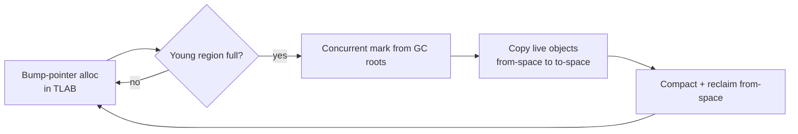
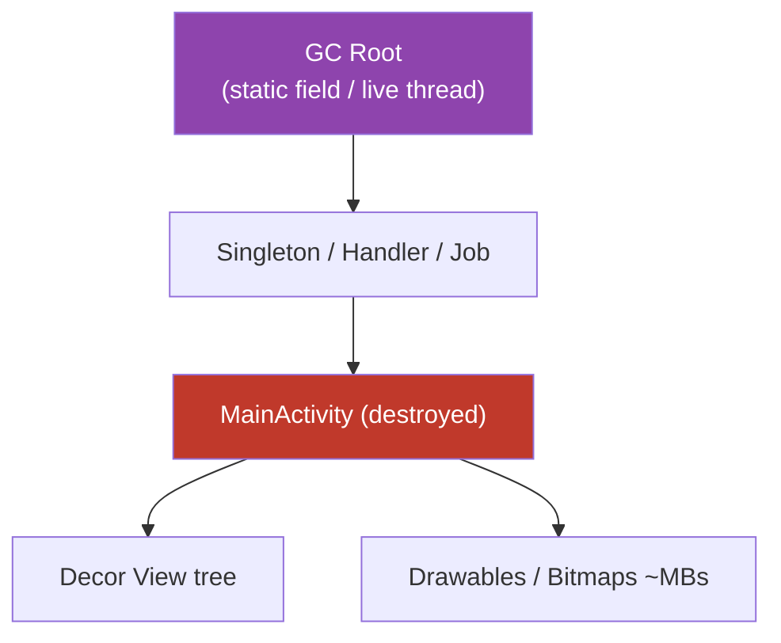
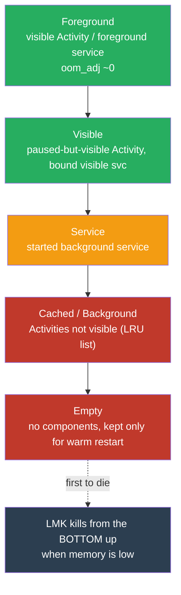

# Memory Management

Memory is the resource Android polices most aggressively. Every process runs inside a per-app heap cap; exceed it and you `OutOfMemoryError`. Hold objects too long and you leak; churn allocations in a hot path and the garbage collector steals frames. A senior engineer is expected to reason about the heap, the collector, the Low Memory Killer, and the canonical leak shapes without reaching for a profiler first.

---

## Heap vs Stack

Every thread has its own **stack** and all threads share one **heap**.

| | Stack | Heap |
|---|---|---|
| Stores | primitives, object *references*, call frames | object *instances* (everything `new`/constructed) |
| Lifetime | popped when the method returns | until unreachable + collected by GC |
| Allocation cost | ~free (move stack pointer) | bump-pointer + eventual GC accounting |
| Scope | per-thread, private | process-wide, shared |
| Failure mode | `StackOverflowError` (deep/infinite recursion) | `OutOfMemoryError` (heap cap hit) |

In the JVM/ART, there is no `struct`-style value type on the stack for objects — even a local `val point = Point(1,2)` puts the reference on the stack and the `Point` on the heap. This is why allocation-in-a-loop is a heap concern, and why the escape-analysis / scalar-replacement optimizations that HotSpot has are largely absent in ART. Assume every object you allocate hits the heap.

!!! note "The Android heap is capped per process"
    `ActivityManager.getMemoryClass()` returns the cap in MB (e.g. 64/128/256/512 depending on device and whether `android:largeHeap="true"` is set). `largeHeap` is a smell, not a fix — it raises the ceiling but makes GC pauses longer and does nothing for leaks. Native allocations (Bitmaps on modern Android, NDK buffers) are tracked separately but still count against the process's overall footprint for the LMK.

---

## Android Garbage Collection

ART's collector has evolved. Knowing the model lets you explain *why* jank happens.

### Mark-and-sweep, generationally

The conceptual base is **mark-and-sweep**: start from GC roots (stack locals, static fields, JNI globals, active threads), mark everything reachable, sweep the rest. The **generational hypothesis** — most objects die young — means ART segregates a young/allocation region collected frequently and cheaply from an older region collected rarely. Short-lived allocations (the `Rect` you make in `onDraw`) are the ones that flood the young generation.

### Concurrent Copying Collector (CC)

Since Android 8 (ART), the default is the **Concurrent Copying** collector with a bump-pointer allocator and a **from-space/to-space** region layout:

- **Concurrent** — most marking/copying runs on a background GC thread while your app keeps executing.
- **Copying** — live objects are evacuated into a fresh region, which **compacts** the heap (no fragmentation) and makes allocation a cheap pointer bump.
- **Moving** — because objects move, ART uses read barriers to keep mutator threads consistent. This is invisible to Java/Kotlin code but is why you must never cache a raw object address.



### Why GC still causes jank

"Concurrent" does not mean "free." Two costs remain:

1. **Stop-the-world pauses.** Even CC has brief STW phases (root marking, thread checkpoints). If one lands mid-frame you blow the 16.6 ms (60 Hz) or 8.3 ms (120 Hz) budget and drop a frame.
2. **GC steals CPU + memory bandwidth.** The background GC thread competes with your UI/render thread on a busy device.

The dominant trigger is **allocation churn**: the faster you allocate, the sooner the young region fills, the more often GC runs.

!!! warning "Never allocate in hot paths"
    `View.onDraw()`, `RecyclerView.Adapter.onBindViewHolder()`, `SurfaceView` render loops, sensor/`onSensorChanged` callbacks, and animation `update` callbacks run many times per second. Allocating there — `new Paint()`, `Rect()`, autoboxing `Integer`, `String` concatenation, lambdas capturing state, `map{}`/`filter{}` producing intermediate lists — creates GC pressure that shows up as stutter.

    - Hoist `Paint`, `Path`, `Rect`, `Matrix` to fields, allocate once, reuse.
    - Avoid autoboxing: prefer `SparseArray`/`SparseIntArray` over `HashMap<Integer, …>`.
    - Watch Kotlin: `for (i in list.indices)` avoids the `Iterator` object that a `for (x in list)` over a non-array can allocate; sequence/collection chains allocate intermediates.
    - Use object pools for high-frequency short-lived objects (`Message.obtain()` is the platform's own example).

```kotlin
class GaugeView(context: Context) : View(context) {
    // Allocated ONCE. Reused every frame.
    private val arcPaint = Paint(Paint.ANTI_ALIAS_FLAG).apply { strokeWidth = 12f }
    private val bounds = RectF()

    override fun onDraw(canvas: Canvas) {
        // NO allocations here. Just mutate the reused objects.
        bounds.set(paddingLeft.toFloat(), paddingTop.toFloat(),
                   (width - paddingRight).toFloat(), (height - paddingBottom).toFloat())
        canvas.drawArc(bounds, 135f, sweepAngle, false, arcPaint)
    }
}
```

---

## Memory Leaks

A leak in a GC'd runtime is not "forgot to free" — it is **an unwanted strong reference from a long-lived object to a short-lived one**, so the collector *correctly* keeps it alive. On Android the classic victim is an `Activity`/`Fragment`/`View`/`Context`, which transitively retains its entire view tree and resources (tens of MB). Retain a few destroyed Activities and you OOM.

### Canonical causes → fixes

| # | Leak pattern | Why it retains | Fix |
|---|---|---|---|
| 1 | **`static`/`companion`/singleton holds a `Context`/`View`** | static field is a GC root that lives for the whole process | Store `applicationContext`; never an Activity. Clear the ref in `onDestroy` |
| 2 | **Non-static inner class `Handler`/`Runnable`** posting delayed messages | anonymous/inner class holds an implicit `this@Activity`; the queued `Message` holds the Handler | Static/top-level Handler + `WeakReference`; `removeCallbacksAndMessages(null)` in `onDestroy` |
| 3 | **Listener / observer never unregistered** (`SensorManager`, `LocationManager`, `BroadcastReceiver`, `LiveData` with wrong owner) | the manager keeps your callback in its list forever | Unregister in the mirror lifecycle callback (`onPause`/`onStop`/`onDestroy`) |
| 4 | **Long-lived coroutine/thread capturing a `View`/`Activity`** | the running job is reachable from a thread → GC root; its captured lambda pins the Activity | Use `lifecycleScope`/`viewModelScope`; `repeatOnLifecycle`; never `GlobalScope` |
| 5 | **RxJava subscription not disposed** | the upstream holds the observer (which captures the View) | `CompositeDisposable.clear()` in `onDestroy`; `AutoDispose`/`RxLifecycle` |
| 6 | **`WebView`** | native + Java references, and it can hold the Activity `Context` it was inflated with | Instantiate with `applicationContext`, `destroy()` it, and remove it from its parent before destroy |
| 7 | **`Bitmap` / large arrays held past use** | huge heap footprint magnifies any retention; static bitmap caches leak the drawable's `Context` | Bound caches (`LruCache`); null-out; use `Glide`/`Coil` which are lifecycle-aware |
| 8 | **Fragment holds a `View`/binding after `onDestroyView`** | Fragment outlives its view on back-stack; the binding pins the destroyed view tree | Null the binding in `onDestroyView`; collect flows with `viewLifecycleOwner` |


The trace reads top-down: a **root** you cannot remove pins a **destroyed Activity**, which drags its whole view tree onto the heap. Break the *nearest-to-leaf* reference you control (the `S → A` edge).

### The leaking Handler, and its fix

!!! warning "The single most common Android leak"
    A `Handler` created inside an Activity captures an implicit reference to that Activity. A delayed `Message` sits in the `MessageQueue` holding the `Handler` — so until the message fires (or the delay elapses), the whole Activity cannot be collected. Rotate the device 10 times with a 60 s delayed message pending and you retain 10 Activities.

```kotlin
// ❌ LEAK: anonymous Runnable captures `this` Activity; 60s delayed msg pins it.
class BadActivity : AppCompatActivity() {
    private val handler = Handler(Looper.getMainLooper())
    override fun onCreate(savedInstanceState: Bundle?) {
        super.onCreate(savedInstanceState)
        handler.postDelayed({ refreshUi() }, 60_000) // implicit BadActivity.this
    }
}

// ✅ FIX: static Handler subclass + WeakReference, and cancel on destroy.
class GoodActivity : AppCompatActivity() {
    private class SafeHandler(activity: GoodActivity) : Handler(Looper.getMainLooper()) {
        private val ref = WeakReference(activity)
        override fun handleMessage(msg: Message) {
            ref.get()?.refreshUi()   // no-op if Activity already gone
        }
    }
    private val handler = SafeHandler(this)

    override fun onCreate(savedInstanceState: Bundle?) {
        super.onCreate(savedInstanceState)
        handler.sendEmptyMessageDelayed(0, 60_000)
    }
    override fun onDestroy() {
        handler.removeCallbacksAndMessages(null) // drain the queue → break the chain
        super.onDestroy()
    }
}
```

### Lifecycle-aware flow collection (the modern coroutine fix)

```kotlin
// ❌ LEAK / waste: lifecycleScope.launch keeps collecting while the view is destroyed
//    (back stack), and the collector lambda captures the View.
// ✅ FIX: repeatOnLifecycle + viewLifecycleOwner cancels at STOPPED, restarts at STARTED.
class FeedFragment : Fragment() {
    private val vm: FeedViewModel by viewModels()

    override fun onViewCreated(view: View, savedInstanceState: Bundle?) {
        viewLifecycleOwner.lifecycleScope.launch {
            viewLifecycleOwner.repeatOnLifecycle(Lifecycle.State.STARTED) {
                vm.uiState.collect { render(it) } // auto-cancelled below STARTED
            }
        }
    }
}
```

---

## Detecting Leaks & Memory Problems

### LeakCanary — how it actually works

LeakCanary is the standard automated detector. Its pipeline:

1. **Watch.** It hooks lifecycle callbacks and wraps each destroyed `Activity`/`Fragment`/`View`/`ViewModel` in a **`KeyedWeakReference`** registered against a `ReferenceQueue`.
2. **Wait + trigger GC.** After ~5 s it checks whether the `WeakReference` was enqueued. If the object was collected, the reference clears — no leak. If it is **still retained**, LeakCanary forces a GC (`Runtime.gc()`) to rule out a not-yet-collected object.
3. **Dump the heap.** Still retained after GC → it dumps an `.hprof` heap snapshot.
4. **Analyze with Shark.** It parses the hprof, finds the retained object, and computes the **shortest strong reference path from a GC root to that object** — the *leak trace*.
5. **Report.** It prints the trace, marking each reference `LEAKING / NOT LEAKING / UNKNOWN` using heuristics (a destroyed Activity is `LEAKING`; the Application is `NOT LEAKING`), so the culprit edge is between the last `NOT LEAKING` and the first `LEAKING` node.

The `WeakReference`-doesn't-clear signal is the whole trick: a weak ref is cleared by the collector as soon as nothing *strongly* holds the object; if it survives a forced GC, something strong is leaking it.

### The rest of the toolbox

| Tool | Use it for | Notes |
|---|---|---|
| **LeakCanary** | Automatic retained-instance detection in debug builds | Zero code beyond the dependency; catches Activity/Fragment/View/ViewModel/Service leaks |
| **Android Studio Memory Profiler** | Live heap graph, allocation tracking, on-demand heap dump | "Record allocations" to catch churn in `onDraw`; sort dump by retained size |
| **Heap dumps (`.hprof`)** | Offline deep analysis; comparing two dumps to find growth | Capture via profiler or `Debug.dumpHprofData()`; convert framework hprof with `hprof-conv` |
| **StrictMode** | Catch disk/network on main thread, and **`VmPolicy` instance-count/leak violations** | `detectActivityLeaks()`, `detectLeakedClosableObjects()` (unclosed `Cursor`/streams), `detectLeakedRegistrationObjects()` |
| **`adb shell dumpsys meminfo <pkg>`** | PSS/USS breakdown by category (Java/native/graphics/code) | Fast field check without the IDE |
| **Perfetto / `systrace`** | See GC pauses on the timeline against dropped frames | Correlate `HeapTaskDaemon` activity with jank |

```kotlin
// Application.onCreate — fail fast on leaks in debug.
if (BuildConfig.DEBUG) {
    StrictMode.setVmPolicy(
        StrictMode.VmPolicy.Builder()
            .detectActivityLeaks()
            .detectLeakedClosableObjects()      // unclosed Cursor / InputStream
            .detectLeakedRegistrationObjects()  // unregistered receivers
            .penaltyLog()
            .build()
    )
}
```

---

## Responding to Memory Pressure: `onTrimMemory` / `ComponentCallbacks2`

The system tells you when memory is tight so you can shed caches *before* it kills you. Implement `ComponentCallbacks2.onTrimMemory(level)` (Activities, Application, Services all receive it). Treat it as a graceful-degradation hook: drop bitmap caches, flush in-memory buffers, release non-critical resources.

| Level | When | Expected action |
|---|---|---|
| `TRIM_MEMORY_RUNNING_MODERATE` | App **foreground**, device getting low | Trim easily-rebuilt caches |
| `TRIM_MEMORY_RUNNING_LOW` | Foreground, notably low | Release more; performance may already suffer |
| `TRIM_MEMORY_RUNNING_CRITICAL` | Foreground, about to kill background procs | Free everything non-essential now |
| `TRIM_MEMORY_UI_HIDDEN` | UI just went **fully hidden** | Release UI-only resources (large bitmaps, GL) |
| `TRIM_MEMORY_BACKGROUND` | App in the **LRU cache**, safe-ish | Drop the caches you can cheaply rebuild |
| `TRIM_MEMORY_MODERATE` | Middle of the LRU list | Trim aggressively — eviction risk rising |
| `TRIM_MEMORY_COMPLETE` | Head of the kill list; next to die | Release **everything**; only bare state should remain |

!!! tip "`onTrimMemory` is also your best background-cache signal"
    Levels `≥ TRIM_MEMORY_BACKGROUND` mean you're now a *cached* process. This is the right, deterministic place to purge in-memory image/data caches — far better than guessing. Note `onLowMemory()` is the old single-level API, roughly equivalent to `TRIM_MEMORY_COMPLETE`.

```kotlin
class App : Application(), ComponentCallbacks2 {
    override fun onTrimMemory(level: Int) {
        super.onTrimMemory(level)
        when {
            level >= ComponentCallbacks2.TRIM_MEMORY_COMPLETE ->
                imageCache.clear()                 // about to be killed — drop all
            level >= ComponentCallbacks2.TRIM_MEMORY_BACKGROUND ->
                imageCache.trimToSize(imageCache.size() / 2) // now cached
            level == ComponentCallbacks2.TRIM_MEMORY_UI_HIDDEN ->
                releaseGlAndLargeBitmaps()         // UI hidden, keep data caches
        }
    }
}
```

---

## Low Memory Killer & Process Priority

When RAM runs out, Linux (via the kernel LMK / userspace `lmkd`) kills whole processes to reclaim memory. It does not pick randomly — it kills the **least important** process first, ranked by an **`oom_adj_score`** (`oom_score_adj`) the framework assigns based on what the app is currently doing. Higher score = more killable.



| Priority class | Example state | Relative `oom_adj` | Kill likelihood |
|---|---|---|---|
| **Foreground** | Activity resumed, or running a foreground service, or `onReceive`/`Service` lifecycle callback executing | lowest (~0) | Killed only in extreme, near-fatal pressure |
| **Visible** | Activity `onPause` but still visible (dialog on top), or hosting a visible bound service | low | Rare |
| **Service** | A started `Service` running in the background | medium | Killed under sustained pressure |
| **Cached (background)** | Activities exist but none visible; kept in an LRU list | high | Killed routinely; **your `onSaveInstanceState` state must survive this** |
| **Empty** | No active components; process cached purely to speed a warm relaunch | highest | First to go |

Senior takeaways:

- **You do not control the score directly** — you influence it by *what you run*. A foreground service (with its mandatory notification) is the sanctioned way to say "keep me alive."
- **Being killed while cached is normal, not a crash.** Persist UI state via `onSaveInstanceState`/`SavedStateHandle` and durable state to disk; assume your process can vanish at any time when backgrounded.
- **A leak raises everyone's risk**: a bloated foreground process forces the LMK to kill more background processes, and your own bloat pushes you toward OOM before the LMK even helps.

---

## Bitmap Memory

Bitmaps are the number-one cause of `OutOfMemoryError`. A bitmap's heap cost is `width × height × bytesPerPixel` — *decoded* dimensions, independent of the compressed file size. A 12 MP photo (4000×3000) at `ARGB_8888` = 4000 × 3000 × 4 ≈ **48 MB**, from maybe a 3 MB JPEG. Decode a handful and you OOM regardless of file sizes.

### Downsample at decode time (`inSampleSize`)

Never decode full-res to then shrink in a `View`. Decode bounds first, compute a power-of-two `inSampleSize`, decode scaled.

```kotlin
fun decodeSampled(res: Resources, id: Int, reqW: Int, reqH: Int): Bitmap {
    val opts = BitmapFactory.Options().apply { inJustDecodeBounds = true }
    BitmapFactory.decodeResource(res, id, opts)          // reads dimensions only, no pixels
    var sample = 1
    while (opts.outHeight / sample >= reqH && opts.outWidth / sample >= reqW) sample *= 2
    return BitmapFactory.decodeResource(res, id, BitmapFactory.Options().apply {
        inSampleSize = sample                            // e.g. 4 → 1/4 W, 1/4 H, 1/16 the memory
        inPreferredConfig = Bitmap.Config.RGB_565        // half the bytes if no alpha needed
    })
}
```

### Pixel configs

| Config | Bytes/px | Alpha | Use when |
|---|---|---|---|
| `ARGB_8888` | 4 | Yes, 8-bit | Default; photos, gradients, anything needing transparency/quality |
| `RGB_565` | 2 | No | Opaque images where banding is acceptable — **halves memory** |
| `ARGB_4444` | 2 | Yes (poor) | **Deprecated** — don't use |
| `ALPHA_8` | 1 | Alpha only | Masks, shadows |
| `HARDWARE` | — (in graphics memory) | — | API 26+; pixels live in GPU memory, off the Java heap, read-only — ideal for display-only bitmaps (what Glide/Coil use) |

### `recycle()` — and why it's mostly history

`Bitmap.recycle()` frees the pixel data immediately. It mattered on Android < 3.0, where pixels lived in **native** memory disconnected from the Dalvik heap, so GC couldn't reclaim them in time — manual `recycle()` was essential. From Android 3.0–7.x pixels moved into the Dalvik/ART heap (GC handles them); from **Android 8.0 (`HARDWARE`/ashmem) native allocation returned but is managed automatically**. Today:

- **Do not call `recycle()` manually** in normal app code — you risk `"Canvas: trying to use a recycled bitmap"` crashes if anything still references it. Let GC (or your image library) handle it.
- **Do reuse buffers** via `BitmapFactory.Options.inBitmap` for high-churn decoding (e.g. scrolling galleries) to avoid re-allocating.
- **Do bound your caches** with `LruCache` sized as a fraction of `getMemoryClass()`, and **use Glide/Coil** — they pool, downsample, use `HARDWARE`/`RGB_565`, and tie bitmap lifetime to the view/lifecycle for you.

!!! warning "Static Bitmap caches leak Contexts"
    A `Bitmap` obtained from a `Drawable` can hold a `Callback` back to the `View`/`Context` it was drawn into. Cache such bitmaps in a `static`/singleton and you leak the Activity too. Cache decoded bitmaps you own, sized by an `LruCache`, never `Context`-bound drawables.

---

## WeakReference & SoftReference

Java's reference types let you hold an object *without preventing its collection*.

| Reference | Collector behavior | Use for |
|---|---|---|
| **Strong** (normal) | Never collected while reachable | Default ownership |
| **`SoftReference`** | Cleared only when the heap is under memory pressure (before OOM) | Memory-sensitive caches you'd *like* to keep — but prefer `LruCache`, which gives deterministic bounds; soft refs interact poorly with the GC and can bloat the heap |
| **`WeakReference`** | Cleared at the next GC once no strong refs remain | Back-references that must not own: Handler→Activity, callback→target, keys in `WeakHashMap` |
| **`PhantomReference`** | Enqueued after finalization; can't retrieve referent | Advanced native-resource cleanup (rarely in app code) |

```kotlin
// WeakReference lets a long-lived object point back at a short-lived one safely.
class DownloadCallback(activity: MainActivity) {
    private val ref = WeakReference(activity)
    fun onComplete(result: String) {
        val activity = ref.get() ?: return   // Activity gone? Do nothing — no leak.
        activity.showResult(result)
    }
}
```

!!! tip "Reference type is not a leak fix, it's a design tool"
    Reaching for `WeakReference` is often a signal the ownership is wrong. Prefer structural fixes — unregister the listener, scope the coroutine to the lifecycle, hold `applicationContext`. Use `WeakReference` where a back-pointer is genuinely unavoidable (the Handler pattern). For caches, use `LruCache` (deterministic) over `SoftReference` (unpredictable, can hurt GC).

---

## Interview Q&A

!!! question "1. ART uses a concurrent collector — so why do we still see GC-related jank?"
    "Concurrent" means most marking/copying runs off the UI thread, but the Concurrent Copying collector still has brief **stop-the-world** phases (root scanning, thread checkpoints) and it consumes CPU and memory bandwidth that competes with the render thread. If a pause lands inside a frame's 16.6 ms budget, or the GC thread starves the UI thread on a busy device, you drop frames. The real fix is reducing **allocation churn** so GC runs less often — hoisting allocations out of `onDraw`/`onBindViewHolder`, avoiding autoboxing, pooling short-lived objects.
    **Follow-up:** *How would you confirm GC is the cause of a specific stutter?* Record a Perfetto/systrace trace and look for `HeapTaskDaemon` / GC slices aligned with the dropped frames, and use the Memory Profiler's allocation recorder to find what's allocating in the hot path.

!!! question "2. In a garbage-collected language, what *is* a memory leak, and what's the canonical Android one?"
    A leak is an **unintended strong reference from a long-lived object to a short-lived one**, so the GC correctly keeps the short-lived object alive forever. On Android the victim is usually a destroyed `Activity` (which retains its whole view tree, ~MBs). The canonical case is a **non-static inner `Handler`/`Runnable`**: it captures an implicit `this@Activity`, and a delayed `Message` in the queue holds the Handler, pinning the Activity until the message fires. Fix: static Handler + `WeakReference` + `removeCallbacksAndMessages(null)` in `onDestroy`.
    **Follow-up:** *Name three other common causes.* Unregistered listeners (`SensorManager`, receivers), long-lived coroutines/`GlobalScope` capturing a View, static/singleton holding an Activity `Context`, undisposed RxJava subscriptions, Fragment view-binding not nulled in `onDestroyView`.

!!! question "3. Walk me through how LeakCanary detects a leak."
    It wraps each destroyed Activity/Fragment/View/ViewModel in a **`KeyedWeakReference`** tied to a `ReferenceQueue`. After a delay it checks whether the weak ref was enqueued; if not, it forces a GC. If the reference *still* hasn't cleared, the object is retained — so it dumps an `.hprof` and runs **Shark** to compute the **shortest strong reference path from a GC root** to the object. That path is the leak trace, with nodes marked LEAKING/NOT-LEAKING; the culprit is the edge between the last NOT-LEAKING and first LEAKING node. The core insight: a `WeakReference` is cleared by GC the instant nothing strongly references its target, so surviving a forced GC *proves* a strong leak.
    **Follow-up:** *Why force a GC before dumping?* To avoid false positives — the object might simply not have been collected yet. Forcing GC ensures that if it's still alive, something is genuinely holding it strongly.

!!! question "4. Explain Android's process priority classes and how the Low Memory Killer uses them."
    Each process gets an `oom_adj_score` derived from what it's doing: **Foreground** (visible Activity/foreground service, ~0, near-unkillable) → **Visible** → **Service** (started background service) → **Cached/background** (Activities exist, none visible; LRU list) → **Empty** (no components, kept for warm restart). When RAM is low, `lmkd`/the kernel kills from the **bottom up** — empty and cached first. You don't set the score directly; you influence it by what you run (a foreground service is the sanctioned "keep me alive"). Being killed while cached is normal, so persist state via `onSaveInstanceState`/`SavedStateHandle`.
    **Follow-up:** *Your app is killed within seconds of backgrounding on a low-end device — what do you check?* Memory footprint (leaks/bloat push you up the kill list), whether you're leaking Activities, and whether you're doing unnecessary background work that keeps a large heap resident; verify with `dumpsys meminfo`.

!!! question "5. How is a Bitmap's memory computed, and how do you avoid Bitmap OOMs?"
    Cost = `width × height × bytesPerPixel` on the **decoded** dimensions, independent of compressed file size — a 4000×3000 `ARGB_8888` bitmap is ~48 MB from a 3 MB JPEG. Avoid OOMs by **downsampling at decode** (`inJustDecodeBounds` to read size, then power-of-two `inSampleSize`), choosing the cheapest **config** (`RGB_565` halves memory for opaque images; `HARDWARE` keeps pixels in GPU memory off the Java heap), **bounding caches** with `LruCache` sized off `getMemoryClass()`, and delegating to **Glide/Coil**, which pool and lifecycle-scope bitmaps.
    **Follow-up:** *Should you call `recycle()`?* Not in modern app code — pre-3.0 it was essential (pixels in native memory), but since 3.0 GC manages them and manual `recycle()` risks "recycled bitmap" crashes. Reuse via `inBitmap` for churn, otherwise let GC/the image library handle it.

!!! question "6. When would you use `onTrimMemory`, and how does it differ from `onLowMemory`?"
    `onTrimMemory(level)` (from `ComponentCallbacks2`) is a **graded** signal to shed memory: foreground levels (`RUNNING_MODERATE/LOW/CRITICAL`) ask you to trim while still visible; `UI_HIDDEN` fires when your UI goes fully offscreen (release GL/large bitmaps); and `BACKGROUND → MODERATE → COMPLETE` fire as you move up the LRU kill list — `COMPLETE` means you're next to die, so release everything. It's the deterministic place to purge in-memory caches. `onLowMemory()` is the legacy single-level callback, roughly equivalent to `TRIM_MEMORY_COMPLETE`, with no gradation.
    **Follow-up:** *Where should image caches be trimmed?* At `≥ TRIM_MEMORY_BACKGROUND`, since that reliably means you've become a cached process — much better than guessing based on lifecycle callbacks alone.
