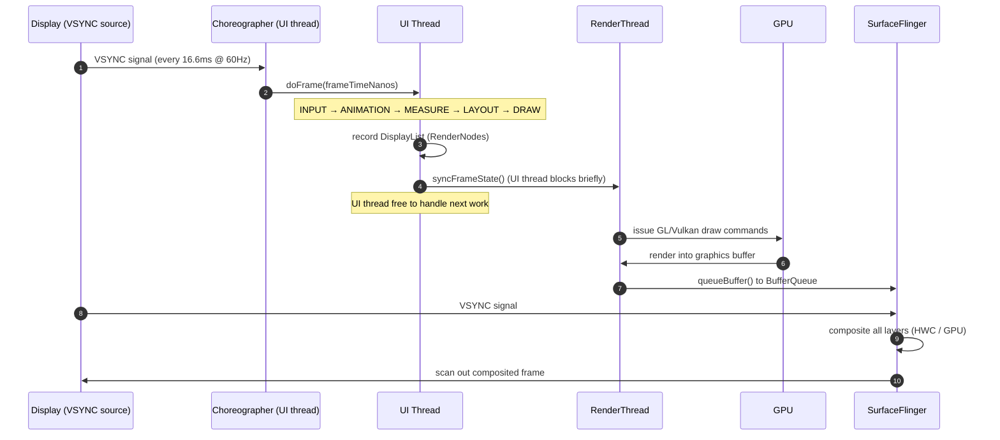
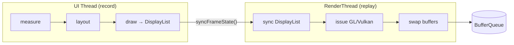
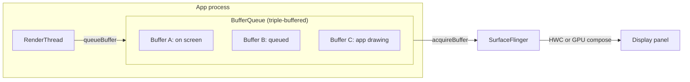

# App Rendering

How a `View` tree or a `@Composable` becomes lit pixels is one of the highest-signal
senior Android topics: it ties together threading, the GPU, the display hardware, and
every "the app feels laggy" bug you will ever debug. This deep-dive walks the pipeline
end-to-end — from `measure/layout/draw` on the UI thread, across the sync boundary to
the RenderThread, into SurfaceFlinger and the display — and maps Compose's phases onto
the exact same machinery.

!!! abstract "The one-sentence model"
    Every frame, the UI thread records **what** to draw into a display list, hands it to
    the RenderThread which turns it into **GPU commands**, which fill a **buffer** that
    **SurfaceFlinger** composites with every other app's buffer and scans out to the
    panel — and all of this must finish inside one **VSYNC** interval or the frame is
    dropped.

## The rendering pipeline at a glance

A single frame passes through these stages:

1. **Input** — touch/key events dispatched to the view/composable.
2. **Animation** — `Choreographer` animation callbacks, `ValueAnimator`, Compose animation frame ticks.
3. **Measure** — parents ask children how big they want to be (`onMeasure`).
4. **Layout** — parents assign final positions (`onLayout` / placement).
5. **Draw** — views record drawing commands into a **DisplayList** (they do *not* draw pixels here).
6. **Sync** — the recorded display list is handed to the RenderThread; UI thread is briefly blocked.
7. **RenderThread issue** — display list is translated into GPU (OpenGL ES / Vulkan) commands.
8. **GPU execution** — the GPU rasterizes into a graphics **buffer**.
9. **Queue / composite** — the buffer is queued to SurfaceFlinger, which composites all layers.
10. **Scan-out** — the display controller reads the composited buffer and lights the panel.

Stages 1–6 run on the **UI (main) thread**. Stages 7–8 run on the **RenderThread**.
Stages 9–10 belong to the **system compositor** and **display hardware**.



!!! note "Two VSYNCs, not one"
    Modern Android uses **VSYNC offsets** (Project Butter, 2012+): `Choreographer`
    wakes the app on `VSYNC-app`, and SurfaceFlinger wakes on `VSYNC-sf`, both derived
    from the hardware VSYNC but phase-shifted. This pipelines app rendering and
    composition so a frame produced in interval *N* is displayed in interval *N+1* (or
    *N+2*), keeping the pipeline full without requiring either stage to finish
    instantly.

## VSYNC and Choreographer

**VSYNC** (vertical synchronization) is a hardware heartbeat emitted by the display
controller each time it is ready to start scanning out a new frame. Everything in the
rendering system is slaved to it so that buffer swaps happen during the panel's blanking
interval — never mid-scan, which would cause **tearing**.

`Choreographer` is the UI-thread object that receives the VSYNC signal and schedules the
frame. It maintains ordered callback queues that run in a fixed sequence inside
`doFrame()`:

| Callback type | What runs | Why the order matters |
|---|---|---|
| `CALLBACK_INPUT` | Touch/motion event dispatch | Input must be consumed before animation/layout react to it |
| `CALLBACK_ANIMATION` | `ValueAnimator`, transitions, Compose frame clock | Animations compute new values for this frame |
| `CALLBACK_INSETS_ANIMATION` | IME / system-bar inset animations | Positioned before traversal so layout sees final insets |
| `CALLBACK_TRAVERSAL` | `measure` → `layout` → `draw` | The actual view traversal, using post-input/animation state |
| `CALLBACK_COMMIT` | Frame-completion bookkeeping | Adjusts animation start times to reduce jitter |

The key insight: **input, animation, and drawing all align to the same VSYNC tick.**
That is what makes a fling feel physically coupled to your finger — the touch position,
the scroll animation, and the pixels are all computed from the same `frameTimeNanos`.

!!! tip "Use frameTimeNanos, not System.nanoTime()"
    Inside animation callbacks, drive interpolation from the `frameTimeNanos` passed to
    `doFrame` rather than reading the wall clock. All work in a frame shares one
    timestamp, so animation steps stay evenly spaced even when a frame runs slightly
    late — this is exactly what `ValueAnimator` and Compose's `withFrameNanos` do.

```kotlin
Choreographer.getInstance().postFrameCallback(object : Choreographer.FrameCallback {
    override fun doFrame(frameTimeNanos: Long) {
        // Advance animation using the frame's canonical timestamp.
        val tSeconds = frameTimeNanos / 1_000_000_000.0
        view.translationX = (sin(tSeconds) * 100f).toFloat()
        Choreographer.getInstance().postFrameCallback(this) // schedule next frame
    }
})
```

## The frame budget and jank

The budget for one frame is `1000ms / refreshRate`. **All** UI-thread work for a frame —
input handling, your click listeners, `onMeasure`, `onLayout`, `onDraw` recording, plus
the RenderThread's GPU issue — must complete before the next VSYNC, or the previously
displayed frame is shown again. That repeated frame is a **dropped frame**, and the
visible stutter it causes is **jank**.

| Refresh rate | Frame budget | Common on |
|---|---|---|
| 60 Hz | 16.6 ms | Baseline / most devices |
| 90 Hz | 11.1 ms | Mid-range "smooth" phones |
| 120 Hz | 8.3 ms | Flagship / high-refresh displays |
| 144 Hz | 6.9 ms | Gaming phones |

!!! warning "The budget is not the whole 16.6 ms"
    You do **not** get the full interval for your code. The RenderThread's sync + GPU
    issue, and a safety margin, eat into it. Treat ~10-12 ms as the realistic UI-thread
    ceiling at 60 Hz, and correspondingly less at 120 Hz. High-refresh displays *shrink*
    your budget — code that was smooth at 60 Hz can jank at 120 Hz.

A **dropped/skipped frame** happens when the pipeline misses a VSYNC deadline. Because
Android is **triple-buffered**, a single late frame is often absorbed silently (see
below). Sustained overruns, or a stall longer than the buffering depth can hide, produce
visible hitches. The framework logs `Skipped N frames! The application may be doing too
much work on its main thread.` when the UI thread blocks for multiple intervals.

Common causes of jank, and where they live:

| Cause | Stage | Fix |
|---|---|---|
| Heavy work in `onDraw` / click listener | UI thread | Move off main thread; cache results |
| Deep view hierarchy, repeated re-measure | Measure/Layout | Flatten with `ConstraintLayout`; avoid `RelativeLayout`+`wrap_content` double-measure |
| Allocations per frame → GC pause | UI thread | Reuse objects; no allocation in `onDraw`/`onBind` |
| Overdraw (too many opaque layers) | GPU | Remove redundant backgrounds; clip |
| Large bitmap upload each frame | RenderThread/GPU | Pre-decode; use hardware bitmaps |
| Synchronous binder/IPC or disk I/O on main | UI thread | Async; `WorkManager`/coroutines |
| `RecyclerView` binding too much per row | UI thread | Lighter `onBindViewHolder`; prefetch; `DiffUtil` |

## UI thread vs RenderThread

Before Android 5.0 (Lollipop), drawing happened synchronously on the UI thread. Since
Lollipop, rendering is **two-stage and pipelined**:

- **UI thread — "record"**: The traversal walks the view tree and calls each view's
  `draw(Canvas)`. But the `Canvas` here is a **recording canvas** backed by a
  `RenderNode`/`DisplayList`. No pixels are produced. `canvas.drawRect(...)` just appends
  a command to the display list. This is cheap and fast.
- **RenderThread — "replay"**: The recorded display list is **synced** to the
  RenderThread (a brief lock while state is copied), after which the RenderThread
  **replays** the display list into actual OpenGL ES / Vulkan draw calls, submits them to
  the GPU, and manages the buffer swap — all *without* the UI thread.

This split is why animations can stay smooth even when the UI thread is momentarily
busy: once a display list is synced, the RenderThread can re-issue it — and even run
certain **RenderThread-driven animations** (like a ripple `RippleDrawable` or a
`CircularReveal`) — independently of the UI thread. A `RenderNode` can have its
transform (translation, scale, alpha) updated and re-drawn *without re-recording*, which
is what makes hardware-accelerated property animations so cheap.



!!! info "RenderNode is the unit of caching"
    Each view with hardware acceleration owns a `RenderNode`. If a view's *content*
    hasn't changed, its display list is reused; only views that called `invalidate()`
    re-record. Changing only `translationX`/`alpha` updates the RenderNode's properties
    without touching its display list — the RenderThread reapplies them. This is why you
    animate with `View.animate().translationX(...)` (property animation on the
    RenderNode) rather than mutating layout params (which forces a full measure/layout
    pass).

## SurfaceFlinger, BufferQueue, and triple buffering

Your app does not draw directly to the screen. It draws into a **Surface**, which is the
producer end of a **BufferQueue**. The consumer end is **SurfaceFlinger**, the system
compositor, a separate process.

- **Producer** (your app's RenderThread): `dequeueBuffer()` to get a free graphics
  buffer, render into it, `queueBuffer()` to hand it back.
- **Consumer** (SurfaceFlinger): `acquireBuffer()` the latest queued buffer, composite it
  with every other visible layer (status bar, nav bar, other windows), then `releaseBuffer()`
  so the producer can reuse it.

Compositing is done either by the **Hardware Composer (HWC)** — dedicated display hardware
that overlays layers for free — or, when HWC can't handle the layer count/blending, by
**GPU composition** (SurfaceFlinger uses the GPU as a fallback). HWC is cheaper and saves
power, which is why keeping the visible layer count low matters.

**Triple buffering** is why a single slow frame can be invisible. With three buffers, the
app can be rendering into buffer C while SurfaceFlinger is still displaying buffer A and
buffer B is already queued and waiting. That extra buffer gives the pipeline slack: if the
app is momentarily late producing a frame, there is still a ready buffer for the compositor
to show, so no repeated frame reaches the eye. The trade-off is up to one extra frame of
**latency** (input-to-photon). Android allocates the third buffer on demand rather than
always, balancing latency against smoothness.



!!! note "Producer/consumer decoupling is the point"
    Because the BufferQueue decouples producer from consumer, the app and the compositor
    run on **independent VSYNC-phased clocks**. Neither blocks the other except through
    buffer availability — if the app can't get a free buffer (all three in flight) it
    stalls until SurfaceFlinger releases one. That back-pressure is normal flow control,
    not a bug.

## Hardware acceleration

Hardware acceleration (default since API 14 for apps targeting it) means view drawing is
executed by the **GPU** rather than the CPU software rasterizer. The mechanism:

- View draw commands are recorded into a **DisplayList** (list of `RenderNode` ops).
- The RenderThread converts these into GPU primitives (triangles, textures) via OpenGL ES
  or, on modern devices/ANGLE, **Vulkan**.
- The GPU rasterizes in parallel, far faster than CPU for typical UI (rects, text, images,
  gradients).

Benefits: parallelism, cheap transforms/alpha (they become GPU matrix ops on cached
RenderNodes), and offloading the UI thread. Costs: **texture upload** (bitmaps must be
uploaded to GPU memory — large/frequent uploads stall the RenderThread), and a few
operations are **unsupported or slow** in hardware.

!!! warning "Not everything is GPU-friendly"
    Some `Canvas` operations force expensive paths or aren't hardware-accelerated (varies
    by API level): certain `Paint` features (e.g. some `PorterDuff` modes, large blur
    `MaskFilter`s), `Canvas.clipPath` with anti-aliasing, and drawing huge bitmaps. If you
    hit these, either simplify or set `LAYER_TYPE_SOFTWARE` on just that view — but a
    software layer is CPU-rasterized into a bitmap and then uploaded, so use it
    surgically, never on an animating view.

**Layers** (`View.setLayerType(LAYER_TYPE_HARDWARE, ...)`) render a subtree into an
off-screen GPU texture once, then reuse it — ideal to wrap a view *while* animating its
alpha (avoids re-blending children every frame). Remove the layer when the animation ends;
a permanent hardware layer wastes GPU memory. `View.animate()` does this automatically via
`withLayer()`.

## Overdraw

**Overdraw** is drawing the same pixel more than once in a single frame — e.g. an opaque
window background, under an opaque fragment background, under an opaque card, under a
button. The GPU pays fill-rate cost for every layer even though only the top one is
visible. Overdraw is a leading cause of jank on GPU-bound (fill-rate-limited) devices.

Enable **Developer Options → Debug GPU Overdraw** to color-code the screen:

| Color | Overdraw | Verdict |
|---|---|---|
| No color / true color | 0× (drawn once) | Ideal |
| Blue | 1× overdraw | Fine |
| Green | 2× overdraw | Acceptable |
| Light red | 3× overdraw | Investigate |
| Dark red | 4×+ overdraw | Fix it |

Reduction techniques:

- **Remove redundant backgrounds.** If a fragment/root fills the screen opaquely, remove
  the window background (`android:windowBackground` / `getWindow().setBackgroundDrawable(null)`).
- **Flatten opaque backgrounds** — don't set a background on both a container and its only child.
- **Clip precisely** — `canvas.clipRect()` before drawing so the GPU skips covered regions.
- **`canvas.quickReject()`** to skip fully off-screen draws in custom views.
- Avoid stacking translucent layers; alpha blending re-reads the framebuffer.

## GPU rendering profile bars

**Developer Options → Profile GPU Rendering → On screen as bars** draws a live histogram:
one vertical bar per frame, with a green **16 ms line**. Bars over the line are frames that
blew the 60 Hz budget. Each bar is stacked by pipeline stage, so the *color* tells you
*where* the time went:

| Segment (color, modern scheme) | Stage | If this dominates… |
|---|---|---|
| Input handling | Callbacks / input dispatch | Slow `onTouch`/click logic |
| Animation | Evaluating animators | Too many/expensive animations |
| Measure/Layout | `onMeasure` + `onLayout` | Deep or thrashing hierarchy |
| Draw | DisplayList recording (`onDraw`) | Expensive custom drawing |
| Sync & upload | Uploading bitmaps to GPU | Large/frequent texture uploads |
| Issue commands | RenderThread → GPU | GPU-bound: overdraw, complex paths |
| Swap buffers | Waiting on GPU/compositor | GPU can't keep up |

This is the fastest *on-device* triage: glance at which color pokes above the line and you
know which stage to attack before reaching for a full trace.

## Compose rendering phases

Jetpack Compose is **not** a separate rendering system — it produces the same
DisplayList/RenderNode output and rides the same Choreographer/RenderThread/SurfaceFlinger
pipeline. What differs is how it decides *what* to draw. Each frame (driven by
`withFrameNanos` off the Choreographer), Compose runs three phases:

| Phase | Analogous to | What it does |
|---|---|---|
| **Composition** | (no View equivalent) | Runs `@Composable` functions to build/update the tree of `LayoutNode`s. Skips composables whose inputs are unchanged (smart recomposition). |
| **Layout** | measure + layout | Each node measures children (single pass, no double-measure) and places them. |
| **Drawing** | draw | Nodes record into the RenderNode/DisplayList, handed to the RenderThread exactly like Views. |

The senior-level payoff is **phase skipping**: if only a draw-reading state changes (e.g. a
color), Compose can skip composition *and* layout and redo only drawing. This is why you
defer state reads — reading state in a lambda (`Modifier.offset { x }`,
`drawBehind { }`) restricts the invalidation to the layout or draw phase instead of
recomposing.

```kotlin
// BAD: reading `scroll` here reads it in composition → recomposes every frame of scroll.
Box(Modifier.offset(y = scroll.value.dp))

// GOOD: lambda defers the read to the LAYOUT phase → skips composition entirely.
Box(Modifier.offset { IntOffset(x = 0, y = scroll.value) })
```

!!! tip "Same jank rules apply"
    A slow `@Composable` body, unstable parameters forcing recomposition, or heavy work
    in a `LaunchedEffect` on the main dispatcher will blow the frame budget just like a
    slow `onDraw`. Diagnose with the **Layout Inspector's recomposition counts** and
    **Composition tracing** in Perfetto.

## Measuring: FrameMetrics, JankStats, and Perfetto

You cannot fix jank you can't see. Three tools, from coarse to precise:

- **Profile GPU Rendering bars** — instant on-device eyeball check (above).
- **`FrameMetrics` / `JankStats`** — programmatic, per-frame timing you can log to
  analytics in production. `FrameMetrics` (API 24+) exposes per-stage nanosecond durations
  (`UNKNOWN_DELAY`, `INPUT_HANDLING`, `ANIMATION`, `LAYOUT_MEASURE`, `DRAW`, `SYNC`,
  `COMMAND_ISSUE`, `SWAP_BUFFERS`, `TOTAL_DURATION`). **JankStats** (Jetpack) wraps it,
  applies the correct per-device frame deadline (accounting for high-refresh displays), and
  reports each frame as janky/not with attached state so you know *what screen/state* was
  on-screen when it janked.
- **Perfetto / `systrace`** — the ground truth. A system-wide trace shows the UI thread and
  RenderThread side by side, the `Choreographer#doFrame` slices, GPU work, SurfaceFlinger
  compositing, and expected-vs-actual VSYNC. Use `trace("label") { }` / `Trace.beginSection`
  to annotate your own code and see exactly which slice overruns.

### JankStats setup

```kotlin
class MainActivity : ComponentActivity() {

    private lateinit var jankStats: JankStats

    override fun onCreate(savedInstanceState: Bundle?) {
        super.onCreate(savedInstanceState)
        setContentView(R.layout.activity_main)

        // Listener is called once per frame with timing + jank verdict.
        val listener = JankStats.OnFrameListener { frameData: FrameData ->
            if (frameData.isJank) {
                // frameData.states = whatever you tagged (screen, list-scrolling, etc.)
                Log.w(
                    "Jank",
                    "Janky frame: ${frameData.frameDurationUiNanos / 1_000_000.0} ms, " +
                        "states=${frameData.states}"
                )
                // In production: forward to analytics with the attached states.
            }
        }

        // Ties to the window; auto-starts/stops with lifecycle.
        jankStats = JankStats.createAndTrack(window, listener)
    }

    override fun onResume() {
        super.onResume()
        jankStats.isTrackingEnabled = true
        // Tag current context so janky frames are attributable to a screen/state.
        jankStats.state.putState("Screen", "Home")
    }

    override fun onPause() {
        super.onPause()
        jankStats.isTrackingEnabled = false
    }
}
```

### Avoiding jank: keep the frame callback cheap

The cardinal rule is **do no blocking or allocating work on the path that runs every
frame** (draw, bind, scroll, animation). Move it off the main thread and off the hot path.

```kotlin
// ❌ JANK: work done every frame, on the UI thread, inside the draw/bind path.
override fun onBindViewHolder(holder: VH, position: Int) {
    val item = items[position]
    // Decoding a bitmap synchronously blocks the UI thread → skipped frames.
    val bitmap = BitmapFactory.decodeFile(item.path)          // disk + decode on main!
    holder.image.setImageBitmap(bitmap)
    // Formatting/allocating a new object every bind adds GC pressure.
    holder.date.text = SimpleDateFormat("MMM d", Locale.US).format(Date(item.ts))
}

// ✅ SMOOTH: heavy work off-thread + cached; bind path is trivial.
private val dateFormat = SimpleDateFormat("MMM d", Locale.US) // reused, not per-bind

override fun onBindViewHolder(holder: VH, position: Int) {
    val item = items[position]
    // Async image loading: decode off the main thread, cache, deliver on main.
    Glide.with(holder.image).load(item.path).into(holder.image)
    holder.date.text = dateFormat.format(item.date)           // no allocation
}
```

```kotlin
// Compose equivalent: keep expensive computation OUT of the composable body.
@Composable
fun Price(amountCents: Long) {
    // ❌ Formatter allocated + runs on every recomposition.
    // Text(NumberFormat.getCurrencyInstance().format(amountCents / 100.0))

    // ✅ Memoized: recomputes only when the input changes.
    val text = remember(amountCents) {
        NumberFormat.getCurrencyInstance().format(amountCents / 100.0)
    }
    Text(text)
}
```

!!! danger "The main thread is a shared render budget"
    Anything you run on the main thread — a broadcast receiver, a `LiveData` observer doing
    JSON parsing, a synchronous `SharedPreferences.commit()`, a bitmap decode — competes
    with rendering for the same 16.6/8.3 ms. There is no separate "render budget"; the UI
    thread *is* the render budget. Offload with coroutines (`Dispatchers.Default`/`IO`),
    `WorkManager`, or `Handler` on a background thread, and only touch UI back on `Main`.

## Interview Q&A

!!! question "Q1: Walk me through what happens between `invalidate()` being called and a pixel changing on screen."
    `invalidate()` marks the view dirty and schedules a traversal via `Choreographer`. On
    the next **VSYNC**, `Choreographer.doFrame()` runs input → animation → traversal
    callbacks. Traversal does `measure` → `layout` → `draw`, where `draw` **records** the
    dirty view's commands into its `RenderNode`/**DisplayList** (no pixels yet). The
    updated display list is **synced** to the **RenderThread** (UI thread briefly blocks).
    The RenderThread replays it into **OpenGL ES/Vulkan** commands, the **GPU** rasterizes
    into a graphics buffer, and the RenderThread **`queueBuffer()`s** it to the
    **BufferQueue**. On its own VSYNC phase, **SurfaceFlinger** acquires the buffer,
    composites it with all other layers (via **HWC** or GPU), and the display controller
    **scans it out**. So a pixel change is typically visible 1-2 frames after
    `invalidate()`.

    **Follow-up:** *Why 1-2 frames, not instant?* Because of VSYNC offsets and
    triple buffering — the pipeline is deliberately staged so app render (frame N) and
    composition (frame N+1) overlap, trading a frame of latency for a full pipeline and no
    tearing.

!!! question "Q2: What exactly is the RenderThread and why did Android introduce it?"
    The RenderThread is a per-process thread (since Android 5.0) that owns the GPU context
    and executes drawing. The UI thread only **records** a display list; the RenderThread
    **replays** it into GPU commands and manages buffer swaps. It was introduced to
    decouple GPU work from the UI thread so (a) the UI thread is freed sooner each frame,
    and (b) property animations on cached `RenderNode`s (translation, scale, alpha, ripples,
    reveals) can run on the RenderThread *without re-recording* — keeping animations smooth
    even when the UI thread is momentarily busy.

    **Follow-up:** *What still janks even with the RenderThread?* Anything that forces the
    UI thread to re-record or re-layout every frame (e.g. animating layout params, heavy
    `onDraw`, allocations causing GC), or GPU-bound work like overdraw/large texture uploads
    that overruns the RenderThread's slice.

!!! question "Q3: A screen is smooth at 60 Hz but janks on a 120 Hz phone. Why, and how do you confirm?"
    At 120 Hz the frame budget shrinks from **16.6 ms to 8.3 ms**. Code that consistently
    took ~12 ms per frame fit at 60 Hz but now blows every deadline at 120 Hz. High-refresh
    displays don't give you more time — they give you *less*. Confirm with **JankStats**
    (it uses the correct per-device deadline and reports jank with attached state) or a
    **Perfetto** trace showing `doFrame` slices exceeding the 8.3 ms VSYNC interval. Then
    attribute the overrun to a stage via the trace or GPU profile bars.

    **Follow-up:** *How would you mitigate without capping the refresh rate?* Trim
    UI-thread work (flatten hierarchy, remove allocations, offload decode/parse), reduce
    overdraw, defer Compose state reads to layout/draw phases, and ensure list binding is
    trivial. As a last resort you can request a lower frame rate for a specific surface, but
    that's a UX compromise.

!!! question "Q4: What is triple buffering and how does it hide a slow frame?"
    Triple buffering uses three graphics buffers in the BufferQueue so the app can render
    into one while another is queued and a third is on screen. If the app is momentarily
    late producing frame N, SurfaceFlinger still has a previously queued buffer ready to
    display, so the eye sees no repeated frame — the stall is absorbed. The cost is up to
    one extra frame of input-to-photon **latency**, which is why Android allocates the third
    buffer on demand rather than always.

    **Follow-up:** *If triple buffering hides jank, why do users still see stutter?* It only
    hides an **occasional** late frame. Sustained overruns exhaust the buffer slack (all
    buffers in flight, producer stalls waiting for a release), so repeated frames reach the
    display and the stutter becomes visible.

!!! question "Q5: Compose has composition/layout/drawing phases — how do they map to the old pipeline, and how do you exploit them for performance?"
    Compose isn't a separate renderer: **layout** and **drawing** map to View `measure/layout`
    and `draw` (recording into the same RenderNode/DisplayList), and it rides the same
    Choreographer → RenderThread → SurfaceFlinger pipeline. **Composition** (running
    `@Composable` functions to build the node tree) has no View equivalent. The performance
    lever is **phase skipping**: if state is only read in the draw or layout phase, Compose
    skips the earlier phases. So defer state reads — use `Modifier.offset { }` (lambda,
    read in layout) instead of `Modifier.offset(x.dp)` (read in composition), and
    `drawBehind { }` for draw-only state. That turns a per-frame recomposition into a
    per-frame draw, which is far cheaper.

    **Follow-up:** *How do you detect excessive recomposition?* Layout Inspector's
    recomposition counts, Composition tracing in Perfetto, and checking parameter
    **stability** (unstable types defeat skipping — mark with `@Immutable`/`@Stable` or use
    stable collections).
