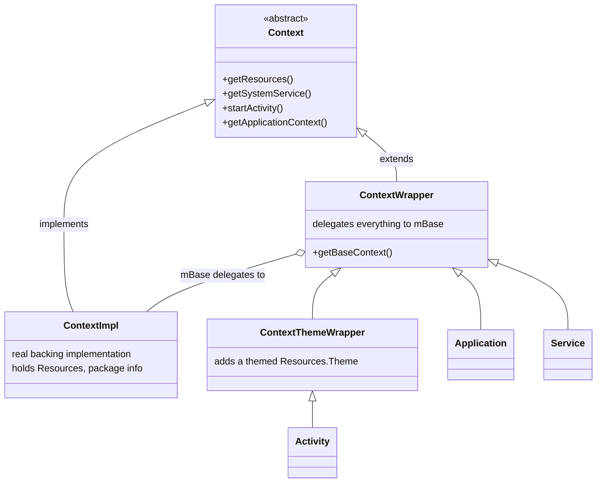

# Context — Deep Dive

`Context` is the single most-used and least-understood type in Android. It is the abstract handle through which your code talks to the Android system: it resolves resources, launches components, binds to services, opens files, and answers "who am I and what am I allowed to do?" Almost every framework API that does something interesting takes a `Context`. Because it is so pervasive, it is also the source of Android's most common memory leak — hold the *wrong* `Context` too long and you pin an entire `Activity` (and its view tree, bitmaps, and window) in memory.

This module answers the questions a senior is expected to answer instantly: *what* a `Context` actually is, *which* one to pass where, and *why* the wrong choice leaks.

## What `Context` actually is

`Context` is an **abstract class** (not an interface) that defines the contract for accessing an application's environment. It is your gateway to three broad capabilities:

| Capability | Example APIs |
|---|---|
| **Resource & asset access** | `getResources()`, `getString()`, `getAssets()`, `getTheme()`, `obtainStyledAttributes()` |
| **System services** | `getSystemService()` → `LayoutInflater`, `WindowManager`, `ConnectivityManager`, `NotificationManager`, `AlarmManager` |
| **Launching / binding components** | `startActivity()`, `startService()`, `bindService()`, `sendBroadcast()`, `registerReceiver()`, `getContentResolver()` |
| **App-private storage & prefs** | `getFilesDir()`, `getCacheDir()`, `getDatabasePath()`, `openFileOutput()`, `getSharedPreferences()` |
| **Package / identity info** | `getPackageName()`, `getPackageManager()`, `getApplicationInfo()`, `checkSelfPermission()` |

The key insight: **`Context` is abstract, so every concrete instance is really a `ContextImpl` behind the scenes.** `Activity`, `Service`, and `Application` don't reimplement `getString()` — they delegate to a shared `ContextImpl` created by the framework. What *differs* between context types is not the API surface but the **lifetime** and whether a **theme/UI** is attached.

## The class hierarchy



Read the diagram as two ideas:

1. **`ContextImpl` is the real engine.** It holds the `Resources`, the `LoadedApk`, package info, and the pointers to system services. It is created by `ActivityThread` during component creation.
2. **`ContextWrapper` is a decorator.** It holds a `Context mBase` field and forwards every call to it. `Application`, `Service`, and (via `ContextThemeWrapper`) `Activity` are all wrappers around a `ContextImpl`. This is why `getBaseContext()` on an `Activity` returns the underlying `ContextImpl`.

`ContextThemeWrapper` sits between `ContextWrapper` and `Activity` for one reason: it adds a **per-component `Resources.Theme`**. That is the whole difference that makes an `Activity` context "themed" and an `Application` context not.

## The context types

### Application context

- Created once, lives for the **entire process lifetime**. `getApplicationContext()` always returns this single instance.
- **No theme attached** (it's a `ContextWrapper`, not a `ContextThemeWrapper`). It falls back to the `<application android:theme>` from the manifest, not your `Activity` theme — so styled inflation and `AlertDialog`s will look wrong or crash.
- Cannot be used to show UI: `startActivity()` from it requires `FLAG_ACTIVITY_NEW_TASK`, and building a `Dialog`/`PopupWindow` with it throws or renders unthemed.
- **Safe to hold forever** — it can't leak an `Activity` because it *is* the app.

### Activity context

- A full `ContextThemeWrapper`: has your `Activity` theme, is tied to a `Window`, and is the correct context for anything that touches the screen.
- **Dies with the `Activity`.** On rotation, back-press, or process trim, the `Activity` is destroyed. Anything still holding a reference keeps the whole view hierarchy alive → leak.
- Use it for **UI work only**, and never let it escape the `Activity`'s lifecycle.

### Service context

- A `ContextWrapper` like `Application`, alive for the `Service`'s lifetime. **No UI/theme.** Fine for background work, notifications (via `NotificationManager`), and I/O.

## `getApplicationContext()` vs `getBaseContext()` vs `this` vs `getActivity()`

These are constantly confused. The distinctions:

| Expression | Returns | Lifetime | Themed? | Use it for |
|---|---|---|---|---|
| `this` (inside an `Activity`) | the `Activity` itself | Activity | ✅ | Inflating views, dialogs, adapters bound to UI |
| `getApplicationContext()` | the singleton `Application` | Process | ❌ | Singletons, DB, prefs, WorkManager, anything long-lived |
| `getBaseContext()` | the wrapped `ContextImpl` | same as wrapper | depends | Almost never — internal plumbing; avoid in app code |
| `getActivity()` (in a `Fragment`) | the hosting `Activity` (nullable) | Activity | ✅ | UI work from a fragment; may be `null` after detach |
| `requireContext()` (Fragment) | non-null `Context` | Activity | ✅ | UI work when you know the fragment is attached |

!!! tip "Rules of thumb"
    - Need to **inflate, theme, or show a window**? Use `this` / `Activity` / `requireContext()`.
    - Storing the context **past the current frame** (singleton, static, long-lived callback)? Use `getApplicationContext()`.
    - Reaching for `getBaseContext()`? You almost certainly want `this` instead — `getBaseContext()` is framework plumbing.

## Which context for what

| Task | Correct context | Why |
|---|---|---|
| Inflate a themed layout | `Activity` | needs `Resources.Theme` from `ContextThemeWrapper` |
| Show `AlertDialog` / `PopupWindow` / `Toast` anchored to UI | `Activity` | must attach to the `Activity`'s `Window` token |
| Start another `Activity` (normal flow) | `Activity` | no `NEW_TASK` flag needed; correct task affinity |
| Room / SQLite database | `Application` | DB outlives any single screen |
| `SharedPreferences` | `Application` | prefs are app-scoped |
| Singleton / DI graph (Hilt `@ApplicationContext`) | `Application` | matches singleton lifetime |
| `WorkManager`, `AlarmManager` scheduling | `Application` | survives Activity destruction |
| Loading a library / analytics SDK | `Application` | init once per process |
| Registering a lifecycle-scoped `BroadcastReceiver` | `Activity` | unregister in `onStop`/`onDestroy` |

!!! warning "The #1 Android memory leak: storing an Activity context in a singleton"
    A singleton lives for the whole process. An `Activity` lives for one screen. Put the second inside the first and every destroyed `Activity` — with its entire view tree, backing bitmaps, and `Window` — stays in memory. Rotate the device ten times and you have ten leaked `Activity` instances. This is the canonical leak covered in the [Memory & Leaks deep-dive](27-memory.md).

    **Never** cache an `Activity` (or `View`, `Fragment`, or any object transitively holding one) in a `static` field, a singleton, a long-lived listener, a `Handler` with a delayed message, or a non-static inner class of a long-lived object. When a singleton genuinely needs a `Context`, take `applicationContext` — or with Hilt, inject `@ApplicationContext`.

## Correct vs leaking context in a singleton

```kotlin
// ❌ LEAKS: the Activity is pinned for the whole process lifetime.
object SettingsCache {
    private var context: Context? = null          // holds whatever you pass

    fun init(context: Context) {
        this.context = context                     // caller passes `this` (Activity) → leak
    }

    fun theme() = context!!.getSharedPreferences("s", Context.MODE_PRIVATE)
}

// Called from Activity.onCreate:
SettingsCache.init(this)                           // Activity now unkillable

// ---------------------------------------------------------------

// ✅ SAFE: normalize to the Application context at the boundary.
object SettingsCache {
    private lateinit var appContext: Context

    fun init(context: Context) {
        appContext = context.applicationContext     // defensively strip the Activity
    }

    fun prefs(): SharedPreferences =
        appContext.getSharedPreferences("s", Context.MODE_PRIVATE)
}

// Even if a caller passes an Activity, applicationContext discards it.
SettingsCache.init(this)                            // no leak

// ---------------------------------------------------------------

// ✅ BEST (Hilt): let DI hand you the right context — impossible to pass the wrong one.
@Singleton
class SettingsRepository @Inject constructor(
    @ApplicationContext private val appContext: Context
) {
    fun prefs(): SharedPreferences =
        appContext.getSharedPreferences("s", Context.MODE_PRIVATE)
}
```

The defensive `context.applicationContext` at the entry point is the pattern to internalize: **any long-lived component should immediately downgrade whatever context it receives to the application context**, so a careless caller can't cause a leak.

## Advanced context factories

The framework exposes `Context` factory methods that return *decorated* contexts — new wrappers over the same `ContextImpl` but with a different configuration, storage, or window binding.

### `createConfigurationContext(Configuration)`

Returns a context whose `Resources` are resolved against an **overridden `Configuration`** (locale, density, font scale, orientation, UI mode). This is the supported way to load resources for a configuration different from the current one — e.g., render a screen in a user-chosen language without changing the whole app's locale.

### `createDeviceProtectedStorageContext()`

Returns a context whose file/prefs APIs point at **Device Protected Storage (DPS)** — storage available *before* the user unlocks the device (Direct Boot). Credential-encrypted storage (the default) is inaccessible until first unlock; DPS is for data an app needs during Direct Boot (e.g., an alarm clock, accessibility service). Data stored here is *not* encrypted with user credentials, so keep it non-sensitive.

### `createWindowContext(display, type, options)`

Returns a context bound to a specific **`Display` and window type** (API 30+). Required for adding non-activity windows (overlays, `WindowManager.addView`) correctly on multi-display / foldable devices, where the `Application` context has no display association.

## `ContextWrapper` for decoration

Because `ContextWrapper` forwards everything to its `mBase`, you can **subclass it to intercept specific calls** — the classic use is a per-screen locale or theme override without touching the rest of the app. `attachBaseContext()` in an `Activity`/`Application` is where you install the wrapper.

```kotlin
// Per-screen locale override via a ContextWrapper.
class LocaleContextWrapper(base: Context) : ContextWrapper(base) {
    companion object {
        fun wrap(context: Context, language: String): ContextWrapper {
            val config = Configuration(context.resources.configuration)
            val locale = Locale(language)
            Locale.setDefault(locale)
            config.setLocale(locale)
            // createConfigurationContext returns a ContextImpl with the new locale…
            val localizedContext = context.createConfigurationContext(config)
            // …which we wrap so getResources() everywhere sees the override.
            return LocaleContextWrapper(localizedContext)
        }
    }
}

// Install it at the base of the Activity — every getString()/inflate() below
// this Activity now resolves against the chosen locale.
class MainActivity : AppCompatActivity() {
    override fun attachBaseContext(newBase: Context) {
        val lang = LocaleStore.current(newBase)          // e.g. "ta" for Tamil
        super.attachBaseContext(LocaleContextWrapper.wrap(newBase, lang))
    }
}
```

The pattern works because `attachBaseContext` sets the `Activity`'s `mBase`. Every resource lookup the `Activity` performs flows through the wrapper → the configuration-overridden `ContextImpl`, so the whole screen renders in the chosen locale while the rest of the app is unaffected.

!!! note "Prefer `AppCompatDelegate.setApplicationLocales` on modern Android"
    Since AndroidX AppCompat 1.6 / Android 13 (per-app language preferences), `AppCompatDelegate.setApplicationLocales()` is the first-class API for app locale. The `ContextWrapper` approach remains the go-to for **custom per-screen configuration** (font scale demos, previewing a theme, embedding a differently-configured surface) and for supporting older devices.

## Mental model checklist

- `Context` is an **abstract** contract; `ContextImpl` is the real backing; `Activity`/`Service`/`Application` are **wrappers** over it.
- Only `ContextThemeWrapper` (→ `Activity`) carries a **theme**. UI work needs it.
- **Lifetime is the whole game.** UI-scoped context for UI, app-scoped context for anything that outlives a screen.
- A long-lived holder should **downgrade to `applicationContext`** at its boundary. Better yet, inject `@ApplicationContext`.
- Factory methods (`createConfigurationContext`, `createDeviceProtectedStorageContext`, `createWindowContext`) return decorated contexts for special resource/storage/display needs.

## Interview Q&A

### 1. What is `Context` and why is it abstract?

**Answer:** `Context` is the abstract handle to an app's environment — it exposes resource access, system services, component launching, and app-private storage. It's abstract because the framework provides a single concrete implementation, `ContextImpl`, created by `ActivityThread`; `Activity`, `Service`, and `Application` are all `ContextWrapper`s that delegate to that `ContextImpl`. Making `Context` abstract lets the framework vary the *backing* (a themed vs. unthemed impl, a config-overridden impl) without changing the API every component sees.

**Follow-up — so what's actually different between an Activity context and an Application context if they share a `ContextImpl`?** Lifetime and theme. The Activity is a `ContextThemeWrapper` with a `Resources.Theme` and a `Window`, alive for one screen; the Application is a plain `ContextWrapper` with no theme, alive for the whole process. The API surface is identical — the *guarantees* differ.

### 2. Explain the difference between `getApplicationContext()`, `getBaseContext()`, and `this` inside an Activity.

**Answer:** `this` is the `Activity` itself — a themed, UI-capable, short-lived context. `getApplicationContext()` returns the process-lifetime `Application` singleton with no theme. `getBaseContext()` returns the `ContextImpl` that the `Activity` (a `ContextWrapper`) delegates to — internal plumbing you rarely touch. Use `this` for UI, `getApplicationContext()` for long-lived storage, and effectively never reach for `getBaseContext()` in app code.

**Follow-up — when would `getBaseContext()` legitimately appear?** Mostly inside `ContextWrapper` subclasses or framework/library code that needs the undecorated base — e.g., after you've installed your own wrapper in `attachBaseContext` and want the original. In everyday app code it's a smell.

### 3. Why does storing an Activity context in a singleton leak, and how do you fix it?

**Answer:** A singleton lives for the whole process; an `Activity` lives for one screen. If the singleton holds an `Activity` reference, GC can never reclaim that `Activity` — along with its full view tree, bitmaps, and `Window` — even after `onDestroy`. Rotating the screen creates a fresh `Activity` each time while the old ones stay pinned. Fix: downgrade to `context.applicationContext` at the singleton's entry point, or inject `@ApplicationContext` with Hilt so the wrong context can't be passed in the first place.

**Follow-up — what if the singleton genuinely needs to show a dialog?** Then it shouldn't hold the context at all. Pass the `Activity` context transiently *into the method that shows the dialog* (so it's on the stack, not the heap), or expose an event/callback the currently-visible `Activity` observes and let *it* show the dialog with its own context.

### 4. Which context do you use to inflate a layout, and why does it matter?

**Answer:** Use an `Activity` context (or a `ContextThemeWrapper` derived from one). Inflation resolves theme attributes (`?attr/colorPrimary`, text appearances, etc.) via `Resources.Theme`, and only `ContextThemeWrapper`/`Activity` carry one. Inflating with the `Application` context gives you the manifest-level `<application>` theme — wrong colors, wrong styles, and for things like `AlertDialog.Builder` it can throw because there's no usable window/theme token.

**Follow-up — `LayoutInflater.from(context)` — does it matter which `context` I pass?** Yes. The inflater caches the theme from the context it's created with, and inflated views hold a reference back to it. Pass the `Activity` context so the views are themed correctly and, since the views die with the Activity anyway, no leak is introduced.

### 5. What does `createConfigurationContext` do, and how does `ContextWrapper` enable a per-screen locale override?

**Answer:** `createConfigurationContext(Configuration)` returns a new context whose `Resources` resolve against an overridden `Configuration` — locale, density, font scale, orientation. To apply a per-screen locale, you build a `Configuration` with the target `Locale`, call `createConfigurationContext` to get a config-overridden `ContextImpl`, wrap it in a `ContextWrapper` subclass, and install it via the `Activity`'s `attachBaseContext()`. Because `ContextWrapper` forwards all calls to that base, every `getString()`/inflation under the `Activity` resolves in the chosen locale while the rest of the app is untouched.

**Follow-up — isn't there a modern API for this now?** For *app locale*, yes: `AppCompatDelegate.setApplicationLocales()` (AppCompat 1.6 / Android 13 per-app languages) is the first-class approach. The `createConfigurationContext` + `ContextWrapper` route is still the tool for **custom per-screen configuration** — previewing a font scale or theme, or embedding a differently-configured surface — and for backward compatibility on older devices.
