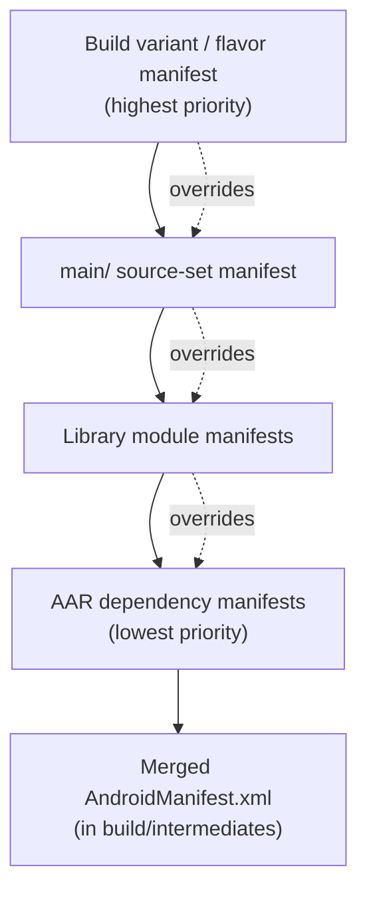

# Android Manifest

The `AndroidManifest.xml` is the app's contract with the operating system. Before any code runs, the system (and Google Play) reads the manifest to learn **what the app is made of** (components), **what it can do** (permissions), **what hardware/software it needs** (features), and **who is allowed to talk to it** (export/permission rules). Nothing that is not declared here exists to the framework: an undeclared `Activity` cannot be launched, an undeclared permission is never granted, and an undeclared `<queries>` target is invisible on Android 11+.

The manifest serves three distinct audiences, and senior candidates are expected to keep them separate:

| Audience | Reads the manifest for | Consequence of getting it wrong |
|----------|------------------------|--------------------------------|
| **Package installer / PackageManager** | Components, permissions, `minSdk` | Install fails or component is unreachable |
| **Runtime framework** | `exported`, `launchMode`, `foregroundServiceType`, intent filters | `SecurityException`, crash, or hijack |
| **Google Play** | `uses-feature`, `targetSdk`, permissions, `uses-sdk` | Device filtering, listing rejection, forced updates |

---

## The `<application>` element

There is exactly one `<application>` tag; it holds app-wide configuration and is the parent of every component. The framework instantiates the `android:name` class (your `Application` subclass) **before any component**, making it the earliest process-wide hook.

```kotlin
// AndroidManifest.xml
<application
    android:name=".MyApplication"
    android:theme="@style/Theme.MyApp"
    android:icon="@mipmap/ic_launcher"
    android:allowBackup="true"
    android:networkSecurityConfig="@xml/network_security_config"
    android:dataExtractionRules="@xml/data_extraction_rules"
    android:enableOnBackInvokedCallback="true"
    android:largeHeap="false"
    tools:targetApi="tiramisu">
    <!-- components -->
</application>
```

### Key attributes

| Attribute | Purpose | Senior gotcha |
|-----------|---------|---------------|
| `android:name` | Custom `Application` class | Keep it lean; work here delays cold start |
| `android:theme` | App-wide default theme | Splash-screen theme is applied here on 12+ |
| `android:allowBackup` | Enables Auto Backup / D2D transfer | `true` by default — a **security concern** (see Backup Rules) |
| `android:networkSecurityConfig` | Declarative TLS / cleartext / pinning policy | Replaces per-connection code; overrides `usesCleartextTraffic` |
| `android:largeHeap` | Requests a bigger Dalvik heap | Almost always the wrong fix; masks a leak, hurts GC pauses |
| `android:requestLegacyExternalStorage` | Opt out of scoped storage | **Ignored on Android 11+ (API 30) targets** — a migration crutch only |
| `android:enableOnBackInvokedCallback` | Opt into the predictive back gesture (13+) | Required before `OnBackInvokedCallback` / `BackHandler` predictive animations work |
| `android:usesCleartextTraffic` | Allow plaintext HTTP | Defaults to `false` on `targetSdk >= 28`; prefer the network security config |

!!! note "`largeHeap` is a smell, not a solution"
    `largeHeap="true"` increases per-process memory limits but does **not** raise the limit uniformly across devices, worsens GC pause times, and makes OOMs harder to reproduce. In interviews, treat a request for `largeHeap` as a prompt to discuss bitmap pooling, `inSampleSize`, memory profiling, and leak detection instead.

---

## Component declarations

Every one of the four component types must be declared to be usable. `android:exported` is the single most important attribute across all of them.

### `<activity>`

```kotlin
// AndroidManifest.xml
<activity
    android:name=".DeepLinkActivity"
    android:exported="true"
    android:launchMode="singleTask"
    android:taskAffinity="com.example.deeplinks"
    android:windowSoftInputMode="adjustResize"
    android:configChanges="orientation|screenSize|keyboardHidden">

    <intent-filter android:autoVerify="true">
        <action android:name="android.intent.action.VIEW" />
        <category android:name="android.intent.category.DEFAULT" />
        <category android:name="android.intent.category.BROWSABLE" />
        <data android:scheme="https" android:host="example.com" />
    </intent-filter>
</activity>
```

| Attribute | Meaning |
|-----------|---------|
| `exported` | Whether other apps / the system can start it. **Mandatory to declare on Android 12+ (API 31) for any component with an intent filter.** |
| `launchMode` | `standard`, `singleTop`, `singleTask`, `singleInstance` — controls task/back-stack behavior |
| `taskAffinity` | Which task the activity prefers; drives reparenting and `singleTask` grouping |
| `intent-filter` | Declares which implicit intents the activity responds to; **its presence implies `exported=true` semantically**, so you must set it explicitly |

!!! warning "Android 12+ hard requirement"
    Any component that declares an `<intent-filter>` **must** set `android:exported` explicitly. Omitting it is a **build-time failure** (the app won't install on API 31+). This was introduced precisely because implicit-export was the source of countless vulnerabilities.

### `<service>`

```kotlin
// AndroidManifest.xml
<service
    android:name=".LocationSyncService"
    android:exported="false"
    android:foregroundServiceType="location"
    android:permission="com.example.permission.BIND_SYNC" />
```

- **`foregroundServiceType`** — mandatory (13+/14+) for foreground services. The type (`location`, `camera`, `microphone`, `dataSync`, `mediaPlayback`, …) must be declared **and** backed by a matching `<uses-permission>` such as `FOREGROUND_SERVICE_LOCATION`. On Android 14 (API 34) a mismatch throws `MissingForegroundServiceTypeException` / `SecurityException` at `startForeground()`.
- **`permission`** — a permission the *caller* must hold to bind/start the service, closing the gap that `exported=false` alone leaves for same-signature callers.

### `<receiver>`

```kotlin
// AndroidManifest.xml
<receiver
    android:name=".BootReceiver"
    android:exported="false">
    <intent-filter>
        <action android:name="android.intent.action.BOOT_COMPLETED" />
    </intent-filter>
</receiver>
```

Manifest-declared receivers persist across process death (unlike context-registered ones), but since Android 8 (API 26) **implicit broadcasts are heavily restricted** — most must be registered at runtime with a `Context`. `BOOT_COMPLETED` is a notable exception that still works via the manifest.

### `<provider>`

```kotlin
// AndroidManifest.xml
<provider
    android:name="androidx.core.content.FileProvider"
    android:authorities="${applicationId}.fileprovider"
    android:exported="false"
    android:grantUriPermissions="true">
    <meta-data
        android:name="android.support.FILE_PROVIDER_PATHS"
        android:resource="@xml/file_paths" />
</provider>
```

| Attribute | Meaning |
|-----------|---------|
| `authorities` | Globally-unique namespace; **install fails if two apps claim the same authority** — always namespace with `${applicationId}` |
| `exported` | Should be `false` for `FileProvider`; access is granted per-URI instead |
| `grantUriPermissions` | Enables temporary, per-URI grants via `FLAG_GRANT_READ_URI_PERMISSION` — the correct way to share files without exporting the provider |

---

## Permissions, features, and SDK

### `<uses-permission>`

```kotlin
// AndroidManifest.xml
<uses-permission android:name="android.permission.INTERNET" />

<!-- Trim a legacy permission off modern OS versions -->
<uses-permission
    android:name="android.permission.WRITE_EXTERNAL_STORAGE"
    android:maxSdkVersion="28" />
```

`android:maxSdkVersion` **removes** the permission request on newer OS versions — critical for legacy storage permissions that Play now flags. It shrinks your permission footprint on the store listing and Data Safety form without touching code.

### `<uses-feature>` — Play Store filtering

```kotlin
// AndroidManifest.xml
<!-- App uses the camera but must still install on camera-less devices -->
<uses-feature android:name="android.hardware.camera" android:required="false" />
```

`uses-feature` drives **Google Play device filtering**, not runtime behavior:

- `required="true"` → devices **lacking** the feature are excluded from installing.
- `required="false"` → all devices can install; you must guard at runtime with `packageManager.hasSystemFeature(...)`.

A classic trap: requesting `CAMERA` permission **implicitly declares `android.hardware.camera` as required**, silently cutting your addressable market. Always pair a permission with an explicit `uses-feature ... required="false"` when the hardware is optional.

### `<uses-sdk>` — min / target / compile

Declared in Gradle (which generates the `<uses-sdk>`), not hand-written:

| SDK level | Controls |
|-----------|----------|
| `minSdk` | Lowest OS that can install; gates which APIs are safe without guards |
| `targetSdk` | **Behavior gating** — the OS applies newer restrictions (scoped storage, exact alarms, notification runtime permission, FGS types) only up to the version you *target* |
| `compileSdk` | Which API surface you compile against; must be ≥ everything you reference |

**`targetSdk` is the pivotal concept.** The OS uses it to decide whether to apply new behavior changes to your app for backward compatibility. Bumping `targetSdk` is the moment you opt into (and must handle) an OS version's breaking changes. Play enforces a minimum `targetSdk` for new apps and updates.

---

## Manifest merging

The final merged manifest is assembled by the **Manifest Merger** from multiple sources, in a strict priority order. Higher-priority sources win conflicts.



**Merge priority (high → low):** build-variant/flavor → build-type → `main` → library modules → transitive AAR dependencies. When two sources set the same attribute, the merger either takes the higher-priority value, merges, or **errors** if it can't reconcile them.

### `tools:` merge directives

The `tools` namespace controls the merger explicitly:

```kotlin
// AndroidManifest.xml — resolving a conflict from a library
<application
    xmlns:tools="http://schemas.android.com/tools"
    android:allowBackup="false"
    tools:replace="android:allowBackup"
    tools:node="merge">

    <!-- A library declared this permission; strip it from the final manifest -->
    <uses-permission
        android:name="android.permission.WRITE_EXTERNAL_STORAGE"
        tools:node="remove" />
</application>
```

| Directive | Effect |
|-----------|--------|
| `tools:replace="attr"` | Override a lower-priority value that would otherwise conflict-error |
| `tools:remove="attr"` | Delete an attribute a library added |
| `tools:node="remove"` | Delete an entire element a library injected (e.g., an unwanted permission or provider) |
| `tools:node="merge"` | Default — combine children |
| `tools:node="replace"` | Replace the whole element and its children |
| `tools:node="strict"` | Fail the build on any conflict |

### `manifestPlaceholders`

Placeholders let Gradle inject values into the manifest per build type/flavor — the standard way to vary deep-link hosts, auth-redirect schemes, or API keys:

```kotlin
// build.gradle.kts
android {
    defaultConfig {
        manifestPlaceholders["authHost"] = "example.com"
    }
    buildTypes {
        getByName("debug") {
            manifestPlaceholders["authHost"] = "staging.example.com"
        }
    }
}
```

```kotlin
// AndroidManifest.xml
<data android:scheme="https" android:host="${authHost}" />
```

`${applicationId}` is a built-in placeholder — essential for provider authorities so debug and release builds (with different suffixes) don't collide when installed side-by-side.

---

## Package visibility — `<queries>` (Android 11+)

Since Android 11 (API 30), an app **cannot see the full list of installed packages** by default. `queryIntentActivities`, `getPackageInfo`, and `resolveActivity` return filtered results unless you declare what you need to interact with.

```kotlin
// AndroidManifest.xml
<queries>
    <!-- A specific app you launch/deep-link into -->
    <package android:name="com.google.android.apps.maps" />

    <!-- Any app that can handle this intent (e.g., a browser) -->
    <intent>
        <action android:name="android.intent.action.VIEW" />
        <data android:scheme="https" />
    </intent>

    <!-- Any app exposing a provider with this authority -->
    <provider android:authorities="com.example.somecontentprovider" />
</queries>
```

Without a matching `<queries>` entry, `resolveActivity()` returns `null` even when a handler exists, and `startActivity()` may throw `ActivityNotFoundException`. The broad `QUERY_ALL_PACKAGES` permission exists but is **policy-restricted on Play** — you must justify it or face rejection. Prefer narrow `<queries>` declarations.

---

## Backup and data-extraction rules

`android:allowBackup` (default `true`) enables Android's **Auto Backup** — app data is copied to the user's Google Drive and restored on reinstall. This is a **security and privacy surface**: tokens, databases, and shared prefs can leave the device and be restored onto another.

- **Android ≤ 11:** `android:fullBackupContent="@xml/backup_rules"` includes/excludes paths for cloud backup.
- **Android 12+ (API 31):** `android:dataExtractionRules="@xml/data_extraction_rules"` supersedes it and splits **cloud backup** from **device-to-device transfer**, letting you exclude secrets from the cloud while still allowing D2D migration.

```kotlin
// res/xml/data_extraction_rules.xml
<data-extraction-rules>
    <cloud-backup>
        <exclude domain="sharedpref" path="auth_tokens.xml" />
        <exclude domain="database" path="secure.db" />
    </cloud-backup>
    <device-transfer>
        <include domain="database" path="game_progress.db" />
    </device-transfer>
</data-extraction-rules>
```

!!! tip "Senior default"
    Either set `allowBackup="false"` for apps holding sensitive credentials, or provide explicit extraction rules that exclude tokens, keys, and encrypted DBs from `cloud-backup`. "It's on by default" is not a threat-model answer.

---

## `android:exported` — the #1 manifest vulnerability

Historically, declaring an `<intent-filter>` implicitly made a component `exported`, so countless apps unknowingly exposed activities, services, and receivers to any other app on the device. Attackers could launch internal screens, bypass auth flows, inject broadcasts, or invoke privileged services.

!!! warning "The rules to internalize"
    - **Default with an intent filter:** exported behavior — which is why Android 12+ forces you to declare it.
    - **Set `exported="false"`** for anything only your app or the system should invoke (most services, internal receivers, `FileProvider`).
    - **`exported="true"` demands a reason:** a launcher activity, a public deep link, or a component intentionally shared with other apps. When exported, **validate every incoming `Intent`** — never trust extras, actions, or URIs.
    - **`exported=false` is not a full ACL.** Add `android:permission` (ideally a `signature`-level custom permission) when even same-device callers must be gated.

A minimal safe internal component:

```kotlin
// AndroidManifest.xml
<activity
    android:name=".InternalSettingsActivity"
    android:exported="false" />
```

---

## Per-variant / per-flavor manifests

Each source set can supply its own manifest, merged by priority. This is how build types and product flavors diverge without code duplication:

```
src/
├── main/AndroidManifest.xml          # shared baseline
├── debug/AndroidManifest.xml         # adds usesCleartextTraffic, debug provider
├── release/AndroidManifest.xml       # locks down flags
└── paid/AndroidManifest.xml          # flavor-specific components/permissions
```

Common uses: enabling cleartext traffic or a LeakCanary provider only in `debug`, adding a flavor-specific launcher/deep-link host, or removing a test-only permission from `release`. The variant manifest wins over `main`, which wins over libraries — so a flavor can override an unwanted attribute a dependency injected, using `tools:replace` when the merger would otherwise error.

---

## Interview Q&A

### 1. Why did Android 12 make `android:exported` mandatory, and what breaks if you omit it?

**Answer:** Before API 31, a component with an `<intent-filter>` was implicitly exported, silently exposing internal activities/services/receivers to other apps — a massive, widespread vulnerability class. Android 12 requires you to declare `exported` explicitly for any component with an intent filter; omitting it is a **build/install failure** on API 31+, forcing a conscious decision. Set `true` only for launcher activities, public deep links, and intentionally shared components; everything else `false`.

**Follow-up:** *Is `exported="false"` sufficient to secure a component?* Not always — it blocks other apps, but for finer control (or to gate same-signature callers) add `android:permission`, ideally a `signature`-level custom permission, and always validate incoming intent data.

### 2. Explain `targetSdk` vs `minSdk` vs `compileSdk`. Which one changes runtime behavior?

**Answer:** `minSdk` is the lowest OS that can install the app. `compileSdk` is the API surface you build against. `targetSdk` is the one that gates **runtime behavior**: the OS applies newer behavior changes (scoped storage, runtime notification permission, FGS types, exact-alarm limits) only up to the version you target, preserving backward compatibility for lower targets. Bumping `targetSdk` = opting into that OS version's breaking changes.

**Follow-up:** *Why does Google Play force `targetSdk` bumps?* To push the ecosystem onto modern privacy/security behaviors; Play blocks new apps and updates below a rolling minimum `targetSdk`.

### 3. How does manifest merging resolve a conflict when a library declares a permission you don't want?

**Answer:** The merger combines sources in priority order (variant/flavor → build-type → main → library → AAR deps). A library-injected `<uses-permission>` can be stripped from the final manifest with `tools:node="remove"` on a matching element in your `main` manifest. For conflicting attribute values, `tools:replace="attr"` lets the higher-priority source override what would otherwise be a merge error.

**Follow-up:** *How do you inspect the final result?* Open the **Merged Manifest** tab in Android Studio (or the merged manifest under `build/intermediates/`), which shows each element's origin and merge decisions.

### 4. What changed about seeing other installed apps in Android 11, and how do you handle it?

**Answer:** API 30 introduced **package visibility filtering** — `queryIntentActivities`, `resolveActivity`, and `getPackageInfo` return filtered results by default. To interact with specific apps you declare a `<queries>` block listing target packages, intents, or provider authorities. Without it, `resolveActivity` may return `null` and `startActivity` can throw `ActivityNotFoundException`.

**Follow-up:** *Why not just use `QUERY_ALL_PACKAGES`?* It's a Play **policy-restricted** permission requiring justification (e.g., a launcher or antivirus app); misuse risks listing rejection. Prefer narrow `<queries>` entries.

### 5. What are the security implications of `android:allowBackup`, and how do the 12+ rules improve on the old ones?

**Answer:** `allowBackup` defaults to `true`, enabling Auto Backup that copies app data to Google Drive and restores it on reinstall — potentially leaking tokens, DBs, and prefs off-device. Pre-12 you controlled inclusion with `fullBackupContent`. Android 12+ replaces it with `dataExtractionRules`, which separately governs **cloud backup** vs **device-to-device transfer**, so you can exclude secrets from the cloud while still allowing local migration.

**Follow-up:** *What's your default for an app storing auth tokens?* Either `allowBackup="false"`, or explicit extraction rules that `<exclude>` credential/keystore/encrypted-DB paths from `cloud-backup` — never rely on the permissive default.
