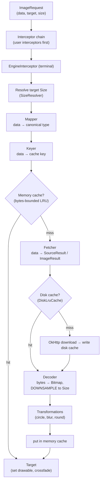
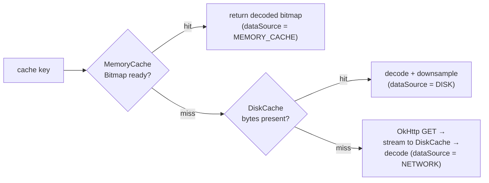
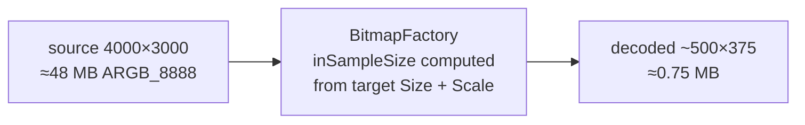

# Coil / Image Loading — Internals

!!! abstract "What this covers"
    Coil (**Co**routine **I**mage **L**oader) is a Kotlin-first image loader built on
    **coroutines + OkHttp + `okio`**. Its job is to turn a URL (or file, resource, `Uri`,
    `ByteArray`…) into a `Drawable`/`Bitmap` on a target, **without OOMing** and **without
    doing redundant work**. The whole library is one idea repeated: an `ImageRequest`
    flows through an **interceptor chain**, is resolved through a **two-tier cache**
    (memory → disk), decoded and **downsampled to the target's size**, transformed, and
    handed to a `Target` whose work is **tied to a lifecycle** so it auto-cancels. This
    doc goes engine-deep on that pipeline, the caches, the OOM story, and why a
    coroutines-native design beats callback-era Glide/Picasso in Kotlin.

    Cross-link: [System Design — Image Loading Pipeline](../system-design/case-image-pipeline.md)
    designs this library from scratch; read this for *how Coil actually does it*.

---

## Part A — Setup & Usage

### Dependencies

```kotlin
// Compose
implementation("io.coil-kt.coil3:coil-compose:3.x")
// Network fetch via OkHttp (Coil 3 splits network out)
implementation("io.coil-kt.coil3:coil-network-okhttp:3.x")
```

!!! note "Coil 2 vs Coil 3"
    Coil 3 (`io.coil-kt.coil3`, package `coil3.*`) is **Kotlin Multiplatform** and moves
    networking into a pluggable `coil-network-*` artifact — you must add it explicitly or
    URLs won't load. Coil 2 (`io.coil-kt`, package `coil.*`) bundled OkHttp. The pipeline
    concepts below are identical; only package names and the network split differ.

### The `ImageRequest` — the unit of work

Everything is an `ImageRequest`. It is an **immutable value object** carrying the data,
target, size resolver, caches keys, transformations, and lifecycle. `ImageLoader.enqueue()`
(async, returns a `Disposable`) or `execute()` (suspend, returns an `ImageResult`) runs it.

```kotlin
val request = ImageRequest.Builder(context)
    .data("https://example.com/photo.jpg")
    .crossfade(true)                       // fade placeholder → result
    .placeholder(R.drawable.ph)
    .error(R.drawable.err)
    .memoryCachePolicy(CachePolicy.ENABLED)
    .diskCachePolicy(CachePolicy.ENABLED)
    .size(Size.ORIGINAL)                   // or let the target resolve it
    .target(imageView)
    .listener(onSuccess = { _, r -> /* r.dataSource: MEMORY_CACHE / DISK / NETWORK */ })
    .build()

val disposable = context.imageLoader.enqueue(request)  // singleton loader
// disposable.dispose()  // cancels the coroutine + clears the target
```

### View load (the extension)

```kotlin
imageView.load("https://example.com/photo.jpg") {
    crossfade(200)
    placeholder(R.drawable.ph)
    transformations(CircleCropTransformation())
}
```

`ImageView.load {}` is sugar: it builds an `ImageRequest` with `target(this)` and the
`View`'s size resolver, then calls `enqueue`. Critically it **stores the returned
`Disposable` as a view tag** and disposes the previous one — so re-binding the same
`ImageView` in a `RecyclerView` cancels the stale request automatically (see lifecycle).

### Compose

```kotlin
AsyncImage(
    model = ImageRequest.Builder(LocalContext.current)
        .data(url)
        .crossfade(true)
        .build(),
    contentDescription = null,
    placeholder = painterResource(R.drawable.ph),
    error = painterResource(R.drawable.err),
    contentScale = ContentScale.Crop,
    modifier = Modifier.size(96.dp),
)
```

`AsyncImage` is a `Layout` that owns a `ConstraintsSizeResolver`: it reads the measured
constraints and feeds them as the request `Size`, so the bitmap is decoded to **exactly the
composable's pixel size**. `rememberAsyncImagePainter` gives you the `Painter` directly when
you need to draw into a custom layout or read `painter.state` (Loading/Success/Error/Empty).

---

## Part B — The Pipeline

An enqueued request is executed by `RealImageLoader` on a coroutine. The stages:



### 1. Interceptor chain

Identical shape to OkHttp's `Interceptor` chain. Each `Interceptor` gets a `Chain`, can
inspect/rewrite the `ImageRequest`, calls `chain.proceed(request)`, and can post-process the
returned `ImageResult`. **User interceptors run first**; the built-in `EngineInterceptor` is
the **terminal** node that actually does map → key → cache → fetch → decode → transform.

```kotlin
class OfflineOnlyInterceptor : Interceptor {
    override suspend fun intercept(chain: Interceptor.Chain): ImageResult {
        val req = chain.request.newBuilder()
            .networkCachePolicy(CachePolicy.READ_ONLY)   // never hit network
            .build()
        return chain.proceed(req)
    }
}
```

!!! tip "Where to do cross-cutting work"
    Header injection, forced cache policies, request rewriting, blur-hash placeholders,
    metrics — all belong in an interceptor, not scattered at call sites. This is where you
    put logic that must apply to *every* image.

### 2. Mapper — normalize the data

A `Mapper<T, V>` converts one data type into a type a `Fetcher` understands. Coil ships
mappers for `String → Uri`, `HttpUrl → Uri`, `File → Uri`, resource ints, etc. Register your
own to teach Coil a domain type:

```kotlin
class AvatarMapper : Mapper<Avatar, String> {
    override fun map(data: Avatar, options: Options): String =
        "https://cdn.example.com/u/${data.userId}?s=${options.size}"  // size-aware!
}
```

Mappers are **pure and synchronous** — no I/O. They just rewrite the data value.

### 3. Keyer — compute the cache key

A `Keyer<T>` derives the **memory-cache key** from the (mapped) data plus `Options`.
The key must fold in everything that changes the pixels: URL, target size, and each
transformation's `cacheKey`. Two requests for the same URL at different sizes are
**different keys** — that is deliberate (a thumbnail and a full image are different bitmaps).

```kotlin
class SignedUrlKeyer : Keyer<HttpUrl> {
    // Strip the volatile ?token=... so signed URLs still dedupe
    override fun key(data: HttpUrl, options: Options): String =
        data.newBuilder().removeAllQueryParameters("token").build().toString()
}
```

### 4. Fetcher — data → bytes/drawable

A `Fetcher` converts the mapped data into either a `SourceResult` (an `okio.BufferedSource` +
metadata, to be decoded) or an `ImageResult` (an already-materialized drawable). Built-ins:
`HttpUriFetcher` (OkHttp), `FileFetcher`, `ContentUriFetcher`, `ResourceUriFetcher`,
`AssetUriFetcher`, `BitmapFetcher`, `DrawableFetcher`. The `HttpUriFetcher` is where the
**disk cache** is consulted and populated.

### 5. Decoder — bytes → Bitmap (with downsampling)

A `Decoder` turns the `SourceResult` into a `Bitmap`/`Drawable`. `BitmapFactoryDecoder` is the
default (uses `BitmapFactory` + `inSampleSize`); `AnimatedImageDecoder` handles GIF/animated
WebP/HEIF via `ImageDecoder` on API 28+; `SvgDecoder` (add-on) rasterizes SVG. **This stage
owns the OOM-prevention story** — see Part D.

### 6. Transformation — Bitmap → Bitmap

`Transformation`s run after decode, in order, off the main thread. Each has a **`cacheKey`**
that is folded into the memory-cache key so a circle-cropped image and the original don't
collide.

```kotlin
class GrayscaleTransformation : Transformation() {
    override val cacheKey = "grayscale"          // MUST be stable + unique
    override suspend fun transform(input: Bitmap, size: Size): Bitmap {
        val out = createBitmap(input.width, input.height)
        val paint = Paint().apply {
            colorFilter = ColorMatrixColorFilter(ColorMatrix().apply { setSaturation(0f) })
        }
        Canvas(out).drawBitmap(input, 0f, 0f, paint)
        return out
    }
}
```

### 7. Target — deliver the result

`Target` has three callbacks: `onStart(placeholder)`, `onError(error)`, `onSuccess(result)`.
`ImageViewTarget` sets the drawable and drives the crossfade. In Compose the target is
internal — state flows into the `AsyncImagePainter`. A target that also implements
`ViewTarget`/`LifecycleObserver` is what wires auto-cancellation.

---

## Part C — Caching (two tiers)

Coil does a **two-tier lookup**: memory cache first (already-decoded `Bitmap`, instant), then
disk cache (compressed bytes, must still decode). A miss on both goes to the network.



### Memory cache — bytes-bounded LRU + weak references

Coil's `MemoryCache` is **two collections working together**:

- **Strong `LruCache`**, bounded by **bytes, not entry count**. Default budget is a share of
  available heap (via `ActivityManager.memoryClass` / low-RAM flags — typically ~25% of app
  memory). Each entry's size is the **bitmap allocation byte count** (`Bitmap.allocationByteCount`).
  When inserting an entry would exceed the budget, the least-recently-used entries are
  evicted until it fits.
- **Weak-reference cache** for evicted-but-still-alive bitmaps. When the strong LRU evicts a
  bitmap, a `WeakReference` to it is kept. If the same key is requested again *before GC
  reclaims it*, Coil resurrects it from the weak map — a free hit that also protects against
  loading the same in-use bitmap twice.

!!! note "Why bytes, not count"
    A count-bounded cache treats a 40 KB thumbnail and a 12 MB full-screen bitmap as equal —
    catastrophic for memory. `Bitmap` size is `width × height × bytesPerPixel` (ARGB_8888 = 4).
    Bounding by bytes lets the cache hold *many* thumbnails but only a *few* big images, which
    is exactly what you want.

```kotlin
val loader = ImageLoader.Builder(context)
    .memoryCache {
        MemoryCache.Builder()
            .maxSizePercent(context, 0.25)   // 25% of app memory budget
            .strongReferencesEnabled(true)
            .weakReferencesEnabled(true)
            .build()
    }
    .build()

// Manual access — keys are MemoryCache.Key(url, extras)
val key = MemoryCache.Key("https://example.com/photo.jpg")
val bitmap: Bitmap? = loader.memoryCache?.get(key)?.image?.toBitmap()
```

Coil also trims the memory cache on `onTrimMemory`/`onLowMemory` callbacks it registers via a
`ComponentCallbacks2` — under `TRIM_MEMORY_RUNNING_LOW`+ it drops the LRU (and clears entirely
at `TRIM_MEMORY_BACKGROUND`+ tiers).

### Disk cache — `DiskLruCache` (okio)

Coil's `DiskCache` is a rewrite of Jake Wharton's `DiskLruCache` on top of **okio**, bounded
by bytes on disk (default ~250 MB, capped at a % of free space). It stores the **raw compressed
bytes** (the downloaded JPEG/PNG/WebP), keyed by a hash of the URL. A `journal` file records
`CLEAN`/`DIRTY`/`READ`/`REMOVE` operations so the cache survives process death and can rebuild
its LRU order on open. Edits are transactional: you get an `Editor`, write to a temp file, and
`commit()` atomically renames it into place.

```kotlin
.diskCache {
    DiskCache.Builder()
        .directory(context.cacheDir.resolve("image_cache"))
        .maxSizeBytes(250L * 1024 * 1024)
        .build()
}
```

!!! warning "Don't share one OkHttp `Cache` with your API client"
    Coil manages its *own* `DiskCache`; the `HttpUriFetcher` streams the response body straight
    into it. Do **not** also attach an OkHttp `Cache` sized for images to the same `OkHttpClient`
    you use for JSON — you'll double-store bytes and thrash your API cache. Share the OkHttp
    *client* (connection pool, dispatcher, TLS), not its response `Cache`.

### HTTP cache policy

`memoryCachePolicy` / `diskCachePolicy` / `networkCachePolicy` each take a `CachePolicy`
(`ENABLED`, `READ_ONLY`, `WRITE_ONLY`, `DISABLED`). Coil also honors HTTP cache headers
(`Cache-Control`, `ETag`) for revalidation of disk entries.

---

## Part D — OOM prevention: downsampling to target size

The single most important thing an image loader does is **never decode a bitmap larger than
the space it will be drawn into**. A 4000×3000 photo is 4000·3000·4 ≈ **48 MB** as ARGB_8888.
Loaded into a 300×300 view it wastes ~47.8 MB and OOMs on low-RAM devices.

Coil resolves the target `Size` (from the `SizeResolver` — `ViewSizeResolver` reads the view's
measured bounds, `ConstraintsSizeResolver` reads Compose constraints), then instructs the
`Decoder` to sample down. `BitmapFactoryDecoder` computes `BitmapFactory.Options.inSampleSize`
(a power of two) so decoding reads only every *n*-th pixel — memory and decode time drop by
`n²`.



`Scale` interacts with sampling: `Scale.FILL` (default for `Crop`) samples so the smaller
dimension covers the target; `Scale.FIT` so the larger dimension fits. `precision(Precision.INEXACT)`
(default) lets Coil accept the nearest power-of-two sample; `Precision.EXACT` forces an extra
`createScaledBitmap` to hit the size precisely (needed for pixel-perfect crops).

!!! danger "`Size.ORIGINAL` is a foot-gun"
    Requesting `Size.ORIGINAL` disables downsampling — you decode the full-resolution bitmap.
    Only use it when you genuinely need the source pixels (e.g., saving/exporting). For display,
    let the target resolve the size.

### Bitmap pooling — the history

Glide famously maintains a **`BitmapPool`**: it reuses `Bitmap` allocations via
`BitmapFactory.Options.inBitmap` to avoid churning the heap and triggering GC. This mattered
enormously on **Dalvik** (pre-Android 5.0), where bitmap memory lived on the Java heap and GC
pauses were long and stop-the-world.

**Coil deliberately does not pool bitmaps.** Since Android 8.0 (ART, API 26+), bitmap pixel
data moved off the Java heap into **native memory**, and ART's concurrent copying collector
reclaims short-lived allocations cheaply. Pooling adds complexity (mutable shared bitmaps,
`inBitmap` size/config matching rules, subtle recycle bugs) for shrinking benefit. Coil's
stance: **lean on the modern GC**, keep bitmaps immutable, and win on simplicity and
correctness. (Coil 2 removed the last vestiges of pooling that Coil 1 briefly had.)

| | Dalvik era (Glide's design point) | ART era (Coil's design point) |
|---|---|---|
| Bitmap memory | Java heap | Native heap (API 26+) |
| GC cost | Long stop-the-world pauses | Cheap concurrent collection |
| Reuse strategy | `BitmapPool` + `inBitmap` | None — allocate fresh, let GC reclaim |
| Trade-off | Fewer allocs, more complexity + mutation bugs | Simpler, immutable, GC-friendly |

---

## Part E — Request lifecycle & auto-cancellation

Every `ImageRequest` is bound to a **`Lifecycle`** (resolved from the target's context/view,
or set explicitly). The request coroutine is launched in a scope tied to that lifecycle:

- Work is **suspended below `STARTED`** — a request enqueued while the host is stopped waits
  rather than decoding into a screen the user can't see.
- On `ON_DESTROY` the scope is cancelled → the coroutine cancels → OkHttp call is cancelled,
  decode stops, and the `Disposable` becomes `isDisposed`.

For **views**, Coil attaches a `ViewTargetRequestManager` as a view tag. It ensures **one
active request per view**: starting a new load on a view **cancels the previous** request's
job and disposes it. This is why `RecyclerView` recycling "just works" — binding row N+1's
image onto a recycled `ImageView` cancels row N's in-flight download automatically. It also
listens to `View.OnAttachStateChangeListener`: **detach cancels**, re-attach restarts.

In **Compose**, `AsyncImagePainter` starts its request in a `RememberObserver`
(`onRemembered`) and cancels it in `onForgotten` / `onAbandoned` — i.e. **when the composable
leaves composition** (scrolls off a `LazyColumn`, or a state change disposes it). Size flows
from the layout's constraints, so the request also **restarts if the composable is remeasured**
to a different size.

!!! tip "Never leak a request past its screen"
    Because cancellation is automatic on lifecycle/detach/dispose, you rarely call
    `disposable.dispose()` yourself. Do it manually only for requests **not** tied to a target
    (e.g. a warm-the-cache `enqueue` you want to abort on a user action).

---

## Part F — Why Coil over Glide/Picasso (coroutines-first)

Coil is designed **around** `suspend`/`Flow` and structured concurrency, not adapted to it:

- **Cancellation is free.** A coroutine cancelled by its scope propagates a
  `CancellationException` all the way down — the OkHttp call, `okio` reads, and decode all
  unwind. Glide/Picasso model this with manual `clear()`/`cancelRequest()` and target tags.
- **`execute()` is a `suspend fun`** returning `ImageResult` — you can `await` an image inline
  in a coroutine (e.g. preloading before a screen transition) with no callback pyramid.
- **Dispatchers are pluggable.** `ImageLoader.Builder` exposes `interceptorDispatcher`,
  `fetcherDispatcher`, `decoderDispatcher`, `transformationDispatcher` — you tune concurrency
  per stage. Fetch is I/O-bound (many parallel), decode is CPU/memory-bound (fewer).
- **Kotlin-idiomatic, tiny.** Trailing-lambda DSL, `View.load {}`, first-class Compose. Coil is
  a fraction of Glide's method count and has no annotation processor / generated `GlideApp`.
- **Modern by default.** okio sources, `ImageDecoder` for animated formats, native-heap bitmaps,
  no pool.

Glide still wins on some axes (mature `inBitmap` reuse, `RequestListener` granularity, GIF
frame reuse, thumbnail request chaining), but in a **Kotlin + coroutines + Compose** codebase
Coil is the lower-friction, better-integrated choice.

---

## Part G — `ImageLoader` configuration (the singleton)

There should be **one** `ImageLoader` for the app (it owns the caches, the OkHttp client, and
the dispatchers — duplicating it duplicates memory). Provide it via `ImageLoaderFactory` on your
`Application`, or DI.

```kotlin
class App : Application(), SingletonImageLoader.Factory {
    override fun newImageLoader(context: PlatformContext): ImageLoader =
        ImageLoader.Builder(context)
            // Share connection pool / dispatcher / TLS with your API client,
            // but NOT its response Cache (Coil has its own DiskCache).
            .components {
                add(
                    OkHttpNetworkFetcherFactory(
                        callFactory = { appOkHttpClient }
                    )
                )
                add(SvgDecoder.Factory())              // custom decoder
                add(AvatarMapper())                    // custom mapper
                add(SignedUrlKeyer())                  // custom keyer
            }
            .memoryCache {
                MemoryCache.Builder().maxSizePercent(context, 0.25).build()
            }
            .diskCache {
                DiskCache.Builder()
                    .directory(context.cacheDir.resolve("image_cache"))
                    .maxSizeBytes(250L * 1024 * 1024)
                    .build()
            }
            .crossfade(true)                            // global default
            .respectCacheHeaders(false)                 // ignore no-store etc. if you trust URLs
            .build()
}
```

!!! note "One client, separate caches"
    Passing a `callFactory` lambda that returns your app's shared `OkHttpClient` reuses the
    connection pool, dispatcher, DNS, and TLS session cache — real wins. Coil never touches
    that client's response `Cache`; images go to Coil's `DiskCache`.

---

## Part H — Custom components in practice

### Custom `Decoder` (bytes → drawable)

```kotlin
class Base64Decoder(
    private val source: ImageSource,
    private val options: Options,
) : Decoder {
    override suspend fun decode(): DecodeResult {
        val bytes = Base64.decode(source.source().readByteArray(), Base64.DEFAULT)
        val bitmap = BitmapFactory.decodeByteArray(bytes, 0, bytes.size)
        return DecodeResult(bitmap.asImage(), isSampled = false)
    }
    class Factory : Decoder.Factory {
        override fun create(result: SourceResult, options: Options, loader: ImageLoader) =
            if (isDataUri(result)) Base64Decoder(result.source, options) else null
    }
}
```

### Custom `Fetcher` (data → bytes)

Return `null` from the factory to decline (Coil tries the next registered component), so
ordering in `.components {}` matters — most specific first.

---

## Interview Q&A

!!! question "1. Walk the Coil pipeline from `imageView.load(url)` to a bitmap on screen."
    The extension builds an `ImageRequest` (data=url, target=view, size=view's `SizeResolver`)
    and calls `enqueue`, storing the `Disposable` as a view tag (disposing any prior one). On a
    coroutine, the **interceptor chain** runs; the terminal `EngineInterceptor` resolves the
    **target size**, applies **Mapper** (data → canonical type) and **Keyer** (→ cache key),
    then does the **two-tier lookup**: **memory cache** (decoded bitmap, instant) → **disk cache**
    (compressed bytes) → **Fetcher** (OkHttp download, streamed into the disk cache). The
    **Decoder** turns bytes into a `Bitmap` **downsampled to the target size** (`inSampleSize`),
    **Transformations** run in order, the result is put in the memory cache, and the **Target**
    sets the drawable (with crossfade). The whole coroutine is tied to the view/lifecycle so it
    auto-cancels.

    **Follow-up — where does deduplication of identical concurrent requests happen?** Coalescing
    keys off the memory-cache key; the loader joins an in-flight request for the same key rather
    than starting a second fetch/decode.

!!! question "2. How does Coil avoid OOM, and why doesn't it pool bitmaps like Glide?"
    It **downsamples at decode time**: it resolves the target's pixel size from the
    `SizeResolver` and computes `BitmapFactory.inSampleSize` (a power of two) so a 4000×3000
    (~48 MB) source decodes into a ~500×375 (~0.75 MB) bitmap sized for the view — memory and
    decode time fall by `n²`. It skips **bitmap pooling** because pooling's payoff was a
    **Dalvik-era** concern: bitmaps lived on the Java heap and GC pauses were long, so `inBitmap`
    reuse mattered. On **ART (API 26+)** bitmap pixels are on the **native heap** and the
    concurrent collector reclaims them cheaply, so Coil chooses immutable bitmaps + GC over the
    complexity and mutation bugs of a pool.

    **Follow-up — what's the risk of `Size.ORIGINAL`?** It disables downsampling and decodes the
    full-resolution bitmap — reintroduces the OOM risk. Only use it when you truly need source
    pixels (export/save), never for display.

!!! question "3. Explain Coil's two-tier cache — data structures and eviction."
    **Memory cache** is a **bytes-bounded `LruCache`** (sized as a % of app memory budget, entry
    size = `Bitmap.allocationByteCount`) plus a **weak-reference map** for bitmaps evicted from
    the strong LRU but still alive — a re-request before GC resurrects them for free. It holds
    **decoded** bitmaps, so hits are instant and it's trimmed on `onTrimMemory`. **Disk cache** is
    a **`DiskLruCache`** (okio-based, bytes-bounded, ~250 MB default) storing **compressed raw
    bytes** with a `journal` file recording CLEAN/DIRTY/READ/REMOVE so LRU order survives process
    death; edits are transactional via temp-file + atomic rename. Lookup order: memory → disk →
    network.

    **Follow-up — why bound the memory cache by bytes instead of entry count?** Because bitmap
    sizes vary by orders of magnitude (a 40 KB thumbnail vs a 12 MB full image); a count bound
    would let a few large bitmaps blow the heap. Byte-bounding holds many small or few large
    bitmaps as appropriate.

!!! question "4. How and when is an image request cancelled — in Views and in Compose?"
    Requests are bound to a **`Lifecycle`**: work is suspended below `STARTED` and the scope is
    cancelled on `ON_DESTROY`, unwinding the coroutine → OkHttp call → decode. For **views**, a
    `ViewTargetRequestManager` (stored as a view tag) enforces **one request per view** —
    starting a new load cancels the previous, so `RecyclerView` recycling auto-cancels; it also
    cancels on **view detach** and restarts on re-attach. In **Compose**, `AsyncImagePainter`
    starts the request in `onRemembered` and cancels in `onForgotten`/`onAbandoned` — i.e. **when
    the composable leaves composition** — and restarts if remeasured to a new size.

    **Follow-up — when must you call `disposable.dispose()` yourself?** Only for requests not tied
    to a target (e.g. a cache-warming `enqueue`) that you want to abort manually; target-bound
    requests cancel automatically.

!!! question "5. Contrast Mapper, Keyer, Fetcher, and Decoder — what does each transform?"
    They're a typed assembly line. **Mapper** rewrites the *data value* into a canonical type a
    fetcher understands (`String → Uri`, `Avatar → url`) — pure, no I/O. **Keyer** derives the
    **cache key** from the mapped data + `Options` (must fold in size and transformation cache
    keys; can strip volatile query params so signed URLs dedupe). **Fetcher** does the I/O:
    data → bytes (`SourceResult`, an okio source) or an already-materialized drawable — this is
    where the disk cache and OkHttp live. **Decoder** turns bytes → `Bitmap`/`Drawable`,
    **downsampling to the target size**. You register custom ones via `.components {}`; returning
    `null` from a factory declines and lets the next component try.

    **Follow-up — why must each `Transformation` expose a stable `cacheKey`?** Because it's folded
    into the memory-cache key; without it a transformed bitmap (e.g. circle-cropped) would collide
    with the original or with a different transform, serving the wrong pixels from cache.
