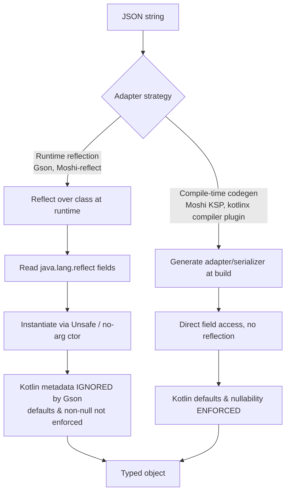

# JSON Parsing — Gson / Moshi / kotlinx.serialization

JSON is the lingua franca of Android networking. The library you pick decides three things a senior cares about: **correctness with Kotlin's type system** (null-safety, default values), **runtime cost** (reflection vs generated code), and **build/binary cost** (KAPT/KSP, R8 keep-rules, APK size). This page is opinionated: **prefer `kotlinx.serialization` for new Kotlin/KMP code, Moshi-codegen when you can't, and treat Gson as legacy.**

## The core mechanism: reflection vs codegen

Every JSON library must map a JSON document onto typed objects. There are two strategies, and the entire comparison below flows from this one axis.

- **Runtime reflection** (Gson, Moshi-reflect): at runtime, walk the class with `java.lang.reflect`, read/instantiate fields. Zero build cost, but slow first-use, opaque to R8 (needs keep-rules), and **unaware of Kotlin metadata** unless the library explicitly reads it.
- **Compile-time codegen** (Moshi-codegen via KSP, `kotlinx.serialization` via compiler plugin): a generated adapter/serializer is emitted at build time. Costs build time, but is fast, R8-friendly (the generated code references fields directly, so nothing gets stripped), and **fully Kotlin-aware** because it runs after the Kotlin frontend and sees defaults + nullability.



The seam at node **F** — "Kotlin metadata ignored" — is where Gson quietly corrupts your app. It's the single most important thing on this page.

---

## Gson

Google's veteran library. Reflection-only, Java-era design, no Kotlin awareness. Still everywhere because it's transitive in old code.

### Basic usage

```kotlin
data class User(
    @SerializedName("user_id") val id: Long,
    val name: String,
    val email: String?
)

val gson = Gson()
val user: User = gson.fromJson(jsonString, User::class.java)
val back: String = gson.toJson(user)
```

- `@SerializedName("user_id")` maps a JSON key to a differently-named field. Use `alternate = ["uid"]` to accept multiple keys.
- For generic types, erasure forces you to use `TypeToken`:

```kotlin
val type = object : TypeToken<List<User>>() {}.type
val users: List<User> = gson.fromJson(jsonString, type)
```

### Custom (de)serialization

Gson gives you two extension points. `TypeAdapter` is the streaming, allocation-free one (preferred); `JsonSerializer`/`JsonDeserializer` build an intermediate `JsonElement` tree (simpler, slower).

```kotlin
class InstantAdapter : TypeAdapter<Instant>() {
    override fun write(out: JsonWriter, value: Instant?) {
        if (value == null) out.nullValue() else out.value(value.toEpochMilli())
    }
    override fun read(reader: JsonReader): Instant? {
        if (reader.peek() == JsonToken.NULL) { reader.nextNull(); return null }
        return Instant.ofEpochMilli(reader.nextLong())
    }
}

val gson = GsonBuilder()
    .registerTypeAdapter(Instant::class.java, InstantAdapter())
    .create()
```

### Internals

Gson resolves an adapter per type, caches it, and for user classes falls back to `ReflectiveTypeAdapterFactory`. It instantiates objects via `UnsafeAllocator` (`sun.misc.Unsafe`) — **bypassing constructors entirely**. That is exactly why it can't honor Kotlin.

!!! warning "The Gson–Kotlin null trap (interview favorite)"
    Because Gson instantiates via `Unsafe` and never runs the Kotlin constructor, it **ignores both default values and non-null types**. Given `data class Config(val timeoutMs: Int = 30_000, val name: String)`:

    - If `timeoutMs` is **absent** in JSON, Gson leaves it at the JVM zero-value `0` — your `= 30_000` default is silently discarded.
    - If `name` is **absent or `null`** in JSON, Gson happily writes `null` into a **non-null `String`** field. The object is now in a state the Kotlin compiler proved impossible. You get a `NullPointerException` later, far from the parse site, on `name.length` — with no stack trace pointing at the JSON.

    There is no configuration flag that fixes this. It is a design consequence of reflection + `Unsafe`. This alone disqualifies Gson for new Kotlin code.

Other Gson footguns: lenient mode is on for some entry points, it silently coerces types, and it needs `@Keep` / keep-rules under R8 or field names get obfuscated and matching breaks.

---

## Moshi

Square's successor to Gson. Same mental model and API shape, but **Kotlin-aware** and offers codegen. The safer default when you're not on kotlinx.

### Two backends

| Backend | How | Kotlin-safe | Cost |
|---|---|---|---|
| `KotlinJsonAdapterFactory` (reflection) | `kotlin-reflect` at runtime | Yes | Pulls in ~3 MB `kotlin-reflect`, slower |
| **Codegen** `@JsonClass(generateAdapter = true)` | KSP generates adapter | Yes | Build-time only, no `kotlin-reflect`, R8-clean |

Prefer codegen. Reflection Moshi drags in `kotlin-reflect` and is only justified for dynamically-typed edge cases.

```kotlin
@JsonClass(generateAdapter = true)
data class User(
    @Json(name = "user_id") val id: Long,
    val name: String,
    val email: String? = null,
    val role: String = "member"   // default honored on missing key
)

val moshi = Moshi.Builder().build()          // codegen adapter found automatically
val adapter = moshi.adapter(User::class.java)
val user = adapter.fromJson(jsonString)
```

### Why Moshi is Kotlin-safe

The generated adapter (and the reflection factory) reads Kotlin metadata:

- Missing key on a **non-null** property with **no default** → throws `JsonDataException` at parse time (fail-fast, right where the bug is — the opposite of Gson's deferred NPE).
- Missing key on a property **with a default** → uses the default.
- Explicit `null` for a non-null property → `JsonDataException`.

`@Json(name = ...)` is Moshi's `@SerializedName`. Custom adapters use `@ToJson`/`@FromJson` methods or a full `JsonAdapter<T>`:

```kotlin
class InstantAdapter {
    @ToJson fun toJson(value: Instant): Long = value.toEpochMilli()
    @FromJson fun fromJson(millis: Long): Instant = Instant.ofEpochMilli(millis)
}

val moshi = Moshi.Builder()
    .add(InstantAdapter())
    .addLast(KotlinJsonAdapterFactory())   // only if NOT using codegen everywhere
    .build()
```

Moshi does not silently coerce types and is strict by default — another correctness win over Gson.

---

## kotlinx.serialization

The Kotlin-native, Google/JetBrains-blessed choice. A **compiler plugin** generates serializers at compile time — **no reflection at all**, works on **Kotlin Multiplatform** (JVM, Native, JS, Wasm), and models JSON as a first-class Kotlin concept.

### Basic usage

```kotlin
@Serializable
data class User(
    @SerialName("user_id") val id: Long,
    val name: String,
    val email: String? = null,
    val role: String = "member"
)

val json = Json { ignoreUnknownKeys = true }
val user: User = json.decodeFromString(jsonString)
val back: String = json.encodeToString(user)
```

- `@Serializable` triggers the plugin to synthesize a `KSerializer<User>` — resolved statically via `User.serializer()`, so no runtime type lookup.
- `@SerialName` is the `@SerializedName`/`@Json` equivalent.
- Defaults and nullability are enforced by construction because the generated code calls the real constructor.

### `Json { }` configuration — know these for interviews

```kotlin
val json = Json {
    ignoreUnknownKeys = true      // don't throw on server-added fields (almost always want this)
    coerceInputValues = true      // null / invalid enum on a value-with-default → use the default
    explicitNulls = false         // omit null properties when encoding; treat missing as null
    encodeDefaults = false        // don't emit properties that equal their default
    isLenient = false             // keep strict JSON (leave false in prod)
}
```

!!! tip "ignoreUnknownKeys is the one you'll forget"
    By default kotlinx **throws** `SerializationException` on any JSON key not present in your class. Servers add fields all the time. Set `ignoreUnknownKeys = true` on your shared `Json` instance or you'll ship a parser that crashes the day backend adds a field. `coerceInputValues = true` similarly saves you when an API sends `null` for a field you gave a non-null default.

### Sealed / polymorphic hierarchies

This is where kotlinx pulls clearly ahead. Sealed classes get a discriminator (`type` key by default) with zero custom adapter code:

```kotlin
@Serializable
sealed interface ApiResult {
    @Serializable @SerialName("success")
    data class Success(val data: String) : ApiResult
    @Serializable @SerialName("error")
    data class Error(val code: Int, val message: String) : ApiResult
}

// {"type":"error","code":404,"message":"not found"}  ->  ApiResult.Error
val result: ApiResult = json.decodeFromString(jsonString)
```

Gson can't do this at all without a custom `RuntimeTypeAdapterFactory`; Moshi needs `PolymorphicJsonAdapterFactory` wired by hand. kotlinx does it declaratively. Customize the key via `classDiscriminator = "kind"` in the `Json { }` block.

### Retrofit converter

```kotlin
// build.gradle.kts
// implementation("org.jetbrains.kotlinx:kotlinx-serialization-json:1.7.x")
// implementation("com.jakewharton.retrofit:retrofit2-kotlinx-serialization-converter:1.0.0")

private val json = Json { ignoreUnknownKeys = true; coerceInputValues = true }
private val contentType = "application/json".toMediaType()

val retrofit = Retrofit.Builder()
    .baseUrl("https://api.example.com/")
    .addConverterFactory(json.asConverterFactory(contentType))
    .build()

interface Api {
    @GET("users/{id}")
    suspend fun user(@Path("id") id: Long): User   // User is @Serializable
}
```

(Moshi's equivalent is `MoshiConverterFactory.create(moshi)`; Gson's is `GsonConverterFactory.create(gson)`.)

---

## Three-way comparison

| Dimension | Gson | Moshi (codegen) | kotlinx.serialization |
|---|---|---|---|
| Mechanism | Runtime reflection + `Unsafe` | KSP codegen (or reflection) | Compiler plugin, **no reflection** |
| Kotlin null-safety | ❌ writes null into non-null | ✅ throws `JsonDataException` | ✅ enforced by constructor |
| Kotlin default values | ❌ ignored | ✅ honored | ✅ honored |
| Unknown keys | Ignored silently | Ignored silently | Throws unless `ignoreUnknownKeys` |
| Sealed/polymorphic | Manual factory | `PolymorphicJsonAdapterFactory` | ✅ declarative `@SerialName` |
| Multiplatform (KMP) | ❌ JVM only | ❌ JVM/Android only | ✅ JVM/Native/JS/Wasm |
| Build cost | None | KSP task | Compiler plugin task |
| Runtime cost | Slow, reflection | Fast, direct | Fast, direct |
| R8 / keep-rules | ⚠️ needs keep-rules on models | ✅ clean (generated code) | ✅ clean (generated `.serializer()`) |
| APK weight | Small jar | `+kotlin-reflect` if reflection backend | Small runtime + generated code |
| Maintenance | Effectively frozen | Active | Active, first-party Kotlin |

### R8 note

- **Gson**: reflection means R8 can rename/strip model fields it thinks are unused → parsing breaks in release builds. You must add `@Keep` or `-keep` rules for every model, plus generic-signature rules. Easy to forget; classic "works in debug, NPE in release" bug.
- **Moshi codegen / kotlinx**: generated code references members directly, so R8 sees real usages. The libraries ship their own consumer ProGuard rules. Essentially nothing to do.

---

## Recommendation

!!! success "Opinionated default"
    1. **New Kotlin app or any KMP code → `kotlinx.serialization`.** No reflection, real Kotlin semantics, sealed-class polymorphism for free, first-party. Always set `ignoreUnknownKeys = true` and usually `coerceInputValues = true`.
    2. **Can't use the compiler plugin (mixed Java, weird build) → Moshi with `@JsonClass(generateAdapter = true)` (KSP).** Kotlin-safe, R8-clean, no `kotlin-reflect`.
    3. **Avoid Gson for new code.** Its `Unsafe`-based instantiation defeats Kotlin's null-safety and default values — a whole class of production NPEs that the type system was supposed to prevent. Keep it only where it's already load-bearing and migrate opportunistically.

---

## Interview Q&A

### 1. Why can Gson put `null` into a non-null Kotlin `String`?

**Answer:** Gson instantiates objects with `sun.misc.Unsafe` (`UnsafeAllocator`), which allocates the object **without running any constructor**. It then sets fields directly via reflection. Kotlin's non-null guarantees and default-value assignments live in the constructor, so Gson never sees them. A missing/`null` JSON key leaves a non-null field holding `null`, which the compiler proved impossible, producing a delayed `NullPointerException` far from the parse site.

**Follow-up — Can you configure Gson to fix it?** No. There's no flag; it's inherent to the reflection+`Unsafe` design. The fix is a custom `TypeAdapter` per type (defeats the purpose) or switching to Moshi/kotlinx, which run the real constructor.

### 2. Moshi reflection vs codegen — what's the difference and which do you ship?

**Answer:** Reflection uses `KotlinJsonAdapterFactory` + `kotlin-reflect` at runtime to read Kotlin metadata; codegen uses `@JsonClass(generateAdapter = true)` and KSP to emit an adapter at build time. Ship **codegen**: it drops the ~3 MB `kotlin-reflect` dependency, is faster (no runtime reflection), and is R8-friendly. Reflection is only for cases where the type isn't known at compile time.

**Follow-up — Was it ever KAPT?** Yes, older Moshi used KAPT (annotation processing, slower, runs after full Java compile). Modern Moshi uses **KSP**, which is Kotlin-native and much faster.

### 3. How does kotlinx.serialization avoid reflection entirely?

**Answer:** A **Kotlin compiler plugin** runs during compilation and synthesizes a `KSerializer` for every `@Serializable` type, plus a static `.serializer()` accessor. Serialization walks a generated `SerialDescriptor` and reads/writes fields via generated code — no `java.lang.reflect`, no `Unsafe`. Because it's a compiler plugin (not an annotation processor), it also works on non-JVM targets, enabling **Kotlin Multiplatform**.

**Follow-up — Why does that matter for R8 and KMP?** No reflection means R8 sees real field accesses (nothing stripped, no keep-rules), and it means the same serialization code compiles to Native/JS/Wasm where reflection isn't available.

### 4. Your app crashes with `SerializationException: Unexpected JSON key` after a backend deploy. Cause and fix?

**Answer:** kotlinx.serialization is **strict by default** and throws on any JSON key absent from your data class. The backend added a field. Fix by configuring the shared `Json` instance with `ignoreUnknownKeys = true`. This should be set from day one. Consider `coerceInputValues = true` too, so a `null` or invalid enum arriving for a field-with-default falls back to the default instead of throwing.

**Follow-up — Would Gson or Moshi have crashed?** No — both silently ignore unknown keys. That's more forgiving but also hides schema drift. kotlinx's strictness is a deliberate default that you relax explicitly.

### 5. How do you deserialize a polymorphic response (a `type` discriminator selecting one of several shapes) in each library?

**Answer:**

- **kotlinx**: make it a `@Serializable sealed interface`/`sealed class` with each subtype annotated `@SerialName("...")`. The library reads the `type` key (configurable via `classDiscriminator`) and picks the subtype — zero custom code.
- **Moshi**: register a `PolymorphicJsonAdapterFactory.of(Base::class.java, "type").withSubtype(...)` for each subtype.
- **Gson**: no built-in support; you write a `JsonDeserializer` that inspects the discriminator, or use the community `RuntimeTypeAdapterFactory`.

**Follow-up — What if there's no discriminator field, just structural differences?** kotlinx needs a custom `JsonContentPolymorphicSerializer` that chooses the deserializer by inspecting which keys are present in the `JsonElement`; Moshi/Gson need equivalent hand-written adapters.
