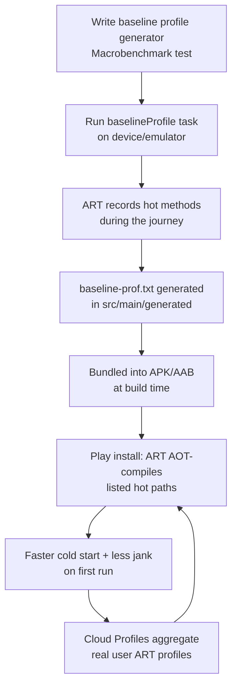

# Performance Optimization

Performance is not a feature you bolt on at the end — it is a discipline. At the senior
level, the interviewer is not testing whether you know that "the main thread is
important." They are testing whether you can **measure** a regression, reason about
**where** the cost lives (startup, layout, memory, CPU, network, battery, rendering,
binary size), pick the **right tool** for that layer, and defend a fix with numbers.

!!! abstract "The one-sentence model"
    Every performance win comes from the same loop: **measure → find the hot path →
    change one thing → measure again**. Everything below is just knowing which
    instrument to reach for at each layer of the stack.

!!! danger "Measure before optimizing"
    The single most important habit — and the answer that separates seniors from
    mid-levels. Do **not** guess. Reach for a profiler or a benchmark, capture a
    baseline, change exactly one thing, and re-measure on a **release build** on a
    **real, representative device** (a low-end phone, not your flagship). Intuition
    about "what is slow" is wrong often enough that acting on it wastes days and
    frequently makes things worse. A/B against a number or it did not happen.

---

## App startup

Startup is the first impression and the metric Play Console surfaces most aggressively
(the **Android vitals** "excessive cold startup" bad-behavior threshold is **5s** cold,
**1.5s** warm, **0.5s** hot). There are three kinds, and conflating them is a classic
interview trip-up.

| Type | What already exists | Work the system does | Typical cost | Trigger example |
|------|--------------------|--------------------|--------------|-----------------|
| **Cold** | Nothing — process not alive | Fork zygote, create `Application`, run content providers, create + draw first Activity | Slowest (100s of ms → seconds) | First launch after boot / after being killed |
| **Warm** | Process alive, Activity destroyed | Recreate Activity from saved state, re-inflate/re-draw | Medium | User pressed Back, relaunches shortly after |
| **Hot** | Process + Activity alive | Bring existing Activity to foreground | Fastest (~tens of ms) | App resumed from Recents, nothing evicted |

!!! note "What the clock actually measures"
    - **TTID — Time To Initial Display**: first frame drawn. Reported automatically by the
      framework in logcat as `Displayed com.your.app/.MainActivity: +Nms`.
    - **TTFD — Time To Full Display**: the app is *usable*, not just painted. You must
      declare this yourself by calling `reportFullyDrawn()` once your real content
      (e.g. the list after the network/DB load) is on screen. Without it, tools assume
      TTID == TTFD and under-report the true perceived latency.

```kotlin
class FeedActivity : ComponentActivity() {
    override fun onCreate(savedInstanceState: Bundle?) {
        super.onCreate(savedInstanceState)
        setContent { FeedScreen(viewModel) }
    }

    // Call once real content is on screen (not placeholders/spinners).
    private fun onFeedRendered() {
        // Signals TTFD to the framework, Macrobenchmark, and Play vitals.
        reportFullyDrawn()
    }
}
```

### Measuring startup with Macrobenchmark

`StartupTimingMetric` from the **Macrobenchmark** library is the ground-truth measurement.
It launches your *release-signed* app in a loop, kills it between iterations to force a
true cold start, and reports `timeToInitialDisplayMs` and `timeToFullDisplayMs` with
median/min/max across runs.

```kotlin
@RunWith(AndroidJUnit4::class)
class StartupBenchmark {
    @get:Rule val rule = MacrobenchmarkRule()

    @Test
    fun coldStartup() = rule.measureRepeated(
        packageName = "com.appfactory.game.blockpuzzle",
        metrics = listOf(StartupTimingMetric()),
        iterations = 10,
        startupMode = StartupMode.COLD,          // also WARM / HOT
        compilationMode = CompilationMode.DEFAULT // or Partial(baselineProfile)
    ) {
        pressHome()
        startActivityAndWait()
        // Optionally wait for a testTag / content-desc that marks TTFD.
    }
}
```

!!! tip "Macro vs micro benchmark"
    - **Macrobenchmark** measures a *whole user journey* on a full app process — startup,
      scroll jank, a screen transition — from a **separate test process**. Use it for
      "how long does the app take to start / how janky is this list." It needs a release
      or profileable build.
    - **Microbenchmark** (`androidx.benchmark`) measures a *tight hot loop of code* — a
      JSON parse, a sort, a hashing routine — in-process, warming up the JIT and
      discarding outliers. Use it for algorithm-level questions.
    - Rule of thumb: **Macro = user-perceived time, Micro = code-level nanoseconds.**
      Neither replaces the Profiler for *finding* the hot path; benchmarks *guard* it.

### App Startup library (initializer ordering)

Every extra `ContentProvider` your dependencies auto-declare (WorkManager, analytics,
etc.) runs on the main thread *before* `Application.onCreate()` — they steal cold-start
time invisibly. The **`androidx.startup`** App Startup library collapses them into a
**single** merged `InitializationProvider` with an explicit dependency graph, so you
control order and can lazily defer non-critical work.

```kotlin
class LoggerInitializer : Initializer<Logger> {
    override fun create(context: Context): Logger = Logger.install(context)
    override fun dependencies() = emptyList<Class<out Initializer<*>>>()
}

class AnalyticsInitializer : Initializer<Analytics> {
    override fun create(context: Context) = Analytics.init(context)
    // Guarantees Logger is ready first.
    override fun dependencies() = listOf(LoggerInitializer::class.java)
}
```

```xml
<provider
    android:name="androidx.startup.InitializationProvider"
    android:authorities="${applicationId}.androidx-startup"
    android:exported="false"
    tools:node="merge">
    <meta-data android:name="com.example.AnalyticsInitializer"
        android:value="androidx.startup" />
</provider>
```

### Baseline Profiles + Cloud Profiles

This is the highest-leverage, lowest-risk startup win shipping today — expect the
interviewer to probe it.

**The problem.** A fresh install runs your app in the interpreter / JIT. Hot code only
gets compiled to native (AOT) *after* ART observes it running — so the first several
launches and first scrolls are slow and janky.

**Baseline Profiles** ship a text list of hot methods/classes (`baseline-prof.txt`)
*inside the APK/AAB*. At **install time**, ART ahead-of-time-compiles exactly those hot
paths. The result: **20–40% faster cold start** and dramatically fewer dropped frames on
the very first run, with **zero runtime code changes**.

**Cloud Profiles** are the complementary Play-side mechanism: Google **aggregates the
real-world ART profiles** of your actual users and serves that merged profile to new
installs. Baseline Profiles you author cover launch + critical journeys from day one;
Cloud Profiles refine coverage over time from field usage. They stack.



You generate the profile with the **`androidx.baselineprofile` Gradle plugin** driving a
Macrobenchmark test that exercises the journeys you care about (launch, then scroll the
main list):

```kotlin
@RunWith(AndroidJUnit4::class)
class BaselineProfileGenerator {
    @get:Rule val rule = BaselineProfileRule()

    @Test
    fun generate() = rule.collect(
        packageName = "com.appfactory.game.blockpuzzle",
        includeInStartupProfile = true // also emit a startup-only profile
    ) {
        pressHome()
        startActivityAndWait()          // capture launch hot path
        // Exercise the critical journeys you want pre-compiled:
        device.findObject(By.res("play_button")).click()
        device.wait(Until.hasObject(By.res("game_board")), 5_000)
        repeat(3) { device.swipe(/* scroll the board/list */) }
    }
}
```

!!! warning "Profiles only help release builds"
    Baseline Profiles are applied to **AOT compilation**, which only happens for
    non-debuggable builds. Always *measure* their impact with
    `CompilationMode.Partial(BaselineProfileMode.Require)` vs `CompilationMode.None` in a
    Macrobenchmark — never assume the win, quantify it.

---

## Layout performance

Deep, redundant view hierarchies cost double: each nesting level multiplies the
measure/layout passes (nested weighted `LinearLayout`s can trigger **double measurement**),
and every overlapping opaque background repaints pixels that are immediately covered
(**overdraw**).

- **Flatten the hierarchy.** Prefer `ConstraintLayout` over nested
  `LinearLayout`/`RelativeLayout`; use `<merge>` to drop redundant wrapper containers and
  `<ViewStub>` to defer rarely-shown subtrees. In Compose, avoid unnecessary nested layout
  composables and prefer a single `Layout`/constraint where it collapses passes.
- **Layout Inspector** (Android Studio) renders the live 3D-exploded view tree so you can
  spot needless depth and inspect each node's attributes at runtime; the Compose layout
  inspector shows recomposition counts per node.
- **Overdraw.** Enable *Developer Options → Debug GPU overdraw*; aim for mostly blue
  (1x), eliminate red (4x+). Kill overdraw by removing window/theme backgrounds behind
  full-screen content, flattening stacked opaque layers, and using `clipRect`.

See **[App Rendering](28-rendering.md)** for the full measure → layout → draw → composite
pipeline and how a dropped frame actually happens.

---

## Memory

Memory pressure causes GC pauses (jank) and, at the limit, `OutOfMemoryError` and
low-memory-killer eviction (slower cold starts because your process is gone).

- **Android Studio Memory Profiler** — live allocation graph; watch the sawtooth. A
  staircase that never drops after GC is a **leak**.
- **Heap dumps** (`.hprof`) — capture, then inspect **retained** size and the **dominator
  tree** to find *who* is holding the object. Classic culprits: an `Activity`/`Context`
  referenced by a static, a long-lived listener, or an inner-class handler.
- **Bitmaps** are almost always the largest single consumers: a 4000×3000 photo decoded
  at `ARGB_8888` is ~**48 MB** regardless of the JPEG's on-disk size. Decode at the
  **display resolution** (`inSampleSize` / Coil's automatic downsampling), reuse pools,
  and never hold full-res bitmaps in a list.
- **LeakCanary** in debug builds turns leaked-`Activity` detection into an automatic
  notification with the full reference chain — cheap insurance.

Full treatment — leak patterns, `WeakReference`, `onTrimMemory`, the LMK — is in
**[Memory Management](27-memory.md)**.

---

## CPU profiling

When work is slow but not obviously I/O, profile the CPU to see *where the time goes*.

- **Sampled (Java/Kotlin) trace** — the profiler snapshots the call stack periodically.
  Low overhead, safe on release-ish builds, but can miss very short methods. Use it first
  to find the general hot area.
- **Method (instrumented) trace** — records *every* method entry/exit. Exact call counts
  and precise timing, but heavy overhead that distorts absolute numbers — use it to
  compare *relative* costs, not wall-clock truth.
- **System Tracing — Perfetto / `systrace`** — the senior default for jank and startup.
  Captures a whole-system timeline (your threads, RenderThread, SurfaceFlinger, binder
  calls, CPU frequency, scheduling). Add your own spans with `Trace.beginSection()` /
  `androidx.tracing`, capture with `perfetto`/`Macrobenchmark`, and read the trace in the
  Perfetto UI to see exactly which frame missed VSYNC and why.

```kotlin
androidx.tracing.trace("Feed.diffAndBind") {
    val result = expensiveDiff(old, new)   // shows up as a named span in Perfetto
    bind(result)
}
```

---

## Network

The radio is expensive (it stays in a high-power state for seconds after a transfer) and
data is slow on real networks. Optimize for **fewer, smaller, cacheable** requests.

- **Batch & defer.** Coalesce chatty calls; defer non-urgent syncs to `WorkManager` so
  they piggyback on other radio wake-ups instead of powering the radio up alone.
- **Cache.** Honor HTTP caching (`Cache-Control`, `ETag`/`If-None-Match`) with an OkHttp
  `Cache`; a `304 Not Modified` is nearly free. Cache at the repository layer (Room) for
  offline and instant re-display.
- **Compress.** Enable gzip/Brotli (OkHttp requests gzip automatically); prefer compact
  payloads (Protobuf, or trimmed JSON — omit nulls, short keys).
- **Image sizing.** Never download a 3000px hero for a 120px thumbnail. Request
  server-side-resized variants (`?w=240`) or a thumbnail CDN, and let Coil downsample to
  the `ImageView`/`Composable` bounds. This is usually the biggest single data win.

See **[Advanced Networking](11-networking-advanced.md)** and **[Coil](31-coil.md)**.

---

## Battery

Battery is measured indirectly — you cannot see mAh, so you look at what *drains* it:
wakelocks, radio use, wakeups, and GPS.

- **Battery Historian** — visualizes a `bugreport` (`adb bugreport`) as a timeline of
  wakelocks, jobs, alarms, radio state, and screen — the tool for "what is draining the
  battery in the background."
- **WorkManager batching & constraints.** Let the system pick the moment: set
  `Constraints` (`requiresCharging`, `NetworkType.UNMETERED`), use periodic work with
  flex windows, and let Doze/App Standby batch your jobs with everyone else's rather than
  waking the device on your own schedule.
- **Wakelocks** — the classic battery bug. A `PARTIAL_WAKE_LOCK` you forget to release
  keeps the CPU on indefinitely. Prefer `WorkManager`/`JobScheduler` (which manage
  wakelocks for you); if you must hold one, always `acquire(timeout)` and release in a
  `finally`.
- **`JobScheduler`/foreground-service** discipline, exact alarms only when truly
  user-visible, and minimizing background location.

---

## ANR — Application Not Responding

An ANR is the system deciding your app is frozen. Seniors must know the exact thresholds
and the fact that **they are all about the main thread being blocked**.

| Trigger | Deadline |
|---------|----------|
| Input event (touch/key) not handled | **5 seconds** |
| `BroadcastReceiver.onReceive()` runs too long (foreground) | **10 seconds** (60s background) |
| `Service` lifecycle (`onCreate`/`onStartCommand`) not returning | ~**20 seconds** |
| `ContentProvider` publish timeout | **10 seconds** |

**Root causes**, in order of frequency: main-thread **disk/network I/O**, a
`synchronized` lock contended by a background thread, a slow `BroadcastReceiver`, a
binder call to a stuck system service, and heavy work in `onDraw`/`onBind`.

**Diagnosis.** Every ANR drops a trace at `/data/anr/traces.txt` (and Play Console
*Android vitals → ANR rate* aggregates them with stack traces). Read the **main thread's
stack** at the moment it was sampled — it points straight at what was blocking.

**Prevention — StrictMode.** Turn accidental main-thread I/O and leaks into loud,
immediate signals in debug builds so they never reach production:

```kotlin
class DebugApp : Application() {
    override fun onCreate() {
        super.onCreate()
        if (BuildConfig.DEBUG) {
            StrictMode.setThreadPolicy(
                StrictMode.ThreadPolicy.Builder()
                    .detectDiskReads()
                    .detectDiskWrites()
                    .detectNetwork()        // main-thread network = ANR waiting to happen
                    .detectCustomSlowCalls()
                    .penaltyLog()
                    .penaltyFlashScreen()   // visible red border on violation
                    .build()
            )
            StrictMode.setVmPolicy(
                StrictMode.VmPolicy.Builder()
                    .detectActivityLeaks()
                    .detectLeakedClosableObjects()   // unclosed Cursor/InputStream
                    .detectLeakedSqlLiteObjects()
                    .detectFileUriExposure()
                    .penaltyLog()
                    .build()
            )
        }
    }
}
```

!!! danger "Never ship penaltyDeath()"
    `penaltyDeath()` *crashes* on a violation — great for CI, catastrophic in production.
    Keep StrictMode behind `BuildConfig.DEBUG`; a StrictMode violation on a user's device
    is a self-inflicted ANR/crash.

---

## Rendering & jank

Jank is any frame that misses its VSYNC deadline (16.6 ms @ 60 Hz, 8.3 ms @ 120 Hz),
producing a visible stutter. Measure it, do not eyeball it.

- **`JankStats`** (Jetpack) — reports per-frame jank in *production*, attributing each
  janky frame to a *state* you set (`"scrolling"`, `"animating_dialog"`), so you know
  *which* interaction stutters in the field, not just in the lab.
- **`FrameMetrics`** — the lower-level per-frame timing API (`FrameMetricsAggregator` /
  `Window.addOnFrameMetricsAvailableListener`) exposing each stage's duration (input,
  animation, measure/layout, draw, GPU) so you can see *which stage* blew the budget.
- Fix by moving work off the main thread, cutting overdraw, avoiding allocation in
  `onDraw`/hot recomposition, and (in Compose) killing unnecessary recomposition with
  stable keys and `@Stable`/`@Immutable` types.

The pixel pipeline and the exact mechanics of a dropped frame live in
**[App Rendering](28-rendering.md)**.

---

## APK / AAB size

Install size is a conversion lever — larger downloads convert worse, especially on
emerging-market networks (and the >150 MB base-APK boundary once mattered hard). Smaller
also means faster install-time compilation.

| Lever | What it does | Typical impact |
|-------|--------------|----------------|
| **R8** (minify) | Shrinks (dead-code removal), optimizes, and **obfuscates** in one pass; replaced ProGuard | Large — removes unused code across your app + libs |
| **Resource shrinking** (`shrinkResources true`) | Strips resources no reachable code references | Medium — often frees drawables/layouts from libs |
| **App Bundle (AAB)** | Play generates per-device APKs; users download only their config | Large — the default distribution format |
| **Configuration splits / ABI splits** | One density, one language, one ABI per delivered APK | Large — no unused mdpi/x86/other-locale payload |
| **Dynamic Feature Modules** | On-demand / conditional delivery of features (`Play Feature Delivery`) | Removes rarely-used features from the base install |
| **Analyze APK** (Studio) | Shows exactly what is fat (dex method count, res, assets) | Diagnostic — measure before cutting |
| **Vector drawables, WebP, downsampled assets** | Replace multi-density PNGs; compress images | Medium |

!!! warning "R8, mapping.txt, and readable crashes"
    R8 obfuscation renames everything, so production stack traces become
    `a.b.c(Unknown Source)`. R8 emits **`mapping.txt`** per release build — you **must**
    upload it to Play Console (or Crashlytics) to **de-obfuscate** crashes. Losing a
    release's `mapping.txt` means permanently unreadable crash reports for that version.
    Keep `minifyEnabled` and `shrinkResources` **on** for release, and always keep the
    mapping file.

```kotlin
android {
    buildTypes {
        release {
            isMinifyEnabled = true      // R8
            isShrinkResources = true    // resource shrinking (requires minify)
            proguardFiles(
                getDefaultProguardFile("proguard-android-optimize.txt"),
                "proguard-rules.pro"
            )
        }
    }
    bundle {                            // AAB config splits
        language { enableSplit = true }
        density  { enableSplit = true }
        abi      { enableSplit = true }
    }
}
```

**Dynamic delivery** ties this together: the AAB lets Play serve a base APK plus only the
splits (density/ABI/language) and dynamic features a given device needs — the user never
downloads a foreign locale's strings or an unused CPU architecture's native libs.

---

## Putting it together — a triage checklist

!!! tip "The senior workflow for any 'app is slow' report"
    1. **Reproduce & scope.** Startup? Scroll? A specific screen? Background drain?
    2. **Pick the layer's instrument.** Startup → Macrobenchmark + Perfetto. Jank →
       JankStats/FrameMetrics + Perfetto. Memory → Profiler + heap dump. Battery →
       Battery Historian. Size → Analyze APK.
    3. **Capture a baseline number** on a low-end device, release build.
    4. **Change one thing.** Baseline Profile, flattened layout, batched request…
    5. **Re-measure** the same way. Keep the win, revert the rest.
    6. **Guard it** with a Macro/Microbenchmark in CI so it cannot silently regress.

---

## Interview Q&A

!!! question "1. Define cold, warm, and hot start. Why does the distinction matter?"
    **Cold** = the process does not exist; the system forks from zygote, builds the
    `Application`, runs content-provider initializers, then creates and draws the first
    Activity — the slowest path and the one Play vitals flags at >5s. **Warm** = the
    process is alive but the Activity was destroyed, so it is recreated from saved state.
    **Hot** = process and Activity both alive; the system just brings the Activity
    forward — tens of ms. It matters because optimizations target different phases: cold
    is about `Application.onCreate`, initializer ordering, and Baseline Profiles; warm is
    about cheap state restoration; hot is essentially free and you shouldn't over-invest.
    **Follow-up:** *Which do users hit most?* Warm/hot dominate day-to-day, but cold is
    the first-impression metric and the one Play penalizes, so it gets the attention.

!!! question "2. What are Baseline Profiles and how do they speed up startup?"
    A Baseline Profile is a list of hot classes/methods shipped inside the AAB. At
    **install time** ART ahead-of-time-compiles exactly those methods to native code, so
    the critical paths (launch, first scroll) skip the slow interpret/JIT warm-up — a
    typical **20–40% cold-start improvement** and far less first-run jank, with no code
    changes. You generate it with the `androidx.baselineprofile` Gradle plugin driving a
    Macrobenchmark that exercises the journeys, which produces `baseline-prof.txt`.
    **Follow-up:** *How do Cloud Profiles differ?* Cloud Profiles are Play aggregating
    real users' ART profiles and serving that merged profile to new installs — field-driven
    coverage that complements the profile you author; they stack.

!!! question "3. How do you actually measure startup, and why not just use logcat's 'Displayed'?"
    `Displayed …+Nms` in logcat gives a quick TTID read but only measures the first
    frame, is noisy across runs, and ignores TTFD. The rigorous approach is a
    **Macrobenchmark** with `StartupTimingMetric`, `StartupMode.COLD`, on a release/
    profileable build over ~10 iterations — it kills the process between runs and reports
    median TTID/TTFD. And you must call **`reportFullyDrawn()`** when real content lands so
    TTFD reflects *usable*, not just *painted*. **Follow-up:** *TTID vs TTFD?* TTID is the
    first frame (often a spinner/placeholder); TTFD is when the user can actually use the
    screen — TTFD is the honest perceived-latency number.

!!! question "4. Walk me through diagnosing an ANR."
    Know the deadlines: **5s** for an unhandled input event, **10s** for a foreground
    `BroadcastReceiver`, ~20s for a service. Every ANR writes a trace to
    `/data/anr/traces.txt` and Play vitals aggregates them — read the **main thread's
    stack** at the sampled moment; it points at the blocking call, almost always
    main-thread disk/network I/O or lock contention. Fix by moving that work to a
    coroutine/`Dispatchers.IO`. Prevent recurrence with **StrictMode** in debug builds
    (`detectDiskReads/Writes/Network` + `penaltyLog`), which surfaces accidental
    main-thread I/O immediately. **Follow-up:** *Would you ship `penaltyDeath()`?* No —
    it crashes on violation; keep it CI/debug-only or you create the very ANR/crash you
    were preventing.

!!! question "5. Macrobenchmark vs Microbenchmark — when do you use each?"
    **Macrobenchmark** measures a user journey (startup, scroll, transition) on the full
    app from a separate process — use it for "how fast does the app *feel*." It also
    generates Baseline Profiles. **Microbenchmark** measures a tight hot loop of code
    in-process with JIT warm-up and outlier rejection — use it for algorithm-level
    questions (parse, sort). Neither *finds* a hot path (that's the Profiler/Perfetto);
    they *lock in* and *guard against regression* on a path you already care about.
    **Follow-up:** *Why must Macrobenchmark run on a release build?* Because it measures
    real user-facing timing including AOT/R8 effects; a debuggable build has different
    compilation and is not representative.

!!! question "6. How would you cut an app's download size, and what's the risk with R8?"
    Turn on **R8** (`minifyEnabled`) for dead-code elimination + optimization +
    obfuscation, **`shrinkResources`** to strip unreferenced resources, ship an **AAB**
    with **language/density/ABI splits** so each device downloads only its config, move
    rarely-used features into **dynamic feature modules**, replace PNGs with vector
    drawables/WebP, and use **Analyze APK** to confirm where the fat actually is. The R8
    risk: obfuscation renames symbols, so production stack traces are unreadable unless
    you upload that build's **`mapping.txt`** to Play/Crashlytics to de-obfuscate — lose
    it and that version's crashes are permanently opaque. **Follow-up:** *Downside of
    dynamic features?* Added complexity (install-time availability, testing on-demand
    modules, `SplitCompat`), so reserve them for genuinely large, seldom-used features.

!!! question "7. Why might an app's startup time increase over time even if its code has not changed?"
    **Answer:** If the app binary is unchanged but performance degrades on user devices over time, look for these four runtime causes:
    
    1.  **AOT Profile Eviction / Compilation Decay:** When the app is updated, or when the system clears local profiles (e.g., after partition cache clears or system updates), the pre-compiled AOT machine code is discarded. Until the device runs background optimization (`dex2oat`) again (which requires the phone to be charging, idle, and connected to Wi-Fi), the app reverts to slow interpretation/JIT compile modes, causing a temporary cold-start slowdown.
    2.  **Database Scale & Fragmentation:** Over time, databases (Room/SQLite) accumulate rows. Queries that ran in 5 ms on a clean install might take 100 ms once tables scale to thousands of rows, especially if queries lack indexes, trigger table scans, or if the database suffers from write-ahead log (WAL) bloat.
    3.  **Shared Preferences / Data Store Bloat:** If the app stores large objects (like serializing large JSON configs) inside Shared Preferences or Datastore, these files must be parsed during startup. Because SharedPreferences loads its entire XML file into memory synchronously on initialization, file growth directly increases startup latency.
    4.  **Background Process Contention:** Over time, as a user installs more applications, the device's resident background processes increase. This places overall memory pressure on the Low Memory Killer (LMK) and triggers frequent Garbage Collection (GC) pauses during launch, slowing CPU scheduling.
    
    **Follow-up:** *How do you mitigate database and preference bloat on startup?* — Never access databases or parse large files on the main thread during launch. Keep `SharedPreferences` small, use `DataStore` for asynchronous reads, index Room query keys, and periodically run the SQLite `VACUUM` command to defragment the disk.

