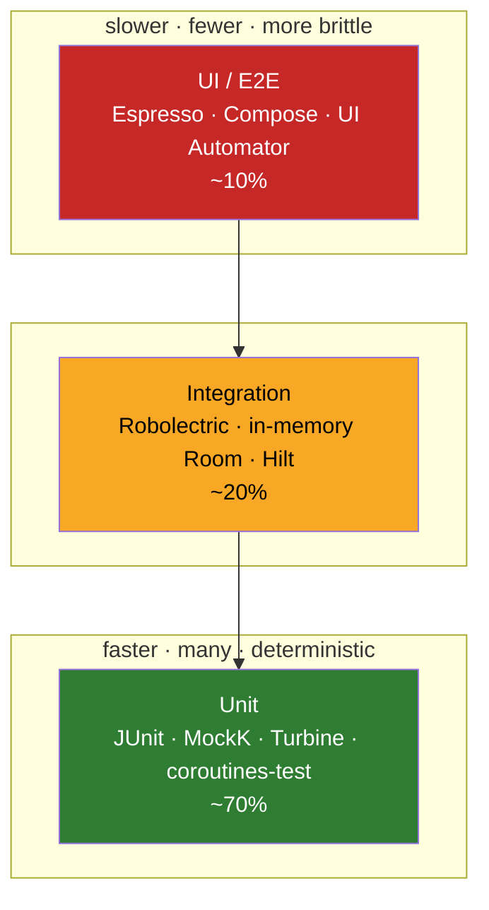

# Testing — Complete

Testing is not a phase that happens after the code is written; at senior level it is a *design constraint* that shapes the architecture. If a class is hard to test, that is a design smell, not a testing problem. This deep-dive walks the full Android testing stack — from a single JUnit assertion up to cross-app UI Automator flows — with a bias toward the opinions that separate a mid-level engineer from a senior one.

## The test pyramid

The pyramid is a heuristic about *proportion and cost*, not a law. It says: most of your tests should be fast, isolated, and numerous (unit); fewer should wire real collaborators together (integration); and only a thin slice should drive the whole app through the UI (E2E). The reason is economic — cost per test and flakiness both climb as you go up, while the number of tests you can afford to run on every commit drops.



!!! quote "Senior POV in one breath"
    Test **behavior, not implementation**. Prefer **fakes over mocks** for anything you own. Push logic *down* into pure, dispatcher-injected classes so the vast majority of your suite runs on the JVM in milliseconds. The instrumentation tests at the top exist to answer one question — "is it actually wired together on a real device?" — not to re-test business logic you already covered below.

| Layer | Runs on | Speed | What it proves | Tooling |
|---|---|---|---|---|
| Unit | JVM (`test/`) | ms | A unit's logic is correct in isolation | JUnit, MockK, Turbine, `coroutines-test` |
| Integration | JVM or device | 10s–100s ms | Real collaborators cooperate (DAO+DB, ViewModel+repo) | Robolectric, in-memory Room, Hilt test graph |
| UI / E2E | Device / emulator (`androidTest/`) | seconds | The screen renders and responds to real input | Espresso, Compose test, UI Automator |

### Why "behavior, not implementation"

A test coupled to *how* a function works breaks every time you refactor, even when the output never changed — so it punishes exactly the activity (refactoring) you want to encourage. A behavior test asserts on observable outputs: return values, emitted states, persisted rows, rendered text. The tell-tale of an over-mocked test is a wall of `verify(exactly = 1) { ... }` calls describing the algorithm step by step. That test will pass forever and catch nothing.

## Unit tests (JUnit)

JUnit4 is still the Android default (the instrumentation runner and most rules assume it). JUnit5 (Jupiter) is nicer — nested tests, better parameterization, lifecycle via extensions — but needs the `android-junit5` Gradle plugin and doesn't run on-device. Use JUnit5 for pure JVM modules if the team is on board; stick to JUnit4 for anything touching `androidTest/`.

Structure every test **Arrange-Act-Assert** (AAA). One logical assertion per test; the test *name* is documentation.

```kotlin
class DiscountCalculatorTest {

    @Test
    fun `applies 10 percent discount above threshold`() {
        // Arrange
        val calculator = DiscountCalculator(threshold = 100.0, rate = 0.10)

        // Act
        val total = calculator.apply(subtotal = 150.0)

        // Assert
        assertThat(total).isEqualTo(135.0)   // Truth / AssertJ reads better than assertEquals
    }
}
```

Parameterized tests kill duplication for table-driven logic:

```kotlin
@RunWith(Parameterized::class)
class GradeTest(private val score: Int, private val expected: Char) {

    @Test fun `maps score to grade`() {
        assertThat(Grader.of(score)).isEqualTo(expected)
    }

    companion object {
        @JvmStatic
        @Parameterized.Parameters(name = "{0} -> {1}")
        fun data() = listOf(
            arrayOf(95, 'A'), arrayOf(85, 'B'),
            arrayOf(70, 'C'), arrayOf(40, 'F'),
        )
    }
}
```

!!! tip "Assertion library"
    Prefer **Truth** (`assertThat(x).isEqualTo(y)`) or AssertJ over raw `assertEquals`. Failure messages are dramatically more readable, and the fluent API discourages asserting on stringified objects.

## Mocking: MockK, and the fake-vs-mock argument

**MockK** is the de-facto standard for Kotlin. It understands coroutines, `final` classes (Kotlin classes are final by default — Mockito needs `mock-maker-inline` to cope), objects, extension functions, and relaxed mocks.

```kotlin
val repo = mockk<UserRepository>()

// Stub a suspend function
coEvery { repo.fetch(id = 42) } returns User(42, "Ada")

// Stub a regular function; match any argument
every { repo.isCached(any()) } returns true

// Throw
coEvery { repo.fetch(id = -1) } throws IllegalArgumentException()

val vm = ProfileViewModel(repo)
vm.load(42)

// Verify interaction happened (use sparingly — this is implementation testing)
coVerify(exactly = 1) { repo.fetch(id = 42) }
```

Key MockK tools:

| Feature | Use |
|---|---|
| `every { } returns` | Stub a normal function |
| `coEvery { } returns` | Stub a `suspend` function |
| `verify { }` / `coVerify { }` | Assert a (suspend) call happened |
| `relaxed = true` | Auto-return defaults for every method — avoids stubbing noise |
| `slot<T>()` + `capture(slot)` | Capture an argument to assert on it later |
| `spyk(realObj)` | Partial mock — real behavior except where stubbed |
| `verify(exactly = n)` / `verifyOrder` | Count / order constraints |

```kotlin
// Argument capture — inspect what the code passed
val slot = slot<AnalyticsEvent>()
every { analytics.log(capture(slot)) } just Runs

viewModel.onPurchase()

assertThat(slot.captured.name).isEqualTo("purchase_completed")
```

Mockito(-Kotlin) still appears in legacy codebases; the concepts map 1:1 (`whenever(x).thenReturn(y)`, `verify(x).method()`), but on a Kotlin project MockK is the right default.

### Mock vs Fake vs Stub

| Type | What it is | Behavior | Verifies interactions? | Senior default |
|---|---|---|---|---|
| **Stub** | Returns canned answers | None | No | For trivial value returns |
| **Mock** | Programmable object + recorded expectations | Configured per-call | **Yes** (that's its point) | Only at true boundaries you don't own |
| **Fake** | A *real*, lightweight working implementation | Full, in-memory | No | **Preferred** for anything you own |

!!! success "Argue for fakes"
    A **fake** — e.g. an `InMemoryUserRepository` backed by a `MutableMap` — is a real implementation you can reuse across dozens of tests. It tests *behavior* (put a user, get it back) instead of interactions, so it survives refactors, produces readable tests, and doubles as documentation of the interface contract. Mocks couple the test to the call sequence; every refactor rewrites the expectations. **Reach for a mock only when you can't reasonably build a fake** — a third-party SDK, a network client, a system service — and even then, prefer stubbing return values over verifying call order.

```kotlin
class FakeUserRepository : UserRepository {
    private val users = mutableMapOf<Int, User>()
    var failNext = false          // knob to simulate errors deterministically

    override suspend fun fetch(id: Int): User {
        if (failNext) { failNext = false; throw IOException("boom") }
        return users[id] ?: throw NoSuchElementException()
    }
    override suspend fun save(user: User) { users[user.id] = user }
    fun seed(vararg u: User) = u.forEach { users[it.id] = it }
}
```

## Android unit tests

These still run on the JVM but exercise Android-flavored classes — ViewModels, repositories, use cases, DAOs — using fakes and test dispatchers. This is where 70% of value lives.

### ViewModel with fake repo + TestDispatcher

The canonical pattern: inject a dispatcher (never hardcode `Dispatchers.IO`), swap `Dispatchers.Main` with a rule, drive with a fake, assert on emitted state via Turbine.

```kotlin
class MainDispatcherRule(
    private val dispatcher: TestDispatcher = StandardTestDispatcher(),
) : TestWatcher() {
    override fun starting(d: Description) = Dispatchers.setMain(dispatcher)
    override fun finished(d: Description) = Dispatchers.resetMain()
}
```

```kotlin
class ProfileViewModelTest {

    @get:Rule val mainRule = MainDispatcherRule()

    private val repo = FakeUserRepository().apply { seed(User(42, "Ada")) }
    private lateinit var vm: ProfileViewModel

    @Before fun setUp() { vm = ProfileViewModel(repo) }

    @Test
    fun `emits Loading then Success`() = runTest {
        vm.uiState.test {                          // Turbine
            assertThat(awaitItem()).isEqualTo(UiState.Idle)

            vm.load(42)
            assertThat(awaitItem()).isEqualTo(UiState.Loading)
            assertThat(awaitItem()).isEqualTo(UiState.Success(User(42, "Ada")))

            cancelAndIgnoreRemainingEvents()
        }
    }

    @Test
    fun `emits Error when repo fails`() = runTest {
        repo.failNext = true
        vm.uiState.test {
            skipItems(1)                           // Idle
            vm.load(42)
            assertThat(awaitItem()).isEqualTo(UiState.Loading)
            assertThat(awaitItem()).isInstanceOf(UiState.Error::class.java)
            cancelAndIgnoreRemainingEvents()
        }
    }
}
```

### Use case / repository tests

Use cases are pure functions of their dependencies — trivial to test with fakes. Repositories are the natural home for an *integration* test with a real in-memory Room DB (below) plus a fake network source.

### DAO test with in-memory Room + runTest

Room DAO tests give enormous confidence for near-zero cost. Use `inMemoryDatabaseBuilder` so nothing touches disk, `allowMainThreadQueries()` for test convenience, and `runTest` for suspend/Flow DAOs. This one can run under Robolectric on the JVM or as an instrumentation test.

```kotlin
@RunWith(AndroidJUnit4::class)           // Robolectric or on-device
class NoteDaoTest {

    private lateinit var db: AppDatabase
    private lateinit var dao: NoteDao

    @Before fun setUp() {
        val ctx = ApplicationProvider.getApplicationContext<Context>()
        db = Room.inMemoryDatabaseBuilder(ctx, AppDatabase::class.java)
            .allowMainThreadQueries()
            .build()
        dao = db.noteDao()
    }

    @After fun tearDown() = db.close()

    @Test
    fun `insert then observe returns the row`() = runTest {
        dao.insert(NoteEntity(id = 1, text = "hello"))

        dao.observeAll().test {                    // DAO returns Flow<List<..>>
            assertThat(awaitItem()).containsExactly(NoteEntity(1, "hello"))
            cancelAndIgnoreRemainingEvents()
        }
    }

    @Test
    fun `delete removes the row`() = runTest {
        dao.insert(NoteEntity(1, "hi"))
        dao.delete(1)
        assertThat(dao.getAll()).isEmpty()
    }
}
```

## Coroutine testing

The `kotlinx-coroutines-test` library gives you a virtual clock. `runTest` skips delays automatically and fails the test if a child coroutine is still running at the end (surfacing leaks).

```kotlin
@Test fun example() = runTest {
    // delay(10_000) here returns instantly — virtual time
}
```

| Dispatcher | Starts eagerly? | When to use |
|---|---|---|
| **StandardTestDispatcher** | No — coroutines queue until you advance | Default. Gives explicit control over ordering; assert intermediate states |
| **UnconfinedTestDispatcher** | Yes — runs eagerly to first suspension | When you don't care about interleaving and want launched work to run immediately |

Time control inside `runTest` (via the `TestScope`):

- `advanceUntilIdle()` — run everything queued until nothing is left.
- `advanceTimeBy(ms)` — advance the virtual clock by a fixed amount (for `delay`-based logic, debounce, timeouts).
- `runCurrent()` — execute tasks scheduled at the current virtual time only.

```kotlin
@Test
fun `debounce emits once after quiet period`() = runTest {
    val vm = SearchViewModel(dispatcher = StandardTestDispatcher(testScheduler))
    vm.onQuery("a"); vm.onQuery("ab"); vm.onQuery("abc")

    advanceTimeBy(299);  assertThat(vm.results.value).isEmpty()   // still within debounce
    advanceTimeBy(1);    runCurrent()
    assertThat(vm.results.value).isNotEmpty()                     // fired at 300ms
}
```

!!! warning "The one rule that prevents 90% of coroutine-test pain"
    **Inject the dispatcher; never hardcode `Dispatchers.IO`/`Default`.** Pass `testScheduler` to the class under test so its background work shares the same virtual clock as `runTest`. And always install `Dispatchers.setMain(...)` via `MainDispatcherRule` for anything using `viewModelScope` (which is bound to `Dispatchers.Main`). Forget the rule and you get `Module with the Main dispatcher had failed to initialize`.

## Flow testing with Turbine

Manually collecting a Flow in a test is a race-condition minefield. **Turbine** turns a Flow into a sequential, suspending queue you assert against — and it *fails the test if there are unconsumed events*, which catches accidental extra emissions.

```kotlin
flow.test {
    assertThat(awaitItem()).isEqualTo(first)   // suspends until an item arrives
    assertThat(awaitItem()).isEqualTo(second)
    awaitComplete()                            // asserts the flow finished
}
```

| API | Meaning |
|---|---|
| `awaitItem()` | Suspend until next emission; return it |
| `awaitComplete()` | Assert the flow completed normally |
| `awaitError()` | Assert (and return) a terminal exception |
| `skipItems(n)` | Discard `n` emissions |
| `expectNoEvents()` | Assert nothing was emitted (e.g. within a window) |
| `cancelAndIgnoreRemainingEvents()` | Stop collecting a hot/never-ending flow cleanly |

**StateFlow vs SharedFlow.** `StateFlow` is hot and always replays its current value, so the *first* `awaitItem()` is the initial state — account for it (or `skipItems(1)`). A `SharedFlow` with `replay = 0` emits nothing until you subscribe, so start collecting *before* triggering the action. For a `StateFlow` you often just assert `stateFlow.value` directly for a snapshot; use Turbine when you care about the *sequence* of states.

```kotlin
@Test fun `shared flow one-shot event`() = runTest {
    viewModel.navEvents.test {          // SharedFlow, replay = 0
        viewModel.onSaveClicked()       // trigger AFTER we start collecting
        assertThat(awaitItem()).isEqualTo(NavEvent.Back)
        cancelAndIgnoreRemainingEvents()
    }
}
```

## Instrumentation tests

These run in `androidTest/` on a real device or emulator, with a real `Context`.

- **`@RunWith(AndroidJUnit4::class)`** — the runner for all instrumentation (and Robolectric) tests.
- **`ApplicationProvider.getApplicationContext()`** — the modern way to get a `Context` (replaces the deprecated `InstrumentationRegistry.getTargetContext()`).
- **`ActivityScenario`** — launch, drive, and recreate an Activity with lifecycle control (replaces `ActivityTestRule`). `ActivityScenario.launch(MyActivity::class.java)`; `scenario.recreate()` tests config-change survival; `scenario.moveToState(Lifecycle.State.CREATED)`.
- **`FragmentScenario` / `launchFragmentInContainer`** — test a Fragment in isolation without its host Activity. Provide a themed container and even a test `NavController`.

```kotlin
@Test fun `activity survives recreation`() {
    ActivityScenario.launch(CounterActivity::class.java).use { scenario ->
        onView(withId(R.id.increment)).perform(click())
        scenario.recreate()                        // simulate rotation
        onView(withId(R.id.count)).check(matches(withText("1")))
    }
}

@Test fun `fragment renders`() {
    launchFragmentInContainer<ProfileFragment>(themeResId = R.style.AppTheme)
    onView(withText("Ada")).check(matches(isDisplayed()))
}
```

## Espresso (View-based UI)

Espresso's grammar is **find → act → assert**: `onView(matcher).perform(action).check(assertion)`. Its superpower is *automatic synchronization* — it waits for the main thread message queue and known `IdlingResource`s to be idle before each step, so you rarely need manual sleeps.

```kotlin
onView(withId(R.id.email))                         // ViewMatchers
    .perform(typeText("a@b.com"), closeSoftKeyboard())   // ViewActions
onView(withId(R.id.submit)).perform(click())
onView(withText("Welcome")).check(matches(isDisplayed()))  // ViewAssertions
```

The three vocabularies: **ViewMatchers** (`withId`, `withText`, `withHint`, `isDisplayed`, `hasFocus`), **ViewActions** (`click`, `typeText`, `scrollTo`, `swipeLeft`), **ViewAssertions** (`matches(...)`, `doesNotExist()`).

### IdlingResource for async work

Espresso only knows about the main queue. For your own background work (a custom thread pool, a network callback) it needs an **IdlingResource** — register one, and Espresso blocks until it reports idle. (With coroutines/RxJava, prefer an `IdlingResource` bridge or an idling dispatcher over polling.)

```kotlin
val idlingResource = CountingIdlingResource("network")
IdlingRegistry.getInstance().register(idlingResource)
// increment() before async work, decrement() in the callback
```

### RecyclerView and Intents

```kotlin
// RecyclerView: act on a specific item
onView(withId(R.id.list)).perform(
    RecyclerViewActions.actionOnItemAtPosition<VH>(5, click())
)

// Espresso-Intents: stub and verify outgoing intents
@get:Rule val intentsRule = IntentsRule()   // or Intents.init()/release()

intending(hasAction(Intent.ACTION_VIEW))
    .respondWith(ActivityResult(RESULT_OK, null))   // stub the response
onView(withId(R.id.openWeb)).perform(click())
intended(hasData(Uri.parse("https://example.com")))  // verify it fired
```

## Compose UI testing

Compose testing is semantics-driven: you assert against the *semantics tree*, not View hierarchies. `createComposeRule()` for a standalone composable, `createAndroidComposeRule<MyActivity>()` when you need a real Activity/Hilt.

```kotlin
class LoginScreenTest {
    @get:Rule val composeRule = createComposeRule()

    @Test fun `submit disabled until fields filled`() {
        composeRule.setContent { LoginScreen() }

        composeRule.onNodeWithText("Sign in").assertIsNotEnabled()

        composeRule.onNodeWithTag("email").performTextInput("a@b.com")
        composeRule.onNodeWithTag("password").performTextInput("secret")

        composeRule.onNodeWithText("Sign in")
            .assertIsEnabled()
            .performClick()

        composeRule.onNodeWithText("Welcome").assertIsDisplayed()
    }
}
```

Finders (`onNodeWithText`, `onNodeWithTag`, `onNodeWithContentDescription`, `onNode(hasRole(...))`), actions (`performClick`, `performTextInput`, `performScrollTo`, `performTouchInput`), assertions (`assertIsDisplayed`, `assertIsEnabled`, `assertTextEquals`).

!!! tip "testTag and idling"
    Add `Modifier.testTag("email")` to make nodes reliably findable without coupling to display text. The Compose rule **auto-synchronizes** with recomposition and `withFrameNanos`. For work Compose can't see (e.g. an infinite animation you paused, or an external async source), disable auto-sync with `composeRule.mainClock.autoAdvance = false` and step manually, or use `waitUntil { composeRule.onAllNodesWithTag("row").fetchSemanticsNodes().size == 3 }`.

```kotlin
composeRule.waitUntil(timeoutMillis = 5_000) {
    composeRule.onAllNodesWithTag("item").fetchSemanticsNodes().isNotEmpty()
}
```

## Hilt testing

Hilt supplies a *separate* test component so you can swap real modules for fakes.

1. Annotate with **`@HiltAndroidTest`** and add **`HiltAndroidRule`** *first* (order matters — it must run before the Compose/Activity rule).
2. Use a **custom test runner** that swaps in `HiltTestApplication`.
3. Replace production modules: **`@UninstallModules`** removes a module for the whole test; **`@TestInstallIn`** on a test module replaces one globally across the test source set (the modern, less boilerplate approach).

```kotlin
// build.gradle: testInstrumentationRunner = "com.example.HiltTestRunner"
class HiltTestRunner : AndroidJUnitRunner() {
    override fun newApplication(cl: ClassLoader?, name: String?, ctx: Context?) =
        super.newApplication(cl, HiltTestApplication::class.java.name, ctx)
}
```

```kotlin
// Globally replace the real network module with fakes for ALL tests
@Module
@TestInstallIn(
    components = [SingletonComponent::class],
    replaces = [RepositoryModule::class],
)
object FakeRepositoryModule {
    @Provides @Singleton
    fun provideUserRepo(): UserRepository = FakeUserRepository().apply {
        seed(User(42, "Ada"))
    }
}
```

```kotlin
@HiltAndroidTest
class ProfileFlowTest {

    @get:Rule(order = 0) val hiltRule = HiltAndroidRule(this)
    @get:Rule(order = 1) val composeRule = createAndroidComposeRule<MainActivity>()

    @Before fun inject() = hiltRule.inject()

    @Inject lateinit var repo: UserRepository        // the fake, injected by Hilt

    @Test fun `profile shows seeded user`() {
        composeRule.onNodeWithText("Ada").assertIsDisplayed()
    }
}
```

## Robolectric, UI Automator, coverage

**Robolectric** runs Android framework code on the **JVM** by shadowing the SDK — no emulator, so tests start in milliseconds and run in ordinary `test/` CI. Great for DAO tests, `Context`-needing units, and shallow UI. The trade-off: shadows are *approximations* of real Android, so a green Robolectric test is not a substitute for the handful of real-device instrumentation tests. Enable with `testOptions { unitTests.isIncludeAndroidResources = true }`.

**UI Automator** is the only tool that crosses app boundaries — driving the notification shade, system settings, the launcher, or a *second* app. Use it for true black-box E2E ("tap the notification, confirm it opens our deep link") where Espresso/Compose (single-app, needs your code) can't reach. It finds elements by `By.text(...)`, `By.res(...)`, `By.desc(...)` on a `UiDevice`.

**JaCoCo** produces coverage reports (line/branch), typically merging unit + instrumentation execution data.

!!! danger "Coverage-as-a-goal is a trap"
    Coverage is a *diagnostic*, not a target. Chasing "80% coverage" (Goodhart's Law: when a measure becomes a target, it ceases to be a good measure) breeds assertion-free tests that execute lines without checking anything, and tempts people to test trivial getters while the gnarly branching logic stays untested. Use coverage to *find blind spots* ("this whole error path is uncovered — why?"), not to grade the team. A 60% suite of sharp behavior tests beats a 95% suite of `verify` theater.

## Flaky-test discipline

A flaky test is worse than no test: it trains the team to hit "re-run" and ignore red, which eventually masks a real regression. Treat flakiness as a P1 bug.

- **Quarantine, then fix.** Move a flaky test to a tagged suite so it stops blocking the pipeline — but file a ticket; quarantine is not deletion.
- **Root-cause categories:** timing (`Thread.sleep` instead of idling/`waitUntil`), shared state between tests (a static, a real singleton, an uncleared DB), test-order dependence, real clock/network/randomness, and animations (disable via developer options or `@get:Rule DisableAnimationsRule` on device).
- **Determinism knobs:** inject the clock (`Clock`), inject randomness (seedable `Random`), inject dispatchers, use in-memory DBs, and reset singletons in `@After`.
- **Never** `Thread.sleep` in an Espresso/Compose test — use IdlingResource / `waitUntil`. Sleeping is both slow *and* flaky (too short → fails on slow CI; too long → wastes minutes).
- **CI signal:** track flake rate; if a test fails intermittently >1% of runs, it's flaky by definition. Some teams retry once and log; retries hide flakiness, so log loudly.

## Interview Q&A

!!! question "1. Why prefer a fake over a mock, and when is a mock still the right call?"
    A fake is a real, in-memory implementation of an interface (e.g. a repository backed by a `Map`). It tests **behavior** — you save and read back real data — so tests survive refactors, read cleanly, and one fake serves many tests. A mock records **interactions**, coupling the test to the call sequence; refactoring the implementation breaks tests even when behavior is unchanged. Use a mock only at a boundary you *can't* cheaply fake — a third-party SDK, an HTTP client, an Android system service — and even then prefer stubbing return values over verifying call order.
    **Follow-up — "How do you decide when to `verify`?"** Only when the *interaction itself is the behavior under test* — e.g. "an analytics event fires exactly once on purchase," or "we don't hit the network when the cache is warm." If you're verifying calls just to prove logic ran, assert on the output instead.

!!! question "2. Explain StandardTestDispatcher vs UnconfinedTestDispatcher and why you'd inject one."
    Both share a virtual clock with `runTest`, skipping real delays. `StandardTestDispatcher` **queues** new coroutines — nothing runs until you call `advanceUntilIdle()`/`runCurrent()`/`advanceTimeBy()`, giving precise control to assert intermediate states (like a `Loading` emission). `UnconfinedTestDispatcher` starts coroutines **eagerly** up to their first suspension, so launched work runs immediately — convenient when interleaving doesn't matter. You inject the dispatcher (rather than hardcoding `Dispatchers.IO`) so the class-under-test's background work shares `runTest`'s scheduler and the test stays deterministic.
    **Follow-up — "What does `MainDispatcherRule` fix?"** `viewModelScope` uses `Dispatchers.Main`, which isn't available on the JVM test runtime. The rule calls `Dispatchers.setMain(testDispatcher)` before and `resetMain()` after, so ViewModel coroutines run on the test clock instead of throwing "Main dispatcher failed to initialize."

!!! question "3. How does Espresso stay in sync with the app, and what breaks that?"
    Espresso automatically waits until the main thread's message queue is idle **and** all registered `IdlingResource`s report idle before performing the next action or check — that's why you rarely need sleeps. It breaks when work happens *off* the main thread that Espresso doesn't know about: a custom thread pool, an OkHttp callback, or a coroutine on `Dispatchers.IO`. You bridge that gap with an `IdlingResource` (e.g. `CountingIdlingResource`, incremented before async work and decremented on completion), or an idling coroutine dispatcher.
    **Follow-up — "Why is `Thread.sleep` an anti-pattern here?"** It's simultaneously flaky and slow: too short and it fails on a loaded CI machine; too long and every run wastes that time. IdlingResource waits exactly as long as needed and no longer.

!!! question "4. How is Compose UI testing different from Espresso, and how do you handle async content?"
    Compose has no View hierarchy, so tests query the **semantics tree** via finders like `onNodeWithText`/`onNodeWithTag` and assert with `assertIsDisplayed`/`assertIsEnabled`. The `ComposeTestRule` auto-synchronizes with recomposition and animation frames. For content Compose can't observe — data loading from an external source, or a paused/infinite animation — either `waitUntil { fetchSemanticsNodes()... }`, or set `mainClock.autoAdvance = false` and advance the clock manually. Add `Modifier.testTag(...)` for stable, display-text-independent selectors.
    **Follow-up — "When do you need `createAndroidComposeRule` instead of `createComposeRule`?"** When the composable depends on a real Activity or the Hilt graph — `createAndroidComposeRule<MainActivity>()` launches a real Activity so Hilt injection and Activity-scoped state work.

!!! question "5. Walk me through swapping a real dependency for a fake with Hilt in tests."
    Annotate the test `@HiltAndroidTest`, add `HiltAndroidRule` as the first rule, and register a custom `AndroidJUnitRunner` that boots `HiltTestApplication`. Then replace the production module: `@UninstallModules(RepositoryModule::class)` on the test removes it for that test, or — cleaner and global — a test module annotated `@TestInstallIn(components = [SingletonComponent::class], replaces = [RepositoryModule::class])` that `@Provides` a fake. Call `hiltRule.inject()` in `@Before`, then `@Inject` the dependency to inspect the fake.
    **Follow-up — "`@UninstallModules` vs `@TestInstallIn`?"** `@UninstallModules` is per-test-class and re-triggers component generation per class (slower, but surgical). `@TestInstallIn` lives in a test module and applies to the whole test source set — less boilerplate and better build performance when the same fake is used everywhere.

!!! question "6. A CI suite has one test that fails ~5% of the time. What do you do?"
    Treat it as a P1 bug, not noise. First, **quarantine** it (tag it out of the blocking suite) and file a ticket so it stops eroding trust in red builds. Then root-cause: the usual suspects are `Thread.sleep`/timing, shared mutable state between tests (a real singleton, an unreset DB, a static), test-order dependence, or real clock/network/randomness. Fix by injecting the flaky source — `Clock`, seeded `Random`, test dispatchers, in-memory DB — cleaning state in `@After`, and replacing sleeps with `IdlingResource`/`waitUntil`. Disable animations on-device.
    **Follow-up — "Isn't automatic retry a fine fix?"** No — retries *hide* flakiness and can mask a genuine intermittent regression. If you retry at all, log every retry loudly and track flake rate as a metric so the underlying non-determinism still gets fixed.
