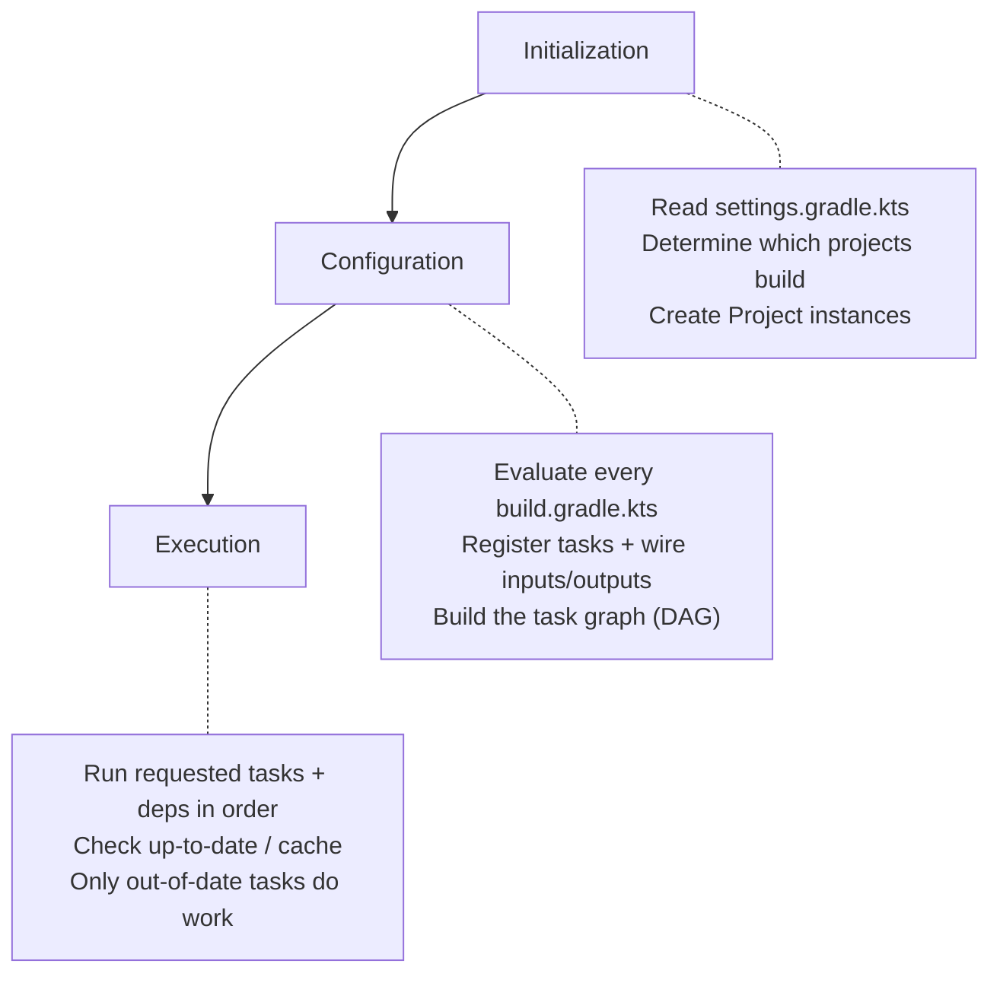
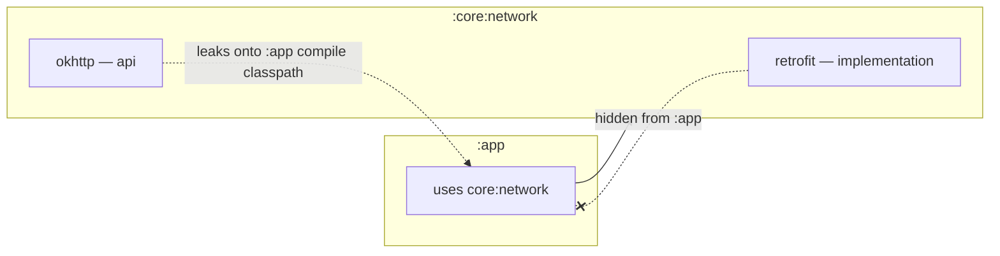
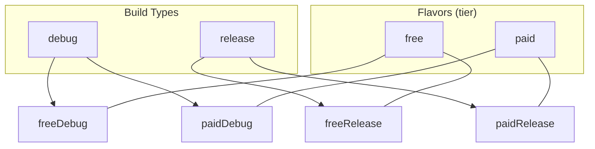

# Gradle

Gradle is the build system behind every Android project. It resolves dependencies, compiles sources, runs annotation processors, merges resources and manifests, packages APKs/AABs, signs them, and wires in the Android Gradle Plugin (AGP) transforms. At a senior level you are expected to reason about the **build model** (what runs when), **dependency configurations** (what leaks and what doesn't), **variants** (buildType × flavor), **version catalogs**, and **build performance** (config cache, build cache, KSP over kapt). This page covers all of that.

!!! abstract "TL;DR"
    - Gradle runs three phases per build: **initialization → configuration → execution**. The task graph is built at the end of configuration; only the tasks you need (and their dependencies) execute.
    - `implementation` hides a dependency from downstream consumers; `api` leaks it onto their compile classpath and slows incremental builds. Default to `implementation`.
    - **KSP** reads Kotlin symbols directly and is roughly 2× faster than **kapt** (which generates Java stubs). Migrate whenever the processor supports KSP.
    - A **variant** is `buildType × productFlavor(dimensions)`. `debug`/`release` × `free`/`paid` = 4 variants.
    - **Version catalogs** (`libs.versions.toml`) give type-safe, centralized dependency declarations across a multi-module build.
    - Turn on **configuration cache**, **build cache**, and **parallel** execution; avoid dynamic versions (`1.2.+`) which defeat caching and reproducibility.

---

## The Gradle build model

A Gradle build is a tree of **projects**. The **root project** is defined by `settings.gradle.kts`, which declares which subprojects (modules) participate and where plugins and dependencies are resolved from.

```
settings.gradle.kts          # root: includes modules, pluginManagement, dependencyResolutionManagement
build.gradle.kts             # root project script (usually just plugin aliases with apply false)
gradle/libs.versions.toml    # version catalog
app/build.gradle.kts         # :app module script
core/network/build.gradle.kts
build-logic/                 # convention plugins (composite build)
```

`settings.gradle.kts` is the single place that defines the *structure* of the build and where artifacts come from:

```kotlin
pluginManagement {
    repositories {
        google()
        mavenCentral()
        gradlePluginPortal()
    }
}
dependencyResolutionManagement {
    // FAIL the build if a module declares its own repositories — forces central control
    repositoriesMode.set(RepositoriesMode.FAIL_ON_PROJECT_REPOS)
    repositories {
        google()
        mavenCentral()
    }
    // The default "libs" catalog is auto-created from gradle/libs.versions.toml
}

rootProject.name = "MyApp"
include(":app", ":core:network", ":core:ui", ":feature:home")
```

!!! note "Project script vs module script"
    The **root** `build.gradle.kts` should stay thin — typically just plugin aliases with `apply false` so versions resolve once. Real configuration (Android block, dependencies, plugins) lives in each **module's** `build.gradle.kts`. Cross-cutting configuration belongs in **convention plugins**, not copy-pasted into every module.

### The three build phases



| Phase | What happens | Common mistake |
|---|---|---|
| **Initialization** | `settings.gradle.kts` runs; Gradle decides which projects are part of the build and instantiates them. | Heavy logic in settings slows *every* invocation. |
| **Configuration** | Every module's build script is evaluated top-to-bottom. Tasks are **registered** and their input/output wiring is declared. No task *work* happens yet. | Doing real work at configuration time (reading files, network, `.get()` on providers) — kills the configuration cache and slows all builds. |
| **Execution** | Gradle walks the task graph for the requested tasks, runs each **out-of-date** task in dependency order. | Assuming a task ran when it was skipped as `UP-TO-DATE`. |

!!! warning "Avoid work at configuration time"
    Configuration runs on *every* build, even `./gradlew help`. Use lazy APIs — `tasks.register` (not `tasks.create`), `Provider`/`Property`, `layout.buildDirectory` — so work is deferred to execution and only for tasks actually in the graph. Eager `.get()` calls and file I/O in the script body are the #1 cause of "why is configuration so slow" and of configuration-cache failures.

### Tasks and the task graph

Everything Gradle *does* is a **task** (`compileDebugKotlin`, `mergeReleaseResources`, `bundleRelease`). Tasks declare **inputs** and **outputs**; Gradle builds a **directed acyclic graph (DAG)** of task dependencies at the end of configuration and executes it.

```bash
./gradlew :app:assembleDebug --dry-run   # print the task graph without running it
./gradlew :app:dependencies               # print the resolved dependency tree
./gradlew :app:assembleRelease --scan     # upload a shareable build performance report
```

### Incremental builds & up-to-date checks

Before running a task, Gradle hashes its declared **inputs** (source files, properties, classpath) and **outputs**. If nothing changed since the last run, the task is marked `UP-TO-DATE` and skipped. This is why correctly declaring inputs/outputs on custom tasks matters — an under-declared input causes **stale outputs**; an over-declared one causes needless reruns.

### Configuration cache vs build cache

These are two different caches — a common interview trap.

| | **Configuration cache** | **Build cache** |
|---|---|---|
| Caches | The *result of the configuration phase* (the task graph) | The *outputs of individual tasks* |
| Skips | Re-running build scripts | Re-executing tasks (even across machines/clean builds) |
| Enable | `org.gradle.configuration-cache=true` | `org.gradle.caching=true` |
| Scope | Local, keyed by build inputs (tasks, args, env) | Local + optional **remote** (shared CI/team cache) |
| Requires | Task code that isn't tied to `Project` at execution time | Tasks with reliable, relocatable inputs/outputs |

```properties
# gradle.properties
org.gradle.caching=true
org.gradle.configuration-cache=true
org.gradle.parallel=true
org.gradle.configureondemand=true
org.gradle.jvmargs=-Xmx4g -XX:+UseParallelGC
```

!!! tip "Mental model"
    Build cache = "I've compiled these exact inputs before, reuse the `.class` files." Configuration cache = "The set of tasks and their wiring hasn't changed, skip re-reading the build scripts entirely." Both can hit on the same build.

---

## Android Gradle Plugin (AGP) essentials

AGP is the plugin that teaches Gradle about Android: the `android { }` DSL, variants, resource merging, manifest merging, D8/R8, and packaging. AGP versions are tied to specific Gradle and Kotlin versions and to a Compose compiler.

```kotlin
plugins {
    alias(libs.plugins.android.application)   // com.android.application
    alias(libs.plugins.kotlin.android)        // org.jetbrains.kotlin.android
    alias(libs.plugins.ksp)                   // com.google.devtools.ksp
}
```

- `com.android.application` → produces an installable app (APK/AAB).
- `com.android.library` → produces an `.aar` consumed by other modules.
- `com.android.test`, `com.android.dynamic-feature` → test-only and Play dynamic delivery modules.

!!! note "Compatibility matrix matters"
    AGP ↔ Gradle ↔ Kotlin ↔ Compose compiler versions must be compatible. Bumping AGP often forces a Gradle wrapper bump (`gradle/wrapper/gradle-wrapper.properties`). Keep the wrapper committed so every machine and CI uses the same Gradle version.

---

## Dependency configurations

The configuration you choose decides **what ends up on whose classpath** and, critically, how much recompilation a change triggers.

| Configuration | On consumer's **compile** classpath? | On **runtime** classpath? | Use for |
|---|---|---|---|
| `implementation` | ❌ (hidden) | ✅ | Default. Internal deps you don't expose in your public API. |
| `api` | ✅ (leaked transitively) | ✅ | Deps whose types appear in *your* module's public API. |
| `compileOnly` | ✅ | ❌ | Annotations, `provided` libs, deps supplied at runtime by the platform. |
| `runtimeOnly` | ❌ | ✅ | Impl swapped in at runtime (e.g. a logging backend). |
| `testImplementation` | ✅ (test only) | ✅ (test only) | JUnit, Truth, MockK — unit test deps. |
| `androidTestImplementation` | ✅ (androidTest) | ✅ (androidTest) | Espresso, test runner — instrumented tests. |
| `ksp` / `kapt` | annotation processing | — | Symbol/annotation processors (Room, Hilt, Moshi codegen). |
| `debugImplementation` | debug variant only | debug variant only | LeakCanary, debug tooling. |

### `implementation` vs `api` — the build-speed lever

```kotlin
// core:network/build.gradle.kts
dependencies {
    // Retrofit types NEVER appear in core:network's public API → keep it hidden
    implementation(libs.retrofit)

    // OkHttp's Interceptor IS exposed in a public function signature → must be api
    api(libs.okhttp)
}
```



!!! danger "Why `api` slows builds"
    `api` deps are placed on the **compile classpath of every downstream consumer, transitively**. When an `api` dependency changes, Gradle must recompile everything that transitively sees it. `implementation` breaks that chain — a change to a hidden dep only recompiles the module that owns it (ABI-compatible changes don't cascade). Rule of thumb: **use `implementation` unless a type from the dependency literally appears in your module's public signatures.** Overusing `api` recreates the "everything depends on everything" monolith you modularized to escape.

### KSP vs kapt

Both run annotation processors, but differently:

| | **kapt** | **KSP** |
|---|---|---|
| How | Generates Java **stubs** from Kotlin, then runs Java annotation processors | Reads Kotlin symbols **directly** via a Kotlin-native API |
| Speed | Slow — stub generation is a full extra pass | ~2× faster; no stubs |
| Status | Legacy / maintenance mode | Recommended; the future |
| Support | Any Java APT | Processor must ship a KSP implementation (Room, Hilt, Moshi, Glide all do) |

```kotlin
plugins { alias(libs.plugins.ksp) }
dependencies {
    implementation(libs.room.runtime)
    ksp(libs.room.compiler)          // ✅ KSP — fast
    // kapt(libs.room.compiler)      // ❌ legacy — slower, needs the kotlin-kapt plugin
}
```

---

## Build types, flavors, variants

### Build types

Build types describe *how* the same code is packaged: debuggable vs minified/shrunk vs signed for release.

```kotlin
android {
    buildTypes {
        debug {
            applicationIdSuffix = ".debug"      // install debug + release side-by-side
            isMinifyEnabled = false
        }
        release {
            isMinifyEnabled = true              // R8 code shrinking/obfuscation
            isShrinkResources = true            // strip unused resources
            proguardFiles(
                getDefaultProguardFile("proguard-android-optimize.txt"),
                "proguard-rules.pro"
            )
            signingConfig = signingConfigs.getByName("release")
        }
        create("staging") {                     // custom build type
            initWith(getByName("release"))      // inherit release settings
            applicationIdSuffix = ".staging"
            isMinifyEnabled = false
        }
    }
}
```

### Product flavors and dimensions

Flavors describe *different versions* of the app (free/paid, brand A/brand B). Flavors belong to a **dimension**; the final variant takes one flavor from **each** dimension.

```kotlin
android {
    flavorDimensions += listOf("tier", "brand")
    productFlavors {
        create("free")  { dimension = "tier";  applicationIdSuffix = ".free" }
        create("paid")  { dimension = "tier";  applicationIdSuffix = ".paid" }
        create("acme")  { dimension = "brand" }
        create("globex") { dimension = "brand" }
    }
}
```

### The variant matrix



**Variant = buildType × (one flavor per dimension).** With 2 build types × 2 `tier` flavors × 2 `brand` flavors you get **2 × 2 × 2 = 8 variants** (`freeAcmeDebug`, `paidGlobexRelease`, …). Each has its own tasks (`assembleFreeAcmeDebug`) and its own source set.

!!! tip "Prune variants you don't ship"
    Every variant multiplies build and sync time. Use `androidComponents { beforeVariants { … it.enable = false } }` to disable combinations you never build (e.g. `stagingPaid`).

### Source sets

Each variant merges code and resources from multiple source directories, by convention:

```
src/main/          # shared by all variants
src/debug/         # debug build type only
src/release/       # release build type only
src/free/          # free flavor only
src/paid/          # paid flavor only
src/freeDebug/     # exact variant only (highest priority)
```

Higher-specificity sources override `main`. This is how you swap an `ApiConfig`, a launcher icon, or a fake vs real implementation per variant **without any `if` statements in code**.

---

## BuildConfig, resValue, manifestPlaceholders

Three ways to inject variant-specific values at build time:

```kotlin
android {
    defaultConfig {
        buildConfigField("String", "API_URL", "\"https://api.example.com\"")
        buildConfigField("boolean", "LOG_ENABLED", "false")
        manifestPlaceholders["appLabel"] = "MyApp"
    }
    buildTypes {
        debug {
            buildConfigField("String", "API_URL", "\"https://staging.example.com\"")
            buildConfigField("boolean", "LOG_ENABLED", "true")
            resValue("string", "app_name", "MyApp Debug")
            manifestPlaceholders["appLabel"] = "MyApp (debug)"
        }
    }
    buildFeatures { buildConfig = true }   // AGP 8+: opt-in required
}
```

| Mechanism | Generates | Read from | Use for |
|---|---|---|---|
| `buildConfigField` | fields on `BuildConfig.java` | Kotlin/Java code | endpoints, feature flags, secrets-ish constants |
| `resValue` | entries in generated `res/values` | XML + `getString()` | app name, colors that differ per variant |
| `manifestPlaceholders` | `${key}` substitution in `AndroidManifest.xml` | manifest | deep-link hosts, API keys in `<meta-data>`, app label |

!!! warning "`buildConfig` is opt-in on AGP 8+"
    If `BuildConfig` "doesn't exist," you forgot `buildFeatures { buildConfig = true }`. Same pattern applies to `viewBinding`, `compose`, and `resValues`.

---

## Version catalogs (`libs.versions.toml`)

A version catalog centralizes dependency coordinates and versions in one TOML file, exposing **type-safe accessors** (`libs.retrofit`) to every module. It replaces scattered `ext` vars and hard-coded strings.

```toml
# gradle/libs.versions.toml
[versions]
kotlin = "2.0.21"
agp = "8.7.0"
retrofit = "2.11.0"
okhttp = "4.12.0"
room = "2.6.1"
compose-bom = "2024.10.00"

[libraries]
retrofit          = { module = "com.squareup.retrofit2:retrofit", version.ref = "retrofit" }
retrofit-moshi    = { module = "com.squareup.retrofit2:converter-moshi", version.ref = "retrofit" }
okhttp            = { module = "com.squareup.okhttp3:okhttp", version.ref = "okhttp" }
okhttp-logging    = { module = "com.squareup.okhttp3:logging-interceptor", version.ref = "okhttp" }
room-runtime      = { module = "androidx.room:room-runtime", version.ref = "room" }
room-compiler     = { module = "androidx.room:room-compiler", version.ref = "room" }
compose-bom       = { module = "androidx.compose:compose-bom", version.ref = "compose-bom" }
compose-ui        = { module = "androidx.compose.ui:ui" }   # version from BOM

[bundles]
network = ["retrofit", "retrofit-moshi", "okhttp", "okhttp-logging"]

[plugins]
android-application = { id = "com.android.application", version.ref = "agp" }
kotlin-android      = { id = "org.jetbrains.kotlin.android", version.ref = "kotlin" }
ksp                 = { id = "com.google.devtools.ksp", version = "2.0.21-1.0.25" }
```

Consuming it — note the `-` → `.` mapping in accessors:

```kotlin
dependencies {
    implementation(libs.bundles.network)   // pulls all 4 network libs at once
    implementation(libs.room.runtime)       // libs.room.runtime ← room-runtime
    ksp(libs.room.compiler)
    implementation(platform(libs.compose.bom))
    implementation(libs.compose.ui)
}
```

| TOML section | Purpose | Accessor |
|---|---|---|
| `[versions]` | Named version constants shared via `version.ref` | `libs.versions.kotlin` |
| `[libraries]` | Dependency coordinates | `libs.retrofit` |
| `[bundles]` | Named groups of libraries added together | `libs.bundles.network` |
| `[plugins]` | Plugin ids + versions for `alias(...)` | `libs.plugins.ksp` |

!!! tip "Why catalogs win at scale"
    One place to bump a version; type-safe accessors give IDE autocomplete and fail at **sync** (not build) if a coordinate is wrong; `bundles` cut boilerplate; and the catalog is shared by convention plugins in `build-logic`, so the whole build agrees on versions.

---

## Signing configuration

```kotlin
android {
    signingConfigs {
        create("release") {
            // NEVER hard-code secrets — read from env / gradle.properties / keystore.properties
            val props = Properties().apply {
                val f = rootProject.file("keystore.properties")
                if (f.exists()) load(f.inputStream())
            }
            storeFile = file(props.getProperty("storeFile") ?: System.getenv("KEYSTORE_PATH"))
            storePassword = props.getProperty("storePassword") ?: System.getenv("KEYSTORE_PASSWORD")
            keyAlias = props.getProperty("keyAlias") ?: System.getenv("KEY_ALIAS")
            keyPassword = props.getProperty("keyPassword") ?: System.getenv("KEY_PASSWORD")
        }
    }
    buildTypes {
        release { signingConfig = signingConfigs.getByName("release") }
    }
}
```

!!! danger "Keystore hygiene"
    Keep `keystore.properties` and the `.jks`/`.keystore` file **out of version control** (`.gitignore`). On CI, inject them as encrypted secrets. Prefer **Play App Signing** so Google holds the app signing key and you only manage an upload key.

---

## Build performance

Ranked by typical impact:

| Lever | Why it helps | How |
|---|---|---|
| **Configuration cache** | Skips the whole configuration phase on repeat builds | `org.gradle.configuration-cache=true` |
| **Build cache (remote)** | Reuse task outputs across CI/team, not just locally | `org.gradle.caching=true` + remote cache node |
| **Parallel execution** | Independent modules build concurrently | `org.gradle.parallel=true` |
| **Modularization** | Smaller compile units → smaller recompilation blast radius; parallelism | Split by feature/layer; see below |
| **KSP over kapt** | Removes the Java-stub generation pass | migrate processors to `ksp(...)` |
| **`implementation` over `api`** | Breaks transitive recompilation chains | audit with `./gradlew :m:dependencies` |
| **Avoid dynamic versions** | `1.2.+` / `latest.release` force resolution every build & break reproducibility | pin exact versions in the catalog |
| **Non-transitive R classes** | Each module gets its own R class; smaller, faster | `android.nonTransitiveRClass=true` (default in AGP 8) |
| **Right JVM heap** | GC thrash slows the daemon | tune `org.gradle.jvmargs` |
| **`--scan`** | Pinpoints the actual bottleneck instead of guessing | `./gradlew assembleDebug --scan` |

```bash
./gradlew assembleDebug --scan          # shareable HTML perf report — start here
./gradlew --stop                        # kill stale daemons if builds get flaky
./gradlew help --configuration-cache    # verify config cache is being stored/reused
```

!!! warning "Dynamic versions are a senior red flag"
    `implementation("com.foo:bar:1.+")` means the resolved artifact can change between two builds with identical source — non-reproducible, un-cacheable, and a supply-chain risk. Always pin exact versions (ideally in the catalog) and use dependency-locking if you need guarantees.

---

## Convention plugins & build-logic

When 10 modules all need the same Android config, Kotlin options, and base dependencies, copy-pasting into every `build.gradle.kts` is unmaintainable. **Convention plugins** — precompiled plugins living in an included `build-logic` build — encapsulate that shared setup so a module reduces to:

```kotlin
plugins {
    alias(libs.plugins.myapp.android.library)   // your convention plugin
    alias(libs.plugins.myapp.hilt)
}
```

This is the standard NowInAndroid pattern and the cleanest way to keep modules consistent and DRY.

!!! info "Deep dive"
    Full treatment — writing the plugin, sharing the catalog with `build-logic`, and testing — lives in [Convention Plugins](../modularization/convention-plugins.md).

---

## Kotlin DSL vs Groovy

| | **Kotlin DSL** (`.gradle.kts`) | **Groovy DSL** (`.gradle`) |
|---|---|---|
| Typing | Statically typed | Dynamically typed |
| IDE support | Autocomplete, refactor, click-through | Weak — mostly string matching |
| Errors | Compile-time | Runtime (during configuration) |
| Config-cache friendliness | Better tooling alignment | Fine, but less ergonomic |
| Cold-sync cost | Slightly slower first compile of scripts | Slightly faster to parse |
| Recommendation | **Default for new projects** | Legacy / migration only |

!!! tip
    Kotlin DSL's type safety pairs perfectly with version catalogs and convention plugins — you get autocomplete on `libs.*` and on your own plugin DSLs. The minor first-sync cost is dwarfed by the maintenance win.

---

## Worked example: a real module script

```kotlin
// feature/checkout/build.gradle.kts
plugins {
    alias(libs.plugins.android.library)
    alias(libs.plugins.kotlin.android)
    alias(libs.plugins.ksp)
}

android {
    namespace = "com.example.checkout"
    compileSdk = 35

    defaultConfig {
        minSdk = 24
        buildConfigField("String", "PAY_URL", "\"https://pay.example.com\"")
    }

    flavorDimensions += "tier"
    productFlavors {
        create("free") { dimension = "tier" }
        create("paid") {
            dimension = "tier"
            buildConfigField("boolean", "PREMIUM_CHECKOUT", "true")
        }
    }

    buildTypes {
        debug  { buildConfigField("boolean", "LOG_ENABLED", "true") }
        release {
            isMinifyEnabled = true
            proguardFiles(getDefaultProguardFile("proguard-android-optimize.txt"), "proguard-rules.pro")
        }
    }

    buildFeatures { buildConfig = true; compose = true }
    compileOptions {
        sourceCompatibility = JavaVersion.VERSION_17
        targetCompatibility = JavaVersion.VERSION_17
    }
}

dependencies {
    implementation(project(":core:network"))     // hidden from consumers of :feature:checkout
    api(project(":core:model"))                    // model types appear in our public API → api

    implementation(libs.bundles.network)
    implementation(libs.room.runtime)
    ksp(libs.room.compiler)                        // KSP, not kapt

    compileOnly(libs.annotations)                  // compile-time only
    debugImplementation(libs.leakcanary)           // debug builds only

    testImplementation(libs.junit)
    testImplementation(libs.truth)
    androidTestImplementation(libs.espresso.core)
}
```

---

## Interview Q&A

!!! question "1. Walk me through the three Gradle build phases. Where do most performance problems hide?"
    **Initialization** reads `settings.gradle.kts` and decides which projects are in the build. **Configuration** evaluates every `build.gradle.kts`, registering tasks and wiring their inputs/outputs to build the task DAG — *no task work happens yet*. **Execution** runs the requested tasks and their dependencies in order, skipping any that are `UP-TO-DATE` or served from the build cache. Most problems hide in **configuration**: it runs on *every* invocation, so eager work (file I/O, network, `.get()` on providers, `tasks.create` instead of `tasks.register`) slows all builds and breaks the configuration cache. Fix it with lazy APIs and by moving cross-cutting logic into convention plugins.
    **Follow-up:** *How do you inspect the task graph?* `./gradlew <task> --dry-run` lists tasks in order without running them, and `--scan` gives a full timing breakdown.

!!! question "2. `implementation` vs `api` — what's the difference and why does it matter for build speed?"
    `implementation` keeps a dependency off the **compile classpath of downstream consumers** — they can use your module but can't see that dep. `api` **leaks** the dependency transitively onto every consumer's compile classpath. Beyond encapsulation, `api` hurts build speed: changing an `api` dependency forces recompilation of everything that transitively sees it, while `implementation` breaks that chain so ABI-compatible changes stay local. Rule: use `api` **only** when a type from that dependency appears in your module's public signatures; otherwise `implementation`.
    **Follow-up:** *When is `compileOnly` correct?* When the dependency is needed only to compile (annotations, `provided` libs) and something else supplies it at runtime — it's on the compile classpath but not packaged.

!!! question "3. What exactly is a build variant, and how many do you get from 2 build types and 2 flavor dimensions with 2 flavors each?"
    A **variant** is the cartesian product of one build type and one flavor from **each** flavor dimension, plus the merged source sets and tasks for that combination. Build types describe *how* you package (debug vs minified release); flavors describe *which version* of the app (free/paid, brand). With 2 build types × 2 flavors (dim A) × 2 flavors (dim B) you get **2 × 2 × 2 = 8 variants**, e.g. `freeAcmeDebug`, `paidGlobexRelease`. Each has its own source set (`src/freeAcmeDebug/`) so you can swap implementations without runtime `if` branching.
    **Follow-up:** *How do you cut sync/build time from unused variants?* Disable combinations you never ship via `androidComponents { beforeVariants { it.enable = false } }`.

!!! question "4. Why prefer KSP over kapt, and what's the migration cost?"
    kapt runs Java annotation processors, which requires generating **Java stubs** from your Kotlin — an entire extra compilation pass that makes it slow. KSP reads Kotlin symbols directly through a Kotlin-native API, skipping stubs, and is typically about **2× faster**. The migration cost is that the processor must ship a KSP implementation — Room, Hilt, Moshi, and Glide all do, so for most apps it's a one-line swap of `kapt(...)` to `ksp(...)` plus applying the KSP plugin. Only processors with no KSP support keep you on kapt.
    **Follow-up:** *Any behavioral gotchas?* Generated-code output paths differ, so double-check any hard-coded references to generated packages and re-run a clean build after migrating.

!!! question "5. What do version catalogs give you, and how do they interact with configuration/build caching and modularization?"
    A version catalog (`gradle/libs.versions.toml`) centralizes versions, library coordinates, bundles, and plugin ids, exposing **type-safe accessors** (`libs.retrofit`, `libs.bundles.network`) with IDE autocomplete that fail at **sync** if a coordinate is wrong. At scale you bump a version once and every module agrees — including convention plugins in `build-logic`, which share the same catalog. It doesn't directly toggle caches, but it enables reproducibility by pushing you toward **pinned, exact versions**; dynamic versions (`1.2.+`) would defeat the build cache and configuration cache because the resolved artifact can change between identical-source builds.
    **Follow-up:** *What's a `[bundles]` entry for?* A named group of libraries you always add together (e.g. all Retrofit + OkHttp deps), so a module writes `implementation(libs.bundles.network)` instead of four separate lines.
