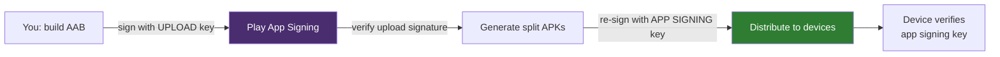
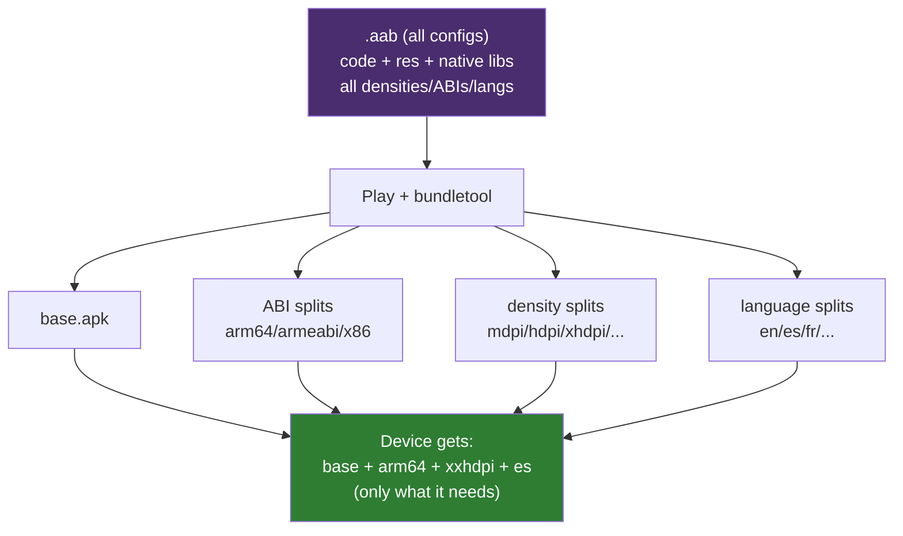
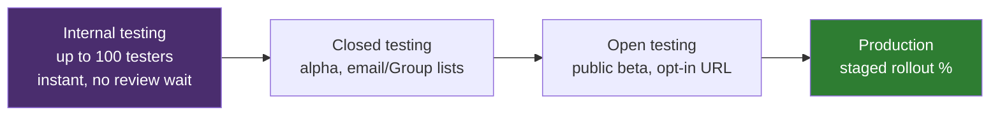
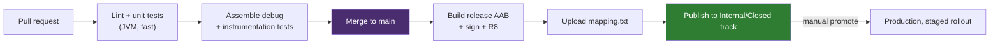

# App Distribution

Distribution is where the engineering ends and the *business* consequences begin. A senior is judged less on "can you upload an AAB" and more on the irreversible decisions baked into it: **who holds the signing key** (get it wrong and you can never update the app), **what artifact you ship** (an APK on Play is no longer even allowed), and **how you roll out** (ship a crash to 100% at once and you've earned a 2 a.m. incident). This module covers Play App Signing and the key hierarchy, the App Bundle and how Play slices it into per-device APKs, dynamic delivery, release tracks and staged rollout, in-app updates and reviews, deobfuscation mapping upload, and the `targetSdk` deadlines that quietly force you to ship whether you want to or not.

!!! abstract "What a senior is expected to own here"
    - Explain the **upload key vs app signing key** split, why Google holding the signing key is a *safety* feature (lost upload key is recoverable; lost signing key historically was not), and how **key rotation** works via APK Signature Scheme v3.
    - Justify **why Play mandates the AAB**: Play — not your build — generates optimized split APKs per device configuration, so users download only the density/ABI/language they need.
    - Choose deliberately between **install-time, conditional, and on-demand** dynamic feature delivery, and know when the complexity is *not* worth it.
    - Drive a **staged rollout** (internal → closed → open → production, N% at a time, halt on a spike) and wire **in-app updates** (flexible vs immediate) and the **in-app review** API without breaking store policy.
    - Keep crash reports readable by uploading **`mapping.txt`**, and stay ahead of the annual **`targetSdk` Play deadline** so the listing doesn't get frozen.

---

## App signing

Every APK Android installs must be cryptographically signed. The signature does two things: it proves **who published the app**, and it guarantees **update continuity** — Android will only install an update if it's signed by the *same* key as the currently-installed app. Signatures are verified but **not** vouched for by a CA; it's trust-on-first-install, so the identity that matters is "the same key as last time," not "a key some authority blessed."

The consequence is brutal and worth memorizing: **if you lose the key an app was published with and there's no rotation path, you can never update that app again.** You'd have to publish a brand-new listing under a new package name and abandon every existing install and review. This single risk is the reason Play App Signing exists.

### Keystore basics

A keystore is a password-protected file (`.jks` / `.keystore`, PKCS12 format) holding one or more key entries. Each key has its own alias and password. For release you generate an RSA 2048-bit key with a very long validity (Play requires the certificate to be valid until at least **2033**, and in practice you want decades — 10,000 days is the conventional choice).

```bash
keytool -genkeypair \
  -keystore upload-keystore.jks \
  -alias upload \
  -keyalg RSA -keysize 2048 -validity 10000 \
  -storetype PKCS12
```

Signing config in `build.gradle.kts` — **never** hardcode passwords; pull them from a `keystore.properties` file (git-ignored) or CI secrets:

```kotlin
val keystoreProps = Properties().apply {
    val f = rootProject.file("keystore.properties")
    if (f.exists()) load(f.inputStream())
}

android {
    signingConfigs {
        create("release") {
            storeFile = file(keystoreProps["storeFile"] as String)
            storePassword = keystoreProps["storePassword"] as String
            keyAlias = keystoreProps["keyAlias"] as String
            keyPassword = keystoreProps["keyPassword"] as String
        }
    }
    buildTypes {
        release { signingConfig = signingConfigs.getByName("release") }
    }
}
```

!!! danger "The keystore is not source; back it up out-of-band"
    Losing the keystore historically meant losing the app. Store it in a secrets manager (and an offline backup), never in the repo. In this monorepo the games and tools use *separate* keystores wired through CI secrets (`KEYSTORE_GAMES_*` vs `KEYSTORE_TOOLS_*`) — using the wrong prefix produces an AAB Play rejects as signed by an unknown key.

### Upload key vs app signing key (Play App Signing)

Play App Signing splits the single dangerous key into two, and this split is the single most important distribution concept for a senior to articulate:

| | **Upload key** | **App signing key** |
|---|---|---|
| Who holds it | **You** | **Google** (in their KMS) |
| What it signs | The AAB *you* upload | The APKs Google *distributes* to users |
| Seen by users' devices? | No | Yes — this is the identity devices verify |
| If lost/compromised | **Recoverable** — Play support resets it to a new upload key | Never leaves Google; you can't lose it |
| Enrolled how | Auto for new apps; upload key generated or you provide one | Google generates it, or you upload yours once at enrollment |

The flow: you sign the bundle with your **upload key** → Play verifies it's you → Play **strips your signature and re-signs** the generated APKs with the **app signing key** before delivering them to devices. Users only ever verify the app signing key.

Why this is strictly better:

- **Lost upload key is not fatal.** You contact Play support, they authorize a new upload key, and you keep shipping — the app signing key (the one that guarantees update continuity for millions of installed devices) never changed.
- **The distribution key lives in Google's hardened KMS**, not on a laptop or a CI runner's disk.
- It's a **prerequisite** for Play to re-sign the per-device split APKs it generates from your bundle (see [App Bundle](#app-bundle-aab-vs-apk)) — you literally can't do device-targeted delivery without Google holding a signing key.



### Key rotation (APK Signature Scheme v3)

Historically, the signing key was forever. **APK Signature Scheme v3** (Android 9 / API 28+) introduced **rotation**: the APK carries a *proof-of-rotation* lineage — a chain where each key is signed by the previous one — so a device can accept an update signed by the *new* key because it can verify the new key was authorized by the *old* key.

Nuances a senior should flag:

- Rotation is **for the signing key**, managed through Play App Signing ("request key upgrade"). You keep shipping; Play manages the lineage.
- On **pre-P devices** there's no v3, so the old key is retained for backward compatibility — rotation gives you forward benefit without orphaning old devices.
- Rotation is not a routine operation; it's for suspected key compromise or crypto-agility. Don't rotate for fun.
- Capabilities (like whether the old key can still share a UID / signature-permission with the new one) are declared in the lineage.

The signing *schemes* themselves, layered and each verifiable independently:

| Scheme | Min API | Protects | Notes |
|---|---|---|---|
| **v1 (JAR)** | 1 | Per-file, via `META-INF` manifests | Slow, weakest; parts of the archive unprotected. Legacy only. |
| **v2** | 24 (N) | Whole-APK block, single hash | Fast verify, tamper-evident over the entire file. |
| **v3** | 28 (P) | Whole-APK + **rotation lineage** | Enables key rotation. |
| **v4** | 30 (R) | Incremental (Merkle tree in a sidecar `.idsig`) | Enables **ADB incremental install** / streamed install of large apps. |

Modern builds sign with v2+v3 (and v4 where relevant); v1 is only kept if you must support API < 24. The deeper cryptographic treatment — Keystore, StrongBox, attestation — lives in [M24 Security](24-security.md).

---

## App Bundle (.aab) vs APK

An **APK** is the installable artifact a device runs. An **Android App Bundle (`.aab`)** is *not* installable — it's a publishing format: a zip of all your compiled code and resources for **every** configuration (all screen densities, all ABIs, all languages), plus metadata, that you upload to Play. Play then uses **`bundletool`** to generate and sign the actual APKs.

Since **August 2021, new apps on Play must publish as AAB.** You cannot upload a monolithic APK for a new listing.

### Why the AAB, and what Play does with it

From one bundle, Play generates **split APKs** and serves each device only the slices it needs:

- **base APK** — code + resources common to every device (always installed).
- **configuration splits** — one per density (`xxhdpi`), per ABI (`arm64-v8a`), per language (`es`, `fr`).
- **feature splits** — dynamic feature modules (below).

A device downloads base + only the matching config splits. An `arm64` phone at `xxhdpi` set to Spanish never downloads `x86` libs, `mdpi` drawables, or Korean strings. This is **Dynamic Delivery**, and the size win is real — commonly **15–40% smaller** downloads than the universal APK, more for apps heavy in native libs or locales.



| | **APK** | **App Bundle (AAB)** |
|---|---|---|
| Installable directly | Yes | **No** — a publishing format only |
| Contains | One configuration (or a fat universal build) | **All** configurations |
| Who generates device APKs | You (the build) | **Play** (via `bundletool`) |
| Download size to user | Everything, incl. unused configs | Only the device's slices (**smaller**) |
| Required on Play (new apps) | No (rejected) | **Yes**, since Aug 2021 |
| Signing on Play | You sign the APK | You sign the AAB (upload key); Play re-signs splits |
| Off-Play distribution (sideload, other stores) | Direct | Need `bundletool build-apks` / a universal APK |

!!! tip "You can still get a plain APK out of a bundle"
    For CI smoke tests, sideloading, or non-Play stores: `bundletool build-apks --mode=universal` produces one fat APK, and `bundletool build-apks --connected-device` builds+installs exactly the splits for an attached device — the same slicing Play does, locally.

!!! warning "Test what users actually receive"
    `assembleRelease` (a universal APK) is *not* what a user downloads. To reproduce real behavior — especially for language/ABI edge cases or missing-resource bugs — install via `bundletool` splits, or use Play's **Internal App Sharing** (below).

### Language splits and a runtime locale change

At install time, a device only downloads the base APK plus the density/ABI/**language** splits matching its *current* configuration — e.g. an `arm64`/`xxhdpi`/Spanish phone gets the `es` language split, not `en`, `fr`, `ko`, etc. The question that trips people up: what happens if the user changes the language *after* install — either the system locale, or (Android 13+) a **per-app language** via `AppCompatDelegate.setApplicationLocales()` — to one whose split was never downloaded?

Google Play's device-targeted delivery handles this transparently: because the locale can change at any time, **Play automatically fetches the missing language split** the next time it's needed, in the background over the Play Store's own delivery channel — this is not something your app code drives with `SplitInstallManager` (that API is for *dynamic feature modules*, which are opt-in; automatic configuration splits like language are not). Two consequences worth stating in an interview:

- **It requires network access and isn't instantaneous.** There's a window — right after the language change, before the split lands — where the app may render the base module's default/fallback-language strings instead of the newly-selected one. Keep the base module's default locale strings complete for exactly this reason; don't assume every string resource is always resolvable in the "current" language the instant the user switches.
- **It's Play's mechanism, not your code's.** You don't call anything to trigger it; it's part of Play's install/update pipeline for the app the same way a missing density or ABI split would be backfilled. If you sideload (no Play), or the user is offline for a genuinely new language, that split simply isn't available until Play can deliver it.

---

## Dynamic Feature Modules

A **Dynamic Feature Module** (`com.android.dynamic-feature` plugin) is a module that isn't part of the base install and is delivered separately via **Play Feature Delivery**. Use it to keep the initial download small (a rarely-used AR flow, a heavy onboarding video pack, a pro-tier editor) or to gate large native libraries.

Three **delivery modes**, declared in the module's manifest via `<dist:module>`:

| Mode | When installed | Config | Typical use |
|---|---|---|---|
| **install-time** | With the base app (but as a split) | `<dist:delivery><install-time/>` | Modularization without on-demand cost; can be made `removable` |
| **conditional** | At install, if device meets conditions | `min-sdk`, device features, country | Feature that only makes sense on some hardware/regions |
| **on-demand** | Later, when code requests it | `<dist:on-demand/>` | Rarely-used or premium features; smallest base download |

On-demand is the interesting one and the one that adds real complexity, because the code **isn't there until you fetch it**. You request it at runtime with `SplitInstallManager`:

```kotlin
val manager = SplitInstallManagerFactory.create(context)

val request = SplitInstallRequest.newBuilder()
    .addModule("premiumEditor")
    .build()

manager.registerListener { state ->
    when (state.status()) {
        SplitInstallSessionStatus.DOWNLOADING -> {
            val pct = state.bytesDownloaded() * 100 / state.totalBytesToDownload()
            updateProgress(pct.toInt())
        }
        SplitInstallSessionStatus.REQUIRES_USER_CONFIRMATION ->
            // Large modules (>~10MB on mobile data) need explicit user OK
            manager.startConfirmationDialogForResult(state, activity, REQ_CONFIRM)
        SplitInstallSessionStatus.INSTALLED -> launchPremiumEditor()
        SplitInstallSessionStatus.FAILED ->
            Log.e("Split", "code=${state.errorCode()}")
        else -> Unit
    }
}

manager.startInstall(request)
    .addOnFailureListener { e -> /* SplitInstallException: NETWORK_ERROR, etc. */ }
```

!!! warning "On-demand modules change your runtime assumptions"
    - After install you must call `SplitCompat.install(context)` (or extend `SplitCompatApplication`) so newly-added code/resources are visible to the running process.
    - Classes and resources from the module **do not exist** until installed — no direct compile-time references from base; you cross the boundary via reflection or a navigation/DI seam.
    - `Context.getAssets()` and resource IDs can behave differently pre-`SplitCompat`. This is the tax you pay for a smaller base APK.

!!! note "Cost / complexity tradeoff — when *not* to use DFMs"
    On-demand delivery buys download-size reduction at the cost of: async install UI (progress, failure, retry, confirmation), `SplitCompat` plumbing, harder local/off-Play testing (they only truly install through Play), and reflection seams. For most apps a well-configured AAB already trims per-device downloads enough. Reach for on-demand modules only when a genuinely large, genuinely optional chunk (hundreds of KB to MB) is used by a minority of sessions.

### APK splits (the non-Play alternative)

Before AAB, the manual mechanism was **`splits {}`** in Gradle — *you* generate multiple APKs (per density/ABI/language) and upload the set. It still exists and is the right tool when you distribute **off Play** (other stores, enterprise MDM) and want per-config APKs without Play's server-side generation:

```kotlin
android {
    splits {
        abi {
            isEnable = true
            reset()
            include("armeabi-v7a", "arm64-v8a", "x86_64")
            isUniversalApk = true   // also emit one fat APK
        }
    }
}
```

The tradeoff vs AAB: **you** own generating, versioning (each ABI split needs a distinct `versionCode`), and uploading every combination; Play's bundle does this automatically and slices at finer granularity. On Play, prefer the AAB; use `splits {}` only for the off-Play case.

---

## Play Console: release tracks

Play gives four progressively-wider tracks. Promotion moves the *same* build outward; you never skip straight to production for anything risky.



| Track | Audience | Purpose | Notes |
|---|---|---|---|
| **Internal** | ≤100 named testers | Fastest smoke test of the *release* artifact | Available in minutes; minimal review |
| **Closed** | Invited testers / Google Groups | Alpha; controlled feedback | Can run multiple closed tracks |
| **Open** | Anyone with the opt-in link | Public beta at scale | Full review applies |
| **Production** | Everyone | Live | Supports **staged rollout** |

### Staged rollout & halting

For production (and open) you set a **rollout percentage**: release to 1%, watch Android vitals / Crashlytics / reviews, then bump 5% → 10% → 50% → 100%. If a regression shows up:

- **Halt rollout** — freezes the current % so no *new* users get the bad build (those already updated keep it).
- **Full rollout** — push to 100% once healthy.
- There's no true "un-ship." The only forward fix is to **halt, then release a higher `versionCode`** with the fix and roll *that* out. This is exactly why staged rollout exists — catch it at 1%, not 100%.

!!! tip "Rollout discipline"
    Bump `versionCode` on every upload (Play rejects a duplicate). Start production at a low % for any release touching startup, billing, or migrations. Keep the previous healthy build's % ready to compare vitals against.

### Internal App Sharing

Distinct from the internal *track*: **Internal App Sharing** gives you a shareable URL for a specific upload — even a **debug** build or one with a duplicate/lower `versionCode` — with no review and no track semantics. It's the fastest way to hand a *reviewer* or QA the exact artifact and, crucially, to test what **Play's generated splits** actually install on a device (the thing a local `assembleRelease` can't show you). Ideal for reproducing per-device / per-locale bundle behavior.

---

## In-app updates

The **In-App Updates** API (part of Play Core / `app-update-ktx`) prompts users to update *inside your app* instead of hoping they visit the Play listing. Two flavors:

| | **Flexible** | **Immediate** |
|---|---|---|
| UX | Background download, user keeps using app, then you prompt to restart | Full-screen blocking update; user can't proceed until done |
| Use for | Optional / minor updates | Critical fixes, forced-update floors (broken API contract, security) |
| User can dismiss | Yes | Effectively no (must update or exit) |
| Restart | You trigger `completeUpdate()` after download | Play handles install + restart |

```kotlin
val appUpdateManager = AppUpdateManagerFactory.create(context)

appUpdateManager.appUpdateInfo.addOnSuccessListener { info ->
    val flexibleOk =
        info.updateAvailability() == UpdateAvailability.UPDATE_AVAILABLE &&
        info.isUpdateTypeAllowed(AppUpdateType.FLEXIBLE)

    if (flexibleOk) {
        appUpdateManager.startUpdateFlowForResult(
            info,
            activityResultLauncher,                       // ActivityResultLauncher<IntentSenderRequest>
            AppUpdateOptions.newBuilder(AppUpdateType.FLEXIBLE).build()
        )
    }
}

// Flexible downloads in the background; observe and prompt to install:
val listener = InstallStateUpdatedListener { state ->
    if (state.installStatus() == InstallStatus.DOWNLOADED) {
        showRestartSnackbar { appUpdateManager.completeUpdate() }
    }
}
appUpdateManager.registerListener(listener)

// On resume, resume an interrupted IMMEDIATE update so users can't get stuck:
override fun onResume() {
    super.onResume()
    appUpdateManager.appUpdateInfo.addOnSuccessListener { info ->
        if (info.updateAvailability() ==
            UpdateAvailability.DEVELOPER_TRIGGERED_UPDATE_IN_PROGRESS) {
            appUpdateManager.startUpdateFlowForResult(
                info, activityResultLauncher,
                AppUpdateOptions.newBuilder(AppUpdateType.IMMEDIATE).build()
            )
        }
    }
}
```

!!! note "Testing gotcha"
    In-app updates only trigger against a build **published to a Play track** whose `versionCode` is higher than the installed one, using the **same signing** account — you can't test it against a locally-installed APK. Use Internal App Sharing / internal track with a lower-versioned build installed first.

---

## In-app review

The **In-App Review** API shows the native rating card *without leaving your app* — no jarring redirect to the Play listing. The catch every senior must state: **you do not control when (or whether) the dialog actually shows.** Play applies its own quota/heuristics and may show nothing; the API deliberately gives no callback telling you if it appeared or what the user did (anti-manipulation).

```kotlin
val reviewManager = ReviewManagerFactory.create(context)
reviewManager.requestReviewFlow().addOnCompleteListener { task ->
    if (task.isSuccessful) {
        reviewManager.launchReviewFlow(activity, task.result)
        // No result semantics by design — never gate anything on it,
        // and never nudge the user ("please give 5 stars") — policy violation.
    }
}
```

Trigger it at a natural positive moment (after a win, a completed task) — never on launch, never behind a paywall, never with a "rate us 5★" pre-prompt.

---

## Deobfuscation: mapping.txt

R8 renames everything to `a.b.c` on release (see [M24 Security](24-security.md) / [M35 Gradle](35-gradle.md)). That makes production stack traces useless unless you upload the **`mapping.txt`** R8 emits at:

```
app/build/outputs/mapping/release/mapping.txt
```

Upload it so crashes get **deobfuscated** back to real symbols:

- **Play Console** → App bundle explorer / "Deobfuscation files" → upload per `versionCode`. Play then symbolicates Android vitals crashes.
- **Firebase Crashlytics** uploads it automatically via the Crashlytics Gradle plugin (`uploadCrashlyticsMappingFileRelease`) — verify it's actually running in CI or your crash-free % is measured against garbage traces.
- Keep the mapping file **archived per release** (it's build-specific); a v42 trace needs v42's mapping.

R8 also emits `seeds.txt` (kept classes) and `usage.txt` (stripped) alongside it — useful when a `-keep` rule is wrong and something you needed got shrunk out.

!!! danger "No mapping = blind on production crashes"
    Shipping obfuscated without uploading the mapping is a classic senior-level miss: you'll see a spike in crash-free-users drop with stack traces of `a.a.b(Unknown Source)` and no way to triage. Wire the upload into release CI, not a human checklist.

---

## targetSdk Play deadlines

Play enforces a rolling **`targetSdkVersion` floor**. Roughly one year after each Android release, both **new apps and updates** must target within one API level of the latest; a year after that, apps that don't are **hidden from the Play Store for devices running newer OS versions** (existing installs keep working, but you can't publish updates and new users on recent devices can't find you).

Practical consequences:

- `targetSdk` is a **behavioral contract** — bumping it opts you into that version's changes (scoped storage, background limits, notification runtime permission on 13+, foreground-service types on 14+, etc.), so it's a *code* task with testing, not a one-line bump.
- `minSdk` is unaffected by these deadlines; the floor is on `target`, not `min`.
- Miss the deadline and the listing effectively freezes on modern devices. Track the annual date and schedule the bump *before* it, with a real test pass.

---

## Pre-launch report

When you upload to a testing track, Play runs the artifact on **real physical devices in Firebase Test Lab** and returns a **pre-launch report** — free automated QA before real users touch it. It surfaces:

- **Stability** — crashes/ANRs the automated crawler hit across device/OS matrix.
- **Compatibility** — install/render failures on specific devices or API levels.
- **Performance** — startup and rendering signals.
- **Accessibility** — contrast, touch-target-size, unlabeled-element warnings.
- **Security** — flagged vulnerabilities (e.g. from bundled libraries).
- **Screenshots** across the device matrix.

It's a robot crawler, not a test suite — it can't reach flows behind login or complex gestures — so pair it with your own instrumentation tests ([M34 Testing](34-testing.md)). But it catches "crashes immediately on Android 15" and "invisible on a tablet" before those become 1-star reviews.

---

## CI/CD for Android

Everything above — signing, the AAB, tracks, mapping upload — is what a *pipeline* should be doing on every merge to `main`/`release`, not a person clicking through Android Studio and the Play Console by hand. The senior framing: **CI** (continuous integration) is "every PR proves it doesn't break the build," **CD** (continuous delivery/deployment) is "a green build on the right branch reaches a track without a human copying files around."

### A typical pipeline shape



- **On every PR:** lint, unit tests (JUnit/MockK/Turbine — see [M34 Testing](34-testing.md)), and `assembleDebug` are the cheap, fast gate — this is what "CI" actually protects, and it should fail fast (minutes, not tens of minutes) or engineers start ignoring it.
- **On merge to the release branch:** build and sign the release AAB, run R8, upload `mapping.txt`, and push to a Play track automatically — this is the "CD" half, and it's what turns a release from a manual multi-step ritual (and its error potential — wrong keystore, forgotten mapping upload) into a repeatable, auditable one.
- **Promotion to production is usually a manual gate**, not automatic — staged rollout and halt decisions (above) are judgment calls a human should make, even in an otherwise fully automated pipeline.

### The tools

| Layer | Typical choice | Job |
|---|---|---|
| CI runner | GitHub Actions, GitLab CI, Bitrise, CircleCI | Executes the pipeline on triggers (PR, push, tag) |
| Android release automation | **Fastlane** (`fastlane/Fastfile`) | Wraps signing, versioning, changelog, and Play upload behind one command (`fastlane deploy_internal`) — the de facto standard so the *steps* aren't reinvented per project |
| Play upload | `fastlane supply`, or the Google Play Developer API directly | Publishes the AAB + release notes to a track, sets rollout % |
| Secrets | CI's encrypted secrets store (never the repo) | Keystore, `keystore.properties` values, Play service-account JSON |

```yaml
# Sketch of a GitHub Actions release job — illustrative, not exhaustive
release:
  runs-on: ubuntu-latest
  steps:
    - uses: actions/checkout@v4
    - uses: actions/setup-java@v4
      with: { distribution: temurin, java-version: '17' }
    - run: echo "$KEYSTORE_BASE64" | base64 -d > release.jks
      env: { KEYSTORE_BASE64: ${{ secrets.KEYSTORE_BASE64 }} }
    - run: ./gradlew bundleRelease
      env:
        KEYSTORE_PASSWORD: ${{ secrets.KEYSTORE_PASSWORD }}
        KEY_ALIAS: ${{ secrets.KEY_ALIAS }}
        KEY_PASSWORD: ${{ secrets.KEY_PASSWORD }}
    - run: bundle exec fastlane deploy_internal   # uploads AAB + mapping.txt to Play
      env: { SUPPLY_JSON_KEY_DATA: ${{ secrets.PLAY_SERVICE_ACCOUNT_JSON }} }
```

!!! danger "Secrets discipline is the part that actually causes incidents"
    Never echo a decoded keystore or a service-account JSON to logs; use CI's masked/secret env vars, not repo files. Rotate the Play service-account key like any other credential. A leaked upload-signing secret is recoverable (see [upload key vs app signing key](#upload-key-vs-app-signing-key-play-app-signing) above) — a leaked Play API service-account key with publish rights is not something you want to discover from an unexpected release.

!!! tip "What actually differentiates a senior answer here"
    Not "we use GitHub Actions" — anyone can name a tool. The signal is knowing *what gate belongs at which stage* (fast JVM checks block the PR; slow release signing/upload runs only after merge), that promotion to production should stay a deliberate human decision even in a fully automated pipeline, and that the pipeline is what makes the signing/mapping-upload/versionCode discipline from this module actually *reliable* instead of a checklist someone eventually forgets.

---

## Interview Q&A

!!! question "1. Explain upload key vs app signing key. Why is it *safer* to let Google hold the signing key?"
    The **app signing key** is the key whose signature devices actually verify and which guarantees update continuity — Android only installs an update signed with the same key as the installed app. With **Play App Signing**, Google holds that key in their KMS and re-signs the per-device APKs they generate from your bundle. You only hold the **upload key**, which signs the AAB you upload; Play verifies it, strips it, and re-signs with the app signing key. It's safer because the catastrophic failure mode — *losing the key means you can never update the app again* — is removed: if you lose your **upload** key, Play support resets it to a new one and the app signing key is untouched, so millions of existing installs still accept your updates. The truly-unrecoverable key never sits on a laptop or CI runner.

    **Follow-up: What if you suspect the app signing key itself is compromised?** Request a **key upgrade / rotation** through Play App Signing. APK Signature Scheme v3 carries a proof-of-rotation lineage (new key signed by old), so P+ devices accept updates signed by the new key while pre-P devices fall back to the retained old key.

!!! question "2. Why does Play require an AAB instead of an APK, and what does Play do with it?"
    An APK is a single installable artifact — either one configuration or a fat universal build carrying every density, ABI, and language. An **AAB** is a publishing format containing *all* configurations plus metadata; it isn't installable. Play runs **`bundletool`** on it to generate and sign **split APKs** — a base APK plus configuration splits per density/ABI/language — and serves each device only the base plus the slices matching its hardware and locale. The user download is commonly 15–40% smaller because an arm64/xxhdpi/Spanish phone never downloads x86 libs, mdpi drawables, or other languages. Play mandates it (new apps since Aug 2021) because this device-targeted delivery only works if Play generates and re-signs the APKs, which in turn requires Play App Signing.

    **Follow-up: How do you get an installable APK for sideloading or a non-Play store?** `bundletool build-apks` — `--mode=universal` for one fat APK, or `--connected-device` to build/install exactly the splits for an attached device. For off-Play per-config distribution you can instead use Gradle `splits {}`, but then you own versioning and uploading each combination.

!!! question "3. When would you use a dynamic feature module, and what changes about your runtime once a module is on-demand?"
    Use a DFM to keep the base download small when a chunk of the app is **large and optional** — a premium editor, an AR flow, a big onboarding asset pack. Delivery modes: **install-time** (ships with base, just modularized), **conditional** (installed at install-time if device/country conditions match), and **on-demand** (fetched later via `SplitInstallManager`). On-demand is where runtime assumptions change: the module's code and resources **don't exist** until installed, so you can't reference them at compile time from base — you cross the seam via reflection or a DI/navigation boundary — and after install you must call `SplitCompat.install()` (or use `SplitCompatApplication`) so the running process sees the new code/resources. You also inherit async UI: progress, failure/retry, and a user-confirmation dialog for large downloads on mobile data.

    **Follow-up: When is a DFM *not* worth it?** When the "optional" part is small. A well-configured AAB already trims per-device downloads; on-demand adds install UI, `SplitCompat` plumbing, reflection seams, and harder testing (they only truly install through Play). Only pay that for a genuinely large, genuinely minority-used chunk.

!!! question "4. Walk me through shipping a risky release safely on Play."
    Promote one build outward through tracks: **internal** (≤100 testers, available in minutes — smoke-test the real release artifact and Play's generated splits), then **closed** (invited alpha), **open** (public beta) if warranted, then **production with a staged rollout**. In production I start at ~1% and watch Android vitals, Crashlytics crash-free %, and reviews, then step up 5→10→50→100%. If a regression appears I **halt the rollout** — that freezes the % so no new users get the bad build — and since there's no un-ship, I release a **higher `versionCode`** with the fix and roll *that* out. I make sure `mapping.txt` is uploaded (or Crashlytics uploads it) so the crashes I'm watching are actually readable, and I lean on the **pre-launch report** and Internal App Sharing to catch device-specific failures before the 1% even starts.

    **Follow-up: You're already at 100% and discover a critical bug — options?** You can't recall it. Halt is moot at 100%. The fix is forward-only: ship a hotfix with a bumped `versionCode`, optionally gate it with an **immediate in-app update** so users on the broken build are forced to update rather than waiting to visit the listing.

!!! question "5. How do you keep production crash reports readable, and what's the trap with obfuscation?"
    R8 obfuscates release builds, renaming everything to `a.b.c`, so raw production stack traces are meaningless. R8 emits **`mapping.txt`** (`build/outputs/mapping/release/`) mapping obfuscated names back to originals. Upload it **per `versionCode`** — to Play Console (deobfuscation files) for Android vitals, and Firebase Crashlytics uploads it automatically via its Gradle plugin. The trap: shipping obfuscated *without* wiring the mapping upload into CI. You then watch crash-free-users drop with traces full of `a.a.b(Unknown Source)` and no way to triage — and because each mapping is build-specific, a v42 trace is unreadable without v42's archived mapping. It belongs in release automation, never a human checklist.

    **Follow-up: A `-keep` rule seems wrong and something you needed got stripped — how do you confirm?** R8 emits `seeds.txt` (what was kept) and `usage.txt` (what was removed) alongside `mapping.txt`; check `usage.txt` to see if the class/member was shrunk out, then narrow the `-keep` rule. Reflection and serialization targets are the usual victims. (More on R8 keep rules in [M24 Security](24-security.md) and [M35 Gradle](35-gradle.md).)
