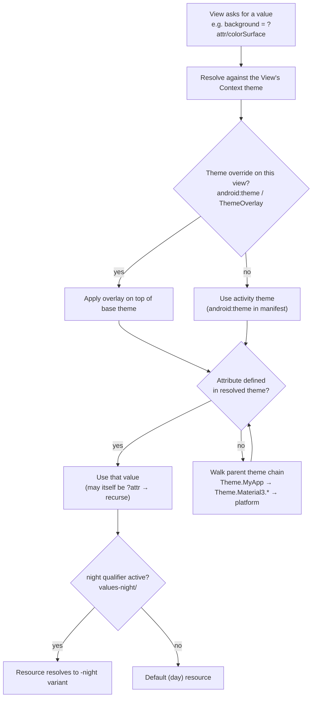

# Material Design Components

!!! abstract "What this covers"
    The **Material Components for Android** (MDC) library — `com.google.android.material` — for the **View system**: buttons, cards, chips, text fields, navigation surfaces, app bars, FABs, and Snackbars, plus Material 3 theming (color roles, dynamic color, typography, shape), DayNight dark theme, and edge-to-edge insets. Every component is mapped to its **Compose Material3** parallel.

!!! danger "New UI should be Compose Material3, not MDC Views"
    For **greenfield** screens, reach for `androidx.compose.material3` — it is the actively-invested surface and expresses the same M3 spec with far less boilerplate. This document exists because real apps are **large existing View codebases** (XML layouts, `RecyclerView`, `Fragment`s) where you (a) maintain MDC screens, (b) migrate incrementally, and (c) run **interop** — MDC and Compose sharing one M3 theme via `MdcTheme`/`createMaterialTheme`. Know MDC cold for those; default to Compose for anything new.

The dependency and its base theme:

```kotlin
// build.gradle.kts
dependencies {
    implementation("com.google.android.material:material:1.12.0")
}
```

```kotlin
<!-- res/values/themes.xml -->
<style name="Theme.MyApp" parent="Theme.Material3.DayNight.NoActionBar">
    <item name="colorPrimary">@color/purple_500</item>
    <item name="colorOnPrimary">@color/white</item>
    <item name="colorPrimaryContainer">@color/purple_100</item>
    <item name="android:statusBarColor">?attr/colorSurface</item>
</style>
```

!!! warning "The app theme MUST descend from `Theme.Material3.*`"
    MDC widgets read their look from **theme attributes** (`?attr/colorPrimary`, `?attr/shapeAppearanceMedium`, `?attr/textAppearanceBodyLarge`). If your activity theme is a bare `Theme.AppCompat`, MDC components throw `IllegalArgumentException: The style on this component requires your app theme to be Theme.MaterialComponents (or a descendant)` at inflation. This is the single most common MDC crash.

---

## Component catalog

| Component | Class | Use it for | Compose M3 parallel |
|---|---|---|---|
| Button | `MaterialButton` | Filled / tonal / outlined / text / elevated actions | `Button`, `FilledTonalButton`, `OutlinedButton`, `TextButton`, `ElevatedButton` |
| Card | `MaterialCardView` | Grouped content surface, optional checkable/draggable | `Card`, `ElevatedCard`, `OutlinedCard` |
| Chip | `Chip` + `ChipGroup` | Filters, choices, input tokens, actions | `FilterChip`, `AssistChip`, `InputChip`, `SuggestionChip` + `FlowRow` |
| Text field | `TextInputLayout` + `TextInputEditText` | Labeled input, error/helper/counter | `TextField`, `OutlinedTextField` |
| Bottom nav | `BottomNavigationView` | 3–5 top-level destinations (phones) | `NavigationBar` + `NavigationBarItem` |
| Nav rail | `NavigationRailView` | 3–7 destinations (tablets / landscape) | `NavigationRail` + `NavigationRailItem` |
| Drawer | `NavigationView` (in `DrawerLayout`) | 5+ destinations, hierarchy | `ModalNavigationDrawer` + `NavigationDrawerItem` |
| Tabs | `TabLayout` + `ViewPager2` | Swipeable peer content sections | `TabRow` + `HorizontalPager` |
| App bar | `AppBarLayout` + `MaterialToolbar` | Scrollable top bar, collapsing header | `TopAppBar` + `nestedScroll` behaviors |
| FAB | `FloatingActionButton`, `ExtendedFloatingActionButton` | Single primary screen action | `FloatingActionButton`, `ExtendedFloatingActionButton` |
| Transient msg | `Snackbar` | Brief feedback + optional action | `SnackbarHost` + `SnackbarHostState` |

---

## Buttons, cards, chips

### MaterialButton

One class, five styles selected via `style=`. Never set a plain `<Button>` and expect M3 — that inflates the AppCompat button.

```kotlin
<!-- Filled (default), tonal, outlined, text, elevated -->
<com.google.android.material.button.MaterialButton
    android:id="@+id/saveBtn"
    style="@style/Widget.Material3.Button"            <!-- filled -->
    app:icon="@drawable/ic_save"
    app:iconGravity="textStart"
    android:text="Save" />

<com.google.android.material.button.MaterialButton
    style="@style/Widget.Material3.Button.TonalButton" ... />
<com.google.android.material.button.MaterialButton
    style="@style/Widget.Material3.Button.OutlinedButton" ... />
<com.google.android.material.button.MaterialButton
    style="@style/Widget.Material3.Button.TextButton" ... />
```

`MaterialButton` also supports **toggle groups** via `MaterialButtonToggleGroup` (segmented single/multi-select) and a checkable state — the View analog of Compose's `SegmentedButton`.

### MaterialCardView

A `FrameLayout` subclass with elevation, corner radius, stroke, and optional **checkable/draggable** behavior. It draws a ripple and a checked overlay for free.

```kotlin
<com.google.android.material.card.MaterialCardView
    style="@style/Widget.Material3.CardView.Elevated"
    app:cardCornerRadius="16dp"
    app:strokeWidth="0dp"
    app:checkable="true">      <!-- toggles isChecked, shows check icon overlay -->
    <!-- child content -->
</com.google.android.material.card.MaterialCardView>
```

### Chip and ChipGroup

`Chip` has four semantic styles; `ChipGroup` lays them out (with `app:singleSelection` for radio-like behavior, or wrapping/scrolling).

```kotlin
<com.google.android.material.chip.ChipGroup
    android:id="@+id/filters"
    app:singleSelection="true"
    app:selectionRequired="true">

    <com.google.android.material.chip.Chip
        style="@style/Widget.Material3.Chip.Filter"
        android:text="All" android:checkable="true" />
    <com.google.android.material.chip.Chip
        style="@style/Widget.Material3.Chip.Filter"
        android:text="Unread" android:checkable="true" />
</com.google.android.material.chip.ChipGroup>
```

```kotlin
filters.setOnCheckedStateChangeListener { group, checkedIds ->
    val selected = checkedIds.firstOrNull()?.let { group.findViewById<Chip>(it).text }
    viewModel.applyFilter(selected)
}
```

!!! tip "Input chips need a close icon handler"
    For `Widget.Material3.Chip.Input` (removable tokens), set `app:closeIconVisible="true"` and wire `chip.setOnCloseIconClickListener { group.removeView(chip) }`. Chips added dynamically must be inflated with the `ChipGroup`'s context so they pick up the group's chip style.

---

## Text input — the deep one

`TextInputLayout` is a container that owns the **floating label**, **box/outline**, **error text**, **helper text**, **character counter**, and **end icons** (clear, password toggle, dropdown). The editable child must be a `TextInputEditText`, not a bare `EditText` — only then does the label float and the box draw correctly.

```kotlin
<com.google.android.material.textfield.TextInputLayout
    android:id="@+id/emailField"
    style="@style/Widget.Material3.TextInputLayout.OutlinedBox"
    android:hint="Email"
    app:helperText="We never share it"
    app:helperTextEnabled="true"
    app:counterEnabled="true"
    app:counterMaxLength="40"
    app:endIconMode="clear_text"
    app:errorEnabled="true">      <!-- reserves vertical space so layout doesn't jump -->

    <com.google.android.material.textfield.TextInputEditText
        android:layout_width="match_parent"
        android:layout_height="wrap_content"
        android:inputType="textEmailAddress"
        android:imeOptions="actionNext" />
</com.google.android.material.textfield.TextInputLayout>
```

Setting an error at runtime (validation):

```kotlin
emailField.editText?.doAfterTextChanged { text ->
    val email = text?.toString().orEmpty()
    emailField.error = when {
        email.isBlank() -> "Email required"
        !Patterns.EMAIL_ADDRESS.matcher(email).matches() -> "Enter a valid email"
        else -> null            // null clears the error and restores helper text
    }
}

fun validateOnSubmit(): Boolean {
    val ok = Patterns.EMAIL_ADDRESS.matcher(emailField.editText?.text ?: "").matches()
    emailField.error = if (ok) null else "Enter a valid email"
    return ok
}
```

**Box styles** are chosen by the widget `style`, not an attribute:

| Style | Look |
|---|---|
| `Widget.Material3.TextInputLayout.OutlinedBox` | Notched outline (default M3 choice) |
| `Widget.Material3.TextInputLayout.FilledBox` | Filled container, bottom line |
| `*.OutlinedBox.Dense` / `*.FilledBox.Dense` | Reduced vertical padding for dense forms |

**End icon modes** (`app:endIconMode`): `clear_text`, `password_toggle`, `dropdown_menu` (for `MaterialAutoCompleteTextView` exposed dropdown / "Material spinner"), `custom`.

!!! warning "Set `errorEnabled`/`helperTextEnabled` to reserve space"
    If you toggle `error` on/off without `app:errorEnabled="true"` (or a helper text present), the field grows and shrinks by a line each time, jolting the whole layout. Reserve the space up front. Also: **set `error` on the `TextInputLayout`, never on the inner `EditText`** — the layout owns the error UI.

**Compose parallel:** `OutlinedTextField(value, onValueChange, isError = ..., supportingText = { }, trailingIcon = { })`. There is no separate "layout + edit text" split — one composable owns label, box, error, and supporting text.

---

## Navigation surfaces

Pick the surface by destination count and form factor:

| Destinations | Phone | Tablet / wide |
|---|---|---|
| 3–5 | `BottomNavigationView` | `NavigationRailView` |
| 5+ / hierarchy | `NavigationView` drawer | `NavigationView` (permanent/rail) |

All three are driven by a **menu resource** and integrate with the Jetpack **Navigation component** via one call.

```kotlin
<!-- res/menu/bottom_nav.xml -->
<menu xmlns:android="http://schemas.android.com/apk/res/android">
    <item android:id="@+id/homeFragment" android:icon="@drawable/ic_home"  android:title="Home" />
    <item android:id="@+id/statsFragment" android:icon="@drawable/ic_stats" android:title="Stats" />
    <item android:id="@+id/settingsFragment" android:icon="@drawable/ic_cog" android:title="Settings" />
</menu>
```

```kotlin
// Item ids MUST match the nav-graph destination ids for auto-wiring.
val navController = (supportFragmentManager
    .findFragmentById(R.id.nav_host) as NavHostFragment).navController

bottomNav.setupWithNavController(navController)     // BottomNavigationView
// navigationRail.setupWithNavController(navController)
// navigationView.setupWithNavController(navController)  // drawer
```

For a drawer, `NavigationView` lives inside a `DrawerLayout` and usually pairs with `AppBarConfiguration` so the toolbar shows a hamburger and back-arrow correctly:

```kotlin
val appBarConfig = AppBarConfiguration(
    topLevelDestinations = setOf(R.id.homeFragment, R.id.statsFragment),
    drawerLayout = drawerLayout
)
toolbar.setupWithNavController(navController, appBarConfig)
navigationView.setupWithNavController(navController)
```

**Compose parallels:** `NavigationBar`/`NavigationBarItem`, `NavigationRail`/`NavigationRailItem`, `ModalNavigationDrawer` + `NavigationDrawerItem`. Selection state is hoisted (`selected = currentRoute == ...`) rather than derived from menu ids.

---

## Tabs — TabLayout + ViewPager2

`TabLayout` renders the tab strip; `ViewPager2` (a `RecyclerView`-backed pager) hosts the swipeable pages. `TabLayoutMediator` **binds them bidirectionally**: swiping the pager moves the indicator, tapping a tab scrolls the pager. This replaces the old, leak-prone `TabLayout.setupWithViewPager` of ViewPager1.

```kotlin
class PagerAdapter(activity: FragmentActivity) : FragmentStateAdapter(activity) {
    override fun getItemCount() = 3
    override fun createFragment(position: Int): Fragment = when (position) {
        0 -> HomeFragment()
        1 -> StatsFragment()
        else -> SettingsFragment()
    }
}

viewPager.adapter = PagerAdapter(this)

TabLayoutMediator(tabLayout, viewPager) { tab, position ->
    tab.text = when (position) { 0 -> "Home"; 1 -> "Stats"; else -> "Settings" }
}.attach()   // MUST call attach() — creating the mediator alone does nothing
```

!!! warning "Detach the mediator and null the adapter to avoid leaks"
    `TabLayoutMediator` holds references to both views. In a `Fragment`, detach in `onDestroyView()` (`mediator.detach()`) and set `viewPager.adapter = null`; otherwise the `FragmentStateAdapter` can outlive the view and leak child fragments. Also set `viewPager.offscreenPageLimit` deliberately — the default lazily destroys off-screen pages.

**Compose parallel:** `TabRow { Tab(selected, onClick) }` synced with a `HorizontalPager(state)`; you drive both from a shared `PagerState` + `rememberCoroutineScope()` rather than a mediator object.

---

## App bars, collapsing headers, scroll flags

This is a **CoordinatorLayout** story — the scroll choreography here builds directly on the behaviors described in [View System](03-view-system.md). `AppBarLayout` is a vertical `LinearLayout` that reacts to nested scroll events from a scrolling sibling (a `RecyclerView`/`NestedScrollView` marked with `app:layout_behavior="@string/appbar_scrolling_view_behavior"`). Each child of `AppBarLayout` declares `app:layout_scrollFlags` describing how it moves.

```kotlin
<androidx.coordinatorlayout.widget.CoordinatorLayout
    android:layout_width="match_parent" android:layout_height="match_parent">

    <com.google.android.material.appbar.AppBarLayout
        android:layout_width="match_parent"
        android:layout_height="wrap_content">

        <com.google.android.material.appbar.CollapsingToolbarLayout
            android:layout_width="match_parent"
            android:layout_height="220dp"
            app:layout_scrollFlags="scroll|exitUntilCollapsed"
            app:titleCollapseMode="scale"
            app:contentScrim="?attr/colorPrimary"
            app:expandedTitleGravity="bottom|start">

            <ImageView
                android:layout_width="match_parent" android:layout_height="match_parent"
                android:scaleType="centerCrop"
                app:layout_collapseMode="parallax"          <!-- slower scroll -->
                app:layout_collapseParallaxMultiplier="0.6" />

            <com.google.android.material.appbar.MaterialToolbar
                android:layout_width="match_parent"
                android:layout_height="?attr/actionBarSize"
                app:layout_collapseMode="pin" />            <!-- stays pinned -->
        </com.google.android.material.appbar.CollapsingToolbarLayout>
    </com.google.android.material.appbar.AppBarLayout>

    <androidx.recyclerview.widget.RecyclerView
        android:layout_width="match_parent" android:layout_height="match_parent"
        app:layout_behavior="@string/appbar_scrolling_view_behavior" />
</androidx.coordinatorlayout.widget.CoordinatorLayout>
```

**Scroll flags** (order matters — they compose):

| Flag | Effect |
|---|---|
| `scroll` | Required base — without it the view is pinned and nothing else applies |
| `enterAlways` | Any downward scroll immediately reveals the bar |
| `enterAlwaysCollapsed` | With a `minHeight`, enters in two stages (min first, full at list top) |
| `exitUntilCollapsed` | Collapses down to its `minHeight` and stays (classic parallax header) |
| `snap` | Settles fully open or fully closed, never mid-way |

!!! tip "`titleCollapseMode`, `contentScrim`, and status bar"
    `contentScrim` is the color that fades in as the header collapses (usually `?attr/colorPrimary`); `statusBarScrim` covers the status bar area. Set `app:titleCollapseMode="scale"` for the animated title shrink or `"fade"` for a cross-fade. For edge-to-edge, let `CollapsingToolbarLayout` consume the top inset via `fitsSystemWindows` on the `CoordinatorLayout`.

**Compose parallel:** `TopAppBar`/`LargeTopAppBar`/`MediumTopAppBar` with a `TopAppBarScrollBehavior` (`enterAlwaysScrollBehavior`, `exitUntilCollapsedScrollBehavior`) wired through `Modifier.nestedScroll(scrollBehavior.nestedScrollConnection)` on the `Scaffold`.

---

## FAB and Extended FAB

`FloatingActionButton` is the single, most-emphasized action on a screen. `ExtendedFloatingActionButton` adds a text label and can **shrink to icon-only** on scroll.

```kotlin
<com.google.android.material.floatingactionbutton.ExtendedFloatingActionButton
    android:id="@+id/composeFab"
    android:layout_width="wrap_content"
    android:layout_height="wrap_content"
    android:layout_gravity="bottom|end"
    android:layout_margin="16dp"
    app:icon="@drawable/ic_add"
    android:text="Compose" />
```

```kotlin
// Shrink to icon on scroll down, extend on scroll up — the canonical pattern.
recyclerView.addOnScrollListener(object : RecyclerView.OnScrollListener() {
    override fun onScrolled(rv: RecyclerView, dx: Int, dy: Int) {
        if (dy > 6 && composeFab.isExtended) composeFab.shrink()
        else if (dy < -6 && !composeFab.isExtended) composeFab.extend()
    }
})
```

!!! note "FAB + Snackbar choreography is automatic in CoordinatorLayout"
    Inside a `CoordinatorLayout`, `FloatingActionButton.Behavior` automatically slides the FAB up when a `Snackbar` appears so the action button isn't covered — this is why you anchor Snackbars to a coordinator-hosted view. Outside a `CoordinatorLayout`, you get the overlap bug.

**Compose parallel:** `FloatingActionButton { }` / `ExtendedFloatingActionButton(expanded = ...)`; the shrink/extend is a boolean you derive from scroll state.

---

## Snackbar vs Toast

Both show brief messages, but they are fundamentally different: a **Toast** is a system-window overlay owned by the framework and survives your Activity; a **Snackbar** is a `View` inside your layout hierarchy, can carry an **action**, and respects your CoordinatorLayout choreography.

```kotlin
Snackbar.make(binding.root, "Item archived", Snackbar.LENGTH_LONG)
    .setAction("Undo") { viewModel.restore() }
    .setAnchorView(binding.composeFab)     // sit above the FAB / bottom nav
    .show()
```

| | **Snackbar** | **Toast** |
|---|---|---|
| Belongs to | Your view hierarchy (`CoordinatorLayout` ideal) | System window, outlives the Activity |
| Actions | Yes — one action button (`setAction`) | No |
| Swipe to dismiss | Yes (in CoordinatorLayout) | No |
| Anchoring | `setAnchorView()` to clear FAB / bottom nav | Fixed by system |
| Theming | Full Material theming, custom view | None (Android 11+ standardized system chrome) |
| Duration | `SHORT` / `LONG` / `INDEFINITE` | `SHORT` / `LONG` only |
| Use when | In-app feedback needing action or undo | Fire-and-forget, may show after screen closes |

!!! tip "Prefer Snackbar for anything in-app"
    Since Android 11, app-supplied Toast **customization is largely ignored** (text-only system style), and Toasts can appear over the wrong screen. Reserve Toast for cases where the message must survive Activity destruction; use Snackbar everywhere else. **Compose parallel:** `SnackbarHostState.showSnackbar(message, actionLabel)` hosted in `Scaffold(snackbarHost = { SnackbarHost(hostState) })` — there is no first-party Compose Toast.

---

## Material Theming

M3 replaces the M2 fixed palette (`colorPrimary`/`colorSecondary` + variants) with **color roles**: a small set of semantic slots generated from source colors, each with an `on*` pair for accessible content.

### Color roles

| Role | Paints | Content role |
|---|---|---|
| `colorPrimary` | Primary buttons, active states | `colorOnPrimary` |
| `colorPrimaryContainer` | Tonal button / emphasized container | `colorOnPrimaryContainer` |
| `colorSecondary` / `colorTertiary` | Accents, filters | `colorOn*` |
| `colorSurface` | Backgrounds, cards, sheets | `colorOnSurface` |
| `colorSurfaceVariant` | Subtle differentiation, dividers | `colorOnSurfaceVariant` |
| `colorError` | Error text/outline (drives `TextInputLayout` error) | `colorOnError` |
| `colorOutline` | Outlined component strokes | — |

Always reference these as **theme attributes** so a component adapts to light/dark and dynamic color:

```kotlin
android:textColor="?attr/colorOnSurface"
app:strokeColor="?attr/colorOutline"
android:background="?attr/colorSurfaceContainer"
```

### Theme attribute resolution



The practical consequences: (1) a value like `?attr/colorPrimary` is resolved **at inflation time against the view's context theme**, so a `ThemeOverlay` applied via `android:theme` on a subtree can recolor just that branch; (2) because resolution walks the parent chain, defining only your source colors is enough — the rest inherit from `Theme.Material3.*`.

### Dynamic color (Material You, Android 12+)

On Android 12+ the system derives a palette from the user's wallpaper. Opt in **once** in `Application.onCreate()`:

```kotlin
class App : Application() {
    override fun onCreate() {
        super.onCreate()
        // No-op below API 31; wraps your theme's roles with wallpaper-derived ones.
        DynamicColors.applyToActivitiesIfAvailable(this)
    }
}
```

!!! tip "Dynamic color needs harmonized brand colors"
    If you have fixed brand accents (e.g. an error/success color) that must survive dynamic theming, run them through `MaterialColors.harmonize(...)` so they shift toward the dynamic primary and stay coherent. Provide a solid **static fallback** palette for API < 31 and for users who disable it.

### Typography and shape

M3 exposes type as `?attr/textAppearanceDisplayLarge … BodyLarge … LabelSmall`, and shape as size buckets:

```kotlin
<style name="Theme.MyApp" parent="Theme.Material3.DayNight.NoActionBar">
    <!-- Type: override the family used by all textAppearance* roles -->
    <item name="fontFamily">@font/inter</item>

    <!-- Shape: components read these buckets, not hardcoded radii -->
    <item name="shapeAppearanceCornerSmall">@style/ShapeAppearance.MyApp.Small</item>
    <item name="shapeAppearanceCornerMedium">@style/ShapeAppearance.MyApp.Medium</item>
    <item name="shapeAppearanceCornerLarge">@style/ShapeAppearance.MyApp.Large</item>
</style>

<style name="ShapeAppearance.MyApp.Medium" parent="ShapeAppearance.Material3.Corner.Medium">
    <item name="cornerFamily">rounded</item>
    <item name="cornerSize">16dp</item>
</style>
```

### Style vs ThemeOverlay

!!! note "`style` styles one widget; `ThemeOverlay` recolors a subtree"
    A **`style`** applies widget attributes (padding, `shapeAppearance`, text appearance) to a **single view**. A **`ThemeOverlay`** (e.g. `ThemeOverlay.Material3.Dark`) is a thin theme applied via `android:theme` that **overrides theme attributes for a view and all its descendants** — the correct tool for, say, an always-dark toolbar inside a light screen, or a differently-branded card cluster. Reach for a ThemeOverlay when you need `?attr/...` values to change for a region; reach for a style to skin one component.

---

## Dark theme (DayNight)

`Theme.Material3.DayNight.*` swaps `values/` for `values-night/` automatically based on the system/AppCompat night mode. You supply overrides only where day and night differ.

```kotlin
<!-- res/values/colors.xml (day) -->
<color name="surface">#FFFBFE</color>
<!-- res/values-night/colors.xml (night) -->
<color name="surface">#1C1B1F</color>
```

Force a mode app-wide or persist a user preference:

```kotlin
// Per-app override, respected by the framework (persisted since AppCompat 1.6 / Android 13).
AppCompatDelegate.setDefaultNightMode(AppCompatDelegate.MODE_NIGHT_YES)
// MODE_NIGHT_FOLLOW_SYSTEM is the default; MODE_NIGHT_NO forces light.
```

### Elevation overlays

In **dark** M3 themes, a raised surface does not cast a dark shadow (invisible on black); instead its background is **tinted lighter** with `colorPrimary` proportional to elevation — the *elevation overlay*. `MaterialCardView`, `BottomAppBar`, dialogs, and menus do this automatically when `elevationOverlayEnabled` is true (the default). This is why a dark-theme card looks slightly lighter than the page behind it.

!!! danger "`android:forceDarkAllowed` is a last resort, not a strategy"
    Setting `android:forceDarkAllowed="true"` lets the OS **auto-invert** a light-only layout. It is a stopgap for legacy screens with no dark resources; it guesses, mis-handles images and brand colors, and fights elevation overlays. For any maintained screen, ship real `-night` resources / a DayNight Material theme and set `forceDarkAllowed="false"` to keep the OS from touching it. **Compose has no force-dark** — you always supply a real `darkColorScheme()`.

---

## Edge-to-edge and insets (brief)

Since Android 15 (targetSdk 35) apps are **edge-to-edge by default** — content draws behind the status and navigation bars, and you must inset interactive content yourself.

```kotlin
override fun onCreate(savedInstanceState: Bundle?) {
    super.onCreate(savedInstanceState)
    WindowCompat.setDecorFitsSystemWindows(window, false)   // explicit edge-to-edge
    setContentView(binding.root)

    ViewCompat.setOnApplyWindowInsetsListener(binding.root) { v, insets ->
        val bars = insets.getInsets(WindowInsetsCompat.Type.systemBars() or
                                    WindowInsetsCompat.Type.ime())
        v.updatePadding(left = bars.left, top = bars.top,
                        right = bars.right, bottom = bars.bottom)
        WindowInsetsCompat.CONSUMED
    }
}
```

!!! tip "Let Material components handle their own insets"
    `AppBarLayout`, `BottomNavigationView`, `BottomAppBar`, and `CollapsingToolbarLayout` consume the relevant system-bar insets themselves when `android:fitsSystemWindows="true"` is on the `CoordinatorLayout`. Apply your own `OnApplyWindowInsetsListener` only to content areas the components don't cover. **Never** place a bottom banner/nav *below* the gesture inset — pad it inside `WindowInsetsCompat.Type.navigationBars()`. Compose parallel: `enableEdgeToEdge()` + `Modifier.windowInsetsPadding(...)` / `Scaffold` `contentPadding`.

---

## View MDC ↔ Compose Material3 map

| MDC View | Compose Material3 |
|---|---|
| `Theme.Material3.DayNight.*` (XML) | `MaterialTheme(colorScheme, typography, shapes)` |
| `?attr/colorPrimary` … roles | `MaterialTheme.colorScheme.primary` … |
| `DynamicColors.applyToActivities` | `dynamicLightColorScheme(context)` / `dynamicDarkColorScheme(context)` |
| `MaterialButton` (+ styles) | `Button` / `FilledTonalButton` / `OutlinedButton` / `TextButton` |
| `MaterialCardView` | `Card` / `ElevatedCard` / `OutlinedCard` |
| `Chip` + `ChipGroup` | `FilterChip`/`AssistChip`/`InputChip` + `FlowRow` |
| `TextInputLayout` + `TextInputEditText` | `OutlinedTextField` / `TextField` |
| `BottomNavigationView` | `NavigationBar` + `NavigationBarItem` |
| `NavigationRailView` | `NavigationRail` + `NavigationRailItem` |
| `NavigationView` (drawer) | `ModalNavigationDrawer` + `NavigationDrawerItem` |
| `TabLayout` + `ViewPager2` + `TabLayoutMediator` | `TabRow` + `HorizontalPager` + `PagerState` |
| `AppBarLayout` + `CollapsingToolbarLayout` | `LargeTopAppBar` + `TopAppBarScrollBehavior` |
| `FloatingActionButton` / `ExtendedFloatingActionButton` | `FloatingActionButton` / `ExtendedFloatingActionButton` |
| `Snackbar` | `SnackbarHost` + `SnackbarHostState` |
| `MaterialButtonToggleGroup` | `SegmentedButton` / `SegmentedButtonRow` |

!!! success "Interop is a first-class path"
    A `ComposeView` inside an XML layout (or an `AndroidView` inside Compose) lets you migrate screen-by-screen. Share one theme by feeding your MDC XML theme's roles into Compose via `com.google.android.material:compose-theme-adapter` successor **`MdcTheme` / `createMdc3Theme`** so both worlds resolve identical colors, type, and shape. Migrate leaf screens first, keep the shared theme as the contract.

---

## Interview Q&A

!!! question "1. Why must the app theme extend `Theme.Material3.*`, and what breaks if it doesn't?"
    MDC widgets resolve their appearance from **theme attributes** (`?attr/colorPrimary`, `?attr/shapeAppearanceCornerMedium`, `?attr/textAppearanceBodyLarge`) that only a Material theme defines. With a non-Material theme those attributes are missing, so inflating a `MaterialButton`/`TextInputLayout` throws `IllegalArgumentException: … requires your app theme to be Theme.MaterialComponents (or a descendant)`. Material components are essentially thin views plus a large set of theme-attribute lookups.
    **Follow-up:** *How would you use a Material theme only on one screen while keeping a legacy theme elsewhere?* Set `android:theme` on that Activity in the manifest (or a `ThemeOverlay` via `android:theme` on a subtree). Theme attributes resolve against the view's context theme, so a scoped theme/overlay recolors just that branch without touching the rest of the app.

!!! question "2. Walk through `TabLayout` + `ViewPager2`. Why `TabLayoutMediator`, and what's the leak?"
    `ViewPager2` is a `RecyclerView`-backed pager driven by a `FragmentStateAdapter` (or `RecyclerView.Adapter`); `TabLayout` is just the strip. `TabLayoutMediator` binds them **both ways** — swiping moves the indicator, tapping scrolls the pager — and you populate tab text in its configuration lambda. You must call `.attach()`; constructing it does nothing. **Leak:** the mediator and adapter hold view references, so in a Fragment you `mediator.detach()` and set `viewPager.adapter = null` in `onDestroyView()`, otherwise the `FragmentStateAdapter` outlives the destroyed view and retains child fragments.
    **Follow-up:** *ViewPager1's `setupWithViewPager` vs this?* ViewPager2 is `RecyclerView`-based (better recycling, RTL, vertical support, `DiffUtil` via adapters) and its explicit mediator makes the binding lifecycle visible and detachable, avoiding ViewPager1's implicit, leak-prone coupling.

!!! question "3. Explain the collapsing toolbar mechanism. What role does CoordinatorLayout play?"
    `CoordinatorLayout` routes **nested-scroll** events between children via `Behavior`s. The scrolling list declares `app:layout_behavior="@string/appbar_scrolling_view_behavior"`, so as it scrolls it reports deltas to `AppBarLayout`, whose children consume them per `app:layout_scrollFlags`. `CollapsingToolbarLayout` with `scroll|exitUntilCollapsed` shrinks to its `minHeight`, fades in `contentScrim`, and animates the title (`titleCollapseMode`); `layout_collapseMode="pin"` keeps the toolbar, `"parallax"` scrolls a background image slower. Without `CoordinatorLayout` there's no behavior dispatch and nothing coordinates. (See [View System — CoordinatorLayout & Behaviors](03-view-system.md).)
    **Follow-up:** *Compose equivalent?* A `LargeTopAppBar` with a `TopAppBarScrollBehavior` (e.g. `exitUntilCollapsedScrollBehavior`) wired via `Modifier.nestedScroll(scrollBehavior.nestedScrollConnection)` on the `Scaffold` — the same nested-scroll idea, expressed as a hoisted state object.

!!! question "4. Snackbar vs Toast — when each, and why does anchoring matter?"
    **Toast** is a system-window overlay owned by the framework: no actions, minimal theming (text-only system chrome since Android 11), but it survives Activity destruction — good for fire-and-forget confirmations that may show after a screen closes. **Snackbar** is a `View` in your hierarchy: supports one action (undo/retry), swipe-to-dismiss, full theming, and `INDEFINITE` duration — the right choice for in-app feedback. **Anchoring** (`setAnchorView`) matters because inside a `CoordinatorLayout` the Snackbar's default position can be covered by a FAB or bottom nav; anchoring lifts it above them, and the FAB's `Behavior` also auto-slides up for it.
    **Follow-up:** *Compose?* Use `SnackbarHostState.showSnackbar(message, actionLabel)` from a coroutine, hosted in `Scaffold(snackbarHost = { SnackbarHost(state) })`; there is no built-in Compose Toast, so you interop the platform `Toast` if you truly need one.

!!! question "5. How does M3 dark theme work — DayNight, elevation overlays, and `forceDarkAllowed`?"
    `Theme.Material3.DayNight.*` auto-selects `values-night/` resources based on night mode (set with `AppCompatDelegate.setDefaultNightMode(...)`, persisted per-app), so you override only colors that differ. In dark themes, raised surfaces can't show shadows, so M3 applies an **elevation overlay** — tinting the surface lighter with `colorPrimary` proportional to elevation (why a dark card looks lighter than its background). `android:forceDarkAllowed="true"` asks the OS to **auto-invert** a light-only layout; it's a legacy stopgap that mishandles images/brand colors and fights overlays — real apps ship `-night` resources and set it `false`.
    **Follow-up:** *Dynamic color interaction?* `DynamicColors.applyToActivitiesIfAvailable()` (API 31+) overlays wallpaper-derived roles onto your theme in both light and dark; harmonize fixed brand colors with `MaterialColors.harmonize(...)` and keep a static fallback palette for API < 31.
