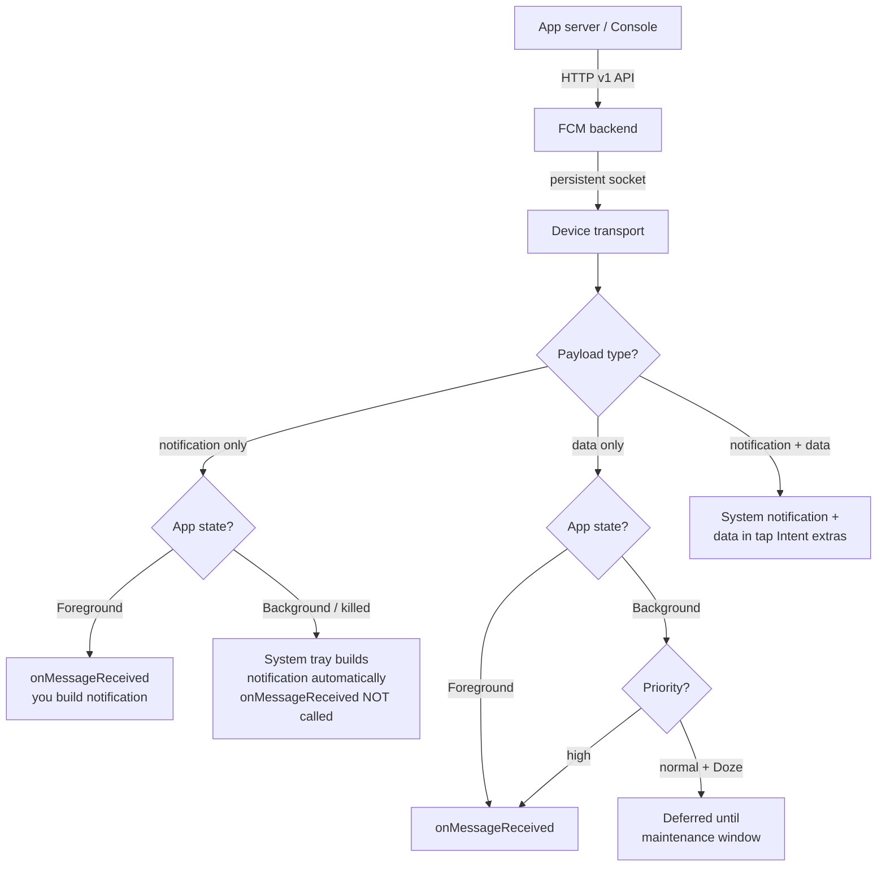

# Firebase

Firebase is Google's mobile backend-as-a-service (BaaS): a bundle of loosely-coupled products — Analytics, Crashlytics, Cloud Messaging, Remote Config, Auth, Firestore, Storage — sharing one project, one `google-services.json`, and one SDK initialization path. A senior engineer is judged less on wiring the SDKs (the Gradle plugin does most of it) and more on the **judgement calls**: what data leaves the device, how delivery degrades under Doze, what a notification vs data message actually does in the background, what Firestore costs at scale, and when Firebase is the wrong answer and you should own the backend.

## Setup

Firebase is added at two layers: the **Google Services Gradle plugin** (which reads `google-services.json` and generates resource values like the app id and API key) and the **BoM (Bill of Materials)** which pins a single, mutually-compatible set of library versions so you never hand-manage them.

```kotlin
// project build.gradle.kts — plugins block
plugins {
    id("com.google.gms.google-services") version "4.4.2" apply false
    id("com.google.firebase.crashlytics") version "3.0.2" apply false
}

// app/build.gradle.kts
plugins {
    id("com.google.gms.google-services")
    id("com.google.firebase.crashlytics")
}

dependencies {
    // BoM: import once, then declare libraries with NO version.
    implementation(platform("com.google.firebase:firebase-bom:33.7.0"))
    implementation("com.google.firebase:firebase-analytics")
    implementation("com.google.firebase:firebase-crashlytics")
    implementation("com.google.firebase:firebase-messaging")
    implementation("com.google.firebase:firebase-config")
    implementation("com.google.firebase:firebase-auth")
    implementation("com.google.firebase:firebase-firestore")
    implementation("com.google.firebase:firebase-storage")
}
```

!!! note "What google-services.json actually does"
    It is **not a secret** — it ships inside your APK and contains the project id, app id, API key, and (if present) the FCM sender id. The Gradle plugin parses it and generates string resources (`google_app_id`, `gcm_defaultSenderId`, `google_api_key`) plus `firebase_database_url`. `FirebaseApp.initializeApp()` (called automatically by a `firebase-common` ContentProvider on app start) reads those resources. Losing the file breaks the build; leaking it does **not** compromise you — access is gated by **Security Rules** and OAuth, not by the API key.

!!! tip "BoM vs pinning"
    The BoM removes the classic "Crashlytics 18 needs Analytics 21 but you have 20" version-skew bugs. You *can* still override one library's version by declaring it explicitly — but then you own the compatibility risk. Prefer bumping the BoM.

## Analytics

Firebase Analytics is event-based: you log named **events** with a `Bundle` of parameters, and set **user properties** that describe the user across all events. It's free and unlimited on event volume, and it's the backbone that Crashlytics, Remote Config audiences, and A/B testing all read from.

```kotlin
val analytics = Firebase.analytics

// Custom event
analytics.logEvent("level_complete") {
    param("level", 7L)
    param("duration_ms", 42_000L)
    param(FirebaseAnalytics.Param.SUCCESS, 1L)
}

// User property — persists, segments every future event
analytics.setUserProperty("player_tier", "premium")
```

- **Events**: up to 500 distinct event names; each event up to 25 params. Reserved names (`screen_view`, `session_start`, `first_open`) are auto-collected. Param names/values have length caps (40/100 chars).
- **User properties**: up to 25 custom; they don't retroactively apply to past events, only future ones. Never store PII (email, phone) — policy violation and a data-safety liability.
- **DebugView**: `adb shell setprop debug.firebase.analytics.app <pkg>` streams events in real time to the console (the normal path batches and uploads roughly hourly / on session end). Essential for verifying params before shipping.
- **BigQuery export**: link the project to BigQuery and every raw event lands in a dated table — this is the senior escape hatch from the sampled, aggregated console UI into SQL over unsampled event-level data (funnels, cohort retention, revenue joins). The free tier has a daily export cap; streaming export costs.

!!! warning "Analytics is not analytics-grade out of the box"
    The dashboard **samples** and **aggregates** and enforces cardinality limits; a high-cardinality param (e.g. a raw user id) gets dropped from reports. For precise product analytics wire **BigQuery export** and query the raw tables. Also: data is delayed (hours), so it is useless for real-time operational monitoring.

## Crashlytics

Crashlytics reports fatal crashes and — critically — **non-fatal** exceptions you catch and record yourself, with breadcrumb logs, custom keys, and deobfuscated stack traces.

```kotlin
val crashlytics = Firebase.crashlytics

// Custom keys: attached to every subsequent crash report — your first debugging lens
crashlytics.setCustomKey("screen", "checkout")
crashlytics.setCustomKey("cart_size", cart.itemCount)
crashlytics.setUserId(hashedUserId)   // hashed/pseudonymous, never raw PII

// Breadcrumb log — shows up in the crash's log timeline
crashlytics.log("checkout: pressed pay")

try {
    riskyPayment()
} catch (e: PaymentException) {
    // Non-fatal: recorded, app keeps running, aggregated as its own issue
    crashlytics.recordException(e)
    showError()
}
```

- **Fatal vs non-fatal**: an uncaught crash is captured by Crashlytics' `Thread.UncaughtExceptionHandler`, written to disk, and uploaded **on next launch** (not at crash time — the process is dying). `recordException()` is for handled errors you still want visibility into (a failed sync, a swallowed parse error).
- **Custom keys & logs**: keys are the current state (key→value, last-write-wins, ~64 keys); logs are the breadcrumb trail. Together they turn "NPE somewhere" into "NPE on checkout with empty cart after tapping pay."
- **De-obfuscation**: R8/ProGuard rename symbols. The Crashlytics Gradle plugin uploads the **`mapping.txt`** automatically at build time so stack traces are readable. For native crashes, upload **NDK symbols** (`uploadCrashlyticsSymbolFile` / `firebaseCrashlyticsSymbols`) so C/C++ frames symbolicate.
- **Velocity alerts**: Crashlytics emails/Slacks you when a *new* issue suddenly affects a threshold % of sessions — the signal that a release is on fire, distinct from a slow long-tail crash.
- **Issue dedup**: crashes are grouped into **issues** by a signature (top frames + exception type). The same root cause across thousands of devices collapses to one issue with a count, so you triage by impact, not by volume of raw reports.

!!! tip "Gate collection until consent"
    Set collection disabled in the manifest, then call `setCrashlyticsCollectionEnabled(true)` at runtime after the user accepts your privacy prompt. Same pattern (`setAnalyticsCollectionEnabled`) for Analytics in GDPR regions.

## Firebase Cloud Messaging (FCM)

FCM delivers messages from your server (or the console) to devices. The single most tested senior topic is the **notification-message vs data-message** distinction, because it dictates whether *your code runs* and whether the *system draws the notification* — and it differs by app state.

### Message types

| Aspect | **Notification message** | **Data message** | **Notification + data** |
|---|---|---|---|
| Payload key | `notification` | `data` | both |
| App **foreground** | `onMessageReceived` called; **you** build the notification | `onMessageReceived` called | `onMessageReceived` called (both parts in `RemoteMessage`) |
| App **background/killed** | **System** draws it from the payload; `onMessageReceived` **NOT** called | `onMessageReceived` **IS** called (subject to Doze/priority) | System draws notification; `data` delivered via the launch Intent extras when tapped |
| Where tap data goes | Launcher activity Intent extras | You control | Intent extras |
| Guaranteed to run your handler? | No (background) | Yes (foreground) / best-effort (background) | No for the notification part |

```kotlin
class MyFirebaseMessagingService : FirebaseMessagingService() {

    override fun onMessageReceived(message: RemoteMessage) {
        // Foreground for notification-type; always for data-type (when delivered).
        message.data["deep_link"]?.let { routeSilently(it) }

        // Must build the notification yourself when handling data messages
        message.notification?.let { showNotification(it.title, it.body) }
    }

    override fun onNewToken(token: String) {
        // Token rotated (reinstall, restore, data clear, periodic refresh).
        // Persist and send to your server; also (re)subscribe topics if needed.
        sendTokenToServer(token)
    }
}
```

```xml
<service
    android:name=".MyFirebaseMessagingService"
    android:exported="false">
    <intent-filter>
        <action android:name="com.google.firebase.MESSAGING_EVENT" />
    </intent-filter>
</service>
```

### Delivery path



- **Token rotation**: the registration token is the device address. It changes on reinstall, restore-to-new-device, `deleteToken()`, or app-data clear. Handle `onNewToken` and treat server-stored tokens as perishable — sends to stale tokens return `UNREGISTERED`; prune them.
- **Topics**: publish-subscribe fan-out (`subscribeToTopic("news")`). No per-device list to manage server-side; good for broadcast, bad for targeting individuals. Propagation is eventual (seconds–minutes).
- **Notification channels (Android 8+)**: every notification **must** post to a `NotificationChannel` or it silently won't show. For system-drawn notification messages, declare a default channel id via manifest metadata; for your own, create channels at startup.
- **POST_NOTIFICATIONS (Android 13+)**: notifications now require a **runtime** permission. Without it, both system-drawn and your own notifications are suppressed — but `onMessageReceived` for data messages still runs. See [Permissions](22-permissions.md) for the request flow and the "permanently denied" edge case.
- **High-priority & Doze**: `normal` priority data messages are batched and held during **Doze**; `high` priority can wake the device / temporarily exit Doze and run your handler immediately (use it only for genuinely time-sensitive content — chat, alerts — because it's rate-limited and abuse hurts deliverability). Notification messages are treated as high priority by default.

!!! warning "The classic background-handler bug"
    "My `onMessageReceived` doesn't fire when the app is backgrounded." If the payload contains a `notification` block, the **system** handles it in background and your code never runs. Fix: send a **data-only** message (drop the `notification` key) so `onMessageReceived` is always the entry point, then build the notification yourself. This is the correct pattern when you need deep-linking, a custom layout, or silent data sync.

## Remote Config

Remote Config is server-controlled key/value pairs for **feature flags, kill switches, gradual rollouts, and A/B tests** — change app behavior without shipping a release.

```kotlin
val remoteConfig = Firebase.remoteConfig

remoteConfig.setConfigSettingsAsync(
    remoteConfigSettings {
        // Prod: 12h. Dev: 0 so you see changes instantly (never ship 0).
        minimumFetchIntervalInSeconds = if (BuildConfig.DEBUG) 0 else 43_200
        fetchTimeoutInSeconds = 15
    }
)
// Baked-in defaults: used before/if a fetch never lands (offline first launch).
remoteConfig.setDefaultsAsync(R.xml.remote_config_defaults)

// fetch() pulls to cache; activate() promotes cache to the values getters return.
remoteConfig.fetchAndActivate().addOnCompleteListener { task ->
    val updated = task.result   // true if new values were activated
    val enabled = remoteConfig.getBoolean("new_checkout_enabled")
    val limit   = remoteConfig.getLong("upload_limit_mb")
}
```

- **fetch vs activate**: `fetch()` downloads values into a local cache; `activate()` makes them the live values. Splitting them lets you fetch in the background but activate at a safe boundary (next screen, next launch) to avoid config changing mid-session. `fetchAndActivate()` does both.
- **`minimumFetchInterval`**: server-fetch throttle (default 12h). Fetches inside the window return cached values without hitting the network — prevents hammering and quota throttling. Set to 0 **only** in debug.
- **`fetchTimeout`**: how long to wait for the network before falling back to cached/default values — keeps a slow network from blocking your gate.
- **Defaults**: the values used when nothing has been fetched yet (first launch offline). Always ship sensible defaults so the app is correct with zero connectivity.
- **Conditions**: server-side rules target by app version, country, language, user property, audience, or random-percentile — this is how you do **gradual rollouts** (10% → 50% → 100%) and **kill switches** (flip a flag to disable a broken feature for everyone without an app update).

!!! tip "Kill switch pattern"
    Wrap risky features in `if (remoteConfig.getBoolean("feature_x_enabled"))`. If feature X starts crashing in production, flip the flag server-side and the next fetch disables it — no release, no review latency. Pair with a **realtime** listener (`addOnConfigUpdateListener`) if you need push-style propagation instead of poll-on-launch.

## Authentication

Firebase Auth manages identity across providers and hands you a `FirebaseUser` plus signed **ID tokens** your backend can verify.

- **Providers**: email/password, phone (SMS OTP), Google, Apple, Facebook, GitHub, anonymous, and custom tokens (bridge your own auth system). Anonymous auth is useful to persist state before sign-up, then **link** to a real credential later.
- **`FirebaseUser`**: `uid` (stable identifier — use as the Firestore document key / Storage path segment), `email`, `isEmailVerified`, provider data. `Firebase.auth.currentUser` is `null` when signed out; observe `AuthStateListener` for changes.
- **ID tokens**: a short-lived (1h) JWT. `user.getIdToken(forceRefresh)` returns it; send it in an `Authorization` header and your backend verifies it with the Admin SDK — this is how you authenticate your *own* server without handling passwords. **Custom claims** (set server-side) ride in the token for role-based access (`admin: true`) and are readable in Security Rules.

```kotlin
Firebase.auth.currentUser?.getIdToken(false)
    ?.addOnSuccessListener { result -> callBackend(bearer = result.token) }
```

## Cloud Firestore

Firestore is a document database: **documents** (JSON-like maps, max 1 MiB) live in **collections**, nest into **subcollections**, and support **realtime snapshot listeners** and **offline persistence**.

```kotlin
val db = Firebase.firestore

// Realtime listener — fires immediately with cached data, then on every change.
val registration = db.collection("rooms").document(roomId)
    .collection("messages")
    .orderBy("createdAt", Query.Direction.DESCENDING)
    .limit(50)
    .addSnapshotListener { snapshot, error ->
        if (error != null) { /* handle */ return@addSnapshotListener }
        val fromCache   = snapshot?.metadata?.isFromCache == true      // offline?
        val hasPending  = snapshot?.metadata?.hasPendingWrites() == true
        val messages    = snapshot?.toObjects(Message::class.java).orEmpty()
        render(messages)
    }
// Detach in onStop/onCleared to stop billing & callbacks:
registration.remove()
```

- **Realtime listeners**: `addSnapshotListener` pushes changes over a persistent connection; with offline persistence it emits the **cached** snapshot instantly (`isFromCache`) then reconciles when online. `snapshot.documentChanges` gives you ADDED/MODIFIED/REMOVED deltas for efficient list diffing.
- **Offline persistence**: enabled by default on Android. Reads hit local cache; writes queue locally, resolve optimistically (listeners fire with `hasPendingWrites`), and sync when connectivity returns. This is Firestore's headline feature over a raw REST backend.
- **Security Rules**: server-enforced auth/validation expressed declaratively (`allow read: if request.auth.uid == resource.data.ownerId`). **Rules are your access control** — the client SDK is untrusted. Rules are not filters: a query must be provably allowed by the rules or it's rejected wholesale.
- **Query limits**: no native `OR` across different fields (use `whereIn`/`arrayContainsAny`, ≤30 values, or split queries), no full-text search (offload to Algolia/Typesense), range/inequality filters limited to a single field, and every non-trivial query needs a **composite index** (the SDK logs a console link to auto-create it). Sustained writes are ~1/sec per document (hotspotting).

### Firestore vs Realtime Database

| Dimension | **Cloud Firestore** | **Realtime Database** |
|---|---|---|
| Data model | Documents & collections | One giant JSON tree |
| Queries | Compound, indexed, sorting + filtering | Limited: one property, deep-path awkward |
| Scaling | Auto, multi-region, horizontal | Single-region per DB, sharding is manual |
| Offline | Android + iOS + web | Android + iOS only |
| Pricing | Per **operation** (reads/writes/deletes) + storage | Per **bandwidth** (GB downloaded) + storage |
| Best for | Structured, queryable app data at scale | Ultra-low-latency presence, live cursors, small state |

!!! note "Cost trap: listeners bill per document"
    A snapshot listener on a 50-doc query charges **50 reads** on attach, then 1 read per changed doc. A poorly-scoped listener (no `limit`, re-attached on every recomposition/navigation) silently multiplies reads and your bill. Always `limit()`, detach in lifecycle callbacks, and prefer narrow queries over "fetch all then filter client-side."

## Cloud Storage

Firebase Storage wraps a Google Cloud Storage bucket for user-generated files (images, video, audio) with resumable up/downloads and its own Security Rules.

```kotlin
val ref = Firebase.storage.reference.child("avatars/${user.uid}.jpg")

ref.putFile(localUri)
    .addOnProgressListener { t -> val pct = 100.0 * t.bytesTransferred / t.totalByteCount }
    .continueWithTask { ref.downloadUrl }          // resolve a shareable URL
    .addOnSuccessListener { uri -> saveAvatarUrl(uri) }
```

- Uploads/downloads are **resumable** and survive process death (`getActiveUploadTasks`). Serve large media by URL to an image loader (Coil/Glide) rather than buffering bytes yourself.
- **Storage Security Rules** are separate from Firestore rules but share the same auth context — e.g. `allow write: if request.auth.uid == userId && request.resource.size < 5 * 1024 * 1024 && request.resource.contentType.matches('image/.*')`. Enforce size and content-type at the rule layer; never trust the client.

## Senior framing: cost, lock-in, and when to own the backend

!!! abstract "The judgement questions an interviewer is really asking"
    - **Cost model**: Firestore bills **per operation** — cheap at low scale, potentially brutal at high read fan-out (chat, feeds, dashboards). Model your read amplification before committing: one screen open = how many document reads × DAU? Analytics/Crashlytics/FCM are free; Firestore/Storage/phone-Auth are the meters that spin.
    - **Vendor lock-in**: Security Rules, Firestore's query semantics, and the offline cache are Firebase-specific — there's no drop-in replacement, and migrating off is a rewrite. Analytics + Crashlytics + FCM are low-lock (swappable); Firestore + Auth + Rules are high-lock.
    - **Firebase vs own backend**: Firebase wins for **speed-to-market, realtime, and offline-first** with a small team and no ops. An owned backend (Postgres + your API) wins when you need **complex relational queries, transactions across many entities, full-text search, strict cost control at scale, or data residency** you fully govern. A common mature architecture is **hybrid**: Firebase for Auth + FCM + Crashlytics + Analytics, your own backend for the core domain data.
    - **Offline behavior**: Firestore's optimistic local writes are a feature *and* a hazard — the UI shows success before the server confirms, so you must design for eventual reconciliation (conflict resolution, `hasPendingWrites`, server timestamps via `FieldValue.serverTimestamp()`).

---

## Interview Q&A

!!! question "1. A notification arrives fine when the app is open but does nothing when it's backgrounded, and I never see my logs. Why?"
    **Answer:** The server is sending a **notification message** (payload has a `notification` block). When the app is in the background or killed, FCM hands notification messages to the **system tray**, which builds and posts the notification itself — your `onMessageReceived` is **not** invoked. In the foreground it *is* invoked, which is why it "works" when open. Fix: send a **data-only** message (drop `notification`, put everything in `data`), so `onMessageReceived` is the single entry point in every app state, and build the notification yourself. You'll then also need to create/target a NotificationChannel and hold `POST_NOTIFICATIONS` on Android 13+.

    *Follow-up: What's the downside of data-only messages?* Normal-priority data messages can be deferred by Doze/App Standby; you may need `high` priority for time-sensitive content, which is rate-limited, and you lose the "free" system-drawn notification, so you own channel/importance/insistent behavior yourself.

!!! question "2. Walk me through fetch vs activate in Remote Config and why they're separate."
    **Answer:** `fetch()` downloads the latest values from the server into a **local cache**; `activate()` promotes that cache to be the values the getters return. They're split so you can fetch in the background yet **activate at a safe boundary** — you don't want a feature flag flipping in the middle of a user's session or a checkout flow. Typical pattern: `fetch()` on launch, `activate()` at the *next* launch or a screen transition. `fetchAndActivate()` collapses both when you don't care. Throttling is governed by `minimumFetchInterval` (default 12h; fetches inside the window return cache to protect quota), and `fetchTimeout` bounds how long you wait before falling back to cached/default values.

    *Follow-up: You set minimumFetchInterval to 0 and now config isn't updating in production — what happened?* 0 is dev-only; in production Firebase **server-side throttles** aggressive clients and starts returning `THROTTLED`, so you get stale values. Ship 12h (or use `addOnConfigUpdateListener` for realtime push) and keep 0 behind `BuildConfig.DEBUG`.

!!! question "3. How does Crashlytics turn an obfuscated, aggregated crash flood into something you can act on?"
    **Answer:** Three mechanisms. **De-obfuscation:** the Crashlytics Gradle plugin uploads `mapping.txt` at build time (and NDK symbol files for native), so R8-renamed frames symbolicate back to real names. **Issue dedup:** crashes are grouped into a single *issue* by a signature (exception type + top frames), so a bug hitting 10k devices is one triageable issue with an impact count, not 10k reports. **Context:** custom keys (current state, last-write-wins) + breadcrumb logs + affected user/session counts + app version/OS turn "NPE somewhere" into "NPE on checkout, empty cart, only on v4.2, Android 14." **Velocity alerts** then notify you the moment a *new* issue spikes past a session-% threshold, catching a bad release fast.

    *Follow-up: Fatal vs non-fatal — when is each uploaded?* A fatal (uncaught) crash is written to disk by the uncaught-exception handler and uploaded **on next launch** (the process is dying). A non-fatal `recordException()` is for handled errors and is queued and uploaded while the app keeps running.

!!! question "4. When would you NOT use Firestore, and what would you use instead?"
    **Answer:** Avoid Firestore when you need **complex relational/aggregate queries** (joins, `GROUP BY`, multi-field `OR`, full-text search), **multi-entity transactions**, tight **cost control under heavy read fan-out** (feeds, dashboards, analytics reads where per-operation billing explodes), or strict **data-residency/governance**. In those cases an owned backend (Postgres + an API, or a search engine like Algolia/Typesense for text) fits better. Firestore excels at **realtime, offline-first, document-shaped app data** with a small team and no ops. Mature apps often go **hybrid**: Firebase for Auth/FCM/Crashlytics/Analytics, owned backend for core domain data.

    *Follow-up: How do you handle "search users by name" in Firestore?* You don't do it natively — no full-text index. Either denormalize prefixes and range-query, or (properly) mirror the collection into Algolia/Typesense/Elasticsearch via a Cloud Function and query that.

!!! question "5. What are the cost and correctness traps with Firestore snapshot listeners and offline persistence?"
    **Answer:** **Cost:** a listener bills a document read on initial attach for every doc in the result set (a `limit(50)` query = 50 reads), then 1 read per changed doc; re-attaching listeners on every recomposition/navigation, or listening to unbounded queries, silently multiplies your bill — so always `limit()`, scope narrowly, and **detach in `onStop`/`onCleared`**. **Correctness:** with offline persistence (on by default) listeners fire immediately from **cache** (`metadata.isFromCache`) and local writes resolve optimistically (`metadata.hasPendingWrites()`) *before* the server confirms — the UI can show success that later fails or reorders. You must design for eventual reconciliation and use `FieldValue.serverTimestamp()` rather than device clocks.

    *Follow-up: A client says a write "succeeded" offline but the server later rejects it — how?* Security Rules run **server-side** only; the optimistic local write passes the offline cache but can be rejected on sync (rule failure, contention). Your listener will then emit the corrected state, so never treat a pending-write callback as durable success.
