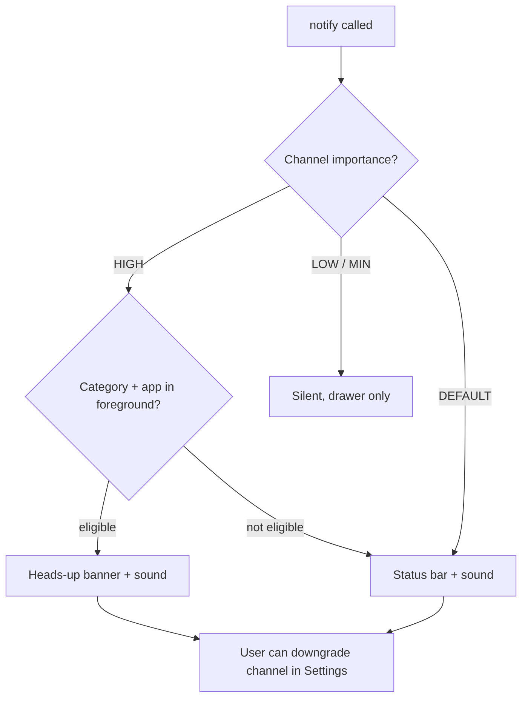

# Advanced Topics

A breadth module. Each section is a senior-level briefing: **when/why you reach for it**, the API shape, and **one gotcha** that separates people who have shipped it from people who have only read about it. Depth lives in dedicated modules — this is the surface area an Android senior is expected to speak to fluently in an interview or design review.

---

## Custom Notifications

Notifications are a **contract with the system UI**, not a widget you own. You describe intent (importance, category, style, actions) and the OS decides how loud it gets.

### Channels (Android 8+, API 26)

Every notification must belong to a `NotificationChannel`. The channel — not the individual notification — owns the **importance**, sound, vibration, and light. Once created, a channel's importance is **user-controlled and immutable from code**; you can only lower it, never raise it. Design your channels once and keep IDs stable.

| Importance | Constant | Behavior |
|---|---|---|
| Urgent | `IMPORTANCE_HIGH` | Heads-up + sound |
| High | `IMPORTANCE_DEFAULT` | Sound, no heads-up |
| Medium | `IMPORTANCE_LOW` | No sound |
| Low | `IMPORTANCE_MIN` | Collapsed, no icon in status bar |



!!! warning "Gotcha: channel importance is sticky"
    Shipping a channel at `IMPORTANCE_LOW` and later "upgrading" it in code does nothing — the user's setting wins forever. If you got importance wrong at launch, your only clean fix is a **new channel ID** (and migrating users off the old one). Pick importance deliberately on day one.

### Styles

`NotificationCompat` (from AndroidX) is always preferred over the platform `Notification.Builder` — it backports styles and defaults.

- **`BigTextStyle`** — expandable long text (email preview, message body). Most common.
- **`BigPictureStyle`** — a large image below the notification (photo share, media art).
- **`InboxStyle`** — up to ~6 summary lines ("5 new messages").
- **`MessagingStyle`** — the correct style for chat; renders sender avatars, supports inline reply, and is required for **conversation** notifications and bubbles.
- **`MediaStyle`** — transport controls bound to a `MediaSession`; the system renders the seekbar and routes hardware media keys. Never hand-roll play/pause buttons for media.

### Actions, RemoteViews, and POST_NOTIFICATIONS

`addAction()` attaches up to 3 buttons backed by a `PendingIntent`. Use `RemoteInput` for **inline reply** (no Activity launch). Custom `RemoteViews` (`setCustomContentView`) give you a fully bespoke layout, but RemoteViews is a **restricted, cross-process view subset** — no custom views, no data binding, limited widgets — and it will not adopt Material You theming on newer OS versions the way decorated styles do. Reach for it only when a built-in style genuinely can't express the layout.

On **Android 13+ (API 33)** you must request the runtime `POST_NOTIFICATIONS` permission or `notify()` is silently dropped. See [Permissions](22-permissions.md) for the request flow and rationale UI.

```kotlin
val channelId = "chat_messages"

// Create channel once (idempotent) — do this at app start.
NotificationManagerCompat.from(context).createNotificationChannel(
    NotificationChannelCompat.Builder(channelId, NotificationManagerCompat.IMPORTANCE_HIGH)
        .setName("Messages")
        .setDescription("Direct messages")
        .build()
)

val replyPending = PendingIntent.getBroadcast(
    context, 0, Intent(context, ReplyReceiver::class.java),
    PendingIntent.FLAG_UPDATE_CURRENT or PendingIntent.FLAG_MUTABLE // MUTABLE required for RemoteInput
)

val reply = NotificationCompat.Action.Builder(
    R.drawable.ic_reply, "Reply", replyPending
).addRemoteInput(RemoteInput.Builder("key_reply").setLabel("Message").build()).build()

val notification = NotificationCompat.Builder(context, channelId)
    .setSmallIcon(R.drawable.ic_msg)
    .setContentTitle("Ada Lovelace")
    .setContentText("Are we still on for tomorrow?")
    .setStyle(NotificationCompat.BigTextStyle().bigText("Are we still on for tomorrow? Ping me."))
    .addAction(reply)
    .setPriority(NotificationCompat.PRIORITY_HIGH) // pre-26 fallback; channel wins on 26+
    .setAutoCancel(true)
    .build()

// API 33+: guard on POST_NOTIFICATIONS being granted before calling notify().
NotificationManagerCompat.from(context).notify(42, notification)
```

!!! tip "PendingIntent mutability"
    Since API 31 you **must** specify `FLAG_IMMUTABLE` or `FLAG_MUTABLE`. Default to `IMMUTABLE`; only `RemoteInput`-backed actions need `MUTABLE`.

---

## App Widgets

Home-screen widgets are separate processes rendering **your** `RemoteViews` inside the launcher. You never get a live `View` tree — you push immutable view descriptions.

- **`AppWidgetProvider`** is a `BroadcastReceiver`; `onUpdate()` is your main entry point. Declare it in the manifest with an `<appwidget-provider>` metadata XML (initial layout, sizing, `updatePeriodMillis`).
- **`updatePeriodMillis` is clamped to a 30-minute minimum**, and the system batches wakeups — you cannot get a per-minute clock this way. For anything more frequent or event-driven, drive updates from **WorkManager** or an `AlarmManager` exact alarm and call `AppWidgetManager.updateAppWidget()`.
- Collection widgets (lists/grids) need a `RemoteViewsService` + `RemoteViewsFactory`.

**Glance** is the modern path: Compose-style API (`@Composable` `GlanceModifier`, `Column`, `Button`) that compiles down to RemoteViews. It removes almost all RemoteViews boilerplate and is the recommended way to build new widgets. State flows through `GlanceStateDefinition` / `updateAll`.

!!! warning "Gotcha: RemoteViews ≠ Views"
    Only a whitelisted set of layouts/widgets works in RemoteViews. Custom views, `ConstraintLayout` behaviors, fragments, and arbitrary attributes are unsupported — you'll get a silent `RemoteViews` inflation failure at runtime, not a compile error. Glance shields you from most of this but the underlying constraint still applies to what it can render.

---

## App Shortcuts

Deep links into specific actions, surfaced on long-press of the launcher icon.

| Type | Defined | Lifetime |
|---|---|---|
| **Static** | `res/xml/shortcuts.xml` (manifest `meta-data`) | Fixed at build/install; changes require an app update |
| **Dynamic** | `ShortcutManagerCompat.pushDynamicShortcut()` at runtime | You add/update/remove; max ~5 shown; ranked by `setRank()` |
| **Pinned** | User (or you, via `requestPinShortcut()`) places on home screen | Persist until user removes |

Report usage with `ShortcutManagerCompat.reportShortcutUsed()` so the launcher and Assistant can rank/predict them. Shortcuts double as **Google Assistant / App Actions** targets when tagged with capabilities.

!!! warning "Gotcha: the 5-shortcut budget and shifting focus"
    `getMaxShortcutCountPerActivity()` is typically 5 across static + dynamic combined. Pushing more silently drops the lowest-ranked. Also, don't churn dynamic shortcuts on every screen change — the launcher caches and rate-limits, and rapid `setDynamicShortcuts` calls get throttled.

---

## Slices

`androidx.slice` let apps surface interactive templated content inside other surfaces (originally Google Search / Assistant).

!!! note "Deprecated"
    Slices are **deprecated** and were never widely adopted as a surface. Do not build new Slice integrations. For structured OS-surfaced content today, use **App Actions / shortcuts capabilities** and **Glance widgets** instead. Know the term for legacy code, but treat it as end-of-life.

---

## Multi-Window & Split-Screen

Since Android 7 (API 24), users can run two apps side-by-side; on large screens and foldables this is the norm, not the exception.

- **`android:resizeableActivity`** — defaults to `true` on modern target SDKs. Setting it `false` opts you out and shows a letterboxed/compat window; reviewers and OEMs increasingly penalize this. Assume you are resizable.
- A resize is a **configuration change** — by default your Activity is recreated. Handle it like any rotation: hoist state, use `ViewModel`/`rememberSaveable`, or (rarely) declare `configChanges` and handle `onConfigurationChanged`.
- **Multi-resume (API 29+):** on large screens, multiple visible activities can all be `RESUMED` simultaneously. You can no longer assume "resumed = the one the user is touching." Gate exclusive hardware (camera, mic) on **focus** (`onTopResumedActivityChanged`), not lifecycle state.

!!! warning "Gotcha: don't equate onPause with 'not visible'"
    In multi-window, your unfocused activity may be fully visible while another app has focus. Pausing playback or releasing the camera on `onPause` will misbehave. Tie exclusive resources to `onTopResumedActivityChanged` / `onStop`, not `onPause`.

---

## Picture-in-Picture (PiP)

A floating, always-on-top mini window — the canonical use is video that keeps playing while the user does something else.

```kotlin
fun enterPip() {
    val params = PictureInPictureParams.Builder()
        .setAspectRatio(Rational(16, 9))
        .setActions(listOf(/* RemoteAction play/pause */))
        .setAutoEnterEnabled(true)     // API 31+: seamless enter on Home gesture
        .setSeamlessResizeEnabled(true)
        .build()
    enterPictureInPictureMode(params)
}
```

- Declare `android:supportsPictureInPicture="true"` **and** `android:configChanges` for `screenSize|smallestScreenSize|screenLayout|orientation` on the Activity — otherwise entering PiP recreates it.
- In PiP, `onPictureInPictureModeChanged` fires. **Hide all non-essential UI** (controls, ads, text) — the window is tiny and the system will complain if it's cluttered.
- Actions inside PiP are `RemoteAction`s (icon + PendingIntent), same restricted model as notifications.

!!! warning "Gotcha: auto-enter vs. manual"
    Pre-31 you had to call `enterPictureInPictureMode()` in `onUserLeaveHint()` to catch the Home press. On 31+, `setAutoEnterEnabled(true)` handles the gesture seamlessly and avoids the janky "shrink after leaving" animation. Support both paths by SDK level.

---

## Accessibility

Accessibility is a **correctness requirement**, not a nice-to-have — and Play's pre-launch report flags violations.

- **`contentDescription`** on every non-decorative image/icon; set it to `null` (not empty) for purely decorative elements so TalkBack skips them. In Compose use `Modifier.semantics { contentDescription = ... }` or the `contentDescription` param; mark decorative with `null`.
- **Touch targets ≥ 48dp × 48dp** — enforce with `minimumInteractiveComponentSize()` / `Modifier.sizeIn` in Compose or padding in Views. Small tap targets are the single most common Scanner finding.
- **TalkBack** reads the view tree in **focus order**; group related content (`Modifier.semantics(mergeDescendants = true)`, or `focusable` + `traversalIndex`) so a card reads as one unit, not five fragments.
- **Contrast** ≥ 4.5:1 for body text.
- Test with the **Accessibility Scanner** app and by actually navigating with TalkBack + a swipe — automated checks miss illogical focus order and unlabeled state.

!!! warning "Gotcha: custom-drawn / Canvas UI is invisible to TalkBack"
    A `Canvas` chart or custom-drawn control has no semantic tree by default — it's a black hole for screen readers. You must attach explicit `semantics {}` (Compose) or an `AccessibilityDelegate` with a virtual view hierarchy (Views). This is routinely forgotten on game boards and data-viz.

---

## Localization & i18n

Never hardcode a user-facing string, number, date, or currency.

- **Resource qualifiers:** `values-fr/`, `values-es-rMX/`, `values-b+sr+Latn/` (BCP-47). The system picks the best match against the user's locale list.
- **Plurals:** use `<plurals>` with `quantity` (`one`, `few`, `many`, `other`) and `getQuantityString()` — **never** build "1 item"/"2 items" with an `if`. Languages have up to 6 plural categories; your `if (n == 1)` is wrong in Polish/Arabic/Russian.
- **Formatting:** format numbers/dates/currency with `NumberFormat`/`DateTimeFormatter` **for the locale**, not `String.format` with a hardcoded pattern. `1,000.5` vs `1.000,5` vs `١٬٠٠٠٫٥`.
- **Per-app language (Android 13+, API 33):** users can set a language for your app independent of the system, via Settings or your own UI backed by `LocaleManager` / `AppCompatDelegate.setApplicationLocales()`. Ship a `locales_config.xml` listing supported locales so your app appears in the system per-app language screen.

```kotlin
// Per-app locale (AppCompat backports below API 33 automatically).
AppCompatDelegate.setApplicationLocales(
    LocaleListCompat.forLanguageTags("fr-FR")
)

// Or the platform API directly on 33+:
getSystemService(LocaleManager::class.java)
    .applicationLocales = LocaleList.forLanguageTags("fr-FR")
```

!!! warning "Gotcha: locale change recreates activities"
    `setApplicationLocales` triggers a configuration change and recreates your Activity stack — persist any transient UI state first. Also, the string catalog is resolved at inflation time; strings you cached in a `val` before the change will be stale.

---

## RTL (Right-to-Left)

Arabic, Hebrew, Farsi, Urdu mirror the entire layout.

- Declare `android:supportsRtl="true"` (default on modern targets).
- Use **`start`/`end`**, never **`left`/`right`** — `paddingStart`, `layout_marginEnd`, `drawableStart`, `gravity="start"`. In Compose, `PaddingValues(start=…, end=…)` and `Arrangement.Start` are already direction-aware.
- Query direction with `View.layoutDirection` / `LocalLayoutDirection`.
- **Mirror directional icons** (back arrows, "next" chevrons, progress) with `android:autoMirrored="true"` on the drawable. Do **not** mirror logos, media transport (play is always ▶), phone numbers, or clock faces.

!!! warning "Gotcha: hardcoded left/right survives review but breaks RTL"
    A `paddingLeft="16dp"` compiles, passes tests in English, and silently produces broken Arabic layouts. Lint has an RTL check (`RtlHardcoded`) — keep it as an **error**, not a warning, so it can't merge.

---

## Animations

### Property animation vs. view animation

- **View animation** (`android.view.animation`, the old `Animation`/`TweenAnimation`) only changes how a view is *drawn* — the actual layout bounds and click target don't move. Legacy; avoid for anything interactive.
- **Property animation** (`android.animation`) mutates real object properties (`translationX`, `alpha`, `rotation`), so hit-testing follows the pixels. This is the correct default.

`ValueAnimator` gives you a raw animated value to apply yourself; `ObjectAnimator` animates a named property directly; `AnimatorSet` sequences/parallelizes them.

```kotlin
val fade = ObjectAnimator.ofFloat(view, View.ALPHA, 0f, 1f)
val slide = ObjectAnimator.ofFloat(view, View.TRANSLATION_Y, 120f, 0f).apply {
    interpolator = OvershootInterpolator()
}
AnimatorSet().apply {
    playTogether(fade, slide)
    duration = 300
    start()
}
```

- **MotionLayout** — a `ConstraintLayout` subclass driving complex, gesture-linked transitions between two `ConstraintSet`s via an XML `MotionScene`. Great for collapsing toolbars and choreographed multi-view motion; heavy for simple cases.
- **Physics-based** (`androidx.dynamicanimation`) — `SpringAnimation` and `FlingAnimation` produce natural, interruptible motion driven by velocity/stiffness rather than a fixed duration. Use for anything that should feel like it has momentum (drag-to-dismiss, overscroll).

### Compose animations (parallel model)

Compose has its own system: `animate*AsState` for fire-and-forget value animation, `Animatable` for imperative/interruptible control, `updateTransition` for coordinated multi-property changes, `AnimatedVisibility`/`AnimatedContent` for enter/exit, and `spring()`/`tween()`/`keyframes()` specs. It is **not** interoperable with `ObjectAnimator` — you don't drive Compose state from the View animation framework.

!!! warning "Gotcha: leaking animators / recomposition storms"
    In Views, an `ObjectAnimator` holds a reference to its target — cancel it in `onDetachedFromWindow`/`onStop` or you leak the view. In Compose, animating a value that's read in a wide scope re-runs recomposition every frame; keep animated reads in the smallest possible composable (or use the graphics-layer/`drawBehind` lambda) to stay in the draw phase.

---

## Predictive Back

Android 13 (API 33) introduced predictive back gesture; Android 14 (API 34) shipped the polished cross-activity and in-app animations.

- Opt in with `android:enableOnBackInvokedCallback="true"` in the manifest `<application>`.
- Migrate off the deprecated `onBackPressed()` to the **`OnBackInvokedCallback`** (platform) or **`OnBackPressedDispatcher` + `OnBackPressedCallback`** (AndroidX, preferred — backports cleanly). AndroidX Activity/Fragment/Navigation already route through the dispatcher.
- Predictive back needs the **ahead-of-time** callback contract: the system asks "will you handle back?" *before* the gesture commits, so it can render the peek animation. `onBackPressed()` can't answer that question, which is why it's deprecated.

!!! warning "Gotcha: enabling the flag exposes stale back handling"
    Flipping `enableOnBackInvokedCallback=true` while still overriding `onBackPressed()` means your custom back logic is **ignored** — the platform uses the new callback path. Enable the flag only after every back handler is migrated to `OnBackPressedDispatcher`, or users will exit screens you meant to intercept.

---

## Interview Q&A

??? question "1. Why can't you change a notification channel's importance from code after creating it, and how do you recover from shipping the wrong importance?"
    Channel settings (importance, sound, vibration) become **user-owned** the moment the channel is created — the OS treats them as user preferences and code may only *lower* importance, never raise it. This prevents apps from escalating themselves to heads-up after the user quieted them. If you launched at the wrong importance, the fix is to create a **new channel with a new ID** at the correct importance and stop posting to the old one (optionally deleting it). You cannot mutate the existing channel up.

    **Follow-up:** *What decides whether a HIGH-importance notification actually shows a heads-up banner?* Importance `HIGH` plus eligibility: the notification must not be suppressed by DND/policy, and category/foreground rules apply. Importance is necessary but the system still arbitrates the final presentation.

??? question "2. `updatePeriodMillis` on an app widget is set to 60000 (1 minute) but it only updates every ~30 minutes. Why, and how do you get faster updates?"
    The framework **clamps `updatePeriodMillis` to a 30-minute minimum** and batches these wakeups across widgets to save battery — anything smaller is silently rounded up. For faster or event-driven updates you drive it yourself: schedule **WorkManager** (for periodic-but-flexible) or an `AlarmManager` exact alarm (for precise clocks), and in that work call `AppWidgetManager.updateAppWidget()` with fresh `RemoteViews`.

    **Follow-up:** *Why can't a widget just hold a `Handler` posting every second?* The widget host is a **separate process** (the launcher); your app process isn't even alive between updates. There's no live view or coroutine scope to post to — you can only push immutable `RemoteViews` snapshots when the system wakes you.

??? question "3. In multi-window, your video keeps playing when the user taps the other app. You paused on `onPause` — why didn't it fire, and what's the correct signal?"
    In multi-window (and multi-resume on API 29+ large screens), your Activity can remain **visible and even `RESUMED`** while another window holds focus, so `onPause` doesn't fire. The correct lifecycle-independent signal for "am I the one the user is interacting with" is **`onTopResumedActivityChanged(isTopResumedActivity)`**. Gate exclusive resources (camera, mic, active playback control) on top-resumed state, and use `onStop` for genuine invisibility.

    **Follow-up:** *How does this interact with PiP?* Entering PiP fires `onPictureInPictureModeChanged`; you keep playing but strip UI to essentials. If you also handle top-resumed, note the PiP window is typically not the top-resumed activity, so don't tear down playback there.

??? question "4. Why is `getQuantityString` with `<plurals>` required instead of `if (count == 1) \"item\" else \"items\"`, and why can `values-ar` still look wrong even with correct plurals?"
    Plural rules are **language-specific and non-binary**: Arabic has six categories (zero/one/two/few/many/other), Russian and Polish have several, and the boundary isn't just "== 1". `<plurals>` + `getQuantityString()` lets the platform's CLDR rules pick the right form per locale; a hand-rolled `if` is correct only for English-like languages. Arabic can *also* look wrong for a separate reason — **RTL layout and numeral formatting** — so you additionally need `supportsRtl`, `start/end` attributes, mirrored directional icons, and locale-aware `NumberFormat`.

    **Follow-up:** *Where do you enforce this in CI?* Keep Lint's `RtlHardcoded` and missing-quantity checks at **error** severity so hardcoded `left/right` and non-plural counts fail the build rather than merge silently.

??? question "5. What breaks if you set `android:enableOnBackInvokedCallback=\"true\"` but still override `onBackPressed()`?"
    On API 33+, enabling the flag routes back through the **`OnBackInvokedCallback`** path so the system can render the predictive peek animation. Your `onBackPressed()` override is then **bypassed** — any custom back logic (confirm-exit dialogs, closing a drawer, popping a nested state) stops working, and users exit screens you meant to intercept. The fix is to migrate all back handling to the AndroidX **`OnBackPressedDispatcher` + `OnBackPressedCallback`** (which supports the ahead-of-time "will you handle back?" contract predictive back needs) *before* enabling the flag.

    **Follow-up:** *Why is `onBackPressed()` fundamentally incompatible with predictive back?* Predictive back must know **before** the gesture commits whether you'll consume it, so it can animate the peek. `onBackPressed()` is a fire-after-the-fact callback with no way to answer that question, which is exactly why it's deprecated in favor of the callback-based dispatcher.
