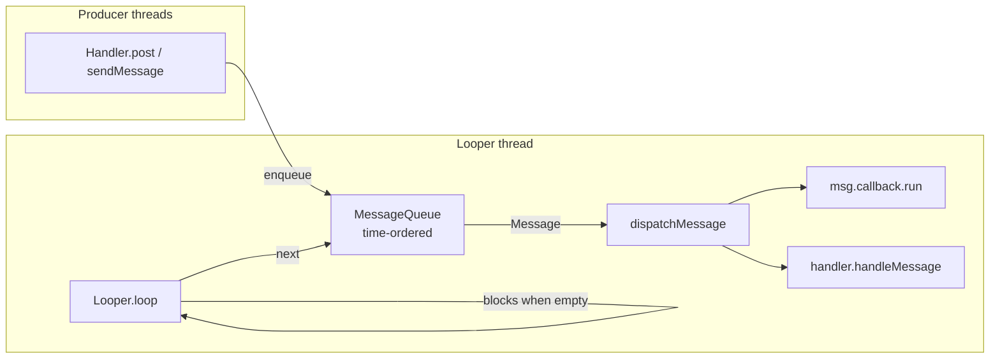

# View & Framework Extras

This module closes the smaller framework topics — collections, the thread-messaging model, surfaces, units, drawables, `WebView`, `androidx.core`, and crash tracing — that round out the Manifest interview book.

## SparseArray / ArrayMap vs HashMap

`HashMap<Integer, V>` on Android is quietly expensive. Every `int` key is **autoboxed** into an `Integer` object, and every mapping allocates an internal `HashMap.Node` (or `Entry`) object holding key/value/hash/next pointers. For a map of a few thousand entries you pay in heap churn, GC pressure, and cache misses.

`SparseArray<V>` (and its siblings) replace that with **two parallel primitive arrays** — an `int[]` of keys kept sorted, and an `Object[]` of values. No boxing, no node objects.

| | `HashMap<Integer,V>` | `SparseArray<V>` | `ArrayMap<K,V>` |
|---|---|---|---|
| Key type | `Integer` (boxed) | primitive `int` | any object |
| Backing store | bucket array of Node objects | `int[]` + `Object[]` | hash `int[]` + `Object[]` |
| Lookup | O(1) hash | O(log n) binary search | O(log n) binary search |
| Boxing | yes | none | none for values |
| Extra allocations | 1 Node per entry | 0 | 0 |
| Best at | large maps, frequent random access | small–medium int-keyed maps | small object-keyed maps |

### The variants

- `SparseArray<V>` — `int` → object
- `SparseIntArray` — `int` → `int` (no boxing on either side)
- `SparseLongArray` / `SparseBooleanArray` — `int` → `long` / `boolean`
- `LongSparseArray<V>` — `long` → object
- `ArrayMap<K,V>` / `ArraySet<E>` — object keys, same memory philosophy, drop-in for `HashMap`/`HashSet`

```kotlin
// int-keyed, zero boxing
val scores = SparseIntArray()
scores.put(42, 100)
scores.put(7, 250)
val s = scores.get(42, /* default */ 0)   // 100

// object values, still no boxing on the key
val users = SparseArray<User>()
users.put(userId, user)
for (i in 0 until users.size()) {
    val id = users.keyAt(i)
    val u = users.valueAt(i)               // iterate by index, not entrySet()
}
```

!!! warning "They are not free lunches"
    Lookups are **binary search — O(log n)** — and insert/delete in the middle shifts array elements — **O(n)**. Google's own docs say they are meant for **small** collections (roughly hundreds, not tens of thousands) where the memory win dominates. For a large, write-heavy, random-access map, `HashMap` is genuinely faster. Also: `SparseArray` has no `entrySet()`/`keySet()`; you iterate with `keyAt(i)`/`valueAt(i)`.

## Looper, Handler, HandlerThread, MessageQueue

Android's classic concurrency primitive is a **thread bound to a message loop**. A `Looper` owns a `MessageQueue`; a `Handler` is the client that enqueues work into that queue and later runs it back on the looper's thread.



- **`MessageQueue`** — a priority queue of `Message`s ordered by `when` (target uptime). `Message` carries a `target` (the `Handler`), a `callback` (`Runnable`), and payload (`what`, `arg1/2`, `obj`).
- **`Looper`** — runs `Looper.loop()`, pulling the next due message and calling `dispatchMessage`. Blocks (via `epoll` on the queue's native side) when nothing is due, so it costs no CPU while idle.
- **`Handler`** — bound to one `Looper` at construction. `post(Runnable)`, `postDelayed`, `sendMessage`, `sendMessageAtTime` all funnel into `enqueueMessage`. `handleMessage` runs the message on the looper thread.

### The main thread *is* a Looper

`ActivityThread.main()` calls `Looper.prepareMainLooper()` then `Looper.loop()`. That loop **never returns** — it's what keeps your process alive and processes every input event, lifecycle callback, and `View.post`. `Handler(Looper.getMainLooper())` is how a background thread hops back to the UI thread. `Choreographer` piggybacks on this same main looper, scheduling its VSYNC-aligned frame callbacks as messages — which is why blocking the main thread drops frames.

### HandlerThread

A `HandlerThread` is a `Thread` that calls `Looper.prepare()`/`loop()` for you — a ready-made background thread with its own queue, ideal for serializing work (one at a time, in order) off the UI thread.

```kotlin
val ht = HandlerThread("io-worker").apply { start() }
val bg = Handler(ht.looper)               // looper is ready only after start()

bg.post { /* runs serially on io-worker */ }
bg.postDelayed({ /* later */ }, 500)

// lifecycle: you MUST quit it or the thread leaks
ht.quitSafely()                           // drains pending, then stops loop()
```

### The Handler leak

```kotlin
// ❌ Leaks the Activity
class MainActivity : Activity() {
    private val handler = Handler(Looper.getMainLooper())
    override fun onCreate(b: Bundle?) {
        super.onCreate(b)
        handler.postDelayed({ doStuff() }, 60_000)   // lambda captures `this`
    }
}
```

!!! warning "Why Handler leaks the Activity"
    A delayed `Message` sits in the main `MessageQueue` holding a reference to its `target` Handler; a non-static inner Handler (or a capturing lambda) implicitly holds the outer `Activity`. If the user leaves before the message fires, the Activity can't be GC'd until the delay elapses. Fix: **use a static/`WeakReference` handler and cancel callbacks in `onDestroy`.**

```kotlin
// ✅ Fixed
class MainActivity : Activity() {
    private val handler = Handler(Looper.getMainLooper())
    private val work = Runnable { doStuff() }

    override fun onCreate(b: Bundle?) {
        super.onCreate(b)
        handler.postDelayed(work, 60_000)
    }
    override fun onDestroy() {
        handler.removeCallbacks(work)   // or removeCallbacksAndMessages(null)
        super.onDestroy()
    }
}
```

!!! tip "Modern take"
    Prefer **coroutines** (`lifecycleScope`, `viewModelScope`, `Dispatchers.Main/IO`) and `Flow` for new code — they get structured cancellation for free, killing the leak class above. But `Looper`/`Handler` still underpin the platform (input, `Choreographer`, `MessageQueue.IdleHandler`, legacy libraries), so senior candidates must explain the model.

## SurfaceView vs TextureView vs GLSurfaceView

Normal `View`s all draw into the **shared window surface** on the UI thread. That's fine for buttons and lists, but a camera preview, video decoder, or game renderer produces frames on its own thread at its own cadence — you don't want that gated by view-hierarchy `draw()`.

| | `SurfaceView` | `TextureView` | `GLSurfaceView` |
|---|---|---|---|
| Surface | separate, own compositor layer | rendered *into* the view hierarchy | `SurfaceView` + built-in GL thread |
| Render thread | any thread you want | must integrate with UI thread | dedicated `GLThread` |
| Composited by | SurfaceFlinger directly | drawn as a normal GL texture | SurfaceFlinger directly |
| Transform (rotate/alpha/animate) | limited / awkward | full — it's a real View | limited |
| Performance | best (bypasses view draw) | heavier (extra copy, on UI thread) | best for OpenGL |
| Typical use | video, camera, games | video you must animate/transform | OpenGL ES rendering |

- **`SurfaceView`** punches a transparent hole in the window and hands you a `Surface` on a **separate compositor layer**. A background thread (via `SurfaceHolder.Callback`) can render straight to it while the UI thread does nothing. Fastest path — but because it's a distinct layer, animating/rotating/alpha-blending it with the rest of the UI is clumsy, and it historically had z-ordering quirks.
- **`TextureView`** renders content into an OpenGL **texture that lives inside the view tree**, so it behaves like any other `View` — you can rotate, scale, fade, and overlap it. The cost: an extra GPU copy and its work is tied to the UI thread / hardware-accelerated window, so it's measurably heavier than `SurfaceView`.
- **`GLSurfaceView`** is a `SurfaceView` subclass that spins up a dedicated `GLThread` and EGL context and calls your `GLSurfaceView.Renderer` — the classic pre-Vulkan way to do OpenGL ES.

!!! tip "Rule of thumb"
    Need raw throughput and no fancy view transforms (camera preview, video player, game)? **`SurfaceView`**. Need to animate/transform/blend the video frame with other views? **`TextureView`**. Modern camera/media stacks increasingly favor `SurfaceView` (or Compose's `AndroidExternalSurface`) because `TextureView`'s copy cost shows up as jank.

## Dp vs Sp vs px vs dip

Android runs on a huge range of screen densities, so laying out in raw **pixels** produces a button that's finger-sized on one phone and postage-stamp-sized on another.

| Unit | Meaning | Scales with density? | Scales with user font size? | Use for |
|---|---|---|---|---|
| `px` | physical pixel | no | no | almost never (bitmaps, hairlines) |
| `dp` / `dip` | density-independent pixel | yes | no | all layout dimensions, margins, sizes |
| `sp` | scale-independent pixel | yes | **yes** | text sizes only |

- **`dp`** (a.k.a. `dip`) is an abstract unit defined so **1 dp = 1 px at 160 dpi (mdpi)**. The formula is `px = dp × (dpi / 160)`, i.e. `px = dp × density`. A 48 dp touch target stays physically ~9 mm on every device.
- **Density buckets**: `ldpi` (0.75×), `mdpi` (1×, baseline), `hdpi` (1.5×), `xhdpi` (2×), `xxhdpi` (3×), `xxxhdpi` (4×). These pick the right drawable folder (`drawable-xxhdpi/`) and the multiplier above.
- **`sp`** behaves like `dp` but is *additionally* multiplied by the user's **font scale** (Settings → Accessibility → Font size). Using `dp` for text ignores that accessibility setting — a real interview red flag.

```kotlin
// Convert dp/sp → px at runtime
val px = TypedValue.applyDimension(
    TypedValue.COMPLEX_UNIT_DIP, 16f, resources.displayMetrics
)
val textPx = TypedValue.applyDimension(
    TypedValue.COMPLEX_UNIT_SP, 14f, resources.displayMetrics
)
```

!!! warning "The sp gotcha"
    Always size text in **sp**, never dp/px — otherwise text won't grow for users who bump their system font scale, which hurts accessibility and can fail Play's accessibility review. Conversely, do *not* use sp for icons or layout boxes; a 48 sp icon will balloon on large-font devices.

## Nine-patch images

A **nine-patch** (`name.9.png`) is a PNG with a 1-px transparent border encoding two things:

- **Top + left black pixels** — the **stretchable** regions. Everything else stays fixed, so corners and borders don't distort when the drawable is stretched to fit content.
- **Bottom + right black pixels** — the **content (padding) region**, telling Android where the actual content (e.g. button text) may sit.

Classic use: chat bubbles, buttons, dialog backgrounds — one small asset that scales to any width/height crisply. `aapt` compiles the `.9.png`, stripping the guide border.

!!! tip "Still relevant?"
    Largely superseded by `VectorDrawable` and `GradientDrawable` (resolution-independent, tiny). Nine-patches persist for **raster art that must stretch** — a textured/painted chat bubble a vector can't cheaply reproduce, or legacy assets. Know what the four edges mean; it's a frequent quiz question.

## Drawable types

`Drawable` is anything drawable into a `Canvas`. The senior-relevant subclasses:

| Drawable | What it is | Defined in |
|---|---|---|
| `ShapeDrawable` | a single programmatic shape | code / XML |
| `GradientDrawable` | shape with solid/gradient fill, stroke, corners | `<shape>` XML |
| `VectorDrawable` | SVG-like paths, resolution independent | `<vector>` XML |
| `AnimatedVectorDrawable` | animates a `VectorDrawable`'s paths/attrs | `<animated-vector>` |
| `LayerDrawable` | stack of drawables (z-order) | `<layer-list>` |
| `StateListDrawable` | drawable per view state (pressed/focused…) | `<selector>` |
| `InsetDrawable` | wraps another with inset padding | `<inset>` |

- **Vector vs raster**: a `VectorDrawable` is drawn from path math, so one file renders crisply at every density — no `-hdpi`/`-xxhdpi` copies, smaller APK. Raster (`PNG`/nine-patch) is needed only for photographic or texture detail. On API < 21, `vectorDrawables.useSupportLibrary = true` back-ports them.
- **Tinting**: give one drawable multiple colors without duplicating assets — `android:tint` in XML, `app:tint` on `ImageView`, or `DrawableCompat.setTint` in code. The drawable is authored in a single (usually white/black) color and recolored at draw time.

```kotlin
// Load a vector and tint it programmatically
val d = ContextCompat.getDrawable(context, R.drawable.ic_star)!!.mutate()
DrawableCompat.setTint(
    DrawableCompat.wrap(d),
    ContextCompat.getColor(context, R.color.brand)
)
imageView.setImageDrawable(d)

// AnimatedVectorDrawable: play the path morph
val avd = ContextCompat.getDrawable(context, R.drawable.avd_play_to_pause)
imageView.setImageDrawable(avd)
(avd as? Animatable)?.start()
```

!!! warning "mutate() before tinting"
    Drawables loaded from resources **share a constant state** by default — set state/tint on one and every view using that resource changes. Call `.mutate()` first to get a private copy, or you'll get spooky-action-at-a-distance bugs.

## WebView

`WebView` embeds Chromium's rendering engine to display web content inside your app.

- **`WebViewClient`** — page-level events: `shouldOverrideUrlLoading`, `onPageFinished`, `onReceivedError`, `shouldInterceptRequest`. Control *navigation and loading*.
- **`WebChromeClient`** — browser-chrome events: JS `alert`/`confirm`, `onProgressChanged`, `onConsoleMessage`, file chooser, title updates.
- Loading: `loadUrl("https://…")`, `loadData` / `loadDataWithBaseURL` for inline HTML, `postUrl` for POST bodies.
- **JS bridge** — `addJavascriptInterface(obj, "Android")` exposes a Kotlin object to page JavaScript; methods tagged `@JavascriptInterface` become callable as `Android.method()`.
- **Cookies** — managed via `CookieManager` (`setAcceptCookie`, `setCookie`, `flush`).

```kotlin
webView.settings.javaScriptEnabled = true      // only if you truly need it
webView.webViewClient = object : WebViewClient() {
    override fun onPageFinished(v: WebView, url: String) { /* ready */ }
}

class Bridge(val activity: Activity) {
    @JavascriptInterface                        // REQUIRED tag since API 17
    fun showToast(msg: String) =
        Toast.makeText(activity, msg, Toast.LENGTH_SHORT).show()
}
webView.addJavascriptInterface(Bridge(this), "Android")
webView.loadUrl("https://example.com")
```

!!! warning "The JavaScript bridge is a security hole"
    `addJavascriptInterface` hands loaded web content a channel into your app's Kotlin code. If you load **untrusted or http (non-TLS) content** — or content vulnerable to XSS/MITM — an attacker's JS can call your bridge methods. Rules: enable `javaScriptEnabled` only when required; expose the *minimum* surface behind `@JavascriptInterface`; never expose anything that touches files, credentials, or reflection; only bridge to **first-party HTTPS** content; validate every argument. Pre-API-17 the bridge was catastrophically exploitable (reflection to `Runtime.exec`).

!!! tip "Prefer Custom Tabs for the open web"
    To show *external* web pages (OAuth, articles, help), use **Chrome Custom Tabs** (`androidx.browser`) instead of `WebView`. You inherit the user's real browser — shared cookies/logins, autofill, up-to-date security, no maintenance — without embedding an engine. Reserve `WebView` for content *you* own and must render inline.

## androidx.core (and KTX)

`androidx.core` is the compatibility + convenience backbone under Jetpack. Two things to know:

- **Compat classes** paper over API-level differences so you write one code path: `ContextCompat`, `ActivityCompat`, `DrawableCompat`, `NotificationCompat`, `ResourcesCompat`, `ViewCompat`, `WindowCompat`/`WindowInsetsControllerCompat` (edge-to-edge, insets, system bars).
- **`-ktx` extensions** add Kotlin idioms: lambda-friendly APIs and terser property syntax.

```kotlin
// Compat: correct across API levels
val color = ContextCompat.getColor(context, R.color.brand)
val perm  = ContextCompat.checkSelfPermission(context, CAMERA)
val alarm = ContextCompat.getSystemService(context, AlarmManager::class.java)
ActivityCompat.requestPermissions(this, arrayOf(CAMERA), REQ)

// KTX niceties
sharedPrefs.edit { putString("k", "v") }                 // auto apply()
val uri = "https://x.com".toUri()
bundleOf("id" to 42, "name" to "Ada")
view.doOnLayout { /* runs once laid out */ }
viewGroup.forEach { child -> /* iterate */ }

// Edge-to-edge helpers (core-ktx + WindowInsetsControllerCompat)
WindowCompat.setDecorFitsSystemWindows(window, false)
ViewCompat.setOnApplyWindowInsetsListener(root) { v, insets ->
    val bars = insets.getInsets(WindowInsetsCompat.Type.systemBars())
    v.setPadding(bars.left, bars.top, bars.right, bars.bottom)
    insets
}
```

!!! tip "getSystemService the safe way"
    Prefer `ContextCompat.getSystemService(ctx, Foo::class.java)` (type-safe, no string constant, no unchecked cast) over `ctx.getSystemService(Context.FOO_SERVICE) as Foo`.

## Exception tracing

When your process throws an uncaught exception, the JVM prints a **stack trace** (top frame = crash site, walking down the call chain) and kills the thread. You can intercept it globally:

```kotlin
val prev = Thread.getDefaultUncaughtExceptionHandler()
Thread.setDefaultUncaughtExceptionHandler { thread, throwable ->
    // log/persist a breadcrumb, THEN delegate so the process still dies cleanly
    Log.e("CRASH", "on ${thread.name}", throwable)
    prev?.uncaughtException(thread, throwable)
}
```

Use this to persist a last-gasp breadcrumb — but **don't swallow the exception**; always delegate to the previous handler so the framework/Crashlytics still records the crash and the process terminates.

### ProGuard/R8 mapping deobfuscation

Release builds run **R8** (minify + obfuscate), renaming `com.app.PaymentService` → `a.b.c`. Crash stack traces then read as gibberish. R8 emits a **`mapping.txt`** (under `build/outputs/mapping/release/`) that maps obfuscated ↔ original names. You **deobfuscate** a trace with the `retrace` tool:

```bash
retrace mapping.txt obfuscated-stacktrace.txt
```

!!! warning "Upload the mapping file or lose your crashes"
    Each release produces a **unique** `mapping.txt` tied to that exact build. If you don't archive/upload it, that build's crash reports are permanently unreadable. The Crashlytics Gradle plugin auto-uploads it per build — see [38-firebase.md](38-firebase.md). Keep mappings versioned alongside the AAB.

### Crashlytics

Firebase **Crashlytics** wraps all of the above: installs its own uncaught-exception handler, symbolicates native + Kotlin traces using the uploaded mapping, groups crashes into issues, and attaches logs/keys/breadcrumbs. Log non-fatals with `FirebaseCrashlytics.getInstance().recordException(e)`. Full setup and the mapping-upload plugin live in [38-firebase.md](38-firebase.md).

## Interview Q&A

**Q1. Why is `SparseArray` more memory-efficient than `HashMap<Integer, V>`, and when would you *not* use it?**
It avoids autoboxing `int` keys into `Integer` objects and stores keys/values in two primitive-backed arrays instead of allocating a `Node`/`Entry` object per mapping — less heap, less GC, better cache locality. Don't use it for large or write-heavy random-access maps: lookups are O(log n) binary search and mid-array insert/delete is O(n), so `HashMap` wins at scale.
*Follow-up:* What if both key and value are `int`? → `SparseIntArray` — no boxing on either side. For `long` keys, `LongSparseArray`; for object keys, `ArrayMap`.

**Q2. Walk me through how a `Handler` delivers a delayed `Runnable`, and how that can leak an Activity.**
`postDelayed` builds a `Message` (target = the Handler, callback = the Runnable, `when` = now + delay) and enqueues it in the Handler's `Looper`'s `MessageQueue`, time-ordered. `Looper.loop()` pulls it when due and calls `dispatchMessage`. Because the queued message references the Handler, and a non-static/inner Handler or capturing lambda references the enclosing Activity, the Activity can't be GC'd until the message fires or is removed. Fix: static/`WeakReference` handler and `removeCallbacks` in `onDestroy`.
*Follow-up:* How does the main thread run one? → `ActivityThread.main()` calls `Looper.prepareMainLooper()`/`loop()`; that never-returning loop processes input, lifecycle, and `Choreographer` frame callbacks. Modern code prefers coroutines, which cancel with the lifecycle scope.

**Q3. `SurfaceView` vs `TextureView` — when do you reach for each?**
`SurfaceView` gives you a separate compositor layer with a `Surface` you can render to from any thread, bypassing view-hierarchy draw — fastest, ideal for camera/video/games. `TextureView` renders into a texture *inside* the view tree, so it's a normal View you can rotate/scale/fade/overlap, at the cost of an extra GPU copy and being tied to the UI thread. Pick `SurfaceView` for throughput, `TextureView` when you must transform/animate the frame with other views.
*Follow-up:* What's `GLSurfaceView`? → A `SurfaceView` subclass with a dedicated GL thread + EGL context driving a `Renderer`; the classic OpenGL ES path.

**Q4. Difference between dp, sp, and px — and why does using dp for text fail an accessibility review?**
px is a raw physical pixel; dp is density-independent (1 dp = 1 px @160 dpi, `px = dp × density`) so layouts stay physically consistent across densities; sp is dp *plus* the user's system font-scale multiplier. Text sized in dp/px ignores the Accessibility font-size setting, so visually-impaired users can't enlarge it — hence you size text in sp and everything else in dp.
*Follow-up:* Convert 16 sp to px at runtime? → `TypedValue.applyDimension(COMPLEX_UNIT_SP, 16f, resources.displayMetrics)`.

**Q5. What's dangerous about `addJavascriptInterface`, and what's the safer alternative for external web content?**
It exposes a Kotlin object to page JavaScript; if the page is untrusted, served over http, or XSS/MITM-vulnerable, attacker JS can invoke your bridge methods — historically (pre-API-17) escalating to `Runtime.exec` via reflection. Mitigate: `@JavascriptInterface`-tag only the minimal methods, bridge only first-party HTTPS content, validate all args, enable JS only when needed. For arbitrary external pages, use **Chrome Custom Tabs** — the user's real, patched browser with shared session — instead of embedding a `WebView`.
*Follow-up:* Why Custom Tabs over WebView for OAuth? → Shared cookies/autofill, up-to-date security, no engine to maintain, and it satisfies providers that block embedded WebViews.

**Q6. A release build crashes with an unreadable stack trace like `a.b.c(:0)`. Explain and fix.**
R8 obfuscated the class/method names in the minified release. Each build emits a unique `mapping.txt` mapping obfuscated → original symbols; run `retrace mapping.txt trace.txt` to deobfuscate, or let Crashlytics symbolicate automatically from the uploaded mapping. If the mapping wasn't archived/uploaded, that build's crashes are permanently unreadable — so upload it every release.
*Follow-up:* How do you capture a crash you can't reproduce? → Install a `Thread.setDefaultUncaughtExceptionHandler` breadcrumb (delegating to the previous handler) and/or use Crashlytics with `recordException` for non-fatals; see [38-firebase.md](38-firebase.md).

**Q7. What is the Android Support Library, why was it introduced, and what is its relation to AndroidX?**
It was introduced to let newer APIs (like Fragments or Material design) run on older Android versions (backwards compatibility) without requiring OS updates, and to act as an abstraction layer for device fragmentation. It was packaged under `android.support.*`. Over time, version mismatching (e.g. `support-v4` vs `support-v7` versioning) and class name clashes became unmaintainable. In 2018, Google introduced **AndroidX**, which is a clean namespace rewrite (`androidx.*`), separate versioning per artifact, semantic versioning, and is now the official home for Jetpack libraries.
*Follow-up:* What is `Jetifier`? → A build tool that automatically rewrites third-party libraries using legacy support imports to use AndroidX imports during Gradle build time.

**Q8. What is RenderScript, and why has it been deprecated?**
RenderScript was a framework for running computationally intensive tasks (like image processing, computer vision, math) with high performance on the device's CPU or GPU. It compiled scripts at runtime to machine code. It was deprecated because it required complex runtime libraries, struggled to optimize evenly across various GPU architectures, and modern cross-platform graphics frameworks like **Vulkan** and **OpenGL ES** (and GPU compute shaders) along with Android's Neural Networks API (NNAPI) provide superior, native hardware acceleration.
*Follow-up:* What is the modern replacement for image processing scripts? → Vulkan compute shaders, or using standard CPU libraries optimized with C++ NDK/NEON instructions.

**Q9. Explain the SMS Retriever API and how it differs from reading SMS directly.**
The SMS Retriever API allows an app to automatically retrieve verification codes (OTPs) sent via SMS without requiring the user to grant the dangerous `RECEIVE_SMS` or `READ_SMS` runtime permissions. The SMS sender appends a specific 11-character hash string derived from the app's signing certificate at the end of the text. When the SMS arrives, Google Play Services detects the hash, retrieves the SMS content, and routes it directly to your app via a Broadcast Intent.
*Follow-up:* What is the user experience win? → Frictionless auto-verification without showing intrusive permission prompts that might alarm privacy-conscious users.

**Q10. How do you obtain accurate time in Android, and why is `System.currentTimeMillis()` unreliable for duration measurement?**
`System.currentTimeMillis()` (wall-clock time) is set by the system clock and can change abruptly if the user changes their settings, or if the network performs a time sync (NTP update). Measuring elapsed time with it can result in negative or wildly incorrect values. For accurate intervals, use **`SystemClock.elapsedRealtime()`**, which measures milliseconds since the device was booted (including deep sleep) and is monotonically increasing.
*Follow-up:* What if you want to skip time spent in deep sleep? → Use `SystemClock.uptimeMillis()`, which stops counting when the CPU goes into deep sleep.

**Q11. What are the key patterns and classes in AOSP (Android Open Source Project) that implement standard design patterns?**
AOSP is built on standard OOP design patterns:
1.  **Proxy Pattern**: Binder IPC utilizes a client-side proxy (e.g., `IActivityManager`) interfacing with `system_server`'s stub.
2.  **Service Locator Pattern**: `ServiceManager` (via `context.getSystemService()`) stores and resolves handles to system services (AMS, PMS, WMS).
3.  **Composite Pattern**: The `View` and `ViewGroup` classes form a tree structure where actions (measure, layout, draw) cascade down composites.
4.  **Observer Pattern**: `BroadcastReceiver` and `ContentObserver` register to receive system events or database changes.
5.  **Factory Pattern**: `LayoutInflater` resolves layout resource XML tags into View instances dynamically.
*Follow-up:* What pattern does `Context` itself represent? → The Context acts as a **Facade** (giving access to system resources, themes, assets, and storage) and also acts as a **God Object** wrapper around the private `ContextImpl` implementation.

**Q12. What are the different types of threads in an Android application, and how do they differ?**
**Answer:** Android applications use several types of threads, each managed differently by the runtime:
1.  **Main/UI Thread**: Automatically spawned when the process starts. It runs the primary `Looper`, handles lifecycle callbacks, processes input events, and drives view layout/draw passes. Only the main thread is allowed to touch UI elements.
2.  **Worker/Background Threads**: Programmatically created threads (e.g., via `Thread`, `ThreadPoolExecutor`, or Coroutines using `Dispatchers.IO`/`Default`) that run blocking operations like database queries, network calls, and CPU-intensive parsing off the main thread.
3.  **HandlerThread**: A standard Java `Thread` subclass with a built-in, pre-configured `Looper` and `MessageQueue` prepared during startup. It is ideal for serializing a queue of background tasks (executing them sequentially on a single background thread).
4.  **RenderThread**: An internal platform thread introduced in Android 5.0. It receives canvas draw commands from the UI thread and uploads them to the GPU. Because it runs independently of the main thread, it keeps hardware-accelerated animations (like ripples and transitions) running smoothly even if the UI thread is temporarily blocked.
**Follow-up:** *What is the difference between a standard `Thread` and a `HandlerThread`?* — A standard Java thread exits its execution context as soon as its `run()` method finishes. A `HandlerThread` runs a continuous message loop (`Looper.loop()`) inside `run()`, keeping the thread alive and waiting for incoming tasks in its queue until you explicitly call `quit()` or `quitSafely()`.

**Q13. How do Thread, Handler, and Looper relate to and communicate with each other?**
**Answer:** They coordinate to implement a **thread-bound message loop**:
*   **Thread**: The operating system's execution context.
*   **Looper**: Associated with exactly one thread via `ThreadLocal`. It runs `Looper.loop()`, which pulls messages sequentially from the thread's `MessageQueue`.
*   **Handler**: Bound to a specific thread's `Looper`. It acts as the API interface: background threads use the Handler to post `Runnable`s or send `Message`s *into* the target thread's `MessageQueue`. The `Looper` eventually pulls the message and dispatches it back to the Handler (`handler.dispatchMessage()`) to execute on the target thread.
*   *Cardinality:* A Thread has at most **one** Looper. A Looper has exactly **one** MessageQueue. Multiple Handlers can attach to the **same** Looper (allowing different components to enqueue tasks to the same thread).
**Follow-up:** *Can you instantiate a `Handler` on a standard background thread?* — Only if you call `Looper.prepare()` on that thread first to set up its message loop; otherwise, the Handler constructor throws a `RuntimeException("Can't create handler inside thread that has not called Looper.prepare()")`.

**Q14. UI Thread vs. Background Thread: What are the golden rules, and what happens if you violate them?**
**Answer:** The Android platform enforces two concurrency invariants to maintain performance and consistency:
1.  **Do not block the UI Thread**: Performing long-running tasks on the main thread halts `Looper.loop()`, preventing the processing of input events and layout draws.
2.  **Do not touch views from background threads**: The UI toolkit (`android.view.View`) is **not thread-safe**. Concurrently mutating view properties from other threads causes race conditions and memory corruption.
*   *Violations:* 
    *   Running a network call on the main thread immediately throws a **`NetworkOnMainThreadException`** (on Honeycomb+).
    *   Mutating a view from a background thread triggers a **`CalledFromWrongThreadException`** (`"Only the original thread that created a view hierarchy can touch its views."`), thrown by the root `ViewRootImpl.checkThread()`.
**Follow-up:** *How does a background thread safely update a View?* — It must marshal the operation back to the main thread's message queue using `activity.runOnUiThread { }`, `view.post { }`, `handler.post { }`, or by collecting flows inside a coroutine launched on `Dispatchers.Main`.

**Q15. How do you detect and diagnose when a process is blocking the UI thread?**
**Answer:** You can detect main thread blockages using debug alerts, logs, profile charts, and dumps:
1.  **Choreographer Skipped Frames Warning**: Look in Logcat for: `I/Choreographer: Skipped 30 frames! The application may be doing too much work on its main thread.` This means message processing took longer than the frame budget (16.6 ms for 60Hz), dropping frames.
2.  **StrictMode**: Enable it in debug builds (`StrictMode.setThreadPolicy(Builder().detectAll().penaltyLog().build())`) to catch and log disk reads/writes or network calls running on the main thread.
3.  **CPU Profiler Call Charts**: Record a trace in Android Studio's Profiler during interactions. A blocked UI thread shows up as wide, long-running method bars on the `main` thread line, listing the exact blocked stack trace.
4.  **ANR (Application Not Responding) Logs**: If the main thread fails to process input events or broadcast receivers within **5 seconds**, the OS displays an ANR dialog and writes a thread dump to `/data/anr/traces.txt` (or `/data/anr/anr_*`). Inspecting this file reveals the exact call stack where the `main` thread was suspended.
5.  **BlockCanary**: An integration library that tracks execution times in `Looper.loop()`'s logging hooks, automatically logging a stack trace whenever a single message dispatch exceeds a set threshold (e.g., 200 ms).
**Follow-up:** *Why does the OS allow exactly 5 seconds for ANRs?* — To give the main thread a reasonable window to recover from transient blocking tasks (like a slow binder transaction or garbage collection pause) while ensuring the app does not appear frozen to the user indefinitely.


