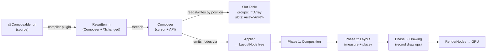

# Compose — Runtime Internals

The deep runtime layer beneath the declarative surface. If [25 — Compose Basics](25-compose-basics.md) taught you *how to write* Compose (state, recomposition, effects, hoisting), this module explains *what the machine actually does*: the compiler rewrite of every `@Composable`, the slot table that backs `remember`, the three phases and how reads defer between them, the stability rules that gate skipping, the snapshot MVCC that makes state observable and thread-safe, and the render-layer tricks (`graphicsLayer`) that make animation cheap. This maps to the Compose chapter of the Manifest book and is the level you are expected to reason at in a senior interview.

!!! abstract "TL;DR"
    - A `@Composable` is **not** a normal function. The Compose compiler plugin rewrites its signature to take a hidden `Composer` and a `$changed` bitmask, wraps its body in **groups**, and uses the `Composer` to do **positional memoization** against a **slot table**. It returns `Unit` because it *emits* nodes into the composition rather than producing a value.
    - The **slot table** is a gap-buffer pair (a `groups` int-array + a `slots` object-array) that stores the structure of the composition and everything `remember`ed, keyed by *source position*. `remember` = "read the slot at my current position; if absent or invalidated, compute and store."
    - Compose runs three **phases** per frame: **Composition** (build/update the node tree + slot table) → **Layout** (measure & place) → **Drawing** (record draw commands). Deferring a state read to a *later* phase (lambda-based modifiers, `graphicsLayer`) skips the earlier phases on change.
    - **Recomposition** re-invokes only scopes whose *read* snapshot state changed, and **skips** a composable when all params are *equal and stable*. **Strong skipping mode** (default in K2 Compose) skips even with unstable params by comparing by instance, and auto-remembers lambdas.
    - The **snapshot system** is an MVCC store: each `mutableStateOf` holds a linked list of versioned records; a `MutableSnapshot` gives isolation; `apply()` publishes atomically. `derivedStateOf` and `snapshotFlow` are built on snapshot read-observation.
    - `graphicsLayer` gives a composable its own **render layer** so alpha/scale/rotation/translation animate by re-drawing *one layer* — no recomposition, no relayout. This is why `Modifier.graphicsLayer { rotationZ = angle }` beats `Modifier.rotate(angle)` for animation.

---

## 1. How a `@Composable` function works internally

A `@Composable` looks like a function but the Compose **compiler plugin** (a Kotlin FIR/IR plugin, distinct from the runtime library) rewrites it during compilation. The `@Composable` annotation is a *calling-convention marker*: it tells the plugin "this function participates in composition," which changes its signature, its body, and how call sites invoke it.

### 1.1 What the plugin injects

For every `@Composable fun`, the plugin adds two synthetic parameters:

- **`$composer: Composer`** — the ambient object threaded through the entire call tree. It is the cursor into the slot table and the API surface for starting/ending groups, `remember`, `changed`, and emitting nodes. It is passed *implicitly* to every composable call, which is precisely why you can only call a composable from another composable — only there is a `Composer` in scope.
- **`$changed: Int`** — a **bitmask** describing what the caller knows about each parameter's state. Two bits per parameter encode: *is this the same instance as last time?* and *is it statically known / stable?* The callee uses these bits to decide whether it can **skip** its own body.

For functions with more than ~10 params, the plugin adds more `$changed` ints and a `$default` mask (for default arguments), so real signatures can carry several synthetic ints.

### 1.2 Groups: restartable, replaceable, movable

The plugin wraps the body in **groups** — calls like `startRestartGroup`/`endRestartGroup` that carve the slot table into regions with identity:

| Group | Emitted by | Purpose |
|---|---|---|
| **Restartable** | A normal `@Composable` that returns `Unit` and can be re-executed independently | Defines a **recompose scope**. The `endRestartGroup().updateScope { … }` lambda is what the runtime re-invokes when this scope's state changes. This is the unit of skipping. |
| **Replaceable** | `if`/`when` branches, and non-restartable composables | Marks a region whose *content can be swapped wholesale*. If the branch changes, the old group's slots are discarded and new ones written. Not independently restartable. |
| **Movable** | `key(id) { … }` blocks and keyed list items | Content that can be **relocated** within its parent without being torn down and rebuilt — the runtime moves its slot-table range, preserving `remember`ed state and nodes. This is how `LazyColumn` / `key()` keep item state across reorders. |

!!! note "Restartable vs skippable"
    *Restartable* = the runtime can re-run this scope in isolation (it recorded an `updateScope` lambda). *Skippable* = the runtime may **avoid** re-running it because inputs are unchanged and stable. A composable can be restartable-but-not-skippable (e.g. it reads unstable params without strong skipping) — it will always re-execute when its parent does. Composables returning a value (`@Composable fun x(): T`) or annotated `@NonRestartableComposable` do not open a restart group.

### 1.3 Positional memoization

The `Composer` identifies each call by its **position in the source code** (a compiler-generated `$key` int per call site), not by argument value. Two calls to `Text(...)` on different lines occupy different slots; the *same* call re-executed in the next composition lands on the *same* slots. This is **positional memoization**: identity is by *where you are in the call tree*, which is why `remember` needs no explicit key and why moving a composable across an `if` boundary resets its state.

### 1.4 Why composables return `Unit` and emit into a slot table

A composable does not *return* UI; it **emits** it. Calling `Text("hi")` reaches down through the `Composer` and either (a) inserts a `LayoutNode` into the node tree via an `Applier`, or (b) updates the existing node's slots. The "value" of a composable is this side effect on the composition, so the natural return type is `Unit`. This is what lets the tree be *diffed and patched in place* rather than rebuilt: emitting the same call at the same position updates, not recreates.

### 1.5 Conceptual desugaring

```kotlin
// You write:
@Composable
fun Greeting(name: String) {
    Text("Hello $name")
}

// The compiler plugin rewrites (conceptually) to:
fun Greeting(name: String, $composer: Composer, $changed: Int) {
    $composer.startRestartGroup(0xA1B2C3)          // this scope's stable key
    var $dirty = $changed
    // Fold param state into $dirty: if caller didn't tell us, ask the composer.
    if ($changed and 0b0110 == 0) {
        $dirty = $dirty or if ($composer.changed(name)) 0b0100 else 0b0010
    }
    // Skip if nothing this scope cares about changed AND we're allowed to skip.
    if ($dirty and 0b1011 != 0b1010 || !$composer.skipping) {
        Text("Hello $name", $composer, 0)          // Composer threaded down
    } else {
        $composer.skipToGroupEnd()                 // reuse everything as-is
    }
    // Record how to re-run *just this scope* later.
    $composer.endRestartGroup()?.updateScope { c, _ ->
        Greeting(name, c, $changed or 0b1)
    }
}
```

The exact bit encoding is an implementation detail and changes between compiler versions; the *shape* — `startRestartGroup` → dirty-bit fold → skip-or-run → `updateScope` — is stable and is what you should be able to reproduce on a whiteboard.

---

## 2. The slot table & Composition

The **Composition** is the live in-memory representation of one composable tree. Its backing store is the **slot table**.

### 2.1 Structure: two parallel gap buffers

`SlotTable` holds two arrays:

- **`groups: IntArray`** — fixed-width records (5 ints per group) describing the tree structure: each group's key, node count, slot count, parent-anchor, and flags. This is the *skeleton*.
- **`slots: Array<Any?>`** — the actual data: `remember`ed values, `State` objects, keys, and the emitted nodes. Groups index into this array.

Both are **gap buffers**: a contiguous array with a movable "gap" (empty region) positioned at the current write cursor. Inserting during composition costs O(1) amortized because you write into the gap; the gap is only shifted when the cursor moves to a new region. This makes the common case — re-composing top to bottom, occasionally inserting/removing a subtree — cheap, while keeping the data cache-friendly (contiguous, not a pointer-chasing node graph).

Reading uses a **`SlotReader`**; writing uses a **`SlotWriter`**; only one writer is active at a time.

### 2.2 How `remember` stores & retrieves by position

`remember { computation() }` compiles to roughly:

```kotlin
$composer.startReplaceableGroup(<callsite key>)
val value = $composer.cache(invalid = false) { computation() }  // rememberedValue / updateRememberedValue
$composer.endReplaceableGroup()
```

`cache` reads the slot at the current cursor. If a value is present and not invalidated, it is returned and `computation()` is **never run**. If absent (first composition) or invalidated (a `key` argument changed), `computation()` runs and the result is written to the slot. Because the cursor is driven by source position, `remember` needs no manual key — its "key" is the call site plus the group path to it. Change that path (move the call under a different `if` branch, or into a `key(...)` with a new value) and the reader lands on a different slot → the state resets. This is the mechanical truth behind "remember is scoped to its position in the composition."



---

## 3. Compose phases in depth

A frame flows through three phases, each consuming the previous phase's output and each independently invalidatable.

### 3.1 Composition — *what to show*

Runs the composable functions, updates the slot table, and produces/updates a tree of **`LayoutNode`s** (via the `UiApplier`; for Glance/other hosts a different `Applier` builds a different tree). Output: the node tree + the modifiers attached to each node. This is the only phase that runs your `@Composable` code.

### 3.2 Layout — *where and how big*

Walks the node tree. Each node **measures** its children (passing down `Constraints`), decides its own size, and **places** children at offsets. Compose enforces **single-pass measurement**: a parent measures each child exactly once (with `Modifier.layout`, `SubcomposeLayout`, or intrinsics as the escape hatches). Output: a size and a placement for every node — but *no pixels yet*.

### 3.3 Drawing — *paint it*

Each node records its draw commands into a `Canvas`/`RenderNode`. Output: recorded display lists handed to the GPU (`RenderThread` via `HardwareRenderer`). See [28 — Rendering](28-rendering.md) for how these render nodes reach the screen.

### 3.4 Deferring reads to later phases (the key perf lever)

The phase in which you **read** a state value determines which phases must re-run when it changes:

| You read state in… | Invalidates | Cost |
|---|---|---|
| Composable body (`Text(count.toString())`) | Composition → Layout → Drawing | Highest |
| Layout lambda (`Modifier.offset { IntOffset(x, 0) }`) | Layout → Drawing (**Composition skipped**) | Medium |
| Draw lambda (`Modifier.drawBehind { … color … }`) or `graphicsLayer { }` | Drawing only (**Composition + Layout skipped**) | Lowest |

!!! tip "The canonical optimization"
    Animating position? Prefer `Modifier.offset { IntOffset(scroll.value, 0) }` (lambda overload — reads in Layout) over `Modifier.offset(x = scroll.value.dp)` (value overload — reads in Composition). Animating rotation/alpha/scale? Read them inside `Modifier.graphicsLayer { }` (Drawing only). Each step up the table skips an entire phase per frame. This is the single most common senior-level Compose perf answer.

---

## 4. Recomposition & skipping

### 4.1 How reads subscribe

When a composable reads a snapshot `State` (e.g. `count.value`), the read happens inside a **`Snapshot.observe`** block installed by the runtime around each restart scope. The read is recorded: "**this recompose scope** depends on **this state object**." When the state's value changes and the snapshot is applied, the runtime looks up the dependent scopes and marks them **invalid**. On the next frame the `Recomposer` re-invokes exactly those scopes' `updateScope` lambdas — nobody else. There is no dirty-checking of the whole tree; subscription is precise and read-driven.

### 4.2 Skipping and stability

When a parent recomposes, it re-invokes its children — but a child **skips** (calls `skipToGroupEnd()`) if **every parameter is `equals`-unchanged AND every parameter type is stable**. Stability is a *compile-time contract* the plugin infers or you assert:

- **Stable type** = the plugin can prove that (a) `equals` is consistent, and (b) if a public property changes, Compose will be notified. Examples: all primitives, `String`, function types, and any type built only from stable types with stable public `val`s. `MutableState` is stable (it notifies on change).
- **Unstable type** = anything the plugin can't prove: a class with a `var`, a `List<T>`/`Map<T>` param (interface — could be a mutable impl), a class from another module without a stability config, or a class holding an unstable field.

If **any** parameter is unstable, the composable is **not skippable** (pre–strong-skipping): it re-runs every time the parent does, even if the values are identical, because Compose can't trust `equals`/change-notification.

### 4.3 `@Stable` and `@Immutable`

You assert stability the compiler can't infer:

| | `@Immutable` | `@Stable` |
|---|---|---|
| Promise | Public properties **never change** after construction (truly final values). | Properties **may change**, but any change **notifies Compose** (i.e. via snapshot state), and `equals` is consistent. |
| Use on | Value-holder data classes with `val`s only | Types with observable mutability (holders wrapping `MutableState`, or hand-written observable classes) |
| Effect | Both mark the type **stable** → participates in skipping. `@Immutable` is the stronger promise; Compose can additionally assume the *value* itself won't mutate. | Same skipping benefit; used when mutation is possible but observable. |
| Broken promise | Undefined behavior — stale UI (Compose skips a recomposition it needed). These annotations are **unchecked**; you are trusting yourself. |

```kotlin
@Immutable
data class Palette(val primary: Color, val onPrimary: Color)   // all val, never mutated → skippable param

@Stable
class FormState {                                              // mutable, but observable
    var name by mutableStateOf("")                             // change notifies Compose
    var valid by mutableStateOf(false)
}
```

### 4.4 Strong skipping mode

**Strong skipping** (enabled by default with the K2 Compose compiler, ~Kotlin 2.0+) relaxes the rule:

- Composables with **unstable parameters become skippable**. Instead of trusting `equals` on an unstable type, the runtime compares those params **by instance reference** (`===`). Same instance ⇒ skip.
- **Lambdas are auto-remembered.** Previously an inline `onClick = { vm.f() }` created a new lambda each recomposition, breaking skipping of the child that received it. Strong skipping wraps such lambdas in an implicit `remember`, so a stable lambda reference is passed down. (Lambdas that capture *unstable* values are still remembered but keyed on those captures.)

The practical upshot: much less manual `@Stable` annotating and manual lambda hoisting. But it changes semantics subtly — a caller that *mutates* an unstable object in place (same instance, new contents) will now be *skipped* and show stale data. The fix is the same as always: model observable state as snapshot state, and pass immutable snapshots down.

### 4.5 Lambda memoization (why it mattered)

```kotlin
// Pre–strong-skipping problem:
Child(onClick = { viewModel.increment() })   // new lambda instance each recomposition
// → Child's onClick param "changed" every time → Child never skips.

// Old fix:
val onClick = remember { { viewModel.increment() } }
Child(onClick = onClick)

// Strong skipping does this remember for you.
```

---

## 5. The snapshot system

Snapshot state is Compose's answer to "how do we make plain property assignment observable, isolated, and thread-safe?" It is an **MVCC** (multi-version concurrency control) system, conceptually like a tiny in-memory transactional database, and lives in `androidx.compose.runtime.snapshots` — usable even without any UI.

### 5.1 State objects and versioned records

`mutableStateOf(x)` creates a `StateObject` holding a **linked list of `StateRecord`s**, each tagged with the **snapshot id** that wrote it. A read walks the list and returns the newest record **visible to the current snapshot** (id ≤ this snapshot's id and not invalidated). This is how two snapshots can see two different values for the same state object simultaneously.

### 5.2 Snapshots: isolation & MVCC

- A **snapshot** is a consistent, immutable *view* of all state at a point in time, identified by a monotonically increasing id.
- `Snapshot.takeSnapshot()` → a **read-only** snapshot: reads see a frozen view; the outside world can keep mutating without affecting it.
- `Snapshot.takeMutableSnapshot()` → a **`MutableSnapshot`**: writes go into records tagged with *this* snapshot's id and are **invisible outside** until `apply()`. This is transaction isolation.
- **`apply()`** publishes the snapshot's writes atomically and runs **conflict detection**: if another snapshot modified the same state object concurrently, `apply()` returns a failure (optimistic concurrency). This is what makes background mutation safe.

```kotlin
val count = mutableStateOf(0)

val snap = Snapshot.takeMutableSnapshot()
snap.enter { count.value = 42 }     // isolated: outside still sees 0
println(count.value)                //  → 0   (global snapshot unaffected)
snap.apply().check()                // publish atomically
println(count.value)                //  → 42
snap.dispose()
```

The **global snapshot** is the default one your main-thread reads/writes use. The Compose runtime takes a fresh mutable snapshot per frame, runs composition/layout inside it, and applies it — giving each frame a consistent view.

### 5.3 Read observation → `derivedStateOf` and `snapshotFlow`

The runtime registers a **read observer** with the snapshot system. Every state read inside an observed block is reported, which is the substrate for two APIs:

- **`derivedStateOf { … }`** — creates a state whose value is computed from other states. It records *which* states its calculation read, caches the result, and only recomputes (and only notifies its own readers) when one of those *inputs actually changes value*. Use it to collapse many rapidly-changing reads into one rarely-changing one — the classic `derivedStateOf { listState.firstVisibleItemIndex > 0 }` (scroll offset changes every frame; the boolean changes rarely, so the button that reads it recomposes rarely).
- **`snapshotFlow { … }`** — a cold `Flow` that runs its block under read-observation, emits the result, and re-runs (emitting again) only when a read state changes. Bridges snapshot state into the coroutine/Flow world; applies `distinctUntilChanged` implicitly.

### 5.4 Thread-safety

Because reads return the record visible to *your* snapshot and writes are isolated until `apply()`, you can **mutate snapshot state from any thread** and read consistently. Conflicts are detected at `apply()` rather than via locks on every access — cheap reads, coordination only at commit. This is why `mutableStateOf` is safe to write from a background coroutine, unlike a raw `var`.

---

## 6. CompositionLocals

A `CompositionLocal` is an **implicit parameter** passed down the composition tree — a way to make ambient data (theme, density, current context) available without threading it through every function signature. `MaterialTheme.colorScheme`, `LocalDensity`, `LocalContext` are all CompositionLocals.

### 6.1 The two factories and their recomposition scope

```kotlin
val LocalElevation = compositionLocalOf { 0.dp }              // dynamic
val LocalAppConfig = staticCompositionLocalOf<AppConfig> {    // rarely/never changes
    error("No AppConfig provided")
}
```

| | `compositionLocalOf` | `staticCompositionLocalOf` |
|---|---|---|
| Change tracking | Tracked by the snapshot system; the runtime records **which composables read it** and recomposes **only those** when the provided value changes. | **Not** tracked per-read. The value is baked into the composition at the `Provides` site; changing it recomposes the **entire `CompositionLocalProvider` content subtree**, regardless of who reads it. |
| Cost | Slight per-read bookkeeping; cheap on change if few readers. | Zero read-tracking overhead; expensive on change (whole subtree). |
| Use when | Value **changes during the app's life** and only some composables read it (e.g. a theme toggle, content alpha). | Value is **effectively constant** for the subtree's life (e.g. `LocalContext`, DI graph, app config set once). |

!!! warning "Don't overuse CompositionLocals"
    They create *implicit* coupling — a composable's behavior depends on ambient state not visible in its signature, hurting testability and reuse. Prefer explicit parameters for anything a caller might reasonably want to vary. Reserve CompositionLocals for genuinely cross-cutting, tree-wide concerns (theme, density, localization) with a sensible default (or a hard `error()` default to force provision).

---

## 7. `SaveableStateHolder` & `rememberSaveable` internals

`remember` survives **recomposition** but not **activity/config recreation** or process death. `rememberSaveable` survives all of those by persisting into the same `Bundle`-backed `SavedStateRegistry` the platform uses for `onSaveInstanceState`.

### 7.1 The mechanism

- Compose installs a **`SaveableStateRegistry`** CompositionLocal, backed by the host's `SavedStateRegistry`.
- `rememberSaveable { … }` registers a **provider** with that registry keyed by the composable's *position* (auto-generated) plus any explicit `key`. On save, the registry pulls each provider's current value into a `Bundle`.
- On restore (new Activity instance, same task), the value is read back from the `Bundle` and returned instead of recomputing the initializer.
- Values must be `Bundle`-serializable (primitives, `Parcelable`, etc.) **or** you supply a **`Saver`** that converts your type to/from a saveable form.

### 7.2 Custom `Saver`

```kotlin
data class Range(val lo: Int, val hi: Int)

val RangeSaver = listSaver<Range, Int>(
    save = { listOf(it.lo, it.hi) },              // Range → List<Int> (saveable)
    restore = { Range(it[0], it[1]) }             // List<Int> → Range
)

@Composable
fun RangePicker() {
    var range by rememberSaveable(stateSaver = autoSaver()) { mutableStateOf(0) } // simple
    val custom by rememberSaveable(saver = RangeSaver) { mutableStateOf(Range(0, 10)) }
    // survives rotation & process death via the SavedStateRegistry Bundle
}
```

Or the general `Saver<Original, Saveable>` with `save = { SaverScope -> … }` / `restore = { … }`, and `mapSaver` for key-value forms.

### 7.3 `SaveableStateHolder`

`rememberSaveableStateHolder()` provides `SaveableStateProvider(key) { content }`, which gives each *key* its own isolated saveable-state scope and — crucially — **retains** the saved state of a subtree even after it leaves the composition. This is how **Navigation Compose** and **pager/tab** hosts preserve each destination's `rememberSaveable` (and scroll position) when you navigate away and back: the holder keeps the removed subtree's saved values keyed by route, and replays them on return.

---

## 8. `mutableStateListOf` / `mutableStateMapOf`

### 8.1 The trap: `State<List>` vs an observable collection

```kotlin
// WRONG — mutation is invisible:
val items = remember { mutableStateOf(listOf<String>()) }
items.value.add("x")          // won't compile for immutable List; even with a MutableList,
                              // mutating in place does NOT notify — the State's *value*
                              // (the list reference) never changed.

// To notify with a State<List>, you must REPLACE the reference:
items.value = items.value + "x"    // new list instance → State change → recomposition

// RIGHT — observable collection notifies on mutation:
val items = remember { mutableStateListOf<String>() }
items.add("x")                // recomposes readers automatically
```

A `MutableState<List<T>>` only fires when its `.value` (the reference) is reassigned. Compose observes the *State object*, not the contents of whatever it points to. Mutating the underlying list in place changes contents but not the reference, so no snapshot write is recorded and **nothing recomposes**.

### 8.2 How the observable collections work

`mutableStateListOf()` / `mutableStateMapOf()` return `SnapshotStateList` / `SnapshotStateMap` — collections whose internal storage is a **snapshot state record**. Every mutating operation (`add`, `remove`, `set`, `clear`) performs a snapshot write, so it participates in MVCC (isolation, `apply()`, conflict detection) *and* notifies read-observers. Reading (iterating, indexing) subscribes the current scope. They are the correct choice for a collection that is **mutated in place** and drives UI; a plain `List` inside `mutableStateOf` is correct only if you always replace it wholesale (and pairs well with `@Immutable`/`ImmutableList` for stable skipping).

---

## 9. `Painter` — the drawing abstraction

`Painter` is Compose's stateful, resolution-aware drawing primitive: "something that knows how to paint itself into a `DrawScope` given a size." It sits **above** raw bitmaps and platform drawables.

| Abstraction | What it is | Level |
|---|---|---|
| `ImageBitmap` | Raw pixel buffer (Compose's `Bitmap`). | Data |
| `Drawable` (platform) | Android's imperative drawing object. | Platform data |
| **`Painter`** | An object with an intrinsic size that draws into a `DrawScope`. Wraps the above (`BitmapPainter`, `ColorPainter`, `BrushPainter`, `VectorPainter`, or `Drawable.toPainter()`). | Abstraction |

`Image(painter, contentDescription)` and `Modifier.paint(painter)` consume a `Painter`. Because a `Painter` draws *lazily into a size given at draw time*, it handles scaling, tinting (`ColorFilter`), and alpha uniformly regardless of the underlying source — a `VectorPainter` re-rasterizes at the target size; a `BitmapPainter` samples. `painterResource(R.drawable.x)` picks vector vs bitmap painter automatically.

```kotlin
class RingPainter(private val color: Color, private val stroke: Float) : Painter() {
    override val intrinsicSize = Size(48f, 48f)         // default size when unconstrained
    override fun DrawScope.onDraw() {
        drawCircle(color, radius = size.minDimension / 2f - stroke / 2f,
                   style = Stroke(width = stroke))
    }
}
// Usage: Image(painter = RingPainter(Color.Cyan, 6f), contentDescription = null)
```

---

## 10. Canvas in Compose

`Canvas(modifier) { /* DrawScope */ }` is a composable that gives you a `DrawScope` — a declarative drawing surface with the current size, density, and layout direction in scope. It is the sanctioned way to draw custom graphics without touching the View `Canvas` directly.

### 10.1 `DrawScope` primitives

```kotlin
Canvas(Modifier.size(200.dp)) {                 // this: DrawScope, `size` available
    drawLine(Color.Red, start = Offset.Zero, end = Offset(size.width, size.height), strokeWidth = 4f)
    drawRect(Color.Blue, topLeft = Offset(20f, 20f), size = Size(80f, 80f))
    drawCircle(Color.Green, radius = 30f, center = center)
    val path = Path().apply {
        moveTo(0f, size.height); quadraticBezierTo(size.width / 2, 0f, size.width, size.height)
    }
    drawPath(path, Color.Magenta, style = Stroke(width = 6f))
}
```

`DrawScope` also offers `withTransform { translate/scale/rotate/clipRect }` for scoped transforms, `inset`, and `drawIntoCanvas { canvas -> … }` — an escape hatch to the underlying `androidx.compose.ui.graphics.Canvas` for operations `DrawScope` doesn't expose (e.g. `nativeCanvas.drawText(...)` to draw text, since `DrawScope` has no text primitive; use `TextMeasurer`/`drawText` from the text module as the modern route). `Modifier.drawBehind { }` / `Modifier.drawWithContent { }` give the same `DrawScope` attached to any composable, and reading state inside them invalidates **only the Drawing phase** (see §3.4).

---

## 11. `graphicsLayer` modifier

`Modifier.graphicsLayer { }` allocates the composable its own **`RenderNode`** (a hardware render layer). The subtree is drawn **once** into that layer's display list; thereafter, transformations (`alpha`, `scaleX/Y`, `rotationX/Y/Z`, `translationX/Y`, `clip`, `shape`, `shadowElevation`, `renderEffect`, `compositingStrategy`) are applied by the **GPU on the cached layer** at composite time.

### 11.1 Why it makes animation cheap

Because the transform lives on the render node, changing `rotationZ` from 0° to 90° requires **only re-compositing the existing layer** — no re-running composition, no re-measuring/placing, and often no re-recording of draw commands. Contrast:

- `Modifier.rotate(angle)` and `Modifier.alpha(a)` (value overloads) read the animated value in **Composition** → invalidate all three phases each frame.
- `Modifier.graphicsLayer { rotationZ = angle; alpha = a }` (lambda block) reads them in the **Drawing** phase, on the layer → invalidate Drawing only, and even that is largely a GPU composite.

```kotlin
val angle by rememberInfiniteTransition(label = "spin").animateFloat(
    initialValue = 0f, targetValue = 360f,
    animationSpec = infiniteRepeatable(tween(1200, easing = LinearEasing)), label = "angle"
)
Icon(
    Icons.Default.Refresh, null,
    modifier = Modifier.graphicsLayer {          // reads `angle` in Drawing phase — cheap
        rotationZ = angle
        alpha = 0.9f
        // scaleX = 1.1f; clip = true; shape = CircleShape
    }
)
```

`graphicsLayer` is also what enables **alpha-based fades without overdraw artifacts** (the whole subtree composites as one layer at the given alpha, instead of each child blending separately) and is the backing mechanism for `AnimatedVisibility`, `Modifier.rotate/scale/alpha`, and shared-element transitions.

---

## 12. Visual animations

All Compose animation APIs ultimately subscribe to the **frame clock** (`MonotonicFrameClock` / `withFrameNanos`): on each frame they compute the current value from elapsed time and write it into snapshot state, which drives redraw (ideally via `graphicsLayer`/lambda modifiers so only Drawing re-runs).

| API | Shape | Use for |
|---|---|---|
| `animate*AsState` | Fire-and-forget: declare a target, get an auto-animating `State<T>`. `animateFloatAsState`, `animateDpAsState`, `animateColorAsState`, … | Single value reacting to state changes (a size, a color, an offset). |
| `updateTransition` | Coordinates **multiple** values off **one** state driver; `transition.animateFloat/Dp/Color { targetByState }`. | Several properties animating together on a shared state (e.g. selected/unselected chip: color + scale + elevation). |
| `AnimatedVisibility` | Composable that animates enter/exit of its content (`fadeIn`/`slideIn`/`expandIn` × out). | Adding/removing content with transitions. Backed by `graphicsLayer`. |
| `AnimatedContent` | Cross-fades/animates between different content for different target states. | Swapping content (count up/down, screen switch). |
| `Animatable` | Imperative, coroutine-driven single value with `animateTo`/`snapTo`, interruptible, velocity-aware. | Gesture-driven or manually orchestrated animation, fling, decays. |
| `rememberInfiniteTransition` | Loops values forever via `infiniteRepeatable`. | Loaders, pulsing, ambient motion. |
| `Transition` + `AnimatedContentScope` (nav) | Higher-level orchestration. | Shared element / screen transitions. |

```kotlin
// Declarative single value:
val size by animateDpAsState(if (expanded) 200.dp else 80.dp, label = "size")

// Coordinated multi-value:
val t = updateTransition(selected, label = "chip")
val bg by t.animateColor(label = "bg") { if (it) Primary else Surface }
val scale by t.animateFloat(label = "scale") { if (it) 1.1f else 1f }

// Imperative, interruptible:
val offset = remember { Animatable(0f) }
LaunchedEffect(target) { offset.animateTo(target, spring(dampingRatio = 0.6f)) }
```

!!! note "Spec matters"
    `tween`, `spring`, and `keyframes` are `AnimationSpec`s that define *how* the value interpolates. `spring` (physics-based, no fixed duration) is the Material default and interrupts gracefully; `tween` is duration + easing. Choosing the spec is a design decision, not a perf one — the perf comes from *where you read* the animated value (§11).

---

## 13. `@Preview` & tooling

`@Preview` renders a composable inside Android Studio without deploying to a device — the IDE runs the composition on a host-side renderer (LayoutLib) and paints it in the design pane.

### 13.1 Preview parameters

```kotlin
@Preview(showBackground = true, widthDp = 360, heightDp = 640,
         uiMode = Configuration.UI_MODE_NIGHT_YES, fontScale = 1.5f, locale = "hi")
@Composable
private fun HomePreview() = AppTheme { HomeScreen(state = fakeState) }
```

Common params: `showBackground`, `backgroundColor`, `widthDp`/`heightDp`, `uiMode` (light/dark), `fontScale` (accessibility), `locale`, `device` (`Devices.PIXEL_7`), `group`, `apiLevel`, `showSystemUi`.

### 13.2 `PreviewParameterProvider` — data-driven previews

Feed a composable multiple sample inputs so one `@Preview` renders several variants:

```kotlin
class UserProvider : PreviewParameterProvider<User> {
    override val values = sequenceOf(
        User("Ada", online = true),
        User("Grace", online = false),
        User("A-very-long-name-that-should-truncate", online = true),
    )
}

@Preview
@Composable
private fun UserRowPreview(@PreviewParameter(UserProvider::class) user: User) {
    AppTheme { UserRow(user) }        // renders once per value in the sequence
}
```

### 13.3 Multipreview annotations

Define a reusable set of previews once and apply with a single annotation:

```kotlin
@Preview(name = "Light", uiMode = UI_MODE_NIGHT_NO)
@Preview(name = "Dark",  uiMode = UI_MODE_NIGHT_YES)
@Preview(name = "Large font", fontScale = 1.5f)
annotation class ThemePreviews

@ThemePreviews @Composable
private fun ButtonPreview() = AppTheme { PrimaryButton("Go") {} }
```

Compose ships built-ins like `@PreviewScreenSizes`, `@PreviewFontScales`, `@PreviewLightDark`, `@PreviewDynamicColors`. **Interactive Preview** (click the pointer icon) runs a live composition — you can click, type, and see recomposition — without a device; **Animation Preview** scrubs transitions frame by frame.

---

## 14. Screenshot testing

Screenshot (golden-image) tests render a composable and byte-compare the output against a committed reference PNG, catching *visual* regressions unit tests can't.

| Tool | How it renders | Notes |
|---|---|---|
| **Paparazzi** (Cash App) | Pure **JVM** via LayoutLib — no emulator/device. Fast, runs in CI. | `@get:Rule val paparazzi = Paparazzi(...)`; `paparazzi.snapshot { AppTheme { HomeScreen(...) } }`. Records goldens with `recordPaparazziDebug`, verifies with `verifyPaparazziDebug`. |
| **Roborazzi** | Rides on **Robolectric** (JVM) — reuses your Robolectric/Compose test setup, can screenshot mid-interaction. | `captureRoboImage()`; integrates with `composeTestRule`. Good when you already use Robolectric. |
| **Compose Preview Screenshot Testing** (AGP, official) | Renders your `@Preview`s to goldens via Gradle. | First-party, `@Preview`-driven, still maturing. |

```kotlin
class HomeScreenshotTest {
    @get:Rule val paparazzi = Paparazzi(deviceConfig = DeviceConfig.PIXEL_5)

    @Test fun home_default() {
        paparazzi.snapshot { AppTheme { HomeScreen(state = HomeState.Loaded(sample)) } }
    }
}
```

Goldens live in the repo; CI fails on pixel diff. Pin the renderer/font versions or goldens drift across environments. This is the house standard for verifying UI polish before release.

---

## 15. Live Edit & Live Literals

Both are **dev-time only** — they never affect a release build.

- **Live Edit** — edit a `@Composable`'s body in Android Studio and see the running app update *without a full rebuild/redeploy*. It recompiles the changed function and re-invokes the affected recompose scopes on the device. Scope is limited: it handles body changes to composables well, but adding/removing functions, changing signatures, or non-composable code may force a normal deploy. Great for iterating on UI while the app runs.
- **Live Literals** (earlier, largely subsumed by Live Edit) — the compiler instruments constant literals (numbers, strings, booleans) so their values can be swapped at runtime from the IDE without recompiling, letting you tweak a padding or color and watch it change live.

Neither changes the compiled output shipped to users; they are instrumentation the release compiler strips.

---

## Interview Q&A

!!! question "Q1 — What two hidden parameters does the Compose compiler add to every `@Composable`, and what is each for?"
    A **`Composer`** and an `Int` **`$changed`** bitmask. The `Composer` is the cursor into the slot table and the API for opening groups, `remember`, `changed`, and emitting nodes — it's threaded implicitly through every composable call, which is why composables can only be called from composables. `$changed` carries, two bits per parameter, what the *caller* already knows about each argument (same-instance? statically stable?), letting the callee decide whether it can **skip** its body. Large param lists get extra `$changed` ints and a `$default` mask.

    **Follow-up — Why does a composable return `Unit`?** Because it doesn't *produce* a value; it **emits** nodes into the composition as a side effect via the `Composer`/`Applier`. Emitting the same call at the same slot position *updates* the existing node rather than rebuilding, which is what makes in-place diff/patch possible.

!!! question "Q2 — Explain the three phases and how you'd move a scroll-driven translation animation off the hot path."
    **Composition** runs composables and builds/updates the `LayoutNode` tree + slot table; **Layout** measures (single-pass) and places nodes; **Drawing** records draw commands into render nodes for the GPU. The phase in which you *read* a state value determines which phases re-run on change. Reading a scroll offset in the composable body invalidates all three; reading it in a **lambda modifier** (`Modifier.offset { IntOffset(x, 0) }`) skips Composition; reading it in `graphicsLayer { translationX = x }` skips Composition *and* Layout, leaving only a cheap GPU re-composite.

    **Follow-up — Why is `graphicsLayer` cheaper than `Modifier.rotate(angle)`?** `graphicsLayer` gives the subtree its own `RenderNode`; the rotation is a transform applied to that cached layer at composite time, so changing the angle only re-composites one layer. `Modifier.rotate(value)` reads the angle in Composition, invalidating every phase each frame.

!!! question "Q3 — What makes a composable *skippable*, and what changed with strong skipping mode?"
    A composable skips when **every parameter is `equals`-unchanged AND every parameter type is stable** — stable meaning the compiler can trust `equals` and knows any property change will notify Compose (primitives, `String`, lambdas, `@Stable`/`@Immutable` types, `MutableState`). Any unstable param (a `var`, a raw `List`/`Map` interface, a class from an unconfigured module) makes it non-skippable pre–strong-skipping. **Strong skipping** (default under K2) makes unstable-param composables skippable by comparing those params **by reference (`===`)**, and **auto-remembers lambdas** so inline callbacks no longer break skipping.

    **Follow-up — What bug can strong skipping introduce?** If you mutate an unstable object *in place* (same instance, new contents) and pass it down, the child now compares by reference, sees the same instance, and **skips** — showing stale data. Fix by modeling mutable state as snapshot state and passing immutable snapshots.

!!! question "Q4 — How does snapshot state make a plain `var`-like assignment observable and thread-safe?"
    Each `mutableStateOf` is a `StateObject` holding a linked list of **versioned `StateRecord`s** tagged by snapshot id (MVCC). A read returns the newest record visible to the current snapshot; a write in a `MutableSnapshot` creates a new record visible only inside that snapshot until `apply()`, which publishes atomically and runs **conflict detection**. The runtime installs a **read observer**, so any state read inside a recompose scope subscribes that scope; when the state changes and its snapshot applies, only subscribed scopes are invalidated. Thread-safety comes from isolation + commit-time conflict detection rather than per-access locks, so you can write state from a background coroutine safely.

    **Follow-up — How do `derivedStateOf` and `snapshotFlow` use this?** Both run their block under read-observation. `derivedStateOf` caches its result and recomputes/notifies only when a *read input's value* actually changes (collapsing high-frequency reads into a low-frequency output); `snapshotFlow` emits its block's result and re-runs it (with implicit `distinctUntilChanged`) whenever a read state changes, bridging snapshot state into Flow.

!!! question "Q5 — `compositionLocalOf` vs `staticCompositionLocalOf` — when do you pick each?"
    `compositionLocalOf` is **read-tracked**: the runtime records which composables read it and recomposes **only those** when the provided value changes — right for values that change during the app's life with few readers (content alpha, a runtime theme toggle). `staticCompositionLocalOf` is **not** read-tracked: the value is baked in at the provider site, so changing it recomposes the **entire provided subtree**, but reads are free — right for values that are effectively constant for the subtree (`LocalContext`, a DI graph, app config set once). Pick static when it (almost) never changes; pick dynamic when it changes and you want surgical recomposition.

    **Follow-up — Why prefer explicit parameters over CompositionLocals in general?** CompositionLocals create implicit coupling — behavior depends on ambient state absent from the signature, hurting testability and reuse. Reserve them for genuinely tree-wide cross-cutting concerns with a sensible (or hard-`error`) default.

!!! question "Q6 — Why doesn't a `mutableStateOf(mutableListOf())` recompose when you `.add()` to it, and what's the fix?"
    Compose observes the **`State` object**, which fires only when its `.value` **reference** is reassigned. Mutating the list in place changes the contents but not the reference — no snapshot write is recorded, so nothing recomposes. Fixes: (a) replace the reference wholesale (`list.value = list.value + item`), which pairs well with `@Immutable`/`ImmutableList` for stable skipping; or (b) use **`mutableStateListOf()`** (a `SnapshotStateList`) whose every mutating op is itself a snapshot write, so in-place `add`/`remove`/`set` both participate in MVCC and notify readers.

    **Follow-up — How does `rememberSaveable` survive process death where `remember` can't?** `rememberSaveable` registers a provider (keyed by composition position + explicit `key`) with the `SaveableStateRegistry` backed by the platform `SavedStateRegistry`/`Bundle`. On save it writes the value into the bundle; on restore it reads it back instead of recomputing. Non-bundle types need a `Saver` (e.g. `listSaver`/`mapSaver`) to convert to/from a saveable form; a `SaveableStateHolder` extends this to retain a whole subtree's saved state across navigation.

---

*See also: [25 — Compose Basics](25-compose-basics.md) (declarative model, state, effects, hoisting), [28 — Rendering](28-rendering.md) (render nodes → GPU), [33 — Performance](33-performance.md) (measuring recomposition), [37 — Material](37-material.md) (theming & CompositionLocals in practice).*
