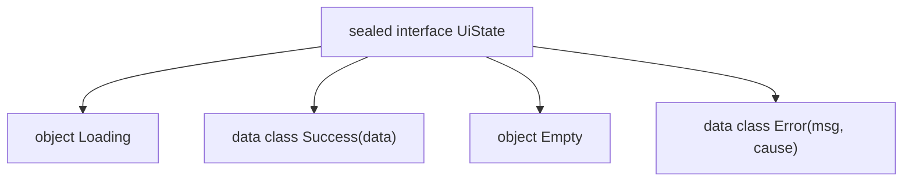

# Kotlin — Language Core

A senior-level tour of the Kotlin language semantics that interviewers actually probe: not "what does `?.` do" but "what does it compile to, what does it cost, and where does it bite you." Every section assumes you can read Kotlin; the value here is the layer underneath the syntax.

---

## Null safety

Kotlin's headline feature is that nullability is part of the type system. `String` and `String?` are *different types*; the compiler refuses a `null` where a non-null type is expected. This is a compile-time guarantee, not a runtime wrapper — a `String?` is still just a JVM reference that may hold `null`. There is no `Optional` allocation.

### The operators

| Operator | Name | Semantics |
|----------|------|-----------|
| `?.` | Safe call | Evaluates to `null` if receiver is `null`, else calls the member. Short-circuits the whole chain. |
| `?:` | Elvis | `a ?: b` → `a` if non-null, else `b`. RHS only evaluated when needed. |
| `!!` | Not-null assertion | Throws `NullPointerException` if `null`. An explicit admission you know better than the compiler. |
| `as?` | Safe cast | Returns `null` instead of throwing `ClassCastException` on type mismatch. |

`?.` chains compile to a sequence of null-checks with early jumps — roughly `if (a == null) null else a.b`. It does not silently swallow real errors; it only guards `null`.

```kotlin
val len: Int = user?.profile?.name?.length ?: 0
// ~ compiles to: null-check user, then profile, then name; any null -> 0
```

Elvis pairs beautifully with early return and `throw`, because both are expressions of type `Nothing` (see below):

```kotlin
val name = user?.name ?: return          // Nothing unifies with any type
val token = header ?: throw AuthException("missing header")
```

### Platform types (the dangerous ones)

When Kotlin calls Java, the compiler cannot know whether a Java method returns `null`. Types coming from Java are **platform types**, written `String!` in IDE tooltips — you cannot write `!` yourself. A platform type is *neither* nullable *nor* non-null from the compiler's view; it **relaxes** null checks entirely.

!!! warning "Platform types defer NPEs to runtime"
    Assigning a platform type to a non-null Kotlin type inserts an implicit null-check *at the assignment site*, not where you later use it. If the Java method returns `null`, you get an NPE with a confusing stack trace far from the real call.

    ```kotlin
    // Java: String getName() { return null; }
    val n: String = javaObj.name   // NPE HERE, at assignment — not obvious
    val n2 = javaObj.name          // inferred as String! ; NPE deferred to first non-null use
    ```

    Mitigation: annotate Java with `@Nullable`/`@NonNull` (JSR-305, AndroidX annotations, JetBrains annotations) so Kotlin sees real `String?`/`String`. Treat every unannotated Java return as `?` and handle it explicitly.

### `lateinit` vs `lazy`

Both defer initialization of a non-null property, but they solve different problems.

| | `lateinit var` | `by lazy { }` |
|---|---|---|
| Mutability | `var` | `val` |
| Types | reference types only (no primitives) | any |
| Who initializes | you, imperatively, later | the delegate, on first access |
| Thread-safety | none | `SYNCHRONIZED` by default |
| Unset access | throws `UninitializedPropertyAccessException` | impossible (block runs on read) |
| Can reset | yes | no |
| Backing check | `::prop.isInitialized` | — |

```kotlin
class Screen {
    lateinit var binding: ViewBinding          // set in onCreate, DI, or a test setup
    val analytics: Analytics by lazy { Analytics(context) }  // built once, on demand
}
```

Use `lateinit` for framework/DI-injected fields set exactly once after construction (Android `Views`, `@Inject`). Use `lazy` for expensive values you may never touch. `lateinit` gives up the compiler's null guarantee — reading it early is a runtime crash, so guard with `isInitialized` when the lifecycle is uncertain.

---

## Basic types & equality

### `==` vs `===`

| Operator | Compares | Compiles to |
|----------|----------|-------------|
| `==` | Structural equality | `a?.equals(b) ?: (b === null)` |
| `===` | Referential identity | JVM reference comparison (identity) |

`==` is null-safe by construction — it calls `equals` through a null-check, so `null == null` is `true` and `null == x` never NPEs. `===` asks "same object?".

```kotlin
val a = "kt"; val b = buildString { append("kt") }
a == b      // true  — structural
a === b     // false — different objects (b is freshly built)
```

### `equals()` / `hashCode()` contract

Every type inherits `equals()`/`hashCode()` from `Any` (default: reference identity, same as `===`). Overriding one without the other is a bug generator, because hash-based collections (`HashMap`, `HashSet`) look an object up by hash bucket *first*, then confirm with `equals()` only within that bucket.

The contract, and why each direction matters:

- **Equal objects must produce the same hash code.** If `a == b` but `a.hashCode() != b.hashCode()`, a `HashSet` looks in the *wrong bucket* for `b` after inserting `a` — `set.contains(b)` silently returns `false` even though `b` is "equal" to a member. This is the classic bug from a hand-rolled `equals()` without a matching `hashCode()`.
- **Equal hash codes do *not* imply equal objects — that's a collision, and it's expected, not a bug.** Two unequal objects landing in the same bucket is normal; `HashMap`/`HashSet` handle it by chaining entries within a bucket and falling back to `equals()` to disambiguate. A good `hashCode()` just makes collisions *rare enough* to keep lookups near O(1); it can never eliminate them (pigeonhole: infinite possible objects, finite `Int` hash space).
- **`data class` gets both for free**, generated together from the primary-constructor properties, so they're always consistent — one more reason to prefer `data class` over hand-writing `equals()`/`hashCode()`.

```kotlin
class BadPoint(val x: Int, val y: Int) {
    override fun equals(other: Any?) = other is BadPoint && x == other.x && y == other.y
    // hashCode() NOT overridden — still identity-based (inherited from Any)
}

val set = hashSetOf(BadPoint(1, 1))
set.contains(BadPoint(1, 1))   // false! equal by equals(), but different hash buckets
```

### Stack vs heap — the model boxing plugs into

Kotlin inherits the JVM's two memory regions, and it's worth having the model explicit before boxing (below) makes sense as anything other than a rule to memorize.

- **Stack** — one per thread, holds local variables and method call frames (LIFO: a frame is pushed on call, popped on return). It stores **primitive values directly** (`Int`, `Boolean`, etc. as raw bits) and **object references** (a pointer, not the object). Allocation/deallocation is just moving a stack pointer — extremely cheap, and fully automatic: a frame's memory is reclaimed the instant the function returns, no garbage collector involved.
- **Heap** — shared across all threads, holds every actual object (instances of classes, arrays, boxed primitives). Heap objects are **not** freed on scope exit; they live until nothing references them, at which point the **garbage collector** reclaims them (see [M27 Memory](../deep-dive/27-memory.md) for GC internals) — inherently slower and less predictable than a stack pop.

```kotlin
fun calculate(): Int {
    val a = 5              // raw int value, lives in this frame on the stack
    val b = 10              // same
    return a + b             // frame (a, b) popped on return — nothing to collect
}

class Person(val name: String)
fun createPerson(): Person {
    val person = Person("Alice")   // the Person OBJECT is allocated on the heap;
    return person                    // `person` itself is just a reference, on the stack
}                                     // the reference goes away here — the heap object doesn't,
                                      // it survives as long as `main`'s reference to it does
```

A **local `val`/`var` holding a primitive never touches the heap** — that's the fast path. A **local variable holding a class instance is a stack-resident pointer to a heap-resident object** — two different lifetimes, easy to conflate. This is exactly the distinction boxing is about to complicate.

### Int boxing

Kotlin has no primitive/wrapper split in *source* — `Int` is `Int`. But it compiles to JVM `int` where possible and to `java.lang.Integer` when a reference is required: nullable `Int?`, generic type arguments (`List<Int>`), and anywhere an object is needed.

!!! warning "Identity on boxed integers is a trap"
    `===` on `Int?` compares boxed identities, and the JVM caches only `Integer.valueOf(-128..127)`.

    ```kotlin
    val x: Int? = 127; val y: Int? = 127
    x === y   // true  — cached box
    val p: Int? = 128; val q: Int? = 128
    p === q   // false — distinct boxes!
    p == q    // true  — always use == for value comparison
    ```

    Never use `===` on numbers. Autoboxing in hot loops (via `Int?` or generic collections) also allocates — prefer specialized arrays (`IntArray`) on performance paths.

### `String` vs `StringBuilder`

`String` is immutable — every concatenation (`+`, `plus`, string templates) allocates a **new** `String`; the operands are never mutated. `StringBuilder` is a mutable, resizable char buffer — appends mutate the same backing array in place (growing it geometrically on overflow), so there's no new object per operation.

```kotlin
var s = ""
for (i in 0 until 1000) s += i          // 1000 allocations — O(n²) total copying

val sb = StringBuilder()
for (i in 0 until 1000) sb.append(i)    // amortized O(n) — one growing buffer
val result = sb.toString()
```

Kotlin already optimizes a single-expression string template — `"$a$b"` compiles to one `StringBuilder`/`invokedynamic` call (`StringConcatFactory` on newer JVM targets), not N intermediate `String`s. The actual trap is **concatenation inside a loop**: each `+=` on a `var s: String` is its own fresh builder + `append` + `toString()` *per iteration*, which is what produces the O(n²) cost. Use `StringBuilder` (or the idiomatic `buildString { }` wrapper) whenever you're accumulating across iterations; plain `+`/templates are fine for one-shot concatenation, where the compiler already does the right thing.

```kotlin
val s = buildString {                    // scoped StringBuilder, returns toString()
    append("id="); append(id); append(", name="); append(name)
}
```

### `Any`, `Unit`, `Nothing`

- **`Any`** — root of the non-null hierarchy (`Any?` is the true top type). Analogous to `java.lang.Object` but with only `equals`/`hashCode`/`toString`.
- **`Unit`** — The type with exactly one value: the singleton object `Unit`. It represents the return type of functions that do not return a meaningful value. Unlike Java's `void` primitive keyword, Kotlin's `Unit` is a **real object**, allowing it to be used as a generic type argument.

#### 1. Implicit Return Type
Functions with no explicit return type return `Unit` implicitly. The compiler adds the return statement automatically:
```kotlin
fun logEvent(event: String): Unit {
    println("Event logged: $event")
    // return Unit is compiled implicitly
}

fun logEventShort(event: String) { // compiles identically to returning Unit
    println("Event: $event")
}
```

#### 2. Satisfying Generic Class Boundaries
In Java, you cannot use primitive `void` in generics (e.g., `List<void>` is invalid). Java developers must use `List<Void>` and explicitly write `return null;` at the end of functions. 
In Kotlin, because `Unit` is a first-class object, it satisfies generic constraints naturally:
```kotlin
interface TaskProcessor<T> {
    fun process(): T
}

// Satisfies the generic interface without returning null
class FireAndForgetTask : TaskProcessor<Unit> {
    override fun process() {
        sendAnalyticsSignal()
        // No return statement needed; Unit is returned implicitly
    }
}
```

#### 3. Functional Lambda Types
Lambdas that return no value explicitly declare `Unit` as their return signature:
```kotlin
val onClickListener: (View) -> Unit = { view ->
    triggerAnimation(view)
    // Implicitly returns the Unit singleton
}
```

- **`Nothing`** – The type with *zero* instances. It is Kotlin's **bottom type**, which sits at the very bottom of the type hierarchy and is a subtype of all other types (including non-nullable and nullable types). A function that returns `Nothing` can **never return normally** – it either throws an exception or enters an infinite loop.

#### 1. Function That Never Completes Normally
A function designed to terminate execution with an exception or loop forever should explicitly return `Nothing`:
```kotlin
fun failWithValidation(msg: String): Nothing {
    throw IllegalArgumentException("Validation failed: $msg")
}

fun runInfiniteGameLoop(): Nothing {
    while (true) {
        processInput()
        render()
    }
}
```

#### 2. Control Flow & Unreachable Code Smart-Casts
Because `Nothing` is a subtype of *every* type, you can use expressions returning `Nothing` on the right-hand side of the Elvis operator (`?:`). The compiler smart-casts the left-hand side to a non-null type and knows any subsequent code is unreachable if the Elvis branch is taken:
```kotlin
val intentData: String = intent.getStringExtra("UUID") 
    ?: failWithValidation("UUID is missing from launching intent")
// Since failWithValidation returns Nothing (Nothing <: String), this type-checks.
// The compiler knows intentData is guaranteed to be non-null and String below this line.
```

#### 3. Covariant Generics (Empty Collections)
Kotlin's read-only collections are covariant (`out T`). Because `Nothing` is a subtype of all types, `Collection<Nothing>` is a subtype of any `Collection<T>`. This allows a single empty list instance to be safely reused across all types:
```kotlin
// Public API: public fun <T> emptyList(): List<T> = EmptyList
// EmptyList is a List<Nothing>. Since Nothing <: String and List is covariant:
val stringList: List<String> = emptyList() // List<Nothing> <: List<String>
val intList: List<Int> = emptyList()       // List<Nothing> <: List<Int>
```

#### 4. The Built-in `TODO()` helper
The standard library defines `TODO()` as returning `Nothing`, allowing it to stand in as a placeholder anywhere in your code without triggering compiler errors for missing return values:
```kotlin
fun calculateCompoundInterest(principal: Double, rate: Double): Double {
    TODO("Math calculations are not implemented yet") // Compiles fine without returning a Double
}
```

---


## `val` vs `var`, immutability, `const`

`val` means the *reference* is read-only — assign once. It does **not** mean the object is immutable: `val list = mutableListOf(1)` still allows `list.add(2)`. `var` allows reassignment. Prefer `val` everywhere; it enables smart-casts and reasoning.

A `val` can even have a custom getter and return different values each read — read-only ≠ immutable ≠ stable:

```kotlin
val now: Long get() = System.currentTimeMillis()   // read-only, but not stable
```

### `const val` vs `val`

| | `const val` | `val` |
|---|---|---|
| Evaluated | compile time | runtime |
| Allowed types | `String` + primitives only | any |
| Location | top-level, `object`, or `companion object` | anywhere |
| Inlined at call site | yes — the literal is copied into callers | no |
| Usable in annotations | yes | no |

```kotlin
const val API_VERSION = 3            // inlined into every use site
val buildTime = System.nanoTime()    // runtime
```

!!! warning "`const` inlining is a binary-compatibility hazard"
    Because `const` values are copied into calling `.class` files at compile time, changing a `const` in a library requires **recompiling all consumers** — the old value stays baked into already-compiled callers until they rebuild. For public library constants that may change, a regular `val` (a real field read) is safer.

---

## Classes & constructors

The **primary constructor** is part of the class header. It has no body — initialization runs in `init { }` blocks and property initializers, executed top-to-bottom, interleaved in declaration order.

```kotlin
class User(val id: String, name: String) {   // id is a property; name is just a ctor param
    val slug = name.lowercase()               // initializer runs first...
    init { require(id.isNotBlank()) }         // ...then this init, in source order
}
```

**Secondary constructors** must delegate to the primary (directly or via another secondary) with `this(...)`. Primary-constructor initializers and `init` blocks run *before* the secondary constructor body.

### Default args vs overloads, named args

Kotlin favors default arguments over telescoping overloads:

```kotlin
fun connect(host: String, port: Int = 443, timeoutMs: Long = 5_000, tls: Boolean = true)
connect("api.example.com", tls = false)   // named args skip the middle defaults
```

- **Named arguments** let you skip defaults out of order and document call sites (`retries = 3` reads better than a bare `3`).
- On the JVM, defaults compile to a single method plus a synthetic `$default` bridge that fills in omitted values via a bitmask — *not* N overloads. Java callers see only the full-arity method unless you add `@JvmOverloads`, which generates the overload ladder for interop.

!!! warning "Reordering parameters silently breaks named-arg callers"
    Named arguments bind by name; positional by order. Adding a defaulted parameter in the *middle* is source-compatible for named callers but shifts positions for positional callers. Add new optional params at the end.

---

## Backing fields & backing properties

Two related but distinct mechanisms let a property's storage differ from what it exposes.

**Backing field** — the implicit, compiler-managed field referenced by the identifier `field` inside a custom accessor. It exists *only if the compiler determines it's needed* (i.e., at least one accessor uses the default implementation or references `field` explicitly):

```kotlin
var counter: Int = 0
    set(value) {
        field = if (value >= 0) value else field   // `field` IS the auto-generated backing field
    }
```

You never declare `field` — the compiler synthesizes it because the setter references it. This works as long as the public and private representations are **the same type**.

**Backing property** — when that's not expressive enough (different public/private type, lazy computation, exposing a read-only view of a mutable store), you declare a second, private property yourself and back the public one with it:

```kotlin
private var _table: Map<String, Int>? = null
val table: Map<String, Int>
    get() {
        if (_table == null) {
            _table = HashMap()          // computed lazily, cached in the private property
        }
        return _table ?: throw AssertionError("Set to null by another thread")
    }
```

This is the same idiom behind every `_state`/`state`, `_events`/`events` pair you'll see in a ViewModel — a private `MutableStateFlow`/`MutableSharedFlow`/`MutableList` backing a public read-only `StateFlow`/`SharedFlow`/`List`:

```kotlin
private val _state = MutableStateFlow<UiState>(UiState.Loading)
val state: StateFlow<UiState> = _state.asStateFlow()   // _state IS the backing property
```

See [M5 ViewModel & LiveData](../deep-dive/05-viewmodel-livedata.md#b6-mutablelivedata) and [M13 Flow](../deep-dive/13-flow.md#part-c-stateflow) for this pattern in context. The distinction that matters in an interview: a backing *field* is compiler-generated and same-typed; a backing *property* is one you write by hand precisely because the public and private shapes need to differ.

---

## `data class`

`data class` auto-generates, from the **primary constructor properties only**:

- `equals()` / `hashCode()` — structural, over the primary-ctor props
- `toString()` — `User(id=1, name=Ann)`
- `copy()` — shallow copy with per-property overrides
- `componentN()` — for destructuring (`val (id, name) = user`)

```kotlin
data class User(val id: String, val name: String) {
    var lastSeen: Long = 0L    // NOT in equals/hashCode/toString/copy — declared in body
}
```

!!! warning "Data class gotchas that fail code review"
    - **Only primary-constructor `val`/`var` count.** `lastSeen` above is invisible to `equals`/`copy`. Two users differing only in `lastSeen` are `==`. This is a frequent source of "why didn't my `DiffUtil`/`distinctUntilChanged` update?" bugs.
    - **`copy()` is shallow.** `original.copy()` shares the *same* nested mutable objects (lists, maps, other data classes' mutable fields). Mutating `copy.tags` mutates `original.tags`.
    - **`var` properties break `hashCode` stability.** A data class with a `var` used as a `HashMap`/`HashSet` key will "disappear" from the map if the field is mutated after insertion, because its bucket is computed from a now-stale hash.
    - **Mutable collection fields poison `equals`.** Prefer `List` over `MutableList` in the primary constructor so equality is stable and the class is effectively a value.

The idiom: data classes should model *immutable value objects* — all `val`, all deeply immutable properties.

```kotlin
val a = User("1", "Ann")
val b = a.copy(name = "Anne")   // structural clone, one field changed
```

### Can a `data class` have an empty constructor?

No — the compiler rejects it outright:

```kotlin
data class Empty()   // error: Data class must have at least one primary constructor parameter
```

Every other class kind is fine with a no-arg primary constructor; `data class` specifically requires **at least one** parameter, and every primary-constructor parameter must be `val`/`var`. The reason is that a data class's entire value is the compiler-generated `equals`/`hashCode`/`toString`/`copy`/`componentN`, all derived from the primary-constructor properties — with zero properties those would be degenerate (`equals` always `true`, `hashCode` constant, `toString` a bare `"Empty()"`, `copy()` pointless). That's overwhelmingly a mistake rather than an intentional design, so Kotlin makes it a compile error instead of a silently-useless type.

This is different from a constructor that's merely *callable* with no arguments — giving every parameter a default still satisfies the "at least one primary-constructor parameter" rule:

```kotlin
data class Point(val x: Int = 0, val y: Int = 0)
val origin = Point()   // legal — calls the primary ctor with x=0, y=0 via defaults
```

`Point()` isn't an empty-constructor data class; it's a normal two-property data class whose constructor happens to be zero-arg-callable. The rule is about the *declared parameter list*, not whether a caller must supply arguments.

### Pros & Cons of Data Classes

| Aspect | Pros | Cons |
|---|---|---|
| **Boilerplate Reduction** | Auto-generates standard methods (`equals`, `hashCode`, `toString`, `copy`, and `componentN`), eliminating hundreds of lines of repetitive code. | **Bytecode Bloat:** Generates substantial compiled JVM bytecode. Having thousands of data classes can noticeably increase APK size and method counts. |
| **State Immutability** | `copy()` makes it trivial to follow functional/UDF patterns (making fresh copies to update properties rather than modifying references in-place). | **Shallow Copies:** `copy()` only clones references. If a field is a mutable collection or object, the original and copy share the same reference, leading to accidental mutations. |
| **Unpacking & Destructuring** | Supports positional destructuring (`val (id, name) = user`) out of the box, improving local variable readability. | **Refactoring Fragility:** Destructuring binds by position (`component1()`), not property name. Reordering constructor arguments silently breaks destructuring callers without compiler warnings. |
| **Stream Performance** | Reactive containers (like `StateFlow`) use `==` (`equals`) to skip duplicate state emissions; auto-generated equality drives clean deduping. | **Partial Equality:** Body-declared properties are ignored by `equals`/`hashCode`/`copy`, causing bugs if developers assume the entire class state is compared. |
| **Extensibility** | Implements interfaces normally; can act as subtypes inside sealed classes or sealed interfaces. | **No Class Inheritance:** A `data class` cannot be declared `abstract`, `open`, `sealed`, or `inner`, and it cannot extend another `data class` (subclass copies are unsafe). |

---


## `sealed class` vs `sealed interface` vs `enum`

A **sealed** type restricts its subtypes to a set known at compile time (same module/package since Kotlin 1.5). That closed set is what powers **exhaustive `when`** — no `else` branch needed, and adding a new subtype turns every non-exhaustive `when` into a *compile error* (when used as an expression), so you cannot forget to handle it.



```kotlin
sealed interface UiState {
    data object Loading : UiState
    data class Success(val users: List<User>) : UiState
    data object Empty : UiState
    data class Error(val message: String, val cause: Throwable?) : UiState
}

fun render(state: UiState) = when (state) {          // no else — compiler enforces all cases
    UiState.Loading  -> showSpinner()
    is UiState.Success -> showList(state.users)      // smart-cast to Success
    UiState.Empty    -> showEmpty()
    is UiState.Error -> showError(state.message)     // smart-cast: state.cause available
}
```

### Sealed vs enum

| | `enum` | `sealed` |
|---|--------|----------|
| Instances | fixed set of *singletons* | open set of *types*, each with its own state |
| Carries per-case data | one shared shape (same fields for all) | each subtype has different constructor/fields |
| Multiple instances per case | no | yes (`Success(a)` ≠ `Success(b)`) |
| Exhaustive `when` | yes | yes |
| Subtype kinds | enum constants only | classes, data classes, objects, nested sealed |
| Use when | a small closed set of *constant tags* (days, directions) | a restricted *hierarchy that carries heterogeneous data* (results, states, AST nodes) |

**Why sealed beats enum for state:** an enum constant cannot hold case-specific payload cleanly — `Error` needs a message, `Success` needs a list, `Loading` needs nothing. Forcing that into one enum means nullable fields on every constant. Sealed types give each case exactly the data it needs, and `when` smart-casts to the concrete type. `sealed interface` additionally allows a case to belong to *multiple* sealed hierarchies (multiple supertypes), which a `sealed class` (single inheritance) cannot.

Prefer `sealed interface` as the default — it is more flexible (multiple implementation, can be implemented by an `enum` or existing class) unless you need shared stored state in a base class.

---

## `object` & `companion object`

`object` declares a **singleton** — lazily instantiated on first access, thread-safely, via the classic `static { }` holder pattern in bytecode.

```kotlin
object AppConfig { val flavor = "prod" }   // one instance, ever
```

### Companion object

A `companion object` is a singleton tied to a class, giving it "static-like" members. But they are *not* JVM statics by default — they live on a `Companion` instance field. This matters for Java interop and reflection.

```kotlin
class BillingManager private constructor(val ctx: Context) {
    companion object {                      // factory pattern
        @Volatile private var instance: BillingManager? = null
        fun get(ctx: Context) = instance ?: synchronized(this) {
            instance ?: BillingManager(ctx.applicationContext).also { instance = it }
        }
        const val SKU_PREMIUM = "premium_lifetime"   // truly static (const)
    }
}
```

- **`@JvmStatic`** on a companion member emits a real static method/field, so Java calls `BillingManager.get(ctx)` instead of `BillingManager.Companion.get(ctx)`.
- **Companion factory pattern** (above) hides the constructor and controls instantiation — the idiomatic Kotlin replacement for static factory methods.
- **`const`** members are inlined statics; `@JvmField` exposes a companion `val` as a plain static field.
- **A companion object can be named** — `companion object Factory { ... }` — which is purely cosmetic from Kotlin (`BillingManager.get(ctx)` still works unchanged) but gives Java callers a clearer, non-default name to reference explicitly (`BillingManager.Factory.get(ctx)` instead of the default `BillingManager.Companion.get(ctx)`). A class may have at most one companion object, named or not.

**Object expressions** are Kotlin's anonymous classes — instantiated each time, can capture variables and implement multiple interfaces:

```kotlin
val listener = object : View.OnClickListener, LifecycleObserver {
    override fun onClick(v: View) { /* captures enclosing scope */ }
}
```

Unlike a `companion object`/`object` declaration (one singleton), an object expression creates a fresh instance per evaluation.

### `synchronized` — the JVM monitor lock

Kotlin has no `synchronized` *keyword* (unlike Java); `synchronized(lock) { block }` is a stdlib inline function that wraps the block in the JVM's built-in **monitor lock** — the same `monitorenter`/`monitorexit` bytecode Java's `synchronized` block compiles to. Any object can serve as the lock (`this`, a dedicated `Any()` sentinel, or a class for a static-style lock); only one thread can hold a given object's monitor at a time, and other threads block until it's released — including on exception, since the unlock happens in an implicit `finally`.

```kotlin
class Counter {
    private var count = 0
    private val lock = Any()

    fun increment() = synchronized(lock) {   // one thread inside at a time
        count++
    }
}
```

It's a **coarse, blocking** primitive — cheap and simple for short, uncontended critical sections (the companion-object singleton double-checked-locking pattern above is the canonical Android example), but it's real thread blocking, not cooperative suspension. Two traps worth naming: **never call it inside a coroutine** — it blocks the underlying thread rather than suspending, defeating the point of using coroutines at all (reach for a `Mutex` with `withLock { }` instead, which *suspends*); and **never lock on a mutable or reused object** (`synchronized(this)` in a class other code also synchronizes on, or a boxed value) — you can end up synchronizing on different objects than you think, silently losing the mutual exclusion.

---

## value/inline classes (`@JvmInline`)

A `value class` wraps a single value and, at runtime, is **represented by the underlying value directly** — no wrapper allocation on the happy path. It buys type-safety for free.

```kotlin
@JvmInline value class UserId(val raw: String)
@JvmInline value class Meters(val value: Double)

fun fetch(id: UserId) { /* ... */ }
fetch(UserId("u_1"))        // compiles to fetch("u_1") — zero allocation
// fetch("u_1")             // WON'T COMPILE — can't pass a raw String
```

This kills a whole class of bugs where `String` ids or `Double` quantities get swapped positionally.

!!! warning "Inline classes DO get boxed — know when"
    The unwrapped representation is used only where the static type is exactly the value class. It **boxes** (allocates a wrapper) when:

    - used as a nullable (`UserId?`)
    - used as a generic type argument (`List<UserId>`)
    - assigned to a supertype (`Any`, an interface it implements)
    - accessed via reflection

    So `UserId?` and `List<UserId>` are *not* free. Also: to avoid JVM signature clashes, the compiler **mangles** function names that take value-class params (e.g. `fetch-abc123`), which is why plain Java can't call them without `@JvmName`. Value classes must have a single `val` in the primary constructor, no `init`-mutable state, and can have methods/computed properties but no backing fields beyond the one.

Use them for domain primitives (`UserId`, `Money`, `Percentage`), units, and validated wrappers — anywhere a bare `String`/`Int` invites a mix-up.

---

## Visibility modifiers

| Modifier | Top-level (file) | Class member |
|----------|------------------|--------------|
| `public` (default) | everywhere | everywhere |
| `internal` | same **module** | same module |
| `private` | same **file** | same class |
| `protected` | — (not allowed top-level) | subclasses + same class |

The distinctive one is **`internal` = visible within the same compilation module** (a Gradle module/source set), *not* package-private like Java. Two Gradle modules cannot see each other's `internal` declarations even in the same package. This is the primary tool for enforcing module API boundaries in a multi-module app — expose a small `public` surface, keep the rest `internal`.

At the JVM level `internal` members are compiled as `public` but with mangled names to discourage accidental access from Java (and marked with metadata Kotlin honors).

`protected` in Kotlin is *not* visible in the same package (unlike Java) — only in subclasses. There is no package-private equivalent.

---

## Generics & variance

Kotlin generics are **invariant by default**: `List<String>` is not a `List<Any>` unless you say so. Variance controls the substitutability of parameterized types.

### Declaration-site variance: `in` / `out`

| Keyword | Position | Meaning | Mnemonic |
|---------|----------|---------|----------|
| `out T` | producer / covariant | `T` appears only in *output* positions (returns) | reads out |
| `in T` | consumer / contravariant | `T` appears only in *input* positions (params) | takes in |
| (none) | invariant | `T` in both | — |

```kotlin
interface Source<out T> { fun next(): T }            // produces T -> covariant
interface Sink<in T>    { fun accept(item: T) }      // consumes T -> contravariant

val strings: Source<String> = ...
val anys: Source<Any> = strings        // OK: Source<String> <: Source<Any> (covariant)

val anySink: Sink<Any> = ...
val strSink: Sink<String> = anySink    // OK: Sink<Any> <: Sink<String> (contravariant)
```

This is why `List<out E>` (read-only) is covariant while `MutableList<E>` is invariant — you can safely read a `List<String>` as `List<Any>`, but writing to it as `Any` would break type safety.

### Use-site variance (projections)

When a class is invariant but a specific use only produces or only consumes, project at the use site — Kotlin's answer to Java wildcards (`? extends` / `? super`):

```kotlin
fun copy(from: Array<out Any>, to: Array<Any>)  // from is "producer of Any" (Array<? extends Any>)
fun fill(dest: Array<in String>, value: String) // dest is "consumer of String" (Array<? super String>)
```

A projected type restricts the API: `Array<out Any>` won't let you *call* `set` (an `in` operation).

### Star projection `<*>`

`Foo<*>` means "some specific but unknown type argument." You can read values as the upper bound (`Any?`) but cannot write (except `null`), because the real type is unknown:

```kotlin
fun printAll(list: List<*>) = list.forEach(::println)  // read as Any?, can't add
```

### Type erasure & `reified`

JVM generics are **erased** — at runtime `List<String>` is just `List`. You cannot write `x is List<String>` (only `x is List<*>`), and you cannot do `T::class` or `is T` in a normal generic function.

`inline` functions can mark a type parameter **`reified`**, which inlines the actual type into the call site so it *is* available at runtime:

```kotlin
inline fun <reified T> Gson.fromJson(json: String): T =
    fromJson(json, T::class.java)               // T::class works only because reified

inline fun <reified T> Bundle.parcelable(key: String): T? =
    if (Build.VERSION.SDK_INT >= 33) getParcelable(key, T::class.java)
    else @Suppress("DEPRECATION") getParcelable(key) as? T

val user = json.fromJson<User>(payload)         // no need to pass User::class
```

Reification requires `inline` (the body is copied to each call site with the concrete type substituted), so it cannot be used for recursion or stored as a value.

### `where` clauses & recursive bounds

Multiple upper bounds use `where`; a type parameter can bound itself (recursive/F-bounded), the classic being `Comparable<T>`:

```kotlin
fun <T> maxOf(a: T, b: T): T where T : Comparable<T> =   // recursive bound
    if (a >= b) a else b

fun <T> ackermann(x: T) where T : Number, T : Comparable<T> { /* two bounds */ }
```

---

## Interfaces

Kotlin interfaces can have **default method implementations** and **abstract or accessor-backed properties** (no backing fields):

```kotlin
interface Logger {
    val tag: String                       // abstract property (no field)
    fun log(msg: String) = println("[$tag] $msg")   // default impl
}
```

### Diamond resolution via `super<T>`

With multiple interfaces providing the same default method, the compiler forces you to disambiguate — there is no silent "last one wins." You override and delegate explicitly with qualified `super<Type>`:

```kotlin
interface A { fun greet() = "A" }
interface B { fun greet() = "B" }

class C : A, B {
    override fun greet() = super<A>.greet() + super<B>.greet()   // must resolve the diamond
}
```

Interfaces cannot hold state (no constructor, no backing fields), which is the line between interface (multiple inheritance of *behavior*) and abstract class (single inheritance of *state + behavior*).

### Abstract class vs interface

|  | `interface` | `abstract class` |
|---|---|---|
| State (backing fields) | none — only abstract/computed properties | can hold real, mutable state |
| Constructors | none | yes — can enforce invariants at construction |
| Inheritance | a class implements **many** | a class extends **one** |
| Default method bodies | yes | yes |
| Member visibility | `public`/`private` only | full range, including `protected` |
| Use for | a capability multiple unrelated types can satisfy (`Comparable`, `Repository`) | a family of types sharing real implementation and state (a base `ViewHolder`, a shared `Fragment`) |

Rule of thumb: interfaces model "**can do**" (multiple inheritance of behavior, no shared state); abstract classes model "**is a**" with shared, mutable implementation. Since Kotlin interfaces already carry default method bodies, the practical dividing line is almost entirely about **state and constructors** — the moment you need a field with real storage, a `protected` member, or constructor-time validation, you need a class.

---

## Smart casts & contracts

After you check a type or nullability, the compiler **smart-casts** the variable so no explicit cast is needed:

```kotlin
fun describe(x: Any) {
    if (x is String) println(x.length)     // x smart-cast to String here
    val s = x as? String ?: return         // and beyond this line too
}
```

!!! warning "Smart casts fail on mutable/uncontrolled state"
    Smart-cast only applies when the compiler can *prove* the value hasn't changed between check and use. It **fails** when:

    - the property is a **`var`** — could be reassigned by another thread/path between check and use
    - the property has a **custom getter** — each access could return a different value, so the check doesn't guarantee the use
    - the property is an **`open`/overridable `val`** or a `val` in another module — the getter isn't known to be stable
    - it is a **mutable delegated** property

    ```kotlin
    class Node(var next: Node?)            // var member
    fun walk(n: Node) {
        if (n.next != null) {
            // n.next.value      // ERROR: smart cast impossible, n.next is a var
        }
    }
    ```

    **Fixes:** capture into a local `val` (`val next = n.next ?: return`), which the compiler *can* prove stable; or use `?.let { }`; or `requireNotNull`/`checkNotNull`.

### Contracts

`kotlin.contracts` lets a function *promise* the compiler something about its effect, enabling smart-casts across function boundaries — this is how `require`, `checkNotNull`, and `isNullOrEmpty` propagate information:

```kotlin
@OptIn(ExperimentalContracts::class)
fun Any?.assertIsString() {
    contract { returns() implies (this@assertIsString is String) }
    check(this is String)
}

fun use(x: Any?) {
    x.assertIsString()
    println(x.length)     // smart-cast to String, thanks to the contract
}
```

`returns() implies (x is T)` and `returns(true) implies (x != null)` are the common forms; `callsInPlace(block, EXACTLY_ONCE)` lets `run`/`with`-style functions initialize `val`s.

---

## Exceptions

**All Kotlin exceptions are unchecked.** There is no `throws` clause, and the compiler never forces a `try/catch`. Kotlin deliberately dropped checked exceptions because, in practice, they produced boilerplate `catch (e) { throw RuntimeException(e) }` rethrows and swallowed-exception anti-patterns (a lesson from large Java codebases), and they compose badly with lambdas/higher-order functions.

!!! note "Interop caveat"
    Since Kotlin declares no checked exceptions, Java code calling Kotlin isn't forced to catch anything. If a Kotlin function must appear to throw a checked exception *to Java* (e.g. for a framework contract), annotate it with `@Throws(IOException::class)` — it only affects the generated Java signature.

### `Result` and `runCatching`

For recoverable errors modeled as values (not thrown), use `Result<T>` — a union of success/failure that avoids exceptions as control flow:

```kotlin
val outcome: Result<User> = runCatching { api.fetchUser(id) }   // catches Throwable
outcome
    .map { it.name }
    .getOrElse { e -> "unknown (${e.message})" }

// or fold both branches:
val label = runCatching { parse(input) }
    .fold(onSuccess = { "ok: $it" }, onFailure = { "bad: ${it.message}" })
```

!!! warning "`runCatching` catches `CancellationException` too"
    In coroutines, `runCatching { }` will swallow `CancellationException`, breaking structured-concurrency cancellation. Either rethrow it explicitly or use a variant that lets `CancellationException` propagate:

    ```kotlin
    runCatching { work() }
        .onFailure { if (it is CancellationException) throw it }
    ```

    Also, `Result` as a *function return type* / stored value has restrictions (it's a value class) and isn't a drop-in for domain errors — many teams prefer a sealed `Either`/`Outcome` type for public APIs and reserve `Result`/`runCatching` for local boundary handling.

Prefer sealed-class result modeling (see the `UiState` example) for domain-level error states you want the compiler to force callers to handle exhaustively; reserve exceptions for truly exceptional, unrecoverable conditions.

---

## Interview Q&A

**1. What are platform types and why are they dangerous?**
Types that cross from Java without nullability annotations, shown as `T!`. The compiler relaxes null checks — you can assign them to non-null Kotlin types with no warning. If the Java side actually returns `null`, you get an NPE at the assignment (or first non-null use), often far from the source. The fix is annotating the Java (`@Nullable`/`@NonNull`) or treating every unannotated Java return as `?`.
*Follow-up:* Where exactly is the null check inserted? — At the point of assignment to a non-null type (an intrinsic `checkNotNull` call), which is why the stack trace can be misleading.

**2. When does a Kotlin `value class` actually allocate?**
It's unboxed only where the static type is exactly the value class. It boxes when nullable (`T?`), used as a generic type argument (`List<T>`), upcast to a supertype/`Any`, or accessed via reflection. So `UserId` in a parameter is free, but `List<UserId>` and `UserId?` allocate wrappers.
*Follow-up:* Why can't Java easily call a function taking a value class? — Name mangling: the compiler renames such functions (e.g. `fetch-abc123`) to avoid JVM signature clashes; Java needs `@JvmName` to see a stable name.

**3. Why prefer a sealed hierarchy over an enum for UI state?**
Each state needs different data (`Success` a list, `Error` a message+cause, `Loading` nothing). An enum shares one shape across constants, forcing nullable fields everywhere. Sealed types give each case its own constructor and let `when` smart-cast to the concrete subtype, while still being exhaustive so adding a case is a compile error until handled.
*Follow-up:* `sealed interface` vs `sealed class`? — Interface allows multiple supertypes and can be implemented by existing classes/enums; class allows shared stored state but only single inheritance. Default to the interface unless you need base-class state.

**4. Give three cases where smart-cast fails and the fix.**
`var` properties (could change between check and use), properties with custom getters (each read may differ), and `open`/cross-module `val`s (getter not provably stable). Fix by copying into a local `val`, or using `?.let { }`, or `requireNotNull`.
*Follow-up:* Why does a local `val` work when the member `var` didn't? — The compiler can prove a local `val` is never reassigned in that scope, so the type refinement holds; a `var` member has no such guarantee (especially with concurrency).

**5. Explain `in` vs `out` variance and where you'd use each.**
`out T` (covariant) = the type only *produces* `T` (return positions), so `Producer<Sub>` is a `Producer<Super>` — e.g. read-only `List<out E>`. `in T` (contravariant) = only *consumes* `T` (parameter positions), so `Consumer<Super>` is a `Consumer<Sub>` — e.g. `Comparable<in T>`. Use-site projections (`Array<out Any>`, `Array<in String>`) apply this to otherwise-invariant classes, mirroring Java's `? extends`/`? super`.
*Follow-up:* Why is `MutableList<E>` invariant but `List<out E>` covariant? — `MutableList` has `E` in both producing (`get`) and consuming (`add`) positions; allowing covariance would let you `add(Any)` to a `MutableList<String>`. The read-only `List` only produces, so covariance is sound.

**6. How does `reified` defeat type erasure, and what's the cost?**
`reified` is only allowed on `inline` function type parameters. Because the function body is inlined into each call site, the compiler substitutes the concrete type there, so `T::class` and `is T` become real runtime operations. The cost: it must be `inline` (code duplicated per call site, so no huge bodies), it can't be recursive, and you can't capture `T` as a stored value or reference the function without inlining.
*Follow-up:* Why can't a normal generic function do `x is T`? — JVM erasure removes the type argument at runtime; a non-inline function has no way to recover `T`, so the check is meaningless and the compiler rejects it (only `is List<*>` is allowed).

**7. Why does naive string concatenation in a loop become O(n²), and how does Kotlin avoid it for a single template?**
`String` is immutable, so `s += x` on a `var s: String` allocates a new `String` every iteration, copying everything built so far — N iterations each copying O(n) bytes is O(n²) total. A single string template (`"$a$b$c"`) compiles to one `StringBuilder`/`invokedynamic` call, not N concatenations, because the compiler batches the whole expression at once. The loop case is different: it's N *separate* expressions, one per iteration, each producing its own throwaway builder.
*Follow-up:* When does `buildString { }` matter over a raw `StringBuilder`? — Purely style; it's a scoped builder (lambda receiver) that returns `.toString()` for you, with the same allocation profile.

**8. When do you reach for an abstract class instead of an interface, given Kotlin interfaces already support default methods?**
The moment you need constructor-time invariants, `protected` members, or real stored state shared by subclasses — none of which an interface can hold. If it's purely a capability multiple unrelated types can satisfy with no shared state, an interface is more flexible: multiple inheritance, and it can be layered onto an existing class hierarchy.
*Follow-up:* Can a class implement an interface and extend an abstract class at once? — Yes: single abstract-class inheritance plus any number of interfaces; the diamond-resolution rule (`super<T>`) still applies if both provide a default for the same member.

**9. What is the difference between `open` and `public` in Kotlin?**
`public` is a **visibility modifier** (the default in Kotlin) that controls *who can see* the declaration (visible anywhere). `open` is an **inheritance modifier** that controls *who can subclass/override* it (classes and members are `final` by default in Kotlin, unlike Java). A class must be `open` to be subclassed, and a method/property must be `open` to be overridden.
*Follow-up:* Can a `private` method be `open`? — No. An `open` method must be overridable, which requires it to be visible to subclass scopes (meaning it must be `protected`, `internal`, or `public`).

