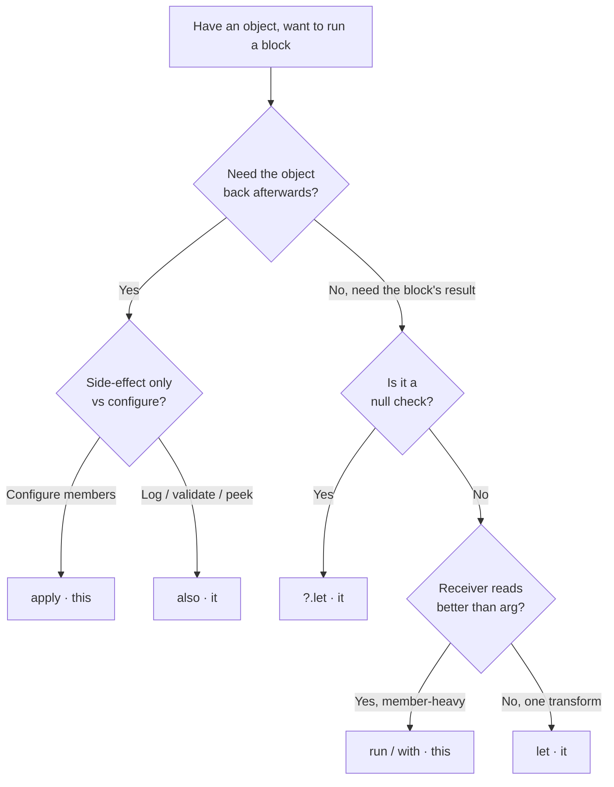
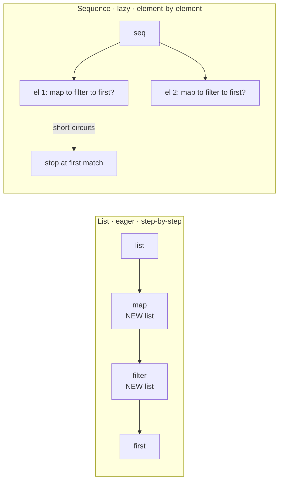

# Kotlin — Idioms & Functional

!!! abstract "Scope of this page"
    You know the syntax. This page is about *what the compiler actually does*, the tradeoffs a staff-level reviewer will grill you on, and the gotchas that cause real bugs. Every section leans on "what it compiles to" because that's where the interview signal lives.

---

## Scope functions

Five functions, two axes. That's the whole mental model — memorize the two axes, derive the rest.

- **Axis 1 — how is the context object exposed?** As the *receiver* (`this`, implicit) or as an *argument* (`it`, can be renamed).
- **Axis 2 — what does the call return?** The *lambda result* or the *context object itself*.

| Function | Object refers as | Returns | Extension? | Primary use |
|----------|------------------|---------|------------|-------------|
| `let`    | `it` (argument)  | lambda result | yes | null-guard + transform a value |
| `run`    | `this` (receiver)| lambda result | yes | compute a result from an object's members |
| `with`   | `this` (receiver)| lambda result | no (takes arg) | group calls on a non-null object |
| `apply`  | `this` (receiver)| **the object** | yes | configure/build then return the object |
| `also`   | `it` (argument)  | **the object** | yes | side-effect (log, validate) in a chain |

```kotlin
// let — transform + null handling. it is the non-null smart-cast value.
val len: Int? = nullableName?.let { name -> name.trim().length }

// run — receiver + result. Great for "compute over this object's scope".
val area = rect.run { width * height }

// with — same as run but not an extension; reads as "with(x) { ... }".
val desc = with(user) { "$firstName $lastName, $age" }

// apply — receiver + returns receiver. The canonical builder/config idiom.
val intent = Intent(this, DetailActivity::class.java).apply {
    putExtra("id", id)
    flags = FLAG_ACTIVITY_NEW_TASK
}

// also — argument + returns receiver. Side effects without breaking the chain.
val list = mutableListOf(1, 2, 3)
    .also { println("before: $it") }
    .apply { add(4) }
```

### Choosing under pressure



!!! tip "The `?.let` null idiom — and its subtlety"
    `x?.let { ... }` runs the block only when `x` is non-null, with `it` smart-cast to the non-null type. But note: if you add an `?: else` branch, `let` returning a nullable lambda result can make the elvis fire on a *legitimate null result*, not just on the null receiver. Keep the intent single-purpose.

    ```kotlin
    // Subtle bug: block legitimately returns null -> elvis fires anyway.
    val result = value?.let { compute(it) } ?: default  // fires if compute() == null too
    ```

!!! danger "The overuse anti-pattern"
    Nested scope functions are a readability tax. `a.apply { b.also { c.run { ... } } }` — now `this` and `it` mean three different things by lexical depth. Staff reviewers reject this. Rule of thumb: **one scope function per expression**; if you're nesting, extract a named function. Prefer an explicit `if (x != null)` over `x?.let` when there's an else branch — it's clearer and avoids the elvis trap above.

**What it compiles to:** all five are `inline` functions. There is *no lambda object allocated* and *no call overhead* — the body is spliced into the call site. So the choice is purely about readability, never performance. (This is also why non-local `return` works inside them; see inline below.)

---

## Delegated properties

`val/var x by <delegate>` desugars to the compiler generating a hidden field holding the delegate and rewriting every access to `delegate.getValue(thisRef, property)` / `delegate.setValue(...)`. The `property` is a `KProperty` reflection handle (cheap — created once).

### `by lazy` and its three thread-safety modes

```kotlin
// SYNCHRONIZED (default): double-checked locking. Safe across threads, one init wins.
val config by lazy { loadConfig() }

// PUBLICATION: multiple threads may compute concurrently, first result published wins;
// others are discarded. Use when init is cheap/idempotent and you want no lock.
val cache by lazy(LazyThreadSafetyMode.PUBLICATION) { buildCache() }

// NONE: no synchronization, no locking. Fastest. UNDEFINED behavior if touched
// from >1 thread. Use for single-thread-confined (e.g., main-thread-only UI) values.
val formatter by lazy(LazyThreadSafetyMode.NONE) { SimpleDateFormat("yyyy-MM-dd") }
```

| Mode | Locking | Init runs | Use when |
|------|---------|-----------|----------|
| `SYNCHRONIZED` | double-checked lock | exactly once | shared across threads (default, safe) |
| `PUBLICATION` | CAS, no lock | possibly >1, one wins | thread-safe but want no lock; idempotent init |
| `NONE` | none | once (unsafe if concurrent) | value confined to one thread |

!!! warning
    On Android, a property initialized only on the main thread is a classic `NONE` win — you pay zero synchronization. But if you're unsure, default `SYNCHRONIZED`; the lock is uncontended after first read.

### Observable / vetoable

```kotlin
import kotlin.properties.Delegates

var name: String by Delegates.observable("<none>") { prop, old, new ->
    log("$old -> $new")        // fires AFTER the value changes
}

var age: Int by Delegates.vetoable(0) { _, _, new ->
    new >= 0                    // return false to REJECT the assignment (value unchanged)
}
```

`observable` notifies post-change; `vetoable` runs a predicate *before* commit and rolls back on `false`. Both are built on `ObservableProperty`.

### `by map` and custom `ReadWriteProperty`

```kotlin
// by map: read properties out of a Map. Great for JSON-ish dynamic configs.
class User(json: Map<String, Any?>) {
    val id: Int by json
    val name: String by json      // keys must match property names
}

// Custom delegate: encapsulate get/set logic reusably.
class Trimmed : ReadWriteProperty<Any?, String> {
    private var value = ""
    override fun getValue(thisRef: Any?, property: KProperty<*>) = value
    override fun setValue(thisRef: Any?, property: KProperty<*>, v: String) {
        value = v.trim()
    }
}
class Form { var title: String by Trimmed() }
```

!!! note "Android `by viewModels()` vs `by lazy`"
    `by viewModels()` is a `Lazy`-backed property delegate from `androidx.activity`/`fragment-ktx`. It defers `ViewModelProvider` lookup until first access **and** ties the instance to the correct `ViewModelStoreOwner` so it survives config changes. Don't reimplement it with `by lazy { ViewModelProvider(this)... }` — you'd miss saved-state and scoping. Prefer the ktx delegate; use `by lazy` only for genuinely owned, non-lifecycle objects.

---

## Class delegation

`class B(a: A) : Foo by a` tells the compiler: implement every `Foo` member of `B` by forwarding to `a`. This is **composition-over-inheritance with zero boilerplate** — the decorator pattern without writing 40 forwarding methods.

```kotlin
interface Repository {
    fun load(id: String): Item
    fun save(item: Item)
}

// Decorator: add caching without touching the base impl.
class CachingRepository(
    private val delegate: Repository
) : Repository by delegate {          // save() forwarded automatically
    private val cache = mutableMapOf<String, Item>()
    override fun load(id: String): Item =  // override only what you change
        cache.getOrPut(id) { delegate.load(id) }
}
```

!!! danger "Delegation gotcha — no `this` re-entry"
    The generated forwarders call methods on the *delegate object*, not on `this`. So if `delegate.load()` internally calls `delegate.save()`, your `CachingRepository` override of `save` is **not** invoked — the delegate has no reference back to the wrapper. This is the classic "self-call" limitation of decoration; know it, because inheritance would have dispatched virtually.

---

## Higher-order functions & lambdas

A function type `(A, B) -> C` compiles to `Function2<A, B, C>` (the `kotlin.jvm.functions.FunctionN` interfaces). A lambda is an instance of one of those — **an allocated object** unless the enclosing function is `inline`.

```kotlin
val op: (Int, Int) -> Int = { a, b -> a + b }   // FunctionN instance
fun apply(x: Int, y: Int, f: (Int, Int) -> Int) = f(x, y)

// Trailing lambda: last-param lambda moves outside the parens.
apply(2, 3) { a, b -> a * b }

// Single param -> implicit `it`.
listOf(1, 2).map { it * 2 }

// Anonymous function: when you need an explicit return type or a `return` that
// exits the function itself (not a non-local return).
val safeDiv = fun(a: Int, b: Int): Int? {
    if (b == 0) return null      // returns from the anonymous fun
    return a / b
}
```

### Closures capture *variables*, not values

Kotlin closures capture the variable reference (unlike Java's effectively-final capture). A captured `var` is boxed into a `Ref.IntRef`-style holder so mutations are visible both ways.

```kotlin
var count = 0
val inc = { count++ }     // captures the variable; compiles to a Ref holder
inc(); inc()
println(count)            // 2  — mutation visible outside
```

!!! warning "The loop-capture / leak trap"
    Capturing a `var` in a long-lived lambda (e.g., a click listener stored on a view) keeps the enclosing scope — including `this` Activity — alive. Every non-inline lambda that references outer state is a potential leak on Android. Capture only what you need, or mark the enclosing hot function `inline`.

---

## `inline` / `noinline` / `crossinline`

`inline` copies the function body **and the lambda bodies** into the call site. Three consequences, each a distinct interview point:

1. **No lambda allocation** — the `FunctionN` object is never created; the code is inlined. This is why `map`/`filter`/scope functions are cheap.
2. **Non-local returns** — a bare `return` inside an inlined lambda returns from the *enclosing* function, because the code physically lives there.
3. **`reified` type params** — the type is known at the call site, so `T::class`, `is T`, `as T` become real bytecode. Only `inline` functions can `reified`.

```kotlin
inline fun <reified T> Gson.fromJson(json: String): T =
    fromJson(json, T::class.java)          // T is real here, not erased

inline fun runIf(cond: Boolean, block: () -> Unit) {
    if (cond) block()
}
fun demo(items: List<Int>) {
    items.forEach {
        runIf(it < 0) { return }           // NON-LOCAL: returns from demo()
    }
}
```

| Modifier | Applied to | Effect |
|----------|-----------|--------|
| `inline` | function | inline body + lambdas; enables reified, non-local return |
| `noinline` | a lambda param | keep this one lambda as a real object (so you can store/pass it) |
| `crossinline` | a lambda param | inline it, but **forbid non-local return** (needed when called from another execution context, e.g. a `Runnable`) |

```kotlin
inline fun schedule(
    crossinline task: () -> Unit,   // will run on another thread -> non-local return unsafe
    noinline onDone: () -> Unit     // stored/passed on -> must stay an object
) {
    Thread { task() }.start()
    registerCallback(onDone)
}
```

!!! danger "When NOT to inline"
    - **Large bodies** — inlining copies the *whole* body into *every* call site. A big inline function called in 50 places = 50× code bloat, blows I-cache, slows compile. Inline only small functions whose value is the lambda.
    - **No lambda params** — inlining a function that takes no functional argument buys almost nothing; you just lose the ability to change the impl without recompiling callers. The compiler even warns.
    - **Public API stability** — inlined code is baked into consumers; changing it doesn't take effect until they recompile.

---

## Extension functions & properties

An extension is compiled to a **static method** taking the receiver as the first parameter: `fun String.shout()` → `static shout(String)`. Two hard consequences:

- **Resolved statically, not polymorphically.** Dispatch is by the *declared* type, not the runtime type.
- **No new state.** Extension *properties* can't have backing fields — only computed get/set.

```kotlin
open class Base
class Derived : Base()
fun Base.name() = "Base"
fun Derived.name() = "Derived"

val b: Base = Derived()
println(b.name())   // "Base"  — static dispatch on the DECLARED type

// Nullable receiver extension: handle null inside the extension itself.
fun String?.orEmptyTrimmed(): String = this?.trim() ?: ""

// Extension property: computed only, no backing field.
val String.lastChar: Char get() = this[length - 1]
```

!!! warning "Discoverability & scope cost"
    - Member functions **win** over extensions with the same signature — an extension can be silently shadowed when the class later adds a member.
    - Extensions must be *imported* where the declaring package differs; IDE autocomplete won't surface them until imported, hurting discoverability.
    - Don't hang domain-critical behavior on extensions of third-party types — a reader can't find it from the class. Reserve extensions for small, local, obvious conveniences.

---

## Collections vs Sequences

Collection operators are **eager**: each step allocates a new list and fully materializes before the next runs. Sequence operators are **lazy**: elements flow one-at-a-time through the whole pipeline (element-wise, not step-wise), and nothing runs until a **terminal** operation.



```kotlin
// Eager: allocates a mapped list of 1M, then a filtered list, then takes 1.
val r1 = (1..1_000_000).map { it * 2 }.filter { it > 10 }.first()

// Lazy: pulls elements until first match; ~6 elements touched, zero intermediate lists.
val r2 = (1..1_000_000).asSequence().map { it * 2 }.filter { it > 10 }.first()
```

| | Collection (eager) | Sequence (lazy) |
|---|---|---|
| Intermediate storage | new list per step | none (streamed) |
| Short-circuits (`first`,`any`,`take`) | no — full step runs | yes |
| Best for | small data, few steps | large data, many steps, or early exit |
| Overhead | list allocations | per-element iterator indirection |
| Loses when | — | small collections (iterator overhead > allocation) |

!!! tip "The `asSequence` threshold"
    Sequences win when **(size × number of intermediate steps) is large**, or when you short-circuit. For a 10-element list with two `map`s, a plain collection is *faster* — the per-element `Iterator` boxing/indirection costs more than the two tiny allocations. Rule: don't reach for `asSequence()` on small lists; do reach for it on large pipelines or when you'll `first()`/`take(n)`/`any()`.

- **Intermediate** (lazy, return a `Sequence`): `map`, `filter`, `flatMap`, `take`, `distinct`, `sorted`*.
- **Terminal** (trigger evaluation): `toList`, `first`, `sum`, `count`, `fold`, `reduce`, `groupBy`, `associate`, `forEach`.

`sorted` is a "stateful intermediate" — it must buffer everything, killing part of the laziness benefit.

```kotlin
// Common terminal shapes worth knowing cold:
val byLen = words.groupBy { it.length }                 // Map<Int, List<String>>
val index = users.associate { it.id to it.name }         // Map<Id, Name>
val idMap = users.associateBy { it.id }                  // Map<Id, User>
val total = nums.fold(0) { acc, n -> acc + n }           // seeded accumulate
val max   = nums.reduce { a, b -> maxOf(a, b) }          // NO seed -> throws on empty!
val flat  = listOfLists.flatMap { it }                   // flatten one level
```

!!! danger
    `reduce` throws `UnsupportedOperationException` on an empty collection (no seed to return). `fold` is safe — it returns the seed. Prefer `fold` unless you've guaranteed non-empty.

---

## Operator overloading & conventions

Operators map to fixed function names marked `operator`. Resolution is by name + arity, not a symbol table — so you implement the *convention*.

```kotlin
data class Vec(val x: Int, val y: Int) {
    operator fun plus(o: Vec) = Vec(x + o.x, y + o.y)     // a + b
    operator fun get(i: Int) = if (i == 0) x else y        // a[i]
    operator fun compareTo(o: Vec) = (x*x+y*y).compareTo(o.x*o.x+o.y*o.y) // < > <= >=
}

class Grid {
    private val cells = HashMap<Pair<Int,Int>, Int>()
    operator fun get(r: Int, c: Int) = cells[r to c] ?: 0   // grid[r, c]
    operator fun set(r: Int, c: Int, v: Int) { cells[r to c] = v } // grid[r, c] = v
}

class Multiplier(val f: Int) {
    operator fun invoke(x: Int) = x * f     // makes the object callable: m(10)
}

// iterator convention -> enables for-loops over your type.
class IntBag(val items: List<Int>) {
    operator fun iterator() = items.iterator()
    operator fun contains(x: Int) = x in items      // `in` operator
}
```

| Symbol | Function | Notes |
|--------|----------|-------|
| `a + b` | `plus` | also `minus`,`times`,`div`,`rem` |
| `a[i]` / `a[i]=v` | `get` / `set` | any arity |
| `a()` | `invoke` | callable objects, DSLs |
| `a < b` | `compareTo` | must return `Int`; enables all four comparisons |
| `x in a` | `contains` | `!in` derived |
| `a..b` | `rangeTo` | ranges; `1..10`, custom types too |
| `for (x in a)` | `iterator` | returns something with `next()`/`hasNext()` |

!!! warning
    `compareTo` powering `<`/`>` should be *consistent with* `equals` or you'll get subtle bugs in sorted collections. Overload operators only where the symbol's meaning is unambiguous (`Vec + Vec` = good; `User + User` = mystery).

---

## Destructuring

`val (a, b) = x` compiles to `val a = x.component1(); val b = x.component2()`. Any type with `operator fun componentN()` destructures — `data class` gets them free (one per primary-constructor property, **in declaration order**).

```kotlin
data class Point(val x: Int, val y: Int)
val (x, y) = Point(1, 2)

// In loops and lambdas:
for ((key, value) in map) { /* Map.Entry has component1/2 */ }
list.map { (id, name) -> "$id:$name" }        // destructure the lambda param

val (_, second) = pair                          // skip with underscore
```

!!! danger "Data-class destructuring is positional — a maintenance trap"
    Destructuring is **by position, not by name**. If someone reorders the properties of a `data class`, every `val (a, b) = ...` site silently binds to the wrong field — compiles fine, wrong at runtime.

    ```kotlin
    data class User(val name: String, val email: String)  // later reordered to (email, name)
    val (name, email) = user   // now name holds the email — silent, no compile error
    ```

    Guidance: don't destructure data classes with 3+ same-typed fields across module boundaries; access by property name. This is why adding a property in the *middle* of a data class is a breaking change for destructuring callers.

---

## Functional patterns

- **Immutability first.** `val` + read-only interfaces (`List`, `Map`) as the default; expose `List`, keep a private `MutableList`. Note `val` ≠ deep-immutable — `val list = mutableListOf()` is still mutable.
- **Pure functions** — same input → same output, no side effects. Push side effects (I/O, logging) to the edges; keep the core pure and trivially testable.
- **`Result` / `Either`** for typed errors instead of exceptions across boundaries.
- **Higher-order functions for DI** — pass behavior as a function instead of an interface with one method.
- **Function references `::`** — pass an existing function where a lambda is expected.

```kotlin
// Kotlin's built-in Result: encapsulate success/failure without try/catch leaking.
fun parse(s: String): Result<Int> = runCatching { s.toInt() }
parse("42").map { it * 2 }.getOrElse { -1 }

// Sealed Either-style result — explicit, exhaustive when-handling.
sealed interface Outcome<out T> {
    data class Ok<T>(val value: T) : Outcome<T>
    data class Err(val msg: String) : Outcome<Nothing>
}

// HOF as lightweight DI — inject a strategy, no interface needed.
class PriceService(private val discount: (Double) -> Double)
val svc = PriceService(discount = { it * 0.9 })

// Function references:
val nums = listOf("1", "2").map(String::toInt)   // ::method
val make = ::Point                                 // ::constructor
val len  = String::length                          // bound later, or user::name (bound now)
```

!!! tip
    `runCatching` is great inside a boundary but **catches `Throwable`**, including `CancellationException` in coroutines — which you must rethrow, or you break structured concurrency. In coroutine code, catch specific exceptions or rethrow `CancellationException` explicitly.

---

## DSL building

Type-safe builders rest on one feature: **lambda with receiver**, `T.() -> Unit`. Inside the lambda, `this` is a `T`, so the builder's members are in scope without qualification. `@DslMarker` then stops you from accidentally reaching an *outer* receiver.

```kotlin
@DslMarker annotation class HtmlDsl

@HtmlDsl class Tag(val name: String) {
    private val children = mutableListOf<Tag>()
    var text: String = ""
    fun tag(name: String, block: Tag.() -> Unit) =        // receiver lambda
        Tag(name).apply(block).also { children.add(it) }
    override fun toString() =
        "<$name>${text}${children.joinToString("")}</$name>"
}

fun html(block: Tag.() -> Unit): Tag = Tag("html").apply(block)

val page = html {                 // this: Tag
    tag("body") {                 // this: inner Tag
        text = "Hi"
        // tag(...) here resolves to the inner Tag; @DslMarker forbids
        // implicitly calling the OUTER html's members — prevents nonsense nesting.
    }
}
```

!!! note "Where you already use this"
    - **Jetpack Compose** — `Column { ... }` is a `@Composable ColumnScope.() -> Unit`; `this` gives you `Modifier.weight` etc. scoped to the column.
    - **Gradle Kotlin DSL** — `android { defaultConfig { ... } }` are nested receiver lambdas; `@DslMarker`-style scoping keeps `defaultConfig` members from leaking up to `android`.
    - **KTX** — `bundleOf`, `buildString { append(...) }`, coroutine `flow { emit(...) }` all use receiver lambdas.

---

## Standard-library gems

```kotlin
// takeIf / takeUnless — turn a predicate into a nullable, chainable filter on one value.
val even = n.takeIf { it % 2 == 0 }          // n or null
val port = raw.takeUnless { it.isBlank() }?.toInt() ?: 8080

// repeat — index-parameterized loop.
repeat(3) { i -> log("attempt $i") }

// use — try-with-resources for Closeable; closes even on exception.
file.bufferedReader().use { it.readText() }

// Precondition helpers — fail fast with the right exception type:
requireNotNull(userId) { "userId required" }   // IllegalArgumentException on null  (ARG check)
require(age >= 0) { "age must be >= 0" }        // IllegalArgumentException           (ARG check)
checkNotNull(session) { "no session" }          // IllegalStateException on null      (STATE check)
check(isInitialized) { "not initialized" }      // IllegalStateException               (STATE check)

// TODO — throws NotImplementedError, but returns Nothing so it type-checks anywhere.
fun compute(): Int = TODO("wire up in phase 2")

// apply-style init — build-and-return an object configured inline.
val paint = Paint().apply { color = RED; isAntiAlias = true }
```

!!! tip "require vs check — the interview distinction"
    `require`/`requireNotNull` validate **arguments** → `IllegalArgumentException` (caller's fault). `check`/`checkNotNull` validate **object/state invariants** → `IllegalStateException` (our fault / wrong call order). Pick by *whose bug it is*. Both take a lazy message lambda so string building is skipped on the happy path.

---

## Java interop

Kotlin ↔ Java is seamless but the *annotations* control how Kotlin looks from Java, and **platform types** are the sharp edge.

```kotlin
object Config {
    @JvmField val VERSION = "1.0"          // exposes a plain field, not getVERSION()
    @JvmStatic fun init() { }              // real static method, callable Config.init() in Java
}

class Api {
    @JvmOverloads                          // generates Java overloads for each default arg
    fun request(url: String, timeout: Int = 30, retries: Int = 3) { }

    @JvmName("filterInts")                 // rename to dodge JVM signature clashes / ergonomics
    fun filter(xs: List<Int>): List<Int> = xs
}
```

- **`@JvmStatic`** — without it, Java must call `Config.INSTANCE.init()`; with it, `Config.init()`.
- **`@JvmField`** — exposes the backing field directly; skips the getter/setter (needed for e.g. `@JvmField` constants, some frameworks reading fields reflectively).
- **`@JvmOverloads`** — Kotlin default args don't exist in the JVM; this generates telescoping overloads so Java callers can omit them. **Essential for custom Views** whose constructors Java/inflater calls positionally.
- **`@JvmName`** — rename the emitted method; also resolves "same JVM signature after erasure" clashes (e.g. two functions differing only by `List<Int>` vs `List<String>`).

!!! danger "Platform types (`String!`) — the NPE leak"
    A value returned from Java has a *platform type* (`String!`) — Kotlin **suspends null-checking** because it can't know the Java nullability. Assign it to a non-null Kotlin type and you get an NPE *at the assignment*, not where you'd expect.

    ```kotlin
    val name: String = javaObj.getName()   // getName() may return null -> NPE HERE, not at use
    ```

    Defend with explicit nullable types on the boundary (`val name: String? = ...`) and honor Java's `@Nullable`/`@NonNull` annotations — Kotlin reads them and restores strict null-checking.

!!! note "SAM conversion & calling Kotlin from Java"
    - **SAM conversion**: a Java single-abstract-method interface accepts a Kotlin lambda (`view.setOnClickListener { }`). But a **Kotlin** function type does *not* auto-SAM-convert to a Kotlin `fun interface` unless you declare it `fun interface` — and Java calling a Kotlin function-type param must pass a `Function1` instance, which is ugly. Expose a `fun interface` for Java-facing callbacks.
    - Kotlin `suspend` functions compile with a hidden `Continuation` param — Java can't call them naturally. Provide a callback/`CompletableFuture` bridge for Java consumers.
    - Top-level Kotlin functions land in a `FileNameKt` class from Java; use `@file:JvmName("Utils")` to rename it.

---

## Interview Q&A

!!! question "Q1 — Do scope functions cost anything at runtime? When would you avoid them anyway?"
    **Answer.** No runtime cost — all five (`let/run/with/apply/also`) are `inline`, so no `FunctionN` object is allocated and the body is spliced into the call site. The choice is purely readability. You avoid them when they *hurt* readability: nested scope functions where `this`/`it` mean different things by depth, or `?.let { } ?: else` where the lambda can legitimately return null and wrongly trip the elvis. Prefer an explicit `if (x != null)` there.

    *Follow-up: "If they're free, why not `apply` everything?"* — Because `apply` returns the receiver and swallows the block's result; using it where you actually want the computed value forces awkward workarounds, and chains of `apply/also` obscure data flow. Semantic intent (returns-object vs returns-result, receiver vs arg) should match the call.

!!! question "Q2 — Why can only `inline` functions use `reified`, and what's the catch?"
    **Answer.** Generics are erased on the JVM — at runtime a `List<T>` doesn't know `T`. `reified` works only because `inline` copies the function body into each call site, where the concrete type *is* statically known, so `T::class`/`is T` become real bytecode against that concrete type. The catch: it forces inlining, so it inherits inlining's costs — code bloat if the body is large or called in many places, and it can't be called reflectively or from Java as a normal generic.

    *Follow-up: "What does `crossinline` change?"* — It keeps the lambda inlined but forbids non-local `return`, required when the lambda is invoked from a different execution context (another thread, a stored `Runnable`) where returning from the outer function would be meaningless/unsafe.

!!! question "Q3 — Eager collections vs sequences: how do you decide, and when is a sequence *slower*?"
    **Answer.** Collection ops are eager and allocate a new list per step; sequence ops are lazy and stream element-by-element with no intermediates, and they short-circuit (`first`, `take`, `any`). Reach for `asSequence()` when data is large, the pipeline has several steps, or you exit early. A sequence is *slower* on small collections because per-element `Iterator` indirection/boxing outweighs one or two small list allocations — for a 10-element list with two maps, a plain list wins.

    *Follow-up: "Which operator breaks laziness?"* — Stateful intermediates like `sorted`/`distinct` must buffer the whole stream before emitting, so they materialize internally and negate part of the streaming benefit.

!!! question "Q4 — What surprises people about destructuring a data class?"
    **Answer.** It's positional: `val (a, b) = user` compiles to `component1()`/`component2()`, bound by *declaration order*, not name. Reordering or inserting a property in the middle of the data class silently rebinds existing destructuring sites to the wrong fields — compiles clean, wrong at runtime. So inserting a property mid-class is a source-breaking change for destructuring callers; avoid destructuring data classes with several same-typed fields across module boundaries.

    *Follow-up: "How do you make it safe?"* — Access by property name at those sites, use `_` to skip, and keep positional destructuring to small local tuples/`Map.Entry` where order is obvious and stable.

!!! question "Q5 — Explain platform types and how they cause NPEs in 'null-safe' Kotlin."
    **Answer.** A value from Java has a platform type (notated `String!`): Kotlin can't infer nullability, so it *relaxes* null-checking on it — you can treat it as nullable or non-null. If you assign it to a non-null type and the Java side actually returned null, you get an NPE **at the assignment/first non-null use**, not at the logical use site, which makes it confusing. Defenses: type boundary values as nullable, respect Java `@Nullable`/`@NonNull` (Kotlin honors them and restores strict checking), and don't blanket-`!!`.

    *Follow-up: "Why does a custom Android View often need `@JvmOverloads`?"* — Kotlin default constructor args don't exist on the JVM; the layout inflater/Java calls the constructor positionally with 2–3 args. `@JvmOverloads` generates the telescoping constructor overloads so those calls resolve.

!!! question "Q6 — `require` vs `check` vs `!!` — when each?"
    **Answer.** `require`/`requireNotNull` validate **arguments** and throw `IllegalArgumentException` — the *caller* violated the contract. `check`/`checkNotNull` validate **internal state/invariants** and throw `IllegalStateException` — *we* called things in the wrong order. `!!` is a blunt "I assert non-null" that throws a generic `NullPointerException` with no context. Prefer `requireNotNull`/`checkNotNull` because they carry a message and express whose bug it is; reserve `!!` for cases the type system genuinely can't see and you've reasoned about.

    *Follow-up: "Why do these take a lambda for the message?"* — The message lambda is only invoked on failure, so you don't pay string-concatenation cost on the happy path — same reason `lazy` and logging APIs take lambdas.
