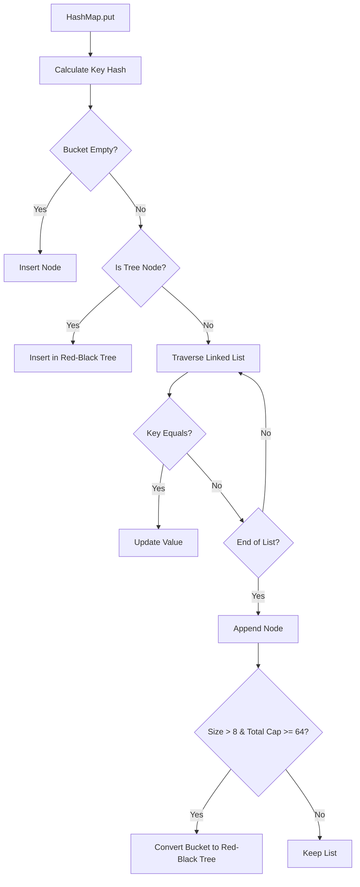

# Java, OOP & SOLID: Deep-Dive Q&A

This section covers the core Object-Oriented Programming (OOP) concepts, SOLID principles, and Java/JVM fundamentals that form the bedrock of JVM-based platforms. While modern Android relies heavily on Kotlin, understanding how the JVM compiles these features, coordinates memory, and manages concurrency is essential for senior-level engineering.

---

## 1. How do OOP core concepts map to SOLID principles, and how do Liskov Substitution (LSP) and Interface Segregation (ISP) violations manifest in Android?

!!! quote "Strong answer"
    The four core pillars of Object-Oriented Programming (OOP) — **Abstraction**, **Encapsulation**, **Inheritance**, and **Polymorphism** — provide the raw language mechanics, but **SOLID principles** guide how we structure these mechanics for long-term maintainability.
    
    * **Abstraction** maps to **Dependency Inversion (DIP)**: coding to abstract boundaries (interfaces/abstract classes) rather than concrete details decouples high-level business logic from low-level implementations.
    * **Encapsulation** protects class invariants, which supports **Single Responsibility (SRP)**: when a class encapsulates its state and only exposes behavior relevant to a single concern, it minimizes ripple effects when requirements change.
    * **Inheritance** and **Polymorphism** form the foundation for the **Open-Closed Principle (OCP)** (extending behavior via polymorphism without modifying source code) and the **Liskov Substitution Principle (LSP)**.
    
    In Android, **LSP violations** frequently occur when subclasses change the behavioral contract of their parent classes. A classic example is creating a custom View or a specialized Collection that throws `UnsupportedOperationException` for standard methods:
    ```java
    // LSP Violation: Subclass breaking parent contract
    public class ReadOnlyList<E> extends ArrayList<E> {
        @Override
        public boolean add(E e) {
            throw new UnsupportedOperationException("Cannot add to a read-only list");
        }
    }
    ```
    Any client expecting an `ArrayList` will crash if they attempt to modify this list. In Android development, this also happens when custom views override lifecycle callbacks or touch event handlers without calling `super.onEvent()`, breaking the expected behavior of the View hierarchy.
    
    **ISP violations** occur when a single "fat" interface forces implementers to depend on methods they do not use. In Android, a massive repository interface that handles authentication, database caching, and network polling is a clear violation. Splitting this into focused interfaces (`AuthDataSource`, `CacheStore`) ensures classes only implement what they need, minimizing compile-time and runtime dependencies.

!!! warning "Red flag"
    "SOLID is a set of strict, absolute laws that must be applied to every class, and LSP just means subclasses should inherit from their parents without issues." — Fails to understand the formal mathematical contract of LSP and treats SOLID as dogmatic ceremony rather than engineering tradeoffs.

**Follow-ups:** How does *Composition over Inheritance* relate to preventing LSP violations? · How do you balance SOLID design with the overhead of creating too many interfaces and classes on Android?

---

## 2. Compare Abstract Classes and Interfaces in modern JVM environments. What are the compile-time and runtime differences?

!!! quote "Strong answer"
    Historically, the distinction was simple: interfaces defined pure contract (stateless behavior), while abstract classes defined shared implementation and could hold state. With Java 8 (default and static interface methods) and Java 9 (private interface methods), the boundary has blurred, but critical differences remain:
    
    1. **State Storage**: An abstract class can have instance fields (non-static, non-final fields) to store instance state. Interfaces **cannot** hold instance state; all variables declared in an interface are implicitly `public static final` (constants).
    2. **Multiple Inheritance**: A class can implement multiple interfaces but can only extend one class. This is a design decision in the JVM to avoid the "Diamond Problem" (multiple inheritance of state and implementations).
    3. **Constructors**: Abstract classes can define constructors, which are invoked during subclass instantiation to initialize state. Interfaces cannot define constructors.
    4. **Visibility Modifiers**: Abstract classes can have members with `protected` or package-private visibility. In interfaces, all methods (excluding private helper methods) are implicitly `public`.
    
    From a runtime/compilation perspective:
    
    * When an interface with a `default` method compiles, the compiler generates a static helper class (e.g., `InterfaceName$-CC` or default implementation blocks in class metadata) containing the static method that implements the default behavior.
    * Method dispatch: Resolving a call on an interface uses the `invokeinterface` JVM instruction, which is slightly slower than the `invokevirtual` instruction used for abstract classes. `invokeinterface` requires searching an interface method table (`itable`) at runtime because a class can implement multiple interfaces, whereas `invokevirtual` resolves via a single virtual method table (`vtable`) offset.

!!! warning "Red flag"
    "Since Java 8, interfaces and abstract classes are the same, so we should always use interfaces." — Ignores the inability of interfaces to maintain instance state, have constructors, or control visibility modifiers like `protected`.

**Follow-ups:** How does the JVM resolve conflicts when a class implements two interfaces that define the exact same `default` method signature? · Why do Kotlin interfaces allow properties, and how does the compiler represent them on the JVM?

---

## 3. Explain Overloading vs. Overriding. How does the JVM handle method dispatch for each under the hood?

!!! quote "Strong answer"
    **Method Overloading** represents **static (compile-time) polymorphism**. It occurs when a class has multiple methods with the same name but different signatures (parameter types, count, or order). The compiler resolves the target method at compile time based on the *declared (compile-time) type* of the arguments.
    
    **Method Overriding** represents **dynamic (runtime) polymorphism**. It occurs when a subclass provides a specific implementation of a method already defined in its superclass. The JVM resolves the target method at runtime based on the *actual runtime type* of the receiver object.
    
    Under the hood, they compile to different JVM bytecode dispatch instructions:
    
    * **Overloaded methods** are dispatched using `invokestatic` (for static methods), `invokespecial` (for private methods or constructors), or `invokevirtual` (if they are instance methods). Crucially, the *method signature* is fully decided at compile time and hardcoded into the call site.
    * **Overridden methods** are dispatched using `invokevirtual` (for class instances) or `invokeinterface` (for interfaces). The resolution process is as follows:
        1. The JVM inspects the reference on top of the operand stack.
        2. It accesses the object's class metadata to find its virtual method table (`vtable`).
        3. The `vtable` is an array of pointers to method implementations. Because of the inheritance hierarchy, an overridden method shares the exact same index in the subclass `vtable` as it does in the superclass `vtable`.
        4. The JVM dereferences the pointer at that specific index and executes the code. This lookup is dynamic but optimized via inline caching.
    
    ```java
    class Parent {
        void print(Object obj) { System.out.println("Parent Obj"); }
    }
    class Child extends Parent {
        void print(Object obj) { System.out.println("Child Obj"); } // Overriding
        void print(String str) { System.out.println("Child Str"); } // Overloading
    }
    
    Parent p = new Child();
    Object val = "hello";
    p.print(val); 
    // Compiles to: invokevirtual Parent.print(Object)
    // Prints: "Child Obj" (Overriding resolved at runtime; overloading resolved p's argument as Object at compile time).
    ```

!!! warning "Red flag"
    "Overloading is resolved at runtime based on the actual argument types." — Incorrect; overloading is strictly a compile-time resolution.

**Follow-ups:** What is the difference between `invokevirtual` and `invokespecial`? · How does Kotlin's `inline` keyword affect method overloading and bytecode size?

---

## 4. How does the JVM manage Primitives vs. Object Wrappers, and how does this relate to reference equality and Java's evaluation semantics?

!!! quote "Strong answer"
    Java is strictly **pass-by-value**.
    
    * For primitive types (`int`, `boolean`, etc.), the actual bits representing the value are copied into the method's stack frame.
    * For objects, the reference *value* (the memory pointer address) is copied. Both the caller's reference variable and the callee's parameter variable point to the same object on the heap. Modifications to object fields inside the method affect the shared object, but reassigning the parameter reference inside the method has no effect on the caller's original reference.
    
    **Primitives vs. Object Wrappers**:
    
    * **Primitives** (`int`, `char`) are stored directly in the execution stack frame when declared as local variables, or embedded within the enclosing object's memory layout on the heap. They have no object header overhead.
    * **Object Wrappers** (`Integer`, `Double`) are full heap-allocated objects. Every object on the JVM has an object header (typically 12 to 16 bytes: 8 bytes for the Mark Word, 4-8 bytes for the Class Metadata Pointer). This makes wrappers highly inefficient for memory density and garbage collection. They also introduce boxing (converting primitive to wrapper) and unboxing overhead.
    
    **Equality & Caching**:
    
    * `==` compares primitives by value, and objects by **reference identity** (whether they point to the same address).
    * `equals()` is a method on `java.lang.Object` that defaults to `==` but is overridden by classes (like `String`, `Integer`) to check **structural equality**.
    * To optimize boxing, the JVM maintains an **Integer Cache** for values from `-128` to `127`. When you call `Integer.valueOf(x)` within this range, it returns a cached object instance.
    
    ```java
    Integer a = 127; Integer b = 127;
    System.out.println(a == b);      // true (cached instance)
    
    Integer c = 128; Integer d = 128;
    System.out.println(c == d);      // false (distinct heap objects)
    System.out.println(c.equals(d)); // true (structural equality)
    ```

!!! warning "Red flag"
    "Java is pass-by-value for primitives but pass-by-reference for objects." — Incorrect; both are pass-by-value, where the value of a reference is the pointer address itself.

**Follow-ups:** What is the memory footprint of an `int[]` with 1,000 elements versus an `ArrayList<Integer>` with 1,000 elements on a 64-bit JVM? · How does Java's Project Valhalla (inline types / value types) seek to address the wrapper overhead?

---

## 5. Why are JVM Strings immutable, how does the String Constant Pool function, and when do you choose StringBuffer vs. StringBuilder?

!!! quote "Strong answer"
    `String` is designed to be `final` and immutable in Java for three primary reasons:
    
    1. **Security**: Strings are widely used for classloading, network socket configuration, database URLs, and file paths. If Strings were mutable, an attacker could pass a valid path, bypass safety validation, and then mutate the String reference asynchronously (Time-of-Check to Time-of-Use vulnerability).
    2. **Thread Safety**: Immutable objects are inherently thread-safe. Multiple threads can read a String instance simultaneously without synchronization, eliminating data races.
    3. **Caching**: The hash code of a String can be cached upon instantiation (`hashCode` field inside `String` class). This speeds up key lookups in HashMaps and HashSets.
    
    **String Constant Pool (SCP)**:
    To conserve memory, the JVM maintains the String Constant Pool in the heap.
    
    * When a string literal is declared (e.g., `String s1 = "abc"`), the JVM checks the SCP. If "abc" is already present, it returns the pooled reference. If not, it creates a new String object in the SCP.
    * When calling `new String("abc")`, two objects are potentially created: one in the SCP (if not present) and a separate String object in the normal heap space.
    * The `intern()` method allows manual interaction: calling `s.intern()` searches the SCP for a string equal to `s`. If found, it returns the pooled instance; if not, it adds `s` to the SCP and returns its reference.
    
    **StringBuilder vs. StringBuffer**:
    
    * **StringBuilder**: A mutable sequence of characters. It is **not thread-safe** (no synchronization). It should be preferred for single-threaded string concatenation (e.g., local method loops) because it avoids synchronization overhead.
    * **StringBuffer**: A mutable, **thread-safe** sequence of characters. Almost all its methods are marked `synchronized`, ensuring safety across concurrent threads at the cost of execution performance.
    * *Note*: Compiler optimization automatically translates simple String additions (e.g. `String s = "a" + "b" + "c"`) into a `StringBuilder` concatenation behind the scenes.

!!! warning "Red flag"
    "To concatenate strings in a loop, you should just use `+` because the compiler optimizes it anyway." — Incorrect; the compiler generates a *new* `StringBuilder` instance inside the loop on each iteration, leading to $O(N^2)$ allocations.

**Follow-ups:** Where is the String Constant Pool located in memory, and how has its location changed between Java 6 and Java 7+? · What are the garbage collection characteristics of the String Constant Pool?

---

## 6. How does Type Erasure affect Java Generics, and how do you resolve the limitations of Wildcards (? extends vs ? super)?

!!! quote "Strong answer"
    Java Generics are implemented via **Type Erasure** to preserve backward compatibility with pre-Java 5 legacy code.
    
    1. **Compile Time**: The compiler performs strict type checks. It inserts implicit casts at call sites to guarantee type safety.
    2. **Erasure**: The compiler strips out all generic type parameter information from the bytecode. It replaces the parameters with their upper bound (typically `Object` or the declared boundary like `<T extends Number>` which erases to `Number`).
    3. **Result**: At runtime, a `List<String>` and a `List<Integer>` are identical to the JVM; both are simply raw `List` instances. Consequently, you cannot use `instanceof` with generic parameters (`list instanceof List<String>` is illegal), and you cannot instantiate generic types directly (`new T()`).
    
    **Wildcards and PECS**:
    Generics in Java are **invariant** (e.g., `List<String>` is not a subtype of `List<Object>`). To enable polymorphic behavior, Java uses bounded wildcards, governed by the **PECS** rule: **Producer Extends, Consumer Super**:
    
    * **Producer Extends (`? extends T`)**: Use this when you only read items from the collection (the collection *produces* data). It makes the generic type **covariant**. You can read items as `T`, but you cannot add anything (except `null`) to the collection because the compiler cannot guarantee the concrete underlying subtype.
      ```java
      List<? extends Number> list = new ArrayList<Integer>(); // Covariance
      Number num = list.get(0); // OK
      // list.add(10); // Compile Error!
      ```
    * **Consumer Super (`? super T`)**: Use this when you only write items to the collection (the collection *consumes* data). It makes the generic type **contravariant**. You can safely add items of type `T` (or its subclasses), but you can only read items from it as `Object` because the actual type could be any supertype of `T`.
      ```java
      List<? super Integer> list = new ArrayList<Number>(); // Contravariance
      list.add(10); // OK
      Object obj = list.get(0); // Only readable as Object
      ```
    
    Kotlin maps this to **declaration-site variance** using `out` (for `extends`/covariance) and `in` (for `super`/contravariance).

!!! warning "Red flag"
    "Java Generics exist at runtime, and we can check generic parameter types at runtime using reflection on any object instance." — Incorrect; type erasure removes these. Only generic metadata in class declarations is readable via reflection, not instance-level parameters.

**Follow-ups:** How does Kotlin's `reified` keyword work if the underlying JVM still erases types? · What are "bridge methods" generated by the compiler during type erasure?

---

## 7. Deep dive into JVM collections: Compare Arrays vs. ArrayLists, and explain the internal mechanics of HashMap, HashSet, and TreeSet.

!!! quote "Strong answer"
    **Arrays vs. ArrayLists**:
    
    * **Arrays**: Fixed size, contiguous memory blocks, support primitive types directly, and are **covariant** at compile time (`Number[] arr = new Integer[10]` compiles, but throws `ArrayStoreException` at runtime if you put a `Double` in it).
    * **ArrayLists**: Dynamically resizable, backed by a standard array. They only support object references (requiring boxing/unboxing for primitives), are **invariant** (`List<Number>` is unrelated to `List<Integer>`), and grow by $1.5\times$ (via bitwise shift `oldCapacity + (oldCapacity >> 1)`) when they run out of space. Resizing is a costly $O(N)$ operation requiring memory copy via `System.arraycopy()`.
    
    **HashMap & HashSet Internals**:
    
    * **HashMap** is an array of buckets containing linked lists (and potentially red-black trees). When inserting a key-value pair:
        1. The key's `hashCode()` is computed and passed to a hash function to spread the bits (minimizing collisions).
        2. The target bucket index is computed: `index = hash & (n - 1)`, where `n` is the array capacity (which is always a power of two to allow fast bitwise modulo).
        3. If the bucket is empty, a new `Node` is created. If a collision occurs:
            * **Before Java 8**: The node was appended to the linked list in $O(N)$ time.
            * **Java 8+**: If a bucket's linked list length exceeds `TREEIFY_THRESHOLD = 8` and the total capacity is at least `MIN_TREEIFY_CAPACITY = 64`, the linked list is converted into a self-balancing **Red-Black Tree**. This improves worst-case lookup from $O(N)$ to $O(\log N)$.
        4. If the number of elements exceeds `capacity * loadFactor` (default `0.75`), the map resizes to double its capacity.
    * **HashSet** is simply a wrapper around a `HashMap`. The set elements are stored as the *keys* in the underlying map, while a dummy constant Object (`new Object()`) is used as the *value* for every entry.
    
    **HashSet vs. TreeSet**:
    
    * **HashSet** is backed by `HashMap`, offers $O(1)$ constant time for lookup/insertion, and makes no ordering guarantees.
    * **TreeSet** is backed by `TreeMap` (Red-Black tree), offers $O(\log N)$ logarithmic time for lookup/insertion, and keeps elements sorted according to their natural ordering or a provided `Comparator`.



!!! warning "Red flag"
    "HashSet and HashMap are completely separate data structures implemented differently from scratch." — HashSet delegates all operations to an internal HashMap instance.

**Follow-ups:** What is the contract between `equals()` and `hashCode()`? What happens if you override one but not the other? · Why is the initial capacity of a `HashMap` always a power of two?

---

## 8. Differentiate between Fail-Fast and Fail-Safe Iterators. How are they implemented, and what are their concurrency guarantees?

!!! quote "Strong answer"
    The key difference between **Fail-Fast** and **Fail-Safe** (more accurately called **Weakly-Consistent**) iterators is how they react to structural modifications made to the collection while iterating.
    
    **Fail-Fast Iterators**:
    
    * **Collections**: Standard collections like `ArrayList`, `HashSet`, `HashMap` (via their iterator implementations).
    * **Implementation**: The collection maintains an internal modification counter called `modCount`. When an iterator is initialized, it records the current `modCount` as `expectedModCount`. On every call to `next()` or `remove()`, the iterator compares the collection's current `modCount` with its `expectedModCount`.
    * **Behavior**: If they differ (meaning the collection structure was modified by adding, removing, or clearing elements outside the iterator's own methods), the iterator immediately throws a `ConcurrentModificationException`.
    * **Caveat**: It is safe to remove items during iteration *only* if you use the `Iterator.remove()` method, which updates `expectedModCount` to match `modCount`.
    
    **Fail-Safe / Weakly-Consistent Iterators**:
    
    * **Collections**: Concurrency-focused collections like `CopyOnWriteArrayList`, `ConcurrentHashMap`.
    * **Implementation**:
        * `CopyOnWriteArrayList` creates a snapshot copy of the backing array upon iterator creation. The iterator traverses this immutable snapshot, while any modifications create a fresh clone of the backing array.
        * `ConcurrentHashMap` uses segment/bucket partitioning. Its iterator traverses the internal bucket segments directly, reflecting modifications dynamically without throwing exceptions.
    * **Behavior**: They do **not** throw `ConcurrentModificationException`. They guarantee that iteration will succeed, but they operate on stale data (snapshots) and may not reflect modifications made to the collection after the iterator started.

!!! warning "Red flag"
    "Fail-safe iterators are always better and should replace fail-fast collections everywhere." — Ignores the immense memory/allocation cost of `CopyOnWriteArrayList` on modifications, and the fact that fail-safe iterators allow stale data reads.

**Follow-ups:** How does `ConcurrentHashMap` achieve high write throughput without blocking all readers? · What happens if you try to modify a list using standard `list.remove()` inside a Kotlin `forEach` block?

---

## 9. Contrast Shallow vs. Deep Copy, and evaluate the trade-offs of Serialization, Externalizable, and Android's Parcelable.

!!! quote "Strong answer"
    **Shallow vs. Deep Copy**:
    
    * **Shallow Copy**: Duplicates the top-level object wrapper, but copies the nested object *references* directly. The new object and the original object share the exact same references to child objects. Modifications to child fields affect both.
    * **Deep Copy**: Duplicates both the top-level object and recursively clones all nested child objects. The copied object shares no reference dependencies with the original.
    
    **Serialization & Deserialization**:
    Serialization is the process of converting an object's state into a portable byte stream; deserialization is the reverse.
    
    1. **`java.io.Serializable`**: A marker interface (no methods to implement).
        * **How it works**: The JVM handles serialization automatically via runtime reflection, traversing the entire object graph.
        * **Trade-offs**: Extremely slow due to reflection, high memory allocation, and produces large byte streams. It represents a massive security risk because deserialization can instantiate arbitrary code graphs (gadget chains).
        * **`transient` Keyword**: Prevents fields from being serialized. Fields marked `transient` revert to default values (e.g. `null`, `0`) during deserialization.
        * **`serialVersionUID`**: A version identifier. If the class definition changes (e.g. adding fields) and the stream's `serialVersionUID` doesn't match the class's, deserialization immediately throws an `InvalidClassException`.
    2. **`java.io.Externalizable`**: Extends `Serializable` but requires manual implementation of `writeExternal()` and `readExternal()`.
        * **Trade-offs**: Eliminates reflection overhead and improves performance, but requires writing manual serialization logic for every field.
    3. **Android `Parcelable`**:
        * **How it works**: An Android-specific serialization interface designed for IPC (Inter-Process Communication via Binder). It requires explicit manual writing/reading of fields using a `Parcel`.
        * **Trade-offs**: Orders of magnitude faster than `Serializable` on Android because it avoids reflection. However, it cannot be used for persistent disk storage because the internal representation is not guaranteed to remain stable across different Android OS versions or updates.

!!! warning "Red flag"
    "Use Java `Serializable` for passing complex data between activities in Android because it's standard and doesn't require boilerplate." — Serializable's reflection overhead can block the main thread and cause frame drops. On Android, `Parcelable` or Kotlin Serialization is the mandated standard for IPC.

**Follow-ups:** Why does Java's default serialization bypass constructors during deserialization? · How does `readResolve()` help preserve the Singleton pattern during deserialization?

---

## 10. Explain Exception Handling in Java/Kotlin. How does the JVM compile try-catch-finally, and what are the checked exception trade-offs?

!!! quote "Strong answer"
    **Try-Catch-Finally under the hood**:
    The JVM does not have separate instructions for handling exceptions in normal flow. Instead, it compiles `try-catch` blocks using an **Exception Table** inside the class file.
    
    * The Exception Table contains entries with four fields: `from` (start PC), `to` (end PC), `target` (handler PC), and `type` (exception class reference).
    * When an exception is thrown, the JVM checks the program counter (PC) of the throwing line. It searches the Exception Table for a matching range and exception type. If found, it jumps execution to the `target` handler PC; if not, it pops the stack frame and propagates the exception to the caller.
    * **Finally block compile strategy**: The compiler handles `finally` by **duplicating** the finally block's bytecode. It appends a copy of the finally bytecode to the end of the try block, the end of each catch block, and generates an implicit `any` catch block that catches all throwables, executes the finally bytecode, and rethrows the exception.
    
    !!! warning "The Finally Return Gotcha"
        If a `finally` block contains a `return` or `throw` statement, it will swallow any exception thrown in the `try` or `catch` blocks. The return statement pops the stack frame immediately, discarding the exception reference.
        ```java
        public int test() {
            try {
                throw new RuntimeException();
            } finally {
                return 42; // Swallows the RuntimeException! Returns 42 normally.
            }
        }
        ```
    
    **Checked vs. Unchecked Exceptions**:
    
    * **Checked Exceptions** (subclasses of `Exception` excluding `RuntimeException`) are verified at compile time. Methods must declare them via `throws` or catch them.
    * **Unchecked Exceptions** (subclasses of `RuntimeException` or `Error`) are not verified at compile time.
    * **The Design Mistake**: Java's checked exceptions were designed to force programmers to handle recoverable errors. In practice, it led to massive boilerplate, empty catch blocks, and issues with functional interfaces (Java's standard functional interfaces like `Consumer` do not allow checked exceptions unless wrapper interfaces are declared).
    * **Kotlin's approach**: Kotlin **does not support checked exceptions**. Every exception is unchecked. If you call Java code that throws a checked exception from Kotlin, you are not forced to wrap it in a try-catch.

!!! warning "Red flag"
    "Kotlin has checked exceptions just like Java, but the IDE hides them." — Kotlin has absolutely no checked exception enforcement at the compiler level. Everything compiles to standard runtime throws.

**Follow-ups:** How does Kotlin's `@Throws` annotation affect Java interoperability? · What happens to execution if a finally block throws a new exception while an exception in the catch block is already active?

---

## 11. Explain Volatile vs. Synchronized. How do JVM Monitors and lock-free Atomic CAS operations work?

!!! quote "Strong answer"
    Java Concurrency relies on two key guarantees: **Visibility** (threads seeing updates from other threads) and **Atomicity** (operations executing as a single indivisible step).
    
    **Volatile**:
    
    * **Guarantees**: **Visibility** and **Instruction Ordering** (no reordering of reads/writes around the volatile variable).
    * **Under the hood**: Writing to a `volatile` variable flushes the CPU's write buffer/cache to main memory. Reading a `volatile` variable invalidates local CPU caches, forcing a read directly from main memory. The compiler and CPU insert **Memory Barriers** (fences) to prevent instruction reordering.
    * **Limitation**: It does **not** guarantee atomicity. `volatile int count = 0; count++;` is not thread-safe because `count++` compiles to three operations: read, modify, write. Two threads can execute this concurrently and overwrite each other's increments.
    
    **Synchronized & JVM Monitors**:
    
    * **Guarantees**: Both **Visibility** and **Atomicity**.
    * **Under the hood**: Every object on the JVM is associated with a **Monitor Lock**. The compiler wraps synchronized blocks with `monitorenter` and `monitorexit` bytecode instructions.
        * When a thread reaches `monitorenter`, it attempts to acquire the lock.
        * The lock state is tracked in the object's header (Mark Word).
        * JVM locks are optimized via **Lock Inflation**:
            1. **Biased Locking**: The lock is biased toward the first thread that acquires it, avoiding expensive CAS operations.
            2. **Lightweight Locking**: If a second thread tries to acquire the lock, the lock inflates. Threads spin-wait using CAS instead of blocking.
            3. **Heavyweight Locking**: If contention is high, the lock inflates to a heavyweight monitor, blocking the thread at the OS level (causing thread context switching).
    
    **Atomic Package & CAS**:
    
    * Classes like `AtomicInteger` provide lock-free thread safety.
    * **Under the hood**: They do not block threads. Instead, they use a CPU-level primitive called **Compare-And-Swap (CAS)** (implemented via `sun.misc.Unsafe` and executed as hardware instructions like `lock cmpxchg` on x86).
    * **Mechanics**: CAS takes three parameters: a memory location ($V$), the expected old value ($A$), and the new value ($B$). It updates the memory location to $B$ *if and only if* the current value at $V$ is $A$. If the value has changed, the CAS operation fails, and the atomic class typically spins in a loop (busy-spin) to try again.

!!! warning "Red flag"
    "Declaring a variable as `volatile` makes it safe for atomic concurrent modifications like additions and increments." — No; volatile only guarantees visibility, not mutual exclusion.

**Follow-ups:** What is the ABA problem in CAS operations, and how does `AtomicStampedReference` solve it? · What are the performance trade-offs of synchronized locks versus atomic busy-spinning under high concurrency contention?

---

## 12. How does ThreadPoolExecutor process task queues, and how do you differentiate Concurrency from Parallelism?

!!! quote "Strong answer"
    **Concurrency vs. Parallelism**:
    
    * **Concurrency** is about **structure**. It is the composition of independently executing processes/threads. On a single-core CPU, concurrency is achieved via time-slicing (the OS scheduler swapping execution contexts rapidly).
    * **Parallelism** is about **execution**. It is the simultaneous physical execution of multiple tasks at the exact same moment on separate physical CPU cores. Parallelism requires multi-core hardware.
    
    **ThreadPoolExecutor Internals**:
    A `ThreadPoolExecutor` manages a pool of worker threads to execute tasks asynchronously. Its core mechanics are governed by:
    
    * `corePoolSize`: The number of threads kept alive in the pool, even if they are idle.
    * `maximumPoolSize`: The maximum number of threads allowed in the pool.
    * `keepAliveTime`: The time idle threads exceeding `corePoolSize` will wait before terminating.
    * `workQueue`: A `BlockingQueue<Runnable>` used to hold tasks before execution.
    * `handler`: A `RejectedExecutionHandler` that defines saturation policies.
    
    **Task Submission Flow**:
    When a new `Runnable` is submitted via `execute(task)`:
    
    1. If the current number of running threads is **less than** `corePoolSize`, a new thread is created immediately to execute the task (even if other core threads are idle).
    2. If running threads $\ge$ `corePoolSize`, the executor attempts to place the task in the `workQueue`.
    3. If the `workQueue` is **full**:
        * If running threads is **less than** `maximumPoolSize`, a new thread is spawned to execute the task immediately.
        * If running threads $\ge$ `maximumPoolSize`, the task is rejected.
    4. If rejected, the saturation policy executes:
        * **AbortPolicy** (Default): Throws `RejectedExecutionException`.
        * **CallerRunsPolicy**: Executes the task on the caller's thread (slowing down submission).
        * **DiscardPolicy**: Silently discards the task.
        * **DiscardOldestPolicy**: Discards the oldest unhandled task in the queue and retries.
    
    !!! warning "Unbounded Queue Trap"
        If you pass an unbounded queue (like `LinkedBlockingQueue` without a capacity limit), the queue will never fill up. As a result, the pool will never spawn threads beyond `corePoolSize`, rendering `maximumPoolSize` completely useless.

!!! warning "Red flag"
    "If a thread pool's max size is 10 and core size is 2, submitting 5 tasks will spawn 5 threads immediately." — No; it will spawn 2 core threads, queue the remaining 3 in the work queue, and only spawn more threads if the queue fills up.

**Follow-ups:** Under what conditions would you choose a `SynchronousQueue` over a `LinkedBlockingQueue` in a thread pool? · How does the ForkJoinPool used by Kotlin Coroutines differ from a standard ThreadPoolExecutor?

---

## 13. Object-level lock vs. class-level lock, and daemon vs. user threads — what's actually different at the JVM level?

!!! quote "Strong answer"
    **Object-level lock vs. class-level lock**

    Every `synchronized` block or method acquires the monitor of *some specific object* — the distinction is entirely about **which object that is**:

    * **Object-level (instance) lock** — `synchronized(this)` or a non-static `synchronized` method locks the **monitor of that specific instance**. Two threads calling a synchronized instance method on **two different objects** never contend; they're locking two different monitors. This only protects state *within one instance*.
    * **Class-level (static) lock** — `synchronized(MyClass.class)` or a static `synchronized` method locks the monitor of the **`Class` object itself** — one per class, shared by every instance and every thread in the JVM for that class. This is what you need to protect *static* mutable state (a shared counter, a classic double-checked-locking singleton's instance field).

    The bug this distinction catches: mixing them. Protecting a `static` field with an **instance** lock (`synchronized(this)`) does nothing — two threads holding two different instances each get their own monitor and race on the shared static field anyway. The lock granularity must match the state's scope: instance state → instance lock, static state → class lock.

    **Daemon threads vs. user (non-daemon) threads**

    The distinction only matters for one thing: **whether the JVM waits for the thread before exiting.**

    * **User threads** (the default) keep the JVM alive — `main()` returning doesn't shut down the process while a non-daemon thread is still running.
    * **Daemon threads** (`thread.isDaemon = true`, set *before* `start()`) are background/service threads the JVM does **not** wait for — the moment the last user thread finishes, the JVM exits immediately, **killing every daemon thread mid-execution**, `finally` blocks and all. GC's own worker threads are the canonical daemon thread.

    This is why you never put work with side effects that must complete (a flush-to-disk, a network ack) on a bare daemon thread with no other coordination — it can simply vanish. On Android this distinction mostly stays invisible because the Zygote-forked process model and `ActivityThread`'s own non-daemon main thread keep the process alive independent of it — but it's exactly what a coroutine dispatcher's backing thread pool must get right (threads that don't block process exit but also don't silently drop in-flight work, which coroutines solve via structured concurrency and cancellation, not the raw daemon flag).

!!! warning "Red flag"
    "I made it a daemon thread so it keeps running in the background even after my app's main logic finishes." — Backwards: a daemon thread is *less* durable, not more — it's the one guaranteed to be cut off the instant nothing else is keeping the JVM alive.

**Follow-ups:** Why does a plain `synchronized(this)` instance lock fail to protect a `static` counter shared by all instances? · Why do coroutine dispatchers use bounded worker-thread pools with explicit lifecycle management instead of raw daemon threads?
