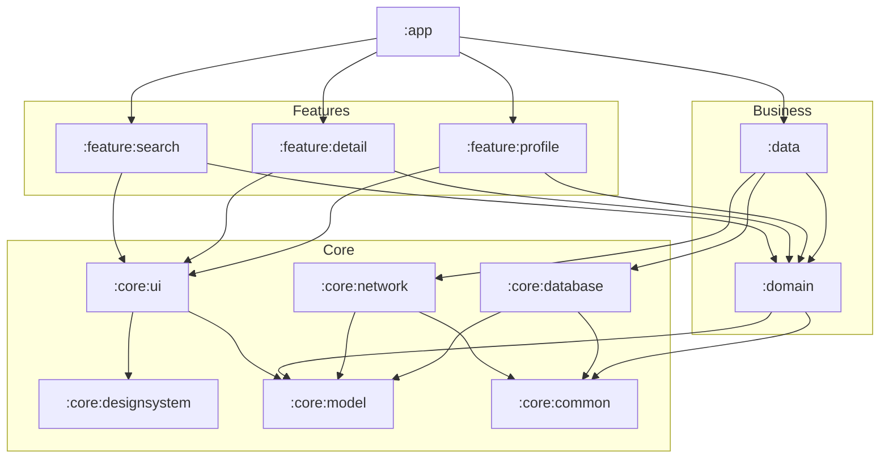

# Modularization Strategy

This is the page you defend on a whiteboard. Know the three splitting strategies cold, know the canonical module taxonomy, and be able to draw the graph without hesitating.

## By-layer vs by-feature vs hybrid

| Strategy | Top-level split | What it optimizes | Where it breaks |
|---|---|---|---|
| **By-layer** | `:ui`, `:domain`, `:data` | Simple to explain; clean-architecture purity | Every team edits the same 3 mega-modules → merge conflicts, no ownership, no build parallelism (change to `:data` rebuilds everything) |
| **By-feature** | `:feature:search`, `:feature:cart`, `:feature:profile` | Ownership, blast-radius isolation, parallel builds | Cross-cutting concerns (networking, DB, design system) get duplicated if there's no shared layer |
| **Hybrid (correct answer)** | `:feature:*` on top, `:core:*` / `:data` / `:domain` shared beneath, `:app` at the root | Ownership **and** reuse; wide-shallow graph that parallelizes | More module types to learn; requires discipline to keep `:core` stable |

!!! note "The hybrid is the NowInAndroid layering — and the expected senior answer"
    `:app` wires everything together. `:feature:*` modules are independent and never depend on each other. `:core:*` modules are shared building blocks. `:data`/`:domain` hold business logic and repositories. Layer *within* each feature; split *across* features. If you answer "by-layer" for a large app in an interview, that's a red flag.

## The canonical module types

Memorize this taxonomy — it's the shared vocabulary of every large Android codebase and NowInAndroid.

| Module | Responsibility | Depends on |
|---|---|---|
| `:app` | The single entry point. Wires the Hilt graph, hosts nav host, applies theme. **Thin.** | All `:feature:*`, `:core:*` needed to compose |
| `:feature:<name>` | One user-facing feature: screens, ViewModels, feature nav. | `:core:ui`, `:core:designsystem`, `:domain` (or `:data`), `:core:model` |
| `:core:ui` | Shared composables that depend on domain models (e.g. an item card) | `:core:designsystem`, `:core:model` |
| `:core:designsystem` | Pure design: theme, typography, colors, atoms (buttons, icons). **No domain knowledge.** | Nothing app-specific |
| `:core:common` | Dispatchers, `Result` wrappers, extensions, base utilities | Nothing |
| `:core:network` | Retrofit/OkHttp/Ktor client, DTOs, serialization | `:core:common`, `:core:model` |
| `:core:database` | Room DB, DAOs, entities | `:core:common`, `:core:model` |
| `:core:datastore` | Proto/Preferences DataStore for user prefs | `:core:common`, `:core:model` |
| `:core:model` | Pure Kotlin domain models. No Android deps. Everyone depends on it. | Nothing |
| `:data` | Repository **implementations**; merges network + db; single source of truth | `:core:network`, `:core:database`, `:domain` |
| `:domain` | Use cases + repository **interfaces**. Optional layer. | `:core:model` |
| `:core:testing` | Test doubles, fakes, rules, JUnit/Compose test helpers | test frameworks |

!!! tip "Keep `:core:model` a pure Kotlin (JVM) module"
    If `:core:model` has zero Android dependencies (`java-library` + `kotlin("jvm")`), it compiles fast, is trivially unit-testable, and every module can depend on it without dragging in the Android runtime. This is a cheap, high-signal decision.

## `api` vs `implementation` — and why `implementation` speeds builds

This is a guaranteed follow-up. Get the compilation-avoidance mechanism exactly right.

```kotlin
dependencies {
    // Leaks Retrofit onto MY consumers' compile classpath.
    // If I change Retrofit version, everyone who depends on ME recompiles.
    api(libs.retrofit)

    // Retrofit is on MY runtime classpath but NOT my consumers' compile classpath.
    // Changes to Retrofit's ABI stop at MY module boundary.
    implementation(libs.retrofit)
}
```

- `implementation` **hides** the dependency from the consumer's *compile* classpath. When you change an `implementation` dependency's internals (or bump it, as long as the ABI you expose doesn't change), Gradle **skips recompiling consumers** — this is *compilation avoidance*. It also shrinks the classpath the compiler must resolve, which is faster.
- `api` **exposes** the dependency transitively. A consumer can `import` it without declaring it. This is right only when your module's *public API signatures* return or accept types from that dependency (e.g. a `:core:model` type exposed by `:domain` interfaces).

!!! warning "Default to `implementation`; reach for `api` deliberately"
    Overusing `api` recreates the monolith: one ABI change ripples through the whole graph and kills incremental-build gains. Use `api` only for types that genuinely appear in your public signatures. A common correct `api` case: `:domain` exposing `:core:model` types, since use cases return domain models.

## The feature-to-feature problem

The hardest constraint to defend: **feature modules must not depend on each other.**

If `:feature:cart` depends on `:feature:product`, you've coupled two teams, broken parallel builds (a product change rebuilds cart), and risk a dependency cycle Gradle will reject outright. Yet cart genuinely needs to navigate to a product screen. How?

**Navigation is the decoupling seam.** Features depend on a navigation *contract*, not on each other.

- Each feature exposes only a **route** (a string/typed destination) and registers its own graph, e.g. `NavGraphBuilder.productScreen(...)`.
- A feature that wants to navigate elsewhere calls `navController.navigate(route)` with a route it knows by contract — it does **not** reference the destination's ViewModel, screen, or internals.
- Where a compile-time contract is needed (e.g. feature A must call a function feature B owns), put the **interface in a shared `:core` or `:domain` module**, put the implementation in feature B, and let Hilt inject it. Feature A depends on the interface, never on B.

```mermaid
graph LR
    A["feature:cart"] -->|navigate(productRoute)| N["core: navigation contract"]
    B["feature:product"] -->|registers productScreen()| N
    A -. "NO direct dependency" .-> B
```

!!! note "Two viable patterns — name both"
    1. **String/typed routes + a nav contract module**: simplest, what NowInAndroid does. Features are siblings; `:app` assembles the nav host from each feature's registered graph.
    2. **`:feature:api` + `:feature:impl` split**: heavier. Feature B publishes a tiny `:feature:product:api` (interfaces, routes) that A depends on; B's `:impl` stays private. Use this when features need richer compile-time contracts than a route string.

## The dependency rule & module visibility

- **Dependencies point inward/downward only**: `:app → :feature → :domain/:data → :core`. Never the reverse. `:core` must never depend on a `:feature`.
- **No sibling feature dependencies** (above).
- **No cycles** — Gradle fails the build, but design to avoid them, don't rely on the failure.
- Enforce with tooling, not vigilance: a custom **Gradle/Konsist/Lint rule** or the module graph assertion (NowInAndroid ships a `ModuleGraphAssertion`) that fails CI when an illegal edge appears.
- Use Kotlin `internal` visibility aggressively inside a module so only the intended public surface leaks across the boundary.

## A realistic module dependency graph



Note the shape: **wide and shallow.** Features are leaves depending on a stable core; changing one feature rebuilds only that feature and `:app`.

## Convention plugins vs `buildSrc` (build-time angle)

Every module needs the same ~40 lines of Android/Kotlin/Compose/Hilt config. You have two ways to share it:

| Approach | Build-time behavior | Verdict |
|---|---|---|
| `buildSrc` | A change to *any* `buildSrc` file **invalidates the entire build's configuration cache** and recompiles all build logic → slow feedback | Legacy; avoid for large projects |
| **`build-logic` included build + convention plugins** | Plugins are versioned artifacts; changing one plugin only reconfigures modules that apply it. Plays well with the configuration cache | **Correct answer** — see [Convention Plugins](convention-plugins.md) |

## Gradle version catalogs (`libs.versions.toml`)

Centralize every dependency and version in `gradle/libs.versions.toml`. One source of truth, type-safe `libs.*` accessors, and it's readable from convention plugins too.

```toml
[versions]
kotlin = "2.0.21"
androidGradlePlugin = "8.7.0"
hilt = "2.52"
composeBom = "2024.10.00"
retrofit = "2.11.0"

[libraries]
retrofit = { group = "com.squareup.retrofit2", name = "retrofit", version.ref = "retrofit" }
hilt-android = { group = "com.google.dagger", name = "hilt-android", version.ref = "hilt" }
hilt-compiler = { group = "com.google.dagger", name = "hilt-compiler", version.ref = "hilt" }
androidx-compose-bom = { group = "androidx.compose", name = "compose-bom", version.ref = "composeBom" }

[plugins]
android-application = { id = "com.android.application", version.ref = "androidGradlePlugin" }
android-library = { id = "com.android.library", version.ref = "androidGradlePlugin" }
kotlin-android = { id = "org.jetbrains.kotlin.android", version.ref = "kotlin" }
hilt = { id = "com.google.dagger.hilt.android", version.ref = "hilt" }
```

## A feature module's `build.gradle.kts` (with a convention plugin)

The payoff of all the above: a feature module's build file collapses to intent, not configuration.

```kotlin
plugins {
    // One line applies library + kotlin + compose + hilt conventions.
    id("myapp.android.feature")
}

android {
    namespace = "com.myapp.feature.search"
}

dependencies {
    implementation(projects.core.ui)
    implementation(projects.core.designsystem)
    implementation(projects.domain)

    // NO dependency on any other :feature module — that's the rule.
}
```

Compare that to the 40+ lines every module would otherwise repeat (compileSdk, minSdk, Java/Kotlin targets, Compose compiler, Hilt plugin + compiler, test runner…). That repetition is exactly what [convention plugins](convention-plugins.md) eliminate.
