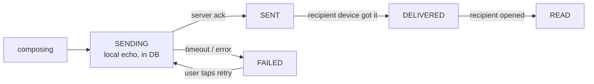
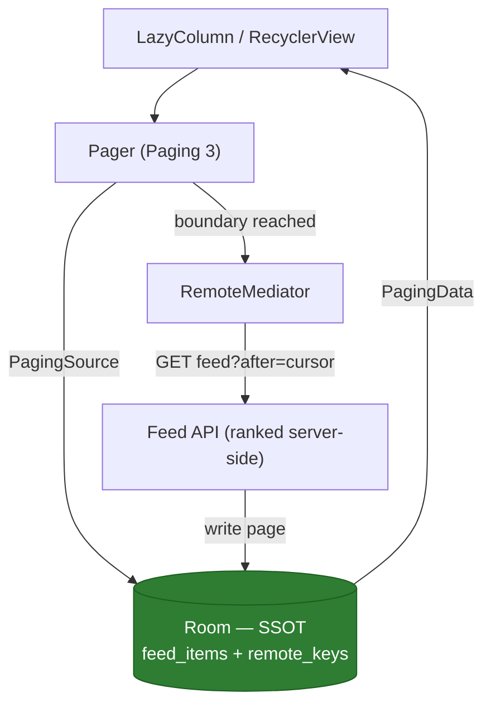

# Case Study: Chat & Feed

Two of the most common senior prompts: **"Design a chat/messaging client"** and **"Design Instagram's feed."** They share a spine (local DB as SSOT, optimistic writes, pagination) but stress different axes — chat is realtime + ordering + delivery state; feed is paging + caching + prefetch.

---

## Part 1 — Chat client

### Scope

- Send/receive 1:1 and group messages; delivery states; message history; works degraded offline (queue sends, read cached history); realtime delivery when connected.
- Non-functional: **ordering must be stable**, sends must be **idempotent**, reconnection must **backfill** missed messages, unread counts must be correct.

### Message model & states

Client generates the message ID so we can render immediately (**local echo**) and dedupe on the server.

```kotlin
enum class MessageState { SENDING, SENT, DELIVERED, READ, FAILED }

@Entity(
    tableName = "messages",
    indices = [Index(value = ["conversationId", "serverSeq"])]
)
data class MessageEntity(
    @PrimaryKey val clientId: String,     // UUID generated on-device → idempotency key
    val serverId: String? = null,         // assigned by server on ack
    val conversationId: String,
    val senderId: String,
    val body: String,
    val createdAt: Long,                  // client time, for optimistic ordering
    val serverSeq: Long? = null,          // monotonic server sequence → the true order
    val state: MessageState = MessageState.SENDING,
)
```

### Message state machine



### Local echo & optimistic send

On tap: write `SENDING` to Room (UI shows it instantly with a clock icon) → transmit over the socket → on ack update to `SENT` and store `serverId`/`serverSeq`. On failure → `FAILED` with a retry affordance. Same optimistic pattern as the [offline-first case](case-offline-first.md).

### Ordering & idempotency

- **Ordering:** never trust client `createdAt` (clock skew, offline sends). The server assigns a **monotonic `serverSeq`** per conversation; the client sorts by `serverSeq`, using `createdAt` only for not-yet-acked local messages pinned at the bottom.
- **Idempotency:** the client `clientId` is the dedupe key. If a send is retried after a dropped ack, the server recognizes the `clientId` and returns the existing message instead of creating a duplicate.

### Realtime transport tradeoffs

| Transport | Latency | Battery | Delivery when app killed | Use for |
|---|---|---|---|---|
| **WebSocket** | Lowest (push, bidirectional) | Costly if held open; needs heartbeat | No (socket dies) | Foreground active chat |
| **FCM push** | Low-ish (Google-managed) | Cheap (shared channel, Doze-friendly) | **Yes** | Background/killed wake-ups |
| **Polling** | High (interval-bound) | Wasteful (empty polls) | No | Fallback / low-priority only |

!!! tip "The senior answer is hybrid"
    "**WebSocket while the chat is foregrounded** for instant bidirectional delivery, **FCM data messages to wake the app** and trigger a sync when backgrounded or killed, and I'd only fall back to polling if a push channel is unavailable. FCM is the delivery guarantee; the socket is the low-latency optimization." Committing to a single transport is the weak answer.

### Reconnection & backfill

Sockets drop constantly on mobile. On reconnect: the client sends its **last known `serverSeq`** per conversation; the server streams everything after it. Combined with FCM-triggered syncs, the client converges no matter how it missed messages. Pagination and backfill use the **same cursor mechanism**.

### History pagination — keyset over offset

Load older messages by cursor, not offset:

```
GET /conversations/{id}/messages?before=<serverSeq>&limit=30
```

Offset pagination (`?page=2`) breaks the instant new messages arrive (rows shift, you get duplicates or gaps) and degrades at depth. **Keyset/cursor** is stable under insertion — essential for a live-updating list.

### Unread counts

Track a per-conversation `lastReadSeq` locally and server-side. Unread = messages with `serverSeq > lastReadSeq`. Compute from the DB (a `COUNT` query the UI observes) rather than an in-memory counter that desyncs after process death. Sync `lastReadSeq` so counts match across devices.

---

## Part 2 — Social feed

### Scope

- Infinite-scroll ranked feed; pull-to-refresh; smooth scrolling; works offline (show last cached page); **ranking is server-side** (the client must not re-rank).

### Paging 3 + RemoteMediator with Room

The feed is **network + DB backed**: Room is the SSOT the list observes; `RemoteMediator` fetches pages from the network and writes them into Room. The UI paginates against the DB, so it scrolls offline from cache.



```kotlin
@OptIn(ExperimentalPagingApi::class)
class FeedRemoteMediator(
    private val db: AppDatabase,
    private val api: FeedApi,
) : RemoteMediator<Int, FeedItemEntity>() {

    override suspend fun load(
        loadType: LoadType,
        state: PagingState<Int, FeedItemEntity>,
    ): MediatorResult = try {
        val cursor = when (loadType) {
            LoadType.REFRESH -> null
            LoadType.PREPEND -> return MediatorResult.Success(endOfPaginationReached = true)
            LoadType.APPEND -> db.remoteKeys().last()?.nextCursor
                ?: return MediatorResult.Success(endOfPaginationReached = true)
        }
        val resp = api.feed(after = cursor, limit = state.config.pageSize)
        db.withTransaction {
            if (loadType == LoadType.REFRESH) {           // pull-to-refresh = cache invalidation
                db.feedDao().clear()
                db.remoteKeys().clear()
            }
            db.remoteKeys().insert(RemoteKey(nextCursor = resp.nextCursor))
            db.feedDao().insertAll(resp.items)            // preserve server rank order
        }
        MediatorResult.Success(endOfPaginationReached = resp.nextCursor == null)
    } catch (e: IOException) {
        MediatorResult.Error(e)   // Paging surfaces this; UI shows cached data + retry
    }
}
```

### Cache invalidation, refresh, prefetch

- **Pull-to-refresh** = `LoadType.REFRESH`: clear the table + keys in one transaction and repopulate. Do it transactionally so the list never flashes empty.
- **Prefetch:** Paging's `prefetchDistance` triggers the next page load *before* the user hits the bottom → no scroll stalls.
- **Staleness/TTL:** stamp pages with a fetch time; if the cached feed is older than N minutes on cold start, kick a background refresh while showing stale data (cache-then-network).
- **Media:** delegate image loading to a dedicated pipeline (see [image case](case-image-pipeline.md)) — the feed stores URLs, not bitmaps.

!!! warning "Ranking belongs on the server"
    Never re-sort the feed on the client. The server owns ranking (personalization, ML, freshness); the client's job is to **display server order faithfully** and page through it. Client-side re-ranking causes items to jump between sessions and diverge from what analytics expect.

!!! quote "Chat vs feed in one line"
    "**Chat** is a write-optimistic, ordered, realtime problem — the hard parts are delivery state, idempotent sends, `serverSeq` ordering, and reconnect backfill. **Feed** is a read-optimistic, paged, cached problem — the hard parts are keyset paging, transactional refresh, prefetch, and trusting server-side ranking. Both keep the **DB as the single source of truth** and use **cursors, never offsets**."
