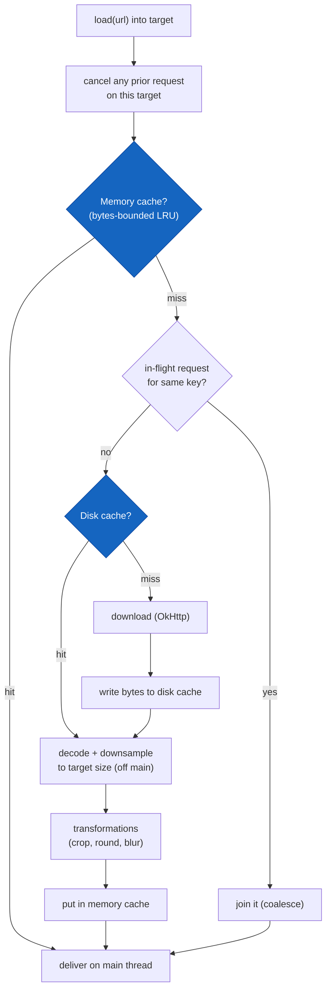

# Case Study: Image Loading Pipeline

**Prompt:** *"Design an image loading library (like Glide/Coil)."*

A classic senior prompt because it packs memory management, caching tiers, concurrency, cancellation, and API design into one problem. The failure mode it probes for is **OOM** — loading a 12 MP photo into a 100 dp thumbnail crashes low-RAM devices. Show you understand the device is memory-starved.

## Scope & constraints

- Load a remote (or local) image into a target `ImageView`/Compose slot by URL.
- **Never OOM:** decode to the *target* size, not the source size.
- **Fast on scroll:** memory-cache hits must be instant; decode off the main thread.
- **Cancel** in-flight work when the target is recycled (RecyclerView) or leaves composition.
- **Coalesce** duplicate requests for the same image.
- Placeholder while loading, error image on failure.

## Request flow



Two-tier cache is the backbone: **memory** (fast, small, volatile — decoded bitmaps) then **disk** (slower, larger, survives restarts — encoded bytes). Memory caches *decoded* bitmaps keyed by URL **+ size + transformations**; disk caches the *raw encoded* bytes keyed by URL.

## Loader API sketch

```kotlin
interface ImageLoader {
    fun enqueue(request: ImageRequest): Disposable   // async, returns a cancel handle
    suspend fun execute(request: ImageRequest): ImageResult
}

data class ImageRequest(
    val url: String,
    val target: Target,                 // View, Compose slot, or callback
    val targetSize: Size,               // measured dst size → downsample goal
    val placeholder: Drawable? = null,
    val error: Drawable? = null,
    val transformations: List<Transformation> = emptyList(),
    val lifecycle: Lifecycle? = null,   // auto-cancel on destroy
)

fun interface Disposable { fun dispose() }   // cancels the coroutine + frees the target
```

The **cache key** must include size and transformations, or a thumbnail request will collide with a full-screen request:

```kotlin
fun cacheKey(r: ImageRequest): String =
    buildString {
        append(r.url)
        append("#${r.targetSize.width}x${r.targetSize.height}")
        r.transformations.forEach { append("#").append(it.key) }
    }
```

## Bytes-bounded LRU memory cache

Bound the cache by **bytes**, not entry count — one full-screen bitmap can dwarf a thousand thumbnails. Size it as a fraction of available heap.

```kotlin
class MemoryCache(maxBytes: Int) {
    private val lru = object : LruCache<String, Bitmap>(maxBytes) {
        override fun sizeOf(key: String, value: Bitmap): Int = value.allocationByteCount
    }
    operator fun get(key: String): Bitmap? = lru.get(key)
    fun put(key: String, bmp: Bitmap) = lru.put(key, bmp)

    companion object {
        fun defaultSizeBytes(ctx: Context): Int {
            val am = ctx.getSystemService(Context.ACTIVITY_SERVICE) as ActivityManager
            val perAppMb = if (ctx.isLowRam()) am.memoryClass else am.largeMemoryClass
            return (perAppMb * 1024 * 1024) / 8      // ~1/8 of the heap budget
        }
    }
}
```

## Downsampling — the anti-OOM core

Decode bounds first, then decode the pixels at the nearest power-of-two subsample so you allocate a bitmap near the target size instead of the source.

```kotlin
fun decodeSampled(bytes: ByteArray, reqW: Int, reqH: Int): Bitmap {
    val bounds = BitmapFactory.Options().apply { inJustDecodeBounds = true }
    BitmapFactory.decodeByteArray(bytes, 0, bytes.size, bounds)  // reads dimensions only

    var sample = 1
    var (h, w) = bounds.outHeight to bounds.outWidth
    while (h / sample > reqH || w / sample > reqW) sample *= 2    // power-of-two

    val opts = BitmapFactory.Options().apply {
        inSampleSize = sample
        inPreferredConfig = Bitmap.Config.RGB_565   // half the bytes when no alpha needed
    }
    return BitmapFactory.decodeByteArray(bytes, 0, bytes.size, opts)
}
```

**Bitmap reuse (`inBitmap`):** maintain a pool of evicted bitmaps and pass a compatible one via `options.inBitmap` so the decoder reuses that allocation instead of churning the heap — fewer GC pauses during fast scroll. This is the trick Glide leans on heavily.

## Request dedup / coalescing

If ten list rows request the same avatar simultaneously, download and decode **once**. Key in-flight jobs by cache key; late callers `await` the same deferred result.

```kotlin
private val inFlight = mutableMapOf<String, Deferred<Bitmap>>()
private val mutex = Mutex()

suspend fun loadCoalesced(key: String, produce: suspend () -> Bitmap): Bitmap {
    val job = mutex.withLock {
        inFlight[key] ?: scope.async { produce() }.also { inFlight[key] = it }
    }
    return try { job.await() } finally { mutex.withLock { inFlight.remove(key) } }
}
```

## Cancellation tied to lifecycle

The single biggest correctness bug in a naive loader: a recycled RecyclerView row shows the *previous* item's image because the old request completed late. Fix it:

- **RecyclerView:** on `onViewRecycled`/rebind, `dispose()` the prior request for that target before starting the new one.
- **Compose:** launch the load in an effect keyed to the URL; leaving composition cancels the coroutine.
- **Lifecycle:** cancel/pause loads when the owner hits `STOPPED`.
- Always **tag the target** with its current request key and verify on delivery — drop the bitmap if the target has since been rebound.

## Threading

- **Main thread:** only measure target size and deliver the final bitmap.
- **IO dispatcher:** network download, disk read/write.
- **Decode dispatcher:** bounded parallelism (`Dispatchers.Default.limitedParallelism(n)`) so a burst of decodes doesn't starve the CPU or spike memory.
- Deliver back on `Dispatchers.Main`. Never decode on the main thread — it drops frames.

## Backpressure

During a fling, requests arrive faster than they complete. Cancel obsolete requests (rows scrolled past), cap concurrent decodes, and prefer serving a quick lower-res/memory-cache hit over blocking on a full decode. Bounded dispatchers + aggressive cancellation *are* the backpressure mechanism.

## How Coil & Glide solve this

| Concern | Glide | Coil |
|---|---|---|
| Language / async | Java, custom executors + callbacks | Kotlin, coroutines |
| Memory cache | LRU bitmap pool + active-resource ref counting | LRU (`MemoryCache`), weak-ref tracking |
| Bitmap reuse | Aggressive `inBitmap` pooling | Relies more on ART; lighter pooling |
| Disk cache | Custom `DiskLruCache` (transformed + source) | OkHttp disk cache + own cache |
| Cancellation | Tied to `RequestManager` + lifecycle | Structured concurrency + lifecycle |
| Size | Larger, more knobs | Smaller, idiomatic Compose support |

!!! tip "The senior framing"
    "Both are two-tier caches (memory + disk) with lifecycle-scoped cancellation and downsampled decoding. **Glide** optimizes heap churn hard via bitmap pooling and `inBitmap` — it shines on low-end devices and long lists. **Coil** is coroutine-native and integrates cleanly with Compose, trading some manual pooling for ART's improved allocator. I'd pick Coil for a modern Compose app and Glide when I'm squeezing GC pauses on low-RAM hardware."

!!! warning "Red flags in this prompt"
    - Decoding at full resolution → **OOM**. Downsampling isn't optional.
    - No cancellation → **wrong image** in recycled rows.
    - No request coalescing → same avatar downloaded N times.
    - Memory cache bounded by *count* not *bytes* → one big image blows the budget.
    - Decoding on the main thread → dropped frames / jank.
