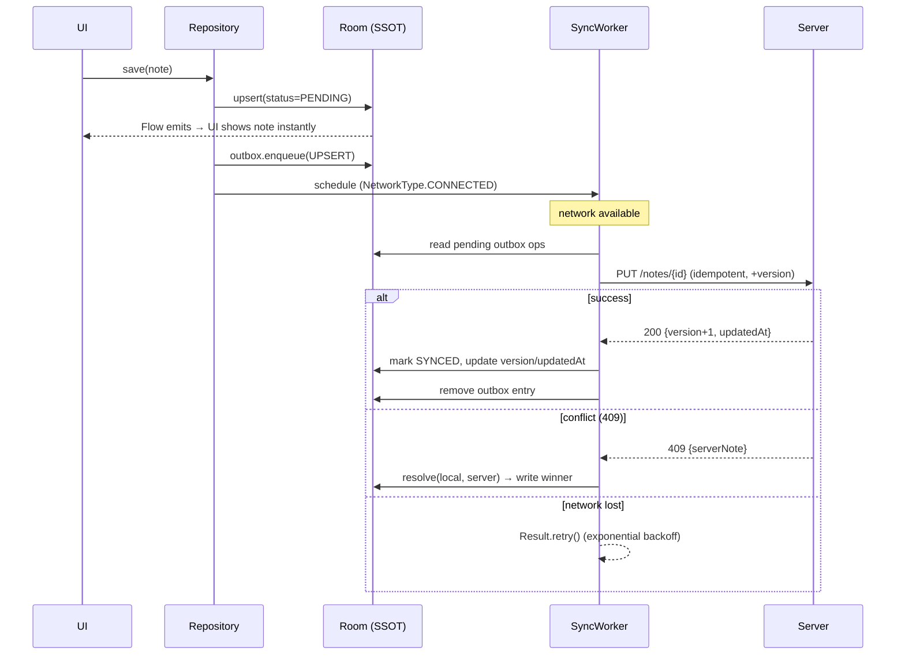

# Case Study: Offline-First App

**Prompt:** *"Design a notes/tasks app that works fully offline and syncs across the user's devices."*

This is the canonical mobile SD question because it forces every hard client topic: single source of truth, a write queue, conflict resolution, deltas, and deletes. Walk it with the [6-step framework](framework.md).

## Step 1 — Scope

- **Functional:** create/edit/delete notes; list; search; works with zero network; syncs across the same user's devices.
- **Offline:** full **offline writes** (not just reads) — the differentiator.
- **Scale:** thousands of notes per device — fits comfortably in SQLite; no paging needed for correctness, but paginate the list UI.
- **Consistency:** same account on 2+ devices can edit the same note → **conflict resolution required**.
- **Freshness:** seconds of staleness fine; no hard realtime.

## Step 2 — Data model

Every entity carries **sync metadata**. IDs are **client-generated UUIDs** so notes can be created offline and writes stay idempotent.

```kotlin
enum class SyncStatus { SYNCED, PENDING, FAILED }

@Entity(tableName = "notes")
data class NoteEntity(
    @PrimaryKey val id: String,          // client-generated UUID
    val title: String,
    val body: String,
    val updatedAt: Long,                 // server clock on last successful sync
    val localUpdatedAt: Long,            // device clock of last local edit
    val version: Int = 0,                // for optimistic concurrency / conflict detection
    val syncStatus: SyncStatus = SyncStatus.PENDING,
    val deleted: Boolean = false,        // tombstone — never hard-delete until GC'd server-side
)
```

The **outbox** table records intent, decoupled from entity state, so replays and ordering are explicit:

```kotlin
enum class OpType { UPSERT, DELETE }

@Entity(tableName = "outbox")
data class OutboxEntry(
    @PrimaryKey(autoGenerate = true) val opId: Long = 0,
    val entityId: String,
    val type: OpType,
    val payload: String,      // serialized note snapshot
    val createdAt: Long,
    val attempts: Int = 0,
)
```

## Step 3 — Architecture: Room is the SSOT

The repository exposes a **`Flow` from the DB**. The UI observes it and never touches Retrofit. The sync worker and the repo write results back into Room, which re-emits automatically.

```kotlin
class NotesRepository(
    private val dao: NoteDao,
    private val outbox: OutboxDao,
    private val api: NotesApi,
    private val workManager: WorkManager,
) {
    // READ PATH — single source of truth is the DB.
    fun observeNotes(): Flow<List<NoteEntity>> =
        dao.observeVisible()   // WHERE deleted = 0 ORDER BY localUpdatedAt DESC

    // WRITE PATH — optimistic: write DB first, enqueue sync, return immediately.
    suspend fun upsert(note: NoteEntity) {
        val local = note.copy(
            localUpdatedAt = System.currentTimeMillis(),
            syncStatus = SyncStatus.PENDING,
        )
        dao.upsert(local)                                   // UI updates instantly
        outbox.enqueue(OutboxEntry(
            entityId = local.id, type = OpType.UPSERT,
            payload = local.toJson(), createdAt = local.localUpdatedAt,
        ))
        scheduleSync()
    }

    suspend fun delete(id: String) {
        dao.markDeleted(id)                                 // tombstone, not DELETE
        outbox.enqueue(OutboxEntry(
            entityId = id, type = OpType.DELETE,
            payload = "{}", createdAt = System.currentTimeMillis(),
        ))
        scheduleSync()
    }

    private fun scheduleSync() {
        val req = OneTimeWorkRequestBuilder<SyncWorker>()
            .setConstraints(Constraints(requiredNetworkType = NetworkType.CONNECTED))
            .setBackoffCriteria(BackoffPolicy.EXPONENTIAL, 10, TimeUnit.SECONDS)
            .build()
        workManager.enqueueUniqueWork("notes-sync", ExistingWorkPolicy.APPEND_OR_REPLACE, req)
    }
}
```

## The optimistic write + sync sequence



## Optimistic updates + rollback

The UI shows the change immediately. If the op **terminally** fails (validation 4xx, not a transient network error), roll back or flag:

```kotlin
// inside SyncWorker, on terminal failure for an UPSERT:
val server = api.getNote(entry.entityId)          // re-fetch authoritative state
if (server == null) {
    dao.deleteHard(entry.entityId)                // our create was rejected → remove
} else {
    dao.upsert(server.toEntity(SyncStatus.SYNCED)) // revert to server truth
}
dao.markFailedFlag(entry.entityId)                // let UI show a "couldn't save" badge
outbox.remove(entry.opId)
```

Rollback rule of thumb: **retry** transient failures (network, 5xx, timeout); **roll back** terminal failures (4xx). Never leave a note stuck as `PENDING` forever with no user feedback.

## The SyncWorker (delta pull + outbox push)

```kotlin
class SyncWorker(ctx: Context, params: WorkerParameters) : CoroutineWorker(ctx, params) {
    override suspend fun doWork(): Result = try {
        // 1. PUSH local changes (outbox), in order.
        outbox.pending().forEach { op ->
            when (op.type) {
                OpType.UPSERT -> pushUpsert(op)
                OpType.DELETE -> pushDelete(op)
            }
        }
        // 2. PULL deltas since last cursor.
        val cursor = prefs.getSyncCursor()
        val delta = api.sync(since = cursor)        // { changed, deleted, nextCursor }
        db.withTransaction {
            delta.changed.forEach { dao.upsert(it.toEntity(SyncStatus.SYNCED)) }
            delta.deleted.forEach { dao.applyTombstone(it.id, it.deletedAt) }
        }
        prefs.setSyncCursor(delta.nextCursor)
        Result.success()
    } catch (e: IOException) {
        Result.retry()          // transient → backoff
    } catch (e: HttpException) {
        if (e.code() in 500..599) Result.retry() else Result.failure()
    }
}
```

## Conflict resolution strategies

Same note edited on two devices. Choose based on the product:

| Strategy | How it works | Pros | Cons | Use when |
|---|---|---|---|---|
| **Last-write-wins (LWW)** | Highest timestamp/version wins | Trivial | Silently loses one edit; clock-skew hazard | Low-stakes, single-user-multi-device |
| **Server-authoritative** | Server validates; on 409 client takes server copy | Simple, safe, one truth | Client edits can be discarded | Default when unsure |
| **Versioning (optimistic concurrency)** | `If-Match: version`; mismatch → 409 → merge | Detects conflicts explicitly | Needs merge/UI story | Editable shared docs |
| **Vector clocks / CRDTs** | Track causal history, merge deterministically | Convergent, no lost updates | Complex, heavier payloads | True collaborative editing |

!!! tip "What to say"
    "I'd default to **server-authoritative with optimistic concurrency** — client sends `version`, server returns 409 on mismatch, and I resolve field-level where possible, falling back to LWW with a user-visible 'conflicting versions' note so we never silently drop data. Full CRDTs are overkill unless we need Google-Docs-style live co-editing." Mentioning that LWW can *lose data* is the senior insight.

## Delta sync with `updatedAt` cursors

Full re-download doesn't scale and wastes battery/data. Instead the client keeps an opaque cursor (or a max `updatedAt`) and asks only for changes since. Use an **opaque server cursor** rather than raw `updatedAt` when possible — it survives clock skew and ties/precision issues at the millisecond boundary.

## Handling deletes: tombstones

A hard `DELETE` is invisible to sync — the other device never learns the row vanished and may resurrect it. Instead:

1. Mark `deleted = true` locally, hide from UI (`WHERE deleted = 0`).
2. Push a `DELETE` op; server records a **tombstone** with `deletedAt`.
3. The delta pull returns tombstones so other devices delete too.
4. Server **garbage-collects** tombstones after a retention window (e.g. 30 days) — long enough for all devices to sync.

!!! warning "Failure modes to volunteer"
    - **Process death mid-sync:** everything is in Room + outbox on disk; the unique work re-runs on next launch. No lost writes.
    - **Duplicate replay:** idempotent `PUT /{clientId}` makes re-pushing a pending op harmless.
    - **Outbox ordering:** process ops FIFO per entity so an UPSERT never lands after its DELETE.
    - **Clock skew:** never sort by device time; use server `updatedAt`/version for authority.
    - **Storage pressure:** cap history, GC synced tombstones locally too.
