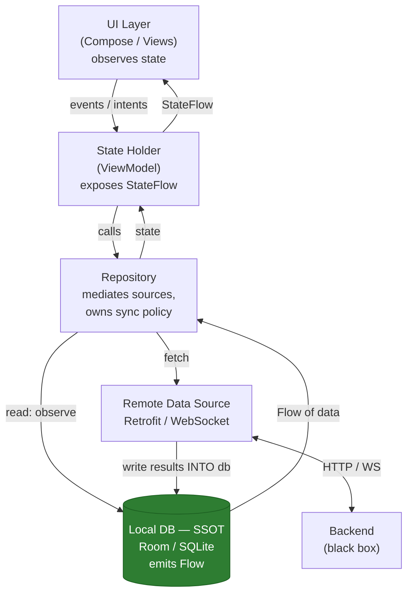

# The 6-Step Framework

Use this structure on **every** mobile system design prompt. It keeps you from jumping to code, and it maps directly onto what interviewers grade. Say the step names out loud as you go — it signals seniority and stops you rambling.

!!! tip "The 30-second version"
    1. **Clarify** scope (offline? realtime? scale?) → 2. **Model** data + API contract → 3. **Layer** the architecture (UI → repo → local + remote, SSOT = DB) → 4. **Sync/cache** strategy → 5. **Cross-cutting** (auth, errors, observability, security, testing) → 6. **Failure modes & tradeoffs**.

    Spend the *first 5 minutes* on step 1. Interviewers who fail candidates almost always cite "started designing before understanding the problem."

## Step 1 — Clarify requirements & scope

Never draw a box until you've bounded the problem. Separate functional from non-functional, and pin down the numbers.

**Functional:** What can the user do? What are the core entities? Read-heavy or write-heavy? Single-user or shared/collaborative?

**Non-functional — the checklist to always run:**

- [ ] **Offline?** Read-only offline, or full offline writes? This single answer reshapes the entire design.
- [ ] **Realtime?** Live updates (chat, presence) or is stale-for-a-few-seconds fine?
- [ ] **Scale?** Data volume *per user* on device (100 items or 1M?). Not server QPS — device-local size.
- [ ] **Consistency needs?** Can two devices edit the same object? Who wins?
- [ ] **Freshness / staleness tolerance?** How old can cached data be before it's wrong?
- [ ] **Multi-device?** Same account on phone + tablet needs sync convergence.
- [ ] **Platform constraints?** Min SDK, target devices (low-end matters for RAM/CPU), storage budget.
- [ ] **Latency budget?** First meaningful paint on cold start; acceptable action-to-feedback delay.
- [ ] **Security/compliance?** PII, encryption at rest, auth model, regulated data (health/finance)?

!!! example "Scoping in one line"
    "So this is a **write-capable, offline-first**, single-user notes app, ~thousands of notes per device, must **converge across 2+ devices**, staleness of a few seconds is fine, no hard realtime — correct?" Getting a yes here earns you the rest of the round.

## Step 2 — Data model & API contract

Define the entities the client stores and the shape of the wire protocol. Seniors design the **contract**, not just the endpoints.

- **Entities & keys:** Prefer **client-generated IDs** (UUID) so you can create objects offline without a server round-trip and keep writes idempotent.
- **Sync metadata on every entity:** `updatedAt` (server clock), `syncStatus`, `version`/`etag`, `deleted` (tombstone flag).
- **Paging:** Use **keyset/cursor pagination** (`?after=<cursor>&limit=50`), not offset — offset breaks when items are inserted/deleted between pages and gets slow at depth.
- **Deltas:** The sync endpoint should accept a cursor and return only changes: `GET /sync?since=<updatedAt|opaqueCursor>` → `{ changed: [...], deleted: [...], nextCursor }`.
- **Idempotency:** Writes carry a client-generated key so retries don't double-apply. `PUT /notes/{clientId}` is naturally idempotent; `POST` needs an `Idempotency-Key` header.

| Concern | Weak answer | Senior answer |
|---|---|---|
| IDs | Server auto-increment | Client UUID, server accepts it |
| List fetch | `?page=3&size=20` (offset) | `?after=<cursor>&limit=20` (keyset) |
| Refresh | Re-download everything | Delta sync with `since` cursor |
| Retry safety | Hope it doesn't double-post | Idempotency key / idempotent PUT |
| Deletes | Row disappears | Tombstone with `deletedAt`, GC later |

## Step 3 — Layered architecture (the canonical diagram)

This is the backbone answer. **The local database is the single source of truth (SSOT). The UI never reads the network directly.** The network's only job is to feed the database; the UI observes the database reactively.

The critical arrows: **`NET` writes into `DB`**, and **`UI` reads from `DB`** (via repo/VM). There is **no arrow from `NET` straight to `UI`**. That single discipline gives you:

- **Offline for free** — the DB has data whether or not the network responded.
- **One consistent value** — every screen observing the same query sees identical data.
- **Reactive updates** — a background sync writing to the DB automatically refreshes every open screen.
- **Survives process death** — state is on disk, not in memory.

!!! warning "The anti-pattern this kills"
    UI (or ViewModel) calling Retrofit directly and holding the response in a `StateFlow`. Now you have two sources of truth, no offline story, and a blank screen whenever the network is slow. If you draw an arrow from network to UI, expect to be challenged.

## Step 4 — Offline / caching / sync strategy

Given the SSOT diagram, spell out the two paths and the caching policy.

- **Read path:** UI observes a DB query → returns instantly from cache → repository *also* triggers a refresh → network result is written to DB → UI updates automatically. (Cache-then-network.)
- **Write path:** Write to DB immediately (optimistic) with `syncStatus = PENDING` → UI reflects it at once → enqueue a sync job → on success mark `SYNCED`, on failure retry or roll back.
- **Sync trigger:** `WorkManager` with `NetworkType.CONNECTED` constraint for background/deferred sync; foreground refresh on screen open / pull-to-refresh.
- **Cache invalidation:** TTL for read-through caches, `etag`/`updatedAt` for conditional fetches, explicit invalidation on mutation.
- **Conflict resolution:** last-write-wins (simple), server-authoritative (safe default), or versioning/vector clocks (collaborative). Covered in depth in the [offline-first case](case-offline-first.md).

| Strategy | When to use | Cost |
|---|---|---|
| Cache-only | Static reference data | Goes stale |
| Cache-then-network | Most read screens | Brief flash of stale data |
| Network-then-cache | Freshness-critical, online-only | Blank on slow/no network |
| Offline-first (write queue) | Writes must work offline | Conflict handling complexity |

## Step 5 — Cross-cutting concerns

Sprinkle these throughout; naming them unprompted is a strong senior signal.

- **Auth:** Token storage in `EncryptedSharedPreferences`/Keystore, silent refresh via an OkHttp `Authenticator`, single-flight refresh so concurrent 401s don't stampede the refresh endpoint, logout clears local DB.
- **Error handling:** Model results as a sealed `Result` type (`Success`/`Error`/`Loading`); distinguish retryable (network, 5xx) from terminal (4xx, validation); surface user-facing messages vs. silent background retries.
- **Observability:** Structured logging, crash reporting (Crashlytics), analytics on key funnels, sync success/failure metrics, network timing. You can't fix flakiness you can't see.
- **Security:** No secrets in the APK, TLS + optional certificate pinning, encrypt sensitive data at rest, obey least-privilege on permissions, scrub PII from logs.
- **Testing:** Repository unit tests with fake data sources, DAO tests against in-memory Room, sync/conflict logic tested deterministically, `WorkManager` `TestDriver`, UI tests for offline states.

## Step 6 — Failure modes & tradeoffs

Close every design by walking failure modes. This is where seniors separate from mid-levels.

- **Network dies mid-write** → write is already in DB as `PENDING`; WorkManager retries with backoff when connectivity returns.
- **Process killed mid-sync** → all state is on disk; the outbox still holds pending ops; sync resumes on next launch. Nothing in-memory-only.
- **Token expires** → Authenticator refreshes and replays the request; if refresh fails, force re-auth without losing local data.
- **Disk full** → writes fail gracefully; eviction policy frees cache; never crash.
- **Clock skew** → never trust device time for ordering; use server timestamps or logical versions.
- **Conflict on sync** → apply the chosen resolution; keep an audit trail; never silently drop user data.
- **Duplicate delivery** → idempotency keys / client IDs make replays safe.

!!! quote "How to end the round"
    "The main tradeoff I'm making is **offline-first complexity** (outbox, conflict resolution, tombstones) in exchange for an app that's **instant and works with no network**. If the product were online-only I'd drop the write queue and use network-then-cache, which is far simpler but useless in a subway. Given the requirement to work offline, the complexity is justified." — naming the tradeoff *and* the alternative is the senior close.
